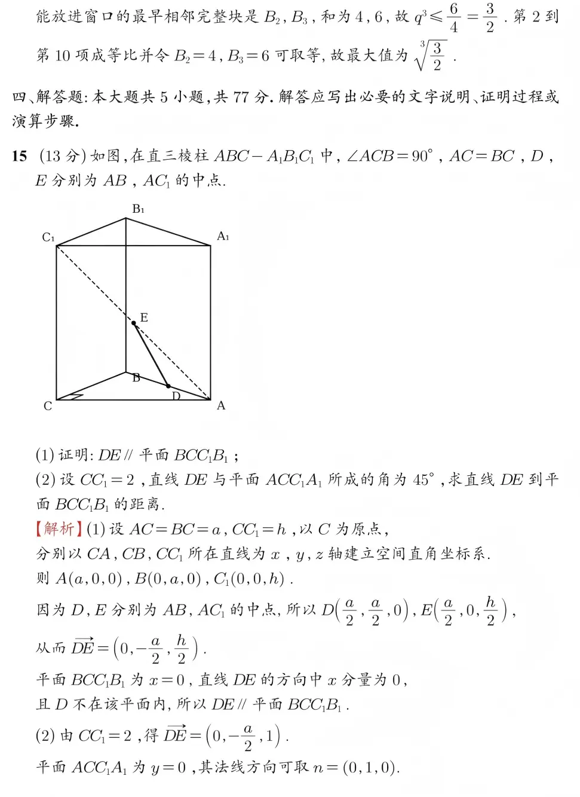

# 2026 年普通高等学校招生全国统一考试数学试题（Markdown 初稿）

> 状态：人工转写初稿，公式已尽量转换为 LaTeX。  
> 用途：AgentCube / math-agent 数学 benchmark 数据整理。  
> 注意：本文件由本地图片材料转写，开源发布前需要再次核对题面、答案、来源授权和图片版权。几何图暂时保留原图引用，后续可裁剪为单题图片。

## 元数据

- 科目：数学
- 卷种：2026 年普通高等学校招生全国统一考试（全国统考）
- 原始图片目录：`/home/agentcube/benchmark-data`
- 题面原图：`question.png`
- 答案解析图：`answer-01.png` 至 `answer-10.png`

## 注意事项

1. 答卷前，考生务必将自己的姓名、考生号、考场号、座位号填写在答题卡上。
2. 回答选择题时，选出每小题答案后，用铅笔把答题卡上对应题目的答案标号涂黑。如需改动，用橡皮擦干净后，再选涂其他答案标号。回答非选择题时，将答案写在答题卡上。写在本试卷上无效。
3. 考试结束后，将本试卷和答题卡一并交回。

---

## 一、选择题

本题共 8 小题，每小题 5 分，共 40 分。在每小题给出的四个选项中，只有一项是符合题目要求的。

### 1.

样本数据 $6,8,4,5,12$ 的中位数为（ ）

A. $5$  
B. $6$  
C. $8$  
D. $9$

**答案：B**

**解析：** 将数据从小到大排列为 $4,5,6,8,12$，中间数为 $6$。

### 2.

已知平面向量 $\vec a,\vec b$ 不共线，且

$$
2\vec a+y\vec b=x\vec a-3\vec b,
$$

则（ ）

A. $x=2,\ y=-3$  
B. $x=-2,\ y=3$  
C. $x=2,\ y=3$  
D. $x=-2,\ y=-3$

**答案：A**

**解析：** 因为 $\vec a,\vec b$ 不共线，所以对应系数相等，得 $x=2,\ y=-3$。

### 3.

已知集合

$$
A=\left\{\sin\frac{7\pi}{6},\ \cos\frac{5\pi}{3},\ \tan\frac{5\pi}{4}\right\},
\quad
B=\left\{-\frac{\sqrt3}{2},\ -\frac12,\ 1\right\},
$$

则 $A\cap B=$（ ）

A. $\left\{-\dfrac{\sqrt3}{2},-\dfrac12\right\}$  
B. $\left\{-\dfrac{\sqrt3}{2},1\right\}$  
C. $\left\{-\dfrac12,1\right\}$  
D. $\left\{-\dfrac{\sqrt3}{2},-\dfrac12,1\right\}$

**答案：C**

**解析：**

$$
\sin\frac{7\pi}{6}=-\frac12,\quad
\cos\frac{5\pi}{3}=\frac12,\quad
\tan\frac{5\pi}{4}=1.
$$

所以 $A=\left\{-\dfrac12,\dfrac12,1\right\}$，故

$$
A\cap B=\left\{-\frac12,1\right\}.
$$

### 4.

曲线

$$
y=5x+8\ln x
$$

在点 $(1,5)$ 处的切线方程为（ ）

A. $y=3x+2$  
B. $y=5x$  
C. $y=8x-3$  
D. $y=13x-8$

**答案：D**

**解析：** $y'=5+\dfrac8x$，当 $x=1$ 时，$y'=13$。切线为

$$
y-5=13(x-1),
$$

即 $y=13x-8$。

### 5.

已知抛物线

$$
C_1:y^2=2p_1x\quad(p_1>0),\qquad
C_2:x^2=2p_2y\quad(p_2>0)
$$

均经过点 $(4,8)$，则 $C_1$ 的焦点与 $C_2$ 的焦点之间的距离为（ ）

A. $12$  
B. $4\sqrt5$  
C. $6$  
D. $\dfrac{\sqrt{65}}2$

**答案：D**

**解析：** 由 $64=8p_1$ 得 $p_1=8$；由 $16=16p_2$ 得 $p_2=1$。  
$y^2=2px$ 的焦点为 $\left(\dfrac p2,0\right)$，$x^2=2py$ 的焦点为 $\left(0,\dfrac p2\right)$。  
所以两焦点为 $(4,0)$ 与 $\left(0,\dfrac12\right)$，距离为

$$
\sqrt{4^2+\left(\frac12\right)^2}=\frac{\sqrt{65}}2.
$$

### 6.

已知函数

$$
f(x)=\frac{x+2}{e^x+a}
$$

的最大值为 $1$，则 $a=$（ ）

A. $\dfrac12$  
B. $1$  
C. $\dfrac32$  
D. $2$

**答案：B**

**解析：** 由选项知 $a>0$，分母恒正。最大值为 $1$，即

$$
x+2\le e^x+a
$$

对一切 $x$ 成立，且能取等。设

$$
h(x)=x+2-e^x,
$$

则 $h'(x)=1-e^x$，当 $x=0$ 时 $h(x)$ 最大，且 $h(0)=1$，故 $a=1$。

### 7.

一百零八塔位于宁夏回族自治区青铜峡市，以其独特的建筑格局和深远的历史文化闻名遐迩。该塔群共有 $108$ 座塔，依山势自上而下排成 $12$ 行，将第 $i$ 行中塔的座数记为 $a_i(i=1,2,\cdots,12)$，其中

$$
a_1=1,\quad a_2=a_3=3,\quad a_4=a_5=5,
$$

且 $a_6,a_7,\cdots,a_{12}$ 是一个首项为 $7$、公差为 $2$ 的等差数列。将 $a_1,a_2,\cdots,a_{12}$ 分为 $6$ 组，每组 $2$ 个数，使得每组的 $2$ 个数之和可构成一个项数为 $6$ 且公差为 $d(d>0)$ 的等差数列，则 $d=$（ ）

A. $2$  
B. $4$  
C. $6$  
D. $8$

**答案：B**

**解析：** 当 $n\ge 6$ 时，

$$
a_n=7+(n-6)2=2n-5.
$$

设新数列为 $\{b_n\}$，$\{b_n\}$ 为等差数列，

$$
6b_1+\frac{6\times5}{2}d=108,
$$

即 $2b_1+5d=36$。结合 $b_1,d\in\mathbb N$，可得 $b_1=8,d=4$。

### 8.

设

$$
U=\{(x_1,x_2,x_3)\mid x_i\in\{-2,-1,1,2\},\ i=1,2,3\}
$$

为空间中 $64$ 个点构成的集合，点 $P(1,1,1)$，记样本空间

$$
\Omega=U\setminus\{P\}.
$$

从 $\Omega$ 中随机取一个点，定义随机变量 $X$ 如下：对 $\Omega$ 中的每个点 $A(x_1,x_2,x_3)$，令

$$
X(A)=x_1+x_2+x_3,
$$

则 $X$ 的数学期望为（ ）

A. $-\dfrac1{21}$  
B. $-\dfrac1{63}$  
C. $0$  
D. $\dfrac17$

**答案：A**

**解析：** 对 $U$ 中所有点求和，每个坐标中 $-2,-1,1,2$ 各出现 $16$ 次，所以

$$
\sum_{A\in U}X(A)=3\times16\times(-2-1+1+2)=0.
$$

去掉 $P(1,1,1)$ 后，少掉的值为 $X(P)=3$，于是

$$
\sum_{A\in\Omega}X(A)=0-3=-3,\qquad |\Omega|=63.
$$

故

$$
E(X)=\frac{-3}{63}=-\frac1{21}.
$$

---

## 二、选择题

本题共 3 小题，每小题 6 分，共 18 分。在每小题给出的选项中，有多项符合题目要求。全部选对的得 6 分，部分选对的得部分分，有选错的得 0 分。

### 9.

设 $z=3+2i$，则（ ）

A. $\bar z=3-2i$  
B. $|z|=5$  
C. $z^2=5+12i$  
D. $\dfrac{z+3}{z-i}\in\mathbb R$

**答案：ACD**

**解析：** 由 $z=3+2i$，得 $\bar z=3-2i$，A 正确；

$$
|z|=\sqrt{3^2+2^2}=\sqrt{13}\ne 5,
$$

B 错；

$$
z^2=(3+2i)^2=9+12i-4=5+12i,
$$

C 正确；

$$
\frac{z+3}{z-i}
=\frac{6+2i}{3+i}
=\frac{(6+2i)(3-i)}{10}
=2\in\mathbb R,
$$

D 正确。

### 10.

在空间中，$A,B$ 为两个定点，动点 $C$ 到直线 $AB$ 的距离为 $2$，动点 $D$ 到直线 $AB$ 的距离为 $1$，若二面角 $C-AB-D$ 为 $60^\circ$，则（ ）

A. $\angle CAD\ge 60^\circ$  
B. $CD\ge \sqrt3$  
C. 当 $AB\perp CD$ 时，$CD\perp$ 平面 $ABD$  
D. 当 $AB\perp$ 平面 $ACD$ 时，$AC\perp AD$

**答案：BC**

**解析：** 以直线 $AB$ 为 $x$ 轴，设 $A$ 为原点，

$$
C=(x_1,u_1,u_2),\qquad D=(x_2,v_1,v_2).
$$

则

$$
u_1^2+u_2^2=4,\qquad v_1^2+v_2^2=1,\qquad u_1v_1+u_2v_2=1.
$$

- A：取 $x_1=x_2=t$，则 $\cos\angle CAD\to 1$，所以 $\angle CAD$ 可以小于 $60^\circ$，A 错。
- B：

$$
CD^2=(x_1-x_2)^2+(u_1-v_1)^2+(u_2-v_2)^2
=(x_1-x_2)^2+4+1-2\ge 3,
$$

所以 $CD\ge\sqrt3$，B 正确。

- C：若 $AB\perp CD$，则 $x_1=x_2$。此时直线 $CD$ 与 $AD$ 的方向向量数量积为

$$
(0,v_1-u_1,v_2-u_2)\cdot(x_1,v_1,v_2)
=(v_1^2+v_2^2)-(u_1v_1+u_2v_2)=1-1=0.
$$

又 $CD\perp AB$，所以 $CD\perp$ 平面 $ABD$，C 正确。

- D：若 $AB\perp$ 平面 $ACD$，则 $x_1=x_2=0$，此时

$$
(u_1,u_2)\cdot(v_1,v_2)=u_1v_1+u_2v_2=1\ne 0,
$$

所以 $AC\perp AD$ 不成立，D 错。

### 11.

已知圆

$$
C_1:(x+1)^2+y^2=1,\quad
C_2:(x-1)^2+y^2=1,\quad
C_3:x^2+(y-\sqrt3)^2=1.
$$

直线 $l:y=kx+b$ 与 $C_1,C_2,C_3$ 均有两个交点。记 $l$ 被 $C_1,C_2,C_3$ 截得弦长为 $s_1,s_2,s_3$，则（ ）

A. $k$ 可以取任意实数  
B. 满足 $s_1=s_2=s_3$ 的直线 $l$ 共有 $3$ 条  
C. 满足 $s_1+s_2+s_3=3$ 的直线 $l$ 多于 $3$ 条  
D. 当 $b=0$ 时，$s_1+s_2+s_3$ 的最大值为 $\dfrac{2\sqrt{21}}3$

**答案：BCD**

**解析：** 设

$$
q=\sqrt{1+k^2},
$$

圆心到直线 $l$ 的有向距离分别为

$$
d_1=\frac{b-k}{q},\quad
d_2=\frac{b+k}{q},\quad
d_3=\frac{b-\sqrt3}{q}.
$$

则

$$
s_i=2\sqrt{1-d_i^2},
$$

且必须有 $|d_i|<1$。

答案解析较长，见原图 `answer-04.png` 与 `answer-05.png`。本题结论为 B、C、D 正确。

---

## 三、填空题

本题共 3 小题，每小题 5 分，共 15 分。

### 12.

双曲线

$$
5x^2-6y^2=1
$$

的离心率为 $\underline{\hspace{2cm}}$。

**答案：** 待校对。

### 13.

已知

$$
f(x)=2\sin(x+\theta)\quad(a\in\mathbb Z,\ 0\le \theta<2\pi)
$$

是偶函数，$f(x)$ 在区间 $\left(0,\dfrac\pi2\right)$ 单调递增，则

$$
\theta=\underline{\hspace{2cm}},\qquad f\left(\frac{2\pi}{3}\right)=\underline{\hspace{2cm}}.
$$

**答案：** $\dfrac{3\pi}{2}$；$1$。

**解析摘录：** 当 $\theta=\dfrac\pi2$ 时，$f(x)=2\cos ax$，不合单调递增；当 $\theta=\dfrac{3\pi}{2}$ 时，$f(x)=-2\cos ax$。此时 $f'(x)=2a\sin ax$，要在 $\left(0,\dfrac\pi2\right)$ 内恒为正，需 $|a|=1$ 或 $|a|=2$。于是

$$
f\left(\frac{2\pi}{3}\right)=-2\cos\frac{2\pi a}{3}=1.
$$

### 14.

设实数 $q$ 满足：存在数列 $\{a_n\}$，使得对于任意 $n\in\mathbb N^*$，均有

$$
a_1+a_2+\cdots+a_{3n}=n^2+n,
$$

且 $\{a_n\}$ 中有某连续 $9$ 项

$$
a_k,a_{k+1},\cdots,a_{k+8}
$$

是公比为 $q$ 的等比数列，则 $q$ 的最大值为 $\underline{\hspace{2cm}}$。

**答案：**

$$
\sqrt[3]{\frac32}.
$$

---

## 四、解答题

本大题共 5 小题，共 77 分。解答应写出必要的文字说明、证明过程或演算步骤。

### 15.（13 分）

如图，在直三棱柱 $ABC-A_1B_1C_1$ 中，$\angle ACB=90^\circ$，$AC=BC$，$D,E$ 分别为 $AB,AC_1$ 的中点。

1. 证明：$DE\parallel$ 平面 $BCC_1B_1$；
2. 设 $CC_1=2$，直线 $DE$ 与平面 $ACC_1A_1$ 所成的角为 $45^\circ$，求直线 $DE$ 到平面 $BCC_1B_1$ 的距离。

**答案：** 第 2 问距离为 $1$。

**解析摘录：** 设 $AC=BC=a$，$CC_1=h$，以 $C$ 为原点，分别以 $CA,CB,CC_1$ 所在直线为 $x,y,z$ 轴建立空间直角坐标系。  
则

$$
A(a,0,0),\quad B(0,a,0),\quad C_1(0,0,h).
$$

因为 $D,E$ 分别为 $AB,AC_1$ 的中点，所以

$$
D\left(\frac a2,\frac a2,0\right),\quad
E\left(\frac a2,0,\frac h2\right),
$$

从而

$$
\overrightarrow{DE}=\left(0,-\frac a2,\frac h2\right).
$$

平面 $BCC_1B_1$ 为 $x=0$，直线 $DE$ 的方向中 $x$ 分量为 $0$，且 $D$ 不在该平面内，所以 $DE\parallel$ 平面 $BCC_1B_1$。

由 $CC_1=2$，得

$$
\overrightarrow{DE}=\left(0,-\frac a2,1\right).
$$

平面 $ACC_1A_1$ 为 $y=0$，其法线方向可取 $n=(0,1,0)$。设直线 $DE$ 与平面 $ACC_1A_1$ 所成角为 $\theta$，则

$$
\sin\theta=\frac{\frac a2}{\sqrt{\frac{a^2}{4}+1}}.
$$

由 $\theta=45^\circ$，解得 $a=2$。因为 $DE\parallel$ 平面 $BCC_1B_1$，所以所求距离为 $\dfrac a2=1$。

### 16.（15 分）

已知在 $\triangle ABC$ 中，

$$
AB=3,\quad BC=2\sqrt3,\quad \cos B=\frac{\sqrt3}{3}.
$$

1. 求 $\cos A$；
2. 设 $D,E$ 两点满足：$D$ 在 $BA$ 的延长线上，$DE\parallel BC$，$AE\perp AC$。若 $DE=\sqrt6$，求 $CE$。

**答案：**

$$
\cos A=\frac13,\qquad CE=3\sqrt5.
$$

**解析摘录：** 由余弦定理，

$$
AC^2=AB^2+BC^2-2AB\cdot BC\cos B=9+12-12=9,
$$

所以 $AC=3$，从而 $AB=AC=3$。因此

$$
\cos A=\frac{AB^2+AC^2-BC^2}{2AB\cdot AC}
=\frac{9+9-12}{18}=\frac13.
$$

第 2 问以 $A$ 为原点，$AC$ 所在直线为 $x$ 轴，过 $A$ 且垂直于 $AC$ 的直线为 $y$ 轴。由第 1 问知

$$
C(3,0),\quad B(3\cos A,3\sin A)=B(1,2\sqrt2).
$$

设

$$
D=A+t(A-B),\quad t>0,
$$

则

$$
D=(-t,-2\sqrt2 t).
$$

设 $E=D+\lambda(C-B)$。因为 $DE\parallel BC$ 且 $D$ 在 $BA$ 的延长线上，所以 $\lambda>0$。  
由 $DE=\sqrt6,\ BC=2\sqrt3$，得

$$
\lambda=\frac{\sqrt6}{2\sqrt3}=\frac{\sqrt2}{2}.
$$

又 $AE\perp AC$，所以点 $E$ 的横坐标为 $0$，得

$$
-t+2\lambda=0,\quad t=2\lambda=\sqrt2.
$$

于是

$$
E=(0,-6),
$$

所以

$$
CE=\sqrt{3^2+6^2}=3\sqrt5.
$$

### 17.（15 分）

设整数 $N\ge 2$，某同学用一个球进行投篮练习，至多投篮 $N$ 次，当且仅当投中 $1$ 次时或 $N$ 次均未投中时，停止练习。设该同学每次投中的概率为 $p(0<p<1)$，各次投中与否相互独立，记 $X$ 为停止练习时该同学的投篮次数。

1. 当 $N=4,\ p=\dfrac13$ 时，求 $X$ 的分布列；
2. 设 $k,m$ 均为自然数。
   1. 当 $k\le N-1$ 时，求 $P(X>k)$；
   2. 当 $k+m\le N-1$ 时，证明：

$$
P(X>k+m\mid X>k)=P(X>m).
$$

**答案：**

当 $N=4,\ p=\dfrac13$，令 $q=1-p=\dfrac23$。当 $i=1,2,3$ 时，

$$
P(X=i)=q^{i-1}p,
$$

而

$$
P(X=4)=q^3p+q^4=q^3=\frac8{27}.
$$

所以 $X$ 的分布列为：

| $X$ | $1$ | $2$ | $3$ | $4$ |
| --- | --- | --- | --- | --- |
| $P$ | $\dfrac13$ | $\dfrac29$ | $\dfrac4{27}$ | $\dfrac8{27}$ |

第 2 问：记 $q=1-p$。当 $k\le N-1$ 时，

$$
P(X>k)=q^k=(1-p)^k.
$$

若 $k+m\le N-1$，则

$$
P(X>k+m\mid X>k)
=\frac{P(X>k+m)}{P(X>k)}
=\frac{q^{k+m}}{q^k}
=q^m.
$$

又由上式知 $P(X>m)=q^m$，故

$$
P(X>k+m\mid X>k)=P(X>m).
$$

### 18.（17 分）

已知椭圆

$$
C:\frac{x^2}{a^2}+\frac{y^2}{b^2}=1\quad(a>b>0)
$$

的左焦点为 $F(-1,0)$，离心率为 $\dfrac12$。

1. 求 $C$ 的方程；
2. 设 $O$ 为坐标原点，过 $F$ 且斜率大于 $0$ 的动直线 $l$ 与 $C$ 交于 $P,Q$ 两点，其中 $Q$ 在第三象限，直线 $PO$ 与 $C$ 的另一个交点为 $R$。
   1. 若 $\triangle PQR$ 的面积是 $\triangle PFO$ 的面积的 $3$ 倍，求 $l$ 的方程；
   2. 求 $\tan\angle PQR$ 的最小值。

**答案：** 第 1 问

$$
\frac{x^2}{4}+\frac{y^2}{3}=1.
$$

第 2 问待校对。

**解析摘录：** 椭圆左焦点为 $F(-1,0)$，故 $c=1$。离心率

$$
e=\frac ca=\frac12,
$$

所以 $a=2$，又 $b^2=a^2-c^2=4-1=3$。因此

$$
\frac{x^2}{4}+\frac{y^2}{3}=1.
$$

设直线 $l$ 的斜率为 $t>0$，过 $F(-1,0)$，故

$$
l:y=t(x+1).
$$

代入椭圆得

$$
\frac{x^2}{4}+\frac{t^2(x+1)^2}{3}=1,
$$

即

$$
(3+4t^2)x^2+8t^2x+4t^2-12=0.
$$

后续解析见原图 `answer-08.png`、`answer-09.png`。

### 19.（17 分）

已知函数 $f(x)$ 的定义域为 $\mathbb R$，且当 $x<0$ 时，

$$
f(x)=2^x.
$$

对任意 $x_0\in\mathbb R$，定义集合

$$
D(x_0)=\{d\in\mathbb R\mid f(x_0+d)>f(x_0)\}.
$$

1. 若当 $x\ge0$ 时，$f(x)=1-x$，求 $D(-1)$；
2. 若 $f(x)$ 是奇函数，$f(x_1)\le f(x_2)$，且 $x_1x_2\ne0$，证明：

$$
D(x_2)\subseteq D(x_1);
$$

3. 设 $f(x)$ 满足：
   1. 若 $f(x_1)\le f(x_2)$，则 $D(x_2)\subseteq D(x_1)$；
   2. 当 $0<x<1$ 时，$f(x)<f(0)$。

   证明：

   1. $f(0)\ge1$；
   2. $f(x)$ 在区间 $(0,+\infty)$ 单调递增。

**答案：**

1. $D(-1)=\left(0,\dfrac32\right)$。
2. 证明见解析。
3. 证明见解析。

**解析摘录：**

第 1 问：此时

$$
f(-1)=2^{-1}=\frac12.
$$

令 $x=-1+d$。当 $d<1$ 时，$x<0$，

$$
f(-1+d)=2^{-1+d}>\frac12
\iff d>0,
$$

得 $0<d<1$。当 $d\ge1$ 时，$x\ge0$，

$$
f(-1+d)=1-(-1+d)=2-d>\frac12
\iff d<\frac32,
$$

得 $1\le d<\dfrac32$。综上

$$
D(-1)=\left(0,\frac32\right).
$$

第 2、3 问解析较长，见原图 `answer-09.png`、`answer-10.png`。
