# 中文 Quick Learn About

这篇文档用于快速建立 AgentCube 相关概念的整体认知。阅读目标不是记住所有实现细节，而是先弄清楚几件事：

- Agent 是什么。
- LLM 基模和 Agent 的关系是什么。
- Harness 工程在 LLM 应用里承担什么角色。
- AI Infra、Agent Infra 分别解决什么问题。
- 为什么容器、沙箱、Kubernetes 会进入 Agent 运行时架构。
- AgentCube 在整套体系中处在什么位置。

## 一句话理解

**AgentCube 是一个面向 Kubernetes/Volcano 的 AI Agent 运行时基础设施项目，用来把 AI Agent 和 Code Interpreter 放进隔离沙箱中运行，并提供会话管理、低延迟启动、路由、休眠恢复和资源回收能力。**

它不是一个 LLM 模型，也不是一个 Agent 应用框架；它更接近 **Agent Infra**，也就是承载、调度和管理 Agent 工作负载的基础设施层。

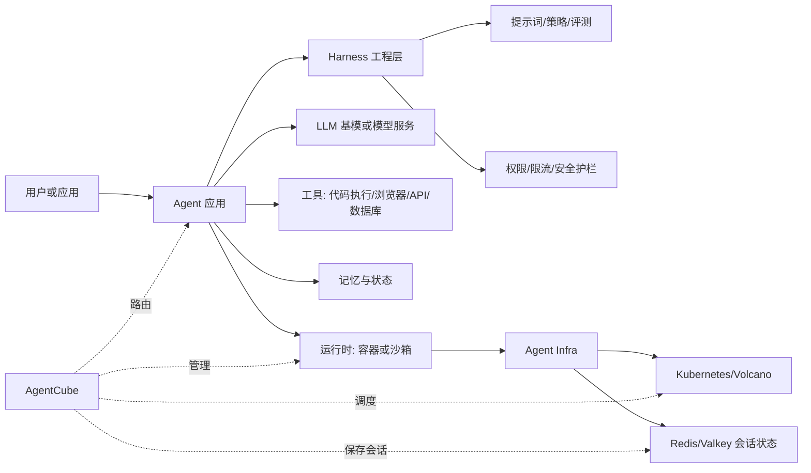

## 相关基础概念

### LLM 基模

**LLM 基模**可以理解为通过大规模预训练得到的通用语言模型基础能力。它擅长理解文本、生成文本、推理、总结、改写、调用工具前的决策等。

常见使用方式有两种：

- 直接调用模型 API，例如 OpenAI-compatible API、企业内部模型网关。
- 把基模进一步微调、蒸馏或接入 RAG、工具调用、Agent 框架，形成具体应用。

基模本身通常只负责“生成下一步内容或决策”，它不天然具备稳定的外部执行环境。例如它不能自己安全地运行 Python、访问私有文件、保存长期会话状态，也不能自动管理 Kubernetes 资源。

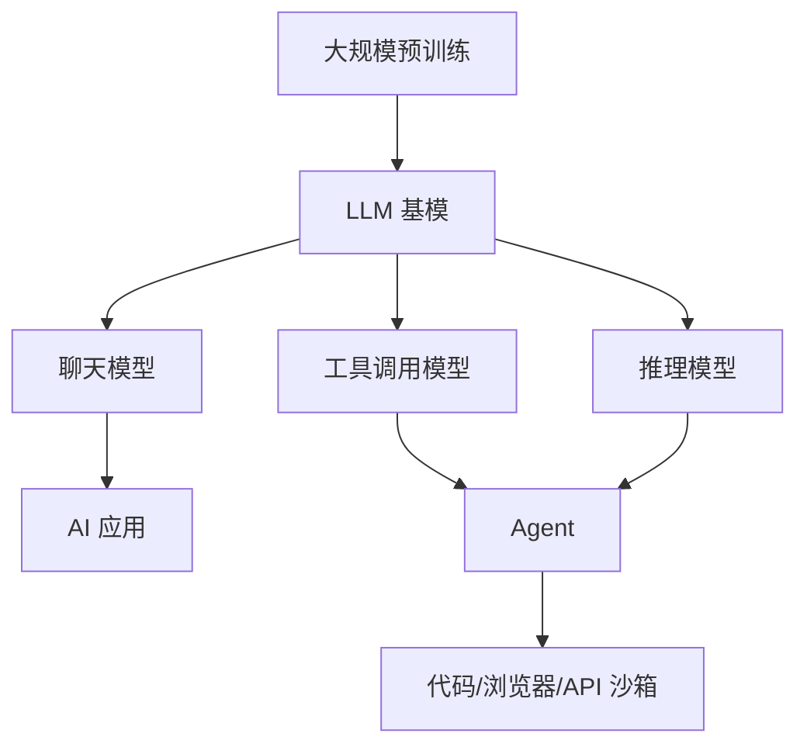

### Agent

**Agent** 是一种能围绕目标进行多步决策和行动的软件系统。它通常会调用 LLM，但 Agent 不等于 LLM。

一个典型 Agent 包含：

- **模型**：负责理解任务、规划步骤、生成工具调用。
- **工具**：例如代码解释器、浏览器、搜索、数据库、内部 API。
- **状态**：保存对话上下文、文件、任务进度、运行结果。
- **控制逻辑**：决定何时调用模型、何时调用工具、何时重试或停止。
- **运行环境**：Agent 代码和工具实际运行的地方，通常是容器、Pod 或更强隔离的沙箱。

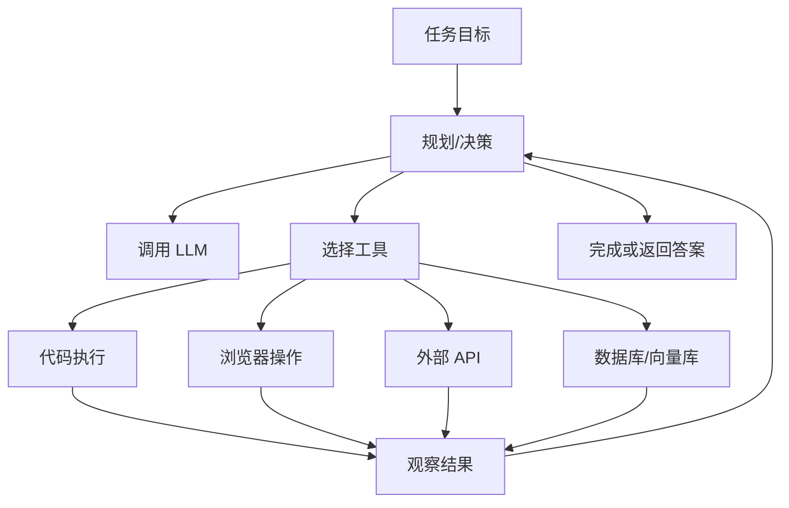

### Harness 工程

**Harness 工程**可以理解为把 LLM 或 Agent “接成一个可运行、可测试、可观测、可治理的软件系统”的工程层。这里的 Harness 不是指某个固定框架，而是指一组装配和控制能力。

如果把 LLM 看成发动机，Agent 看成会做决策的驾驶员，那么 Harness 工程就是仪表盘、线束、测试台、安全开关和运行规程。它不一定直接提供智能，但它决定智能能力能否稳定进入真实业务。

典型 Harness 工程包含：

- **提示词与上下文装配**：把系统提示词、用户输入、历史上下文、RAG 结果、工具描述组合成模型请求。
- **工具协议适配**：把函数调用、MCP、HTTP API、数据库查询、代码执行等封装成 Agent 可调用的工具。
- **策略与安全护栏**：做权限校验、敏感信息过滤、工具白名单、输出约束、成本限制。
- **执行编排**：控制多轮调用、重试、超时、回退、人工确认、任务中断。
- **评测与回归**：用固定样例、黄金集、离线评测、在线 A/B 验证提示词和工具链改动。
- **观测与审计**：记录 prompt、completion、tool call、token、延迟、错误、会话轨迹。
- **配置与版本管理**：管理模型版本、prompt 版本、工具版本、策略版本和灰度发布。

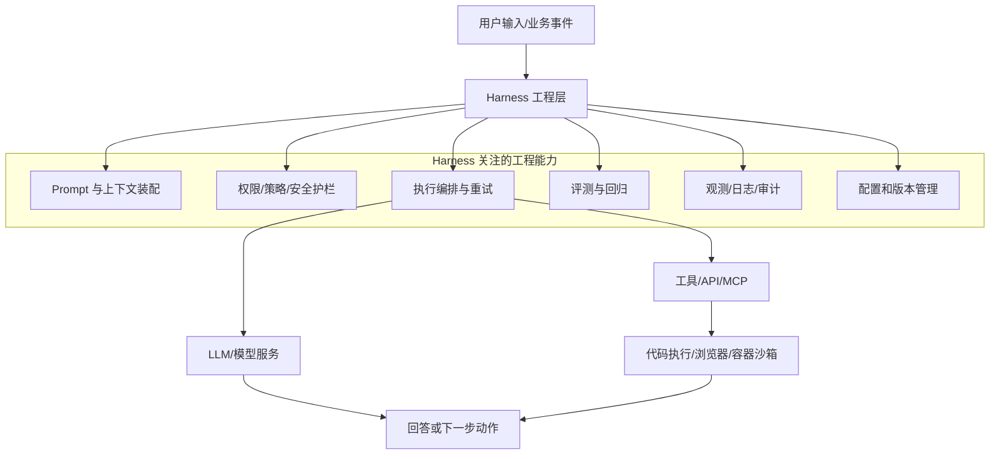

Harness 工程和 Agent Infra 的边界可以这样区分：

| 层 | 关注点 | 典型问题 |
| --- | --- | --- |
| Harness 工程 | 如何把模型、提示词、工具和业务流程组织成可靠应用 | prompt 怎么版本化、工具怎么授权、失败怎么重试、效果怎么评测 |
| Agent Infra | 如何承载和管理 Agent 的运行环境 | sandbox 怎么创建、session 怎么路由、空闲怎么回收、资源怎么隔离 |

在 AgentCube 语境下，Harness 工程通常位于 AgentCube 之上。例如 LangChain、LangGraph、自研 Agent 服务、MCP Server 或 Dify 插件里会包含大量 Harness 逻辑；AgentCube 则负责把这些逻辑需要的代码执行器、Agent 容器和会话环境管理起来。

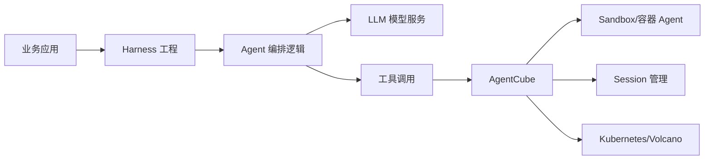

### AI Infra

**AI Infra** 是支撑 AI 模型和 AI 应用的基础设施总称。它覆盖范围很大，包括训练、推理、数据、评测、部署和可观测性。

典型 AI Infra 关注：

- GPU/加速卡资源管理。
- 模型训练、微调、推理服务。
- 模型仓库、特征数据、向量数据库。
- 推理网关、限流、鉴权、成本控制。
- 评测、监控、日志、追踪。

AI Infra 的核心问题通常是：**如何高效、稳定、低成本地生产和调用模型能力。**

### Agent Infra

**Agent Infra** 是 AI Infra 中更偏运行时的一层，专门解决 Agent 工作负载的问题。

Agent 和普通在线服务、离线任务都不太一样：

- 会话长：一次任务可能持续多轮对话。
- 状态多：文件、上下文、浏览器状态、临时结果需要保存。
- 活跃度不稳定：可能突然密集调用，也可能长时间空闲。
- 安全边界复杂：LLM 生成的代码或工具调用不能直接跑在宿主机上。
- 延迟敏感：用户不愿意每次交互都等待冷启动。

所以 Agent Infra 需要处理：

- 会话级隔离。
- 沙箱创建、复用、休眠、恢复、销毁。
- Agent 请求路由。
- 工具执行环境管理。
- 状态保存和资源回收。
- 身份认证、权限控制和审计。

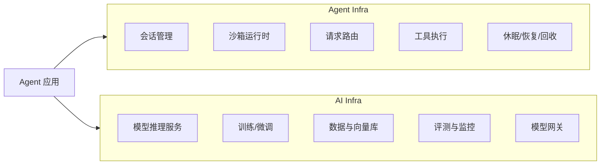

### 容器 Agent

**容器 Agent** 可以有两种理解：

1. **运行在容器里的 Agent 应用**：例如一个 FastAPI Agent、LangChain Agent、浏览器 Agent，被打包成 Docker 镜像并部署到 Kubernetes。
2. **管理容器内环境的 Agent/Daemon**：例如 sandbox 内部的轻量守护进程，负责执行命令、读写文件、暴露健康检查或校验请求。

AgentCube 中两种含义都会出现：

- `AgentRuntime` 更接近第一种：用户自己的 Agent 服务运行在 Pod/容器中。
- `PicoD` 更接近第二种：它运行在沙箱里，提供代码执行和文件操作等能力。

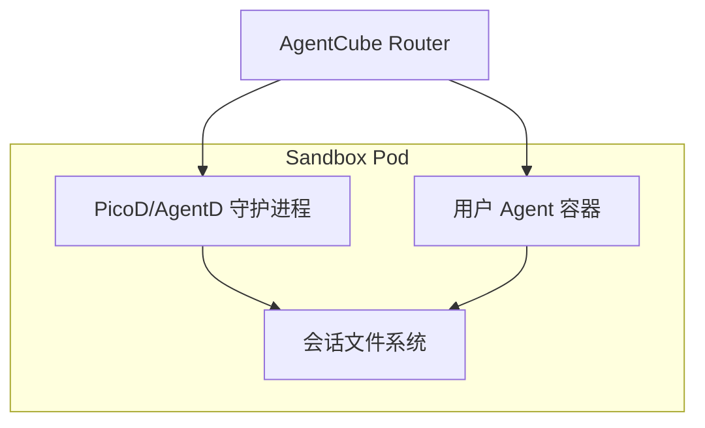

## 为什么 Agent 需要专门基础设施

传统 Web 服务通常是“请求进来，服务立即处理，状态存在数据库里”。传统批处理通常是“提交任务，跑完退出”。Agent 更像一个长期打开的工作台：

- 用户和 Agent 会来回多轮交互。
- Agent 可能生成脚本、运行代码、写文件、读取结果。
- 同一个会话中的文件和上下文需要保留。
- 不同用户之间必须隔离。
- 空闲时最好释放资源，下次请求又要尽快恢复。

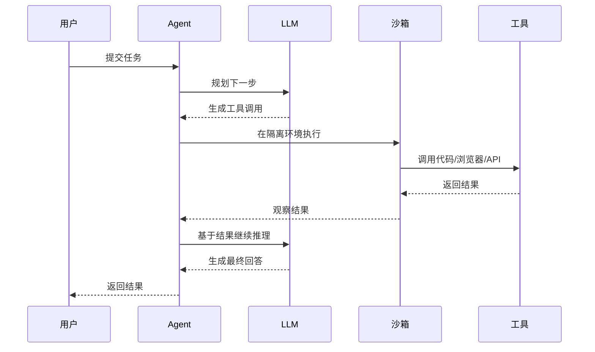

这就是 AgentCube 这类项目要解决的问题：不是替代 Agent 框架，而是让 Agent 框架和 Agent 应用有一个可管理、可隔离、可弹性的运行底座。

## AgentCube 的位置

AgentCube 位于 Agent 应用和 Kubernetes 之间，给上层提供稳定入口，给下层管理具体 sandbox。

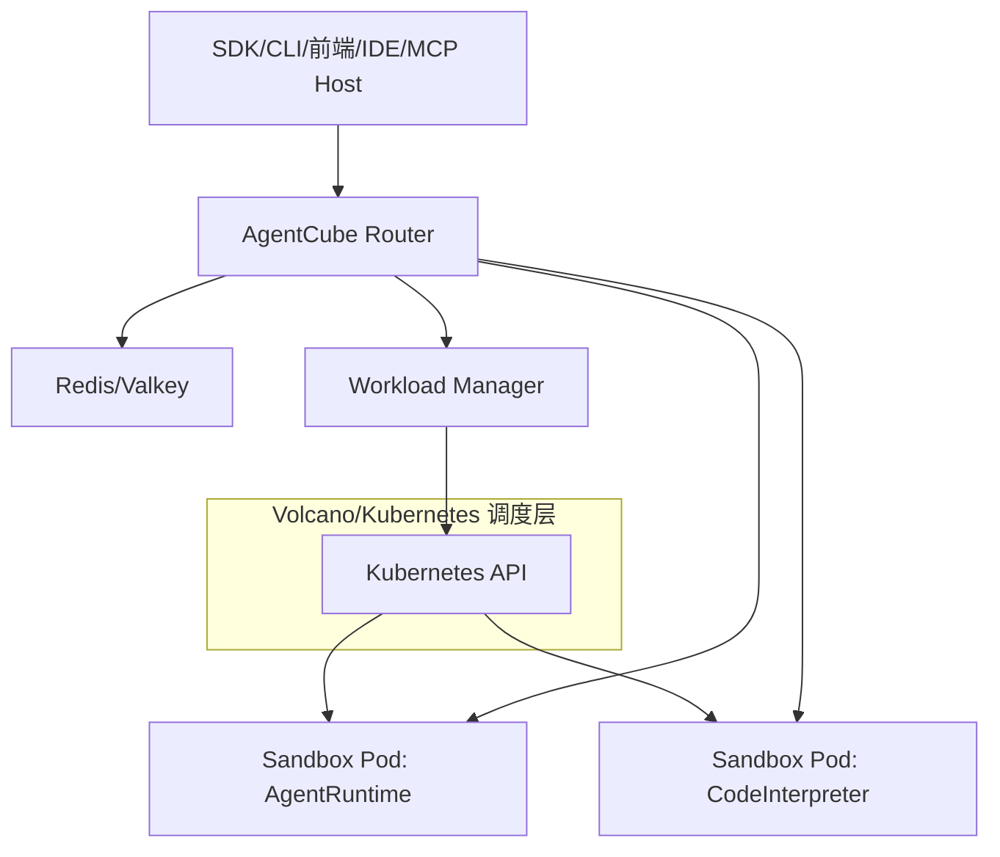

核心职责可以拆成两层：

| 层 | 组件 | 主要职责 |
| --- | --- | --- |
| 控制面 | Workload Manager | 创建 sandbox、管理生命周期、垃圾回收、维护 warm pool |
| 数据面 | AgentCube Router | 接收请求、识别 session、动态路由、代理到对应 sandbox |
| 沙箱内 | PicoD/AgentD | 执行代码、文件操作、健康检查、请求校验 |
| 状态层 | Redis/Valkey | 保存 session、endpoint、心跳和过期信息 |

## AgentRuntime 与 CodeInterpreter

AgentCube 当前定义了两类核心运行时资源。

### AgentRuntime

`AgentRuntime` 适合运行长期交互式 Agent 服务。它关注的是“把一个 Agent 服务按会话隔离地运行起来”。

适合场景：

- 聊天 Agent。
- 浏览器 Agent。
- 企业内部流程 Agent。
- 需要挂载配置、凭据、数据卷的 Agent 服务。

### CodeInterpreter

`CodeInterpreter` 适合运行短生命周期、按需创建、强隔离的代码执行环境。它关注的是“安全地执行 LLM 生成的代码或命令”。

适合场景：

- Python/Bash 代码执行。
- 数据分析。
- 文件处理。
- LangChain/LangGraph Agent 的 sandbox backend。
- MCP 工具中的远程代码解释器。

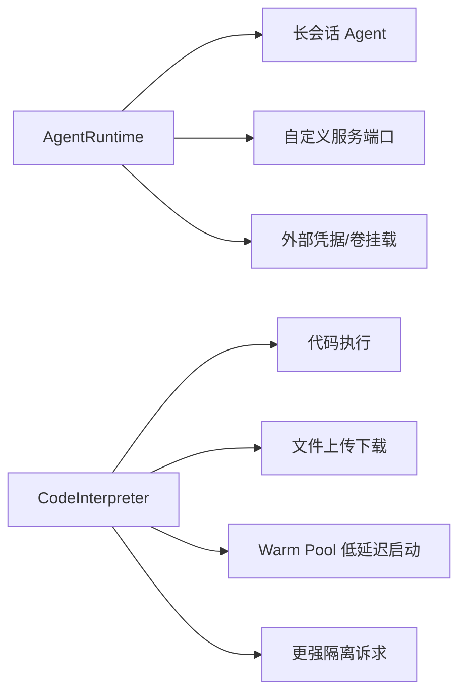

## 一次请求如何流转

下面是 AgentCube 中一次典型 CodeInterpreter 调用的简化流程。

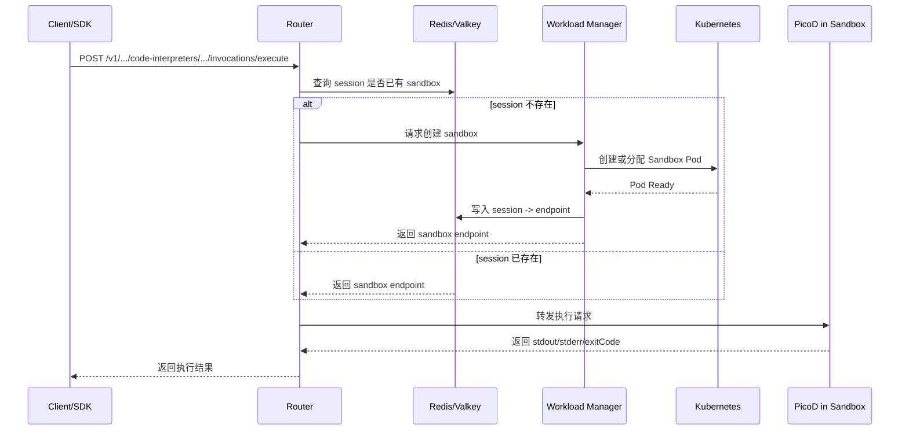

## Sandbox 生命周期

Agent 工作负载的关键不是“启动后一直运行”，而是要根据会话活跃度调节资源。

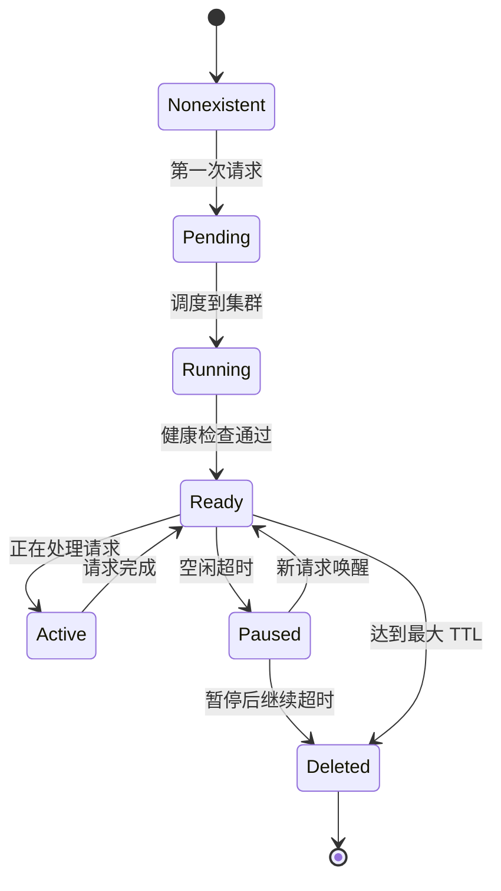

这个生命周期背后的目标是：

- 首次请求时可以懒创建。
- 常用环境可以通过 warm pool 降低冷启动。
- 空闲环境可以暂停或回收。
- 达到最大生命周期后强制清理，避免资源和状态无限累积。

## 和常见框架的关系

AgentCube 不替代 LangChain、LangGraph、AutoGen、Dify、MCP 这类上层框架或协议。它更像这些系统下面的运行时基础设施。

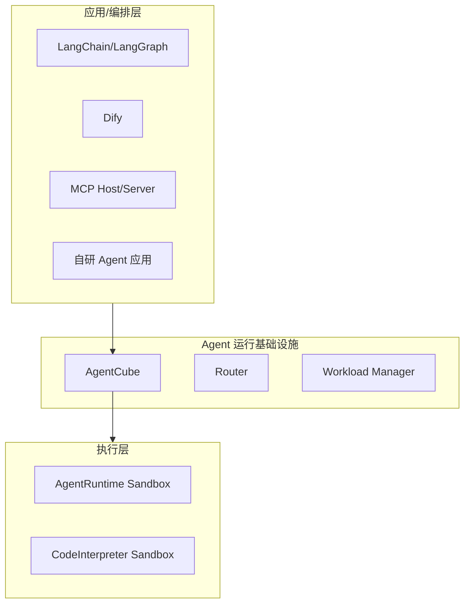

可以这样理解：

- LangChain/LangGraph：负责 Agent 编排逻辑。
- Dify：负责应用搭建和工作流。
- MCP：负责把工具暴露给模型客户端。
- AgentCube：负责把工具和 Agent 放进可管理的隔离运行环境。

## 这个仓库里有什么

当前仓库包含几类代码：

| 路径 | 内容 |
| --- | --- |
| `cmd/workload-manager` | Workload Manager 入口 |
| `cmd/router` | AgentCube Router 入口 |
| `cmd/picod` | PicoD 入口，提供沙箱内执行和文件操作服务 |
| `pkg/workloadmanager` | 控制面核心逻辑 |
| `pkg/router` | 数据面路由和 session 逻辑 |
| `pkg/apis/runtime/v1alpha1` | `AgentRuntime`、`CodeInterpreter` CRD 类型 |
| `sdk-python` | Python SDK |
| `cmd/cli` | AgentCube CLI |
| `integrations` | LangChain、MCP、Dify 等集成 |
| `manifests/charts/base` | Helm/Kubernetes 部署清单 |
| `example` | 示例 Agent 和 Code Interpreter 场景 |

## 快速心智模型

如果只记一张图，可以记下面这张。

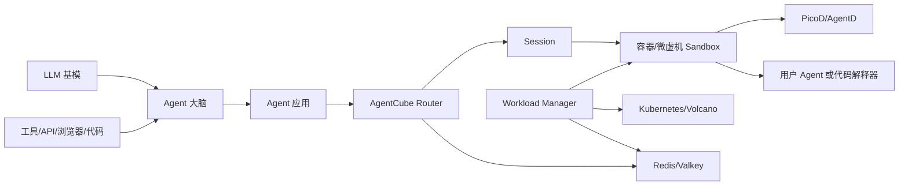

**LLM 负责智能，Agent 负责行动，Agent Infra 负责把行动安全、稳定、低延迟地跑起来。AgentCube 做的就是 Agent Infra 中的运行时管理部分。**
