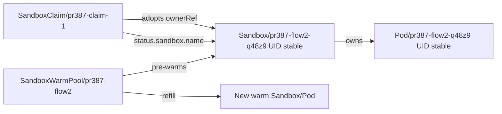

# Day30 PR #387 Warm Pool Data-Flow Evidence

日期：2026-06-25

目标：直接验证 `agent-sandbox v0.4.6` 的 warm pool object flow，而不是通过 CodeInterpreter stdout 做黑盒判断。

## Environment

- Cluster: temporary k3d cluster `agentcube-flow-v046`
- Controller: `registry.k8s.io/agent-sandbox/agent-sandbox-controller:v0.4.6`
- CRDs: `sandboxes`, `sandboxclaims`, `sandboxtemplates`, `sandboxwarmpools` all served/stored as `v1alpha1`
- Namespace: `agentcube-flow-test`
- Template image: local `picod:latest`
- Auth: injected `PICOD_AUTH_PUBLIC_KEY` via namespace-local `picod-router-identity` Secret

> 注释：第一次尝试未注入 `PICOD_AUTH_PUBLIC_KEY`，PicoD container CrashLoop，warm pool `readyReplicas` 未达到 2。这个失败只证明模板缺少 PicoD auth public key，不算 agent-sandbox controller adoption 失败；相关 YAML 以 `failed-*` 文件保留。

## Result

The second run passed the L1 data-flow assertions:

1. `SandboxWarmPool/pr387-flow2` created two ready warm Sandboxes and Pods.
2. Initial warm Sandbox `pr387-flow2-q48z9` had UID `4b5046d7-a6fc-437c-9f3e-7cb6096ee619` and owner `SandboxWarmPool/pr387-flow2`.
3. Its Pod `pr387-flow2-q48z9` had UID `9554d673-6e6b-43c0-8cb3-25c7ef5ae94a` and owner `Sandbox/pr387-flow2-q48z9`.
4. `SandboxClaim/pr387-claim-1` reported `status.sandbox.name=pr387-flow2-q48z9`.
5. The adopted Sandbox kept the same UID and changed owner to `SandboxClaim/pr387-claim-1`.
6. The adopted Pod kept the same UID and owner `Sandbox/pr387-flow2-q48z9`.
7. Warm pool refilled to `readyReplicas=2`, with total `sandbox.count=3` and `pod.count=3` while the claim was active.
8. Deleting the claim removed the adopted Sandbox/Pod and left the warm pool at two ready Sandbox/Pod instances.

## File Map

| File | Purpose |
| --- | --- |
| `01-environment.txt` | Controller image and CRD served/storage versions |
| `02-initial-ready-map.txt` | Initial warm Sandbox UID / Pod UID / ownerRef map |
| `03-initial-ready-objects.yaml` | Raw initial ready SandboxWarmPool, Sandbox, and Pod objects |
| `04-claim-poll.txt` | Poll log showing claim status and pool refill |
| `05-after-claim-adoption.yaml` | Raw adopted claim, Sandbox, Pod, and refill state |
| `06-after-claim-all-objects.yaml` | Full raw object dump after claim adoption |
| `07-assertion-summary.txt` | Compact adoption assertion summary |
| `08-before-delete-claim.yaml` | Raw SandboxClaim before delete |
| `09-delete-poll.txt` | Poll log for claim delete cleanup |
| `10-delete-summary.txt` | Compact cleanup assertion summary |
| `11-after-delete-all-objects.yaml` | Full raw object dump after claim deletion |
| `12-namespace-cleanup.txt` | Namespace cleanup evidence |
| `13-cluster-cleanup.txt` | k3d cluster cleanup evidence |
| `14-pr387-live-codeinterpreter-breakpoint-result.txt` | Full PR #387 head CodeInterpreter/Router/PicoD breakpoint result |
| `15-claim-read-deadline-reproduction.txt` | Exact client-go/HTTP reproduction proving a blocked Claim GET can outlive and bypass the 2-minute internal timer |
| `day30-claim-read-deadline-repro_test.go.txt` | Reusable source for the two reproduction/control tests; `.txt` keeps it out of normal Go package discovery |
| `trace_math_dataflow_breakpoints.py` | Reusable white-box breakpoint script: math payload through WorkloadManager, SandboxClaim adoption, adopted Sandbox/Pod, Router, and PicoD |
| `failed-*` | First attempt with missing PicoD public key; object graph existed but Pods were not Ready |

## Reviewer-Level Conclusion

This validates the runtime data-flow that #387 depends on:



AgentCube should therefore keep `Kind=SandboxClaim` and `Name=<claim name>` for delete/GC, while deriving `SandboxID`, Pod name, and entrypoints from the adopted Sandbox/Pod.

## PR #387 Head Live Breakpoint Result

After the L1 object-flow probe, the same breakpoint script was run against the actual PR #387 WorkloadManager/Router code path:

- PR head: `c2633c5` on `/home/agentcube-agent-sandbox-latest` branch `rebase/pr387-on-bed6bd4`.
- Runtime: local PR-built `workloadmanager` on `19080` and `agentcube-router` on `19081`.
- Controller during test: `agent-sandbox-controller:v0.4.6`.
- Workload: `CodeInterpreter/pr387-math-ci`, `warmPoolSize=2`.
- Result: `TRACE DATAFLOW TEST PASSED`.

The run passed all breakpoints from live session create through cleanup:

```text
SandboxClaim/pr387-math-ci-j4gbks6g
  status.sandbox.name = pr387-math-ci-4fzgd
  status.sandbox.podIPs = [10.42.0.92]

adopted Sandbox/pr387-math-ci-4fzgd
  uid = e5965ac8-86e1-4974-8a15-04a226ef9d5f
  ownerRef = SandboxClaim/pr387-math-ci-j4gbks6g

Pod/pr387-math-ci-4fzgd
  ip = 10.42.0.92
  ownerRef = Sandbox/pr387-math-ci-4fzgd

Router/PicoD
  /api/files wrote gaokao_trace_e61d2fbf48e4.py
  /api/execute returned answer = 2
```

Cleanup also passed: deleting the session removed the claim, adopted Sandbox, and adopted Pod, and the warm pool refilled to `readyReplicas=2`.
