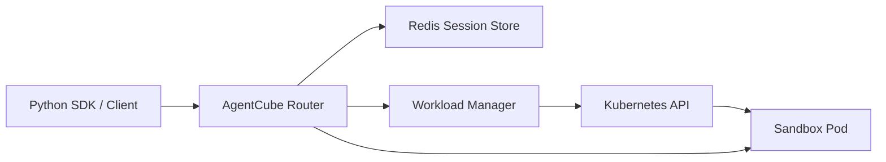
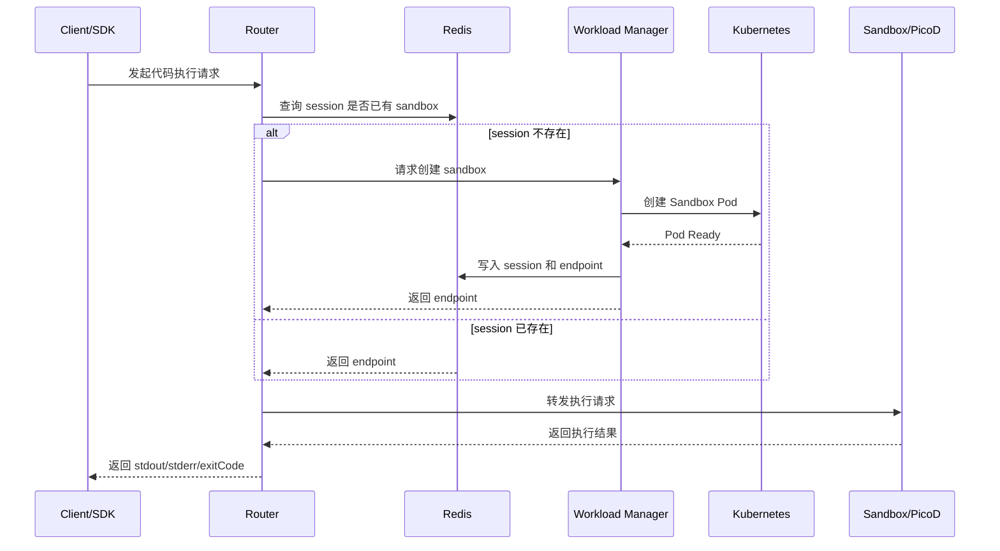
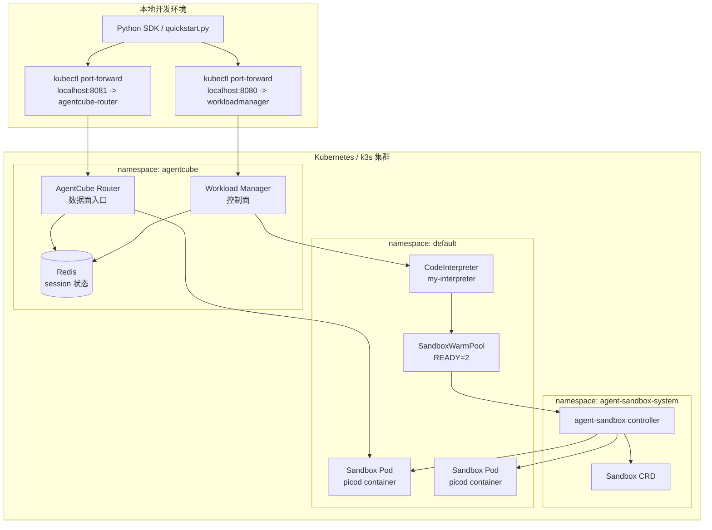

# Day 1 实习报告：跟着 Getting Started 跑通 AgentCube

## 基本信息

- 实习项目：AgentCube
- 实习方向：华为公司开源小组 / AgentCube 开源项目研究
- 日期：Day 1
- 今日主题：先把 AgentCube 的最小链路跑起来
- 主要参考：`docs/getting-started.md`

## 今天的目标

今天是我参与 AgentCube 项目的第一天。我的主要目标不是马上改代码，而是先按照 `docs/getting-started.md` 把项目的基础环境和调用链路跑通，建立对这个项目的第一层认识。

我今天重点关注三个问题：

- AgentCube 跑起来需要哪些外部依赖。
- Workload Manager、Router、Redis、agent-sandbox 分别负责什么。
- Python SDK 发起一次 CodeInterpreter 调用时，请求在系统里是怎么流转的。

## 我对项目的初步理解

AgentCube 不是一个单独启动的本地程序，而是一组运行在 Kubernetes 上的组件。它的目标是给 AI Agent 和 Code Interpreter 提供可管理的运行环境，包括 sandbox 创建、会话路由、状态保存和资源回收。

从 Getting Started 看，最小部署链路里主要有这些组件：

| 组件 | 我今天的理解 |
| --- | --- |
| Workload Manager | 控制面组件，负责创建和管理 sandbox |
| AgentCube Router | 数据面入口，负责把客户端请求转发到正确的 session/sandbox |
| Redis | 保存 session 状态，帮助不同组件共享会话信息 |
| agent-sandbox | AgentCube 依赖的 sandbox 控制器，提供底层 Sandbox CRD 和管理能力 |
| CodeInterpreter | AgentCube 自定义资源，用来描述代码解释器运行时 |

我先把它理解成下面这张图：



## 今天阅读和执行的流程

### 1. 确认前置环境

文档要求的基础环境包括：

- Kubernetes v1.24+
- `kubectl`
- Helm v3
- Python 3.10+

我理解这些依赖分别对应不同层次：Kubernetes 是运行底座，Helm 用于安装 AgentCube，Python 用来运行 SDK 示例，`kubectl` 用来检查资源状态和执行部署命令。

### 2. 安装 agent-sandbox

AgentCube 依赖 `kubernetes-sigs/agent-sandbox` 来管理 sandbox，所以第一步需要先安装 agent-sandbox 的 CRD 和 controller。

文档中的命令是：

```bash
AGENT_SANDBOX_VERSION=v0.1.1
kubectl apply -f https://github.com/kubernetes-sigs/agent-sandbox/releases/download/${AGENT_SANDBOX_VERSION}/manifest.yaml
kubectl apply -f https://github.com/kubernetes-sigs/agent-sandbox/releases/download/${AGENT_SANDBOX_VERSION}/extensions.yaml
```

检查命令：

```bash
kubectl get pods -n agent-sandbox-system
```

我的理解：如果这一层没有装好，后面 Workload Manager 即使收到创建请求，也没有办法真正创建 sandbox。

### 3. 部署 Redis

AgentCube 使用 Redis 保存 session 信息。文档里用一个简单的 `redis:7-alpine` Deployment 作为测试环境：

```bash
kubectl create namespace agentcube
kubectl -n agentcube create deployment redis --image=redis:7-alpine --port=6379
kubectl -n agentcube expose deployment redis --port=6379 --target-port=6379
kubectl -n agentcube rollout status deployment/redis
```

我的理解：Redis 在这里不是用来保存业务数据，而是保存 AgentCube 的运行状态，例如 session 对应哪个 sandbox、endpoint 是什么、会话是否过期等。

### 4. 使用 Helm 安装 AgentCube

AgentCube 本体通过 Helm Chart 安装：

```bash
helm install agentcube ./manifests/charts/base \
    --namespace agentcube \
    --create-namespace \
    --set redis.addr="redis.agentcube.svc.cluster.local:6379" \
    --set redis.password="''''" \
    --set router.serviceAccountName="agentcube-router"
```

安装后需要检查：

```bash
kubectl get pods -n agentcube
kubectl get crd | grep agentcube
```

我今天重点记住的是：这一步会安装 AgentCube 的 CRD，以及两个核心服务 Workload Manager 和 Router。

### 5. 创建 CodeInterpreter

CodeInterpreter 是 AgentCube 中用于代码执行场景的自定义资源。文档里的示例命令是：

```bash
kubectl apply -f example/code-interpreter/code-interpreter.yaml
kubectl get codeinterpreter
```

我的理解：CodeInterpreter 更像一个“代码执行环境模板”。它定义了要使用的镜像、端口、资源限制、session timeout 和最大 session duration。真正执行代码时，AgentCube 会基于这个模板创建或分配 sandbox。

### 6. 使用 Python SDK 调用

为了从本地访问集群里的服务，需要做端口转发：

```bash
kubectl port-forward -n agentcube svc/workloadmanager 8080:8080
kubectl port-forward -n agentcube svc/agentcube-router 8081:8080
```

然后设置环境变量：

```bash
export WORKLOAD_MANAGER_URL="http://localhost:8080"
export ROUTER_URL="http://localhost:8081"
```

Python 示例：

```python
from agentcube import CodeInterpreterClient

with CodeInterpreterClient(name="my-interpreter") as client:
    result = client.run_code("python", "print('Hello from AgentCube!')")
    print(result)
```

这段代码帮助我理解了 SDK 的角色：用户不需要直接操作 Kubernetes，而是通过 SDK 调用 AgentCube 的 Router 和 Workload Manager，最终把代码送进远端 sandbox 里执行。

## 实际运行过程与卡点记录

这次不是完全照文档一次跑通，中间遇到了一些环境和配置问题。把这些卡点记录下来，比只记录成功命令更有价值，因为后续复现和排错时可以少走弯路。

### 卡点 1：初始环境缺少 Kubernetes 相关工具

一开始检查环境时发现机器上没有 `kubectl`、`helm`、`go`、`docker`、`kind`、`minikube`、`k3d`，只有系统自带的 `python3`。这说明不能直接执行 Getting Started 里的 Kubernetes 部署命令，也不能依赖 Docker 或 Kind 快速起本地集群。

处理方式：

- 先确认机器是 CentOS 8，且当前用户是 `root`。
- 检查到没有 Docker/containerd socket，但可以安装系统服务。
- 选择安装单节点 `k3s`，用它自带的 containerd 作为本地 Kubernetes 运行环境。

### 卡点 2：默认安装的 k3s 版本不兼容 cgroup v1

第一次直接安装 k3s stable 通道时，安装到的是 `v1.35.5+k3s1`。服务启动后很快退出，`kubectl` 连接 `127.0.0.1:6443` 被拒绝。

查看 `journalctl -u k3s` 后发现关键错误是：

```text
kubelet is configured to not run on a host using cgroup v1
```

这台机器的 `/sys/fs/cgroup` 是 cgroup v1，而较新的 kubelet 已经不支持这种环境。

处理方式：

- 先执行 `k3s-uninstall.sh` 清理失败安装。
- 改装文档允许范围内的 Kubernetes 版本：`v1.24.17+k3s1`。
- 安装时跳过 SELinux RPM，因为前一次安装过程中 `semodule` 出现过 segmentation fault。

最终 `kubectl version` 显示 client/server 都是 `v1.24.17+k3s1`，节点状态变为 `Ready`。

### 卡点 3：Helm 默认没有使用 k3s kubeconfig

安装 AgentCube Helm chart 时，第一次直接执行 `helm install` 失败：

```text
Kubernetes cluster unreachable: Get "http://localhost:8080/version": connect: connection refused
```

原因是 Helm 没有自动读取 k3s 的 kubeconfig，而是尝试连接默认的 `localhost:8080`。

处理方式：

```bash
KUBECONFIG=/etc/rancher/k3s/k3s.yaml helm install agentcube ./manifests/charts/base ...
```

加上 `KUBECONFIG` 后 Helm release 正常部署，AgentCube 的 CRD 也成功注册。

### 卡点 4：无密码 Redis 导致 Router 和 Workload Manager 崩溃

Redis 按文档使用 `redis:7-alpine` 部署，默认没有密码。AgentCube chart 安装时如果传空密码，不会生成 Redis Secret，也不会注入 `REDIS_PASSWORD` 环境变量。

这导致 `workloadmanager` 和 `agentcube-router` 启动后进入 `CrashLoopBackOff`。日志里关键错误是：

```text
REDIS_PASSWORD is required but not set
```

进一步读 `pkg/store/store_redis.go` 后确认，代码默认要求 `REDIS_PASSWORD` 非空，除非显式设置：

```text
REDIS_PASSWORD_REQUIRED=false
```

处理方式：

```bash
KUBECONFIG=/etc/rancher/k3s/k3s.yaml helm upgrade agentcube ./manifests/charts/base \
  --namespace agentcube \
  --set redis.addr="redis.agentcube.svc.cluster.local:6379" \
  --set redis.password="" \
  --set router.serviceAccountName="agentcube-router" \
  --set router.extraEnv[0].name=REDIS_PASSWORD_REQUIRED \
  --set-string router.extraEnv[0].value=false \
  --set workloadmanager.extraEnv[0].name=REDIS_PASSWORD_REQUIRED \
  --set-string workloadmanager.extraEnv[0].value=false
```

升级后 `redis`、`workloadmanager`、`agentcube-router` 都变为 `Running`。

### 卡点 5：系统 Python 版本不满足 SDK 要求

部署面跑起来后，准备运行 SDK 示例时发现系统 Python 是 `3.6.8`，而 `sdk-python/pyproject.toml` 要求：

```toml
requires-python = ">=3.10"
```

CentOS 8 当前包源里只看到 `python38` 和 `python39`，仍不满足 SDK 要求。

处理方式：

- 不改系统 Python，避免影响系统工具。
- 安装独立的 `uv`，用它安装 Python 3.11 并创建本地虚拟环境。

### 最终验证结果

完成上面的处理后，集群中的关键组件状态如下：

- `agent-sandbox-controller`：`Running`
- `redis`：`Running`
- `workloadmanager`：`Running`
- `agentcube-router`：`Running`
- `my-interpreter` 对应的 warm pool：`READY=2`

随后使用端口转发访问控制面和数据面：

```bash
kubectl port-forward -n agentcube svc/workloadmanager 8080:8080
kubectl port-forward -n agentcube svc/agentcube-router 8081:8080
```

用 Python 3.11 虚拟环境安装本地 SDK 后，执行 `CodeInterpreterClient` 示例，最终成功输出：

```text
Hello from AgentCube!
```

这说明从 SDK 创建 session、Router 转发请求、PicoD 执行代码、Workload Manager 删除 session 的最小链路已经跑通。

## 我今天理解的请求链路

我把一次 CodeInterpreter 调用理解成下面这个过程：



这张图是我今天最重要的收获。它把 Getting Started 中分散的部署命令串成了一条完整链路。

## 今天的收获

- 我初步理解了控制面和数据面的分工：Workload Manager 管 sandbox 生命周期，Router 管请求路由。
- 我理解了 Redis 在 AgentCube 中主要用于保存 session 状态，而不是普通业务存储。
- 我认识到 CodeInterpreter 是一个面向代码执行的运行时模板，适合承载 LLM 生成代码的隔离执行场景。
- 我对 SDK 调用链路有了初步认识：SDK 发请求，Router 查 session，必要时 Workload Manager 创建 sandbox，最后由 sandbox 内部服务执行代码。

### 对最小运行链路的进一步理解

我一开始只是记住了 AgentCube 依赖 Kubernetes、agent-sandbox、Redis、Workload Manager 和 Router，但这个说法还比较抽象。今天实际跑完以后，我对“为什么需要它们”有了更具体一点的理解。

Kubernetes 是 AgentCube 的运行底座。AgentCube 不是自己实现一套进程管理、资源隔离和调度系统，而是把真正执行代码的环境变成 Kubernetes 里的资源和 Pod。单节点 k3s 可以跑通最小链路，多节点集群也可以运行同样的组件。区别是单节点主要用于验证功能，多节点才更能体现 Kubernetes 原生调度、资源分配和隔离能力。

我之前对容器的理解主要停留在 Docker 和镜像层面，所以今天也补了一下 Pod 的概念。镜像是模板，比如 `ghcr.io/volcano-sh/picod:latest`；容器是镜像真正跑起来后的进程；Pod 则是 Kubernetes 对一个或多个容器的运行封装，也是 Kubernetes 最小的调度单位。

可以把层级先粗略理解成：

```text
Image -> Container -> Pod -> Node -> Kubernetes Cluster
```

在 Docker 里，我可能会执行 `docker run redis:7-alpine` 来在本机启动一个容器；在 Kubernetes 里，则是声明一个 Pod，Pod 里面再声明要运行哪些 container、使用什么 image、需要多少 CPU/内存、暴露什么端口。Kubernetes 再决定把这个 Pod 放到哪个 Node 上运行。

一个 Pod 里通常只有一个主容器，但也可以有多个紧密相关的容器。它们共享同一个 Pod IP，可以通过 `localhost` 互相访问，也可以共享 volume。所以 Pod 不是镜像，也不完全等同于单个容器，而是 Kubernetes 管理容器时使用的最小运行单元。

放到 AgentCube 里看，`CodeInterpreter` 里配置的 `picod` 镜像最后会变成 sandbox Pod 里的容器。也就是说，AgentCube 创建出来的 `my-interpreter-xxxx` 这些 Pod，内部真正运行的是 `ghcr.io/volcano-sh/picod:latest` 这个镜像启动出来的容器。Router 后续转发请求时，实际访问的是这个 sandbox Pod 的 IP 和端口。

为了把这个关系看得更直观，我补了一张 Mermaid 架构图：



这张图和前面的时序图侧重点不同：时序图关注“一次请求按什么顺序发生”，这张架构图关注“组件部署在哪里、谁依赖谁、请求最后会到哪个 Pod”。

agent-sandbox 提供更底层的 Sandbox 能力。AgentCube 自己的 CodeInterpreter 更偏上层，描述“我要一个什么样的代码解释器运行环境”；而真正落到 Kubernetes 里创建、维护 sandbox 这件事，需要依赖 agent-sandbox 提供的 CRD 和 controller。如果没有 agent-sandbox，Workload Manager 即使收到创建会话的请求，也缺少实际创建 sandbox 的底层能力。

Redis 是会话状态中心。一次 SDK 调用不是简单地把请求打到某个固定 Pod，而是要知道当前 session 对应哪个 sandbox、这个 sandbox 的 endpoint 是什么、后续请求应该继续路由到哪里。Redis 保存的就是这类状态。这样 Router 和 Workload Manager 之间不用只靠内存共享状态，也方便组件重启或扩展副本。

Workload Manager 是控制面。它主要负责把用户的“创建一个 CodeInterpreter session”请求转换成 Kubernetes / agent-sandbox 里的资源创建流程，并在 sandbox 准备好以后把 session 和 endpoint 信息写入 Redis。它更关心生命周期：创建、删除、超时、回收。

Router 是数据面入口。SDK 真正执行代码时，请求会打到 Router。Router 根据 session ID 查 Redis，找到对应 sandbox 的地址，然后把 `/api/files`、`/api/execute` 这类请求转发到 sandbox 里的 PicoD。它更关心请求怎么转发，而不是 sandbox 怎么创建。

所以我现在把最小链路理解成两条线：

- 创建线：SDK -> Workload Manager -> agent-sandbox/Kubernetes -> Sandbox Pod -> Redis 记录 session。
- 调用线：SDK -> Router -> Redis 查询 session -> PicoD 执行代码 -> Router 返回结果。

这也解释了为什么单节点和多节点不影响 AgentCube 的基本运行。AgentCube 依赖的是 Kubernetes 这套 API 和资源模型；多节点主要影响调度位置、容量和隔离效果，而不是改变 AgentCube 的基本调用链路。

### 和 ChatGPT 沙盒、Codex、function call 的类比

我今天还把 AgentCube 和之前用过的 ChatGPT、Codex、LLM function call 做了一个对比。这个对比帮助我理解 AgentCube 到底解决的是哪一层问题。

普通 LLM function call 解决的是“模型如何表达自己要调用某个工具”。例如模型返回一个 `run_python` 或 `search_user` 的工具调用，然后由应用后端去真正执行这个函数。它本身只是一个调用协议，并不规定函数一定在哪里执行，也不天然提供隔离、调度和资源回收。

ChatGPT 网页版或 App 里的 Code Interpreter 更像是平台提供的远端沙盒。用户上传文件或要求运行代码时，代码不是直接在用户电脑上执行，而是在 OpenAI 管理的隔离环境里执行。这样模型不会直接碰用户本机环境。

AgentCube 和这个思路比较像：它也是不让 Agent 或 LLM 应用直接在用户机器或主业务进程里执行代码，而是把代码放进 Kubernetes 里的 sandbox Pod。区别是 ChatGPT 的沙盒由平台托管，AgentCube 则把这套能力做成可以部署在 Kubernetes 集群里的开源组件。

Codex 的方向不一样。Codex 的目标是帮助用户处理当前代码仓库，所以它需要被授权读取文件、修改文件、运行测试和执行命令。它形式上也会使用工具调用，但这些工具调用作用在用户当前的开发环境里，而不是一个完全独立的代码解释器沙盒里。

我现在可以把它们粗略区分成这样：

| 形态 | 工具调用/决策是谁发起 | 代码或工具实际跑在哪里 | 主要目的 |
| --- | --- | --- | --- |
| 普通 function call | LLM 返回 tool call | 应用后端自己执行函数 | 让模型调用业务工具 |
| ChatGPT Code Interpreter | ChatGPT | 平台管理的远端沙盒 | 隔离执行用户代码 |
| AgentCube CodeInterpreter | Agent/SDK/LLM 应用 | Kubernetes sandbox Pod | 在自有集群里托管可调度、可回收的代码执行环境 |
| Codex | Codex agent | 用户当前工作区或开发环境 | 真实修改代码、运行测试、完成工程任务 |

所以我的理解是：function call 是“模型怎么请求工具”的接口；AgentCube、ChatGPT 沙盒、Codex 的差别在于“这个工具最终在哪里执行，以及能接触到什么环境”。AgentCube 更接近 ChatGPT Code Interpreter 的隔离执行模式，只是它把沙盒运行时交给 Kubernetes 来管理。

## 还没完全理解的问题

- Workload Manager 具体是如何创建 Sandbox Pod 的，还需要继续读 `pkg/workloadmanager`。
- Router 如何从请求里识别 session ID，以及如何处理首次请求，还需要继续读 `pkg/router`。
- PicoD 在 sandbox 内部具体暴露了哪些 API，还需要继续看 `pkg/picod` 和 SDK 调用代码。
- CodeInterpreter 和 AgentRuntime 的边界还需要结合 CRD 和示例继续理解。

## 明天计划

- 阅读 `sdk-python`，从 `CodeInterpreterClient` 开始追踪一次调用的代码路径。
- 阅读 `pkg/router`，重点看 session 管理和请求转发逻辑。
- 阅读 `pkg/workloadmanager`，理解 sandbox 创建、状态写入和垃圾回收。
- 如果环境允许，继续记录实际部署时的命令输出和排错过程。
