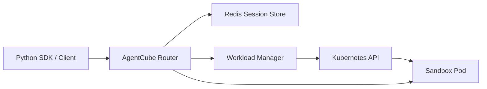
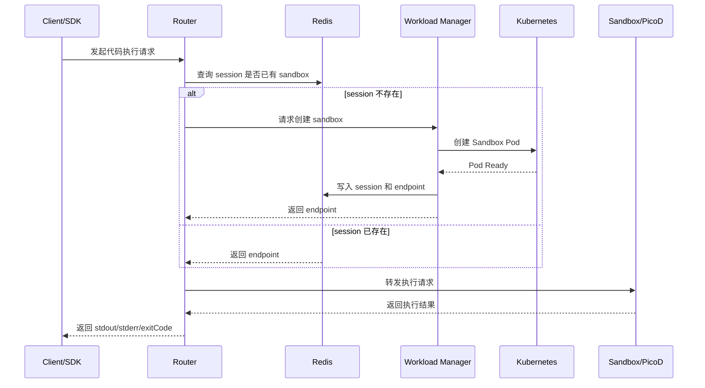

# Day 1 实习报告：跟着 Getting Started 跑通 AgentCube

## 基本信息

- 实习项目：AgentCube
- 实习方向：华为公司开源小组 / AgentCube 开源项目研究
- 日期：Day 1
- 今日主题：先把 AgentCube 的最小链路跑起来
- 主要参考：`docs/getting-started.md`

## 今天的目标

今天是我参与 AgentCube 项目的第一天。我的主要目标不是马上改代码，而是先按照 `docs/getting-started.md` 把项目的基础环境和调用链路跑通，建立对这个项目的第一层认识。

我今天重点关注三个问题：

- AgentCube 跑起来需要哪些外部依赖。
- Workload Manager、Router、Redis、agent-sandbox 分别负责什么。
- Python SDK 发起一次 CodeInterpreter 调用时，请求在系统里是怎么流转的。

## 我对项目的初步理解

AgentCube 不是一个单独启动的本地程序，而是一组运行在 Kubernetes 上的组件。它的目标是给 AI Agent 和 Code Interpreter 提供可管理的运行环境，包括 sandbox 创建、会话路由、状态保存和资源回收。

从 Getting Started 看，最小部署链路里主要有这些组件：

| 组件 | 我今天的理解 |
| --- | --- |
| Workload Manager | 控制面组件，负责创建和管理 sandbox |
| AgentCube Router | 数据面入口，负责把客户端请求转发到正确的 session/sandbox |
| Redis | 保存 session 状态，帮助不同组件共享会话信息 |
| agent-sandbox | AgentCube 依赖的 sandbox 控制器，提供底层 Sandbox CRD 和管理能力 |
| CodeInterpreter | AgentCube 自定义资源，用来描述代码解释器运行时 |

我先把它理解成下面这张图：



## 今天阅读和执行的流程

### 1. 确认前置环境

文档要求的基础环境包括：

- Kubernetes v1.24+
- `kubectl`
- Helm v3
- Python 3.10+

我理解这些依赖分别对应不同层次：Kubernetes 是运行底座，Helm 用于安装 AgentCube，Python 用来运行 SDK 示例，`kubectl` 用来检查资源状态和执行部署命令。

### 2. 安装 agent-sandbox

AgentCube 依赖 `kubernetes-sigs/agent-sandbox` 来管理 sandbox，所以第一步需要先安装 agent-sandbox 的 CRD 和 controller。

文档中的命令是：

```bash
AGENT_SANDBOX_VERSION=v0.1.1
kubectl apply -f https://github.com/kubernetes-sigs/agent-sandbox/releases/download/${AGENT_SANDBOX_VERSION}/manifest.yaml
kubectl apply -f https://github.com/kubernetes-sigs/agent-sandbox/releases/download/${AGENT_SANDBOX_VERSION}/extensions.yaml
```

检查命令：

```bash
kubectl get pods -n agent-sandbox-system
```

我的理解：如果这一层没有装好，后面 Workload Manager 即使收到创建请求，也没有办法真正创建 sandbox。

### 3. 部署 Redis

AgentCube 使用 Redis 保存 session 信息。文档里用一个简单的 `redis:7-alpine` Deployment 作为测试环境：

```bash
kubectl create namespace agentcube
kubectl -n agentcube create deployment redis --image=redis:7-alpine --port=6379
kubectl -n agentcube expose deployment redis --port=6379 --target-port=6379
kubectl -n agentcube rollout status deployment/redis
```

我的理解：Redis 在这里不是用来保存业务数据，而是保存 AgentCube 的运行状态，例如 session 对应哪个 sandbox、endpoint 是什么、会话是否过期等。

### 4. 使用 Helm 安装 AgentCube

AgentCube 本体通过 Helm Chart 安装：

```bash
helm install agentcube ./manifests/charts/base \
    --namespace agentcube \
    --create-namespace \
    --set redis.addr="redis.agentcube.svc.cluster.local:6379" \
    --set redis.password="''''" \
    --set router.serviceAccountName="agentcube-router"
```

安装后需要检查：

```bash
kubectl get pods -n agentcube
kubectl get crd | grep agentcube
```

我今天重点记住的是：这一步会安装 AgentCube 的 CRD，以及两个核心服务 Workload Manager 和 Router。

### 5. 创建 CodeInterpreter

CodeInterpreter 是 AgentCube 中用于代码执行场景的自定义资源。文档里的示例命令是：

```bash
kubectl apply -f example/code-interpreter/code-interpreter.yaml
kubectl get codeinterpreter
```

我的理解：CodeInterpreter 更像一个“代码执行环境模板”。它定义了要使用的镜像、端口、资源限制、session timeout 和最大 session duration。真正执行代码时，AgentCube 会基于这个模板创建或分配 sandbox。

### 6. 使用 Python SDK 调用

为了从本地访问集群里的服务，需要做端口转发：

```bash
kubectl port-forward -n agentcube svc/workloadmanager 8080:8080
kubectl port-forward -n agentcube svc/agentcube-router 8081:8080
```

然后设置环境变量：

```bash
export WORKLOAD_MANAGER_URL="http://localhost:8080"
export ROUTER_URL="http://localhost:8081"
```

Python 示例：

```python
from agentcube import CodeInterpreterClient

with CodeInterpreterClient(name="my-interpreter") as client:
    result = client.run_code("python", "print('Hello from AgentCube!')")
    print(result)
```

这段代码帮助我理解了 SDK 的角色：用户不需要直接操作 Kubernetes，而是通过 SDK 调用 AgentCube 的 Router 和 Workload Manager，最终把代码送进远端 sandbox 里执行。

## 我今天理解的请求链路

我把一次 CodeInterpreter 调用理解成下面这个过程：



这张图是我今天最重要的收获。它把 Getting Started 中分散的部署命令串成了一条完整链路。

## 今天的收获

- 我知道了 AgentCube 的最小运行链路依赖 Kubernetes、agent-sandbox、Redis、Workload Manager 和 Router。
- 我初步理解了控制面和数据面的分工：Workload Manager 管 sandbox 生命周期，Router 管请求路由。
- 我理解了 Redis 在 AgentCube 中主要用于保存 session 状态，而不是普通业务存储。
- 我认识到 CodeInterpreter 是一个面向代码执行的运行时模板，适合承载 LLM 生成代码的隔离执行场景。
- 我对 SDK 调用链路有了初步认识：SDK 发请求，Router 查 session，必要时 Workload Manager 创建 sandbox，最后由 sandbox 内部服务执行代码。

## 还没完全理解的问题

- Workload Manager 具体是如何创建 Sandbox Pod 的，还需要继续读 `pkg/workloadmanager`。
- Router 如何从请求里识别 session ID，以及如何处理首次请求，还需要继续读 `pkg/router`。
- PicoD 在 sandbox 内部具体暴露了哪些 API，还需要继续看 `pkg/picod` 和 SDK 调用代码。
- CodeInterpreter 和 AgentRuntime 的边界还需要结合 CRD 和示例继续理解。

## 明天计划

- 阅读 `sdk-python`，从 `CodeInterpreterClient` 开始追踪一次调用的代码路径。
- 阅读 `pkg/router`，重点看 session 管理和请求转发逻辑。
- 阅读 `pkg/workloadmanager`，理解 sandbox 创建、状态写入和垃圾回收。
- 如果环境允许，继续记录实际部署时的命令输出和排错过程。
