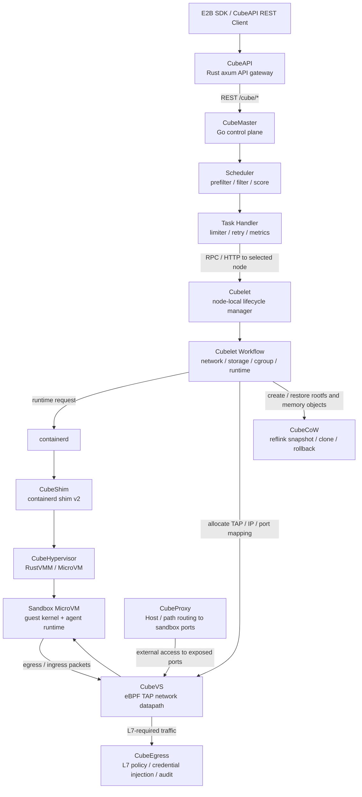

# Day 11：云厂商 Agent 沙箱与 CubeSandbox 深入调研

## 今日目标

今天开始把竞品视角从单个开源项目扩展到云服务厂商的 Agent 沙箱生态。第一步先不急着做性能或架构对比，而是把项目名字、所属厂商、开源属性和后续调研口径确认清楚，避免后面把托管云服务、SDK、sample 和完整开源 runtime 混在一起比较。

今天的分工调整为：其他云厂商项目先只确认名称和入口，由其他同学继续调研；我这边重点深入分析腾讯云开源项目 **CubeSandbox**。

## 初步项目清单

| 厂商 / 生态 | 项目名 | 开源 / 产品属性 | 入口 | 初步判断 |
| --- | --- | --- | --- | --- |
| 腾讯云 | CubeSandbox / Cube Sandbox | 开源 sandbox runtime / platform | `TencentCloud/CubeSandbox` | 腾讯云开源的 AI Agent 沙箱项目，重点看 KVM / RustVMM / E2B 兼容 / pool / snapshot |
| 阿里 | OpenSandbox | 开源 sandbox 平台 | `opensandbox-group/OpenSandbox`，历史入口 `alibaba/OpenSandbox` | 偏通用 AI 应用 sandbox，支持 Docker / Kubernetes runtime、SDK、Code Interpreter、browser 等能力 |
| 阿里云 | AgentBay | 托管云服务 + SDK / skills 开源 | Alibaba Cloud AgentBay 文档；`agentbay-ai/wuying-agentbay-sdk`、`agentbay-ai/agentbay-skills` | 不是完整 runtime 开源项目，更适合作为云托管 sandbox 产品对比 |
| Google / GKE | Agent Sandbox | Kubernetes SIG 开源项目 + GKE 产品化集成 | `kubernetes-sigs/agent-sandbox`；GKE Agent Sandbox 文档 | AgentCube 当前依赖的关键生态之一，重点看 CRD、Sandbox / SandboxClaim / SandboxWarmPool 和 GKE 集成 |
| Google / AgentSubstrate | Agent Substrate | 开源项目 | `agent-substrate/substrate` | 注意名字是 `Agent Substrate`，不是 `agentsubstrate`；Google Cloud blog 介绍为开源方向，但仓库说明不是 Google 官方支持产品 |
| AWS | Amazon Bedrock AgentCore Code Interpreter / Browser / Runtime | 托管云服务 + SDK / samples / toolkit 开源 | `awslabs/agentcore-samples`、`aws/bedrock-agentcore-sdk-python`、`aws/bedrock-agentcore-starter-toolkit` | 核心 sandbox 能力是 Bedrock AgentCore 托管服务，开源部分主要是 SDK、sample、starter toolkit |

## 分类口径

这批项目不能直接放在同一层比较。后续表格需要先分层：

| 类型 | 代表项目 | 对比重点 |
| --- | --- | --- |
| 完整开源 sandbox runtime / platform | CubeSandbox、OpenSandbox、Agent Sandbox、Agent Substrate | 架构、隔离等级、部署方式、runtime backend、API 兼容、性能数据、K8s 集成 |
| 托管云服务 | Alibaba Cloud AgentBay、Amazon Bedrock AgentCore | 产品能力、SDK、API、计费/配额、云原生集成、安全隔离承诺、是否能自建 |
| SDK / samples / toolkit | AWS AgentCore samples / SDK、AgentBay SDK / skills | 开发者体验、支持语言、示例覆盖、与云服务绑定程度 |

## 已确认的名称细节

- 腾讯项目名：`CubeSandbox`，仓库路径使用 `TencentCloud/CubeSandbox`。
- 阿里开源项目名：`OpenSandbox`，当前应以 `opensandbox-group/OpenSandbox` 为主，`alibaba/OpenSandbox` 可作为跳转入口记录。
- 阿里云产品名：`AgentBay`，不要和 `OpenSandbox` 混为同一个开源 runtime。
- Google 项目名：`Agent Sandbox` 对应 `kubernetes-sigs/agent-sandbox`。
- Google 另一个方向叫 `Agent Substrate`，中间有空格；仓库组织是 `agent-substrate`。
- AWS 重点不是一个单独的开源 sandbox runtime，而是 `Amazon Bedrock AgentCore` 下的 Code Interpreter / Browser / Runtime 等托管能力，开源入口主要是 SDK、samples 和 starter toolkit。

## 资料入口

| 项目 | 官方入口 |
| --- | --- |
| CubeSandbox | <https://github.com/TencentCloud/CubeSandbox> |
| OpenSandbox | <https://github.com/alibaba/OpenSandbox> |
| Agent Sandbox | <https://github.com/kubernetes-sigs/agent-sandbox> |
| GKE Agent Sandbox | <https://cloud.google.com/kubernetes-engine/docs/how-to/agent-sandbox> |
| Agent Substrate | <https://github.com/agent-substrate/substrate> |
| Google Cloud Agent Sandbox / Agent Substrate blog | <https://cloud.google.com/blog/products/containers-kubernetes/bringing-you-agent-sandbox-on-gke-and-agent-substrate> |
| Alibaba Cloud AgentBay | <https://www.alibabacloud.com/help/en/agentbay/product-overview/what-is-eds-agentbay> |
| AWS AgentCore samples | <https://github.com/awslabs/agentcore-samples> |
| AWS Bedrock AgentCore SDK Python | <https://github.com/aws/bedrock-agentcore-sdk-python> |
| AWS Bedrock AgentCore Starter Toolkit | <https://github.com/aws/bedrock-agentcore-starter-toolkit> |

## CubeSandbox 深入调研

### 官方定位

CubeSandbox 官方定位是：

> Instant, Concurrent, Secure & Lightweight Sandbox Service for AI Agents

更具体地说，它是一个面向 AI Agent 代码执行场景的高性能安全沙箱服务，核心特征是：

- 基于 RustVMM / KVM 的 MicroVM 隔离。
- 支持 E2B SDK 兼容接口，可以作为 E2B 的 drop-in replacement。
- 支持单机部署，也支持扩展成多节点集群。
- 通过资源池、快照克隆和 CoW 技术降低沙箱创建延迟和内存开销。
- v0.3.0 引入 CubeCoW，支持快照、克隆、回滚。
- v0.4.0 引入 CubeEgress，用于出站流量安全代理、凭据注入、域名过滤和访问审计。

因此 CubeSandbox 不是 Kubernetes 调度层，而是一个自带控制面、节点组件、网络层和 SDK 的 sandbox runtime / platform。它和 AgentCube 的关系更像是：

| 维度 | CubeSandbox | AgentCube |
| --- | --- | --- |
| 主要定位 | 底层 sandbox runtime / platform | Kubernetes-native Agent runtime 管理与调度层 |
| 核心资源 | Template、Sandbox、Snapshot、Node | CodeInterpreter、AgentRuntime、Sandbox、SandboxClaim、SandboxWarmPool |
| 控制面 | CubeAPI、CubeMaster、CubeProxy | workload-manager、router、Kubernetes controller |
| 节点面 | Cubelet、CubeShim、CubeHypervisor、CubeVS | agent-sandbox controller / runtime provider / Pod runtime |
| 隔离路线 | KVM / PVM MicroVM | 取决于底层 runtime，可接 Pod、Kuasar、Kata、gVisor 等 |
| API 兼容 | E2B SDK 兼容 | 当前主线更偏自有 API，社区也在讨论 E2B 兼容 |

### 架构组件

CubeSandbox 的架构是自上而下的多组件系统：

<p align="center">
  
</p>

| 组件 | 作用 |
| --- | --- |
| CubeAPI | E2B 兼容 REST API 网关 |
| CubeMaster | 编排调度器，接收请求并分发到 Cubelet，维护集群状态和资源调度 |
| CubeProxy | 反向代理与请求路由，支持 Host 模式和路径模式，依赖 Redis 元数据 |
| Cubelet | 节点本地调度组件，管理本节点沙箱生命周期 |
| CubeVS | eBPF 网络虚拟化层，提供沙箱网络隔离、NAT、策略和端口映射 |
| CubeHypervisor / CubeShim | 虚拟化层；CubeShim 实现 containerd Shim v2 接口，CubeHypervisor 管理 KVM MicroVM |
| CubeEgress | v0.4.0 新增安全代理，基于 OpenResty / TPROXY 处理 L7 出站策略 |

这说明 CubeSandbox 的工程边界非常完整，不只是一个 VMM demo，而是包含 API、调度、节点、网络、模板、SDK、Web UI、日志、版本矩阵和安全代理的完整沙箱平台。

### 代码实现初读

CubeSandbox 仓库已经 clone 到 `/tmp/cubesandbox`，当前先做代码结构和关键调用链初读，不改动其源码。代码实现和架构图基本能对应上：

| 模块目录 | 主要语言 / 技术 | 实现内容 |
| --- | --- | --- |
| `CubeAPI/` | Rust / axum | 对外 API 网关，暴露 E2B 兼容路由和 `/cubeapi/v1` 路由，再调用 CubeMaster REST API |
| `CubeMaster/` | Go / gorilla mux / GORM | 集群控制面，负责沙箱创建、删除、查询、snapshot、template、调度、任务重试和节点元数据 |
| `Cubelet/` | Go / containerd plugin | 节点本地生命周期管理，负责创建 cubebox、调用 workflow、管理 containerd runtime、存储、网络和本地 snapshot catalog |
| `CubeShim/` | Rust / containerd shim v2 | containerd runtime shim，桥接 Cubelet 和下层 hypervisor |
| `hypervisor/` | RustVMM / Cloud Hypervisor fork | MicroVM VMM 实现，包含 VM 创建、恢复、设备、virtio、snapshot / restore 相关能力 |
| `CubeNet/` | Go + eBPF C | CubeVS 网络虚拟化层，Go 负责加载/固定 BPF 对象和管理 BPF Map，C 代码实现 `from_cube` / `from_world` / `from_envoy` |
| `network-agent/` | Go | 节点网络代理，管理 TAP 池、端口映射、CubeEgress policy 下发和异常 TAP 恢复 |
| `cubecow/` | Rust + C FFI | CubeCoW 快照引擎，当前重点是 XFS reflink / FICLONE 后端，并通过 FFI 给 Go 调用 |
| `CubeEgress/` | OpenResty / Lua | L7 出站安全代理，做策略匹配、凭据注入、审计和脱敏 |
| `CubeProxy/` | OpenResty / Lua | 沙箱访问入口，支持 Host 模式和 `/sandbox/<id>/<port>/` 路径模式路由 |

目前看到的核心调用链：



几个值得记录的实现细节：

- `CubeAPI/src/routes.rs` 把普通请求和长耗时 snapshot 请求拆成两套路由超时：普通路由默认 30s，snapshot create / rollback / template delete 等同步终态操作走 240s。
- `CubeAPI/src/services/sandboxes.rs` 会把 E2B 风格的 `NewSandbox` 转成 CubeMaster 的 `CreateSandboxRequest`，并设置 `network_type=tap`、template annotation、metadata label 和网络策略。
- `CubeAPI/src/services/snapshots.rs` 中 snapshot create / delete / rollback 都按同步终态处理，不只是发起任务就返回；这也是长超时路由存在的原因。
- `CubeMaster/pkg/service/httpservice/cube/sandbox_create.go` 负责解析创建请求、解析 template/snapshot、设置默认 namespace / network type，然后调用 `sandbox.CreateSandbox`。
- `CubeMaster/pkg/scheduler/schedule.go` 的调度逻辑是 prefilter -> filter -> score -> least-random select，并有 template locality、CPU、内存、磁盘、实时创建限制等 selector。
- `CubeMaster/pkg/task/handlers.go` 里有异步任务队列、并发 limiter、退避重试和 metrics 上报，说明它把 Cubelet 调用当成可能失败的远程执行来管理。
- `Cubelet/plugins/workflow/engine.go` 把创建过程抽象成 workflow / step / flow，并通过 limiter 控制节点内并发。
- `Cubelet/services/cubebox/cube_container_create.go` 会解析 runtime、创建 cubebox 元数据、处理 snapshot restore 绑定标签，再生成 containerd / OCI 相关配置。
- `Cubelet/services/cubebox/appsnapshot.go` 要求 `storage_backend=cubecow`，流程是创建临时 cubebox、取 VM spec、创建 memory/rootfs CoW 对象、生成 snapshot artifact。
- `Cubelet/services/cubebox/rollback.go` 会从本地 snapshot catalog 或 master 传参解析 rootfs/memory 对象，派生新一代 rootfs，再通过 shim 执行 `RollbackSnapshot`。
- `CubeNet/cubevs/cubevs.go` 用 `bpf2go` 生成 Go 绑定，加载 `localgw`、`mvmtap`、`nodenic` 三组 BPF 对象，固定到 `/sys/fs/bpf`，并挂到 `cube-dev` / 宿主网卡 / TAP 的 TC ingress 或 egress。
- `CubeNet/src/mvmtap.bpf.c` 的 `from_cube` 确实在 TAP ingress 做 ARP 代理、策略检查、SNAT、L7 代理选择和 NAT session。
- `CubeNet/src/nodenic.bpf.c` 的 `from_world` 处理宿主机网卡 ingress 上的 TCP / UDP / ICMP 回包 NAT。
- `CubeNet/src/localgw.bpf.c` 的 `from_envoy` 处理从 `cube-dev` 回到沙箱的代理/overlay 流量，DNAT 到沙箱 IP 并重定向到目标 TAP。
- `network-agent/internal/service/tap_lifecycle.go` 维护 TAP pool，启动时后台预热，池空时按需创建；异常 TAP 会尝试恢复，失败多次后隔离。
- `cubecow/src/engine/reflink.rs` 说明 CubeCoW 当前核心不是复杂块设备账本，而是基于 reflink-capable 文件系统的 `FICLONE` 快照，文件系统布局本身就是元数据来源。
- `CubeEgress/lua/access_phase.lua` 使用 first-match-wins 策略，按 SNI / Host / method / path / scheme 匹配，允许时可注入 header 凭据，拒绝时返回 403；`policy.lua` 会校验策略结构并给 inline secret 生成审计用 fingerprint。

这次代码初读的结论是：CubeSandbox 的“快”不是单点优化，而是几层同时配合：API 层长短请求分离，Master 层调度和任务重试，Cubelet 层 workflow + containerd shim，存储层 reflink CoW，网络层 eBPF/TAP 池，安全层 L7 代理。后续如果继续深挖，优先看三条线：

1. 创建沙箱冷启动路径：`CubeAPI -> CubeMaster -> Cubelet workflow -> CubeShim -> hypervisor`。
2. Snapshot / Clone / Rollback 路径：`SnapshotService -> templatecenter -> Cubelet AppSnapshot/Rollback -> cubecow -> hypervisor restore`。
3. 网络路径：`network-agent TAP pool -> CubeVS BPF map -> from_cube/from_world/from_envoy -> CubeEgress`。

### API 兼容与 SDK 补充

CubeSandbox 的 API 生态要分成两层看：第一层是 E2B 兼容迁移面，目标是让已有 E2B SDK 用户少改代码；第二层是 CubeSandbox 自己扩展的能力面，包括模板、snapshot、clone、rollback、Web UI / AgentHub 和 L7 出网策略。

#### E2B 兼容范围

`CubeAPI/README.md` 明确写到：CubeAPI 是 Rust / axum 实现的 E2B-compatible API server，使用官方 `e2b` / `e2b-code-interpreter` Python SDK 时，主要通过替换 `E2B_API_URL` 和 `E2B_API_KEY` 指向 CubeAPI。这里的 E2B 兼容主要覆盖“沙箱生命周期 + 代码执行”迁移面，不等于所有 CubeSandbox 特性都属于 E2B 标准接口。

| 能力 | 路由 / 用法 | 当前判断 |
| --- | --- | --- |
| 健康检查 | `GET /health` | 已实现；当前机器单独启动 CubeAPI 后验证返回 `{"status":"ok","sandboxes":0}` |
| 沙箱创建 | `POST /sandboxes` | E2B 核心迁移面，内部转成 CubeMaster 创建请求 |
| 沙箱列表 | `GET /sandboxes`、`GET /v2/sandboxes` | 已实现；v2 支持状态、metadata、limit 等过滤 |
| 沙箱详情 / 删除 | `GET /sandboxes/:sandboxID`、`DELETE /sandboxes/:sandboxID` | 已实现；删除会销毁对应 sandbox |
| 暂停 / 恢复 / 连接 | `POST /sandboxes/:id/pause`、`resume`、`connect` | 已实现；`connect` 用于自动恢复并替代旧 `resume` 语义 |
| 日志 / timeout / refresh / metrics / network | `logs`、`timeout`、`refreshes`、`metrics`、`network` | README 仍标注未完成或依赖 CubeMaster pending API；路由层有部分注册，但端到端能力要以 CubeMaster / Cubelet 实现为准 |
| Snapshot / Rollback | `POST /sandboxes/:id/snapshots`、`POST /sandboxes/:id/rollback`、`GET /snapshots` | 当前 `routes.rs` 已注册并走 240s 长超时；属于 Cube 扩展能力，不是 E2B 原生能力 |
| Template 管理 | `GET/POST/PATCH/DELETE /templates`、`/templates/:id/builds/:buildID/status` | Cube 扩展 API，用于从 OCI 镜像构建和管理沙箱模板 |
| Web UI / AgentHub | `/cubeapi/v1/*`，如 `/agenthub/instances` | Cube 扩展管理面，Dashboard 通过同源 `/cubeapi/v1` 调用 |

这里有一个需要写清楚的卡点：`CubeAPI/README.md` 的兼容表和当前 `routes.rs` 已注册路由之间存在轻微滞后。正确理解方式是：

- E2B 核心生命周期接口可以作为 drop-in migration 面。
- snapshot / rollback / template / AgentHub 是 CubeSandbox 扩展能力。
- “路由存在”不等于当前测试机能端到端执行，因为创建沙箱还需要 CubeMaster、Cubelet、CubeCoW、CubeVS、KVM/PVM 和可用模板。

#### CubeSandbox Python / Go SDK

官方 SDK 也分成两类用法：

| SDK / 示例 | 覆盖能力 | 说明 |
| --- | --- | --- |
| 官方 E2B Python SDK | `Sandbox.create`、命令 / 代码执行、读文件、pause / connect 等核心路径 | 通过 `E2B_API_URL=http://<cubeapi>:3000` 迁移到 CubeAPI，适合已有 E2B 代码快速切换 |
| `cubesandbox` Python SDK | 沙箱生命周期、代码执行、文件系统、网络策略、模板 API、snapshot / clone / rollback | 仓库 `sdk/python/`，`__version__=0.3.0`；v0.2.1 起官方发布第一方 Python SDK |
| `cubesandbox` Go SDK | 沙箱生命周期、代码执行、命令、文件、snapshot / clone / rollback、模板、L7 egress policy | 仓库 `sdk/go/`；v0.3.0 新增，`README.md` 写明和 Python SDK surface 对齐 |
| 示例目录 | `code-sandbox-quickstart`、`browser-sandbox`、`host-mount`、`network-policy`、`snapshot-rollback-clone`、`mini-rl-training`、OpenAI Agents 示例 | 说明 CubeSandbox 不只是底层 VMM，也在补 Agent 开发者场景 |

Python SDK 中值得记录的新增接口：

| 接口 | 作用 | 对 Agent 的意义 |
| --- | --- | --- |
| `Sandbox.create(template=...)` | 从 template 或 snapshot 创建沙箱 | snapshot ID 可以当作 template 入参，直接复用某个状态 |
| `sb.create_snapshot(name=None)` | 创建运行中沙箱的内存 + 文件系统快照 | 做 checkpoint，或把复杂初始化状态固化下来 |
| `Sandbox.list_snapshots(...)` | 分页列举 snapshot，可按 `sandbox_id` 过滤 | 便于清理和审计已有 checkpoint |
| `Sandbox.delete_snapshot(snapshot_id)` | 删除 snapshot；底层走 `DELETE /templates/:id` | snapshot 生命周期独立于源 sandbox，需要显式清理 |
| `sb.rollback(snapshot_id)` | 原地回滚，sandbox ID 不变 | Agent 失败后回到上一个安全点继续执行 |
| `sb.clone(n=N, concurrency=C)` | 先创建临时 snapshot，再并发创建 N 个副本，最后删除临时 snapshot | 适合 RL rollout、SWE-bench 多分支尝试；失败时 SDK 会清理已创建副本 |
| `Template.build(...)` | 从 OCI 镜像发起模板构建任务 | 让模板制作从 CLI 走向程序化 |
| `Template.list/get/rebuild/delete(...)` | 模板查询、重建、删除 | 支持平台自动化管理 template 生命周期 |
| `Rule / Match / Action / Inject` | 配置 L7 egress policy、审计和凭据注入 | 让 Agent 能访问外部 API，但不直接拿到密钥 |

Go SDK 对应能力包括 `Client.Create`、`Client.Connect`、`Sandbox.RunCode`、`Commands().Run`、`Files().Read/Write`、`Sandbox.CreateSnapshot`、`Client.ListSnapshots`、`Client.DeleteSnapshot`、`Sandbox.Rollback`、`Sandbox.Clone`、`Client.BuildTemplate` 等，适合 Go 服务端直接接入。

#### 模板和 Snapshot API

CubeSandbox 的 Template 和 Snapshot 容易混淆，需要单独记：

| 概念 | 含义 | 生命周期 | API / SDK |
| --- | --- | --- | --- |
| Template | 预构建的 rootfs + 配置 + 启动状态，是创建 sandbox 的基线 | 相对长期存在，进入 `READY` 后可重复创建 sandbox | `POST /templates`、`GET /templates`、`Template.build/list/get/delete`、`cubemastercli tpl create-from-image` |
| Snapshot | 某个运行中 sandbox 的内存 + 文件系统状态 checkpoint | 独立于源 sandbox，源 sandbox 删除后仍可用；需要手动清理 | `POST /sandboxes/:id/snapshots`、`GET /snapshots`、`Sandbox.create_snapshot/list_snapshots/delete_snapshot` |
| Clone | 从运行中 sandbox 派生 N 个新 sandbox | 产生新的 sandbox ID，后续写入互相隔离 | Python / Go SDK 的 `clone(n, concurrency)` |
| Rollback | 把当前 sandbox 原地恢复到指定 snapshot | sandbox ID 不变，但底层运行状态恢复到 snapshot | `POST /sandboxes/:id/rollback`、`sb.rollback(snapshot_id)` |

模板构建官方流程是三阶段：OCI 镜像拉取/构建 rootfs、启动 MicroVM 并等待 HTTP probe 就绪、注册为 READY template。Snapshot 则更贴近运行时状态管理：CubeCoW 基于 reflink 和 CoW 管理 rootfs，内存侧使用 soft-dirty 追踪增量脏页，目标是降低连续 snapshot、restore 和 clone 的 I/O 成本。

#### 本机可运行边界

当前 CentOS 8 测试机可以做的低风险验证仅到 CubeAPI 网关层：

```bash
cd /tmp/cubesandbox/CubeAPI
CUBE_API_BIND=127.0.0.1:13000 RUST_LOG=info cargo run -- --bind 127.0.0.1:13000 --cubemaster-url http://127.0.0.1:18089
curl -fsS http://127.0.0.1:13000/health
```

结果是 `/health` 返回 `{"status":"ok","sandboxes":0}`，说明 Rust API gateway 可以在本机编译启动。这个结果不能外推为完整 CubeSandbox 可运行，因为 `POST /sandboxes` 还需要完整后端：CubeMaster、Cubelet、CubeProxy、CubeVS、CubeCoW、模板、KVM/PVM 和 `/data/cubelet` XFS 数据盘。

### 网络与安全

CubeSandbox 的网络层叫 **CubeVS**。它用三个 eBPF 程序替代传统 Linux Bridge / OVS / iptables 组合：

| BPF 程序 | 挂载点 | 方向 | 职责 |
| --- | --- | --- | --- |
| `from_cube` | 每个 TAP 设备 TC ingress | 沙箱到宿主机 | SNAT、策略检查、L7 代理选择、会话创建、ARP 代理 |
| `from_world` | 宿主机网卡 TC ingress | 外部到宿主机 | 反向 NAT、端口映射代理 |
| `from_envoy` | `cube-dev` TC egress | 本机代理 / Overlay 到沙箱 | DNAT 到沙箱 IP、保留透明代理源 IP、重定向到 TAP |

安全能力可以分成几层：

| 层级 | 能力 |
| --- | --- |
| 计算隔离 | 每个 Agent 运行在独立 guest kernel 的 MicroVM 中，避免普通 Docker 共享内核风险 |
| 网络隔离 | 每个沙箱有独立 TAP 和虚拟网络，CubeVS 在内核态执行逐沙箱策略 |
| 出站控制 | allow / deny CIDR 策略，v0.4.0 引入 CubeEgress 进行 L7 域名过滤、凭据注入和审计 |
| 端口映射 | 通过 BPF Map 管理 remote/local port mapping |
| 审计 | v0.4.0 CubeEgress 提供结构化 JSON 出站访问日志和可选脱敏 |

v0.4.0 的 CubeEgress 很关键，因为它把“沙箱能不能访问外网”从 L3/L4 策略推进到 L7 层：

- 可以按 SNI、host、method、path、scheme 做 allow / deny。
- 可以在代理层注入凭据，避免用户代码直接接触原始密钥。
- 可以记录出站请求审计日志，并通过 redactor 做请求体脱敏。
- 文档写到安全代理可在 kernel 5.4+ 上运行，扩大部署覆盖范围。

### CubeVS 补充背景

CubeSandbox 的网络架构非常底层。简单理解：它为了追求极致的启动速度、网络性能和多租户隔离，尽量绕开传统 Linux 虚拟网络路径，直接用 eBPF 在内核关键位置处理网络包。

#### 核心技术

| 名词 | 解释 | 为什么重要 |
| --- | --- | --- |
| Linux Bridge / OVS / iptables | 传统虚拟机和容器常用的虚拟交换机、防火墙和 NAT 组合 | 功能成熟，但链路较长，规则多时 CPU 和延迟开销明显 |
| eBPF | Linux 内核提供的可安全加载小程序机制，可以挂在网络、系统调用、trace 等位置执行 | CubeVS 用 eBPF 在内核态直接做转发、NAT、策略判断，减少传统网络栈开销 |
| CubeVS | CubeSandbox 自研的 eBPF 网络虚拟化层 | 负责每个沙箱的虚拟网络、出入站 NAT、网络策略、端口映射和代理转发 |

可以把传统容器网络理解成“包裹经过一整套分拣中心”，而 CubeVS 更像是在包裹刚进入关键关卡时就直接改地址、查策略、转发到目标，减少中间环节。

#### 挂载点

挂载点就是 eBPF 程序“站岗”的位置：

| 名词 | 解释 | 在 CubeVS 中的作用 |
| --- | --- | --- |
| TAP 设备 | 虚拟网卡，可以理解为连接沙箱和宿主机的虚拟网线 | 每个沙箱通过自己的 TAP 设备和宿主机通信 |
| TC ingress | Traffic Control 的入口方向，网络包进入某个设备时触发 | `from_cube` 挂在 TAP ingress，处理沙箱发往宿主机/外网的流量；`from_world` 挂在宿主机网卡 ingress，处理外部回来的流量 |
| TC egress | Traffic Control 的出口方向，网络包离开某个设备时触发 | `from_envoy` 挂在 `cube-dev` egress，处理代理或 overlay 回到沙箱的流量 |
| cube-dev | CubeVS 在宿主机上创建的特殊虚拟网卡 | 用于本机代理、overlay 或 TPROXY 流量进入沙箱前的统一处理 |

#### 执行动作

| 名词 | 解释 | 对沙箱有什么用 |
| --- | --- | --- |
| SNAT | Source NAT，改写源地址 | 沙箱用内部 IP 发包时，`from_cube` 把源地址改成宿主机可路由地址，外网才能回包 |
| DNAT / 反向 NAT | Destination NAT，改写目标地址 | 外部响应回到宿主机后，`from_world` 把目标地址改回沙箱内部地址，再送回正确 TAP |
| L7 代理选择 | 根据 HTTP / HTTPS 等应用层流量决定是否走代理 | 需要审计、凭据注入、域名策略时，把流量导向 CubeEgress / OpenResty 这类代理 |
| 透明代理源 IP 保留 | 沙箱不感知代理存在，同时尽量保留真实远端地址 | 让沙箱内程序看到的网络行为更接近真实连接，也方便策略和审计 |
| ARP 代理 | 代替真实广播回答“某个 IP 的 MAC 是谁” | 减少广播和复杂二层网络依赖，让沙箱网络更可控 |
| Overlay | 建立在物理网络之上的虚拟网络 | 多节点场景下，跨机器沙箱通信或代理回程可能需要 overlay 路径 |

#### 三个 eBPF 程序的直观理解

| 程序 | 简单理解 |
| --- | --- |
| `from_cube` | 负责沙箱出去的流量：查策略、做 SNAT、选择是否进入 L7 代理、创建会话 |
| `from_world` | 负责外部回来的流量：查会话、做反向 NAT，把包送回正确沙箱 |
| `from_envoy` | 负责代理 / overlay 回来的内部流量：把代理处理后的包重新引导回目标沙箱 |

这套网络设计说明 CubeSandbox 的性能优化不是只在启动路径上做文章，而是把运行期网络路径也纳入了平台级优化。对 Agent 沙箱来说这很重要，因为 Agent 代码经常访问外部 API、包管理器、网页和内部服务，网络层既要快，也要可审计、可限制、可隔离。

### 部署路线和系统约束

CubeSandbox 有三条主要部署路线：

| 路线 | 场景 | 关键要求 |
| --- | --- | --- |
| 裸金属 / 物理机部署 | 已有支持 KVM 的 x86_64 Linux 机器 | `/dev/kvm` 可读写、root、Docker、内存 ≥ 8 GB、磁盘 ≥ 50 GB |
| PVM 云服务器部署 | 普通云 VM 没有 `/dev/kvm` 或云厂商屏蔽嵌套虚拟化 | 安装 PVM 宿主机内核并重启，安装时 `CUBE_PVM_ENABLE=1` |
| 开发环境 | 本地开发或没有 KVM 的机器 | 通过 QEMU VM 间接跑，官方标注性能较差，不适合生产评估 |

当前官方文档中需要特别记录的约束：

| 项 | 要求 |
| --- | --- |
| CPU 架构 | x86_64 |
| glibc | 二进制基于 Ubuntu 20.04 构建，要求 glibc ≥ 2.31 |
| 文件系统 | `/data/cubelet` 需要 XFS，依赖 reflink 实现 CoW 快照 |
| 磁盘 | 至少 50 GB，可制作多个模板时建议 200 GB+ |
| 权限 | root 权限 |
| 标准 KVM 路线 | 需要 `/dev/kvm` |
| PVM 路线 | 不要求原始云 VM 暴露 `/dev/kvm`，但要安装 PVM host kernel 并重启 |

这解释了为什么我们当前测试机不能直接跑标准 CubeSandbox：当前环境是 CentOS 8、glibc 2.28、kernel 4.18、没有 `/dev/kvm`。即使考虑 PVM，也涉及换内核、重启和 XFS `/data/cubelet`，不适合在共享实习测试机上直接操作。

今天进一步评估了是否在当前机器上尝试 PVM。结论是不建议操作：这台机器是领导发放的测试机，控制台权限不在我手上。PVM 需要安装 PVM host kernel、修改默认启动内核并重启；一旦新内核启动失败、网卡/SSH 异常或 GRUB 配置出问题，只能依赖云控制台救援。当前缺少控制台兜底能力，因此本机只做预检和资料验证，不进行内核替换实验。

后续如需实测 PVM，应单独申请一台可重装、可重启、可控制台救援的独立测试机，优先选择 OpenCloudOS 9 或 TencentOS 4，并提前准备 XFS `/data/cubelet` 分区。

### PVM 的意义

PVM 是 CubeSandbox 对普通云服务器环境的核心补强。官方解释为 Pagetable-based Virtual Machine，是构建在 KVM 之上的嵌套虚拟化框架。它不依赖宿主 hypervisor 向 guest 暴露 Intel VT-x / AMD-V，而是在 guest 内核层通过共享内存和影子页表完成虚拟化。

通俗地说，PVM 解决的是“云服务器里面再跑 MicroVM”的问题。普通云服务器本身已经是一个虚拟机，如果还想在里面给每个 Agent 启动独立 MicroVM，就会碰到嵌套虚拟化要求：传统路线通常需要底层云厂商把 Intel VT-x / AMD-V 等硬件虚拟化能力透传进来，否则 guest 里没有可用的 `/dev/kvm`。PVM 的价值在于把这条路径改成由 guest 内核里的 PVM host kernel 和 `kvm_pvm` 模块提供 KVM 能力，从而降低对裸金属或 nested virtualization 实例的依赖。

这里需要避免几个过度表述：

| 说法 | 判断 | 更准确的表述 |
| --- | --- | --- |
| “PVM 是套娃黑科技” | 可以作为口头理解 | 技术上是基于页表的嵌套虚拟化框架，构建于 KVM 之上 |
| “不需要云厂商提供硬件支持” | 大方向对 | 不需要宿主 hypervisor 向 guest 暴露 VT-x / AMD-V，但仍要求 x86_64、root、可安装 PVM 内核、可重启 |
| “纯软件魔改，任何云都能无缝部署” | 过度承诺 | 官方文档说普通 x86_64 云服务器可走 PVM，OpenCloudOS 9 最佳兼容，Ubuntu / Debian / CentOS 等也支持；实际还要看内核包、文件系统、glibc、权限和重启窗口 |
| “PVM 完全替代 KVM” | 不准确 | PVM 仍构建在 KVM 之上，只是由 PVM host kernel 提供 `kvm_pvm` 能力 |
| “共享内存让网络/设备都不用复杂虚拟化” | 需要收紧 | 官方明确提到共享内存区域和影子页表用于特权级切换与内存虚拟化，不应扩展成所有 I/O 路径都被共享内存替代 |

这对竞品分析很重要：

- forkd、Firecracker、传统 KVM microVM 在普通云 VM 上常被 `/dev/kvm` 卡住。
- CubeSandbox 提供 PVM 路线，试图把 microVM sandbox 下沉到普通云 VM。
- 但 PVM 不是“零依赖”：它需要安装 PVM host kernel、重启、加载 `kvm_pvm`，并匹配 guest kernel。

因此在表格里要把 CubeSandbox 标成：

```text
标准路线：KVM / 裸金属 / nested virtualization
云 VM 路线：PVM kernel，普通云服务器可部署，但需要换内核和重启
```

### 性能数据

官方提供了两组 benchmark：裸金属 BMI5 和 PVM 云服务器 SA9.4XLARGE32。两组数据不能直接和我们当前 AgentCube 测试机硬比，但可以用于生态定位。

#### 裸金属 BMI5

测试环境：

| 项 | 值 |
| --- | --- |
| 机器 | 腾讯云内存型裸金属 BMI5 |
| CPU | Intel Xeon Platinum 8255C |
| CPU 配置 | 96 逻辑核 |
| 内存 | 375 GiB |
| 数据盘 | 3.84 TB NVMe，XFS，挂载 `/data` |
| 沙箱规格 | 2 vCPU / 2 GiB |

Template 创建沙箱数据：

| 并发 | 请求数 | avg | min | p95 | max | 吞吐 |
| ---: | ---: | ---: | ---: | ---: | ---: | ---: |
| 1 | 20 | 47.8 ms | 43.5 ms | 57.4 ms | 60.4 ms | 17.9/s |
| 10 | 200 | 88.7 ms | 45.8 ms | 116.9 ms | 119.1 ms | 101.4/s |
| 20 | 300 | 98.1 ms | 47.7 ms | 175.8 ms | 232.6 ms | 180.9/s |
| 50 | 500 | 276.1 ms | 60.6 ms | 508.4 ms | 681.3 ms | 147.6/s |

单机密度数据：

| 存活沙箱数 | 单 VM 均摊开销 |
| ---: | ---: |
| 100 | ~21.5 MB |
| 300 | ~23.8 MB |
| 500 | ~25.0 MB |
| 1000 | ~25.7 MB |

#### PVM 云服务器 SA9.4XLARGE32

测试环境：

| 项 | 值 |
| --- | --- |
| 机器 | 腾讯云标准型云服务器 SA9.4XLARGE32 |
| CPU | AMD EPYC 9K65 |
| CPU 配置 | 16 逻辑核 |
| 内存 | 32 GiB |
| 内核 | `6.6.69-opencloudos9.cubesandbox.pvm.host` |
| 沙箱规格 | 2 vCPU / 2 GiB |

Template 创建沙箱数据：

| 并发 | 请求数 | avg | min | P50 | P95 | P99 | max |
| ---: | ---: | ---: | ---: | ---: | ---: | ---: | ---: |
| 1 | 20 | 66.7 ms | 55.9 ms | 64.5 ms | 78.2 ms | 80.2 ms | 80.2 ms |
| 10 | 200 | 170.9 ms | 85.4 ms | 168.5 ms | 216.7 ms | 286.1 ms | 323.5 ms |
| 20 | 300 | 364.6 ms | 116.5 ms | 356.2 ms | 521.4 ms | 673.8 ms | 744.0 ms |

单机密度：

| 存活沙箱数 | 单 VM 均摊开销 |
| ---: | ---: |
| 1 | ~34 MB |
| 5 | ~27 MB |
| 10 | ~32 MB |
| 20 | ~29 MB |

这些数据说明：

- 裸金属性能明显强于 PVM 云服务器，尤其并发档位下长尾更低。
- PVM 仍然能在普通云 VM 上提供几十到数百毫秒级沙箱交付。
- CubeSandbox 的高密度来自 CoW 和按需内存分配，2 GiB 规格并不等于空载时预占 2 GiB。

### Snapshot / Clone / Rollback

CubeSandbox v0.3.0 引入 CubeCoW Copy-on-Write 快照引擎，支持三类能力：

| 能力 | 含义 | Agent 场景 |
| --- | --- | --- |
| Snapshot | 保存运行中沙箱的文件系统 + 内存状态 | checkpoint、故障恢复、长期保存状态 |
| Clone | 从运行中沙箱派生 N 个独立副本 | agent fan-out、多分支搜索、SWE-bench 并行尝试 |
| Rollback | 当前沙箱原地恢复到某个快照，sandbox ID 不变 | 回退失败步骤、重试、实验复现 |

官方文档说明：

- Snapshot 生命周期独立于源沙箱，源沙箱 kill 后快照仍可用。
- clone 副本继承 clone 时刻的内存和文件系统状态，但之后写入互不影响。
- rollback 后沙箱 ID 不变，适合 agent 原地回退继续执行。
- `clone(n=N, concurrency=C)` 支持并发派生，失败时会清理已创建副本，避免孤儿资源。

这和 AgentCube 社区正在讨论的 SnapStart / warm pool 有直接关系：

| 问题 | CubeSandbox 路线 | AgentCube 当前相关方向 |
| --- | --- | --- |
| 加速新会话启动 | template + pool + snapshot clone | SandboxWarmPool、SnapStart proposal |
| 多分支 rollout | clone N 个沙箱 | SnapStart benchmark / RL rollout |
| 回滚状态 | rollback snapshot | AgentCube 目前还不是核心 API，需要 runtime 支持 |
| 状态保存 | snapshot artifact | SnapStart 的 snapshot artifact / restore key 设计 |

### 版本演进信号

| 版本 | 时间 | 重点 |
| --- | --- | --- |
| v0.1.0 | 2026-04-20 | 初始开源，主打毫秒启动、硬件隔离、E2B 兼容 |
| v0.2.2 | 2026-05-18 | 安全加固、E2B 兼容改进、CVE 修复 |
| v0.3.0 | 2026-06-02 | CubeCoW、Snapshot / Clone / Rollback、AgentHub、Web UI、Go SDK |
| v0.4.0 | 2026-06-14 | CubeEgress、安全代理、日志转发、版本矩阵、模板兼容性、网络性能优化；构建基础镜像降到 Ubuntu 20.04，最低 glibc 要求降到 2.31 |

这个节奏说明 CubeSandbox 正在从“高性能 microVM sandbox”快速补齐生产能力：

- 可观测性：日志、metrics、版本矩阵。
- 安全治理：CubeEgress、访问审计、凭据注入。
- 运维：systemd、健康检查、collect logs、Web UI。
- 模板生命周期：模板兼容性、镜像构建管线、制品管理。

### CubeSandbox vs AgentCube 对比表

这两个项目不应该被简单看作“谁替代谁”。CubeSandbox 更像底层 sandbox platform，直接负责 microVM、网络、存储快照和 API；AgentCube 更像 Kubernetes-native 调度/管理层，负责把 Agent runtime、session、warm pool 和底层 runtime 编排起来。

| 维度 | CubeSandbox：底层 sandbox platform | AgentCube：Kubernetes-native 调度 / 管理层 | 对我们的启发 |
| --- | --- | --- | --- |
| 产品定位 | 自带控制面和节点面的 AI Agent 沙箱平台 | 面向 Agent 工作负载的 K8s CRD、controller、router、workload-manager | 对外叙述要强调 AgentCube 是管理层，不是单一 VMM |
| 核心资源 | Template、Sandbox、Snapshot、Node、AgentHub instance | CodeInterpreter、AgentRuntime、Sandbox、SandboxClaim、SandboxWarmPool | AgentCube 要把 runtime 抽象和实际 sandbox backend 分清楚 |
| 控制面 | CubeAPI + CubeMaster + CubeProxy + Web UI | Kubernetes API + workload-manager + router + controller | CubeSandbox 自建控制面；AgentCube 复用 Kubernetes 控制面 |
| 节点面 | Cubelet、CubeShim、CubeHypervisor、CubeVS、CubeCoW、CubeEgress | agent-sandbox runtime provider、Pod / RuntimeClass / Kuasar / Kata 等 | AgentCube 的能力上限取决于底层 provider |
| 隔离边界 | 默认 L4：KVM / PVM MicroVM，独立 guest kernel | 当前实测 L2：普通 Pod；配置 RuntimeClass 后可接近 L3/L4 | 报告必须区分“当前实测路径”和“架构可支持路径” |
| 启动加速 | 资源池、模板、CoW、snapshot restore、TAP pool | SandboxWarmPool；社区正在设计 SnapStart / snapshot restore | AgentCube 本周 PR 和 SnapStart 方向要对齐这个问题 |
| 状态能力 | snapshot / clone / rollback 已进入 SDK 和示例 | 当前主线更偏 session 生命周期；SnapStart 仍在设计/实现 | AgentCube 需要明确 snapshot artifact、restore key、fallback 和指标 |
| API 生态 | E2B 兼容 REST；`cubesandbox` Python/Go SDK；Web UI / AgentHub API | Python SDK、Router HTTP；E2B 兼容仍需跟进社区 issue | E2B 兼容是开发者迁移成本的关键列 |
| 出网安全 | CubeVS L3/L4 policy + CubeEgress L7 规则、凭据注入、审计 | 可接 Kubernetes NetworkPolicy / runtime policy，但项目内还不完整 | Agent 生产化不能只看启动速度，出网治理也要纳入 roadmap |
| 集群调度 | CubeMaster 调度到 Cubelet，多节点是平台内部模型 | 原生由 Kubernetes 调度和生命周期管理承载 | AgentCube 的优势是能融入 Volcano/K8s 生态 |
| 云 VM 支持 | 标准 KVM 需要 `/dev/kvm`；PVM 可覆盖普通云 VM，但要换内核重启 | 普通 Pod 路径容易跑；强隔离仍依赖节点 RuntimeClass / KVM / gVisor 等 | 两者部署门槛不同，不能只比较“能否启动” |
| 运维面 | systemd / Docker Compose、一键部署、Web UI、collect logs、版本矩阵 | Helm / manifests / CRD / K8s observability | AgentCube 后续需要完善运维可观测性和贡献者体验 |
| 当前本机验证 | 仅 CubeAPI 网关编译启动，`/health` OK；完整 sandbox 被 KVM/PVM/XFS/glibc 条件挡住 | 本地 k3s 路径已实测 warm pool 延迟和 Day10 PR | 本机不能产出 CubeSandbox 完整性能，只能记录预检和官方数据 |
| 适合场景 | 自建 E2B 替代、强隔离代码执行、低延迟 snapshot / clone / rollback | 管理大规模 Agent session、对接 K8s / Volcano 调度、多 runtime 编排 | 竞品矩阵应把“底层执行层”和“调度管理层”分层 |

对我们的启发：

1. AgentCube 不应该只和 CubeSandbox 比启动延迟，而要强调 Kubernetes-native 管理和多 runtime 编排。
2. AgentCube 如果要服务 agentic RL / fan-out，必须补清楚 SnapStart、warm pool、snapshot artifact 和 restore fallback 的指标口径。
3. CubeSandbox 的 E2B 兼容是生态增长关键点，AgentCube 后续也应继续跟进 E2B 兼容 issue。
4. CubeEgress 的凭据注入和访问审计很值得借鉴，Agent 代码不可控时，出站访问治理是生产化必需能力。
5. PVM 路线说明“普通云 VM 上跑 microVM sandbox”是云厂商重要方向，但它牺牲的是宿主机内核可变更性和部署便利性。

### 核心特性总结

CubeSandbox 的核心优势可以概括为：**用 RustVMM / KVM 做硬件级安全隔离，用 E2B 兼容降低迁移成本，用 CubeCoW 把运行中状态变成可快照、可克隆、可回滚的 Agent 执行环境**。

官方对它的定位是：Cube Sandbox 是一款基于 RustVMM 与 KVM 构建的高性能、开箱即用的安全沙箱服务。它既支持单机部署，也能方便地扩展到多机集群；对外兼容 E2B SDK，可以在 60ms 级别创建具备完整服务能力的硬件隔离沙箱，并通过 CoW / 资源复用把单实例额外内存开销压到很低。这个 README 摘要口径和详细 benchmark 的具体数值会随机器、模板、并发和统计方式变化，但它清楚表达了项目最想解决的问题：**让强隔离 sandbox 像普通代码执行服务一样快速、易用、可自托管**。

| 核心特性 | CubeSandbox 的具体做法 | 与其他项目的差异点 |
| --- | --- | --- |
| RustVMM / KVM MicroVM | 每个 sandbox 运行在独立 guest kernel 中，通过 CubeShim / CubeHypervisor 管理 MicroVM | 比普通容器隔离更强，比传统 VM 更轻，适合执行不可信 Agent 代码 |
| E2B SDK 兼容 | CubeAPI 对外提供 E2B-compatible REST API，已有 E2B Python SDK 代码可通过改 `E2B_API_URL` 迁移 | 降低开发者迁移成本，是它区别于纯底层 VMM 项目的生态入口 |
| CubeCoW 快照 / 克隆 / 回滚 | `snapshot` 保存内存 + 文件系统，`clone(n)` 派生并行副本，`rollback` 原地恢复且 sandbox ID 不变 | 更贴合 Agent 的多分支尝试、RL rollout、失败回退和长任务恢复 |
| PVM 云 VM 路线 | 普通云服务器无 `/dev/kvm` 时，可通过 PVM host kernel 提供 MicroVM 能力 | 试图解决 forkd / Firecracker 类项目在普通云 VM 上被 KVM 卡住的问题，但需要换内核和重启 |
| CubeVS + CubeEgress | eBPF 数据面负责 L3/L4 隔离和 NAT，CubeEgress 负责 L7 域名过滤、凭据注入、访问审计 | 不只解决“能跑代码”，还把 Agent 出网治理纳入平台能力 |
| SDK / Web UI / 多节点 | 提供 Python SDK、Go SDK、Web UI、AgentHub、CubeMaster / Cubelet 集群模式 | 不只是 VMM demo，而是从 API、运维到多节点调度都在补齐的 sandbox platform |

因此，CubeSandbox 在竞品表里的位置不是“另一个 Kubernetes 调度器”，而是一个完整的底层 sandbox platform。它最强的差异点是把 **硬件隔离、E2B 生态兼容、状态快照能力和云 VM 可部署性** 放在同一套开源系统里；AgentCube 则应该把重点放在 Kubernetes-native 的资源编排、runtime 接入、warm pool / SnapStart 策略和上层 Agent workload 管理。

## 后续调研维度

后面补表时沿用 Day8 的能力矩阵，但增加云厂商视角：

| 维度 | 要记录的问题 |
| --- | --- |
| 项目属性 | 是完整开源 runtime、托管云服务，还是 SDK / sample |
| 隔离等级 | 容器、Kubernetes Pod、gVisor / Kata / Kuasar、microVM、云厂商托管隔离 |
| 系统支持 | Linux / macOS / Windows、是否需要 KVM、是否绑定特定云环境 |
| 云服务支持 | 是否支持 GKE / ACK / EKS / 腾讯云 CVM / 阿里云 ECS 等 |
| 部署难度 | 本地能否跑、是否需要集群、是否需要镜像仓库、是否需要云账号 |
| 编译难度 | 是否需要 Rust / Go / Docker build / Helm / CRD / controller |
| 成本 | 本地 token 消耗、云服务调用费用、运行资源费用、是否需要 GPU / 高配 VM |
| 安全性 | 隔离边界、网络控制、文件系统隔离、权限模型、审计能力 |
| 云原生程度 | 是否原生 K8s CRD / controller，是否支持多节点调度和扩缩容 |
| API 兼容 | 是否兼容 E2B、OpenAI Code Interpreter 类接口、MCP、Browser Use 等生态 |
| 性能数据 | 官方 benchmark、本地可复测数据、不同机器数据是否只能做相对比较 |

## 下一步

1. 如需实测 CubeSandbox，申请一台可重装、可重启、可控制台救援的独立机器，优先 OpenCloudOS 9 / TencentOS 4，准备 glibc ≥ 2.31、XFS `/data/cubelet`、KVM 或 PVM kernel。
2. 拿到合适机器后优先跑三类 smoke：创建 template、创建/删除 sandbox、snapshot -> clone -> rollback。
3. 继续跟踪 AgentCube 社区的 SnapStart / E2B 兼容讨论，把 CubeSandbox 的 snapshot、clone、rollback 和 egress 治理作为对照样本。
4. 其他云厂商项目先保持项目名和入口占位，等待同学补充 OpenSandbox、AgentBay、Agent Sandbox、Agent Substrate、AWS AgentCore 后再合并到总表。
