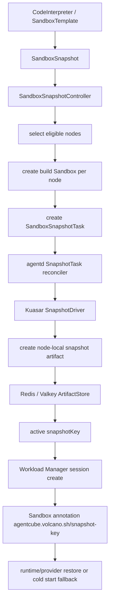

# Day 15：跟进 upstream PR 与阅读 SnapStart 实现

## 背景

Day15 开始从 Week2 的计划进入“持续参与社区”的节奏：一方面跟进我们已经提交的 upstream PR [#385](https://github.com/volcano-sh/agentcube/pull/385)，另一方面阅读社区正在推进的 SnapStart 实现 PR [#379](https://github.com/volcano-sh/agentcube/pull/379)，判断后续是否有适合参与的测试、review 或小修点。

本日继续遵循两个规则：

1. 实习报告、中文分析和本地计划继续放在 fork `main`。
2. upstream PR 代码只在干净 PR 分支处理，不把日报、benchmark 原始数据或中文-only 文档带进 PR。

## PR #385 状态跟进

目标 PR：

- PR：[feat: expose CodeInterpreter warm pool health #385](https://github.com/volcano-sh/agentcube/pull/385)
- 来源 issue：[#265](https://github.com/volcano-sh/agentcube/issues/265)
- 本地 PR 目录：`/home/agentcube-pr265`
- 分支：`feat/warmpool-available-condition`
- 当前状态：open，未合并

截至本日检查结果：

| 项 | 结果 |
| --- | --- |
| changed files | 3 个：`cmd/workload-manager/main.go`、`pkg/workloadmanager/codeinterpreter_controller.go`、`pkg/workloadmanager/codeinterpreter_controller_test.go` |
| commits | `809214d`、`8344a9f`，本日新增 commit `d885b4e` 并已 push |
| labels | `kind/enhancement`、`size/XL` |
| assignee | `RainbowMango` |
| OWNERS gate | 需要 `cmd/OWNERS`、`pkg/workloadmanager/OWNERS` approver |
| Codecov | patch coverage 已从最初 83.33% 提升到 96.15385%，仍提示 3 行缺失 |
| human review | 暂无明确 maintainer 修改意见 |
| AI review | Gemini 提出一条关于 `WarmPoolNotFound` warning event 噪音的建议 |

### Gemini review 内容

Gemini 指出：`ensureSandboxWarmPool` 在同一次 reconcile 中创建 `SandboxWarmPool` 后，controller-runtime 的 cache 可能还没同步。随后 `warmPoolAvailableCondition` 立刻 `Get` 这个 warm pool 时，可能短暂看到 `NotFound`。

这种情况下 `WarmPoolNotFound` condition 仍然有诊断意义，但如果立刻发 Warning Event，会产生噪音。因为 controller 会马上自愈创建 warm pool，下一轮 reconcile/cache 同步后状态会变成 `WarmPoolEmpty` 或 `WarmPoolReady`。

本地判断：这条 AI review 是合理的低风险建议，可以作为对 review 的响应处理。

## 本日 PR 分支修改

修改目录：`/home/agentcube-pr265`

修改内容：

```text
pkg/workloadmanager/codeinterpreter_controller.go
pkg/workloadmanager/codeinterpreter_controller_test.go
```

一句话总结：

> 保留 `WarmPoolNotFound` condition，但不再为这个可能由 cache 延迟导致的瞬态状态记录 Warning Event，从而减少 CodeInterpreter 初次创建时的事件噪音。

具体改动：

- `shouldRecordWarmPoolWarningEvent` 只对 `WarmPoolEmpty` 和 `WarmPoolBelowWatermark` 记录 Warning Event。
- 新增单测 case：`does not record transient not found condition`，验证 `WarmPoolNotFound` 不触发 warning event。

验证命令：

```bash
/tmp/go-toolchain/go/bin/go test -v ./pkg/workloadmanager -run 'TestShouldRecordWarmPoolWarningEvent|TestReconcileReportsWarmPoolEmptyInsteadOfOnlyReady|TestReconcileReportsWarmPoolBelowWatermark|TestReconcileUpdatesWarmPoolAvailableWhenPoolRecovers'
/tmp/go-toolchain/go/bin/go test ./pkg/workloadmanager
git diff --check
```

验证结果：

```text
PASS
ok github.com/volcano-sh/agentcube/pkg/workloadmanager
git diff --check 无输出
```

本日提交：

```text
d885b4e fix: suppress transient warm pool not found warning
```

当前状态：

```text
/home/agentcube-pr265
feat/warmpool-available-condition 已 push 到 origin，PR #385 已更新
```

下一步在 PR #385 回复 review，说明已按建议处理，并列出测试命令。

已回复 PR #385 的英文内容：

```md
Thanks, updated in the latest push.

Change:
- Kept the `WarmPoolNotFound` condition for status visibility.
- Stopped recording a Warning Event for `WarmPoolNotFound`, since it can be a transient cache-delay state right after the controller creates the `SandboxWarmPool`.
- Added a unit test to verify that `WarmPoolNotFound` does not emit a warning event.

Validation:
- `/tmp/go-toolchain/go/bin/go test -v ./pkg/workloadmanager -run 'TestShouldRecordWarmPoolWarningEvent|TestReconcileReportsWarmPoolEmptyInsteadOfOnlyReady|TestReconcileReportsWarmPoolBelowWatermark|TestReconcileUpdatesWarmPoolAvailableWhenPoolRecovers'`
- `/tmp/go-toolchain/go/bin/go test ./pkg/workloadmanager`
- `git diff --check`
```

### DCO 卡点与修复

push 后 DCO check 报错：

```text
DCO / DCO required action
Commit sha: 3b07619
The sign-off is missing.
```

原因：本日新增的第三个 commit 使用了普通 `git commit`，没有在 commit message 末尾带 `Signed-off-by: ranxi2001 <ranxi169@163.com>`。前两个 commit 已经带 signoff，所以只有最新 commit 被 DCO 拦住。

修复方式：

```bash
git commit --amend --no-edit --signoff
git push --force-with-lease origin feat/warmpool-available-condition
```

修复后 commit 从 `3b07619` 改写为：

```text
d885b4e fix: suppress transient warm pool not found warning
Signed-off-by: ranxi2001 <ranxi169@163.com>
```

重新检查 GitHub check 后，`DCO` 在 `d885b4e` 上已变为 success，输出为 `All commits are signed off!`。此时 `tide` 仍是 pending，但原因已经变成正常的流程状态：缺少 `approved`、`lgtm` labels，而不是 DCO 失败。

结论：以后所有 upstream PR commit 默认使用 `git commit -s`。如果已经提交但漏了 signoff，只改自己的 PR 分支时可以用 `git commit --amend --no-edit --signoff` 或 `git rebase HEAD~N --signoff` 修复，再用 `git push --force-with-lease` 更新远端分支。

## PR 自动化 Bot 和 Check 机制

开源项目通常会把 PR 处理拆成几类自动化：流程门禁、CI 测试、覆盖率、代码审查辅助、合并队列。AgentCube 当前 PR 页面里看到的 `DCO`、`Approve Workflows`、`Lint`、`Agentcube CI Workflow`、`Copyright Check`、`Python SDK Tests`、`Codespell`、`Test Coverage`、`Python Lint`、`Codegen Check`、`Agentcube E2E Tests`、`volcano-sh-bot`、`tide`、`Codecov`、`Gemini`、`Copilot` 就是这些角色的组合。

### 1. GitHub Actions checks

AgentCube 仓库内能直接看到 GitHub Actions 配置，位置是 `.github/workflows/`。

| Check | 配置文件 | 触发方式 | 作用 |
| --- | --- | --- | --- |
| Agentcube CI Workflow | `.github/workflows/main.yml` | `pull_request` | 构建 Docker image，验证主构建链路 |
| Lint | `.github/workflows/lint.yml` | `pull_request` | 跑 `golangci-lint` |
| Copyright Check | `.github/workflows/copyright-check.yml` | `pull_request` | 检查 Apache copyright header |
| Codespell | `.github/workflows/codespell.yml` | `pull_request` | 检查拼写错误 |
| Codegen Check | `.github/workflows/codegen-check.yml` | `pull_request` | 变更 API / hack / Makefile 时验证生成代码是否同步 |
| Agentcube E2E Tests | `.github/workflows/e2e.yml` | `pull_request` | 在 CI 环境创建 kind 集群跑 e2e |
| Python Lint | `.github/workflows/python-lint.yml` | `pull_request` | Python CLI / SDK / example lint |
| Python SDK Tests | `.github/workflows/python-sdk-tests.yml` | `pull_request`、`merge_group` | 跑 Python SDK 测试 |
| Test Coverage | `.github/workflows/test-coverage.yml` | `pull_request`、`merge_group` | 跑 Go coverage 并上传 Codecov |
| Approve Workflows | `.github/workflows/workflows-approve.yml` | `pull_request_target` | 对首次贡献者的 pending workflow 做自动批准判断 |

`pull_request` workflow 会在 PR 分支代码上下文中运行，适合测试 PR 内容。`pull_request_target` workflow 运行在目标分支上下文中，权限更高，常用于安全地处理标签、评论、批准 workflow 等流程动作；它不应该随便 checkout 并执行外部贡献者分支里的代码。

AgentCube 的 `Approve Workflows` 就是一个 `pull_request_target` workflow。它会判断 PR 作者是否首次贡献者：如果不是首次贡献者，或者 PR 已有 `ok-to-test` label，就调用 GitHub API 批准 pending workflow run。这是为了减少维护者手动点 “Approve and run” 的次数。

### 2. OWNERS、volcano-sh-bot、/lgtm、/approve、tide

AgentCube 使用 Kubernetes / Prow 风格的社区流程。仓库内的 `OWNERS` 文件定义谁可以 review、谁可以 approve：

```text
OWNERS
cmd/OWNERS
pkg/workloadmanager/OWNERS
docs/OWNERS
manifests/OWNERS
...
```

`OWNERS` 里一般有两类人：

- `reviewers`：可以做技术 review，满意后用 `/lgtm`。
- `approvers`：可以对自己负责的目录用 `/approve`。

`volcano-sh-bot` 会根据 PR 修改的文件路径读取相关 `OWNERS`，然后在 PR 里提示需要哪些目录的 approver。比如 #385 改了 `cmd/` 和 `pkg/workloadmanager/`，所以 bot 提示需要 `cmd/OWNERS` 和 `pkg/workloadmanager/OWNERS` 的 approval。

`tide` 是合并门禁/合并队列。它通常会检查：

- CI 是否通过。
- DCO 是否通过。
- 是否有有效 `/lgtm`。
- 是否有需要目录的 `/approve`。
- 是否没有 hold / conflict 等阻塞状态。

所以 `volcano-sh-bot` 和 `tide` 不是在评价代码好不好，而是在执行社区流程。真正的技术判断仍然来自 human reviewer / maintainer。

### 3. DCO

DCO 是 Developer Certificate of Origin，用来要求每个 commit 都声明贡献来源。它检查的是 commit message 里是否有：

```text
Signed-off-by: Name <email>
```

这不是 GPG 签名，也不是 GitHub verified badge，而是一行 commit message。最稳妥的写法是：

```bash
git commit -s -m "fix: ..."
```

漏了 signoff 后，DCO check 会失败。修复方式取决于情况：

| 情况 | 修复命令 |
| --- | --- |
| 只漏最新一个 commit，且分支只有自己使用 | `git commit --amend --no-edit --signoff` |
| 多个 commit 都漏，且分支只有自己使用 | `git rebase HEAD~N --signoff` |
| 修复后更新 PR 分支 | `git push --force-with-lease origin <branch>` |

注意：`--force-with-lease` 是为了安全地更新自己的 PR 分支；不要对多人协作分支随便 rewrite history。

### 4. Codecov

AgentCube 的 `.github/workflows/test-coverage.yml` 会运行：

```bash
go test -race -v -coverprofile=coverage.out -coverpkg=./pkg/... ./pkg/...
```

然后通过 `codecov/codecov-action@v4` 上传覆盖率。Codecov 根据 base/head 对比给出 patch coverage、project coverage 和缺失行。它不是 maintainer review，但 coverage 失败会影响 PR 信心，严重时可能成为合并阻塞。

#385 的例子：

- 初始 patch coverage 83.33%，提示 `pkg/workloadmanager/codeinterpreter_controller.go` 有缺失行。
- 补测试后提升到 96.15385%，说明新增 warm pool status 边界测试有效。

### 5. Gemini / Copilot AI reviewer

Gemini 和 Copilot 是 AI code review bot。它们通过 GitHub App 或仓库设置接入，不一定都在 repo 代码里配置。AgentCube 仓库里能看到 `.github/copilot-instructions.md`，它给 Copilot 提供项目结构、编码约定、常用命令和 PR hygiene 背景。

使用原则：

- AI reviewer 的评论可以当作 bug checklist。
- 不能把 AI reviewer 当作 maintainer consensus。
- 采纳前要自己读代码验证。
- 采纳后用小 commit 回复，并附测试结果。

#385 这次就是一个正例：Gemini 指出的 `WarmPoolNotFound` event 噪音确实合理，我们验证后改成只记录 `WarmPoolEmpty` 和 `WarmPoolBelowWatermark` 的 Warning Event。

### 6. 实际 PR 处理顺序

以后处理 AgentCube PR，可以按这个顺序看：

1. 看 DCO：如果失败，优先修 signoff，因为这是硬门禁。
2. 看 GitHub Actions：lint、build、codegen、copyright、e2e、Python checks 是否失败。
3. 看 Codecov：是否有明显缺失覆盖。
4. 看 AI reviewer：只挑自己能验证的问题处理。
5. 看 human reviewer：维护者意见优先级最高。
6. 看 volcano-sh-bot / tide：确认是否还缺 `/lgtm`、`/approve`、owner approval 或 merge queue 条件。

参考资料：

- Prow overview: https://docs.prow.k8s.io/docs/overview/
- Prow reviewers / approvers / OWNERS: https://docs.prow.k8s.io/docs/components/plugins/approve/approvers/
- Kubernetes Prow review commands: https://kubernetes.io/docs/contribute/review/for-approvers/
- DCO app: https://github.com/dcoapp/app
- Probot DCO usage: https://probot.github.io/apps/dco/
- GitHub Actions workflow approval: https://docs.github.com/en/actions/how-tos/manage-workflow-runs/approve-runs-from-forks
- GitHub Actions `pull_request_target`: https://docs.github.com/actions/using-workflows/events-that-trigger-workflows

## PR #379 SnapStart 实现阅读

目标 PR：

- PR：[feat: implement snapstart for codeinterpreter #379](https://github.com/volcano-sh/agentcube/pull/379)
- 作者：`lyuyun`
- 状态：open，未合并
- labels：`kind/feature`、`size/XXL`
- changed files：42
- additions / deletions：约 `+4249 / -66`

这个 PR 是 SnapStart 的落地实现，不是单纯文档提案。它对应前面读过的设计 PR [#366](https://github.com/volcano-sh/agentcube/pull/366)，范围明显更大。

### 代码范围

主要模块：

| 模块 | 文件 / 目录 | 作用 |
| --- | --- | --- |
| API / CRD | `pkg/apis/runtime/v1alpha1/snapshot_types.go`、`manifests/charts/base/crds/*snapshot*.yaml` | 新增 `SandboxSnapshot`、`SandboxSnapshotTask`、`SnapshotClass` |
| generated client | `client-go/.../sandboxsnapshot*`、`snapshotclass*` | 为新 CRD 生成 client、informer、lister |
| workload-manager | `pkg/workloadmanager/snapshot_controller.go`、`snapshot_fork.go`、`snapshot_mode.go` | 负责 snapshot 生命周期、artifact set、task 创建、active/pending promotion |
| agentd | `pkg/agentd/kuasar_driver.go`、`snapshot_task_reconciler.go`、`driver_registry.go` | node agent 侧处理 snapshot task，调用 Kuasar driver |
| artifact store | `pkg/store/artifact_store.go`、`artifact_store_redis.go`、`pkg/workloadmanager/artifact_store_init.go` | 通过 Redis/Valkey 存储 active/pending snapshot artifact manifest |
| CodeInterpreter 集成 | `pkg/workloadmanager/codeinterpreter_controller.go`、`handlers.go`、`server.go` | session sandbox 创建时查找 active snapshot key 并写入 restore intent |

### 核心实现链路



### 和 #366 设计的对齐情况

从代码初读看，#379 确实在实现 #366 的 Kubernetes-native SnapStart 路线：

- 用 CRD 表达 snapshot intent，而不是引入单独 direct Firecracker backend。
- `SandboxSnapshotController` 做通用生命周期和 artifact 状态管理。
- `SandboxSnapshotTask` 作为 node-facing task 交给 `agentd`。
- `SnapshotDriver` 把 provider 逻辑放到 node agent，本轮 provider 是 Kuasar。
- session sandbox 通过 `agentcube.volcano.sh/snapshot-key` annotation 表达 restore intent。
- artifact manifest 维护 active / pending 两套 artifact set，用于 rebuild 和 promotion。

### 当前明显风险

这个 PR 还不是小修级别，当前直接接手主功能不现实。比较明显的风险点包括：

| 风险 | 说明 |
| --- | --- |
| 测试覆盖不足 | Codecov 报告 patch coverage 约 1.86%，新增 controller、agentd driver、artifact store 都几乎未覆盖 |
| PR 过大 | 42 个文件、4k+ 行，包含 API、生成代码、controller、agentd、Redis、多处 wiring，review 成本高 |
| Kuasar 协议仍是 placeholder | `kuasar_driver.go` 里明确有 TODO，当前 JSON framing 是占位，真实 Kuasar admin socket 协议未稳定 |
| 本地不可实测 | 当前机器无 `/dev/kvm`，无法验证 Kuasar / MicroVM snapshot restore 真实路径 |
| 需要标准 K8s 环境 | 新 CRD、controller、agentd、Redis 组合最好在更完整 Kubernetes 环境验证；当前 kind 被环境卡住 |

### bot review 判断

#379 当前 review comments 主要来自 Gemini / Copilot，属于 AI reviewer，不等于 maintainer consensus。但其中有些是值得人工验证的工程问题：

| 评论来源 | 问题 | 当前观察 |
| --- | --- | --- |
| Gemini / Copilot | `bufio.Reader` 每次新建可能丢 buffered bytes | 最新代码主 handshake 路径已经改成复用 reader；`Inspect` 路径仍是单次命令/响应，暂不作为优先评论点 |
| Gemini | `noopArtifactStore` 静默成功会导致 controller 反复创建资源 | 当前代码已改成未配置 artifact store 时返回 error，让 controller backoff |
| Gemini | `ReadyAt` 不更新可能导致 rebuild loop | 当前 promotion 时会先把 `ss.Status.ReadyAt = nil`，但 `snapshotStatusEqual` 不比较 `ReadyAt`，状态 patch 仍可能被跳过 |
| Copilot | `NewArtifactStoreFromEnv` 创建 Redis client 后未关闭 | 当前代码已有 `defer closeArtifactStore(snapshotReconciler.ArtifactStore)`，此点已处理 |
| Copilot | `ctrl.SetupSignalHandler()` 不应多次调用 | 当前 `cmd/agentd/main.go` 确实有两次调用，但 Copilot 已经指出，不重复评论 |

结论：这些 AI review 不能直接当作社区决定，但可以作为我们后续做测试/小修的 checklist。更稳妥的参与方式是先补 unit tests 或提出有证据的 review comment，而不是直接改主功能。

### #379 可发评论点：ReadyAt 状态可能仍未持久化

第二轮阅读后，最有增量价值的评论点不是重复 Copilot 已经提过的 `SetupSignalHandler`，而是继续核对 Gemini 提过的 `ReadyAt` rebuild-loop 修复是否完整。

当前代码链路：

```go
// pkg/workloadmanager/snapshot_controller.go
manifest.ActiveSetRef = manifest.PendingSetRef
manifest.PendingSetRef = store.SnapshotArtifactSetRef{}
ss.Status.ReadyAt = nil
```

promotion 时确实清空了内存对象里的 `ReadyAt`。随后 `buildSnapshotStatus` 会在 `ss.Status.ReadyAt == nil` 时生成新的 `status.ReadyAt`。

但 `patchSnapshotStatus` 会先调用：

```go
func snapshotStatusEqual(a, b runtimev1alpha1.SandboxSnapshotStatus) bool {
	return a.Phase == b.Phase &&
		a.TargetNodeCount == b.TargetNodeCount &&
		a.CreatingNodeCount == b.CreatingNodeCount &&
		a.ReadyNodeCount == b.ReadyNodeCount &&
		a.FailedNodeCount == b.FailedNodeCount &&
		a.UnavailableNodeCount == b.UnavailableNodeCount &&
		a.Message == b.Message
}
```

这里没有比较 `ReadyAt`。如果 pending artifact set promotion 后，聚合出来的 phase、ready/failed/unavailable 节点数和 message 与旧 active set 相同，`patchSnapshotStatus` 可能直接返回，不会把新的 `ReadyAt` patch 到 API server。下一轮 reconcile 从 API server 取到的对象仍可能带旧 `ReadyAt`，`maybeStartBackgroundRebuild` 里的 `time.Since(ss.Status.ReadyAt.Time) > RebuildAfter` 又会成立，从而继续触发 background rebuild。

本地无法实测 Kuasar / KVM restore 路径，但这个问题可以在 controller fake client / unit test 层验证，不依赖真实 MicroVM。

准备发到 #379 的英文评论草稿：

````md
I think the `ReadyAt` rebuild-loop fix may still be incomplete in the current code.

During promotion, `reconcileWithHandler` clears the in-memory `ReadyAt` before aggregating status:

```go
manifest.ActiveSetRef = manifest.PendingSetRef
manifest.PendingSetRef = store.SnapshotArtifactSetRef{}
ss.Status.ReadyAt = nil
```

`buildSnapshotStatus` then computes a fresh `status.ReadyAt`. However, `patchSnapshotStatus` can still skip the status patch because `snapshotStatusEqual` does not compare `ReadyAt`:

```go
return a.Phase == b.Phase &&
    a.TargetNodeCount == b.TargetNodeCount &&
    a.CreatingNodeCount == b.CreatingNodeCount &&
    a.ReadyNodeCount == b.ReadyNodeCount &&
    a.FailedNodeCount == b.FailedNodeCount &&
    a.UnavailableNodeCount == b.UnavailableNodeCount &&
    a.Message == b.Message
```

If the promoted pending set has the same aggregate phase/count/message as the old active set, the new `ReadyAt` will not be persisted. On the next reconcile, the object fetched from the API server may still carry the old `ReadyAt`, so `RebuildAfter` can look elapsed again and start another background rebuild.

Would it make sense to include `ReadyAt` in `snapshotStatusEqual` or force a status patch after promotion, and add a unit test for background rebuild promotion resetting the persisted `ReadyAt`?
````

注意：这条评论和 Gemini 原评论相关，但不是重复原评论。Gemini 说的是 promotion 没有重置 `ReadyAt`；当前代码已经重置了内存字段。我们指出的是重置后的新 `ReadyAt` 可能因为 equality 判断缺字段而没有被持久化。

## Day15 初步结论

今天最值得继续推进的是两个小闭环：

1. **#385 review 响应闭环**
   - 已完成本地修复和测试。
   - 已 push 到 `origin/feat/warmpool-available-condition`。
   - 已回复 Gemini thread，说明 `WarmPoolNotFound` 不再触发 Warning Event，并附测试命令。
   - DCO 漏签已通过 `git commit --amend --no-edit --signoff` 修复，当前等待 maintainer review / `/lgtm` / `/approve`。

2. **#379 可参与点收敛**
   - 不重复实现 SnapStart。
   - 不重复 AI reviewer 已经明确提过的 `SetupSignalHandler` 评论。
   - 当前可发的增量 review 点是 `ReadyAt` promotion 后可能未持久化，因为 `snapshotStatusEqual` 没有比较 `ReadyAt`。
   - 这类问题可通过 controller unit test 验证，不依赖本机 KVM / Kuasar 环境。

## 2026-06-17 14:30 线上讨论任务

会议目标：和 `FAUST-BENCHOU` 一起讨论 AgentCube 下一步参与计划，重点围绕 v0.2.0 umbrella issue [#386](https://github.com/volcano-sh/agentcube/issues/386) 选择可落地、低重复的贡献方向。

会前上下文：

- `#386` 是 AgentCube v0.2.0 的 call-for-proposals / umbrella tracking issue，当前没有 assignee，维护者希望社区在评论里提出 feature、enhancement、cleanup、docs、test 等候选事项。
- `FAUST-BENCHOU` 已在 `#386` 提出 `Sandbox Sleep/Resume`，希望补齐文档中描述但 v0.1 尚未实现的 Ready -> Paused -> Ready 生命周期，并表示如果提案被接受，愿意接手。
- 另一个社区提案是适配最新 `kubernetes-sigs/agent-sandbox`，原因是 AgentCube 当前依赖的 `agent-sandbox v0.1.1` warm pool 能力与新版本 warm pool 重构后可能不兼容。
- 本地当前受限于没有 `/dev/kvm`、kind 标准集群启动失败，真实 MicroVM / Kuasar / SnapStart 路径不能直接实测；适合优先做 issue 分析、方案拆分、unit test、docs/test PR 或 controller 层小修。

会议建议议程：

1. 对齐 `#386` 当前两个候选方向：`Sandbox Sleep/Resume` 与 `agent-sandbox` 最新版本适配。
2. 评估和现有主线的关系：`#385` warm pool health、`#379` SnapStart、`#365/#366` benchmark / proposal。
3. 决定是否把 `Sandbox Sleep/Resume` 拆成 dedicated sub-issue：Workload Manager idle pause、Router resume before proxy、Store session state、GC policy、test plan。
4. 讨论我们能承担的低风险产出：英文 proposal comment、状态机/接口文档、最小 controller test、benchmark scope、或 review 反馈。
5. 明确会后动作：谁负责发社区评论、谁负责补设计/测试、是否需要先等维护者 triage。

会议前准备事项：

- 阅读并记录 `#386` 的最新评论，区分维护者明确意见、社区提案和个人推断。
- 准备一份中文内部总结，避免会上只讨论大方向而没有可检查产出。
- 如果要发 upstream 评论，按 `internship-reports/open-source-contribution-format-standard.md` 用英文草稿，不直接贴中文分析。

### `agent-sandbox` 最新版本适配提案核查

`zhzhuang-zju` 在 `#386` 提到：AgentCube 当前 `code-interpreter` warm pool 使用 `agent-sandbox v0.1.1` 的 `sandboxwarmpool` 能力，本地测试发现和最新 `agent-sandbox` 不兼容，因此建议适配最新版本。

本地核查结论：这个方向基本真实，但表述需要更精确。

已确认事实：

- AgentCube 当前 `go.mod` 仍固定依赖 `sigs.k8s.io/agent-sandbox v0.1.1`。
- `agent-sandbox` 当前稳定 tag 已到 `v0.4.6`，并且还有 `v0.5.0rc1`。
- 在临时副本 `/tmp/agentcube-as-upgrade` 中执行 `go get sigs.k8s.io/agent-sandbox@v0.4.6 && go test ./pkg/workloadmanager ./cmd/workload-manager ./cmd/agentd` 后，编译失败：

```text
pkg/workloadmanager/handlers.go:246:63: undefined: controllers.SandboxPodNameAnnotation
FAIL github.com/volcano-sh/agentcube/pkg/workloadmanager [build failed]
```

这说明 AgentCube 不能直接把 `agent-sandbox` 从 `v0.1.1` 升到 `v0.4.6` 后保持当前代码编译通过。

需要注意的边界：

- `SandboxWarmPool` / `SandboxClaim` API 没有在最新版本中消失，`SandboxWarmPoolSpec.Replicas`、`TemplateRef`、`Status.ReadyReplicas` 等核心字段仍存在。
- 新版本 warm pool 逻辑有明显语义变化：warm pool controller 已围绕 `Sandbox` 管理池资源，并新增 `SandboxClaimSpec.WarmPool` policy、claim lifecycle、warm pool update strategy 等能力。
- 因此更准确的说法不是“warm pool feature 已经不可用”，而是“AgentCube 当前依赖旧版本内部常量和旧 warm pool 行为，直接升级到最新 `agent-sandbox` 会编译失败，且需要重新核对 SandboxClaim / SandboxWarmPool 的运行语义、CRD、RBAC、测试和文档”。

会议建议：

- 可以把“适配最新 `agent-sandbox`”作为 v0.2.0 候选任务。
- 建议先拆成一个 audit / compatibility matrix，而不是直接承诺完整实现。
- 最小产出可以是：列出 API/常量/CRD/RBAC/行为差异、修复 `SandboxPodNameAnnotation` 依赖、补 warm pool claim 的 unit test，再决定是否升级到 `v0.4.6` 或等待 `v0.5.0` 稳定版。

### 编译失败溯源

为了判断这个提案是否能作为明确 bug / compatibility task，本地继续做了版本矩阵和 git history 溯源。

临时验证命令：

```bash
git clone /home/agentcube /tmp/agentcube-as-v0.2.1
cd /tmp/agentcube-as-v0.2.1
/tmp/go-toolchain/go/bin/go get sigs.k8s.io/agent-sandbox@v0.2.1
/tmp/go-toolchain/go/bin/go test ./pkg/workloadmanager ./cmd/workload-manager ./cmd/agentd
```

同样方式分别测试 `v0.3.10` 和 `v0.4.6`。

结果：

| agent-sandbox 版本 | 结果 | 说明 |
| --- | --- | --- |
| `v0.2.1` | PASS | 仍保留 `controllers.SandboxPodNameAnnotation`，AgentCube 当前引用能编译 |
| `v0.3.10` | FAIL | `controllers.SandboxPodNameAnnotation` 不存在 |
| `v0.4.6` | FAIL | 同样因 `controllers.SandboxPodNameAnnotation` 不存在 |

失败日志：

```text
pkg/workloadmanager/handlers.go:246:63: undefined: controllers.SandboxPodNameAnnotation
FAIL github.com/volcano-sh/agentcube/pkg/workloadmanager [build failed]
```

直接原因：

- AgentCube 在 `pkg/workloadmanager/handlers.go` 和 `handlers_test.go` 里从 `sigs.k8s.io/agent-sandbox/controllers` 引用 `SandboxPodNameAnnotation`。
- `agent-sandbox v0.1.1 / v0.2.1` 中，这个常量定义在 `controllers/sandbox_controller.go`：

```go
SandboxPodNameAnnotation = "agents.x-k8s.io/pod-name"
```

- 从 `agent-sandbox v0.3.10` 开始，这个常量被放到了公开 API 包 `api/v1alpha1/sandbox_types.go`：

```go
sandboxv1alpha1.SandboxPodNameAnnotation = "agents.x-k8s.io/pod-name"
```

所以这是一个典型的“下游依赖了上游 controller 内部符号，后来上游把符号迁到 API 包后下游编译失败”的兼容性问题。最小代码修复方向是把 AgentCube 的引用从 `controllers.SandboxPodNameAnnotation` 改成 `sandboxv1alpha1.SandboxPodNameAnnotation`，并同步测试。

深层原因：

- `agent-sandbox` PR `#395` / commit `0c86a69` 的主题是 `refactor: warm pool creates full Sandbox CRs instead of bare pods`。
- `v0.1.1 / v0.2.1` 的 warm pool 路径是 `tryAdoptPodFromPool` + `createPoolPod`：`SandboxClaim` 从 warm pool 里直接领一个 `Pod`。
- `v0.3.10+` 的 warm pool 路径变成 `adoptSandboxFromCandidates` + `createPoolSandbox`：`SandboxWarmPool` 先创建完整 `Sandbox` CR，再由 `SandboxClaim` 领这个 `Sandbox`。
- 后续 commit `32cddd3` / PR `#272` 又统一了 `SandboxPodNameAnnotation` 的设置，使普通 sandbox 和 warm-pool adopted sandbox 都显式记录底层 Pod 名。

结论：

`zhzhuang-zju` 的提案可以作为明确的 compatibility bug / enhancement 来支持。评论时建议避免只说“latest agent-sandbox incompatible”，而是写成：

> I reproduced the incompatibility. AgentCube builds with `agent-sandbox v0.2.1`, but fails from `v0.3.10` onward because it still imports `controllers.SandboxPodNameAnnotation`, while the annotation constant moved to the public API package as `sandboxv1alpha1.SandboxPodNameAnnotation`. This is connected to the warm pool refactor where `SandboxWarmPool` creates full `Sandbox` CRs instead of bare Pods, so the adaptation should include both the direct compile fix and a warm pool/SandboxClaim behavior audit.

### 最小代码修复验证与运行语义风险

为了避免上游评论停留在“复述不兼容”，在临时副本 `/tmp/agentcube-as-minfix` 做了一个最小修复实验。

最小代码改动：

- `pkg/workloadmanager/handlers.go`
  - 删除 `sigs.k8s.io/agent-sandbox/controllers` 导入。
  - 把 `controllers.SandboxPodNameAnnotation` 改为 `sandboxv1alpha1.SandboxPodNameAnnotation`。
  - 顺手把注释里的旧 annotation 文本从 `agents.x-k8s.io/sandbox-pod-name` 修正为实际值 `agents.x-k8s.io/pod-name`。
- `pkg/workloadmanager/handlers_test.go`
  - 同样把测试里的 `controllers.SandboxPodNameAnnotation` 改为 `sandboxv1alpha1.SandboxPodNameAnnotation`。

临时 diff 核心片段：

```diff
-    "sigs.k8s.io/agent-sandbox/controllers"
     extensionsv1alpha1 "sigs.k8s.io/agent-sandbox/extensions/api/v1alpha1"
@@
-    if podName, exists := createdSandbox.Annotations[controllers.SandboxPodNameAnnotation]; exists {
+    if podName, exists := createdSandbox.Annotations[sandboxv1alpha1.SandboxPodNameAnnotation]; exists {
        sandboxPodName = podName
    }
```

验证结果：

| 组合 | 结果 | 说明 |
| --- | --- | --- |
| 最小代码改动 + 当前 `agent-sandbox v0.1.1` | FAIL | `sandboxv1alpha1.SandboxPodNameAnnotation` 在 `v0.1.1` 不存在，所以这个改动必须和依赖升级绑定 |
| 最小代码改动 + `agent-sandbox v0.3.10` | PASS | `go test ./pkg/workloadmanager ./cmd/workload-manager ./cmd/agentd` 通过；排除 `test/e2e` 后 `go test` 全部通过 |
| 最小代码改动 + `agent-sandbox v0.4.6` | PASS | `go test ./pkg/workloadmanager ./cmd/workload-manager ./cmd/agentd` 通过；排除 `test/e2e` 后 `go test` 全部通过 |

更完整的本地验证命令：

```bash
/tmp/go-toolchain/go/bin/go get sigs.k8s.io/agent-sandbox@v0.4.6
/tmp/go-toolchain/go/bin/go test ./pkg/workloadmanager ./cmd/workload-manager ./cmd/agentd
/tmp/go-toolchain/go/bin/go list ./... | grep -v '^github.com/volcano-sh/agentcube/test/e2e$' | xargs /tmp/go-toolchain/go/bin/go test
```

结果说明：

- 这说明“公开 API 常量替换 + 依赖升级”足以解决当前编译失败。
- 但这还不能证明 warm-pool-backed CodeInterpreter 真实运行可用，因为本机没有可用 kubeconfig / 标准 e2e 环境；`go test ./...` 进入 `test/e2e` 后会失败在 `localhost:8080/8081` 未启动、没有 kubeconfig 等环境前置条件。

进一步代码审计发现一个更关键的运行语义风险：

- AgentCube 创建 warm-pool-backed CodeInterpreter 时，`buildSandboxByCodeInterpreter` 先生成一个 `sandboxName`，同时创建同名 `SandboxClaim`。
- `handleSandboxCreate` 立即对这个 `sandboxName` 调用 `WatchSandboxOnce(namespace, sandboxName)`，也就是只等待同名 `Sandbox` 的 Ready 事件。
- `agent-sandbox v0.1.1 / v0.2.1` 的 warm pool 路径是 `SandboxClaim` 从 pool 里领一个 bare `Pod`，然后创建 claim 同名 `Sandbox`，所以这个等待逻辑基本成立。
- `agent-sandbox v0.3.10+` 的 warm pool 路径变成 `SandboxWarmPool` 预先创建 generated-name 的 `Sandbox` CR；`SandboxClaim` adopt 的是这个已有 `Sandbox`，实际 Ready 的 `Sandbox` 名可能是 `ci-name-xxxxx`，不一定等于 claim 名。
- 新版 `SandboxClaim` controller 会把 adopted sandbox 名写到 claim label / status，例如 `AssignedSandboxNameLabel` 和 `claim.Status.SandboxStatus.Name`，但 AgentCube 当前没有 watch `SandboxClaim` status，也不会根据 claim status 中的真实 sandbox 名重新注册 watcher。

用临时单测证明当前 AgentCube watcher 会漏掉“adopted sandbox 名与 claim 名不同”的 Ready 事件：

```go
func TestSandboxReconcilerWatchDoesNotNotifyDifferentAdoptedSandboxName(t *testing.T) {
	resultCh := reconciler.WatchSandboxOnce(context.Background(), "default", "claim-name")

	_, err := reconciler.Reconcile(context.Background(), ctrl.Request{NamespacedName: types.NamespacedName{
		Namespace: "default",
		Name:      "warm-pool-sandbox-abc",
	}})
	require.NoError(t, err)

	select {
	case result := <-resultCh:
		t.Fatalf("unexpected notification for sandbox %q", result.Sandbox.Name)
	case <-time.After(50 * time.Millisecond):
	}
}
```

该临时测试通过，说明当前 watcher key 不匹配时不会收到通知。换句话说，最小常量修复只能解决编译，不能作为完整运行修复。

更靠谱的后续实现方向：

1. 做一个小 PR 修直接编译问题时，必须把依赖版本一起升级，不能只替换常量。
2. 运行语义修复需要让 AgentCube 在 warm-pool-backed `SandboxClaim` 路径下等待真实 adopted sandbox：
   - watch `SandboxClaim` Ready / status；
   - 或根据 `SandboxClaim.Status.SandboxStatus.Name` / `AssignedSandboxNameLabel` 解析真实 `Sandbox` 名；
   - 或调整 agent-sandbox integration，让 claim 名和最终 sandbox 名保持 AgentCube 期望的一致性。
3. e2e / integration test 需要改掉旧假设：当前 e2e helper 仍通过 `Pod.OwnerReferences.Kind == SandboxWarmPool` 来数 warm pool pods；`v0.3.10+` 后 warm pool 直接 owns `Sandbox`，Pod 通常由 Sandbox own。

准备发到 `#386` 的英文评论全文：

```text
Thanks for proposing this. I did a deeper compatibility check and I agree this is a concrete v0.2.0 task.

What I found:

- AgentCube currently pins `sigs.k8s.io/agent-sandbox v0.1.1`.
- Upgrading only to `agent-sandbox v0.2.1` still builds:
  - `go test ./pkg/workloadmanager ./cmd/workload-manager ./cmd/agentd`
- Upgrading to `v0.3.10` or `v0.4.6` fails with:

~~~text
pkg/workloadmanager/handlers.go:246:63: undefined: controllers.SandboxPodNameAnnotation
~~~

The direct cause seems to be that AgentCube still imports `controllers.SandboxPodNameAnnotation`, while newer agent-sandbox versions moved that annotation constant into the public API package as `sandboxv1alpha1.SandboxPodNameAnnotation`.

I also tried the minimal code fix locally:

- replace `controllers.SandboxPodNameAnnotation` with `sandboxv1alpha1.SandboxPodNameAnnotation`
- remove the `sigs.k8s.io/agent-sandbox/controllers` import from `pkg/workloadmanager/handlers.go` and `handlers_test.go`

With that change:

- current `agent-sandbox v0.1.1` no longer builds, because the public API constant does not exist there.
- `agent-sandbox v0.3.10` builds and passes non-e2e tests.
- `agent-sandbox v0.4.6` builds and passes non-e2e tests.

The command I used after the minimal patch was:

~~~bash
go test ./pkg/workloadmanager ./cmd/workload-manager ./cmd/agentd
go list ./... | grep -v '^github.com/volcano-sh/agentcube/test/e2e$' | xargs go test
~~~

So the direct compile breakage is probably small, but I do not think that is enough for a complete runtime fix.

The larger behavior change is more important: starting around `v0.3.10`, agent-sandbox warm pool adoption changed from adopting bare Pods (`tryAdoptPodFromPool` / `createPoolPod`) to adopting full Sandbox CRs (`adoptSandboxFromCandidates` / `createPoolSandbox`). In the new flow, a `SandboxClaim` may adopt a pre-created warm-pool Sandbox whose generated name is different from the claim name. AgentCube currently registers its ready watcher before creation with the generated claim/sandbox name from `buildSandboxByCodeInterpreter`, and only waits for a `Sandbox` Ready event with that exact name.

That means the minimal compile fix may still miss the Ready event for a warm-pool-adopted Sandbox unless AgentCube also watches `SandboxClaim` status or resolves the real adopted Sandbox name from `claim.Status.SandboxStatus.Name` / `AssignedSandboxNameLabel`.

I could not validate the full runtime path locally because the e2e suite requires a working Kubernetes/kubeconfig setup and running workload-manager/router services, but the code path above looks like a real integration risk.

Suggested scope:

1. Add a compatibility matrix for the current AgentCube warm pool integration against recent agent-sandbox versions.
2. Fix the direct compile breakage together with the agent-sandbox dependency bump.
3. Update the warm-pool-backed CodeInterpreter wait logic for the new SandboxClaim -> adopted Sandbox flow.
4. Update e2e/helper assumptions that currently count warm pool Pods by `SandboxWarmPool` owner reference; newer agent-sandbox versions create warm pool Sandbox CRs instead.
5. Add an integration/e2e test for warm-pool-backed CodeInterpreter creation against the target agent-sandbox version.

I can help with the compatibility audit and a focused follow-up PR if maintainers agree this should be tracked for v0.2.0.
```

已发布到 `#386`：

- 评论链接：https://github.com/volcano-sh/agentcube/issues/386#issuecomment-4725375092
- 发布时间：2026-06-17
- 当前状态：已成功显示在 `zhzhuang-zju` 的 `agent-sandbox` 适配提案下方，暂无 maintainer 回复。
- 后续观察点：是否有维护者将该提案 triage 成 dedicated sub-issue；是否需要我们继续做 compatibility audit PR 或最小修复 PR。

### `Sandbox Sleep/Resume` 提案代码级分析

`FAUST-BENCHOU` 在 `#386` 提出的 `Sandbox Sleep/Resume` 方向和现有文档是对齐的，但和当前代码实现差距较大。当前更准确的判断是：AgentCube v0.1 已经有 idle / TTL 驱动的删除式 GC，但还没有 Ready -> Paused -> Ready 的 session 状态机，也没有 Router 侧恢复逻辑。

文档侧确实已经承诺过该能力：

- `docs/design/agentcube-proposal.md:148-156` 写了 `Ready -> Paused`、`Paused -> Ready`、`Paused -> Deleted`，并明确新请求在 pause window 内应复用 existing context。
- `docs/agentcube/docs/architecture/overview.md:46-62` 同样画了 `Ready -> Paused -> Ready` 的生命周期，并称之为 hibernation。
- `README.md` 和用户文档也提到 smart sleep/resume / lifecycle management，因此提案不是新方向，而是补齐文档与实现之间的 gap。

当前 API / CRD 层还没有 pause 语义：

- `AgentRuntimeSpec` 只有 `sessionTimeout` 和 `maxSessionDuration`。`sessionTimeout` 注释仍是 inactive session will be terminated，`maxSessionDuration` 是硬删除 TTL，没有 `pauseTimeout` 字段。
- `CodeInterpreterSpec` 也只有 `sessionTimeout`、`maxSessionDuration`、`warmPoolSize` 等字段；`sessionTimeout` 注释是 inactive session eligible for cleanup。
- 因此如果实现提案，至少要决定是否引入 `pauseTimeout`，并重新定义 `sessionTimeout` 的语义：从“空闲后删除”改成“空闲后暂停”。

当前 Store/session 模型也还不是状态机：

- `types.SandboxInfo` 有 `Status string`，但现有写入值主要是 `creating`、`ready`、`not-ready`，不是强类型状态，也没有 `PausedAt`、`PauseExpiresAt`、`DeletedAt`。
- `store.Store` 只提供 session lookup、store/update/delete、按 `ExpiresAt` 列 expired、按 last activity 列 inactive、更新 last activity。没有按 paused deadline 列表扫描的索引，也没有原子状态迁移接口。
- Redis / ValKey 实现目前维护 expiry sorted set 和 last_activity sorted set。要支持 `Paused -> Deleted`，需要新增 paused index 或把 pause deadline 存入现有 expiry 语义，但后者会混淆 max TTL 和 pause timeout。

当前 Router 也不会恢复 paused session：

- `pkg/router/session_manager.go` 中已有 session id 时只从 store 取 `SandboxInfo`，没有检查 paused 状态，也不会调用 Workload Manager resume。
- `pkg/router/handlers.go` 中 `handleInvoke` 的流程是：取 session -> 更新 last activity -> `forwardToSandbox` -> 再更新 last activity。
- 如果 pause 的实现方式是删除 Pod / 清掉旧 endpoint，那么 Router 必须在 proxy 前恢复并刷新 endpoint；否则会直接把请求转发到旧 Pod IP，出现 connection refused / timeout。

当前 Workload Manager API 也只有 create/delete：

- `pkg/workloadmanager/server.go` 只有：
  - `POST /v1/agent-runtime`
  - `DELETE /v1/agent-runtime/sessions/:sessionId`
  - `POST /v1/code-interpreter`
  - `DELETE /v1/code-interpreter/sessions/:sessionId`
- 还没有 `pause` / `resume` endpoint，也没有内部 `PauseSandbox` / `ResumeSandbox` 方法。

当前 GC 行为是直接删除，不是暂停：

- `pkg/workloadmanager/garbage_collection.go` 先从 store 列 inactive candidates，再按每个 sandbox 的 `IdleTimeout` 过滤。
- 对符合 idle timeout 或 max TTL 的 sandbox，最终调用 `deleteSandbox` / `deleteSandboxClaim`，然后 `DeleteSandboxBySessionID` 删除 store 记录。
- `garbage_collection_test.go` 的单测也明确期望 `IdleTimeout elapsed` 后 session 被删除，而不是进入 paused 状态。
- 所以 `sessionTimeout` 当前实际语义是 `Ready -> Deleted`，不是提案中的 `Ready -> Paused`。

agent-sandbox 底层能力需要谨慎表述：

- 当前 AgentCube 依赖 `sigs.k8s.io/agent-sandbox v0.1.1`，最新版本本地模块缓存有 `v0.4.6`。
- `agent-sandbox` 的 `SandboxSpec` 有 `replicas`，允许 0/1。`replicas=0` 时 controller 会删除 Pod；`replicas=1` 时会创建 / 采纳 Pod。
- 但 `agent-sandbox` API 中没有专门的 `Paused` / `Resume` 字段，也没有真实 suspend/resume 语义。用 `replicas=0/1` 实现的更准确说法是 stop/recreate 或 scale-to-zero / scale-from-zero。
- 这类实现可以释放 CPU/memory，也可能通过 PVC 保留 `/workspace` 文件，但不能自动保留进程内存、Python kernel 状态、内存变量或未落盘上下文。FAUST 提案里说的 `workspace/context` 需要先明确范围。

一个容易踩坑的点：`agent-sandbox` 把 `replicas=0` 当作 Ready。

- 在 `agent-sandbox v0.4.6` 的 `computeReadyCondition` 中，如果 Pod 不存在且 `sandbox.Spec.Replicas == 0`，message 是 `Pod does not exist, replicas is 0`，并且会把 `podReady = true`。
- 也就是说，如果 AgentCube 只依赖 `Sandbox Ready=True`，会把 scale-to-zero 的 sandbox 看成可服务。
- 因此 AgentCube 必须在自己的 store/session state 里显式记录 `Paused`，Router 必须先检查 session state，再决定是否 resume，不能只依赖 agent-sandbox Ready condition。

warm pool / SandboxClaim 路径也要单独设计：

- CodeInterpreter 有 warm pool 时，AgentCube 创建的是 `SandboxClaim`，并把 store 里的 `Kind` 记为 `SandboxClaim`。
- 在 `agent-sandbox v0.3.10+` 中，warm pool adoption 已经变成 adopt generated-name `Sandbox` CR，真实 Sandbox 名可能不等于 claim 名。这个问题已经在上面的 agent-sandbox 适配分析里单独记录。
- Sleep/Resume 如果要支持 warm-pool-backed CodeInterpreter，不能只按 store 里的 claim name patch `Sandbox.spec.replicas`；需要先解析真实 adopted Sandbox 名，或直接以 `SandboxClaim.Status.SandboxStatus.Name` / `AssignedSandboxNameLabel` 为准。
- 同时要决定 paused session 是否还能回 warm pool。直觉上不应回 pool，因为它带有用户 workspace/session context；否则会污染后续新 session。paused session 应该仍然是专属 session 资源。

建议把实现拆成两个层级：

1. 最小可落地版本：基于 `Sandbox.spec.replicas=0/1` 的 stop/recreate 型 sleep/resume。
   - CRD 增加 `pauseTimeout`，重新定义 `sessionTimeout` 为 Ready -> Paused。
   - Store 增加 session state：`Creating`、`Ready`、`Paused`、`Deleted`，并增加 `PausedAt` / `PauseExpiresAt`。
   - GC 改成两阶段：idle Ready session 先 patch replicas=0 并更新 store 为 Paused；Paused 超过 pauseTimeout 或 maxSessionDuration 才删除 CR 和 store。
   - Router 在有 `x-agentcube-session-id` 且 state 为 Paused 时，先调用 Workload Manager resume，等待实际 Pod / endpoint ready，刷新 store 后再 proxy。
   - Resume 后必须刷新 `EntryPoints`，因为 Pod IP 很可能变化。
   - 并发请求同一个 paused session 时需要 session-level lock / idempotent resume，避免重复 patch / 重复等待。

2. 长期版本：如果社区要求真正“保留进程上下文”的 pause/resume，则 AgentCube 不能只靠 `replicas=0/1`。
   - 需要 agent-sandbox 或底层 runtime 支持 checkpoint / VM pause / container freeze 等能力。
   - 需要明确不同 runtime 的能力矩阵：普通 Pod、Kata/Kuasar、未来 SnapStart、warm pool CodeInterpreter 的语义不一样。
   - 文档中的 `context` 需要限定为 filesystem workspace，还是包含内存态。

建议给 FAUST / maintainer 的讨论问题：

1. `Sleep/Resume` 第一版是否接受 `replicas=0/1` 的 stop/recreate 语义？如果接受，文档里应避免承诺进程内存上下文保留。
2. 是否新增 `pauseTimeout`，还是复用现有 `sessionTimeout` / `maxSessionDuration`？从代码清晰度看，新增 `pauseTimeout` 更合理。
3. `Paused` session 的 source of truth 放在哪里？建议放在 AgentCube store，而不是依赖 agent-sandbox Ready condition。
4. warm-pool-backed CodeInterpreter 是否必须第一版支持？如果支持，agent-sandbox 最新版本适配和 adopted Sandbox name 解析应作为前置任务或同一 epic 的子任务。
5. 需要哪些 e2e 断言：idle 后 Pod 消失但 session 仍存在；resume 后 session id 不变、workspace 文件仍在、endpoint 被刷新；pause timeout 后 session 和 K8s 资源删除。

阶段性结论：这个提案是真问题，而且和文档承诺一致；但实现不是“小补一个 GC 分支”。最小版本也会横跨 API/CRD、store schema、WorkloadManager GC、WorkloadManager pause/resume API、Router session path、agent-sandbox integration、并发控制和 e2e 测试。比较稳妥的社区回复应该支持开 dedicated sub-issue，但建议先明确 pause 语义和第一阶段 scope。

### 两个 `#386` 提案之间的关系

`Sandbox Sleep/Resume` 和 `agent-sandbox` 版本适配不是同一个任务，但它们有明显的先后依赖关系。

- `agent-sandbox` 适配是底层兼容性任务，解决 AgentCube 依赖旧版本 `v0.1.1`、直接升级会编译失败、warm pool / SandboxClaim 运行语义变化的问题。
- `Sandbox Sleep/Resume` 是 AgentCube 侧产品语义任务，涉及 session state、Router resume、GC 两阶段策略、pauseTimeout、用户 session 生命周期。
- Sleep/Resume 的底层动作大概率要落到 `agent-sandbox` 的 `Sandbox.spec.replicas=0/1`、`SandboxClaim`、真实 adopted Sandbox 名、Ready condition 等接口上，所以它不能完全脱离 agent-sandbox 版本来实现。

如果先在 `agent-sandbox v0.1.1` 上实现 Sleep/Resume，后续升级到 `v0.3.10+ / v0.4.6` 时很可能要返工：

- `SandboxPodNameAnnotation` 位置已经从 `controllers` 包迁到公开 API 包。
- warm pool 从 bare Pod adoption 变成 full Sandbox CR adoption。
- `SandboxClaim` 会记录真实 adopted Sandbox 名，而这个名可能不等于 AgentCube 生成的 claim 名。
- `replicas=0` 在 agent-sandbox 里可能仍被视为 `Ready=True`，AgentCube 必须自己维护 `Paused` state，不能用底层 Ready condition 直接表示可代理。

因此更稳妥的拆分方式：

1. 先做 `agent-sandbox` compatibility audit / dependency bump，至少确定目标版本、CRD/RBAC、SandboxClaim adopted Sandbox name、Ready condition、warm pool e2e 行为。
2. 同时设计 AgentCube 自己的稳定生命周期抽象：`Creating / Ready / Paused / Deleted`、`PausedAt`、`PauseExpiresAt`、`pauseTimeout`、resume-before-proxy。这个设计不应该直接暴露 agent-sandbox 的内部差异。
3. Sleep/Resume 第一版实现时只绑定一个明确的 agent-sandbox target version，避免今天按 `v0.1.1` 写，明天升级后再整体对齐。

会议讨论时可以把两者表述为同一个 v0.2.0 epic 下的两个子任务：`agent-sandbox compatibility foundation` 和 `AgentCube Sleep/Resume lifecycle`。前者不直接提供用户可见能力，但可以降低后者实现后的返工风险。

## 后续 TODO

- 持续跟进 PR #385 的 CI、Codecov、tide、maintainer review。
- 将 #379 的 `ReadyAt` status equality 评论发到 PR，或先在本地临时分支补一个最小 unit test 验证。
- 2026-06-17 14:30 参加线上会议，和 `FAUST-BENCHOU` 讨论 AgentCube 下一步计划，重点围绕 `#386` 的 v0.2.0 proposal、`Sandbox Sleep/Resume`、`agent-sandbox` 适配和可承担产出。
- 如果本机环境继续限制 KVM/kind，就只做 unit test / controller fake client 层面的验证，不声称测过真实 SnapStart。
