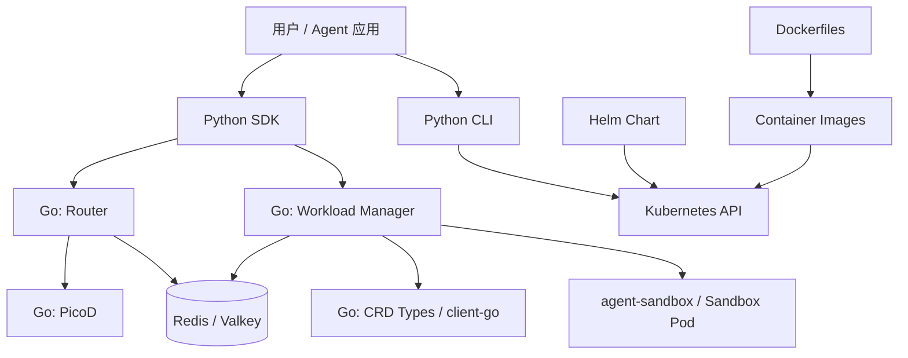

# Day 2 实习报告：从编程语言和技术栈理解 AgentCube 的实现

## 基本信息

- 实习项目：AgentCube
- 实习方向：华为公司开源小组 / AgentCube 开源项目研究
- 日期：Day 2
- 今日主题：从编程语言、技术栈和代码目录理解项目是如何实现的
- 主要参考：`go.mod`、`pyproject.toml`、`cmd/`、`pkg/`、`sdk-python/`、`manifests/charts/base`、`docker/`

## 今天的目标

昨天我主要把 AgentCube 的最小链路跑起来，理解 Kubernetes、agent-sandbox、Redis、Workload Manager、Router 和 sandbox Pod 的关系。今天开始从代码实现角度看项目。

我今天先不深入某一个函数，而是先回答几个更基础的问题：

- AgentCube 主要用了哪些编程语言。
- 哪些部分是 Go 写的，哪些部分是 Python 写的。
- Kubernetes、Helm、Docker 在项目里分别承担什么角色。
- 从代码目录看，Day 1 跑通的组件分别在哪里实现。

## 总体技术栈

从仓库结构和配置文件看，AgentCube 是一个 Go-first 的 Kubernetes 项目，同时配套 Python SDK、Python CLI、集成插件和文档站点。

| 技术 | 在项目里的作用 |
| --- | --- |
| Go | 实现核心服务，包括 Workload Manager、Router、PicoD、agentd |
| Kubernetes API / CRD | 定义和管理 `CodeInterpreter`、`AgentRuntime` 等自定义资源 |
| controller-runtime / client-go | 编写 Kubernetes controller，监听和操作集群资源 |
| Gin | Go 服务里的 HTTP API 框架 |
| Redis / Valkey | 保存 session 状态和路由信息 |
| Python | 提供 SDK、CLI、MCP、LangChain、Dify 等用户侧或集成侧能力 |
| Helm | 把 AgentCube 组件安装到 Kubernetes 集群 |
| Dockerfile | 构建 Workload Manager、Router、PicoD 镜像 |
| Docusaurus / TypeScript / React | 文档站点 |

我现在的理解是：Go 负责真正的控制面和数据面，Python 负责让用户和其他 Agent 框架更方便地调用 AgentCube，Helm/Docker/Kubernetes 负责把这些组件部署和运行起来。

## 代码目录和语言分层

从目录看，项目大致可以分成几层：

```text
cmd/                  Go 二进制入口
pkg/                  Go 核心逻辑
pkg/apis/             Kubernetes CRD 类型定义
client-go/            生成的 Kubernetes client
sdk-python/           Python SDK
cmd/cli/              Python CLI
integrations/         MCP、Dify、LangChain 等集成
manifests/charts/base Helm Chart 和 CRD manifest
docker/               镜像构建文件
docs/                 设计文档、用户文档、Docusaurus 站点
```

可以用下面这张图表示：



这张图帮助我把“代码目录”和“运行时组件”对应起来：`cmd/` 里编译出服务，`pkg/` 里是服务逻辑，`manifests/` 把服务部署到 Kubernetes，`sdk-python/` 从集群外调用这些服务。

### `cmd/` 和 `pkg/` 的区别

今天还特别区分了一下 `cmd/` 和 `pkg/`。我之前看到 `cmd/router/main.go`、`pkg/router/` 这种目录时，容易把它们都理解成“Router 的代码”，但它们承担的角色不一样。

`cmd/` 更像每个可执行程序的入口。它通常只放 `main.go`，负责解析命令行参数、初始化配置、创建 server 或 controller、注册退出信号，然后把程序启动起来。它关心的是“这个进程怎么启动”。

`pkg/` 则是真正的业务逻辑和可复用代码。Router 怎么查 session、Workload Manager 怎么创建 sandbox、PicoD 怎么执行命令、Redis store 怎么读写状态，这些都放在 `pkg/` 下面。它关心的是“这个组件具体怎么工作”。

可以粗略理解成：

| 目录 | 作用 | 类比 |
| --- | --- | --- |
| `cmd/` | 程序入口，负责启动某个二进制 | 开关 / main 函数 / 启动脚本 |
| `pkg/` | 核心逻辑和可复用模块 | 发动机 / 业务模块 / 库代码 |

在 AgentCube 里对应关系比较清楚：

```text
cmd/router/main.go
    -> pkg/router/server.go
    -> pkg/router/handlers.go
    -> pkg/router/session_manager.go

cmd/workload-manager/main.go
    -> pkg/workloadmanager/server.go
    -> pkg/workloadmanager/handlers.go
    -> pkg/workloadmanager/*controller.go

cmd/picod/main.go
    -> pkg/picod/server.go
    -> pkg/picod/execute.go
    -> pkg/picod/files.go
```

所以我现在的理解是：`cmd/` 决定“启动哪个程序”，`pkg/` 决定“这个程序具体怎么工作”。后面读代码时应该从 `cmd/*/main.go` 找入口，再跳到对应的 `pkg/` 目录读实现。

## Go：核心服务实现语言

`go.mod` 显示项目模块是：

```text
github.com/volcano-sh/agentcube
```

Go 版本配置是：

```text
go 1.24.4
toolchain go1.24.9
```

这说明项目核心部分使用比较新的 Go 工具链。结合 `cmd/` 目录，Go 主要编译出这些二进制：

| 入口 | 二进制/组件 | 作用 |
| --- | --- | --- |
| `cmd/workload-manager/main.go` | `workloadmanager` | 控制面，创建和管理 sandbox session |
| `cmd/router/main.go` | `agentcube-router` | 数据面入口，转发请求到 sandbox |
| `cmd/picod/main.go` | `picod` | sandbox 内部的代码执行和文件操作服务 |
| `cmd/agentd/main.go` | `agentd` | agent 相关守护进程，后续需要继续阅读 |

### Workload Manager

Workload Manager 的入口在 `cmd/workload-manager/main.go`。从入口文件看，它做了几件事：

- 注册 Kubernetes 原生类型、agent-sandbox 类型、AgentCube 自己的 CRD 类型到 scheme。
- 使用 `controller-runtime` 创建 controller manager。
- 创建 `SandboxReconciler` 和 `CodeInterpreterReconciler`。
- 启动 HTTP API server。
- 处理优雅退出、后台 worker 和 store 连接关闭。

它依赖的关键 Go 包包括：

- `sigs.k8s.io/controller-runtime`
- `k8s.io/client-go`
- `sigs.k8s.io/agent-sandbox`
- `github.com/gin-gonic/gin`
- `github.com/redis/go-redis/v9`

我现在把 Workload Manager 理解成两部分合体：

- Kubernetes controller：监听和协调 CRD / Sandbox 资源。
- HTTP API server：接收 SDK 发来的创建、删除 session 请求。

### Router

Router 的入口在 `cmd/router/main.go`，主要创建 `router.Server` 并启动 HTTP 服务。

Router 的核心逻辑在 `pkg/router/`，从 `server.go` 可以看到它提供的路由包括：

```text
/health/live
/health/ready
/v1/namespaces/:namespace/agent-runtimes/:name/invocations/*path
/v1/namespaces/:namespace/code-interpreters/:name/invocations/*path
```

这和 Day 1 SDK 调用时看到的路径对应：

```text
/v1/namespaces/default/code-interpreters/my-interpreter/invocations/api/files
/v1/namespaces/default/code-interpreters/my-interpreter/invocations/api/execute
```

Router 还初始化了 JWT manager。我的理解是，SDK 不直接给 PicoD 签名，Router 负责把请求转发给 sandbox 时补齐认证信息，这样认证逻辑集中在数据面入口。

### PicoD

PicoD 的入口在 `cmd/picod/main.go`，真正服务逻辑在 `pkg/picod/`。

从 `pkg/picod/server.go` 看，PicoD 提供这些 API：

```text
POST /api/execute
POST /api/files
GET  /api/files
GET  /api/files/*path
GET  /health
```

这说明 PicoD 是 sandbox 内部真正执行命令、运行代码、读写文件的服务。它运行在 sandbox Pod 里，Router 把请求转发到它。

这也把 Day 1 的理解补完整了：Workload Manager 不直接执行代码，Router 也不直接执行代码，真正执行的是 sandbox 里的 PicoD。

## Kubernetes CRD 和 Controller 技术栈

AgentCube 是 Kubernetes 原生项目，所以 CRD 是很关键的一层。

相关目录包括：

```text
pkg/apis/runtime/v1alpha1
manifests/charts/base/crds
client-go/
```

我今天的理解是：

- `pkg/apis/runtime/v1alpha1` 是 Go 里的 API 类型定义。
- `manifests/charts/base/crds` 是安装到 Kubernetes 里的 CRD YAML。
- `client-go/` 是根据 CRD 生成出来的客户端代码。
- `make gen-all` 用来重新生成 CRD、DeepCopy 和 client-go。

这套机制让 AgentCube 可以像 Kubernetes 原生资源一样管理 `CodeInterpreter` 和 `AgentRuntime`。

## Python：SDK、CLI 和集成层

Python 主要不是用来实现核心控制面，而是用来给用户和外部框架提供入口。

### Python SDK

SDK 在 `sdk-python/`，包名是：

```text
agentcube-sdk
```

`sdk-python/pyproject.toml` 里要求：

```text
requires-python = ">=3.10"
```

依赖包括：

```text
requests
PyJWT
cryptography
```

从 `sdk-python/agentcube/code_interpreter.py` 看，用户主要使用的是 `CodeInterpreterClient`。它内部再分成两类 client：

- `ControlPlaneClient`：调用 Workload Manager 创建和删除 session。
- `CodeInterpreterDataPlaneClient`：调用 Router，把执行代码和文件操作请求转发到 sandbox。

这和 Day 1 的调用链路完全对应：

```text
CodeInterpreterClient
-> ControlPlaneClient
-> Workload Manager

CodeInterpreterClient
-> CodeInterpreterDataPlaneClient
-> Router
-> PicoD
```

### Python CLI

CLI 在 `cmd/cli/`，包名是：

```text
agentcube-cli
```

它使用的技术包括：

- `typer`：命令行框架
- `pydantic`：配置和数据校验
- `httpx`：HTTP client
- `docker`：操作镜像构建相关能力
- `kubernetes`：访问 Kubernetes API
- `rich`：更友好的终端输出

这说明 CLI 更偏开发者工具，用来打包、构建、部署 Agent 应用，而不是运行时核心组件。

### 集成层

`integrations/` 下面有几个方向：

- `code-interpreter-mcp`：把 AgentCube Code Interpreter 暴露成 MCP server。
- `langchain-agentcube`：把 AgentCube 作为 LangChain / deepagents 的 sandbox backend。
- `dify-plugin`：Dify 插件集成。

这说明 AgentCube 希望不只提供底层运行时，也希望接入不同 Agent 生态。

## Helm、Docker 和部署层

### Helm

Helm chart 在：

```text
manifests/charts/base
```

`values.yaml` 里定义了 Router、Workload Manager、Redis、SPIRE 等配置。例如：

```text
router.image.repository = ghcr.io/volcano-sh/agentcube-router
workloadmanager.image.repository = ghcr.io/volcano-sh/workloadmanager
redis.addr = ""
```

这说明 Helm 是把 Go 编译出来的服务镜像部署到 Kubernetes 的主要方式。

Day 1 跑起来时，我实际用到的就是这个 chart：

```bash
helm install agentcube ./manifests/charts/base ...
```

### Dockerfile

镜像构建文件在 `docker/`：

| 文件 | 构建对象 |
| --- | --- |
| `docker/Dockerfile` | Workload Manager |
| `docker/Dockerfile.router` | AgentCube Router |
| `docker/Dockerfile.picod` | PicoD |

Workload Manager 和 Router 都是多阶段构建：先用 Go 镜像编译二进制，再拷贝到较小的 Alpine runtime 镜像中运行。

PicoD 比较特殊，它的 runtime 镜像是 `ubuntu:24.04`，并安装了 `python3`。这和它的职责有关：PicoD 要在 sandbox 里支持代码执行，至少要能运行 Python 代码。

## 文档技术栈

文档站点在 `docs/agentcube/`，使用 Docusaurus：

- `@docusaurus/core`
- `@docusaurus/preset-classic`
- `@docusaurus/theme-mermaid`
- React 19
- TypeScript

这也解释了为什么我在日报里用 Mermaid 画图是合适的：项目文档站点本身也支持 Mermaid。

## 从 Day 1 链路映射到 Day 2 代码

现在我可以把昨天跑通的链路和代码目录对应起来：

| Day 1 看到的组件 | Day 2 对应代码 |
| --- | --- |
| Workload Manager | `cmd/workload-manager/main.go`、`pkg/workloadmanager/` |
| Router | `cmd/router/main.go`、`pkg/router/` |
| PicoD | `cmd/picod/main.go`、`pkg/picod/` |
| Redis session store | `pkg/store/` |
| CodeInterpreter CRD | `pkg/apis/runtime/v1alpha1`、`manifests/charts/base/crds` |
| Python SDK | `sdk-python/agentcube/` |
| Helm 安装 | `manifests/charts/base` |
| 镜像构建 | `docker/` |

我的理解也从“组件能跑起来”进一步变成了“这些组件分别由哪些语言和目录实现”。

## 今天的收获

- AgentCube 的核心运行时是 Go 实现的，尤其是 Workload Manager、Router 和 PicoD。
- Python 主要承担 SDK、CLI 和生态集成，不是核心调度控制面。
- Kubernetes CRD 是 AgentCube 把业务概念接入 Kubernetes 的关键方式。
- Helm 和 Dockerfile 把 Go 服务包装成 Kubernetes 可运行的组件。
- PicoD 是 sandbox 内真正执行代码的服务，因此它的镜像里包含 Python 运行环境。
- Day 1 看到的部署链路，基本都能在 `cmd/`、`pkg/`、`sdk-python/`、`manifests/`、`docker/` 中找到对应实现。

## 还没完全理解的问题

- Workload Manager 创建 SandboxClaim / Sandbox / Pod 的具体代码路径还需要继续追。
- Router 如何根据 session ID 查 Redis 并选择 endpoint，需要继续读 `pkg/router/session_manager.go` 和 `pkg/router/handlers.go`。
- PicoD 的 `/api/execute` 如何处理命令、超时、stdout/stderr，还需要继续读 `pkg/picod/execute.go`。
- CRD 类型、生成代码和 Helm CRD YAML 之间的生成关系还需要通过 `make gen-all` 理清。
- `agentd` 的作用今天还没有展开，需要后续单独看。

## 明天计划

- 从 Python SDK 的 `CodeInterpreterClient` 开始，沿着一次 `run_code()` 调用追到 Workload Manager 和 Router。
- 阅读 `pkg/workloadmanager/handlers.go`，理解创建 session 的 HTTP API。
- 阅读 `pkg/router/handlers.go` 和 `pkg/router/session_manager.go`，理解请求转发和 session 查询。
- 阅读 `pkg/picod/execute.go`，理解代码最终如何在 sandbox 内执行。
