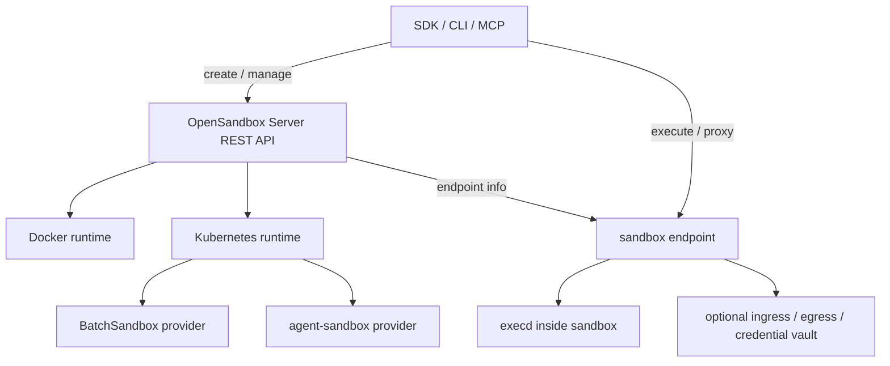
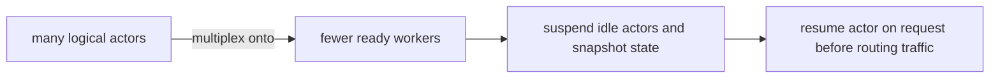
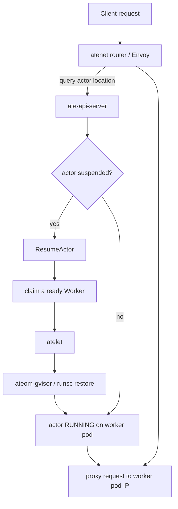

# Day 21：OpenSandbox 与 Agent Substrate 补充调研

日期：2026-06-22

更新：2026-06-23 根据 [Day22 实测 runbook](day22-opensandbox-agent-substrate-runtime-runbook.md) 回灌运行结论。

## 今日目标

Day11 已经完成 CubeSandbox 深入调研，但当时对 OpenSandbox 和 Agent Substrate 只保留了项目入口和初步判断。今天补齐这两个开源项目的调研，重点回答：

1. 它们分别解决什么问题，和 AgentCube / CubeSandbox 是同层竞争还是互补。
2. 核心组件、资源模型、生命周期和安全边界是什么。
3. 对 AgentCube 后续适配 `kubernetes-sigs/agent-sandbox`、Sleep/Resume、SnapStart / warm pool 设计有什么可借鉴点。

## 调研方法与资料来源

本次以官方仓库源码和文档为主，不做二手文章复述。

| 项目 | 来源 | 本地浅克隆版本 |
| --- | --- | --- |
| OpenSandbox | <https://github.com/opensandbox-group/OpenSandbox> | `3d40414e794d`，2026-06-22，`Merge pull request #1116 from Pangjiping/fix/docs-image-references` |
| Agent Substrate | <https://github.com/agent-substrate/substrate> | `bbafda0d3729`，2026-06-19，`fix(demo): remove ports from sandbox and agent-secret manifests (#274)` |

重点阅读文件：

| 项目 | 文件 / 目录 | 用途 |
| --- | --- | --- |
| OpenSandbox | `README.md`、`ROADMAP.md`、`docs/components/*.md`、`server/configuration.md` | 官方定位、组件、server 配置、runtime / ingress / egress / secure runtime |
| OpenSandbox | `kubernetes/apis/sandbox/v1alpha1/*types.go`、`docs/kubernetes/index.md`、`oseps/*.md` | Kubernetes CRD、Pool、BatchSandbox、SandboxSnapshot、pause/resume、agent-sandbox provider |
| OpenSandbox | `server/opensandbox_server/services/k8s/*provider.py`、`runtime_resolver.py`、`validators.py` | runtime provider 抽象、agent-sandbox 接入、RuntimeClass 和 egress 组合校验 |
| OpenSandbox | `provider_factory.py`、`kubernetes_service.py`、`workload_provider.py`、`agent_sandbox_provider.py`、`batchsandbox_provider.py`、`snapshot_runtime.py` | 二次阅读：确认 provider 边界、pause/resume 委托、BatchSandbox snapshot 路径和 agent-sandbox provider 当前限制 |
| Agent Substrate | `README.md`、`docs/architecture.md`、`docs/api-guide.md`、`docs/roadmap.md` | 官方定位、架构、资源模型、路线图 |
| Agent Substrate | `pkg/api/v1alpha1/*types.go`、`pkg/proto/ateapipb/ateapi.proto` | CRD schema、控制面 gRPC API、Actor / Worker 状态 |
| Agent Substrate | `cmd/*`、`manifests/ate-install/`、`demos/`、`benchmarking/` | 组件边界、部署形态、demo 和测试工具 |
| Agent Substrate | `cmd/ateapi/internal/controlapi/*actor*.go`、`workflow_resume.go`、`workflow_suspend.go`、`workflow_pause.go`、`cmd/atenet/internal/router/*` | 二次阅读：确认 actor 初始状态、worker 分配、checkpoint/restore、router 触发 resume 和 singleflight 去重 |
| AgentCube | `README.md`、`pkg/router/handlers.go`、`pkg/router/session_manager.go`、`pkg/workloadmanager/handlers.go`、`garbage_collection.go`、`workload_builder.go`、`pkg/store/*` | 对照本项目现状：确认 Router/WorkloadManager/store 如何处理 session、GC、agent-sandbox CRD 和 warm pool |

> 注释：这里的 `gRPC API` 可以先理解成“组件之间的强类型远程函数调用接口”。REST API 更像用 URL + HTTP method 表达资源操作，gRPC 更像调用一个已经由 `.proto` 文件定义好的函数，例如 `ResumeActor(request) -> response`。读这类控制面项目时，`.proto` 往往比 README 更接近真实的跨组件契约。
>
> 注释：后面阅读这些 sandbox / agent runtime 项目时，常见的上层通信方式可以先按下表理解，不需要先纠结 TCP / UDP 这类更底层传输协议。
>
> | 方式 | 可以怎么理解 | 典型用法 | 在 AgentCube 相关项目里的判断 |
> | --- | --- | --- | --- |
> | REST / HTTP JSON | 用 URL + HTTP method 操作资源，例如 `GET /sessions/123`、`DELETE /sandboxes/abc` | 外部 API、SDK、CLI、管理后台 | OpenSandbox Server 和 AgentCube 用户入口更适合这种方式，容易调试和接入 |
> | gRPC / protobuf | 调一个由 `.proto` 定义好的远程函数，例如 `ResumeActor(request) -> response` | 内部服务调用、控制面动作、强类型状态机 | Agent Substrate 的 `ate-api-server` 属于这种；适合表达 `CreateActor`、`ResumeActor`、`SuspendActor` |
> | WebSocket | 建立长连接，客户端和服务端可以双向持续发消息 | 终端、实时交互、协作、长时间会话 | 如果 AgentCube 以后要做浏览器终端或实时 agent output，可以考虑 |
> | SSE | HTTP 长连接，服务端单向推送事件 | 日志流、状态流、任务进度 | 比 WebSocket 简单，适合只需要服务端持续推送 resume 进度或日志的场景 |
> | Message Queue / PubSub | 发送异步消息，不要求调用方马上拿到最终结果 | 后台任务、事件通知、削峰、异步审计 | 适合 GC、审计、异步清理，不适合 Router 请求路径上的立即 resume |
> | Kubernetes API / CRD | 把“期望状态”写进 Kubernetes，Controller 异步 reconcile | K8s 资源生命周期、低频配置、声明式控制 | 适合创建 Sandbox / WorkerPool，不适合高频同步唤醒和强实时状态查询 |
>
> 分析：协议选择本质上是在回答“这是外部入口还是内部控制面、需要同步结果还是异步 reconcile、是单次请求还是持续状态流、状态契约是否必须强类型”。AgentCube 当前不必全面 gRPC 化，但 Sleep/Resume 的内部状态契约要像 proto 一样清楚。
>
> 注释：`proto` 通常指 Protocol Buffers 的接口定义文件，文件后缀是 `.proto`。可以把它理解成“一份给人读、也能给机器生成代码的 API 契约”。例如：
>
> ```proto
> message ResumeActorRequest {
>   string actor_id = 1;
> }
>
> message ResumeActorResponse {
>   string status = 1;
> }
>
> service ActorService {
>   rpc ResumeActor(ResumeActorRequest) returns (ResumeActorResponse);
> }
> ```
>
> 这里 `message` 定义请求 / 响应的数据结构，`service` 定义一组远程 API，`rpc ResumeActor(...) returns (...)` 定义一个远程函数调用，字段后的 `= 1` 是 protobuf 的字段编号，用来保持二进制编码和向后兼容。读 Agent Substrate 的 `pkg/proto/ateapipb/ateapi.proto` 时，看到 `CreateActor`、`ResumeActor`、`SuspendActor`、`PauseActor`，就能直接知道控制面真正支持哪些生命周期动作。
>
> 注释：`CRD schema` 和 `gRPC API` 不是同一层东西。CRD 是 Kubernetes API server 里保存的期望状态和观测状态，适合声明低频配置；gRPC API 是运行中服务之间的直接调用接口，适合高频、强交互、需要返回明确结果的控制面动作。Agent Substrate 同时使用这两者，所以阅读时要分清“写入 Kubernetes 资源”和“调用控制面服务”。

Day21 本日没有做实际部署和 benchmark，产出是源码级初读和架构对比。Day22 已补充第一轮实际运行：OpenSandbox Docker runtime 完成 CLI / Python SDK 端到端 smoke；Agent Substrate 尝试 kind quickstart，但阻塞在 kind / kubeadm control-plane bootstrap，尚未进入 counter demo。原始日志保存在：

```text
internship-reports/benchmarks/day22-opensandbox-substrate-smoke/
```

## 一句话结论

OpenSandbox 是一个 **SDK / API 优先的通用 sandbox 平台**：它提供 Docker 和 Kubernetes runtime、server、execd、ingress、egress、多语言 SDK、CLI 和 MCP，并且已经把 `kubernetes-sigs/agent-sandbox` 做成 Kubernetes workload provider 之一。

Agent Substrate 是一个 **Kubernetes 上的 stateful actor multiplexing 系统**：它不是通用代码执行 SDK，而是试图把大量长期存在、经常空闲的 agent-like actors 映射到少量预热 worker Pods 上，通过 gVisor checkpoint / restore、独立控制面和路由层实现低延迟 suspend/resume。

对 AgentCube 来说：

- OpenSandbox 更接近“上层 sandbox API / SDK 平台 + 多 backend adapter”的参考样本。
- Agent Substrate 更接近“未来 Sleep/Resume / 高密度会话复用 / actor 状态管理”的架构样本。
- 二者都证明了一个方向：Agent sandbox 不能只做 create/delete；后续重点会转向 provider adapter、pause/resume、snapshot state、路由唤醒、egress / credential / audit。
- Day22 实测进一步说明：OpenSandbox 的 Docker runtime 作为开发者入口已经可用，但冷启动必须区分镜像拉取、容器创建、execd bootstrap、command/file API；Agent Substrate 的设计更激进，第一道工程门槛不是 API，而是能否稳定准备 kind/GKE + gVisor/runsc + state store 这套 substrate。

## OpenSandbox 调研

### 官方定位

OpenSandbox 官方定位是面向 AI 应用的通用 sandbox 平台，覆盖 Coding Agents、GUI Agents、Agent Evaluation、AI Code Execution 和 RL Training 等场景。它不是单一 runtime demo，而是从 SDK、server、runtime backend 到 Kubernetes operator 都提供一整套能力。

核心能力可以分成六层：

| 层级 | OpenSandbox 能力 |
| --- | --- |
| API / SDK | Python、Java/Kotlin、JavaScript/TypeScript、C#/.NET、Go SDK；CLI `osb`；MCP server |
| Server | FastAPI 生命周期控制面，提供 create / get / list / pause / resume / endpoint / renew / delete |
| In-sandbox runtime | `execd`，提供 command、file、PTY、code execution、metrics 等 HTTP API |
| Backend runtime | Docker runtime、Kubernetes runtime；Kubernetes 下支持 `batchsandbox` 和 `agent-sandbox` provider |
| Network | Ingress gateway、egress sidecar、FQDN / CIDR policy、Credential Vault、secure endpoint access |
| Isolation | 默认 runc，也可配置 gVisor、Kata、Firecracker/Kata-FC 等 secure runtime |

### 组件结构

OpenSandbox 的组件边界比较清晰：

| 组件 | 目录 / 文档 | 作用 |
| --- | --- | --- |
| Server | `server/opensandbox_server/` | FastAPI 控制面，统一生命周期 API，调 Docker 或 Kubernetes backend |
| Execd | `docs/components/execd.md`、`components/execd` 文档入口 | 运行在 sandbox 内部，提供 shell command、file、PTY、code interpreter、metrics |
| Ingress | `docs/components/ingress.md` | Kubernetes 路由入口，支持 header / URI / host 路由，能 watch BatchSandbox 或 AgentSandbox |
| Egress | `docs/components/egress.md` | sidecar 方式做 FQDN / IP / CIDR 出站控制、DNS / nftables enforcement、Credential Vault |
| Kubernetes Controller | `kubernetes/` | 管理 `BatchSandbox`、`Pool`、`SandboxSnapshot` CRD |
| SDK / CLI / MCP | `sdks/`、`cli/` | 开发者入口，隐藏后端 runtime 细节 |

一个简化调用链：



> 注释：OpenSandbox 这里更偏 REST API，是因为它面向 SDK、CLI、MCP 和外部开发者入口。REST 的好处是调试成本低，curl、浏览器、HTTP proxy、OpenAPI 工具都容易接入；缺点是跨组件状态机语义往往要靠文档和服务端逻辑约束。
>
> 分析：Agent Substrate 选择 gRPC，不代表 AgentCube 的用户入口也应该改成 gRPC。更合理的判断是：外部 API 保持 HTTP/REST 更友好，内部控制面如果出现大量 resume、pause、watch、stream 状态同步，再考虑用 proto/gRPC 或至少用“proto-like”的强类型契约约束接口。

### Kubernetes 资源模型

OpenSandbox Kubernetes controller 定义了三个核心 CRD：

| CRD | 作用 | 关键字段 / 状态 |
| --- | --- | --- |
| `BatchSandbox` | 创建和管理一批 sandbox Pod，也可作为单个 sandbox 的运行态资源 | `spec.replicas`、`spec.template`、`spec.poolRef`、`spec.pause`；状态有 `Pending / Succeed / Pausing / Paused / Resuming / Failed` |
| `Pool` | 预热资源池，用于快速分配 sandbox Pod | `capacitySpec.bufferMin/bufferMax/poolMin/poolMax`、scale/update/recycle strategy |
| `SandboxSnapshot` | Kubernetes pause/resume 的内部 snapshot 资源 | `spec.sandboxName`；`status.phase` 为 `Pending / Committing / Succeed / Failed`，记录 source pod/node 和容器 snapshot image |

这和 AgentCube 当前依赖 `kubernetes-sigs/agent-sandbox` 的方式不同：

- OpenSandbox 自己实现了 `BatchSandbox` / `Pool` / `SandboxSnapshot`，并把 `agent-sandbox` 作为另一个 provider。
- AgentCube 当前更直接依赖 `agent-sandbox` 的 Sandbox / SandboxWarmPool / SandboxClaim 生态，WorkloadManager 和 Router 自己管理 session 和流量入口。

### Pause / Resume 设计

OpenSandbox 的 Kubernetes pause/resume 当前是 **rootfs snapshot** 路线：

1. `pause`：Server patch `BatchSandbox.spec.pause=true`。
2. Controller 创建内部 `SandboxSnapshot`。
3. 同节点 commit Job 把容器 rootfs commit 成 OCI image 并 push 到 registry。
4. Snapshot ready 后释放 runtime Pod / pooled allocation。
5. `resume`：Server patch `BatchSandbox.spec.pause=false`。
6. Controller 读取最新 snapshot，把模板 image 改写为 snapshot image，重新创建 runtime。

重要限制：

- 当前文档明确限制在 `BatchSandbox.spec.replicas=1` 场景。
- 这种方案保存的是 rootfs，不保存进程内存、打开 socket 或 CPU register。
- Snapshot image 的清理依赖 registry retention / GC，删除 `SandboxSnapshot` 不等于删除 registry 中的 OCI image。

> 注释：这里的 `patch spec.pause=true` 是 Kubernetes 声明式控制方式：用户或 Server 改 CRD 的期望状态，Controller 异步 reconcile 出实际动作。它和 gRPC 的差异在于：patch CRD 后通常不是同步拿到“pause 已完成”的强结果，而是继续观察 `status.phase`。
>
> 分析：这也是 AgentCube 后续设计 Sleep/Resume 时必须回答的问题：Router 收到用户请求时不能只 patch 一个状态然后立即代理，它需要知道 resume 是否已经完成、endpoint 是否已经刷新、旧 endpoint 是否还能用。这类“请求路径上的同步动作”比后台 GC 更接近 gRPC / direct control API 的适用场景。

对 AgentCube 的启发：

- Sleep/Resume 可以先从“rootfs / workspace 保留”开始，不必一步到位实现内存级 checkpoint。
- 状态机必须显式区分 `Ready / Paused / Deleted` 或更细的 `Pausing / Resuming`，否则 Router 很难在请求到来时做 resume-before-proxy。
- 删除策略要拆开：Ready idle -> Paused，Paused timeout / max TTL -> Deleted。

### `kubernetes-sigs/agent-sandbox` 接入

OpenSandbox 已经把 `kubernetes-sigs/agent-sandbox` 做成 provider：

```toml
[runtime]
type = "kubernetes"
execd_image = "opensandbox/execd:v1.0.19"

[kubernetes]
namespace = "default"
workload_provider = "agent-sandbox"

[agent_sandbox]
shutdown_policy = "Delete"
```

从 OSEP-0002 和 server config 看，OpenSandbox 的接入思路是：

- 保持 OpenSandbox 生命周期 API / SDK 不变。
- 在 server 内部新增 `agent-sandbox` workload provider。
- 创建、查询、删除时由 provider 生成 / 读取 `agent-sandbox` CR。
- Ingress 组件也支持 `--provider-type=agent-sandbox`，通过 `status.serviceFQDN` 找到目标 sandbox。

这点和 AgentCube upstream [PR #387](https://github.com/volcano-sh/agentcube/pull/387) 工作直接相关：`agent-sandbox` 上游 CRD 和 lifecycle 逻辑变化会影响使用方。OpenSandbox 的做法值得借鉴的是把 provider 差异收敛在 adapter 层，并在文档里明确 `batchsandbox` 与 `agent-sandbox` 的配置边界。

### Secure Runtime 与出站治理

OpenSandbox 的 secure runtime 是 server-level 配置：

| Runtime | Docker | Kubernetes |
| --- | --- | --- |
| gVisor | OCI runtime，例如 `runsc` | `runtimeClassName`，例如 `gvisor` |
| Kata | OCI runtime 或 RuntimeClass | `kata-qemu` / `kata-clh` 等 |
| Firecracker | Docker 不支持 | 通过 Kata Firecracker RuntimeClass，例如 `kata-fc` |

注意这里的 Firecracker 不是 OpenSandbox 自己实现 VMM，而是借助 Kubernetes RuntimeClass / Kata-FC。

Egress 方面，OpenSandbox 的 sidecar 支持：

- FQDN allowlist / denylist。
- IP / CIDR target。
- wildcard domain。
- DNS proxy 和 `dns+nft` 模式。
- Credential Vault，允许代理层给外部请求注入 bearer / basic / API key / custom header。
- Fail-closed：iptables 设置失败时 sidecar 退出，避免策略没有生效还放行流量。

一个很重要的限制：OpenSandbox 文档明确指出 gVisor 和 egress sidecar 的 iptables nat REDIRECT 路径不兼容，因为 gVisor netstack 不支持所需 nat table。OpenSandbox 的处理是启动时/请求时校验并给出明确错误，建议改用 Kata 或 CNI-level FQDN policy。

对 AgentCube 的启发：

- 以后讨论“支持 gVisor / Kata / NetworkPolicy”时，不能只看 RuntimeClass 是否存在，还要验证 sidecar、iptables、CNI、DNS policy 是否兼容。
- 出站治理需要纳入测试矩阵，不然 Agent 能跑代码但不能安全访问外部 API。

### 性能与成熟度信号

OpenSandbox Kubernetes 文档给出一组“交付 100 个 sandbox”的对比数据：

| 场景 | 总时间 |
| --- | ---: |
| SIG Agent-Sandbox concurrency=1 | 76.35 s |
| SIG Agent-Sandbox concurrency=10 | 23.17 s |
| SIG Agent-Sandbox concurrency=50 | 33.85 s |
| BatchSandbox | 0.92 s |

这组数据来自 OpenSandbox 文档，不是本机复测结果。它表达的设计意图是：`BatchSandbox` 用一个 CR 表达批量 sandbox delivery，避免为 N 个 sandbox 做 N 次独立 CR / controller reconciliation。

工程成熟度方面，OpenSandbox 已经有：

- OSEP 流程。
- 多语言 SDK。
- Helm chart。
- CLI。
- MCP server。
- server config reference。
- Kubernetes CRD / controller / generated client。
- runtime / secure runtime / egress / ingress 文档。

因此它更像一个正在快速补齐生产面的平台，而不是单个实验项目。

### Day22 实测后的理解修正

Day22 先跑了 Docker runtime 最小端到端 smoke，不进入 Kubernetes / BatchSandbox / `agent-sandbox` provider。验证链路是：

```text
server health -> create python:3.12 sandbox -> sandbox health -> command run -> file write/read -> kill -> list empty
```

CLI 和 Python SDK 两条路径最终都通过：

| 路径 | 结果 | 关键证据 |
| --- | --- | --- |
| CLI `osb` | 通过 | `command run` 输出 `2`，`file cat` 读回 `hello opensandbox`，`sandbox kill` 返回 terminated |
| Python SDK | 通过 | `command_stdout= 2`，`file_content= hello opensandbox` |
| 清理 | 通过 | sandbox list 为空，Docker 无残留容器 |

这让“OpenSandbox 工程面更完整”的判断更扎实：它不是只有文档和 CRD，至少 Docker backend 的 server / CLI / SDK / execd / file API 闭环已经能在本机跑通。

但实测也暴露了一个对 benchmark 很关键的冷启动特征：首次 `sandbox create --image python:3.12` 时，本机没有 `python:3.12` 镜像，server 在请求路径内同步拉镜像，耗时约 246 秒，CLI 触发 `httpx.ReadTimeout`；在这段时间内 `/health` 也会超时。预拉 `opensandbox/execd:v1.0.19` 和 `python:3.12` 后，同样的 create / command / file / delete 路径可以正常通过。

这个结果改变了后续测试设计：

- OpenSandbox benchmark 不能只报“create sandbox 耗时”，必须拆成 cold image pull、warm image create、execd bootstrap、first command、file API、delete cleanup。
- 如果要比较 AgentCube warm pool / SnapStart，必须保证镜像缓存状态一致，否则比较到的是 registry / Docker pull 速度，不是 sandbox runtime。
- server readiness 也要纳入观察项：长耗时 Docker 操作会影响 `/health` 响应性，后续需要看 Kubernetes provider 是否也有类似阻塞路径。
- SDK 使用细节要按当前模型读取 `execution.logs.stdout[*].text`，不能假设 `result.stdout` 这种通用字段。

## Agent Substrate 调研

### 官方定位

Agent Substrate 官方说明里特别写了：这不是 Google 官方支持产品，而且项目还处于非常早期，API 基本不保证兼容。

它的目标不是帮开发者写 agent，也不是一个多语言 sandbox SDK，而是 **在 Kubernetes 上更高效地运行大量 agent-like workloads**。核心假设是：

- agent-like workloads 大多数时间在等待输入、LLM、工具调用或事件；
- 如果每个 session 都长期占一个 Pod，资源利用率很差；
- Kubernetes API server / scheduler 不适合把每次 session 唤醒都放在关键路径上；
- 更好的做法是预热少量 worker Pods，把大量逻辑 actor suspend/resume 到这些 worker 上。

Day22 尝试进入官方 kind quickstart，先用本机缓存的 Go 1.26.4 toolchain 临时补到 `PATH`，`hack/kind.sh version` 可以正常运行。但 `hack/create-kind-cluster.sh` 在 kubeadm control-plane 初始化阶段失败：

```text
cgroup v1 is deprecated in Kubernetes and will not be supported in a future kind release
error execution phase wait-control-plane: cannot obtain client without bootstrap
unable to create ClusterRoleBinding
client rate limiter Wait returned an error: context deadline exceeded
```

因此这次没有进入 `hack/install-ate-kind.sh --deploy-ate-system`，也没有跑到 counter demo。这个失败不能证明 Agent Substrate 的 actor/resume 设计不可行，但它说明“跑起来”本身就是 Agent Substrate 的第一层复杂度：它依赖一个稳定的 Kubernetes bootstrap 环境，再叠加 ValKey/RustFS、gVisor/runsc、ko 镜像构建和多组件控制面。后续若要验证它的核心价值，应换干净 cgroup v2 VM 或 GKE，而不是在当前机器上反复重试完整 quickstart。

官方 README 里描述的核心抽象是：



### 核心组件

Agent Substrate 的组件比 OpenSandbox 更偏控制面 / 数据面系统：

| 组件 | 目录 | 作用 |
| --- | --- | --- |
| `ate-api-server` | `cmd/ateapi` | 控制面 gRPC API，管理 Actor / Worker 生命周期 |
| `atecontroller` | `cmd/atecontroller` | Kubernetes controller，reconcile `WorkerPool`、`ActorTemplate` 等 CRD |
| `atelet` | `cmd/atelet` | 节点级 DaemonSet，管理物理 worker pods，协调 snapshot 传输 |
| `ateom-gvisor` | `cmd/ateom-gvisor` | 运行在 worker pod 内部的 helper，通过 gRPC 调用 `runsc` checkpoint / restore |
| `atenet` | `cmd/atenet` | 网络代理 / Envoy external processing server，负责 actor-aware routing |
| `podcertcontroller` | `cmd/podcertcontroller` | Pod certificate polyfill，用于内部 mTLS / identity |
| `kubectl-ate` | `cmd/kubectl-ate` | 管理 Actor / Worker 的 kubectl plugin |
| `ValKey/Redis` | `manifests/ate-install/valkey.yaml` | 动态 Actor / Worker 状态存储 |

> 注释：`ate-api-server` 的 “gRPC control API” 是 Agent Substrate 的控制面入口，负责 `CreateActor`、`ResumeActor`、`SuspendActor`、`PauseActor` 等生命周期动作。它不是给终端用户直接写代码执行的 SDK，而是给 router、kubectl plugin、controller 等系统组件调用的内部协议。
>
> 注释：`ateom-gvisor` 通过 gRPC 触发 checkpoint / restore 时，真正提供隔离和快照能力的是 gVisor / `runsc`，gRPC 只是把“请保存这个 actor 状态”“请把这个 snapshot 恢复到 worker”这类命令传过去。不要把通信协议和 runtime 能力混为一谈。
>
> 分析：这个拆分对 AgentCube 很重要。AgentCube 可以先不引入 gRPC，但代码组织上也应该把 “session lifecycle command” 和 “底层 runtime/provider 执行细节” 分开。否则每次 `agent-sandbox` API 变化都会直接影响 Router、WorkloadManager handler、store schema 和 e2e。

一个简化架构：



> 注释：这张图里可以分清两条路径。控制面路径是 `router -> ate-api-server -> scheduler/atelet/ateom`，负责判断 actor 状态、分配 worker、恢复 snapshot；数据面路径是 `router -> worker pod IP`，负责把用户原始 HTTP 请求转发到已经恢复的 workload。
>
> 注释：`ResumeActor` 放在 proxy 之前，说明 router 不是“只查一次 endpoint 然后盲目转发”。它承担了 activation gate 的角色：如果 actor 还在 suspended，就先同步或半同步地恢复，再进入数据面代理。
>
> 分析：AgentCube 当前 Router 对已有 `x-agentcube-session-id` 的处理更简单：查 store、更新 last activity、代理到旧 endpoint。若未来实现 Sleep/Resume，AgentCube Router 至少需要补出类似的 resume-before-proxy 分支，并处理并发请求同时唤醒同一个 session 的去重问题。

### 资源模型

Agent Substrate 刻意把“低频配置”和“高频状态”分开：

| 类型 | 存储位置 | 资源 | 作用 |
| --- | --- | --- | --- |
| 系统配置 | Kubernetes CRD / etcd | `WorkerPool` | 定义预热 worker pods 数量、sandbox class、runtime assets、调度约束 |
| 系统配置 | Kubernetes CRD / etcd | `ActorTemplate` | 定义 actor workload image、env、snapshot storage、worker selector，并生成 golden snapshot |
| 系统配置 | Kubernetes CRD / etcd | `SandboxConfig` | cluster-scoped，定义 gVisor / microVM 等 sandbox runtime assets |
| 动态实例状态 | ValKey / Redis | `Actor` | 具体 actor instance，记录状态、worker location、snapshot info、version |
| 动态实例状态 | ValKey / Redis | `Worker` | 具体物理 worker pod 的可用 / 占用状态 |

这个设计和 AgentCube 当前很不同：

- AgentCube 当前更多把 runtime 资源作为 Kubernetes CRD 处理。
- Agent Substrate 认为高频 actor state 不应该全部写 Kubernetes API server，因此放到低延迟 state store。
- `kubectl ate get actor` 查询的是 Substrate 控制面，不是 Kubernetes CRD；`kubectl get actortemplate` / `workerpool` 才是 Kubernetes CRD。

> 注释：这里的 “Kubernetes API server / etcd 不适合高频状态” 不是说 Kubernetes 不可靠，而是说它不是为每次 HTTP 请求触发一次 session resume、每个 actor 状态多次跳转这种热路径设计的。高频状态放 Redis/ValKey，可以降低 API server 压力，也能更容易做 CAS、lease、singleflight 这类并发控制。
>
> 分析：AgentCube 目前已经有 Redis/ValKey store，但主要存的是 `SandboxInfo`、过期索引和 last-activity。Sleep/Resume 如果继续只把 Kubernetes CRD 当唯一状态源，很容易遇到 Router 读旧 endpoint、GC 删除正在 resume 的 session、并发 resume 重复创建 runtime 等问题。

### Actor 生命周期

Agent Substrate 的核心生命周期：

| 阶段 | 动作 | 状态 / 数据 |
| --- | --- | --- |
| Template 准备 | 创建 `ActorTemplate` 后生成 golden actor / golden snapshot | 模板进入 `Ready` 后，可用来创建 actor |
| CreateActor | 创建具体 actor 记录 | 初始是 `STATUS_SUSPENDED`，指向模板的 golden snapshot |
| ResumeActor | 请求到来或显式调用时恢复 actor | 调度 free worker，atelet / ateom 恢复 golden 或 latest snapshot，actor 变 `STATUS_RUNNING` |
| SuspendActor | 空闲或显式调用时挂起 actor | gVisor checkpoint memory + disk，写入对象存储，worker 归还池 |
| DeleteActor | 删除已 suspended actor | 删除控制面记录和后续 GC snapshot |

`ateapi.proto` 里还有 `PauseActor` / `STATUS_PAUSED`，注释说 pause 会把 snapshot 保留在 node VM 本地；而主架构文档更多讲 `SuspendActor` 写持久对象存储。这说明 Agent Substrate 的生命周期语义仍在演进，需要读代码和运行验证后才能判断最终稳定行为。

> 注释：`.proto` 里的状态枚举可以理解成跨组件共享的状态机协议。只要 router、api-server、atelet、kubectl plugin 都由同一个 proto 生成客户端代码，它们对 `STATUS_RESUMING`、`STATUS_RUNNING`、`STATUS_SUSPENDED` 的拼写和字段结构就不容易漂移。
>
> 分析：AgentCube 现在缺的不是一个字符串字段，而是一套能被 Router、WorkloadManager、GC 和 Store 共同遵守的 session 状态契约。即使不使用 protobuf，也应该把状态迁移、错误语义、CAS 条件和可见字段写清楚，否则 Paused/Resuming 会变成各模块自行理解的松散约定。

### Snapshot 与状态保留

Agent Substrate 的状态目标比 OpenSandbox rootfs snapshot 更激进：它希望保存 **memory + disk**。

当前文档描述：

- `ateom-gvisor` 在 worker pod 内调用 `runsc` 做 checkpoint / restore。
- `atelet` 负责把 snapshot stream 到 GCS / S3 类对象存储。
- Kind 本地部署清单里有 RustFS，用于替代云对象存储。
- ActorTemplate 会产生 golden snapshot，新 actor 第一次 resume 可以从 golden snapshot hydrate。
- 后续 suspend 会生成 latest snapshot，下一次 resume 从 latest snapshot 继续。

> 注释：`snapshot stream` 表示 snapshot 不一定是“本地生成一个完整文件后再上传”的简单流程。对于 memory + disk checkpoint，数据可能很大，恢复路径也可能需要边传输边重建状态，所以控制面要能表达进度、失败、重试和版本。
>
> 分析：这类操作天然比 rootfs image snapshot 更重。AgentCube 如果第一版 Sleep/Resume 只需要 workspace / rootfs 保留，就不应该过早承诺 memory checkpoint；但它可以借鉴 Agent Substrate 的状态机设计，把 `Pausing`、`Paused`、`Resuming`、`Failed` 这些中间状态先保留下来。

工程 caveat：

- 文档提到当前需要带 `--allow-connected-on-save` 的 `runsc` 版本，用来绕过网络 resumption checkpoint 的问题。
- roadmap 里还有 gVisor snapshot optimization、incremental snapshot、disk-only resume、peer-to-peer snapshot sharing、microVM runtime 等项目，说明这条路线还在快速变化。

### 网络、身份与安全

Agent Substrate 网络层是 `atenet + Envoy`：

- 请求通过统一 DNS / Host 规则定位 actor，例如 `<id>.actors.resources.substrate.ate.dev`。
- Router 从 Host header 提取 actor ID。
- 如果 actor suspended，先触发 `ResumeActor`，再把原始请求转发到恢复后的 worker。

安全方面，当前设计包含：

- gVisor 作为主要 sandbox boundary。
- 内部组件 mTLS。
- SessionIdentity gRPC service，给 session mint JWT / certificate。
- Pod Certificate polyfill。
- Kubernetes NetworkPolicy 可在 WorkerPool 边界控制连接。

> 注释：`SessionIdentity gRPC service` 可以理解为内部身份签发服务：session/actor 需要一个可迁移的身份，系统通过 RPC 去申请 JWT 或 certificate，而不是把权限硬绑在某个 Pod 名、Pod IP 或一次容器启动上。
>
> 分析：当 actor/sandbox 会从一个 worker 迁移到另一个 worker，或者从 Paused 恢复到新的 Pod 时，身份如果绑定旧 Pod，就会破坏 resume 语义。AgentCube 未来若做长会话和凭据注入，也需要把 session identity 从 runtime instance identity 里拆出来。

roadmap 中还在规划：

- actor-to-actor authz。
- per-actor ingress / egress policy。
- credential injection。
- audit logging。
- threat detection telemetry。
- microVM sandbox backend。

这说明 Agent Substrate 很看重“actor identity 随 actor 迁移，而不是绑定当前 pod”。这点对 AgentCube 后续 session 设计也有参考价值：如果 sandbox 会 sleep/resume 或迁移，身份和权限不能简单绑定 Pod 名或 Pod IP。

### Demo 与测试信号

仓库提供几个 demo：

| Demo | 作用 |
| --- | --- |
| `demos/counter` | Stateful counter，验证 suspend/resume 后计数状态保留 |
| `demos/sandbox` | Alpine sandbox，允许执行 shell command，验证文件系统状态保留 |
| `demos/claude-code-multiplex` | 多个 Claude Code agents 共享较少 worker pods，演示 oversubscription |
| `demos/agent-secret` | 演示 Zero-Idle self-suspension 和 volatile memory re-animation |

benchmark 目录已有 Locust + Prometheus / Grafana 的雏形，但 README 明确说这是 nascent suite。当前更适合作为“方向明确但未成熟”的项目观察，而不是拿官方目标数字直接和 AgentCube 本机 benchmark 横比。

## 源码二次深入后的三者对比

先给最短判断：

| 项目 | 最像 AgentCube 的地方 | 最不像 AgentCube 的地方 | 对 AgentCube 最直接的启发 |
| --- | --- | --- | --- |
| OpenSandbox | 都是“外部 API / SDK 创建 sandbox，再通过 endpoint 执行代码或代理请求” | 它把 Kubernetes backend 做成 `WorkloadProvider` adapter；AgentCube 当前直接在 WorkloadManager 中引用 `agent-sandbox` CRD 语义 | 先抽清楚 provider 边界，再升级 `agent-sandbox`；否则依赖升级会反复波及 handler、helper、e2e、codegen |
| Agent Substrate | 都面向 long-session、stateful、intermittently active 的 agent workloads | 它把 session/actor 状态作为一等对象放到 Redis/ValKey，并让 Router 在代理前触发 resume；不是每个 session 都长期对应一个独立 K8s CR | Sleep/Resume 不能只加状态字段，必须同时设计 store 状态机、router resume-before-proxy、worker/endpoint 更新和并发去重 |
| AgentCube | README 目标和二者相似：低延迟、状态保留、sleep/resume、K8s-native agent workload | 当前 main 的实际路径仍是 create/delete/warm pool：Router 查 session 并代理，GC idle/TTL 后删除 Sandbox/SandboxClaim，没有 Paused 状态和 resume 主路径 | upstream [PR #387](https://github.com/volcano-sh/agentcube/pull/387) 属于“先把依赖和创建路径稳定住”；Sleep/Resume 应另开设计，不应混在 agent-sandbox 兼容修复里 |

源码级对照表：

| 维度 | AgentCube | OpenSandbox | Agent Substrate |
| --- | --- | --- | --- |
| 系统主语 | `AgentRuntime` / `CodeInterpreter` 生成 session，再绑定 `Sandbox` 或 `SandboxClaim` | `Sandbox` 是 API 主语，后端可选 Docker、BatchSandbox、agent-sandbox | `Actor` 是主语，worker pod 只是可复用承载体 |
| 控制面形态 | Router + WorkloadManager + K8s CRD + Redis/ValKey store | FastAPI server + Kubernetes/Docker provider + execd | `ate-api-server` gRPC + Redis/ValKey + controllers + `atelet` + `atenet` |
| K8s 的角色 | 核心生命周期依赖；WorkloadManager 直接创建/删除 agent-sandbox CR | 可选 backend；provider 隔离 BatchSandbox 和 agent-sandbox | 管低频配置和 worker pods；高频 actor 状态绕开 K8s API server |
| 运行态状态 | `SandboxInfo` JSON + expiry / last-activity sorted set；无 `PausedAt` / `pauseTimeout` | 由 provider 读取 CR status；BatchSandbox 有 `Paused/Pausing/Resuming` | Actor proto 明确定义 `RESUMING/RUNNING/SUSPENDING/SUSPENDED/PAUSING/PAUSED` |
| 请求路径 | Router 读 `x-agentcube-session-id`；无 session 则创建；有 session 则直接代理到旧 endpoint | SDK/API 调 server；endpoint 由 provider 或 ingress 解析 | Router 从 Host 解析 actor ID，先 `ResumeActor`，再把请求转发到 worker IP |
| idle 后行为 | `garbage_collection.go` 按 idle/TTL 删除 K8s resource 和 store entry | BatchSandbox 可 patch `spec.pause=true` 并生成 snapshot；agent-sandbox provider 目前未实现 pause/resume | `SuspendActor` 写外部 snapshot；`PauseActor` 写本地 snapshot 并释放 worker |
| 启动加速 | `SandboxWarmPool` / `SandboxClaim`，以及 SnapStart 规划 | Pool、BatchSandbox、client-side pool、snapshot image | WorkerPool + golden/latest snapshot restore |
| 依赖升级风险 | `sigs.k8s.io/agent-sandbox` 类型散落在 WorkloadManager builder/controller/helper/k8s client 测试路径 | `agent-sandbox` 只是一种 provider；但当前 provider 仍写死 `agents.x-k8s.io/v1alpha1`，未来也要适配 v1beta1 | 主要风险不在 agent-sandbox，而在 gVisor/runsc checkpoint、ATE 组件协议和早期 API 变化 |
| 安全/出网 | 目前更多依赖 K8s/CNI/runtime；项目内出网治理还不完整 | egress sidecar、FQDN/CIDR、Credential Vault、RuntimeClass 兼容校验较完整 | identity 随 Actor 迁移，mTLS/SessionIdentity 已有，per-actor egress 和 credential injection 仍在 roadmap |
| 实测状态 | AgentCube 本机已有多轮 e2e / math-agent / warm pool 验证材料 | Docker runtime 的 CLI / Python SDK smoke 已通过；Kubernetes BatchSandbox / agent-sandbox provider 尚未实测 | kind quickstart 阻塞在 kubeadm control-plane bootstrap，未进入 ATE system / counter demo |
| 成熟度判断 | 社区主线项目，适配和测试材料正在补齐；README 的 sleep/resume 目标尚未闭合到代码 | 工程面最完整，SDK/CLI/MCP/egress/provider 都有；Docker 路径可跑通，但首次镜像拉取会影响 server 响应性；agent-sandbox provider 不等于完整 sleep/resume | 方向最接近 AgentCube 未来态，但 README 明确 very early；部署 substrate 本身就是重要风险，runtime 依赖显著重于 AgentCube / OpenSandbox Docker |

> 注释：表里的“控制面形态”不是在比较谁更高级，而是在说明系统边界不同。OpenSandbox 先服务开发者 API，所以 REST/FastAPI 合理；Agent Substrate 先服务内部 actor 调度，所以 gRPC/proto 合理；AgentCube 当前处在 Router + WorkloadManager + Kubernetes CRD + Store 的混合形态，需要先把职责边界稳定下来。
>
> 分析：AgentCube 后续最不应该做的是为了“看起来先进”而直接把所有接口改成 gRPC。真正有价值的是识别哪些接口是用户入口、哪些是内部生命周期命令、哪些是低频配置、哪些是高频状态。接口技术选型应该服从这些边界，而不是反过来驱动架构。

### 三个尖锐结论

1. OpenSandbox 更像 AgentCube 的“外壳和接入层”对照组。Day22 跑通 Docker CLI / SDK 后，这个判断更强：它的 API / SDK / execd 闭环是真能跑的，不只是设计文档；但 provider adapter 的清晰边界不等于冷启动没有成本，镜像拉取和 execd bootstrap 必须单独测。
2. Agent Substrate 更像 AgentCube README 里“smart sleep/resume”的终局对照组。它已经把 Router 触发 resume、actor 状态机、worker 复用、checkpoint/restore 串起来；但 Day22 也说明它的第一风险是部署和 runtime substrate，当前机器连 kind control-plane 都无法稳定进入，更不能轻易把它当作可直接落地的短期方案。
3. AgentCube 现在卡在中间层：比 OpenSandbox 更 Kubernetes-native、比 Agent Substrate 更贴近现有 `agent-sandbox` 生态，但 session store、sandbox CR、Router endpoint 三者还没有形成真正的 Paused/Resume 闭环。这也是后续不应把 upstream [PR #387](https://github.com/volcano-sh/agentcube/pull/387) 和 Sleep/Resume 混在一个 PR 里的原因。

### 对 AgentCube 源码的直接映射

| AgentCube 文件 | 当前作用 | 对后续适配/设计的含义 |
| --- | --- | --- |
| `README.md` | 明确写了 stateful lifecycle 和 smart sleep/resume 目标 | 文档目标已经存在，但不能假设 main 已实现；proposal 要区分“设计承诺”和“代码现状” |
| `pkg/router/handlers.go` | `handleInvoke` 读取 `x-agentcube-session-id`，更新 last activity，然后 `forwardToSandbox` | Sleep/Resume 的 resume-before-proxy 必须落在这里或 `SessionManager`，否则 Paused session 仍会被代理到旧 endpoint |
| `pkg/router/session_manager.go` | 空 session 调 WorkloadManager 创建；非空 session 只查 store | 这里目前没有 `Paused -> Ready` 分支，也没有并发 resume 去重；Agent Substrate 的 `ActorResumer` 是直接参考对象 |
| `pkg/workloadmanager/workload_builder.go` | 直接构造 `agent-sandbox` `Sandbox` / `SandboxClaim` / warm-pool 相关对象 | `agent-sandbox` 版本升级应优先把字段差异集中在 builder/helper，而不是扩散到业务 handler |
| `pkg/workloadmanager/handlers.go` | 创建 CR、等 Ready、解析 warm-pool pod annotation、写 store endpoint | v0.4/v0.5 适配的关键是 readiness、pod name、endpoint、NetworkPolicy，不只是编译通过 |
| `pkg/workloadmanager/garbage_collection.go` | idle/TTL 后删除 `Sandbox` 或 `SandboxClaim` 并删除 store | Sleep/Resume 要把 `sessionTimeout` 从删除改为 pause，另加 `pauseTimeout` 删除；否则行为仍是 GC |
| `pkg/store/interface.go`、`store_redis.go` | 存 session JSON、expiry index、last-activity index | 若做 Paused 状态，需要扩展 store schema：`Status`、`PausedAt`、`PauseTimeout`、resume 锁或幂等保护 |

## 和 CubeSandbox 的分层关系

Day11 里已经确认 CubeSandbox 是底层 microVM sandbox platform。把三个项目放在一起看：

| 项目 | 更像哪一层 | 最强特征 |
| --- | --- | --- |
| CubeSandbox | 底层 sandbox platform / microVM runtime | RustVMM/KVM/PVM、E2B 兼容、CubeCoW snapshot / clone / rollback、CubeVS/CubeEgress |
| OpenSandbox | sandbox API / SDK 平台 + 多 backend adapter | 多语言 SDK、Docker/K8s runtime、BatchSandbox、agent-sandbox provider、egress / credential vault |
| Agent Substrate | stateful actor scheduling / multiplexing control plane | actor/worker 分离、K8s control plane bypass、gVisor checkpoint / restore、routing-triggered resume |
| AgentCube | Kubernetes-native Agent workload 管理层 | WorkloadManager、Router、agent-sandbox dependency、warm pool、AgentRuntime / CodeInterpreter |

因此后续写竞品表时不能把它们简单放成“谁启动更快”。更合理的口径是：

- CubeSandbox：强隔离和快照执行层。
- OpenSandbox：开发者 API / SDK 和多 runtime 接入层。
- Agent Substrate：大规模 stateful session multiplexing 层。
- AgentCube：Kubernetes-native agent runtime 编排层。

## 对 AgentCube 后续工作的启发

### 1. `agent-sandbox` 适配要做成 provider compatibility 工作

OpenSandbox 已经把 `agent-sandbox` 明确当成 provider，而不是把 provider 细节散落到所有业务逻辑中。AgentCube upstream [PR #387](https://github.com/volcano-sh/agentcube/pull/387) / 后续 v0.5 适配也应继续保持这个思路：

- CRD schema 差异集中在 helper / adapter。
- WorkloadManager 只关心“创建 / 读取 / 删除 / readiness / pod endpoint”这些稳定语义。
- PR 文档要解释依赖版本、CRD 字段、NetworkPolicy / warm pool / pod name annotation 的变化。

### 2. Sleep/Resume 要先确定状态语义

OpenSandbox 和 Agent Substrate 都把 suspend/resume 作为一等生命周期处理，但两者状态语义不同：

| 路线 | 保存内容 | 恢复成本 | 适合的第一阶段 |
| --- | --- | --- | --- |
| rootfs snapshot | 文件系统 / workspace | 较低，不保留进程内存 | AgentCube 可以先验证 workspace 持久化 |
| memory + disk checkpoint | 进程内存 + 文件系统 | 更复杂，runtime 依赖强 | 更接近 Agent Substrate 的长期目标 |

AgentCube 的 Sleep/Resume proposal 最少需要明确：

- Ready idle 后变 Paused。
- Router 收到带 session-id 的请求时先 resume。
- Paused timeout 或 maxSessionDuration 后 delete。
- Paused 状态下 workspace/context 是否保留，保留到什么程度。
- 失败时是否 fallback recreate，用户能看到什么错误。

### 3. 测试不能只停留在 e2e happy path

OpenSandbox / Agent Substrate 的复杂性说明后续 AgentCube 测试需要覆盖：

| 测试项 | 为什么需要 |
| --- | --- |
| direct sandbox create/run/delete | 验证最小 provider adapter |
| warm pool adoption | 验证已有 sandbox 被 claim 后 pod / endpoint / annotation 不错 |
| router resume-before-proxy | 验证 Sleep/Resume 请求路径 |
| workspace/file persistence | 区分 rootfs resume 和 cold recreate |
| network policy / egress | 避免 sandbox ready 但 router / execd 不通 |
| cleanup / TTL | 避免 Paused / Snapshot / Pod / Redis 残留 |
| math-agent / LLM e2e | 验证真实 Agent 工作流，不只验证 sandbox API |

Day22 运行后需要额外加三类测试纪律：

- 冷启动和热启动分开测：镜像未缓存时的 `docker pull` / registry 成本不能混入 warm create / warm pool 指标。
- readiness 要独立测：OpenSandbox 首次拉镜像期间 `/health` 会超时，说明“server 进程在”不等于“控制面可服务”。
- 清理状态必须作为测试通过条件：本次每轮都检查 `sandbox list`、`docker ps -a`、kind cluster 和端口释放，这比只看命令返回 0 更可靠。

### 4. 出网安全和凭据注入是未来重点

CubeSandbox 有 CubeEgress，OpenSandbox 有 egress sidecar + Credential Vault，Agent Substrate roadmap 也把 per-actor egress、credential injection、audit logging 列为重点。AgentCube 目前更多关注 sandbox lifecycle 和 runtime compatibility，但 Agent 真正进入生产后，安全问题会集中在：

- Agent 能访问哪些外部域名。
- 密钥是否直接暴露给 Agent 代码。
- 出站请求是否可审计。
- 用户 session identity 是否和 Pod / runtime 解耦。

后续写 roadmap 或 proposal 时可以把它列为独立方向，而不是附属于 “NetworkPolicy” 一个字段。

### 5. gRPC / proto 对 AgentCube 的启发

> 注释：gRPC 最适合的不是“所有 API”，而是内部服务之间频繁调用、字段结构稳定、需要强类型客户端、需要 streaming 或明确状态码的控制面动作。典型例子是 `ResumeActor`、`SuspendActor`、watch actor 状态、传输 snapshot 进度。

AgentCube 当前不需要把用户面对的 Router API、Python SDK 或 CLI 直接切换到 gRPC。原因有三点：

- AgentCube 现在的用户入口已经围绕 HTTP Router、SDK 示例和 workload-manager REST 风格 API 展开，贸然改协议会扩大迁移面。
- 当前最急的问题是 session lifecycle contract 不清楚，而不是通信协议不够先进。
- `agent-sandbox` 本身已经通过 Kubernetes CRD 暴露能力，AgentCube 需要先把 provider 边界收敛，再决定内部是否值得引入新的 RPC 层。

> 分析：短期更务实的做法是先把接口语义写成“像 proto 一样清楚”：请求字段、响应字段、状态机、幂等性、错误码、重试语义、并发冲突都明确下来。只要这些 contract 清楚，即使用 HTTP/JSON 也能先把功能做稳；如果后面需要 streaming 或更强类型客户端，再迁移到 gRPC 成本会低很多。

一个可复用的判断表：

| AgentCube 场景 | 更适合的接口形态 | 原因 |
| --- | --- | --- |
| SDK / CLI 创建 session、调用 agent | HTTP / REST | 外部开发者易调试，兼容现有生态 |
| WorkloadManager 创建或删除 `agent-sandbox` CR | Kubernetes client / CRD | 本来就是 K8s 资源生命周期，适合 controller/reconcile |
| Router 在请求前唤醒 Paused session | 内部 lifecycle API，HTTP 或 gRPC 均可 | 关键是同步语义、幂等和并发去重，不是协议名字 |
| watch resume 进度、snapshot stream、runtime checkpoint 状态 | gRPC / streaming API 更合适 | 状态变化频繁，可能需要长连接和强类型事件 |
| session state / CAS / expiry index | Redis/ValKey store API | 高频状态和并发冲突不应全部压到 Kubernetes API server |

> 分析：因此 Day21 对 gRPC 的结论不是“AgentCube 应该改 gRPC”，而是“AgentCube 应该学习 Agent Substrate 的控制面契约意识”。协议只是实现工具，真正值得复制的是：状态枚举集中定义、Router 唤醒前置、Store 作为高频状态源、runtime provider 和控制面命令解耦。

## 当前卡点与未完成项

| 项 | 状态 | 原因 / 后续 |
| --- | --- | --- |
| OpenSandbox Docker runtime | 已通过 | Day22 跑通 server health、create python sandbox、command、file write/read、delete；首次镜像拉取导致 CLI timeout 和 `/health` 短时无响应，预拉镜像后通过 |
| OpenSandbox Kubernetes BatchSandbox | 未执行 | 还需要 controller / CRD / registry / RuntimeClass；应在 Docker smoke 脚本固化后作为下一层验证 |
| OpenSandbox agent-sandbox provider | 未执行 | 和 AgentCube #387 / v0.5 适配直接相关，但要先把 BatchSandbox 和基础 K8s 环境跑稳 |
| Agent Substrate kind quickstart | 已尝试，未进入 demo | 当前机器 kind/kubeadm control-plane bootstrap 失败，未进入 ATE system / counter demo；建议换干净 cgroup v2 VM 或 GKE |
| OpenSandbox vs AgentCube benchmark | 未执行 | 官方 BatchSandbox 数据只能作为设计信号；本机 benchmark 必须区分 cold image pull、warm create、first command、delete |
| Agent Substrate API 稳定性 | 风险高 | README 明确说 very early development，不保证兼容；后续可以作为 sleep/resume 架构样本，但短期实现不能直接照搬完整 substrate |
| Day11 其他云服务 | 未覆盖 | AgentBay / AWS AgentCore 更偏托管云服务和 SDK，应另开产品对比，不和这两个开源项目混在同一篇深读 |

## 下一步

1. 固化 OpenSandbox Docker smoke 脚本：默认记录 host env、预拉镜像、正确解析 pretty JSON、验证 CLI + Python SDK、检查 Docker 残留。
2. 继续 OpenSandbox Kubernetes `BatchSandbox` 验证，再进入 `agent-sandbox` provider；不要直接把 Kubernetes / provider / snapshot / runtime class 多个变量混在一个实验里。
3. Agent Substrate 下一次应换干净 cgroup v2 VM 或 GKE 跑 counter demo，目标仍是验证 `CreateActor -> router request -> ResumeActor -> SuspendActor -> resume 后计数保留`。
4. AgentCube upstream [PR #387](https://github.com/volcano-sh/agentcube/pull/387) review 时可以引用 OpenSandbox 的 provider adapter 方式，说明 `agent-sandbox` 适配应该集中解释依赖和 CRD 差异。
5. 后续 Sleep/Resume 设计时，把 OpenSandbox rootfs snapshot 和 Agent Substrate memory+disk checkpoint 作为两条技术路线对照，避免直接把“Paused”写成只有状态字段、没有恢复语义。
