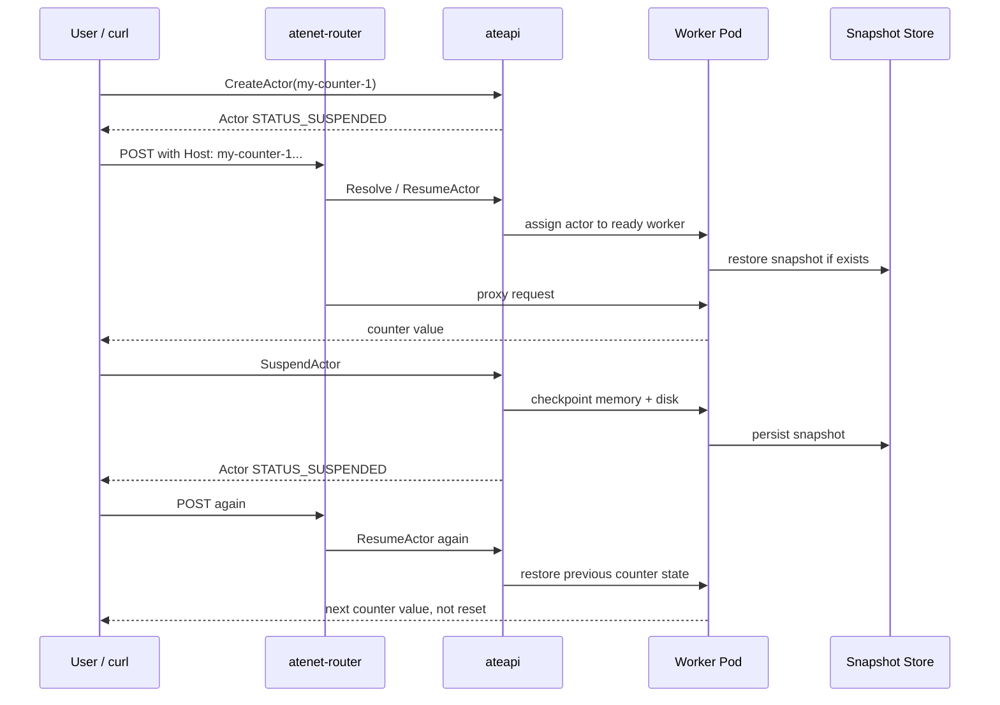

# Day 22：OpenSandbox / Agent Substrate 实测 Runbook

日期：2026-06-23

## 今日目标

Day21 已完成 OpenSandbox 与 Agent Substrate 的源码和文档调研，但还没有实际部署。今天把“怎么实测”拆成可执行 runbook，目标不是直接跑重型环境，而是先明确：

1. OpenSandbox 从 Docker runtime 最小 smoke 开始验证什么。
2. OpenSandbox Kubernetes / `agent-sandbox` provider 后续如何推进。
3. Agent Substrate kind + counter demo 应该验证哪条 sleep/resume 链路。
4. 本机当前前置条件和已经暴露的卡点。

## 源码基线

| 项目 | 本地源码路径 | commit | 说明 |
| --- | --- | --- | --- |
| OpenSandbox | `/tmp/opensandbox` | `3d40414e794d` | 2026-06-22，`Merge pull request #1116 from Pangjiping/fix/docs-image-references` |
| Agent Substrate | `/tmp/agent-substrate` | `bbafda0d3729` | 2026-06-19，`fix(demo): remove ports from sandbox and agent-secret manifests (#274)` |

主要参考入口：

- OpenSandbox README / CLI / Python SDK / server config / Kubernetes docs：<https://github.com/opensandbox-group/OpenSandbox>
- Agent Substrate README / counter demo：<https://github.com/agent-substrate/substrate>
- Day21 源码调研报告：[day21-opensandbox-agent-substrate-study.md](day21-opensandbox-agent-substrate-study.md)

## 本机前置检查

| 检查项 | 命令 | 当前结果 | 影响 |
| --- | --- | --- | --- |
| Docker daemon | `docker version --format '{{.Server.Version}}'` | `26.1.3` | OpenSandbox Docker smoke 的基础条件满足 |
| `uvx` | `uvx --version` | `uvx 0.11.20` | 可用 `uvx` 启动 OpenSandbox server / CLI，避免依赖系统 Python |
| 系统 Python | `python3 --version` | `Python 3.6.8` | 太旧；OpenSandbox 要求 Python 3.10+，不要直接用系统 `python3` |
| Kubernetes client | `kubectl version --client=true --short` | `v1.24.17+k3s1` | 只能说明 client 存在；K8s 实测还要看目标集群 |
| kind binary | `kind version` | `kind v0.32.0 go1.26.3 linux/amd64` | kind 二进制存在 |
| Go toolchain | `go version` | `go: command not found` | Agent Substrate quickstart 会被阻塞，需要先让 `go` 进入 `PATH` |

## 已暴露卡点

### 1. Agent Substrate 的脚本必须在项目目录执行

失败命令：

```bash
/tmp/agent-substrate/hack/kind.sh version
```

错误现象：

```text
/tmp/agent-substrate/hack/kind.sh: line 20: /home/agentcube/hack/run-tool.sh: No such file or directory
```

原因：

`kind.sh` 依赖项目内的 `hack/run-tool.sh`，从 `/home/agentcube` 执行时解析到了当前 AgentCube 仓库路径。

处理方式：

```bash
cd /tmp/agent-substrate
hack/kind.sh version
```

### 2. Agent Substrate 当前 shell 里找不到 Go

失败命令：

```bash
cd /tmp/agent-substrate
hack/kind.sh version
```

错误现象：

```text
/tmp/agent-substrate/hack/run-tool.sh: line 43: go: command not found
```

原因：

Agent Substrate README 说明 quickstart 需要 Go / kubectl / Docker，并通过 Go 管理部分工具依赖。当前 shell 的 `PATH` 找不到 `go`。

后续处理：

1. 先恢复 Go 1.26.x 到 `PATH`。
2. 再执行 Agent Substrate kind quickstart。
3. 如果 kind 集群创建阶段遇到 kubelet / cgroup / QoS 类错误，停止重试并记录，改用干净 VM 或云端 GKE 环境验证。Day16 期间本机 kind 标准集群已经暴露过类似环境风险。

## A. OpenSandbox Docker Runtime 最小 Smoke

### 为什么先跑 Docker runtime

OpenSandbox 有 Docker 和 Kubernetes runtime。Docker runtime 不需要 CRD、controller、registry、RuntimeClass，也不依赖 `agent-sandbox`，适合作为第一层验证。它能先回答：

- OpenSandbox server 能否启动。
- REST / CLI / SDK 是否能创建 sandbox。
- `execd` command path 是否可用。
- 文件读写是否可用。
- 删除后是否能清理容器资源。

如果 Docker smoke 都不通，不能继续把问题归因到 Kubernetes 或 provider。

### 前置条件

```bash
docker version
uvx --version
```

需要网络能拉取镜像：

- `opensandbox/execd:v1.0.19`
- `python:3.12`

端口要求：

- 本机 `127.0.0.1:8080` 空闲。

### 启动 OpenSandbox server

```bash
cd /tmp/opensandbox

uvx opensandbox-server init-config /tmp/opensandbox-docker-smoke.toml --example docker --force

OPENSANDBOX_INSECURE_SERVER=YES \
SANDBOX_CONFIG_PATH=/tmp/opensandbox-docker-smoke.toml \
uvx opensandbox-server
```

说明：

- OpenSandbox server 默认读取 `~/.sandbox.toml`，也可以用 `SANDBOX_CONFIG_PATH` 指定配置。
- 如果 `server.api_key` 为空，非交互环境需要设置 `OPENSANDBOX_INSECURE_SERVER=YES`，否则启动会要求风险确认。
- 这是本地 smoke 用法，生产环境必须配置 API key。

### CLI smoke

另开一个终端：

```bash
export OPEN_SANDBOX_DOMAIN=localhost:8080
export OPEN_SANDBOX_PROTOCOL=http

curl -fsS http://127.0.0.1:8080/health

SID="$(uvx --from opensandbox-cli osb sandbox create --image python:3.12 --timeout 10m -o json | jq -r '.id')"
echo "sandbox id: ${SID}"

uvx --from opensandbox-cli osb sandbox get "${SID}" -o json
uvx --from opensandbox-cli osb sandbox health "${SID}" -o json

uvx --from opensandbox-cli osb command run "${SID}" -o raw -- python -c "print(1 + 1)"

uvx --from opensandbox-cli osb file write "${SID}" /workspace/agentcube-smoke.txt -c "hello opensandbox" -o json
uvx --from opensandbox-cli osb file cat "${SID}" /workspace/agentcube-smoke.txt -o raw

uvx --from opensandbox-cli osb sandbox kill "${SID}" -o json
```

成功判据：

| 步骤 | 期望结果 |
| --- | --- |
| `/health` | 返回 healthy 状态 |
| `sandbox create` | 返回非空 sandbox id |
| `sandbox health` | sandbox ready / healthy |
| `command run` | 输出 `2` |
| `file write` + `file cat` | 读回 `hello opensandbox` |
| `sandbox kill` | 删除成功；Docker 中没有异常残留容器 |

### Python SDK 备选 smoke

如果 CLI 路径正常，再用 Python SDK 复测一遍 SDK 层。不要用系统 `python3`，因为当前是 Python 3.6.8。

```bash
uv run --python 3.12 --with opensandbox - <<'PY'
import asyncio
from datetime import timedelta

from opensandbox import Sandbox
from opensandbox.config import ConnectionConfig
from opensandbox.models.filesystem import WriteEntry


async def main():
    config = ConnectionConfig(domain="localhost:8080", protocol="http")
    sandbox = await Sandbox.create(
        image="python:3.12",
        timeout=timedelta(minutes=10),
        connection_config=config,
    )
    print("sandbox_id=", sandbox.id)
    try:
        result = await sandbox.commands.run("python -c 'print(1 + 1)'")
        print("command_stdout=", result.stdout.strip())
        assert result.stdout.strip() == "2"

        await sandbox.files.write_files([
            WriteEntry(path="/tmp/agentcube-smoke.txt", data="hello opensandbox", mode=644)
        ])
        content = await sandbox.files.read_file("/tmp/agentcube-smoke.txt")
        print("file_content=", content)
        assert content == "hello opensandbox"

        await sandbox.files.delete_files(["/tmp/agentcube-smoke.txt"])
    finally:
        await sandbox.kill()


asyncio.run(main())
PY
```

### 需要记录的原始结果

后续真正执行时，把原始日志放到：

```text
internship-reports/benchmarks/day22-opensandbox-substrate-smoke/
```

至少保存：

- `host-env.txt`：Docker、kernel、CPU、内存、cgroup、Python、uvx。
- `opensandbox-server.log`：server 启动和请求日志。
- `opensandbox-cli-smoke.log`：CLI smoke 的完整命令输出。
- `docker-ps-before-after.txt`：资源残留检查。

## B. OpenSandbox Kubernetes / BatchSandbox 后续路径

Docker smoke 通过后，再进入 Kubernetes。这里不要一上来跑 `agent-sandbox` provider，因为那会同时引入 OpenSandbox、Kubernetes controller、CRD、image registry、RuntimeClass、agent-sandbox 版本等多个变量。

### Phase 2.1：只验证 OpenSandbox 自己的 BatchSandbox

目标：

- 安装 OpenSandbox controller。
- 创建最小 `BatchSandbox`。
- 确认 CRD reconciliation、Pod 创建、endpoint annotation。

参考命令：

```bash
helm install opensandbox-controller \
  https://github.com/opensandbox-group/OpenSandbox/releases/download/helm/opensandbox-controller/0.1.0/opensandbox-controller-0.1.0.tgz \
  --namespace opensandbox-system \
  --create-namespace

kubectl get pods -n opensandbox-system
kubectl get crd | rg 'opensandbox|sandbox'
```

然后用 OpenSandbox docs 中的 `BatchSandbox` 示例创建资源，检查：

```bash
kubectl get batchsandbox -A
kubectl describe batchsandbox <name>
kubectl get batchsandbox <name> -o jsonpath='{.metadata.annotations.sandbox\.opensandbox\.io/endpoints}'
```

成功判据：

- controller Pod 正常运行。
- `BatchSandbox` 状态进入可用状态。
- endpoint annotation 能被读出。
- 删除 `BatchSandbox` 后相关 Pod 清理完成。

### Phase 2.2：再验证 OpenSandbox 的 agent-sandbox provider

目标：

- 用 OpenSandbox server 的 Kubernetes runtime。
- 将 workload provider 切到 `agent-sandbox`。
- 复用 Docker smoke 的 create / command / file / delete 测试。

关键点：

- 需要先安装匹配版本的 `agent-sandbox` CRD / controller。
- OpenSandbox provider config 要明确 `runtime.type = "kubernetes"`，并设置 `kubernetes.workload_provider = "agent-sandbox"`。
- 这一步和 AgentCube upstream [PR #387](https://github.com/volcano-sh/agentcube/pull/387) 直接相关：两者都会被 `agent-sandbox` CRD 和 lifecycle 语义变化影响，但 OpenSandbox 把差异集中在 provider adapter 层。

暂不直接验证 Kubernetes snapshot pause/resume。原因是 snapshot 路径需要 registry、push/pull secret 和 runtime 配置，变量更多，应在基础创建和命令执行稳定后单独开测试。

## C. Agent Substrate kind + Counter Demo

### 为什么验证 counter demo

Agent Substrate 的价值不在“创建一个容器跑命令”，而在 actor lifecycle：



这条链路和 AgentCube 后续 Sleep/Resume 设计高度相关：Router 要在代理请求前触发 resume，状态不能只存在 Pod 里，session identity 也不能简单绑定 Pod 名或 Pod IP。

### 前置条件

```bash
docker version
kubectl version --client=true
go version
kind version
```

当前阻塞：

- 本机 shell 里 `go` 不在 `PATH`，需要先修复。
- kind 创建集群可能受本机 cgroup / kubelet 环境影响。若失败，记录错误并改用更干净的 VM 或 GKE，不要反复调同一个环境。

### Quickstart 命令

```bash
cd /tmp/agent-substrate

# 创建 kind cluster 和本地 registry。
hack/create-kind-cluster.sh

# 安装 Agent Substrate 控制面、ValKey、RustFS 等系统组件。
hack/install-ate-kind.sh --deploy-ate-system

# 安装 counter demo 的 WorkerPool / ActorTemplate。
hack/install-ate-kind.sh --deploy-demo-counter

# 安装 kubectl 插件。
go install ./cmd/kubectl-ate
export PATH="$(go env GOPATH)/bin:${PATH}"

# 创建 actor。
kubectl ate create actor my-counter-1 --template ate-demo-counter/counter
kubectl ate get actor my-counter-1

# 转发 router。
kubectl port-forward -n ate-system svc/atenet-router 8000:80
```

另开终端：

```bash
curl -sS -X POST \
  -H "Host: my-counter-1.actors.resources.substrate.ate.dev" \
  http://localhost:8000/

kubectl ate get actor my-counter-1

kubectl ate suspend actor my-counter-1
kubectl ate get actor my-counter-1

curl -sS -X POST \
  -H "Host: my-counter-1.actors.resources.substrate.ate.dev" \
  http://localhost:8000/

kubectl ate get actor my-counter-1
```

成功判据：

| 步骤 | 期望结果 |
| --- | --- |
| `create actor` | actor 创建成功，初始通常应处于 suspended / not running 状态 |
| 第一次 `curl` | router 触发 resume，请求被代理到 worker，counter 返回第一个值 |
| `kubectl ate get actor` | actor 进入 running，并能看到 worker 分配信息 |
| `suspend actor` | actor 回到 suspended，状态写入 snapshot store |
| 第二次 `curl` | actor 再次 resume，counter 继续递增，而不是从初始值重置 |

### 清理

```bash
kubectl ate suspend actor my-counter-1 || true
kubectl ate delete actor my-counter-1 || true

cd /tmp/agent-substrate
hack/install-ate-kind.sh --delete-demo-counter || true
hack/install-ate-kind.sh --delete-all || true
hack/delete-kind-cluster.sh || true
```

### 需要保存的原始结果

```text
internship-reports/benchmarks/day22-opensandbox-substrate-smoke/
```

建议文件：

- `agent-substrate-host-env.txt`
- `agent-substrate-install.log`
- `agent-substrate-counter-demo.log`
- `kubectl-get-pods-before-after.txt`
- `kubectl-ate-actor-state.txt`
- `cleanup.log`

## 实际执行结果

执行时间：2026-06-23 09:37 - 09:49，Asia/Shanghai。

原始日志目录：

```text
internship-reports/benchmarks/day22-opensandbox-substrate-smoke/
```

### 1. OpenSandbox Docker runtime：通过

本机环境记录在 `host-env.txt`：

| 项目 | 结果 |
| --- | --- |
| OS / kernel | `Linux ecs-4b42-0001 4.18.0-348.7.1.el8_5.x86_64` |
| Docker server | `26.1.3` |
| `uvx` | `0.11.20` |
| system Python | `3.6.8` |
| CPU / memory | 4 vCPU / 15 GiB |
| cgroup fs | `tmpfs` |

#### 首次失败：镜像拉取导致 CLI read timeout

失败命令：

```bash
uvx --from opensandbox-cli osb sandbox create --image python:3.12 --timeout 10m -o json
```

CLI 现象：

```text
Failed to create sandbox with startup source: python:3.12
httpx.ReadTimeout: timed out
Sandbox Error: Network connectivity error: timed out
```

server 侧关键日志：

```text
sandbox=960784eb-a465-4160-bdc0-eb0dd58d7ea6 | action=inspect image python:3.12 | error=404 ... No such image: python:3.12
sandbox=960784eb-a465-4160-bdc0-eb0dd58d7ea6 | action=pull image python:3.12 | duration=246678.11
```

判断：

- 这不是 `python:3.12` 镜像不可用，而是首次创建时 server 同步拉取镜像。
- 镜像拉取耗时约 246 秒，超过 CLI / SDK 默认读超时。
- 在这段同步拉取期间，`curl -m 3 http://127.0.0.1:8080/health` 也会超时，说明 Docker backend 的耗时准备路径会影响 server 响应性。
- 第一次超时后留下了一个 `sandbox-960784eb-a465-4160-bdc0-eb0dd58d7ea6` 容器，已用 `docker rm -f` 清理。日志见 `docker-clean-after-timeout.log`。

处理方式：

```bash
docker pull opensandbox/execd:v1.0.19
docker pull python:3.12
```

两个镜像预拉成功，日志见：

- `docker-pull-execd.log`
- `docker-pull-python312.log`

#### 第二轮 CLI smoke：通过

第二轮 server 日志：`opensandbox-server-rerun.log`。

CLI 测试日志：

- `opensandbox-cli-smoke-rerun.log`
- `opensandbox-cli-smoke-continue.log`

实际通过步骤：

```bash
curl -fsS http://127.0.0.1:8080/health
uvx --from opensandbox-cli osb sandbox create --image python:3.12 --timeout 10m -o json
uvx --from opensandbox-cli osb sandbox get 6ab01102-fec7-4994-9784-515deb96ae8d -o json
uvx --from opensandbox-cli osb sandbox health 6ab01102-fec7-4994-9784-515deb96ae8d -o json
uvx --from opensandbox-cli osb command run 6ab01102-fec7-4994-9784-515deb96ae8d -o raw -- python -c "print(1 + 1)"
uvx --from opensandbox-cli osb file write 6ab01102-fec7-4994-9784-515deb96ae8d /workspace/agentcube-smoke.txt -c "hello opensandbox" -o json
uvx --from opensandbox-cli osb file cat 6ab01102-fec7-4994-9784-515deb96ae8d /workspace/agentcube-smoke.txt -o raw
uvx --from opensandbox-cli osb sandbox kill 6ab01102-fec7-4994-9784-515deb96ae8d -o json
```

关键结果：

```text
health: {"status":"healthy"}
sandbox status: Running
sandbox health: healthy=true
command stdout: 2
file content: hello opensandbox
kill status: terminated
```

脚本卡点：

CLI 的 `-o json` 输出是 pretty JSON，不是单行 JSON。第一次脚本用“逐行找单行 JSON 对象”的方式解析 sandbox id，导致 create 成功后脚本误报 `no json object found`。后续直接使用已返回的 sandbox id 继续测试。以后脚本应使用 Python 从完整 stdout 中解析 JSON 块，而不是按单行解析。

#### Python SDK smoke：通过

第一次 SDK 脚本失败原因是脚本按旧直觉读取 `result.stdout`，但当前 OpenSandbox Python SDK 的命令输出在 `execution.logs.stdout[0].text`。

失败现象：

```text
AttributeError: 'Execution' object has no attribute 'stdout'
```

修正后复测通过，日志见 `opensandbox-python-sdk-smoke-rerun.log`。

关键结果：

```text
sandbox_id= 52e7b46f-a774-40ff-9588-b934b4ce20e7
command_stdout= 2
file_content= hello opensandbox
```

清理结果：

- `opensandbox-list-after-sdk-rerun.log` 显示 sandbox list 为空。
- `docker-ps-after-opensandbox.txt` 显示无残留容器。
- OpenSandbox server 已停止，8080 端口已释放。

结论：

OpenSandbox Docker runtime 在本机端到端通过。需要注意两点：

1. 首次镜像拉取会超过 CLI 默认超时，并短时间影响 server 响应性；实测时应先预拉镜像或使用已缓存镜像。
2. Python SDK 返回模型需要按官方文档读取 `execution.logs.stdout`，不能假设存在 `stdout` 直出字段。

### 2. Agent Substrate kind + counter demo：未跑到 demo，阻塞在 kind control-plane

Go toolchain 处理：

当前 shell 默认 `go` 不在 `PATH`，但本机有 Go toolchain cache：

```text
/root/go/pkg/mod/golang.org/toolchain@v0.0.1-go1.26.4.linux-amd64/bin/go
```

临时注入后可用：

```bash
PATH=/root/go/pkg/mod/golang.org/toolchain@v0.0.1-go1.26.4.linux-amd64/bin:$PATH go version
```

结果：

```text
go version go1.26.4 linux/amd64
```

Agent Substrate 的 `hack/kind.sh version` 也可以运行，说明 Go 缺失问题已临时绕过。

失败命令：

```bash
cd /tmp/agent-substrate
PATH=/root/go/pkg/mod/golang.org/toolchain@v0.0.1-go1.26.4.linux-amd64/bin:$PATH \
  hack/create-kind-cluster.sh
```

日志文件：

```text
agent-substrate-create-kind-cluster.log
```

失败阶段：

- 成功创建 `kind-registry`。
- 成功下载 `registry:3`。
- 进入 `kind create cluster`。
- kubeadm init 在 control-plane 启动阶段失败。

关键错误：

```text
cgroup v1 is deprecated in Kubernetes and will not be supported in a future kind release
ERROR: failed to create cluster: failed to init node with kubeadm
error execution phase wait-control-plane: cannot obtain client without bootstrap:
could not bootstrap the admin user in file admin.conf:
unable to create ClusterRoleBinding:
client rate limiter Wait returned an error: context deadline exceeded
```

判断：

- 这是 kind / kubeadm control-plane 初始化阶段的环境失败，还没有进入 Agent Substrate 控制面安装，更没有进入 counter demo。
- 错误表现为 kubeadm 连续请求 `https://172.18.0.2:6443/.../clusterrolebindings` 没有成功响应，最终 deadline exceeded。
- 当前宿主机是 cgroup v1 环境，kind 日志明确给出 deprecation warning。结合 Day16 期间本机 kind 环境已有 kubelet / cgroup / QoS 风险，这次失败应先按本机 kind 环境问题记录，不应该继续把它归因于 Agent Substrate 自身。

清理结果：

执行：

```bash
cd /tmp/agent-substrate
PATH=/root/go/pkg/mod/golang.org/toolchain@v0.0.1-go1.26.4.linux-amd64/bin:$PATH \
  hack/delete-kind-cluster.sh
```

结果：

```text
Deleting kind cluster 'kind'...
Deleting cluster "kind" ...
Deleting registry container 'kind-registry' (created by us)...
kind-registry
```

最终状态：

- `kind get clusters`：`No kind clusters found.`
- `docker ps -a`：无容器。
- `ss -ltnp | rg ':(8080|5001)\b'`：无监听，8080 / 5001 均已释放。

结论：

Agent Substrate 端到端未完成，不是 counter demo 失败，而是本机 kind control-plane 无法启动。下一次不要在同一环境里盲目重试完整 quickstart，应优先：

1. 用干净 cgroup v2 VM 或云端 GKE 跑 quickstart。
2. 或者先单独验证普通 `kind create cluster --image kindest/node:v1.36.1` 是否能稳定成功。
3. 再安装 Agent Substrate system 和 counter demo。

## 和 AgentCube 后续工作的关系

1. OpenSandbox Docker smoke 是最小可用性测试，帮助我们判断它的 API / SDK / execd 路径是否稳定，不要把基础问题误判成 Kubernetes provider 问题。
2. OpenSandbox Kubernetes `agent-sandbox` provider 是 AgentCube #387 的外部对照：它证明依赖升级风险最好被收敛在 provider adapter 层，而不是散落到 router、store、e2e 和 handler 里。
3. Agent Substrate counter demo 是 Sleep/Resume 的行为对照：只写 `Paused` 字段不够，必须验证 resume 后请求路径、内存/文件状态、worker 绑定和并发恢复语义。
4. 后续如果为 AgentCube 设计 Sleep/Resume 测试，应至少覆盖：创建会话、写入 workspace、暂停、恢复、继续请求、并发恢复、pause timeout 删除、max session TTL 删除、Router endpoint 更新。

## 下一步

1. 把 OpenSandbox Docker smoke 脚本固化，修复 pretty JSON 解析，默认先预拉镜像。
2. 继续 OpenSandbox Kubernetes `BatchSandbox`，但要先确认目标集群，不要在当前 kind 环境上直接堆变量。
3. Agent Substrate 改用干净 cgroup v2 VM 或 GKE 跑 kind/GKE quickstart；当前机器只保留为失败环境样本。
4. 后续若要继续本机排查 kind，需要先单独跑普通 kind cluster，而不是直接跑 Agent Substrate 全量安装。
5. 把 OpenSandbox 的“首次镜像拉取影响 server 响应性”作为后续 benchmark / smoke 脚本的冷启动注意项。
