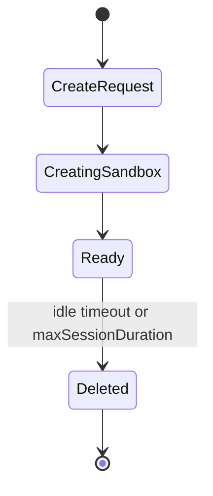
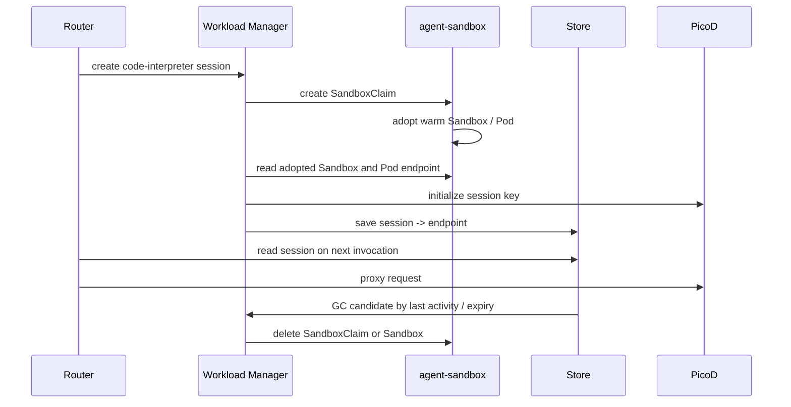
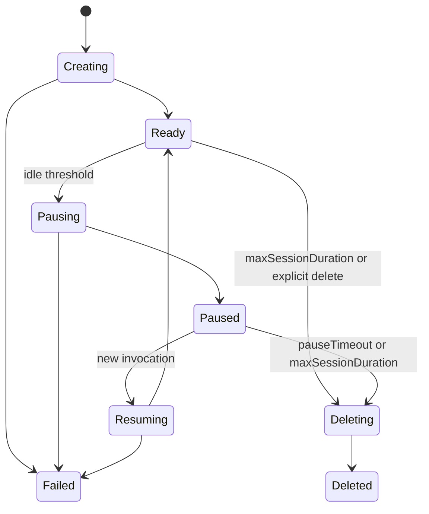
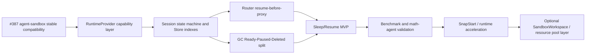

# Day 23: AgentCube 未来发展方向与架构设计探讨

日期：2026-06-23

## 今日问题

今天的问题不是单纯“还要不要继续调研竞品”，而是：

1. 已有调研还有哪些值得继续，哪些应该停止。
2. AgentCube 当前设计和实现之间有哪些落差。
3. 如何把 `internship-reports/design.md` 里的双层调度方案改造成 AgentCube 可落地的演进路线。
4. 最新 upstream PR / issue 对未来方向有什么信号。

## 输入来源

- 本地设计草稿：[design.md](design.md)。
- 官方 README 和架构文档：[README](../README.md)、[Architecture Overview](../docs/agentcube/docs/architecture/overview.md)、[AgentCube Design Proposal](../docs/design/agentcube-proposal.md)。
- 近期社区 issue / PR 快照，时间为 2026-06-23：
  - v0.2.0 umbrella issue: [#386](https://github.com/volcano-sh/agentcube/issues/386)
  - agent-sandbox v0.4.6 compatibility: [#387](https://github.com/volcano-sh/agentcube/pull/387)
  - SnapStart proposal / implementation: [#366](https://github.com/volcano-sh/agentcube/pull/366)、[#379](https://github.com/volcano-sh/agentcube/pull/379)
  - PicoD metrics: [#400](https://github.com/volcano-sh/agentcube/pull/400)
  - Keycloak / OIDC / RLAC merged PR: [#367](https://github.com/volcano-sh/agentcube/pull/367)
  - CodeInterpreter auth default: [#397](https://github.com/volcano-sh/agentcube/issues/397)、[#398](https://github.com/volcano-sh/agentcube/pull/398)
  - Python SDK lifecycle gaps: [#394](https://github.com/volcano-sh/agentcube/issues/394)、[#395](https://github.com/volcano-sh/agentcube/issues/395)
  - Session observability: [#331](https://github.com/volcano-sh/agentcube/pull/331)
  - NetworkPolicy support: [#291](https://github.com/volcano-sh/agentcube/pull/291)
  - CRD validation: [#382](https://github.com/volcano-sh/agentcube/pull/382)
  - Multi-AgentCube capability: [#301](https://github.com/volcano-sh/agentcube/issues/301)、[#354](https://github.com/volcano-sh/agentcube/pull/354)
- 前序本地报告：
  - [Day 12](day12-agentcube-roadmap-from-cubesandbox.md)
  - [Day 15](day15-upstream-pr-review-and-snapstart-implementation.md)
  - [Day 18](day18-agent-sandbox-v05-forward-adaptation.md)
  - [Day 19](day19-pr387-code-review-prep.md)
  - [Day 20](day20-agent-sandbox-v02-v03-v05-wip-pr-implementations-and-project-study.md)
  - [Day 21](day21-opensandbox-agent-substrate-study.md)
  - [Day 22](day22-opensandbox-agent-substrate-runtime-runbook.md)

本文没有向 upstream 发布新评论，只做本地分析。

## 结论先行

调研仍然值得继续，但不应该继续做泛泛的竞品阅读。后续应该切到“设计驱动 + 测试驱动”的调研：每一项调研都要回答一个 AgentCube 设计问题，并尽量形成代码实验、benchmark、issue review 或 proposal 材料。

AgentCube 当前最值得推进的主线不是重新造一个底层 sandbox runtime，也不是马上引入一个新的全局调度器，而是把现在的 Router / WorkloadManager / Store / agent-sandbox 依赖整理成更稳定的“会话生命周期控制面”。核心方向包括：

1. Runtime compatibility foundation：先把 `agent-sandbox` stable 版本兼容稳定下来，#387 属于这条线。
2. Session lifecycle：把文档里已经声明的 `Ready -> Paused -> Ready` 做成真实状态机，而不是当前的 idle delete。
3. Runtime provider abstraction：隔离 `agent-sandbox v0.4`、`v0.5/v1beta1`、SnapStart、OpenSandbox / Agent Substrate 一类后端差异。
4. Observability / API lifecycle：会话 GET/list/delete、TTL、metrics、health、owner-aware state 都是 sleep/resume 和生产化的前置条件。
5. Security / network：Keycloak/RLAC 已合并，NetworkPolicy 和 Router/WorkloadManager 到 sandbox 的 allow path 需要纳入设计。
6. Benchmark discipline：未来架构优化必须用 cold start、warm pool hit、pause/resume、SnapStart restore、math-agent e2e、资源残留检查来评价。

`design.md` 的直觉是对的：Kubernetes Pod 调度粒度和 sandbox 高频生命周期之间存在冲突，需要把资源池和 sandbox 生命周期解耦。但它现在更像“从零设计一个 sandbox scheduling system”，和 AgentCube 当前代码、agent-sandbox 依赖、社区正在推进的 PR 之间连接不够。更合适的路线是先做 capability layer 和 session lifecycle，再根据 benchmark 决定是否真的需要 `SandboxWorkspace` / placeholder Pod / node-local scheduler。

## 最新社区信号

| 方向 | 社区项 | 当前状态 | 关键观察 | 对 AgentCube 设计的含义 |
| --- | --- | --- | --- | --- |
| v0.2.0 总路线 | [#386](https://github.com/volcano-sh/agentcube/issues/386) | Open | 维护者用 umbrella issue 收集下一阶段计划。FAUST-BENCHOU 提了 Sandbox Sleep/Resume，zhzhuang-zju 提了适配最新 agent-sandbox。 | Sleep/Resume 和 agent-sandbox compatibility 是同一条主线的上下游，不应割裂。 |
| agent-sandbox stable compatibility | [#387](https://github.com/volcano-sh/agentcube/pull/387) | Open | 目标是对齐 current stable `agent-sandbox v0.4.6`，不把 `v0.5.0rc1` 混入同一 PR。 | 这是后续 Sleep/Resume / warm pool / runtime provider 的基础 PR。 |
| SnapStart | [#366](https://github.com/volcano-sh/agentcube/pull/366)、[#379](https://github.com/volcano-sh/agentcube/pull/379) | Open | 设计和实现都很大，涉及 Snapshot CRD、Kuasar driver、artifact store、restore intent。当前实现仍有较多 review 风险。 | 不建议重复实现。更适合做 benchmark、恢复语义、fallback、metrics、unit/e2e review。 |
| PicoD observability | [#400](https://github.com/volcano-sh/agentcube/pull/400) | Open | 新增 `/metrics`，但 review 已指出 raw path cardinality、middleware 覆盖范围、active execution 语义等问题。 | Observability 是活跃方向，但指标设计必须谨慎，不能只“暴露一些 metrics”。 |
| Auth / owner | [#367](https://github.com/volcano-sh/agentcube/pull/367) | Merged | Keycloak/OIDC/RLAC 已合入，Router 会向 WorkloadManager 转发签名后的 user identity。 | 后续 Store、delete/list、pause/resume、NetworkPolicy 都必须 owner-aware。 |
| CodeInterpreter auth default | [#397](https://github.com/volcano-sh/agentcube/issues/397)、[#398](https://github.com/volcano-sh/agentcube/pull/398) | Issue/PR active | direct path 和 warm-pool path 对默认 `authMode` 的处理不一致。 | 说明 Router/WM/CodeInterpreter 行为仍需一致性收敛，生命周期设计不能只看单一路径。 |
| Python SDK lifecycle | [#394](https://github.com/volcano-sh/agentcube/issues/394)、[#395](https://github.com/volcano-sh/agentcube/issues/395) | Assigned | `ttl` 参数被 SDK 发送但 WorkloadManager 不消费；SDK 能 create session 但不能 delete。 | API contract 不完整。Sleep/Resume 前必须定义 TTL、pauseTimeout、delete、attach session 的语义。 |
| Session observability | [#331](https://github.com/volcano-sh/agentcube/pull/331) | Open | 试图增加 GET/list，但 store list 可能退化为 Redis SCAN，auth/namespace/owner 边界也需要定义。 | Store 需要二级索引或更明确的数据模型，否则 list/resume/GC 会随 session 数增长变慢。 |
| NetworkPolicy | [#291](https://github.com/volcano-sh/agentcube/pull/291) | Open | 大 feature，跨 namespace Router ingress 和模式开关仍需收敛。 | #387 中显式关闭 agent-sandbox managed NetworkPolicy 只是兼容手段，长期仍要有 AgentCube 自己的数据路径 allow policy。 |
| CRD validation | [#382](https://github.com/volcano-sh/agentcube/pull/382) | Open | 给 duration、port、path、warmPoolSize 加校验，但 bot 指出 CEL duration 比较要用 `duration()`。 | API 稳定性正在补课。新增 pauseTimeout / runtime capability 字段时也要同步 CRD validation 和 generated tests。 |
| Multi-AgentCube | [#301](https://github.com/volcano-sh/agentcube/issues/301)、[#354](https://github.com/volcano-sh/agentcube/pull/354) | Open/WIP | 多 agent runtime 设计很大，涉及 role topology、headless service、group GC、store hash、rollback。 | 这是长期方向，但应在单 session lifecycle、store/index、delete/list 稳定后再推进，否则会叠加复杂度。 |

## 当前实现和设计目标的落差

官方 README 和 architecture 文档已经把 AgentCube 描述为支持 stateful lifecycle、smart sleep/resume、低延迟调度的平台。`docs/design/agentcube-proposal.md` 里也有 `Ready -> Paused -> Ready` 的状态机。

但从当前代码和 Day20 梳理来看，真实实现更接近：



对 CodeInterpreter warm pool 来说，当前真实路径是：



缺失的部分是：

- Store 中没有稳定的 `Paused` / `Resuming` 状态。
- Router 遇到 paused session 时不会先 resume 再 proxy。
- WorkloadManager 的 GC 当前是删除式回收，不是 `Ready -> Paused -> Deleted` 两阶段。
- Python SDK 的 `ttl` / `delete` 语义还没完全闭合。
- Session list / get / owner filtering 不完整。
- `agent-sandbox v0.5` 的 `OperatingMode` 可能提供底层 pause/resume 能力，但当前 #387 只适配 stable `v0.4.6`，不能直接把 rc 语义混入。

## 对 `design.md` 的评估

### 它判断正确的部分

`design.md` 的核心判断是：Kubernetes 原生 Pod 调度不适合承担所有 sandbox 高频生命周期操作。这一点成立，原因包括：

- Pod 创建和 image pull 对交互式 agent 来说太慢。
- kube-scheduler 面向一般工作负载，不适合每个短会话都走完整调度路径。
- agent 工作负载需要 prewarm、snapshot、resume、workspace persistence、runtime-local cache。
- 如果未来要做 sub-second start 或 SnapStart，仅靠普通 Pod create/delete 很难达成。

它提出的“双层调度”也有合理内核：

- Kubernetes 层负责粗粒度资源、隔离、quota、namespace/RBAC。
- Sandbox runtime 层负责细粒度会话、快启、暂停、恢复、快照、节点本地缓存。

这和 OpenSandbox 的 provider adapter、Agent Substrate 的 actor suspend/resume、agent-sandbox warm pool / future OperatingMode 都能对上。

### 它现在不适合作为直接实现方案的部分

当前方案最大问题是跳得太远：

- `SandboxWorkspace`、`SandboxScheduler`、`SandboxNodeState` 都不是 AgentCube 当前 API，直接引入会是一个大型 CRD/control-plane PR。
- 它和现有 `AgentRuntime`、`CodeInterpreter`、`SandboxWarmPool`、`SandboxClaim`、`Sandbox` 的关系没有定义清楚。
- 它没有覆盖 Router / Store / WorkloadManager 三者的会话一致性问题。
- 它没有考虑 #367 合入后的 owner identity、RLAC、delete/list 权限边界。
- 它没有说明 pause/resume 是“只保留 workspace 并重建进程”，还是“保留内存/进程状态”，这会直接影响用户承诺。
- placeholder Pod 虽然可以做资源预留，但也可能浪费资源、干扰 Cluster Autoscaler，并且和 agent-sandbox warm pool / SnapStart / Volcano scheduling 的职责重叠。
- 它没有设计 metrics、fallback、失败恢复、资源残留检查、version compatibility。

因此，`design.md` 不应该直接改成 upstream PR。更合适的做法是把它重命名为一个长期架构方向：runtime pool and capability-aware session orchestration。

## 建议的 AgentCube 架构优化方向

### 1. 先建立 RuntimeProvider 抽象，而不是马上写新 scheduler

WorkloadManager 目前直接感知 `agent-sandbox` 的 API 形态。#387 适配 `v0.4.6`、Day18 适配 `v0.5.0rc1` 都证明：agent-sandbox 版本升级会直接冲击 WorkloadManager、tests、codegen、e2e manifest。

建议先把 runtime 能力收敛成 provider interface：

```go
type RuntimeCapabilities struct {
    WarmPool              bool
    PauseResume           bool
    SnapshotRestore       bool
    ManagedNetworkPolicy  bool
    AdoptedSandbox        bool
    StablePodAnnotation   bool
}

type RuntimeProvider interface {
    Create(ctx context.Context, req CreateSandboxRequest) (*SandboxHandle, error)
    Resolve(ctx context.Context, session SandboxInfo) (*SandboxHandle, error)
    Pause(ctx context.Context, handle SandboxHandle) error
    Resume(ctx context.Context, handle SandboxHandle) (*SandboxHandle, error)
    Delete(ctx context.Context, handle SandboxHandle) error
    Capabilities(ctx context.Context) RuntimeCapabilities
}
```

这不是说现在就要提交一个大接口 PR，而是下一阶段设计应围绕这个边界展开：

- `agent-sandbox v0.4.6` provider：支持 warm pool adopted Sandbox，不承诺 native pause/resume。
- `agent-sandbox v0.5/v1beta1` provider：研究 `OperatingMode=Running/Suspended` 是否能承载 pause/resume。
- SnapStart provider：暴露 snapshot/restore capability，但不强迫普通 runtime 支持。
- OpenSandbox / Agent Substrate provider：用于未来对比和可插拔实验，不直接绑死主线。

### 2. 把 Store 变成 session lifecycle 的 source of truth

当前 Store 保存 session metadata、endpoint、expiry、last activity，但状态表达不够完整。Sleep/Resume 需要显式状态：



Store 至少要表达：

- `State`: `Creating` / `Ready` / `Pausing` / `Paused` / `Resuming` / `Deleting` / `Deleted` / `Failed`
- `OwnerID`: 来自 #367 的身份链路
- `RuntimeProvider` / `RuntimeVersion`
- `RuntimeHandle`: direct Sandbox name、SandboxClaim name、adopted Sandbox name、Pod name、namespace 等
- `EntryPoints` 和 `EndpointRevision`
- `CreatedAt`、`LastActivityAt`、`PausedAt`、`PauseExpiresAt`、`ExpiresAt`
- `FailureReason` / `Conditions`

同时要补索引，否则 #331 那类 list/get 会退化：

- `owner -> sessions`
- `namespace/name/kind -> sessions`
- `state -> sessions`
- `expiry bucket -> sessions`

### 3. Router 必须承担 resume-before-proxy

如果 session 已经 paused，Router 不应该直接把请求发到旧 endpoint。它应该：

1. 读取 session。
2. 校验 owner / namespace / kind。
3. 如果 `Ready`，正常 proxy。
4. 如果 `Paused`，调用 WorkloadManager resume。
5. 如果 `Resuming`，等待或返回明确的 retry 语义。
6. 如果 `Deleted` / `Failed`，返回可诊断错误。

这里还要避免并发 resume 风暴，可以用 singleflight、store CAS、或 WorkloadManager 端的 idempotent resume。

### 4. GC 应拆成两段

当前 GC 更接近：

```text
idle or expired -> delete
```

Sleep/Resume 需要：

```text
sessionTimeout reached while Ready -> Pause
pauseTimeout reached while Paused -> Delete
maxSessionDuration reached in any active state -> Delete
explicit SDK delete -> Delete immediately
```

这也会迫使 SDK、CRD、WorkloadManager request body 对 `sessionTimeout`、`pauseTimeout`、`maxSessionDuration`、`ttl` 的关系给出明确语义。

### 5. NetworkPolicy 要从“关闭以保证连通”走向“显式允许数据路径”

#387 中设置 `NetworkPolicyManagementUnmanaged` 是为了保持 AgentCube 当前 Router / WorkloadManager 到 sandbox Pod 的数据路径。如果让 agent-sandbox 默认管理 NetworkPolicy，而 AgentCube 没有配套 allow policy，就可能出现 sandbox Ready 但 entrypoint / router path 连接失败。

长期应补成：

- Router -> sandbox entrypoint allow。
- WorkloadManager -> PicoD `/init` allow。
- health / readiness path allow。
- 可选 egress policy。
- owner / namespace 隔离规则。

这和 #291 是同一方向。#387 不应该解决整个 NetworkPolicy feature，但后续设计必须承认这不是一个可以永久忽略的问题。

## 分阶段路线图

### Phase 0: current foundation hardening

目标：让当前 main 的基本路径稳定、可观测、可 review。

- 推进 #387：完成 `agent-sandbox v0.4.6` current stable compatibility。
- 跟进 #398：保证 direct path 和 warm-pool path 的 CodeInterpreter auth default 一致。
- 跟进 #394 / #395：明确 Python SDK `ttl` 和 delete/stop API。
- 跟进 #400：PicoD metrics 需要低基数 labels、清晰 active execution 语义、错误分类。
- 跟进 #331：session get/list 要设计 owner/namespace/filter/index，不要简单 SCAN。
- 跟进 #382：新增 lifecycle 字段前，先把 CRD validation 规则和 generated test 口径学清楚。

### Phase 1: runtime compatibility layer

目标：减少 agent-sandbox 版本变化对 WorkloadManager 主逻辑的冲击。

- 为 `agent-sandbox v0.4.6` 提炼 provider 边界。
- 保留 Day18 的 `v0.5.0rc1` 适配为 forward test，不混入 #387。
- 建 capability matrix：
  - direct Sandbox create
  - warm pool claim
  - adopted Sandbox
  - pod name annotation
  - managed NetworkPolicy
  - pause/resume operating mode
  - snapshot/restore
- 为每个 capability 写 fake provider unit test。

### Phase 2: Sleep/Resume MVP

目标：实现文档里已经声明的 `Ready -> Paused -> Ready`，但第一版必须定义清楚承诺边界。

建议第一版语义：

- 如果 runtime 支持 native suspend/resume，则恢复同一 runtime handle。
- 如果 runtime 只支持 scale-to-zero/recreate，则只能承诺 workspace / persisted files 保留，不承诺内存进程状态。
- 对 CodeInterpreter，先验证 `/workspace` 文件、session id、Router path、auth key是否在 resume 后仍可用。
- 对 math-agent，验证一次完整 tool call 后 idle pause，再 resume 后继续执行下一轮。

需要的测试：

- Store state machine unit test。
- WorkloadManager pause/resume fake provider test。
- Router resume-before-proxy test。
- GC `Ready -> Paused -> Deleted` test。
- Auth owner mismatch test。
- direct CodeInterpreter e2e。
- warm pool CodeInterpreter e2e。
- Python SDK create / invoke / pause / resume / delete e2e。
- math-agent LLM e2e。

### Phase 3: SnapStart and runtime acceleration

目标：把快启能力做成可测能力，而不是只看 proposal。

- 不重复实现 #366 / #379。
- 优先做 benchmark 和 review：
  - restore 成功率。
  - fallback 到 cold create 的行为。
  - artifact store 故障。
  - restore 后 first command latency。
  - memory / workspace / process state 的保留边界。
  - cleanup 后是否有 artifact / CR / Pod 残留。

### Phase 4: resource pool / SandboxWorkspace

目标：只有当数据证明 K8s 调度或 Pod create 是瓶颈，且 warm pool / SnapStart / pause-resume 不够时，再引入 `design.md` 里类似 `SandboxWorkspace` 的资源池层。

此阶段可以考虑：

- `RuntimePool` 或 `SandboxCapacityClass`，而不是一开始就设计完整二级 scheduler。
- placeholder Pod 只用于明确的资源预留场景。
- node-local runtime agent 只负责 node-local cache / metrics / snapshot / resume，不直接和 Kubernetes scheduler 抢职责。
- Volcano / DRA 集成只放在需要 GPU/accelerator reservation 的场景。

## 评测方案

为了评估 `design.md` 这类方案是否真的改善 AgentCube，不能只跑 `make test` 或普通 e2e。建议统一成以下指标。

| 指标 | 要测什么 | 为什么重要 |
| --- | --- | --- |
| Cold create latency | 无预拉镜像、无 warm pool 的首次创建 | 区分 image pull、Pod scheduling、runtime init 成本 |
| Warm create latency | image 已存在但无 warm pool | 看 Kubernetes create/start 本身成本 |
| Warm pool hit latency | `SandboxClaim -> adopted Sandbox -> first command` | #387 和 CodeInterpreter 体验核心 |
| Pause latency | `Ready -> Paused` 完成时间 | 判断 idle resource release 成本 |
| Resume latency | `Paused -> Ready -> first command` | Sleep/Resume 是否真的优于 delete/recreate |
| SnapStart restore latency | snapshot restore 到 first command | 评估 #366/#379 价值 |
| Session correctness | resume 后 session id、workspace、auth、entrypoints 是否可用 | 防止“看似恢复，实际上下文丢失” |
| Tail latency | p50/p95/p99 | Agent 交互体验更看尾部延迟 |
| Failure behavior | runtime 不支持、restore 失败、network deny、auth mismatch | 生产系统必须可诊断 |
| Cleanup residue | Pod、Sandbox、SandboxClaim、Redis、NetworkPolicy、artifact | 防止长时间测试污染集群 |
| Owner isolation | 用户 A 是否能 list/delete/resume 用户 B session | #367 之后必须验证 |

建议实验矩阵：

| 被测对象 | 目标 |
| --- | --- |
| upstream main | 基线 |
| #387 branch | stable `agent-sandbox v0.4.6` compatibility |
| Day18 `v0.5.0rc1` fork branch | forward API / OperatingMode feasibility |
| OpenSandbox Docker runtime | provider boundary / create-exec-file-delete 基准 |
| OpenSandbox Kubernetes provider | 后续验证是否可作为 K8s runtime adapter 样本 |
| Agent Substrate counter demo | 验证 actor suspend/resume 和状态保留语义 |
| SnapStart branch | restore latency / fallback / artifact behavior |

## 还有值得继续的调研任务吗

值得继续，但要收窄。

### 继续做

1. E2B-compatible API / SDK / template gap analysis  
   这是生态入口，AgentCube 如果想被 agent 应用集成，需要知道最低兼容面是什么。

2. OpenSandbox Kubernetes BatchSandbox / agent-sandbox provider smoke  
   Day22 只跑通了 Docker runtime。下一步如果环境允许，应验证它的 K8s provider 边界，重点看 provider interface、cleanup、network、namespace 设计。

3. Agent Substrate clean environment test  
   当前本机 kind bootstrap 失败，不能否定它的 suspend/resume 设计。更适合在 cgroup v2 / 新内核 / 标准云 K8s 上跑 counter demo。

4. Session store / index / observability design  
   #331 暴露了 GET/list 和 Redis SCAN 问题。这条线直接关系到 Sleep/Resume、MultiAgentRuntime、owner-aware API。

5. Network/security model  
   #367、#291、#398、#387 的 NetworkPolicy opt-out 都说明安全链路已经从“可选功能”变成“架构基础”。

6. Benchmark suite  
   当前最缺的是一套能同时覆盖 sandbox 基础设施、SDK、math-agent LLM e2e、cleanup 的统一测试口径。

### 暂停或降低优先级

1. 泛泛阅读新的 sandbox 竞品  
   如果不能跑 smoke 或不能回答 AgentCube 设计问题，价值较低。

2. 直接实现新 `SandboxWorkspace` / 二级 scheduler  
   这个方向可以保留为长期架构，但当前证据不足，不适合作为近期 PR。

3. 直接做底层 VMM / MicroVM runtime  
   AgentCube 更适合先做 Kubernetes-native orchestration 和 runtime adapter，不应立刻变成 VMM 项目。

4. Multi-AgentRuntime 大实现  
   #301/#354 已有 WIP。我们可以学习和 review，但不应在单 session lifecycle 未稳定前另起一个大 PR。

## 下一步建议

1. 写一份独立的 Sleep/Resume design note，围绕 #386，但先放本地报告，不急着发 upstream。
2. 从 #387 的代码中提炼 `agent-sandbox provider` 边界草图，先不提交大改，只做设计和 fake test spike。
3. 为 `sessionTimeout / pauseTimeout / maxSessionDuration / ttl / delete` 画 API 语义表，解决 #394/#395/#386 的共同问题。
4. 设计一版 benchmark schema，覆盖 cold/warm/pause/resume/SnapStart/math-agent/cleanup。
5. 继续跟踪 #400、#331、#382、#291，但只在有代码证据或测试证据时参与社区评论。

## 今日结论

AgentCube 的未来优化方向可以概括为：

```text
不是先造新 runtime，
而是先把 AgentCube 变成一个稳定的 session lifecycle control plane。

不是先造二级 scheduler，
而是先把 runtime capability、store state、router resume、GC policy、observability 和 security 边界打通。

不是继续泛读竞品，
而是用竞品实测来反推 AgentCube 的 provider boundary、benchmark 口径和产品承诺。
```

`design.md` 可以保留为长期方向输入，但近期更合理的落地路径是：


