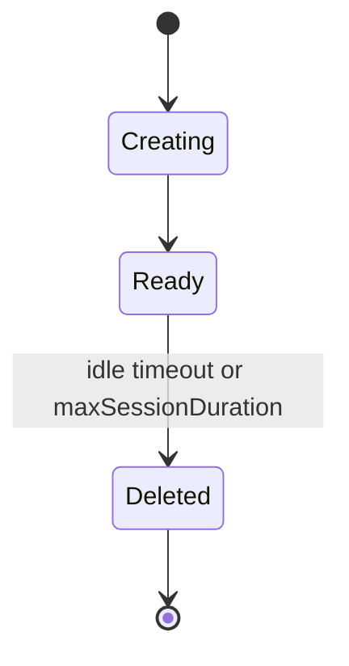
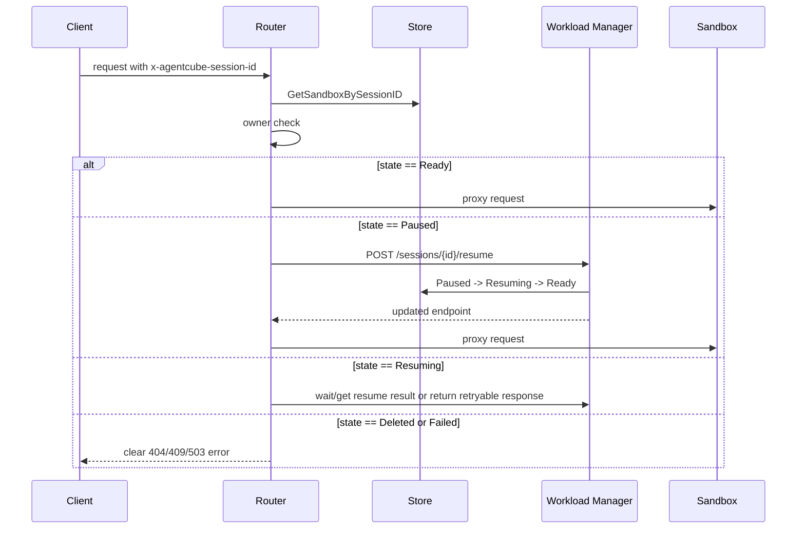
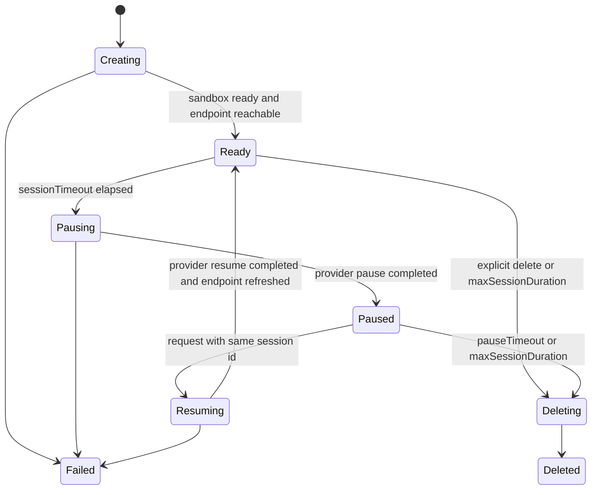

# Day 24: Sandbox Sleep/Resume 设计先行

日期：2026-06-23

## 背景问题

FAUST-BENCHOU 在 AgentCube v0.2.0 umbrella issue [#386](https://github.com/volcano-sh/agentcube/issues/386) 里提出了 Sandbox Sleep/Resume：

- idle 后 `Ready -> Paused`
- 下一次带 `x-agentcube-session-id` 的请求到来时 `Paused -> Ready`
- pause timeout 或 max TTL 后 `Paused -> Deleted`
- Workload Manager 负责 pause，Router 负责 resume-before-proxy，Store 记录 `Paused` 和 `PausedAt`

他又补充说，已经看到 `kubernetes-sigs/agent-sandbox` upstream 也在讨论 pause：

- [kubernetes-sigs/agent-sandbox#36](https://github.com/kubernetes-sigs/agent-sandbox/issues/36)
- [kubernetes-sigs/agent-sandbox#103](https://github.com/kubernetes-sigs/agent-sandbox/issues/103)

问题是：AgentCube 是否还需要自己做 Sleep/Resume，还是应该等待 agent-sandbox upstream 完成？

## 结论

AgentCube 应该先做设计，不应该等待 agent-sandbox upstream 全部定稿；但 AgentCube 也不应该重复实现底层 pause/runtime 机制。

更准确地说：

1. AgentCube 要定义的是“session lifecycle contract”：
   - 什么状态对 Router / SDK / Store 可见。
   - 什么时候 pause。
   - 什么时候 resume。
   - resume 后承诺保留什么。
   - owner / auth / delete / TTL 的语义是什么。

2. agent-sandbox 要提供的是“runtime capability”：
   - scale-to-zero / hard pause。
   - in-place resize / soft pause。
   - checkpoint / snapshot restore。
   - warm pool adoption。
   - NetworkPolicy / service / pod endpoint 的生命周期。

3. AgentCube 第一版应通过 provider capability 接入 agent-sandbox，不要把设计绑定死在某个未稳定的 agent-sandbox 字段上。

一句话：

```text
AgentCube should not wait to design Sleep/Resume,
but it should wait for or adapt to agent-sandbox for the low-level pause implementation.
```

## 上游 agent-sandbox 讨论结论

### agent-sandbox #36: Add pause field to Sandbox CRD

[#36](https://github.com/kubernetes-sigs/agent-sandbox/issues/36) 讨论的是给 Sandbox CRD 加 pause/resume 能力。

重要信息：

- 初始提案希望 `SandboxSpec` 有 `pause: true`。
- 讨论里把 state preservation 拆成三层：
  1. External volumes / PVC：必须保留。
  2. Container rootfs writable layer：最好保留。
  3. Runtime state / process / memory / OS state：可选，后续再做。
- 维护者 Janet Kuo 明确说明：phase 1 已经通过 `/scale` subresource 实现，scale Sandbox 到 0 等价于 pause。
- 当前 `agent-sandbox v0.4.6` 的 `SandboxSpec` 里仍有：
  - `spec.replicas`
  - 允许值 0 或 1
  - `+kubebuilder:subresource:scale`
- 这类 pause 的真实语义是：删除 Pod，保留 Sandbox 对象、PVC 和 service 等配置。

因此，#36 给 AgentCube 的启发是：

- AgentCube 可以把第一版 pause 定义成 hard pause / scale-to-zero。
- 第一版不应承诺进程、内存、GPU state 保留。
- 如果用户需要保留 `/workspace`，必须有明确的持久化存储约定；不能默认任何 Pod 内 filesystem 都能保留。

### agent-sandbox #103: soft pause for better latency

[#103](https://github.com/kubernetes-sigs/agent-sandbox/issues/103) 讨论的是 soft pause。

重要信息：

- 目标不是删除 Pod，而是使用 Kubernetes in-place pod resize 把 CPU/memory 降到最低。
- 请求到来时先处理 initial request，同时触发 in-place scale-up。
- 好处是比 scale-to-zero 更低延迟，因为 runtime 仍然存在。
- 维护者也在讨论是否扩展到 auto soft-pause。
- 这个方案依赖 Kubernetes `/resize` 能力，并且对 gVisor / Kata / hypervisor / guest OS memory reclaim 还有额外不确定性。
- issue 仍然是 open，label 是 `kind/feature` 和 `priority/important-longterm`。

因此，#103 给 AgentCube 的启发是：

- soft pause 是长期优化，不适合作为 AgentCube Sleep/Resume MVP 的硬依赖。
- AgentCube 可以在 capability matrix 中预留 `SoftPause`。
- 未来如果 runtime 支持 soft pause，AgentCube 的状态机和 Router resume-before-proxy 不需要重写，只需要替换 provider 的 `Pause/Resume` 实现。

### v0.5.0rc1 / v1beta1 的信号

Day18 已经验证过 `agent-sandbox v0.5.0rc1`：

- `v1alpha1` package 迁到 `v1beta1`。
- direct Sandbox 的 `spec.replicas` 改成 `spec.operatingMode`。
- `OperatingMode` 有 `Running` 和 `Suspended`。
- controller 中 `OperatingMode=Suspended` 会删除 Pod，并设置 `Suspended` condition。

这说明 agent-sandbox 的 API 正在从 `replicas=0/1` 迁移到更语义化的 `OperatingMode=Running/Suspended`。但 `v0.5.0rc1` 仍是 rc/pseudo-version，不应该混入 AgentCube #387 的 stable `v0.4.6` compatibility PR。

## Pause 模式分类

| 模式 | 底层动作 | 保留内容 | 释放资源 | 延迟 | AgentCube 是否应作为 MVP |
| --- | --- | --- | --- | --- | --- |
| Hard pause / scale-to-zero | 删除 Pod，保留 Sandbox/PVC/service | CR、PVC、部分 service/config；不保留进程和内存 | CPU/memory 基本释放 | 恢复需要重建 Pod | 是，适合作为第一版 |
| Soft pause / in-place resize | Pod 仍运行，降低 CPU/memory request/limit | 进程、内存、连接可能继续存在，但受 runtime 支持限制 | 释放部分资源 | 较低 | 否，作为后续 capability |
| Snapshot pause / checkpoint restore | checkpoint process/rootfs/memory，再 restore | 视 checkpoint 能力而定，可保留进程树/内存/rootfs | 可释放 Pod 资源 | 理想上低于 cold start | 否，和 SnapStart / checkpoint 方向关联 |

## AgentCube 当前实现状态

当前 AgentCube 的真实生命周期仍然是 create/delete：



相关代码：

- `pkg/common/types/sandbox.go`
  - `SandboxInfo` 已有 `SessionID`、`OwnerID`、`CreatedAt`、`ExpiresAt`、`IdleTimeout`、`LastActivityAt`、`Status`。
  - 但 `Status` 目前只是字符串，没有完整状态机约束。
- `pkg/workloadmanager/garbage_collection.go`
  - `ListInactiveSandboxes` + per-sandbox `IdleTimeout` 后直接 delete。
  - `ListExpiredSandboxes` 到期后直接 delete。
- `pkg/router/session_manager.go`
  - 有 session id 时直接从 Store 读 sandbox。
  - 没有 resume 逻辑。
- `pkg/router/handlers.go`
  - proxy 前后更新 last activity。
  - 已有 owner check。
  - preflight 不通时返回 sandbox unreachable / timeout，不会尝试 resume。
- `pkg/store/store_redis.go`
  - 通过 `session:{id}` 保存 JSON。
  - 通过 `session:expiry` 和 `session:last_activity` 两个 sorted set 做 TTL 和 idle 索引。
  - 没有 state index，也没有 pause timeout index。

## 设计目标

Sleep/Resume 设计要解决的是 AgentCube 层的用户体验和控制面语义：

1. 用户继续使用同一个 `x-agentcube-session-id`。
2. idle 后 sandbox 不再占用主要 runtime 资源。
3. 下一次请求可以恢复同一个 session。
4. pause timeout 或 max session duration 后最终清理。
5. Router / SDK / Store / WorkloadManager 对状态有一致理解。
6. 底层 runtime 能力可替换，不要求所有 runtime 都支持同一种 pause。

非目标：

- 第一版不实现进程内存 checkpoint。
- 第一版不承诺 GPU memory state。
- 第一版不要求 soft pause。
- 第一版不把 agent-sandbox rc/v1beta1 强行混进 stable compatibility PR。
- 第一版不解决完整 MultiAgentRuntime group lifecycle。

## 第一版语义建议

### Session 状态

建议把 AgentCube Store 中的 session 状态扩展为：

```text
Creating
Ready
Pausing
Paused
Resuming
Deleting
Deleted
Failed
```

状态机：


### 保留语义

第一版只承诺：

- `SessionID` 保留。
- Store 中的 owner 和 session metadata 保留。
- 如果 runtime provider 能保留 persistent workspace，则 workspace 保留。
- 不承诺 container memory、running process、open socket、GPU state 保留。

这点必须写清楚，否则用户会误以为 `resume` 是完整内存恢复。

更准确的用户承诺可以是：

```text
Sleep/Resume preserves the AgentCube session identity and provider-backed persistent workspace.
It does not guarantee process, memory, socket, or GPU state preservation unless the selected runtime provider explicitly supports it.
```

### Timeout 语义

建议区分四个概念：

| 字段 / 概念 | 作用 | 当前状态 | Sleep/Resume 后语义 |
| --- | --- | --- | --- |
| `sessionTimeout` | idle 多久触发处理 | 当前 idle 后 delete | Ready idle 后 pause |
| `pauseTimeout` | Paused 后最多保留多久 | 当前不存在 | Paused 超时后 delete |
| `maxSessionDuration` | session 绝对最长寿命 | 当前到期 delete | 任何非 Deleted 状态到期都 delete |
| SDK `ttl` | SDK 侧用户传入生命周期参数 | #394 反映当前未被 WorkloadManager 消费 | 要么映射到 maxSessionDuration，要么废弃；不能继续 silently ignored |

第一版建议新增 `pauseTimeout`，不要复用 `sessionTimeout`，否则语义会混乱：

```yaml
spec:
  sessionTimeout: 15m       # Ready -> Paused
  pauseTimeout: 10m         # Paused -> Deleted
  maxSessionDuration: 8h    # Any active state -> Deleted
```

如果为了最小 API 改动暂时不新增 CRD 字段，也要在设计里声明默认策略：

```text
pauseTimeout defaults to sessionTimeout unless explicitly configured later.
```

但从长期 API 清晰度看，单独字段更好。

## RuntimeProvider capability 设计

AgentCube 不应该直接在业务逻辑里写死 `replicas=0`、`operatingMode=Suspended`、或未来 `/resize`。这些应被 provider 抽象屏蔽。

设计草图：

```go
type PauseMode string

const (
    PauseModeHard     PauseMode = "Hard"
    PauseModeSoft     PauseMode = "Soft"
    PauseModeSnapshot PauseMode = "Snapshot"
)

type RuntimeCapabilities struct {
    HardPause       bool
    SoftPause       bool
    SnapshotPause   bool
    WarmPool        bool
    AdoptedSandbox  bool
    ManagedNetwork  bool
}

type SandboxHandle struct {
    Provider          string
    Namespace         string
    SandboxName       string
    SandboxClaimName  string
    PodName           string
    ServiceName       string
    EntryPoints       []types.SandboxEntryPoint
}

type RuntimeProvider interface {
    Capabilities(ctx context.Context) RuntimeCapabilities
    Pause(ctx context.Context, handle SandboxHandle, mode PauseMode) (*SandboxHandle, error)
    Resume(ctx context.Context, handle SandboxHandle) (*SandboxHandle, error)
    Delete(ctx context.Context, handle SandboxHandle) error
    Resolve(ctx context.Context, info *types.SandboxInfo) (*SandboxHandle, error)
}
```

`agent-sandbox v0.4.6` provider：

- hard pause = patch `Sandbox.spec.replicas=0` for direct Sandbox。
- resume = patch `Sandbox.spec.replicas=1` and wait Ready/endpoint。
- warm-pool-backed `SandboxClaim` 需要谨慎：
  - claim adoption path 当前由 agent-sandbox 管。
  - pause 已绑定 session 的 adopted Sandbox 时，应该 pause adopted Sandbox 还是 delete claim，需要实际验证。
  - MVP 可以先只支持 direct Sandbox，或把 warm-pool resume 作为单独测试项。

`agent-sandbox v0.5/v1beta1` provider：

- hard pause = patch `Sandbox.spec.operatingMode=Suspended`。
- resume = patch `Sandbox.spec.operatingMode=Running`。
- 等待 `Ready=True` 且 `Suspended` condition 消失或变为 False。

future provider：

- soft pause = provider 内部用 `/resize` 或 runtime-specific 机制。
- snapshot pause = provider 内部用 checkpoint / restore / SnapStart。

## Store 设计

建议扩展 `SandboxInfo`：

```go
type SandboxInfo struct {
    // existing fields...
    Status string `json:"status"`

    RuntimeProvider string `json:"runtimeProvider,omitempty"`
    PauseMode string `json:"pauseMode,omitempty"`
    PausedAt *time.Time `json:"pausedAt,omitempty"`
    PauseExpiresAt *time.Time `json:"pauseExpiresAt,omitempty"`
    ResumedAt *time.Time `json:"resumedAt,omitempty"`
    FailureReason string `json:"failureReason,omitempty"`

    SandboxName string `json:"sandboxName,omitempty"`
    SandboxClaimName string `json:"sandboxClaimName,omitempty"`
    PodName string `json:"podName,omitempty"`
    EndpointRevision int64 `json:"endpointRevision,omitempty"`
}
```

Store 需要新增能力：

- `UpdateSandboxStatus(sessionID, expectedState, nextState, timestamps)`，最好支持 CAS，避免并发 resume。
- `ListPauseCandidates(before, limit)`：Ready 且 last activity 超过 sessionTimeout。
- `ListPauseExpired(before, limit)`：Paused 且 pauseExpiresAt 到期。
- `ListExpiredSandboxes(before, limit)` 保持处理 maxSessionDuration。
- 后续补 state index：`session:state:{state}`，避免只靠扫描。

MVP 可以先用现有 sorted set + JSON status filter，但要在设计里承认：

- 数据量大时会有效率问题。
- #331 的 session list/get 也会遇到类似 index 问题。
- 长期要给 state/owner/kind/namespace 建索引。

## Workload Manager 设计

Workload Manager 需要新增两个内部动作：

1. Pause
   - GC 找到 idle `Ready` session。
   - CAS `Ready -> Pausing`。
   - 调用 provider `Pause`。
   - 成功后更新 `Paused`、`PausedAt`、`PauseExpiresAt`，清空或标记旧 entrypoint。
   - 失败后进入 `Failed` 或回滚 `Ready`，取决于错误类型。

2. Resume
   - Router 请求 WorkloadManager 恢复 session。
   - CAS `Paused -> Resuming`。
   - 调用 provider `Resume`。
   - 等待 Ready 和 entrypoint reachable。
   - 更新 Store entrypoint、`Ready`、`ResumedAt`。

建议新增内部 API：

```text
POST /v1/sessions/{sessionId}/resume
POST /v1/sessions/{sessionId}/pause
```

是否公开给 SDK 可以后置。第一版 Router 内部调用即可。

## Router 设计

Router 当前有 session id 时直接读 Store，然后 proxy。

Sleep/Resume 后应改成：



并发问题：

- 多个请求同时打到 Paused session 时，只允许一个 resume。
- 其他请求等待同一个 resume 结果，或者返回 `409 Resuming` + retry-after。
- 更推荐 WorkloadManager 侧做 idempotent resume，这样 Router 实现更简单。

## GC 设计

当前 GC 合并 inactive 和 expired 后统一 delete。

Sleep/Resume 后应分成三类：

```text
Ready idle beyond sessionTimeout -> pause
Paused beyond pauseTimeout -> delete
Any state beyond maxSessionDuration -> delete
```

伪代码：

```go
func (gc *garbageCollector) once() {
    now := time.Now()

    readyIdle := store.ListPauseCandidates(now, limit)
    for _, s := range readyIdle {
        pauseSession(s)
    }

    pauseExpired := store.ListPauseExpired(now, limit)
    for _, s := range pauseExpired {
        deleteSession(s)
    }

    maxExpired := store.ListExpiredSandboxes(now, limit)
    for _, s := range maxExpired {
        deleteSession(s)
    }
}
```

注意：

- `Paused` session 不应再被 Router 的 preflight 当成 sandbox unreachable。
- `LastActivityAt` 在 resume 请求到来时应更新，但更新时间点要小心：如果 resume 失败，不应让 session 永久避开 GC。
- 显式 delete 应该可以删除 `Ready`、`Paused`、`Failed`、`Resuming` 中可安全终止的状态。

## SDK / API 语义

需要和 #394 / #395 一起考虑：

- #394：Python SDK 的 `ttl` 参数被发送但 WorkloadManager 不消费。
- #395：Python `AgentRuntimeClient` 可以创建 session，但不能 delete。

Sleep/Resume 设计不能只改后台 GC，否则用户层会继续困惑。

建议：

- SDK 提供 `close()` / `delete()`，映射到 WorkloadManager delete session。
- SDK 不直接承诺 pause/resume API；默认由 idle policy 自动触发。
- 如果暴露手动 pause/resume，应该是高级 API：
  - `pause(session_id)`
  - `resume(session_id)`
  - 返回明确状态。
- `ttl` 要么映射到 `maxSessionDuration`，要么从 SDK 删除/标记 deprecated。

## Warm Pool 与 Sleep/Resume 的关系

Warm pool 和 Sleep/Resume 不是同一个问题。

- Warm pool 优化新 session 创建。
- Sleep/Resume 优化已有 session idle 后再访问。

对 CodeInterpreter 来说有两个路径：

1. 新 session：
   - `SandboxWarmPool -> SandboxClaim -> adopted Sandbox -> Ready`
2. 已有 session pause/resume：
   - 应恢复同一个 session 对应的 runtime handle。

难点：

- #387 适配后，warm pool path 的 store `Kind` 仍保存为 `SandboxClaimsKind`，但真正 Ready 的 runtime 是 adopted Sandbox。
- 如果 pause 删除 SandboxClaim，可能丢失 session 和 adopted Sandbox 关系。
- 如果 pause adopted Sandbox，需要 Store 记录 adopted Sandbox name。
- v0.5 `SandboxClaim` 的 `TemplateRef` 变成 required `WarmPoolRef`，语义还会再变。

建议 MVP：

- 先把 Sleep/Resume 设计覆盖 direct Sandbox。
- Warm-pool-backed CodeInterpreter 作为必须验证项，但不在没有实测前承诺。
- 如果社区要求 CodeInterpreter first，则必须先补 Store 中 adopted Sandbox handle 的清晰字段。

## NetworkPolicy / Auth 影响

Sleep/Resume 会改变 endpoint 生命周期：

- pause 后旧 Pod IP 可能失效。
- resume 后 Pod IP 可能变化。
- Router 不能缓存旧 endpoint。
- Store 必须更新 `EntryPoints` 和 `EndpointRevision`。

Auth/RLAC：

- #367 已合入 owner identity。
- Router resume 前必须做 owner check。
- WorkloadManager resume/delete 也要验证 owner。
- Admin bypass 逻辑应和现有 Router owner check 一致。

NetworkPolicy：

- #387 当前为了保持连通性关闭 agent-sandbox managed NetworkPolicy。
- 长期 Sleep/Resume 要配套 Router -> sandbox、WorkloadManager -> sandbox init/probe 的 allow policy。
- 否则 resume 成功但 Router 无法连通，会表现成假失败。

## 测试设计

### Unit tests

Store：

- `Ready -> Pausing -> Paused` 状态更新。
- CAS 失败时不覆盖状态。
- `PauseExpiresAt` index。
- `ListPauseCandidates` 只返回 Ready。
- `ListPauseExpired` 只返回 Paused。
- delete 清理 session key、expiry、last activity、state/pause index。

WorkloadManager：

- idle Ready session 调用 provider Pause。
- pause provider 失败时状态可诊断。
- Paused session resume 成功后更新 entrypoint。
- resume 并发只执行一次。
- maxSessionDuration 对 Ready/Paused/Resuming 都会 delete。

Router：

- Ready session 直接 proxy。
- Paused session 调 WorkloadManager resume 后 proxy。
- owner mismatch 不触发 resume。
- resume failure 返回明确错误。
- Resuming 状态下行为一致。

### E2E tests

Direct CodeInterpreter：

1. 创建 session。
2. 写 `/workspace` 文件。
3. 等待 sessionTimeout 触发 pause。
4. 确认 Pod 被释放或进入 suspended。
5. 用同一个 session id 请求。
6. 确认 resume 后文件仍存在。
7. 确认 session id 不变。
8. delete 后确认 Pod/Sandbox/Store 无残留。

Warm pool CodeInterpreter：

- 同 direct，但额外检查 claim/adopted Sandbox handle 是否稳定。
- 如果当前版本不支持，测试应标记为 skipped with reason，不要假装支持。

AgentRuntime：

- 创建 agent session。
- pause/resume 后 Router path 仍可达。
- 如果没有 PVC/workspace，测试只验证 session metadata 和 endpoint refresh，不验证文件保留。

math-agent LLM e2e：

- 第一轮 tool call 写入 workspace 或产生中间文件。
- idle pause。
- 第二轮复用同一 session 继续执行。
- 验证不是新建 session。

### Benchmark

必须区分：

| Case | 指标 |
| --- | --- |
| cold create | no image cache, no warm pool |
| warm create | image cached, no warm pool |
| warm pool hit | SandboxClaim adoption |
| hard pause resume | Paused -> Ready -> first command |
| soft pause resume | Folded -> Unfolded -> first command |
| snapshot restore | Restore -> first command |

记录：

- p50 / p95 / p99
- success rate
- cleanup residue
- Pod IP 是否变化
- workspace 是否保留
- auth 是否仍有效

## 是否需要等 agent-sandbox upstream

不需要等的部分：

- AgentCube session 状态机设计。
- Store 字段和索引设计。
- Router resume-before-proxy 语义。
- WorkloadManager pause/resume API contract。
- SDK `ttl/delete` 语义澄清。
- benchmark schema。
- fake provider tests。

应该等待或跟随 agent-sandbox 的部分：

- `replicas=0/1` 还是 `OperatingMode=Running/Suspended` 的最终 API。
- soft pause / in-place resize 是否可用。
- snapshot/checkpoint 是否成为通用 runtime capability。
- warm pool claim 在 paused session 下的推荐语义。

因此工作顺序应是：

```text
Design AgentCube lifecycle contract now
  -> implement fake provider / unit state machine spike
  -> bind to agent-sandbox v0.4.6 hard pause only if maintainers accept MVP
  -> later switch provider to v0.5/v1beta1 OperatingMode
  -> later add soft/snapshot pause capabilities
```

## 和 #387 的关系

#387 是 Sleep/Resume 的基础，不是 Sleep/Resume 本身。

#387 解决：

- AgentCube 对 current stable `agent-sandbox v0.4.6` 的兼容。
- warm pool claim adoption 语义变化。
- public annotation。
- NetworkPolicy management opt-out。
- codegen / dependency stack。

Sleep/Resume 后续要在 #387 之后处理：

- Store session state。
- Router resume-before-proxy。
- GC split。
- provider pause/resume。
- pauseTimeout。
- tests/benchmark。

不要把 Sleep/Resume 加进 #387，否则 PR 范围会失控。

## 后续建议

1. 先把这份设计整理成英文 proposal 草稿，但暂时不发。
2. 本地开一个 spike 分支，只做 fake provider + Store 状态机 unit test，不碰真实 agent-sandbox。
3. 如果 fake provider 设计顺畅，再考虑 direct Sandbox 的 `replicas=0/1` hard pause MVP。
4. 等 #387 合并后，再从最新 upstream/main 创建干净 Sleep/Resume proposal/implementation 分支。
5. 如果 FAUST-BENCHOU 准备负责实现，我们更适合提供设计 review、test plan 和 benchmark，而不是抢同一个 implementation。

## 本地 spike 验收口径

本轮 spike 不追求完整功能，不接真实 `agent-sandbox`，只验证 AgentCube 层面的边界是否合理：

1. 状态枚举是否能表达 `Ready -> Pausing -> Paused -> Resuming -> Ready`。
2. `RuntimeProvider` 是否能把底层 pause/resume 机制从 GC / Router / Store 中隔离出去。
3. GC 是否能从“idle 后 delete”重构成“idle 后 pause，paused 超时后 delete”的控制流。
4. Store 是否需要 CAS；如果没有 CAS，多并发 resume 会不会重复调用 provider。
5. Router resume-before-proxy 是否能只依赖 Store 状态和 WorkloadManager API，而不直接理解 `replicas` / `OperatingMode`。

最小测试目标：

| 层级 | 测试内容 | 通过标准 |
| --- | --- | --- |
| lifecycle helper | 合法状态迁移 | 非法迁移返回明确错误 |
| fake provider | pause/resume 调用次数和 handle 更新 | 同一个 session 的 entrypoint 可以在 resume 后刷新 |
| GC helper | idle Ready 进入 pause，Paused 超时进入 delete，maxSessionDuration 直接 delete | 三类候选互不混淆 |
|并发语义 | 两个 resume 请求同时到来 | 只能有一个成功从 `Paused` 抢到 `Resuming` |

本轮 spike 不做：

- 不改 CRD。
- 不改 Redis / Valkey 存储。
- 不改 Router 真实 handler。
- 不更新 `agent-sandbox` 依赖。
- 不创建 upstream PR。

如果 spike 发现 Store CAS 是硬需求，后续正式实现要优先补 Store 接口，而不是先改 Router 或 GC。

## 本地 spike 结果

日期：2026-06-23

隔离 worktree：

```text
/home/agentcube-sleep-resume-spike
branch: spike/sleep-resume-state-machine
base: upstream/main bed6bd4
```

新增实验包：

```text
pkg/sessionlifecycle/lifecycle.go
pkg/sessionlifecycle/lifecycle_test.go
```

这个包只作为本地 spike，不准备直接进入 upstream PR。它做了以下最小验证：

- `State` 枚举：`Creating`、`Ready`、`Pausing`、`Paused`、`Resuming`、`Deleting`、`Deleted`、`Failed`。
- `CanTransition(from, to)`：验证合法/非法状态迁移。
- `RuntimeProvider` 接口：`Capabilities`、`Resolve`、`Pause`、`Resume`、`Delete`。
- `Controller.PauseSession`：
  - Store CAS `Ready -> Pausing`。
  - provider `Resolve`。
  - provider `Pause`。
  - Store CAS `Pausing -> Paused`。
  - 设置 `PausedAt` / `PauseExpiresAt`，清空旧 entrypoint。
- `Controller.ResumeSession`：
  - Store CAS `Paused -> Resuming`。
  - provider `Resume`。
  - Store CAS `Resuming -> Ready`。
  - 刷新 entrypoint、`LastActivityAt`、`ResumedAt`。
- `GCActionForSession`：
  - `Ready` idle 超时 -> `Pause`。
  - `Paused` 超过 `PauseExpiresAt` -> `Delete`。
  - `ExpiresAt` 超时 -> `Delete`，并覆盖 Ready/Paused 状态。

测试命令：

```bash
go test ./pkg/sessionlifecycle -count=1
go test -race ./pkg/sessionlifecycle -count=1
go test ./pkg/sessionlifecycle -run TestResumeSession_ConcurrentResumeUsesStoreCAS -race -count=20
git diff --check
```

结果：

```text
PASS
```

关键发现：

1. `RuntimeProvider` 边界是可行的。GC / Router / Store 不需要知道 `agent-sandbox v0.4.x` 的 `replicas=0/1` 或 `v0.5/v1beta1` 的 `OperatingMode=Suspended/Running`。
2. Store CAS 不是优化项，而是正确性要求。并发 resume 测试中，只有 CAS 能保证两个请求同时打到 Paused session 时，provider `Resume` 只被调用一次。
3. pause 后必须清空或标记旧 entrypoint；resume 成功后必须刷新 entrypoint。否则 Router 可能继续代理到已经失效的 Pod IP。
4. provider 失败时需要把 session 标成 `Failed` 并记录 `FailureReason`，否则用户只会看到超时，维护者也难以定位是 Store、Provider 还是 endpoint readiness 失败。
5. `maxSessionDuration` 应该优先于 pause/resume 状态；无论 Ready 还是 Paused，到达绝对 TTL 都应 delete。

环境卡点：

```text
失败命令：
make fmt

错误现象：
make: go: Command not found
go fmt ./...
bash: go: command not found

原因：
Codex shell 的默认 PATH 没有 Go 命令，之前只能通过
/root/go/pkg/mod/golang.org/toolchain@v0.0.1-go1.26.4.linux-amd64/bin
显式使用 Go 1.26.4。

解决：
已把 Go 1.26.4 toolchain 安装到 /usr/local/go1.26.4，
并将 /usr/local/bin/go 和 /usr/local/bin/gofmt 链接到该 toolchain。
现在 plain `go version` 输出 `go version go1.26.4 linux/amd64`，
plain `make fmt` 可直接运行。
```

对正式实现的影响：

- 第一阶段应先补 Store CAS / 状态字段 / pause indexes，再接 Router 和真实 provider。
- WorkloadManager resume API 应该做成 idempotent 或至少 CAS-safe。
- Router 不应自己实现底层 resume；它应该调用 WorkloadManager resume，再拿刷新后的 sandbox info proxy。
- 正式 PR 的测试不能只跑 e2e；必须包含并发 resume、provider 失败、entrypoint refresh、max TTL 覆盖这些单元测试。

## 英文 proposal 草稿

> 说明：这是本地草稿，暂不发布到 upstream。真正发布前还需要重新确认 #386、agent-sandbox #36/#103 和 #387 的最新状态，并由用户确认全文。

```md
---
title: AgentCube Sandbox Sleep/Resume Lifecycle
authors:
  - "@ranxi2001"
reviewers:
  - TBD
approvers:
  - TBD
creation-date: 2026-06-23
---

# AgentCube Sandbox Sleep/Resume Lifecycle

## Motivation

AgentCube documents a smart sleep/resume lifecycle, but the current implementation still behaves as a create/delete lifecycle: an idle session is eventually garbage-collected, and the next request needs a new sandbox/session path.

For intermittent agent workloads, this is not ideal. Users expect the same `x-agentcube-session-id` to remain meaningful across short idle periods, and they expect provider-backed workspace state to survive when the runtime supports it. At the same time, keeping every sandbox fully running wastes cluster CPU and memory.

The goal of this proposal is to define the AgentCube-level session lifecycle contract first, while leaving the low-level pause mechanism to the runtime provider, especially `kubernetes-sigs/agent-sandbox`.

## Related Work

- AgentCube umbrella issue: volcano-sh/agentcube#386
- agent-sandbox hard pause / scale subresource: kubernetes-sigs/agent-sandbox#36
- agent-sandbox soft pause / in-place resize: kubernetes-sigs/agent-sandbox#103
- AgentCube agent-sandbox compatibility foundation: volcano-sh/agentcube#387

My reading is:

- agent-sandbox #36 gives a practical hard-pause mechanism: scale the Sandbox to 0, delete the Pod, and preserve Sandbox/PVC/service-level configuration.
- agent-sandbox #103 is a lower-latency soft-pause direction, but it is longer-term and runtime-dependent.
- AgentCube should not duplicate low-level pause mechanisms, but it should define how session state, routing, garbage collection, SDK semantics, and tests work.

## Goals

- Define explicit AgentCube session states for sleep/resume.
- Change idle handling from `Ready -> Deleted` to `Ready -> Paused`.
- Resume a paused session before proxying a request with `x-agentcube-session-id`.
- Separate `sessionTimeout`, `pauseTimeout`, and `maxSessionDuration`.
- Keep runtime pause/resume behind a provider capability interface.
- Make preservation semantics explicit and testable.

## Non-Goals

- Do not implement process/memory/GPU checkpointing in the first version.
- Do not require soft pause or Kubernetes in-place Pod resize for the MVP.
- Do not depend on an agent-sandbox rc API for the first stable implementation.
- Do not merge Sleep/Resume into the agent-sandbox v0.4.x compatibility PR.
- Do not promise that ephemeral container filesystem state survives hard pause unless the selected runtime provider uses persistent workspace storage.

## Proposed State Machine



The visible Store states should be:

- `Creating`
- `Ready`
- `Pausing`
- `Paused`
- `Resuming`
- `Deleting`
- `Deleted`
- `Failed`

## Preservation Semantics

The MVP should promise:

- Session identity is preserved.
- Owner/session metadata is preserved.
- Provider-backed persistent workspace is preserved when configured and supported.

The MVP should not promise:

- Process state preservation.
- Memory state preservation.
- Open socket preservation.
- GPU memory preservation.
- Ephemeral container writable-layer preservation unless the provider explicitly supports it.

Suggested user-facing wording:

> Sleep/Resume preserves the AgentCube session identity and provider-backed persistent workspace. It does not guarantee process, memory, socket, or GPU state preservation unless the selected runtime provider explicitly supports it.

## Timeout Semantics

| Field | Meaning |
| --- | --- |
| `sessionTimeout` | Idle time before `Ready -> Paused` |
| `pauseTimeout` | Time a paused session may stay before `Paused -> Deleted` |
| `maxSessionDuration` | Absolute maximum lifetime for any non-deleted session |
| SDK `ttl` | Should map to `maxSessionDuration` or be deprecated; it should not remain silently ignored |

Example:

```yaml
spec:
  sessionTimeout: 15m
  pauseTimeout: 10m
  maxSessionDuration: 8h
```

## Runtime Provider Capability

AgentCube should not hard-code `spec.replicas=0`, `spec.operatingMode=Suspended`, or a future resize/checkpoint API in Router or GC logic. These should be provider capabilities.

```go
type RuntimeCapabilities struct {
    HardPause      bool
    SoftPause      bool
    SnapshotPause  bool
    WarmPool       bool
    AdoptedSandbox bool
    ManagedNetwork bool
}

type RuntimeProvider interface {
    Capabilities(ctx context.Context) RuntimeCapabilities
    Pause(ctx context.Context, handle SandboxHandle, mode PauseMode) (*SandboxHandle, error)
    Resume(ctx context.Context, handle SandboxHandle) (*SandboxHandle, error)
    Delete(ctx context.Context, handle SandboxHandle) error
    Resolve(ctx context.Context, info *types.SandboxInfo) (*SandboxHandle, error)
}
```

Possible provider mappings:

- agent-sandbox v0.4.x: hard pause via `Sandbox.spec.replicas=0/1`.
- agent-sandbox v0.5/v1beta1: hard pause via `Sandbox.spec.operatingMode=Suspended/Running`.
- future: soft pause via in-place Pod resize.
- future: snapshot pause via checkpoint/restore or SnapStart-like provider support.

## Component Changes

### Store

- Add explicit session lifecycle fields such as `PausedAt`, `PauseExpiresAt`, `ResumedAt`, `RuntimeProvider`, `PauseMode`, `FailureReason`, and runtime handle fields.
- Add CAS-style state update, for example `UpdateSandboxStatus(sessionID, expectedState, nextState, ...)`.
- Add pause indexes:
  - `ListPauseCandidates(before, limit)` for idle `Ready` sessions.
  - `ListPauseExpired(before, limit)` for expired `Paused` sessions.
- Keep `ListExpiredSandboxes` for `maxSessionDuration`.

### Workload Manager

- Add pause logic used by GC:
  - CAS `Ready -> Pausing`.
  - Call provider `Pause`.
  - Store `Paused`, `PausedAt`, and `PauseExpiresAt`.
- Add resume logic used by Router:
  - CAS `Paused -> Resuming`.
  - Call provider `Resume`.
  - Wait for Ready and endpoint reachability.
  - Store refreshed entrypoints and `Ready`.
- Make resume idempotent or concurrency-safe.

### Router

- Keep owner check before resume.
- If session state is `Ready`, proxy as today.
- If session state is `Paused`, ask Workload Manager to resume before proxying.
- If session state is `Resuming`, either wait for the same resume operation or return a retryable response.
- If session state is `Deleted` or `Failed`, return a clear error.

### Garbage Collection

Replace one combined delete path with three decisions:

- `Ready` idle beyond `sessionTimeout` -> pause.
- `Paused` beyond `pauseTimeout` -> delete.
- Any non-deleted session beyond `maxSessionDuration` -> delete.

### SDK / API

- Clarify whether SDK `ttl` maps to `maxSessionDuration`.
- Add or document `close()` / `delete()` behavior for explicit cleanup.
- Keep manual `pause()` / `resume()` optional for advanced users; automatic idle policy should be the default.

## Testing Plan

Unit tests:

- Store state transition and CAS behavior.
- Pause candidate and pause-expired indexes.
- Workload Manager pause success/failure paths with a fake provider.
- Workload Manager resume success/failure/concurrency paths with a fake provider.
- Router owner mismatch should not trigger resume.
- Router paused-session path should resume before proxying.
- GC should pause idle Ready sessions and delete expired Paused sessions.

E2E tests:

- Direct CodeInterpreter hard pause/resume.
- Persistent workspace file survives resume when configured.
- Session ID stays unchanged.
- Pod IP may change and entrypoints are refreshed.
- Explicit delete removes Sandbox/Pod/Store state.
- Warm-pool-backed CodeInterpreter is either tested explicitly or marked unsupported with a clear reason.
- math-agent LLM e2e verifies multi-turn reuse after idle pause.

Benchmark:

- Cold create latency.
- Warm create latency.
- Warm pool hit latency.
- Hard pause resume latency.
- Future soft pause resume latency.
- Future snapshot restore latency.

Each benchmark should record p50/p95/p99, success rate, cleanup residue, endpoint change, workspace preservation, and auth behavior.

## Open Questions

- Should the MVP support only direct Sandbox first, or must CodeInterpreter warm-pool sessions be included from day one?
- Should `pauseTimeout` be a new CRD field, or default to `sessionTimeout` until the API is expanded?
- What is the expected behavior when resume fails after the session has already moved to `Resuming`?
- Should Router wait for concurrent resume or return `409 Resuming` with `Retry-After`?
- How should `ttl` in the Python SDK be mapped or deprecated?
- What NetworkPolicy rules are required if agent-sandbox managed NetworkPolicy is enabled again?
```

## 可给 FAUST-BENCHOU 的简短英文回复草稿

```md
I think we should not block the AgentCube design on the final agent-sandbox implementation, but we also should not duplicate the low-level pause mechanism.

My reading of kubernetes-sigs/agent-sandbox#36 is that the first practical pause semantics is already "hard pause": scale the Sandbox to 0, delete the Pod, and preserve the Sandbox/PVC/service-level configuration. kubernetes-sigs/agent-sandbox#103 is more about "soft pause" via in-place Pod resize, which looks valuable but longer-term and runtime-dependent.

For AgentCube, I suggest we first define the session lifecycle contract:

- Store states: Ready / Pausing / Paused / Resuming / Deleted / Failed
- GC policy: sessionTimeout means Ready -> Paused, pauseTimeout means Paused -> Deleted, maxSessionDuration means any active state -> Deleted
- Router behavior: resume a Paused session before proxying when `x-agentcube-session-id` is present
- Clear preservation semantics: the MVP can preserve session identity and provider-backed persistent workspace, but should not promise process/memory/GPU state unless the runtime provider explicitly supports it

Then the low-level implementation can be a provider capability:

- agent-sandbox v0.4.x: `spec.replicas=0/1`
- agent-sandbox v0.5/v1beta1: `spec.operatingMode=Suspended/Running`
- future: soft pause or snapshot/checkpoint restore

So my preference is: continue with an AgentCube-level design first, keep it capability-based, and avoid depending on soft pause being ready in agent-sandbox for the MVP.
```
