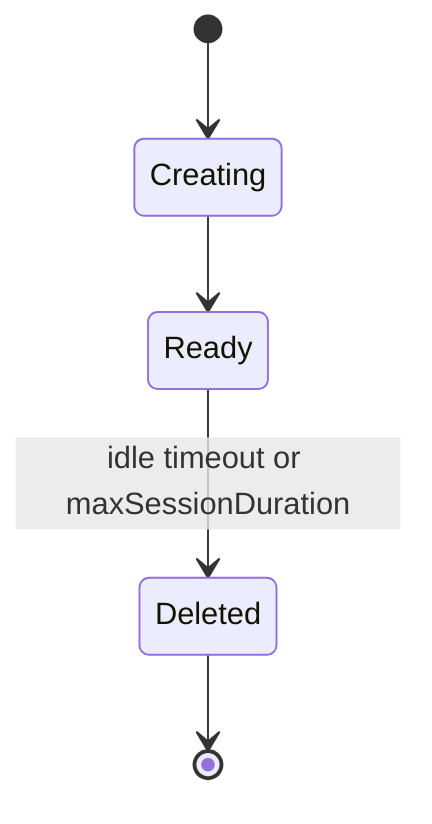
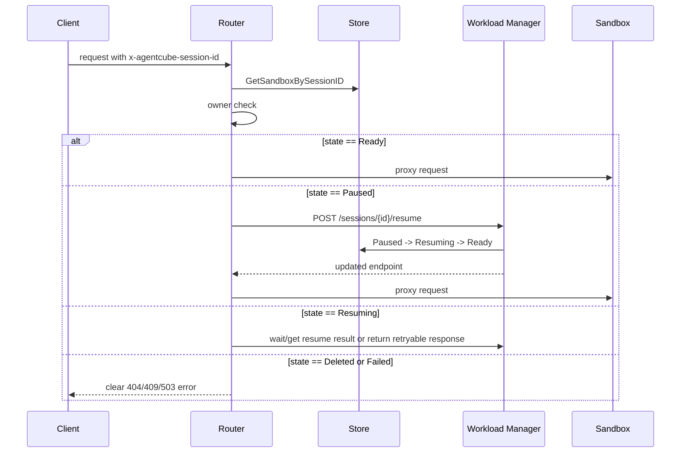
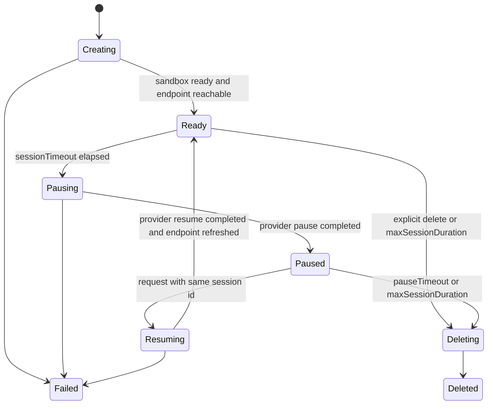

# Day 24: Sandbox Sleep/Resume 设计先行

日期：2026-06-23

## 背景问题

FAUST-BENCHOU 在 AgentCube v0.2.0 umbrella issue [#386](https://github.com/volcano-sh/agentcube/issues/386) 里提出了 Sandbox Sleep/Resume：

- idle 后 `Ready -> Paused`
- 下一次带 `x-agentcube-session-id` 的请求到来时 `Paused -> Ready`
- pause timeout 或 max TTL 后 `Paused -> Deleted`
- Workload Manager 负责 pause，Router 负责 resume-before-proxy，Store 记录 `Paused` 和 `PausedAt`

他又补充说，已经看到 `kubernetes-sigs/agent-sandbox` upstream 也在讨论 pause：

- [kubernetes-sigs/agent-sandbox#36](https://github.com/kubernetes-sigs/agent-sandbox/issues/36)
- [kubernetes-sigs/agent-sandbox#103](https://github.com/kubernetes-sigs/agent-sandbox/issues/103)

问题是：AgentCube 是否还需要自己做 Sleep/Resume，还是应该等待 agent-sandbox upstream 完成？

## 结论

AgentCube 应该先做设计，不应该等待 agent-sandbox upstream 全部定稿；但 AgentCube 也不应该重复实现底层 pause/runtime 机制。

更准确地说：

1. AgentCube 要定义的是“session lifecycle contract”：
   - 什么状态对 Router / SDK / Store 可见。
   - 什么时候 pause。
   - 什么时候 resume。
   - resume 后承诺保留什么。
   - owner / auth / delete / TTL 的语义是什么。

2. agent-sandbox 要提供的是“runtime capability”：
   - scale-to-zero / hard pause。
   - in-place resize / soft pause。
   - checkpoint / snapshot restore。
   - warm pool adoption。
   - NetworkPolicy / service / pod endpoint 的生命周期。

3. AgentCube 第一版应通过 provider capability 接入 agent-sandbox，不要把设计绑定死在某个未稳定的 agent-sandbox 字段上。

一句话：

```text
AgentCube should not wait to design Sleep/Resume,
but it should wait for or adapt to agent-sandbox for the low-level pause implementation.
```

## 上游 agent-sandbox 讨论结论

### agent-sandbox #36: Add pause field to Sandbox CRD

[#36](https://github.com/kubernetes-sigs/agent-sandbox/issues/36) 讨论的是给 Sandbox CRD 加 pause/resume 能力。

重要信息：

- 初始提案希望 `SandboxSpec` 有 `pause: true`。
- 讨论里把 state preservation 拆成三层：
  1. External volumes / PVC：必须保留。
  2. Container rootfs writable layer：最好保留。
  3. Runtime state / process / memory / OS state：可选，后续再做。
- 维护者 Janet Kuo 明确说明：phase 1 已经通过 `/scale` subresource 实现，scale Sandbox 到 0 等价于 pause。
- 当前 `agent-sandbox v0.4.6` 的 `SandboxSpec` 里仍有：
  - `spec.replicas`
  - 允许值 0 或 1
  - `+kubebuilder:subresource:scale`
- 这类 pause 的真实语义是：删除 Pod，保留 Sandbox 对象、PVC 和 service 等配置。

因此，#36 给 AgentCube 的启发是：

- AgentCube 可以把第一版 pause 定义成 hard pause / scale-to-zero。
- 第一版不应承诺进程、内存、GPU state 保留。
- 如果用户需要保留 `/workspace`，必须有明确的持久化存储约定；不能默认任何 Pod 内 filesystem 都能保留。

### agent-sandbox #103: soft pause for better latency

[#103](https://github.com/kubernetes-sigs/agent-sandbox/issues/103) 讨论的是 soft pause。

重要信息：

- 目标不是删除 Pod，而是使用 Kubernetes in-place pod resize 把 CPU/memory 降到最低。
- 请求到来时先处理 initial request，同时触发 in-place scale-up。
- 好处是比 scale-to-zero 更低延迟，因为 runtime 仍然存在。
- 维护者也在讨论是否扩展到 auto soft-pause。
- 这个方案依赖 Kubernetes `/resize` 能力，并且对 gVisor / Kata / hypervisor / guest OS memory reclaim 还有额外不确定性。
- issue 仍然是 open，label 是 `kind/feature` 和 `priority/important-longterm`。

因此，#103 给 AgentCube 的启发是：

- soft pause 是长期优化，不适合作为 AgentCube Sleep/Resume MVP 的硬依赖。
- AgentCube 可以在 capability matrix 中预留 `SoftPause`。
- 未来如果 runtime 支持 soft pause，AgentCube 的状态机和 Router resume-before-proxy 不需要重写，只需要替换 provider 的 `Pause/Resume` 实现。

### v0.5.0rc1 / v1beta1 的信号

Day18 已经验证过 `agent-sandbox v0.5.0rc1`：

- `v1alpha1` package 迁到 `v1beta1`。
- direct Sandbox 的 `spec.replicas` 改成 `spec.operatingMode`。
- `OperatingMode` 有 `Running` 和 `Suspended`。
- controller 中 `OperatingMode=Suspended` 会删除 Pod，并设置 `Suspended` condition。

这说明 agent-sandbox 的 API 正在从 `replicas=0/1` 迁移到更语义化的 `OperatingMode=Running/Suspended`。但 `v0.5.0rc1` 仍是 rc/pseudo-version，不应该混入 AgentCube #387 的 stable `v0.4.6` compatibility PR。

## Pause 模式分类

| 模式 | 底层动作 | 保留内容 | 释放资源 | 延迟 | AgentCube 是否应作为 MVP |
| --- | --- | --- | --- | --- | --- |
| Hard pause / scale-to-zero | 删除 Pod，保留 Sandbox/PVC/service | CR、PVC、部分 service/config；不保留进程和内存 | CPU/memory 基本释放 | 恢复需要重建 Pod | 是，适合作为第一版 |
| Soft pause / in-place resize | Pod 仍运行，降低 CPU/memory request/limit | 进程、内存、连接可能继续存在，但受 runtime 支持限制 | 释放部分资源 | 较低 | 否，作为后续 capability |
| Snapshot pause / checkpoint restore | checkpoint process/rootfs/memory，再 restore | 视 checkpoint 能力而定，可保留进程树/内存/rootfs | 可释放 Pod 资源 | 理想上低于 cold start | 否，和 SnapStart / checkpoint 方向关联 |

## AgentCube 当前实现状态

当前 AgentCube 的真实生命周期仍然是 create/delete：



相关代码：

- `pkg/common/types/sandbox.go`
  - `SandboxInfo` 已有 `SessionID`、`OwnerID`、`CreatedAt`、`ExpiresAt`、`IdleTimeout`、`LastActivityAt`、`Status`。
  - 但 `Status` 目前只是字符串，没有完整状态机约束。
- `pkg/workloadmanager/garbage_collection.go`
  - `ListInactiveSandboxes` + per-sandbox `IdleTimeout` 后直接 delete。
  - `ListExpiredSandboxes` 到期后直接 delete。
- `pkg/router/session_manager.go`
  - 有 session id 时直接从 Store 读 sandbox。
  - 没有 resume 逻辑。
- `pkg/router/handlers.go`
  - proxy 前后更新 last activity。
  - 已有 owner check。
  - preflight 不通时返回 sandbox unreachable / timeout，不会尝试 resume。
- `pkg/store/store_redis.go`
  - 通过 `session:{id}` 保存 JSON。
  - 通过 `session:expiry` 和 `session:last_activity` 两个 sorted set 做 TTL 和 idle 索引。
  - 没有 state index，也没有 pause timeout index。

## 设计目标

Sleep/Resume 设计要解决的是 AgentCube 层的用户体验和控制面语义：

1. 用户继续使用同一个 `x-agentcube-session-id`。
2. idle 后 sandbox 不再占用主要 runtime 资源。
3. 下一次请求可以恢复同一个 session。
4. pause timeout 或 max session duration 后最终清理。
5. Router / SDK / Store / WorkloadManager 对状态有一致理解。
6. 底层 runtime 能力可替换，不要求所有 runtime 都支持同一种 pause。

非目标：

- 第一版不实现进程内存 checkpoint。
- 第一版不承诺 GPU memory state。
- 第一版不要求 soft pause。
- 第一版不把 agent-sandbox rc/v1beta1 强行混进 stable compatibility PR。
- 第一版不解决完整 MultiAgentRuntime group lifecycle。

## 第一版语义建议

### Session 状态

建议把 AgentCube Store 中的 session 状态扩展为：

```text
Creating
Ready
Pausing
Paused
Resuming
Deleting
Deleted
Failed
```

状态机：


### 保留语义

第一版只承诺：

- `SessionID` 保留。
- Store 中的 owner 和 session metadata 保留。
- 如果 runtime provider 能保留 persistent workspace，则 workspace 保留。
- 不承诺 container memory、running process、open socket、GPU state 保留。

这点必须写清楚，否则用户会误以为 `resume` 是完整内存恢复。

更准确的用户承诺可以是：

```text
Sleep/Resume preserves the AgentCube session identity and provider-backed persistent workspace.
It does not guarantee process, memory, socket, or GPU state preservation unless the selected runtime provider explicitly supports it.
```

### Timeout 语义

建议区分四个概念：

| 字段 / 概念 | 作用 | 当前状态 | Sleep/Resume 后语义 |
| --- | --- | --- | --- |
| `sessionTimeout` | idle 多久触发处理 | 当前 idle 后 delete | Ready idle 后 pause |
| `pauseTimeout` | Paused 后最多保留多久 | 当前不存在 | Paused 超时后 delete |
| `maxSessionDuration` | session 绝对最长寿命 | 当前到期 delete | 任何非 Deleted 状态到期都 delete |
| SDK `ttl` | SDK 侧用户传入生命周期参数 | #394 反映当前未被 WorkloadManager 消费 | 要么映射到 maxSessionDuration，要么废弃；不能继续 silently ignored |

第一版建议新增 `pauseTimeout`，不要复用 `sessionTimeout`，否则语义会混乱：

```yaml
spec:
  sessionTimeout: 15m       # Ready -> Paused
  pauseTimeout: 10m         # Paused -> Deleted
  maxSessionDuration: 8h    # Any active state -> Deleted
```

如果为了最小 API 改动暂时不新增 CRD 字段，也要在设计里声明默认策略：

```text
pauseTimeout defaults to sessionTimeout unless explicitly configured later.
```

但从长期 API 清晰度看，单独字段更好。

## RuntimeProvider capability 设计

AgentCube 不应该直接在业务逻辑里写死 `replicas=0`、`operatingMode=Suspended`、或未来 `/resize`。这些应被 provider 抽象屏蔽。

设计草图：

```go
type PauseMode string

const (
    PauseModeHard     PauseMode = "Hard"
    PauseModeSoft     PauseMode = "Soft"
    PauseModeSnapshot PauseMode = "Snapshot"
)

type RuntimeCapabilities struct {
    HardPause       bool
    SoftPause       bool
    SnapshotPause   bool
    WarmPool        bool
    AdoptedSandbox  bool
    ManagedNetwork  bool
}

type SandboxHandle struct {
    Provider          string
    Namespace         string
    SandboxName       string
    SandboxClaimName  string
    PodName           string
    ServiceName       string
    EntryPoints       []types.SandboxEntryPoint
}

type RuntimeProvider interface {
    Capabilities(ctx context.Context) RuntimeCapabilities
    Pause(ctx context.Context, handle SandboxHandle, mode PauseMode) (*SandboxHandle, error)
    Resume(ctx context.Context, handle SandboxHandle) (*SandboxHandle, error)
    Delete(ctx context.Context, handle SandboxHandle) error
    Resolve(ctx context.Context, info *types.SandboxInfo) (*SandboxHandle, error)
}
```

`agent-sandbox v0.4.6` provider：

- hard pause = patch `Sandbox.spec.replicas=0` for direct Sandbox。
- resume = patch `Sandbox.spec.replicas=1` and wait Ready/endpoint。
- warm-pool-backed `SandboxClaim` 需要谨慎：
  - claim adoption path 当前由 agent-sandbox 管。
  - pause 已绑定 session 的 adopted Sandbox 时，应该 pause adopted Sandbox 还是 delete claim，需要实际验证。
  - MVP 可以先只支持 direct Sandbox，或把 warm-pool resume 作为单独测试项。

`agent-sandbox v0.5/v1beta1` provider：

- hard pause = patch `Sandbox.spec.operatingMode=Suspended`。
- resume = patch `Sandbox.spec.operatingMode=Running`。
- 等待 `Ready=True` 且 `Suspended` condition 消失或变为 False。

future provider：

- soft pause = provider 内部用 `/resize` 或 runtime-specific 机制。
- snapshot pause = provider 内部用 checkpoint / restore / SnapStart。

## Store 设计

建议扩展 `SandboxInfo`：

```go
type SandboxInfo struct {
    // existing fields...
    Status string `json:"status"`

    RuntimeProvider string `json:"runtimeProvider,omitempty"`
    PauseMode string `json:"pauseMode,omitempty"`
    PausedAt *time.Time `json:"pausedAt,omitempty"`
    PauseExpiresAt *time.Time `json:"pauseExpiresAt,omitempty"`
    ResumedAt *time.Time `json:"resumedAt,omitempty"`
    FailureReason string `json:"failureReason,omitempty"`

    SandboxName string `json:"sandboxName,omitempty"`
    SandboxClaimName string `json:"sandboxClaimName,omitempty"`
    PodName string `json:"podName,omitempty"`
    EndpointRevision int64 `json:"endpointRevision,omitempty"`
}
```

Store 需要新增能力：

- `UpdateSandboxStatus(sessionID, expectedState, nextState, timestamps)`，最好支持 CAS，避免并发 resume。
- `ListPauseCandidates(before, limit)`：Ready 且 last activity 超过 sessionTimeout。
- `ListPauseExpired(before, limit)`：Paused 且 pauseExpiresAt 到期。
- `ListExpiredSandboxes(before, limit)` 保持处理 maxSessionDuration。
- 后续补 state index：`session:state:{state}`，避免只靠扫描。

MVP 可以先用现有 sorted set + JSON status filter，但要在设计里承认：

- 数据量大时会有效率问题。
- #331 的 session list/get 也会遇到类似 index 问题。
- 长期要给 state/owner/kind/namespace 建索引。

## Workload Manager 设计

Workload Manager 需要新增两个内部动作：

1. Pause
   - GC 找到 idle `Ready` session。
   - CAS `Ready -> Pausing`。
   - 调用 provider `Pause`。
   - 成功后更新 `Paused`、`PausedAt`、`PauseExpiresAt`，清空或标记旧 entrypoint。
   - 失败后进入 `Failed` 或回滚 `Ready`，取决于错误类型。

2. Resume
   - Router 请求 WorkloadManager 恢复 session。
   - CAS `Paused -> Resuming`。
   - 调用 provider `Resume`。
   - 等待 Ready 和 entrypoint reachable。
   - 更新 Store entrypoint、`Ready`、`ResumedAt`。

建议新增内部 API：

```text
POST /v1/sessions/{sessionId}/resume
POST /v1/sessions/{sessionId}/pause
```

是否公开给 SDK 可以后置。第一版 Router 内部调用即可。

## Router 设计

Router 当前有 session id 时直接读 Store，然后 proxy。

Sleep/Resume 后应改成：



并发问题：

- 多个请求同时打到 Paused session 时，只允许一个 resume。
- 其他请求等待同一个 resume 结果，或者返回 `409 Resuming` + retry-after。
- 更推荐 WorkloadManager 侧做 idempotent resume，这样 Router 实现更简单。

## GC 设计

当前 GC 合并 inactive 和 expired 后统一 delete。

Sleep/Resume 后应分成三类：

```text
Ready idle beyond sessionTimeout -> pause
Paused beyond pauseTimeout -> delete
Any state beyond maxSessionDuration -> delete
```

伪代码：

```go
func (gc *garbageCollector) once() {
    now := time.Now()

    readyIdle := store.ListPauseCandidates(now, limit)
    for _, s := range readyIdle {
        pauseSession(s)
    }

    pauseExpired := store.ListPauseExpired(now, limit)
    for _, s := range pauseExpired {
        deleteSession(s)
    }

    maxExpired := store.ListExpiredSandboxes(now, limit)
    for _, s := range maxExpired {
        deleteSession(s)
    }
}
```

注意：

- `Paused` session 不应再被 Router 的 preflight 当成 sandbox unreachable。
- `LastActivityAt` 在 resume 请求到来时应更新，但更新时间点要小心：如果 resume 失败，不应让 session 永久避开 GC。
- 显式 delete 应该可以删除 `Ready`、`Paused`、`Failed`、`Resuming` 中可安全终止的状态。

## SDK / API 语义

需要和 #394 / #395 一起考虑：

- #394：Python SDK 的 `ttl` 参数被发送但 WorkloadManager 不消费。
- #395：Python `AgentRuntimeClient` 可以创建 session，但不能 delete。

Sleep/Resume 设计不能只改后台 GC，否则用户层会继续困惑。

建议：

- SDK 提供 `close()` / `delete()`，映射到 WorkloadManager delete session。
- SDK 不直接承诺 pause/resume API；默认由 idle policy 自动触发。
- 如果暴露手动 pause/resume，应该是高级 API：
  - `pause(session_id)`
  - `resume(session_id)`
  - 返回明确状态。
- `ttl` 要么映射到 `maxSessionDuration`，要么从 SDK 删除/标记 deprecated。

## Warm Pool 与 Sleep/Resume 的关系

Warm pool 和 Sleep/Resume 不是同一个问题。

- Warm pool 优化新 session 创建。
- Sleep/Resume 优化已有 session idle 后再访问。

对 CodeInterpreter 来说有两个路径：

1. 新 session：
   - `SandboxWarmPool -> SandboxClaim -> adopted Sandbox -> Ready`
2. 已有 session pause/resume：
   - 应恢复同一个 session 对应的 runtime handle。

难点：

- #387 适配后，warm pool path 的 store `Kind` 仍保存为 `SandboxClaimsKind`，但真正 Ready 的 runtime 是 adopted Sandbox。
- 如果 pause 删除 SandboxClaim，可能丢失 session 和 adopted Sandbox 关系。
- 如果 pause adopted Sandbox，需要 Store 记录 adopted Sandbox name。
- v0.5 `SandboxClaim` 的 `TemplateRef` 变成 required `WarmPoolRef`，语义还会再变。

建议 MVP：

- 先把 Sleep/Resume 设计覆盖 direct Sandbox。
- Warm-pool-backed CodeInterpreter 作为必须验证项，但不在没有实测前承诺。
- 如果社区要求 CodeInterpreter first，则必须先补 Store 中 adopted Sandbox handle 的清晰字段。

## NetworkPolicy / Auth 影响

Sleep/Resume 会改变 endpoint 生命周期：

- pause 后旧 Pod IP 可能失效。
- resume 后 Pod IP 可能变化。
- Router 不能缓存旧 endpoint。
- Store 必须更新 `EntryPoints` 和 `EndpointRevision`。

Auth/RLAC：

- #367 已合入 owner identity。
- Router resume 前必须做 owner check。
- WorkloadManager resume/delete 也要验证 owner。
- Admin bypass 逻辑应和现有 Router owner check 一致。

NetworkPolicy：

- #387 当前为了保持连通性关闭 agent-sandbox managed NetworkPolicy。
- 长期 Sleep/Resume 要配套 Router -> sandbox、WorkloadManager -> sandbox init/probe 的 allow policy。
- 否则 resume 成功但 Router 无法连通，会表现成假失败。

## 测试设计

### Unit tests

Store：

- `Ready -> Pausing -> Paused` 状态更新。
- CAS 失败时不覆盖状态。
- `PauseExpiresAt` index。
- `ListPauseCandidates` 只返回 Ready。
- `ListPauseExpired` 只返回 Paused。
- delete 清理 session key、expiry、last activity、state/pause index。

WorkloadManager：

- idle Ready session 调用 provider Pause。
- pause provider 失败时状态可诊断。
- Paused session resume 成功后更新 entrypoint。
- resume 并发只执行一次。
- maxSessionDuration 对 Ready/Paused/Resuming 都会 delete。

Router：

- Ready session 直接 proxy。
- Paused session 调 WorkloadManager resume 后 proxy。
- owner mismatch 不触发 resume。
- resume failure 返回明确错误。
- Resuming 状态下行为一致。

### E2E tests

Direct CodeInterpreter：

1. 创建 session。
2. 写 `/workspace` 文件。
3. 等待 sessionTimeout 触发 pause。
4. 确认 Pod 被释放或进入 suspended。
5. 用同一个 session id 请求。
6. 确认 resume 后文件仍存在。
7. 确认 session id 不变。
8. delete 后确认 Pod/Sandbox/Store 无残留。

Warm pool CodeInterpreter：

- 同 direct，但额外检查 claim/adopted Sandbox handle 是否稳定。
- 如果当前版本不支持，测试应标记为 skipped with reason，不要假装支持。

AgentRuntime：

- 创建 agent session。
- pause/resume 后 Router path 仍可达。
- 如果没有 PVC/workspace，测试只验证 session metadata 和 endpoint refresh，不验证文件保留。

math-agent LLM e2e：

- 第一轮 tool call 写入 workspace 或产生中间文件。
- idle pause。
- 第二轮复用同一 session 继续执行。
- 验证不是新建 session。

### Benchmark

必须区分：

| Case | 指标 |
| --- | --- |
| cold create | no image cache, no warm pool |
| warm create | image cached, no warm pool |
| warm pool hit | SandboxClaim adoption |
| hard pause resume | Paused -> Ready -> first command |
| soft pause resume | Folded -> Unfolded -> first command |
| snapshot restore | Restore -> first command |

记录：

- p50 / p95 / p99
- success rate
- cleanup residue
- Pod IP 是否变化
- workspace 是否保留
- auth 是否仍有效

## 是否需要等 agent-sandbox upstream

不需要等的部分：

- AgentCube session 状态机设计。
- Store 字段和索引设计。
- Router resume-before-proxy 语义。
- WorkloadManager pause/resume API contract。
- SDK `ttl/delete` 语义澄清。
- benchmark schema。
- fake provider tests。

应该等待或跟随 agent-sandbox 的部分：

- `replicas=0/1` 还是 `OperatingMode=Running/Suspended` 的最终 API。
- soft pause / in-place resize 是否可用。
- snapshot/checkpoint 是否成为通用 runtime capability。
- warm pool claim 在 paused session 下的推荐语义。

因此工作顺序应是：

```text
Design AgentCube lifecycle contract now
  -> implement fake provider / unit state machine spike
  -> bind to agent-sandbox v0.4.6 hard pause only if maintainers accept MVP
  -> later switch provider to v0.5/v1beta1 OperatingMode
  -> later add soft/snapshot pause capabilities
```

## 和 #387 的关系

#387 是 Sleep/Resume 的基础，不是 Sleep/Resume 本身。

#387 解决：

- AgentCube 对 current stable `agent-sandbox v0.4.6` 的兼容。
- warm pool claim adoption 语义变化。
- public annotation。
- NetworkPolicy management opt-out。
- codegen / dependency stack。

Sleep/Resume 后续要在 #387 之后处理：

- Store session state。
- Router resume-before-proxy。
- GC split。
- provider pause/resume。
- pauseTimeout。
- tests/benchmark。

不要把 Sleep/Resume 加进 #387，否则 PR 范围会失控。

## 后续建议

1. 先把这份设计整理成英文 proposal 草稿，但暂时不发。
2. 本地开一个 spike 分支，只做 fake provider + Store 状态机 unit test，不碰真实 agent-sandbox。
3. 如果 fake provider 设计顺畅，再考虑 direct Sandbox 的 `replicas=0/1` hard pause MVP。
4. 等 #387 合并后，再从最新 upstream/main 创建干净 Sleep/Resume proposal/implementation 分支。
5. 如果 FAUST-BENCHOU 准备负责实现，我们更适合提供设计 review、test plan 和 benchmark，而不是抢同一个 implementation。

## 本地 spike 验收口径

本轮 spike 不追求完整功能，不接真实 `agent-sandbox`，只验证 AgentCube 层面的边界是否合理：

1. 状态枚举是否能表达 `Ready -> Pausing -> Paused -> Resuming -> Ready`。
2. `RuntimeProvider` 是否能把底层 pause/resume 机制从 GC / Router / Store 中隔离出去。
3. GC 是否能从“idle 后 delete”重构成“idle 后 pause，paused 超时后 delete”的控制流。
4. Store 是否需要 CAS；如果没有 CAS，多并发 resume 会不会重复调用 provider。
5. Router resume-before-proxy 是否能只依赖 Store 状态和 WorkloadManager API，而不直接理解 `replicas` / `OperatingMode`。

最小测试目标：

| 层级 | 测试内容 | 通过标准 |
| --- | --- | --- |
| lifecycle helper | 合法状态迁移 | 非法迁移返回明确错误 |
| fake provider | pause/resume 调用次数和 handle 更新 | 同一个 session 的 entrypoint 可以在 resume 后刷新 |
| GC helper | idle Ready 进入 pause，Paused 超时进入 delete，maxSessionDuration 直接 delete | 三类候选互不混淆 |
|并发语义 | 两个 resume 请求同时到来 | 只能有一个成功从 `Paused` 抢到 `Resuming` |

本轮 spike 不做：

- 不改 CRD。
- 不改 Redis / Valkey 存储。
- 不改 Router 真实 handler。
- 不更新 `agent-sandbox` 依赖。
- 不创建 upstream PR。

如果 spike 发现 Store CAS 是硬需求，后续正式实现要优先补 Store 接口，而不是先改 Router 或 GC。

## 本地 spike 结果

日期：2026-06-23

隔离 worktree：

```text
/home/agentcube-sleep-resume-spike
branch: spike/sleep-resume-state-machine
base: upstream/main bed6bd4
```

新增实验包：

```text
pkg/sessionlifecycle/lifecycle.go
pkg/sessionlifecycle/lifecycle_test.go
```

这个包只作为本地 spike，不准备直接进入 upstream PR。它做了以下最小验证：

- `State` 枚举：`Creating`、`Ready`、`Pausing`、`Paused`、`Resuming`、`Deleting`、`Deleted`、`Failed`。
- `CanTransition(from, to)`：验证合法/非法状态迁移。
- `RuntimeProvider` 接口：`Capabilities`、`Resolve`、`Pause`、`Resume`、`Delete`。
- `Controller.PauseSession`：
  - Store CAS `Ready -> Pausing`。
  - provider `Resolve`。
  - provider `Pause`。
  - Store CAS `Pausing -> Paused`。
  - 设置 `PausedAt` / `PauseExpiresAt`，清空旧 entrypoint。
- `Controller.ResumeSession`：
  - Store CAS `Paused -> Resuming`。
  - provider `Resume`。
  - Store CAS `Resuming -> Ready`。
  - 刷新 entrypoint、`LastActivityAt`、`ResumedAt`。
- `GCActionForSession`：
  - `Ready` idle 超时 -> `Pause`。
  - `Paused` 超过 `PauseExpiresAt` -> `Delete`。
  - `ExpiresAt` 超时 -> `Delete`，并覆盖 Ready/Paused 状态。

测试命令：

```bash
go test ./pkg/sessionlifecycle -count=1
go test -race ./pkg/sessionlifecycle -count=1
go test ./pkg/sessionlifecycle -run TestResumeSession_ConcurrentResumeUsesStoreCAS -race -count=20
git diff --check
```

结果：

```text
PASS
```

关键发现：

1. `RuntimeProvider` 边界是可行的。GC / Router / Store 不需要知道 `agent-sandbox v0.4.x` 的 `replicas=0/1` 或 `v0.5/v1beta1` 的 `OperatingMode=Suspended/Running`。
2. Store CAS 不是优化项，而是正确性要求。并发 resume 测试中，只有 CAS 能保证两个请求同时打到 Paused session 时，provider `Resume` 只被调用一次。
3. pause 后必须清空或标记旧 entrypoint；resume 成功后必须刷新 entrypoint。否则 Router 可能继续代理到已经失效的 Pod IP。
4. provider 失败时需要把 session 标成 `Failed` 并记录 `FailureReason`，否则用户只会看到超时，维护者也难以定位是 Store、Provider 还是 endpoint readiness 失败。
5. `maxSessionDuration` 应该优先于 pause/resume 状态；无论 Ready 还是 Paused，到达绝对 TTL 都应 delete。

环境卡点：

```text
失败命令：
make fmt

错误现象：
make: go: Command not found
go fmt ./...
bash: go: command not found

原因：
Codex shell 的默认 PATH 没有 Go 命令，之前只能通过
/root/go/pkg/mod/golang.org/toolchain@v0.0.1-go1.26.4.linux-amd64/bin
显式使用 Go 1.26.4。

解决：
已把 Go 1.26.4 toolchain 安装到 /usr/local/go1.26.4，
并将 /usr/local/bin/go 和 /usr/local/bin/gofmt 链接到该 toolchain。
现在 plain `go version` 输出 `go version go1.26.4 linux/amd64`，
plain `make fmt` 可直接运行。
```

对正式实现的影响：

- 第一阶段应先补 Store CAS / 状态字段 / pause indexes，再接 Router 和真实 provider。
- WorkloadManager resume API 应该做成 idempotent 或至少 CAS-safe。
- Router 不应自己实现底层 resume；它应该调用 WorkloadManager resume，再拿刷新后的 sandbox info proxy。
- 正式 PR 的测试不能只跑 e2e；必须包含并发 resume、provider 失败、entrypoint refresh、max TTL 覆盖这些单元测试。

## 英文 proposal 草稿

> 说明：这是本地草稿，暂不发布到 upstream。真正发布前还需要重新确认 #386、agent-sandbox #36/#103 和 #387 的最新状态，并由用户确认全文。

```md
---
title: AgentCube Sandbox Sleep/Resume Lifecycle
authors:
  - "@ranxi2001"
reviewers:
  - TBD
approvers:
  - TBD
creation-date: 2026-06-23
---

# AgentCube Sandbox Sleep/Resume Lifecycle

## Motivation

AgentCube documents a smart sleep/resume lifecycle, but the current implementation still behaves as a create/delete lifecycle: an idle session is eventually garbage-collected, and the next request needs a new sandbox/session path.

For intermittent agent workloads, this is not ideal. Users expect the same `x-agentcube-session-id` to remain meaningful across short idle periods, and they expect provider-backed workspace state to survive when the runtime supports it. At the same time, keeping every sandbox fully running wastes cluster CPU and memory.

The goal of this proposal is to define the AgentCube-level session lifecycle contract first, while leaving the low-level pause mechanism to the runtime provider, especially `kubernetes-sigs/agent-sandbox`.

## Related Work

- AgentCube umbrella issue: volcano-sh/agentcube#386
- agent-sandbox hard pause / scale subresource: kubernetes-sigs/agent-sandbox#36
- agent-sandbox soft pause / in-place resize: kubernetes-sigs/agent-sandbox#103
- AgentCube agent-sandbox compatibility foundation: volcano-sh/agentcube#387

My reading is:

- agent-sandbox #36 gives a practical hard-pause mechanism: scale the Sandbox to 0, delete the Pod, and preserve Sandbox/PVC/service-level configuration.
- agent-sandbox #103 is a lower-latency soft-pause direction, but it is longer-term and runtime-dependent.
- AgentCube should not duplicate low-level pause mechanisms, but it should define how session state, routing, garbage collection, SDK semantics, and tests work.

## Goals

- Define explicit AgentCube session states for sleep/resume.
- Change idle handling from `Ready -> Deleted` to `Ready -> Paused`.
- Resume a paused session before proxying a request with `x-agentcube-session-id`.
- Separate `sessionTimeout`, `pauseTimeout`, and `maxSessionDuration`.
- Keep runtime pause/resume behind a provider capability interface.
- Make preservation semantics explicit and testable.

## Non-Goals

- Do not implement process/memory/GPU checkpointing in the first version.
- Do not require soft pause or Kubernetes in-place Pod resize for the MVP.
- Do not depend on an agent-sandbox rc API for the first stable implementation.
- Do not merge Sleep/Resume into the agent-sandbox v0.4.x compatibility PR.
- Do not promise that ephemeral container filesystem state survives hard pause unless the selected runtime provider uses persistent workspace storage.

## Proposed State Machine



The visible Store states should be:

- `Creating`
- `Ready`
- `Pausing`
- `Paused`
- `Resuming`
- `Deleting`
- `Deleted`
- `Failed`

## Preservation Semantics

The MVP should promise:

- Session identity is preserved.
- Owner/session metadata is preserved.
- Provider-backed persistent workspace is preserved when configured and supported.

The MVP should not promise:

- Process state preservation.
- Memory state preservation.
- Open socket preservation.
- GPU memory preservation.
- Ephemeral container writable-layer preservation unless the provider explicitly supports it.

Suggested user-facing wording:

> Sleep/Resume preserves the AgentCube session identity and provider-backed persistent workspace. It does not guarantee process, memory, socket, or GPU state preservation unless the selected runtime provider explicitly supports it.

## Timeout Semantics

| Field | Meaning |
| --- | --- |
| `sessionTimeout` | Idle time before `Ready -> Paused` |
| `pauseTimeout` | Time a paused session may stay before `Paused -> Deleted` |
| `maxSessionDuration` | Absolute maximum lifetime for any non-deleted session |
| SDK `ttl` | Should map to `maxSessionDuration` or be deprecated; it should not remain silently ignored |

Example:

```yaml
spec:
  sessionTimeout: 15m
  pauseTimeout: 10m
  maxSessionDuration: 8h
```

## Runtime Provider Capability

AgentCube should not hard-code `spec.replicas=0`, `spec.operatingMode=Suspended`, or a future resize/checkpoint API in Router or GC logic. These should be provider capabilities.

```go
type RuntimeCapabilities struct {
    HardPause      bool
    SoftPause      bool
    SnapshotPause  bool
    WarmPool       bool
    AdoptedSandbox bool
    ManagedNetwork bool
}

type RuntimeProvider interface {
    Capabilities(ctx context.Context) RuntimeCapabilities
    Pause(ctx context.Context, handle SandboxHandle, mode PauseMode) (*SandboxHandle, error)
    Resume(ctx context.Context, handle SandboxHandle) (*SandboxHandle, error)
    Delete(ctx context.Context, handle SandboxHandle) error
    Resolve(ctx context.Context, info *types.SandboxInfo) (*SandboxHandle, error)
}
```

Possible provider mappings:

- agent-sandbox v0.4.x: hard pause via `Sandbox.spec.replicas=0/1`.
- agent-sandbox v0.5/v1beta1: hard pause via `Sandbox.spec.operatingMode=Suspended/Running`.
- future: soft pause via in-place Pod resize.
- future: snapshot pause via checkpoint/restore or SnapStart-like provider support.

## Component Changes

### Store

- Add explicit session lifecycle fields such as `PausedAt`, `PauseExpiresAt`, `ResumedAt`, `RuntimeProvider`, `PauseMode`, `FailureReason`, and runtime handle fields.
- Add CAS-style state update, for example `UpdateSandboxStatus(sessionID, expectedState, nextState, ...)`.
- Add pause indexes:
  - `ListPauseCandidates(before, limit)` for idle `Ready` sessions.
  - `ListPauseExpired(before, limit)` for expired `Paused` sessions.
- Keep `ListExpiredSandboxes` for `maxSessionDuration`.

### Workload Manager

- Add pause logic used by GC:
  - CAS `Ready -> Pausing`.
  - Call provider `Pause`.
  - Store `Paused`, `PausedAt`, and `PauseExpiresAt`.
- Add resume logic used by Router:
  - CAS `Paused -> Resuming`.
  - Call provider `Resume`.
  - Wait for Ready and endpoint reachability.
  - Store refreshed entrypoints and `Ready`.
- Make resume idempotent or concurrency-safe.

### Router

- Keep owner check before resume.
- If session state is `Ready`, proxy as today.
- If session state is `Paused`, ask Workload Manager to resume before proxying.
- If session state is `Resuming`, either wait for the same resume operation or return a retryable response.
- If session state is `Deleted` or `Failed`, return a clear error.

### Garbage Collection

Replace one combined delete path with three decisions:

- `Ready` idle beyond `sessionTimeout` -> pause.
- `Paused` beyond `pauseTimeout` -> delete.
- Any non-deleted session beyond `maxSessionDuration` -> delete.

### SDK / API

- Clarify whether SDK `ttl` maps to `maxSessionDuration`.
- Add or document `close()` / `delete()` behavior for explicit cleanup.
- Keep manual `pause()` / `resume()` optional for advanced users; automatic idle policy should be the default.

## Testing Plan

Unit tests:

- Store state transition and CAS behavior.
- Pause candidate and pause-expired indexes.
- Workload Manager pause success/failure paths with a fake provider.
- Workload Manager resume success/failure/concurrency paths with a fake provider.
- Router owner mismatch should not trigger resume.
- Router paused-session path should resume before proxying.
- GC should pause idle Ready sessions and delete expired Paused sessions.

E2E tests:

- Direct CodeInterpreter hard pause/resume.
- Persistent workspace file survives resume when configured.
- Session ID stays unchanged.
- Pod IP may change and entrypoints are refreshed.
- Explicit delete removes Sandbox/Pod/Store state.
- Warm-pool-backed CodeInterpreter is either tested explicitly or marked unsupported with a clear reason.
- math-agent LLM e2e verifies multi-turn reuse after idle pause.

Benchmark:

- Cold create latency.
- Warm create latency.
- Warm pool hit latency.
- Hard pause resume latency.
- Future soft pause resume latency.
- Future snapshot restore latency.

Each benchmark should record p50/p95/p99, success rate, cleanup residue, endpoint change, workspace preservation, and auth behavior.

## Open Questions

- Should the MVP support only direct Sandbox first, or must CodeInterpreter warm-pool sessions be included from day one?
- Should `pauseTimeout` be a new CRD field, or default to `sessionTimeout` until the API is expanded?
- What is the expected behavior when resume fails after the session has already moved to `Resuming`?
- Should Router wait for concurrent resume or return `409 Resuming` with `Retry-After`?
- How should `ttl` in the Python SDK be mapped or deprecated?
- What NetworkPolicy rules are required if agent-sandbox managed NetworkPolicy is enabled again?
```

## 可给 FAUST-BENCHOU 的简短英文回复草稿

```md
I think we should not block the AgentCube design on the final agent-sandbox implementation, but we also should not duplicate the low-level pause mechanism.

My reading of kubernetes-sigs/agent-sandbox#36 is that the first practical pause semantics is already "hard pause": scale the Sandbox to 0, delete the Pod, and preserve the Sandbox/PVC/service-level configuration. kubernetes-sigs/agent-sandbox#103 is more about "soft pause" via in-place Pod resize, which looks valuable but longer-term and runtime-dependent.

For AgentCube, I suggest we first define the session lifecycle contract:

- Store states: Ready / Pausing / Paused / Resuming / Deleted / Failed
- GC policy: sessionTimeout means Ready -> Paused, pauseTimeout means Paused -> Deleted, maxSessionDuration means any active state -> Deleted
- Router behavior: resume a Paused session before proxying when `x-agentcube-session-id` is present
- Clear preservation semantics: the MVP can preserve session identity and provider-backed persistent workspace, but should not promise process/memory/GPU state unless the runtime provider explicitly supports it

Then the low-level implementation can be a provider capability:

- agent-sandbox v0.4.x: `spec.replicas=0/1`
- agent-sandbox v0.5/v1beta1: `spec.operatingMode=Suspended/Running`
- future: soft pause or snapshot/checkpoint restore

So my preference is: continue with an AgentCube-level design first, keep it capability-based, and avoid depending on soft pause being ready in agent-sandbox for the MVP.
```

## 第一阶段实现记录：Store 状态和 CAS

日期：2026-06-23

隔离 worktree：

```text
/home/agentcube-sleep-resume-store-state
branch: feat/sleep-resume-store-state
base: upstream/main bed6bd4
```

实现范围：

- `pkg/common/types/sandbox.go`
  - 给 `SandboxInfo` 增加 Sleep/Resume 需要的 Store 字段：
    - `RuntimeProvider`
    - `PauseMode`
    - `PausedAt`
    - `PauseExpiresAt`
    - `ResumedAt`
    - `FailureReason`
    - `SandboxName`
    - `SandboxClaimName`
    - `PodName`
    - `EndpointRevision`
  - 增加公用状态常量：
    - `creating`
    - `ready`
    - `not-ready`
    - `pausing`
    - `paused`
    - `resuming`
    - `deleting`
    - `deleted`
    - `failed`

- `pkg/store/interface.go`
  - 新增 `UpdateSandboxStatusCAS(ctx, sandbox, expectedStatus)`。
  - 新增 `ListPauseExpiredSandboxes(ctx, before, limit)`。

- `pkg/store/error.go`
  - 新增 `ErrStatusConflict`，用于区分并发 CAS 失败和普通 not found。

- `pkg/store/store_redis.go`
  - 新增 `session:pause_expiry` index。
  - `StoreSandbox` / `UpdateSandbox` / `DeleteSandboxBySessionID` 维护 pause expiry index。
  - `UpdateSandboxStatusCAS` 用 Redis Lua 脚本原子检查当前 JSON 中的 `status` 是否等于 `expectedStatus`，匹配才写入新 JSON。
  - `ListPauseExpiredSandboxes` 只返回 `status == paused` 的过期 session，避免脏 index 误删 ready session。

- `pkg/store/store_valkey.go`
  - 实现与 Redis 相同的语义。
  - CAS 使用 `valkey.NewLuaScriptNoSha` 执行 Lua 脚本。

- 测试 fake store
  - `pkg/router/session_manager_test.go`
  - `pkg/workloadmanager/handlers_test.go`
  - `pkg/workloadmanager/garbage_collection_test.go`
  - 只补接口空实现，不改变测试语义。

- `pkg/workloadmanager/sandbox_helper.go`
  - 将局部字符串状态改为引用 `types.SandboxStatusCreating` / `types.SandboxStatusReady` / `types.SandboxStatusNotReady`，避免新增状态常量后继续散落裸字符串。

测试覆盖：

- Redis:
  - CAS 成功：`ready -> paused`。
  - CAS 冲突：当前状态不等于 expected 时返回 `ErrStatusConflict`。
  - CAS not found：session 不存在时返回 `ErrNotFound`。
  - 并发 CAS：两个 goroutine 同时从 `paused` 更新到 `resuming`，只有一个成功，另一个返回 `ErrStatusConflict`。
  - pause expiry index：只返回 `paused` 且 `PauseExpiresAt <= now` 的 session。
  - `UpdateSandbox` 从 paused 改回 ready 后清理 pause index。
  - delete 清理 pause index。

- Valkey:
  - 覆盖与 Redis 相同的场景，保证两个 backend 语义一致。

验证命令：

```bash
go test ./pkg/store -count=1
go test ./pkg/router ./pkg/workloadmanager -count=1
go test -race ./pkg/store -count=1
go test $(go list ./... | grep -v '/test/e2e') -count=1
make lint
make build-all
git diff --check
```

结果：

```text
PASS
```

过程卡点：

```text
命令：
make build-all

现象：
命令通过，但它内部执行 go mod tidy，导致 go.sum 删除了两行 golang.org/x/oauth2 v0.36.0 checksum。

判断：
这和 Store 状态/CAS 改动无关，属于 tidy 产生的无关依赖清理。

处理：
按最小修原则恢复 go.sum，避免第一阶段 PR 混入无关依赖文件变化。
```

当前未做：

- 未修改真实 GC 行为。
- 未增加 WorkloadManager pause/resume API。
- 未修改 Router resume-before-proxy。
- 未接入 `agent-sandbox` `replicas=0/1` 或 `OperatingMode`。
- 未新增 CRD 字段 `pauseTimeout`。

下一阶段建议：

1. 基于这个 Store CAS 能力，新增 WorkloadManager 内部 pause/resume service 层和 fake provider 测试。
2. 再让 GC 调用 pause service，而不是直接 delete idle Ready session。
3. 再让 Router 在看到 `paused` session 时调用 WorkloadManager resume。
4. 最后接真实 agent-sandbox hard pause e2e。

## 第二阶段实现记录：WorkloadManager lifecycle service

日期：2026-06-23

隔离 worktree：

```text
/home/agentcube-sleep-resume-store-state
branch: feat/sleep-resume-store-state
base: upstream/main bed6bd4
phase 1 commit: 3d0427a feat: add sandbox session state CAS store support
phase 2 commit: cb66c8a feat: add workload manager session lifecycle service
```

本阶段解决的问题：

第二阶段解决的是 Sleep/Resume 从设计和 Store 能力进入 WorkloadManager 执行层的问题。第一阶段已经让 Store 能记录状态、做 CAS、维护 pause expiry index，但还没有回答这些问题：

- 谁负责把 session 从 `ready` 安全推进到 `paused`？
- 谁负责把 session 从 `paused` 安全恢复到 `ready`？
- 底层 runtime pause/resume 失败时，AgentCube Store 里的 session 应该进入什么状态？
- 多个请求同时触发 resume 时，如何保证只有一个真实 resume 操作发生？
- pause 后旧的 sandbox entrypoint 是否还能继续使用？
- resume 后新的 entrypoint 如何刷新给后续 Router 使用？

本阶段给出的答案是：在 WorkloadManager 里先建立一个内部 `sessionLifecycleService`，用 Store CAS 保证状态迁移的并发正确性，用 `RuntimeProvider` 隔离底层 runtime 差异，用 fake provider 先把 AgentCube control-plane 语义测清楚。

它具体补齐了以下能力：

- `ready -> pausing -> paused`
- `paused -> resuming -> ready`
- provider pause/resume 失败时落到 `failed`，并记录 `FailureReason`
- 并发 resume 时只有一个请求能完成 CAS 并进入 provider，其他请求得到 `ErrSessionStateConflict`
- pause 后清空旧 `EntryPoints`，避免 Router 继续使用已经无效的 Pod endpoint
- resume 后写回 provider 返回的新 `EntryPoints`
- 每次 pause/resume 都递增 `EndpointRevision`，为后续 Router 判断 endpoint 是否刷新预留依据

因此，第二阶段不是完整产品功能，而是把 Sleep/Resume 的中间执行层补起来。它承接第一阶段 Store CAS，向后支撑第三阶段 GC split、Router resume-before-proxy 和真实 `agent-sandbox` hard pause provider。

实现范围：

- 新增 `pkg/workloadmanager/session_lifecycle.go`
  - 引入 WorkloadManager 内部 `sessionLifecycleService`，先不暴露 HTTP route。
  - 引入 `RuntimeProvider` 接口：
    - `Capabilities(ctx)`
    - `Pause(ctx, sandbox)`
    - `Resume(ctx, sandbox)`
  - 引入 capability 结构 `RuntimeCapabilities`，为后续 hard pause / soft pause / snapshot pause / warm pool / adopted Sandbox / managed NetworkPolicy 留接口边界。
  - 引入 pause mode 常量：
    - `hard`
    - `soft`
    - `snapshot`
  - 引入 `ErrSessionStateConflict`，把底层 Store CAS 冲突包装成 WorkloadManager 生命周期语义错误。

- `pauseSession(ctx, sessionID)` 的语义
  - 从 Store 读取当前 session。
  - 用 CAS 执行 `ready -> pausing`。
  - 调用 provider `Pause`。
  - 成功后写回 `paused`：
    - 设置 `PauseMode`
    - 设置 `PausedAt`
    - 根据 `pauseTimeout` 设置 `PauseExpiresAt`
    - 清空 `EntryPoints`
    - 递增 `EndpointRevision`
  - provider 失败时尝试把 session 从 `pausing` 标记为 `failed`，并写入 `FailureReason`。

- `resumeSession(ctx, sessionID)` 的语义
  - 从 Store 读取当前 session。
  - 用 CAS 执行 `paused -> resuming`。
  - 调用 provider `Resume`。
  - 成功后写回 `ready`：
    - 清空 `PausedAt` / `PauseExpiresAt`
    - 设置 `ResumedAt`
    - 刷新 `LastActivityAt`
    - 清空 `FailureReason`
    - 使用 provider 返回的新 `EntryPoints`
    - 递增 `EndpointRevision`
  - provider 失败时尝试把 session 从 `resuming` 标记为 `failed`，并写入 `FailureReason`。

设计边界：

- 第二阶段只做 WorkloadManager 内部 service 和 fake provider 测试。
- 不改真实 GC 行为。
- 不新增 Router resume-before-proxy。
- 不新增 HTTP API。
- 不接真实 `agent-sandbox` `replicas=0/1` 或 `OperatingMode=Suspended/Running`。
- 不新增 CRD `pauseTimeout` 字段。

为什么这样切：

- 第一阶段已经证明 Store CAS 是并发 resume 的硬需求。
- 第二阶段把 WorkloadManager 的状态机和 runtime provider 边界先固定住，避免第三阶段一上来就同时改 GC、Router、Kubernetes provider 和 e2e。
- fake provider 可以独立验证 AgentCube control-plane 语义：状态迁移、失败落库、entrypoint 刷新、CAS 冲突。

测试覆盖：

- 新增 `pkg/workloadmanager/session_lifecycle_test.go`
  - `TestSessionLifecycleServicePauseSession`
    - 验证 `ready -> pausing -> paused`。
    - 验证 `PauseMode` / `PausedAt` / `PauseExpiresAt`。
    - 验证 pause 后 `EntryPoints` 清空。
    - 验证 `EndpointRevision` 递增。
  - `TestSessionLifecycleServiceResumeSession`
    - 验证 `paused -> resuming -> ready`。
    - 验证 pause 时间字段清空。
    - 验证 `ResumedAt` / `LastActivityAt` 更新。
    - 验证 provider 返回的新 entrypoint 被写回。
    - 验证 `EndpointRevision` 递增。
  - `TestSessionLifecycleServicePauseProviderFailureMarksFailed`
    - provider pause 失败后 session 进入 `failed`。
    - `FailureReason` 不为空。
  - `TestSessionLifecycleServiceResumeProviderFailureMarksFailed`
    - provider resume 失败后 session 进入 `failed`。
    - `FailureReason` 不为空。
  - `TestSessionLifecycleServiceResumeConcurrentConflict`
    - 两个 goroutine 同时 resume 同一个 paused session。
    - 只有一个成功进入 provider。
    - 另一个收到 `ErrSessionStateConflict`。
  - `TestSessionLifecycleServiceRejectsWrongInitialState`
    - 对 `ready` session 调 resume 会返回 `ErrSessionStateConflict`，不会错误地调用 provider。

验证命令：

```bash
go test ./pkg/workloadmanager -run 'TestSessionLifecycleService' -count=1
go test ./pkg/store ./pkg/workloadmanager -count=1
go test -race ./pkg/workloadmanager -run 'TestSessionLifecycleService' -count=1
make lint
go test $(go list ./... | grep -v '/test/e2e') -count=1
make build-all
git diff --check
```

结果：

```text
PASS
```

过程卡点：

```text
命令：
make lint

现象：
golangci-lint / unparam 一开始认为 newSessionLifecycleService 的 pauseMode 参数恒为 hard，
并且 markFailed 返回的 sandbox 结果未被使用。

原因：
第二阶段还没有把 pause mode 暴露成配置或 API，测试里也只需要验证 hard pause MVP；
markFailed 的调用方只需要知道标记失败是否成功，不需要返回 sandbox。

处理：
去掉 constructor 的 pauseMode 参数，第二阶段固定为 PauseModeHard；
把 markFailed 改为只返回 error。
```

```text
命令：
make lint

现象：
新增 resume 失败测试后，unparam 认为 resumeSession 的 sessionID 参数总是 "session-1"。

原因：
测试数据都复用了同一个 session id，导致内部方法参数看起来像死参数。

处理：
给失败路径测试使用独立 session id，既更贴近真实调用，也证明 service 方法不是绑定固定 session。
```

```text
命令：
make build-all

现象：
命令通过，但内部 go mod tidy 再次删除 go.sum 里 golang.org/x/oauth2 v0.36.0 的两行 checksum。

判断：
这和第二阶段 WorkloadManager lifecycle service 无关，属于已有依赖文件 tidy 漂移。

处理：
按最小修原则恢复 go.sum；最终 phase 2 commit 只包含两个新增文件：
pkg/workloadmanager/session_lifecycle.go
pkg/workloadmanager/session_lifecycle_test.go
```

当前未做：

- 未让 `garbage_collection.go` 从 idle delete 改成 idle pause。
- 未新增 `pauseTimeout` 配置来源。
- 未让 Router 对 `paused` session 执行 resume-before-proxy。
- 未实现真实 agent-sandbox provider。
- 未验证 direct Sandbox hard pause/resume e2e。
- 未验证 math-agent 在 pause/resume 后继续使用同一 session。

下一阶段建议：

1. 第三阶段先做 GC split：`Ready` idle 后调用 pause service，`Paused` pause timeout 后 delete，`maxSessionDuration` 对所有 active 状态仍然 delete。
2. 再做 Router resume-before-proxy，并明确 owner/auth 检查必须发生在 resume 前。
3. 再接真实 agent-sandbox hard pause provider：
   - `v0.4.6`: `spec.replicas=0/1`
   - `v0.5.x`: `spec.operatingMode=Suspended/Running`
4. 最后补 direct CodeInterpreter e2e、warm-pool 支持边界、math-agent LLM e2e 和 cleanup 残留检查。

## 第三阶段设计推进：Router / GC 行为表

日期：2026-06-24

本阶段先不写第三阶段代码，而是基于当前 `main` 源码重新检查 Router、Store、WorkloadManager 的真实链路，明确下一步代码应该改在哪里、先测什么、哪些能力不能提前承诺。

这次重读的上游和本地上下文包括：

- AgentCube v0.2 umbrella issue [#386](https://github.com/volcano-sh/agentcube/issues/386)
- agent-sandbox pause field 讨论 [kubernetes-sigs/agent-sandbox#36](https://github.com/kubernetes-sigs/agent-sandbox/issues/36)
- agent-sandbox soft pause 讨论 [kubernetes-sigs/agent-sandbox#103](https://github.com/kubernetes-sigs/agent-sandbox/issues/103)
- `pkg/router/handlers.go`
- `pkg/router/session_manager.go`
- `pkg/workloadmanager/handlers.go`
- `pkg/workloadmanager/garbage_collection.go`
- `pkg/workloadmanager/sandbox_helper.go`
- `pkg/store/interface.go`
- `pkg/common/types/sandbox.go`

### 上游上下文更新

agent-sandbox #36 的当前有效信号是：

- phase 1 pause 已经被维护者描述为 `/scale` subresource。
- `Sandbox` scale 到 0 等价于 pause。
- 这个 pause 的语义是删除 Pod，保留 Sandbox/PVC/service 等对象。
- 它不是内存级、进程级、GPU state 级恢复。

agent-sandbox #103 的当前有效信号是：

- soft pause 仍是 long-term feature。
- 方向是 in-place pod resize，而不是删除 Pod。
- 对 gVisor、Kata、hypervisor、guest OS memory reclaim 仍有不确定性。
- 维护者把它和 #36 的 suspend/resume 行为一起讨论，但还没有形成可以被 AgentCube 直接依赖的稳定实现。

因此，AgentCube 第三阶段不应该等待 soft pause，也不应该把 `Paused -> Ready` 承诺成进程内存恢复。它应该把上层 session 语义做对：

```text
Ready idle -> Paused
Paused request -> resume before proxy
Paused timeout -> Deleted
maxSessionDuration -> Deleted regardless of state
```

> 注释：这里的 `Paused` 是 AgentCube session 状态，不等同于“容器进程被冻结在内存里”。在 hard pause provider 下，底层 Pod 可能已经被删除；恢复时会重新创建 Pod，然后通过 persistent workspace 或 provider 能力找回可保留的状态。

### 当前源码真实链路

Router 请求链路：

```text
handleInvoke
  -> read x-agentcube-session-id
  -> sessionManager.GetSandboxBySession
       -> session id empty: POST WorkloadManager /v1/{kind}
       -> session id present: Store.GetSandboxBySessionID
  -> checkSandboxOwnership
  -> Store.UpdateSessionLastActivity before proxy
  -> forwardToSandbox
       -> determineUpstreamURL from sandbox.EntryPoints
       -> waitForUpstreamReachable
       -> httputil.ReverseProxy
  -> Store.UpdateSessionLastActivity after proxy
```

当前问题：

- Router 不读取或理解 `SandboxInfo.Status`。
- Router 只要拿到 Store entry 就尝试使用 `EntryPoints`。
- 如果 pause 后旧 Pod IP 失效，当前 Router 会在 preflight 阶段返回 `sandbox unreachable` / `sandbox timeout`。
- 这会把“session 需要 resume”的正常生命周期状态误报成 sandbox 网络故障。

WorkloadManager 当前链路：

```text
POST /v1/agent-runtime or /v1/code-interpreter
  -> build Sandbox / SandboxClaim
  -> StoreSandbox placeholder(status=creating)
  -> create K8s resource
  -> wait Sandbox Ready
  -> get Pod IP
  -> probe entrypoints
  -> UpdateSandbox(status=ready or not-ready)

DELETE /v1/{kind}/sessions/{sessionId}
  -> Store.GetSandboxBySessionID
  -> delete Sandbox or SandboxClaim
  -> Store.DeleteSandboxBySessionID
```

当前问题：

- WorkloadManager 只有 create/delete HTTP API。
- 还没有 `/resume` / `/pause` API。
- `buildSandboxInfo` 的 `Status` 来自 agent-sandbox Ready condition，只会得到 `ready` 或 `not-ready`，不是完整 session lifecycle state。
- `buildSandboxPlaceHolder` 写入 `creating`，但后续没有正式状态机约束。

GC 当前链路：

```text
garbageCollector.once
  -> Store.ListInactiveSandboxes(now - 1m)
  -> per-sandbox IdleTimeout filter
  -> Store.ListExpiredSandboxes(now)
  -> deduplicate
  -> delete Sandbox or SandboxClaim
  -> Store.DeleteSandboxBySessionID
```

当前问题：

- idle timeout 和 max TTL 最终都进入同一个 delete path。
- GC 不看 `SandboxInfo.Status`。
- GC 没有 `pauseTimeout` index。
- GC 不能区分 `Ready idle -> pause` 和 `Paused expired -> delete`。

Store 当前能力：

```text
session:{id}              -> SandboxInfo JSON
session:expiry            -> ExpiresAt sorted set
session:last_activity     -> LastActivity sorted set
```

当前问题：

- `UpdateSandbox` 只是 `SETXX session:{id}`，没有 CAS。
- `DeleteSandboxBySessionID` 清理 session key、expiry index、last activity index。
- 没有 state index，也没有 pause expiry index。
- `ListInactiveSandboxes` 可以返回任何状态的 session，因为状态过滤只能在 caller 侧做。

### 第三阶段不应直接做的事

第三阶段不应该一上来同时改所有层：

- 不应直接接真实 agent-sandbox provider，同时修改 Router/GC/Store。
- 不应在没有 Store CAS 的情况下让 Router 触发 resume。
- 不应把所有 `Status != ready` 都当成需要 resume。
- 不应让 Router 直接 patch `Sandbox.spec.replicas` 或 `OperatingMode`。
- 不应把 `pauseTimeout` 偷偷复用为 `sessionTimeout` 而不写清语义。
- 不应把 warm-pool-backed CodeInterpreter 默认声明为已支持 pause/resume，除非验证 claim/adopted Sandbox handle 的恢复路径。

> 分析：第三阶段最大的风险不是代码写不出来，而是状态语义混乱。Router、GC、WorkloadManager 如果各自理解状态，就会出现 Router 代理旧 endpoint、GC 删除正在恢复的 session、WorkloadManager provider 成功但 Store 仍显示 paused 这类问题。

### Stage 3 推荐拆分

第三阶段建议再拆成两个小 PR 或两个小 spike，而不是一个大 PR：

| 子阶段 | 目标 | 代码入口 | 依赖 | 不包含 |
| --- | --- | --- | --- | --- |
| 3A: GC split design/implementation | 把 idle Ready session 从 delete 改成 pause candidate | `pkg/workloadmanager/garbage_collection.go` | Store CAS、pause index、lifecycle service | Router resume-before-proxy、真实 provider |
| 3B: Router resume-before-proxy | Router 看到 Paused session 先恢复再代理 | `pkg/router/session_manager.go` / `pkg/router/handlers.go` | WorkloadManager resume API、Store status | GC pause policy、真实 provider |

如果只能做一个最小代码 spike，优先顺序应该是：

1. Store lifecycle state / CAS / pause expiry index。
2. WorkloadManager lifecycle service。
3. GC split。
4. Router resume-before-proxy。
5. real agent-sandbox hard pause provider。
6. e2e / math-agent。

前两项已经在本地 spike 中完成。现在该补的是 3 和 4 的精确行为表。

### GC Decision Table

GC 判断顺序应该固定，不能依赖当前代码里 inactive/expired 两个列表的偶然 merge 顺序。

建议顺序：

1. 先判断 `ExpiresAt <= now`，即 `maxSessionDuration` 到期。
2. 再判断 `Status`。
3. 对 `Ready` 判断 idle 是否超过 `IdleTimeout`。
4. 对 `Paused` 判断 `PauseExpiresAt` 是否到期。
5. 对 `Pausing` / `Resuming` 判断 transition 是否卡死。
6. 对 unknown / legacy status 记录 warning，不直接执行 destructive action。

| Store status | 时间条件 | GC 行为 | Store 变化 | Runtime 变化 | 用户可见结果 |
| --- | --- | --- | --- | --- | --- |
| `creating` | 未过 `ExpiresAt` | keep | 不变 | 不变 | 创建流程继续 |
| `creating` | 过 `ExpiresAt` | delete | 删除 session | 删除 Sandbox/Claim | session not found |
| `ready` | 未 idle，未过 `ExpiresAt` | keep | 更新无 | 无 | 正常请求 |
| `ready` | idle 超过 `IdleTimeout`，未过 `ExpiresAt` | pause | CAS `ready -> pausing -> paused` | provider pause | 下一次请求触发 resume |
| `ready` | 过 `ExpiresAt` | delete | 删除 session | provider delete 或现有 delete path | session not found |
| `paused` | 未过 `PauseExpiresAt`，未过 `ExpiresAt` | keep | 不变 | 无 | Router 可 resume |
| `paused` | 过 `PauseExpiresAt` | delete | 删除 session | provider delete 或现有 delete path | session not found |
| `paused` | 过 `ExpiresAt` | delete | 删除 session | provider delete 或现有 delete path | session not found |
| `pausing` | transition 未超时 | keep / observe | 不变 | 等 pause 完成 | 暂不可 proxy |
| `pausing` | transition 超时 | mark failed 或 reconcile | 写 `failed` + reason，或查询 provider | 可选 provider status check | 返回 retryable/failure |
| `resuming` | transition 未超时 | keep / observe | 不变 | 等 resume 完成 | Router 等待或 retry |
| `resuming` | transition 超时 | mark failed 或 reconcile | 写 `failed` + reason，或查询 provider | 可选 provider status check | 返回 retryable/failure |
| `failed` | 未过 `ExpiresAt` | keep 或 delete by policy | 不建议立即删除 | 无 | 用户可看到明确失败 |
| `failed` | 过 `ExpiresAt` | delete | 删除 session | provider delete | session not found |
| `deleted` | 任意 | cleanup idempotent | 确保索引清理 | 无 | session not found |
| empty / unknown | 任意 | legacy compatibility path | warning，按旧逻辑或保守 keep | 不直接 pause | 避免升级误删 |

> 注释：`empty / unknown` 是升级兼容问题。当前 `SandboxInfo.Status` 只是字符串，历史测试里甚至有 `"running"`。正式实现不能假设所有旧 session 都是新状态机里的 `ready`。最保守做法是把空状态当 legacy ready 处理一段时间，但 unknown 状态只记录告警，避免升级后误删用户 session。

### GC API / Store API 建议

为了让 GC 不再自己读写复杂状态，正式实现中应避免在 `garbage_collection.go` 里直接写一堆状态迁移。

推荐接口形状：

```go
type SessionLifecycle interface {
    PauseSession(ctx context.Context, sessionID string) error
    DeleteSession(ctx context.Context, sessionID string, reason string) error
}
```

Store 侧需要至少具备：

```go
UpdateSandboxStatusCAS(ctx, sessionID, expectedStatus string, mutate func(*SandboxInfo) error) error
ListPauseCandidates(ctx, before time.Time, limit int64) ([]*SandboxInfo, error)
ListPauseExpired(ctx, before time.Time, limit int64) ([]*SandboxInfo, error)
```

最小实现可以先不建完整 `session:state:{state}` index，但必须承认它的效率边界：

- 直接复用 `session:last_activity` 时，GC 需要在 caller 侧过滤 `ready`。
- 如果大量 paused / failed session 仍留在 last activity index，会影响候选扫描效率。
- `pauseTimeout` 最好用单独 sorted set，例如 `session:pause_expiry`，否则无法高效找到 paused expired session。

### Router Status Handling Table

Router 的第一原则是：owner/auth 检查必须在 resume 前完成。

原因：

- resume 会消耗集群资源。
- 如果未授权用户可以触发别人 session resume，就构成资源滥用和信息泄漏风险。
- 当前 `handleInvoke` 已经在 proxy 前调用 `checkSandboxOwnership`，第三阶段应保留这个顺序。

建议 Router 行为表：

| Store status | Router 行为 | 是否调用 WorkloadManager | 是否 proxy | HTTP 建议 | Header / body 建议 |
| --- | --- | --- | --- | --- | --- |
| empty session id | 创建新 sandbox | `POST /v1/{kind}` | 是 | 原有行为 | 返回 `x-agentcube-session-id` |
| `creating` | 不直接 proxy | 可选 wait/get status | 否 | `202` 或 `409` | `Retry-After`，`state=creating` |
| `ready` | 正常 proxy | 否 | 是 | 上游响应 | 返回 `x-agentcube-session-id` |
| `not-ready` | 不直接 proxy | 否，或走 recover policy | 否 | `503` | `state=not-ready` |
| `paused` | owner check 后 resume | `POST /v1/sessions/{id}/resume` | resume 成功后 proxy | 成功后上游响应；失败按错误映射 | `state=resumed` 可选 |
| `pausing` | 不 proxy | 否，或短轮询 | 否 | `409` / `202` | `Retry-After`，`state=pausing` |
| `resuming` | 等待同一 resume 或 retry | 可选 `GET resume status` | 成功后 proxy | 成功后上游响应；超时 `202/409` | `Retry-After`，`state=resuming` |
| `failed` | 不 proxy | 否，除非显式 retry API | 否 | `503` | `state=failed`，不要泄漏底层敏感错误 |
| `deleted` / Store not found | 不 proxy | 否 | 否 | `404` | `session not found` |
| empty / legacy `running` | 兼容 ready 或 warning | 否 | 是，前提 entrypoint 存在 | 原有行为 | warning log |
| unknown | 不 proxy | 否 | 否 | `409` 或 `500` | `state=unknown` |

推荐 MVP 行为：

```text
paused: synchronous resume with Router request context, bounded by the existing 2m WorkloadManager client timeout.
resuming: return 409 + Retry-After first, unless WorkloadManager exposes idempotent resume wait.
pausing: return 409 + Retry-After.
failed: return 503 with stable public error code.
```

> 分析：Router 同步等待 `paused -> ready` 对第一版用户体验最好，因为用户只需要重试最少。但 `resuming` 并发场景不能让每个 Router handler 都各自发起 resume。没有 WorkloadManager idempotent resume/wait API 前，`409 + Retry-After` 更安全。

### Router 代码落点

有两个可选落点：

方案 A：在 `SessionManager.GetSandboxBySession` 内处理 resume。

优点：

- `handleInvoke` 仍保持“拿到 sandbox 后 proxy”的结构。
- resume 后可以直接返回刷新后的 `SandboxInfo`。
- 更容易让 AgentRuntime / CodeInterpreter 共用逻辑。

缺点：

- `SessionManager` 当前没有用户 owner check 上下文。
- 如果在这里 resume，会发生在 `checkSandboxOwnership` 之前，违反安全顺序。

方案 B：在 `handleInvoke` owner check 之后处理 resume。

优点：

- 保持当前安全顺序。
- 能用 `gin.Context` 映射 HTTP response。
- 可以在 resume 成功后重新读取 Store，并继续走 `forwardToSandbox`。

缺点：

- `handleInvoke` 会变复杂。
- 需要给 `SessionManager` 增加 `ResumeSandboxBySession` 或给 Router Server 增加 WorkloadManager client 方法。

建议选择方案 B：

```text
handleInvoke
  -> GetSandboxBySession
  -> checkSandboxOwnership
  -> ensureSandboxReadyForProxy
       -> status ready: return current sandbox
       -> status paused: call WM resume, then Store.GetSandboxBySessionID again
       -> status resuming/pausing: return retryable response
       -> status failed/deleted: return clear error
  -> UpdateSessionLastActivity
  -> forwardToSandbox
```

这样能保证 resume 是 owner-aware 的，也能保证 resume 后使用新 entrypoint。

### Resume 后必须重新读 Store

Router 看到 `paused` 时拿到的 `SandboxInfo` 不能继续使用。

原因：

- pause 时应清空或失效化旧 `EntryPoints`。
- hard pause resume 后 Pod IP 很可能变化。
- WorkloadManager resume 成功后会写回新 `EntryPoints`。
- 如果 Router 不重新读 Store，就可能继续 proxy 到旧 Pod IP。

推荐流程：

```text
paused sandbox from Store
  -> WorkloadManager resume returns sessionID / endpointRevision / maybe entrypoints
  -> Router re-reads Store by sessionID
  -> verify status == ready
  -> verify EndpointRevision changed or EntryPoints non-empty
  -> proxy
```

`EndpointRevision` 不是第一版必须暴露给用户的字段，但对 Router 内部判断很有用。

### WorkloadManager Resume API 草案

Router 需要一个内部 API：

```text
POST /v1/sessions/{sessionId}/resume
```

请求：

```json
{
  "kind": "CodeInterpreter",
  "namespace": "default",
  "name": "python",
  "reason": "router-invocation"
}
```

响应：

```json
{
  "sessionId": "...",
  "status": "ready",
  "endpointRevision": 3,
  "entryPoints": [
    {
      "path": "/",
      "protocol": "HTTP",
      "endpoint": "10.42.0.12:8080"
    }
  ]
}
```

错误映射：

| WorkloadManager error | Router response | 说明 |
| --- | --- | --- |
| session not found | `404` | 已被 delete 或从未存在 |
| owner mismatch | `403` | 如果 WorkloadManager 也做 owner check |
| already ready | treat as success | 幂等 resume |
| already resuming | `409` / wait | 并发恢复中 |
| state conflict | `409` | Store CAS 冲突 |
| provider unsupported | `501` or `409` | 当前 runtime 不支持 pause/resume |
| provider timeout | `504` | 底层恢复超时 |
| provider failure | `503` | 暂时不可恢复 |

### last-activity 更新时间点

当前 Router 在 proxy 前后各更新一次 last activity。

Sleep/Resume 后建议：

- 对 `ready` session：保持当前前后更新。
- 对 `paused` session：
  - resume 尝试开始前可以不更新 last activity，避免失败 resume 把 session 从 GC 中延后太久。
  - resume 成功并拿到 ready entrypoint 后，再更新 last activity。
  - proxy 完成后再更新一次，保持当前语义。
- 对 `pausing` / `resuming` / `failed`：不要更新 last activity，或只记录单独 metric，不更新 GC index。

> 注释：last-activity 是 GC 策略输入，不是普通访问日志。resume 失败如果也刷新 last-activity，会让一个无法恢复的 paused session 持续避开 cleanup。

### Explicit Delete 语义

现有 delete API 是：

```text
DELETE /v1/agent-runtime/sessions/{sessionId}
DELETE /v1/code-interpreter/sessions/{sessionId}
```

Sleep/Resume 后显式 delete 应该覆盖：

- `ready`
- `paused`
- `failed`
- `pausing`
- `resuming`
- legacy status

但 transition 状态要明确策略：

| 状态 | delete 行为建议 |
| --- | --- |
| `pausing` | 尝试 provider delete；Store 删除成功后视为终态 |
| `resuming` | 尝试 provider delete；如果 provider resume 正在进行，需要 delete 幂等 |
| `creating` | 继续沿用 rollback/cleanup 语义 |
| `failed` | 允许 delete，便于用户清理 |

这个设计要求 provider `Delete` 是幂等的。当前 `deleteSandbox` / `deleteSandboxClaim` 已经把 NotFound 当成功，这是一个好基础。

### 测试矩阵更新

第三阶段先补单元测试，再考虑 e2e。

GC tests：

| Test name | 目的 |
| --- | --- |
| `TestGarbageCollectorReadyIdlePausesSession` | `ready` 且 idle 超时调用 lifecycle pause，不 delete |
| `TestGarbageCollectorPausedBeforePauseTimeoutKeepsSession` | `paused` 未过 pause timeout 不做事 |
| `TestGarbageCollectorPausedAfterPauseTimeoutDeletesSession` | `paused` 过 pause timeout 走 delete |
| `TestGarbageCollectorMaxSessionDurationDeletesAnyState` | `ready/paused/resuming/failed` 到绝对 TTL 都 delete |
| `TestGarbageCollectorTransitionStateTimeoutMarkedFailed` | `pausing/resuming` 卡死后可诊断 |
| `TestGarbageCollectorUnknownStatusDoesNotDestructivelyDelete` | unknown status 保守处理 |

Router tests：

| Test name | 目的 |
| --- | --- |
| `TestHandleInvokeReadySessionProxiesWithoutResume` | ready session 保持原行为 |
| `TestHandleInvokePausedSessionResumesBeforeProxy` | paused session 先调用 WM resume，再 proxy |
| `TestHandleInvokePausedSessionOwnerMismatchDoesNotResume` | owner mismatch 不触发 resume |
| `TestHandleInvokePausedResumeSuccessReloadsStore` | resume 成功后重新读 Store 使用新 endpoint |
| `TestHandleInvokeResumingReturnsRetryAfter` | resuming 状态返回 retryable response |
| `TestHandleInvokeResumeFailureDoesNotUpdateLastActivity` | resume 失败不刷新 last-activity |
| `TestHandleInvokeFailedSessionReturnsServiceUnavailable` | failed 状态不 proxy |

WorkloadManager API tests：

| Test name | 目的 |
| --- | --- |
| `TestHandleResumeSessionReadyIsIdempotent` | already ready 当成功或直接返回 ready |
| `TestHandleResumeSessionPausedSuccess` | paused -> ready |
| `TestHandleResumeSessionStateConflict` | CAS 冲突映射 409 |
| `TestHandleResumeSessionUnsupportedProvider` | provider 不支持映射清晰错误 |
| `TestHandleResumeSessionProviderTimeout` | provider 超时映射 504 |
| `TestHandleResumeSessionRefreshesEntryPoints` | entrypoint 更新 |

E2E tests：

| Case | 必须验证 |
| --- | --- |
| direct CodeInterpreter hard pause | Pod 释放/重建，同 session id 可继续请求 |
| workspace retention | `/workspace` 文件在 resume 后仍存在；如果无 PVC 则明确不承诺 |
| endpoint refresh | pause 前后 Pod IP 可变，Router 使用新 endpoint |
| explicit delete after paused | session、Sandbox、Pod、Store index 无残留 |
| math-agent | LLM 工具调用使用同一 session，pause/resume 后继续执行 |

### Stage 3 最小落地建议

如果下一步开始写代码，推荐最小路线是：

1. 在 Store 层补正式 CAS 和 pause expiry index。
2. 把本地 `sessionLifecycleService` 从 spike 迁移到真实 WorkloadManager，但仍用 fake provider 测试。
3. 改 GC：只让 `ready` idle session 调 pause service；`paused` pause timeout 调 delete。
4. 给 WorkloadManager 增加内部 `POST /v1/sessions/{sessionId}/resume`。
5. 改 Router：owner check 后 `ensureSandboxReadyForProxy`。
6. 只在所有单元测试通过后，再接 `agent-sandbox v0.4.6` hard pause provider。

暂时不做：

- 不改 `agent-sandbox v0.5.x`。
- 不改 E2B。
- 不改 warm-pool pause/resume 承诺。
- 不发 upstream proposal，等 #386 / maintainer 对 Sleep/Resume 分工更明确。

### 对当前能力的判断

目前我们实现的是部分控制面能力验证，不是完整 Sleep/Resume 产品能力。

已经验证的：

- Store CAS 是必要且可行的。
- WorkloadManager 内部 lifecycle service 可以表达 pause/resume 状态机。
- fake provider 能证明 AgentCube 上层状态语义，不依赖具体 agent-sandbox API。
- 并发 resume 必须通过 CAS 或 idempotent resume 控制。

还没有验证的：

- Router 真实 resume-before-proxy。
- GC 真实 `Ready -> Paused -> Deleted` split。
- agent-sandbox hard pause provider。
- direct CodeInterpreter e2e。
- warm-pool-backed CodeInterpreter pause/resume。
- math-agent LLM e2e。

因此对外表述应该是：

```text
We have validated the AgentCube control-plane shape for Sleep/Resume
with Store CAS and a WorkloadManager lifecycle service spike.
The remaining product work is Router resume-before-proxy, GC split,
a real agent-sandbox hard-pause provider, and e2e validation.
```

## 3A 完成记录：Store / GC split 设计和测试骨架

> 记录日期：2026-06-24。
>
> 这里的“完成 3A”指完成 Store / GC split 的源码基线分析、实现落点、测试骨架和 review checklist。它不等于已经把真实 Sleep/Resume 产品代码合入 upstream。真实代码实现仍然应该等 #387 合并、维护者明确 #386 分工后，再从干净 topic branch 做。

### 3A 要解决的问题

当前 AgentCube 的 GC 语义仍然是 v0.1 风格：

- session idle 超时后，GC 直接删除 Sandbox 或 SandboxClaim。
- `maxSessionDuration` 过期后，GC 也删除。
- GC 不区分 `Ready`、`Paused`、`Pausing`、`Resuming` 等生命周期状态。
- Store 只有 inactive / expired 两类查询，没有 pause expiry index。

Sleep/Resume 需要把这个语义拆开：

- `Ready` idle 到 `sessionTimeout`：进入 pause 流程，而不是 delete。
- `Paused` 到 `pauseTimeout`：delete。
- `maxSessionDuration`：覆盖所有 active 状态，直接 delete。
- transition state，例如 `Pausing` / `Resuming`：不能随意 delete，需要 timeout / reconcile 策略。

> 注释：这里的 GC 是 WorkloadManager 的 session garbage collection，不是 Go runtime 的内存 GC。它负责清理或回收 AgentCube session 对应的 Kubernetes Sandbox / SandboxClaim / Store 记录。

### 当前源码基线

| 文件 | 当前行为 | 对 3A 的影响 |
| --- | --- | --- |
| `pkg/workloadmanager/garbage_collection.go` | `once()` 先查 inactive，再查 expired，然后合并成 `gcSandboxes` 统一走 delete | 需要拆成 pause candidates、pause-expired candidates、max-TTL-expired candidates 三类 |
| `pkg/store/interface.go` | Store 只有 `ListInactiveSandboxes`、`ListExpiredSandboxes`、`UpdateSessionLastActivity` 等接口 | 需要新增或封装 pause candidate / pause expiry 查询，避免用 inactive 查询表达 paused expiry |
| `pkg/common/types/sandbox.go` | `SandboxInfo` 有 `Status string`，但当前主线没有正式 pause 字段 | 需要正式字段，例如 `PausedAt`、`PauseExpiresAt`、`TransitionStartedAt`，以及 store index |
| `pkg/workloadmanager/garbage_collection_test.go` | 现有测试验证 idle sandbox 会被 delete | Sleep/Resume 合入后，相关测试语义必须改成 idle ready 会 pause，不会 delete |

这个基线说明一个关键点：3A 不是在原有 delete 流程里加一个小 if 就结束。它需要先把 GC 对 lifecycle 的调用边界切清楚，否则 GC 会同时承担 Store 状态机、Kubernetes 删除、provider pause 的职责，后续 review 会很难解释。

### 推荐实现落点

GC 不应该直接 patch Store 状态，也不应该直接理解 provider 的 pause 细节。更合适的边界是：

```go
type gcSessionLifecycle interface {
    PauseSession(ctx context.Context, sessionID string, reason string) error
    DeleteSession(ctx context.Context, sessionID string, reason string) error
    MarkTransitionTimedOut(ctx context.Context, sessionID string, expectedState string) error
}
```

> 注释：这个接口名字只是设计骨架，不是最终 API。重点是让 GC 表达“我要 pause / delete / 标记 transition timeout”，而不是让 GC 自己散落地操作 Store、Kubernetes client 和 provider。

Store 层建议补的能力：

```go
type Store interface {
    ListReadyPauseCandidates(ctx context.Context, before time.Time, limit int) ([]*types.SandboxInfo, error)
    ListPauseExpiredSandboxes(ctx context.Context, before time.Time, limit int) ([]*types.SandboxInfo, error)
    UpdateSandboxStatusCAS(ctx context.Context, sessionID string, from string, to string, patch SandboxStatusPatch) error
}
```

如果第一版为了减少改动，不想马上加两个 list 接口，也可以保守复用 `ListInactiveSandboxes`：

- 对返回结果二次过滤 `Status == Ready` 或 legacy empty status。
- 只把 ready idle 送入 `PauseSession`。
- paused expiry 仍然建议单独建查询，不建议用 inactive 查询硬凑。

不推荐的做法：

- 不推荐让 GC 直接 `sandbox.Status = "Paused"` 后调用 `UpdateSandbox`，这会绕过 CAS。
- 不推荐让 GC 直接调用 agent-sandbox pause API，provider 差异会污染 GC。
- 不推荐把 paused session 混进 `ListExpiredSandboxes`，否则 `pauseTimeout` 和 `maxSessionDuration` 的语义会混在一起。

### GC decision table

| Session state | `sessionTimeout` | `pauseTimeout` | `maxSessionDuration` | Expected action |
| --- | --- | --- | --- | --- |
| `Ready` | not reached | n/a | not reached | keep |
| `Ready` | reached | n/a | not reached | pause |
| `Ready` | any | n/a | reached | delete |
| `Paused` | n/a | not reached | not reached | keep |
| `Paused` | n/a | reached | not reached | delete |
| `Paused` | n/a | any | reached | delete |
| `Pausing` | n/a | n/a | not reached, transition fresh | keep / observe |
| `Pausing` | n/a | n/a | not reached, transition timeout | mark timed out or reconcile |
| `Resuming` | n/a | n/a | not reached, transition fresh | keep / observe |
| `Resuming` | n/a | n/a | not reached, transition timeout | mark timed out or reconcile |
| `Failed` | n/a | policy dependent | not reached | keep or delete by failed-retention policy |
| unknown | n/a | n/a | not reached | no destructive delete, emit warning |
| any active state | any | any | reached | delete |

> 注释：`maxSessionDuration` 是硬上限，所以优先级高于 pause。也就是说一个 ready session 同时 idle 且超过 max TTL 时，不能先 pause 再等下一轮 GC delete，应该直接 delete。

### 单元测试骨架

这些测试是 3A 最小 review 材料。它们不要求现在全部变成可编译代码，但每个 case 都应该能映射到未来的 `garbage_collection_test.go` 或 Store 单测。

| Test name | Setup | Expected assertion |
| --- | --- | --- |
| `TestGarbageCollectorReadyIdlePausesSession` | ready session，`LastActivityAt` 早于 idle cutoff，未超过 max TTL | 调用 `PauseSession` 一次；不调用 delete |
| `TestGarbageCollectorReadyMaxTTLExpiredDeletesWithoutPause` | ready session，同时 idle 且超过 max TTL | 调用 delete；不调用 pause |
| `TestGarbageCollectorPausedBeforePauseTimeoutKeepsSession` | paused session，`PauseExpiresAt` 在未来 | 不 pause；不 delete |
| `TestGarbageCollectorPausedAfterPauseTimeoutDeletesSession` | paused session，`PauseExpiresAt` 已过，未超过 max TTL | 调用 delete；reason 是 pause timeout |
| `TestGarbageCollectorPausedMaxTTLExpiredDeletesSession` | paused session，pause timeout 未到，但 max TTL 已到 | 调用 delete；reason 是 max session duration |
| `TestGarbageCollectorPausingWithinTransitionTimeoutKeepsSession` | pausing session，transition 刚开始 | 不 delete；不 mark failed |
| `TestGarbageCollectorPausingTransitionTimeoutMarksTimedOut` | pausing session，transition 超时 | 调用 `MarkTransitionTimedOut` 或进入 reconcile |
| `TestGarbageCollectorResumingWithinTransitionTimeoutKeepsSession` | resuming session，transition 刚开始 | 不 delete |
| `TestGarbageCollectorResumingTransitionTimeoutMarksTimedOut` | resuming session，transition 超时 | 调用 `MarkTransitionTimedOut` 或进入 reconcile |
| `TestGarbageCollectorUnknownStatusDoesNotDestructivelyDelete` | status 为未知值，未超过 max TTL | 不 delete；记录 warning |
| `TestGarbageCollectorLegacyEmptyStatusCompatibility` | 旧数据没有 status，未超过 max TTL | 需要明确兼容策略：当 ready 处理或保守 keep |
| `TestGarbageCollectorDeleteCleansPauseIndexes` | 删除 paused session | session key、last activity index、pause expiry index、status index 都清理 |
| `TestListPauseExpiredSandboxesFiltersPausedOnly` | pause expiry index 里混入 ready / failed 脏数据 | Store 只返回 paused 且已过期的 session |
| `TestUpdateSandboxStatusCASConcurrentPause` | 两个 GC worker 同时尝试 ready -> pausing | 只有一个 CAS 成功，另一个拿到 conflict / no-op |

### 可落地的测试伪代码

```go
type gcLifecycleRecorder struct {
    paused   []string
    deleted  []string
    timedOut []string
}

func (r *gcLifecycleRecorder) PauseSession(ctx context.Context, sessionID string, reason string) error {
    r.paused = append(r.paused, sessionID)
    return nil
}

func (r *gcLifecycleRecorder) DeleteSession(ctx context.Context, sessionID string, reason string) error {
    r.deleted = append(r.deleted, sessionID+":"+reason)
    return nil
}

func (r *gcLifecycleRecorder) MarkTransitionTimedOut(ctx context.Context, sessionID string, expectedState string) error {
    r.timedOut = append(r.timedOut, sessionID+":"+expectedState)
    return nil
}

func TestGarbageCollectorReadyIdlePausesSession(t *testing.T) {
    now := time.Date(2026, 6, 24, 10, 0, 0, 0, time.UTC)
    store := newGCTestStore()
    lifecycle := &gcLifecycleRecorder{}
    gc := newTestSleepResumeGC(store, lifecycle, now)

    store.readyPauseCandidates = []*types.SandboxInfo{{
        SessionID:      "session-ready-idle",
        Status:         types.SandboxStatusReady,
        CreatedAt:      now.Add(-10 * time.Minute),
        LastActivityAt: now.Add(-6 * time.Minute),
        IdleTimeout:    5 * time.Minute,
    }}

    gc.once()

    require.Equal(t, []string{"session-ready-idle"}, lifecycle.paused)
    require.Empty(t, lifecycle.deleted)
}

func TestGarbageCollectorReadyMaxTTLExpiredDeletesWithoutPause(t *testing.T) {
    now := time.Date(2026, 6, 24, 10, 0, 0, 0, time.UTC)
    store := newGCTestStore()
    lifecycle := &gcLifecycleRecorder{}
    gc := newTestSleepResumeGC(store, lifecycle, now)

    store.readyPauseCandidates = []*types.SandboxInfo{{
        SessionID:      "session-ready-expired",
        Status:         types.SandboxStatusReady,
        CreatedAt:      now.Add(-2 * time.Hour),
        LastActivityAt: now.Add(-6 * time.Minute),
        IdleTimeout:    5 * time.Minute,
        ExpiresAt:      now.Add(-1 * time.Second),
    }}
    store.maxTTLExpired = []*types.SandboxInfo{store.readyPauseCandidates[0]}

    gc.once()

    require.Empty(t, lifecycle.paused)
    require.Equal(t, []string{"session-ready-expired:max-session-duration"}, lifecycle.deleted)
}
```

> 注释：上面代码是测试骨架，不是当前 main 可直接编译的代码。它依赖未来引入的 `types.SandboxStatusReady`、`newTestSleepResumeGC`、pause candidate list 等接口。它的价值是先固定行为语义，避免后续实现时只跑通编译却没有覆盖 Sleep/Resume 的核心状态转换。

### review 时需要解释的点

1. 为什么不继续沿用 `ListInactiveSandboxes -> delete`：
   Sleep/Resume 的 idle 语义已经从“回收销毁”变成“暂停保存上下文”，所以 inactive candidate 不能再直接进入 delete path。

2. 为什么 `maxSessionDuration` 优先：
   它是 session 生命周期硬上限，如果先 pause 会延长超时 session 的存活期，和 TTL 语义冲突。

3. 为什么 paused expiry 要单独建查询：
   paused session 是否应该删除取决于 `PausedAt` / `PauseExpiresAt`，不是 `LastActivityAt`。继续复用 inactive index 会让数据语义不清晰。

4. 为什么需要 CAS：
   GC、Router resume、显式 delete、用户新请求可能并发操作同一个 session。没有 CAS 时，ready -> pausing 和 paused -> resuming 可能互相覆盖。

5. 为什么 unknown status 不应该 destructive delete：
   状态机迁移早期可能存在旧数据、脏数据或新状态。未知状态直接 delete 风险太高，除非 max TTL 已经过期。

6. 为什么先做 fake lifecycle 测试：
   3A 的核心是 AgentCube 控制面语义，不是 agent-sandbox 具体 pause API。fake provider 能先证明状态机和 GC decision table，后续再接真实 provider。

### 3A 完成口径

已完成：

- 梳理当前 GC / Store / SandboxInfo 的源码基线。
- 明确 idle ready 不应直接 delete。
- 明确 paused timeout 和 max TTL 的优先级。
- 给出 Store / GC / lifecycle 的推荐边界。
- 给出可转成 Go 单测的 test matrix 和伪代码。
- 将 3A 作为 review checklist 固化，后续可用于审核 FAUST-BENCHOU 或我们自己的实现。

未完成：

- 没有修改真实 `garbage_collection.go` 行为。
- 没有新增正式 Store API。
- 没有实现真实 pause expiry index。
- 没有接 agent-sandbox hard pause provider。
- 没有发 upstream PR。

下一步如果继续推进，优先做 3B Router resume-before-proxy 的测试骨架，或者把 3A 转成 fork/local spike 代码验证。正式 upstream 实现仍然应该等 #387 合并和 #386 分工明确。
