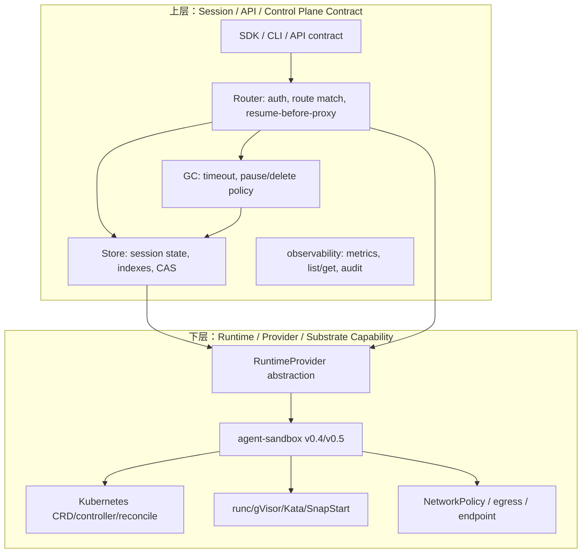

# Day 26: Week 3 社区最新讨论与双层架构问题面

日期：2026-06-24

## 今日目标

今天不再继续单点追某一个 PR，而是把 Week 3 看到的社区最新讨论和 Day22-25 的本地工作放到同一个“面”上看。

需要回答三个问题：

1. 2026-06-24 最新 open issues 主要在讨论什么。
2. 这些 issue 背后暴露的是哪些系统性问题，而不是孤立 bug。
3. Day22-25 的实测、设计、代码 review 如何汇总成 AgentCube 后续发展的双层架构判断。

> 注释：这里说的“面”不是数学意义，而是和“点”相对。单个 issue 是一个点；把多个 issue、PR、测试失败、设计风险串起来，看到它们共同指向同一类架构缺口，就是一个面。
>
> 注释：本文不准备发 upstream 评论，只做本地分析。所有社区结论都区分“issue/PR 明确写到的事实”和“我们基于 Day22-25 资料做出的工程推断”。

## 输入来源

### 社区最新 issue / PR 快照

扫描时间：2026-06-24，中国时间。

| 编号 | 标题 | 状态 | PR 认领 @ / 处理状态 | 关键讨论 |
| --- | --- | --- | --- | --- |
| [#401](https://github.com/volcano-sh/agentcube/issues/401) | CI: Codegen Check path filter causes false pass | Open | `safiya2610` 曾 `/assign`，但 issue 作者说明 #399 已在处理一部分 | `Codegen Check` workflow 有 path filter，导致 `go.mod` / `go.sum` 变化可能跳过 `make gen-check`，形成 false pass |
| [#399](https://github.com/volcano-sh/agentcube/pull/399) | fix: remove stale `golang.org/x/oauth2 v0.36.0` entry from go.sum | Open PR | 作者 `vanshika2720` | 清理 stale `go.sum` 可以修当前失败，但 #401 指出还需要改 workflow filter 才能防止复发 |
| [#397](https://github.com/volcano-sh/agentcube/issues/397) | CodeInterpreter authMode default is skipped in non-warm sandbox creation | Open | `avinxshKD` 已 `/assign` | direct sandbox path 和 warm-pool path 对空 `authMode` 默认值处理不一致，可能漏注入 `PICOD_AUTH_PUBLIC_KEY` |
| [#394](https://github.com/volcano-sh/agentcube/issues/394) | Python SDK ttl parameter is sent but ignored by CreateSandboxRequest API | Open | `kavyarathod05` 已 `/assign` | Python SDK 发送 `ttl`，但 WorkloadManager `CreateSandboxRequest` 没字段，Gin bind 静默丢弃，最终 expiry 仍来自 CRD |
| [#395](https://github.com/volcano-sh/agentcube/issues/395) | Python AgentRuntimeClient can create sessions but cannot delete them | Open | `nabrahma` 已 `/assign` | AgentRuntimeClient 能 create session，但缺少显式 server-side delete / stop 语义 |
| [#392](https://github.com/volcano-sh/agentcube/issues/392) | [Umbrella][Infrastructure] Hardening GitHub Workflows | Open | `safiya2610` 已 `/assign`，关联 [#393](https://github.com/volcano-sh/agentcube/pull/393) / [#396](https://github.com/volcano-sh/agentcube/pull/396) / [#399](https://github.com/volcano-sh/agentcube/pull/399) | GitHub Actions pin SHA、permissions、action 版本、CI 安全和稳定性 |
| [#388](https://github.com/volcano-sh/agentcube/issues/388) | Router should use longest valid pathPrefix match for sandbox entrypoints | Open | `avinxshKD` 已 `/assign` | Router 当前 prefix match 可能让 `/` 抢 `/api/foo`，或让 `/api2` 错配 `/api` |
| [#386](https://github.com/volcano-sh/agentcube/issues/386) | [v0.2.0] Call for proposals | Open | 暂无 assignee | v0.2.0 umbrella，包含 agent-sandbox compatibility、Sleep/Resume 等方向 |

> 注释：`PR 认领 @` 是开源协作里的重要状态。如果 issue 已有人 `/assign` 或已有活跃 PR，我们不应该重复抢实现。更合适的参与方式是代码阅读、测试复现、review 或补充设计材料。

### 本地前序材料

| 文件 | 贡献到 Day26 的信息 |
| --- | --- |
| [Day22](day22-opensandbox-agent-substrate-runtime-runbook.md) | OpenSandbox Docker runtime 实测通过；Agent Substrate kind quickstart 阻塞在本机 control-plane bootstrap；冷启动要拆 image pull / container create / execd bootstrap / command/file API |
| [Day23](day23-agentcube-future-architecture-and-design.md) | AgentCube 不应直接重写底层 runtime，而应先做 session lifecycle control plane、RuntimeProvider abstraction、Store source of truth、Router resume-before-proxy、GC split |
| [Day24](day24-sandbox-sleep-resume-design-note.md) | Sleep/Resume 设计先行；AgentCube 定义 session lifecycle contract，agent-sandbox 提供 runtime capability；本地 spike 验证 Store CAS 和 WorkloadManager lifecycle service |
| [Day25](day25-sleep-resume-code-review-and-architecture-retrospective.md) | 从 reviewer 视角审查 Sleep/Resume 两阶段实现，形成 code review matrix、风险分级、测试矩阵和第三阶段 gate |
| [术语扫盲](intern-glossary.md) | 统一术语：CRD、controller、RuntimeProvider、snapshot、CAS、egress、Credential Vault、benchmark 等 |

## 最新社区讨论的直接观察

### 1. 社区正在从“功能可跑”转向“契约一致性”

[#397](https://github.com/volcano-sh/agentcube/issues/397)、[#394](https://github.com/volcano-sh/agentcube/issues/394)、[#395](https://github.com/volcano-sh/agentcube/issues/395)、[#388](https://github.com/volcano-sh/agentcube/issues/388) 看起来是四个小 bug / enhancement，但它们共同指向一个问题：

```text
AgentCube 的用户入口、SDK、Router、WorkloadManager、Store 之间的行为契约还没有完全收敛。
```

具体表现：

| Issue | 表面问题 | 深层契约问题 |
| --- | --- | --- |
| #397 | 空 `authMode` 在 direct sandbox path 中没有按 `picod` 默认处理 | direct path 和 warm-pool path 的 CodeInterpreter 创建语义不一致 |
| #394 | SDK 发送 `ttl`，后端静默忽略 | SDK API contract 和 WorkloadManager API schema 不一致 |
| #395 | AgentRuntimeClient 能创建但不能 delete session | SDK lifecycle 只有 create，没有完整 stop/delete/attach 语义 |
| #388 | pathPrefix 使用 first prefix match | Router entrypoint matching 规则不够精确，可能把请求代理到错误 endpoint |

> 分析：这些问题不应该被看成“Python SDK 小修”或“Router 字符串匹配小修”。它们都在逼 AgentCube 明确一件事：session 是一个有生命周期、有 owner、有 endpoint、有 timeout、有 delete 语义的对象，而不是一次 create 后放进 Redis 的临时 JSON。

### 2. CI / codegen 讨论暴露了“验证链路可信度”问题

[#401](https://github.com/volcano-sh/agentcube/issues/401) 和 [#399](https://github.com/volcano-sh/agentcube/pull/399) 的重点不是 `go.sum` 里两行 checksum 本身，而是：

```text
CI 是否真的验证了它声称验证的东西。
```

当前明确事实：

- `Codegen Check` workflow 有 path-based filtering。
- 某些 `go.mod` / `go.sum` 或依赖图变化可能没有触发 `make gen-check`。
- stale `golang.org/x/oauth2 v0.36.0` entries 在后续 PR 才被暴露。
- #399 清理 `go.sum` 可以修眼前失败。
- #401 进一步指出还要修 workflow filter，否则类似问题还会发生。

> 注释：`false pass` 比直接 fail 更危险。直接 fail 会阻止合并；false pass 会让仓库进入一个看似绿色、实际有隐患的状态，后续某个无关 PR 再把问题暴露出来，reviewer 会很难追溯根因。
>
> 分析：这和我们在 #387 里踩到的 codegen 问题是同一类风险。生成代码检查不能顺手扰动依赖，CI 也不能因为 path filter 漏掉依赖变化。否则“生成文件最新”这个结论不可信。

### 3. v0.2.0 的新方向不是单一 feature，而是 lifecycle control plane

[#386](https://github.com/volcano-sh/agentcube/issues/386) 仍然是 v0.2.0 umbrella。它下面已经出现过两个核心方向：

- `agent-sandbox` compatibility / latest adaptation。
- Sandbox Sleep/Resume。

Day23-25 的本地结论是：这两个方向不是平行无关，而是上下游关系。

```text
agent-sandbox compatibility 是底层 runtime/provider foundation。
Sleep/Resume 是上层 session lifecycle contract。
```

如果没有 stable provider foundation，Sleep/Resume 很容易被某个 agent-sandbox API 版本绑定死；如果没有上层 session contract，底层 provider 即使支持 pause/resume，AgentCube 也不知道 Router、Store、GC、SDK 应该怎么表现。

## 双层架构问题面

Day22-25 可以归纳成一个双层架构模型：



> 注释：上层回答“用户和 AgentCube 看到什么语义”：session 是否存在、能不能 delete、ttl 如何计算、paused 能不能 resume、请求应该打到哪个 endpoint。下层回答“底层如何做到”：用 `replicas=0/1`、`OperatingMode`、snapshot、warm pool、NetworkPolicy、runtime checkpoint 还是其他机制。

### 上层 bug 面：Session / API / Router / Store contract

这一层的 bug 不是“代码写错一行”，而是多个模块对同一个 session 的理解不一致。

| 分类 | 具体信号 | 暴露的问题 | 对后续设计的要求 |
| --- | --- | --- | --- |
| SDK contract | #394 `ttl` 被后端忽略 | SDK 参数和 WorkloadManager request schema 不一致 | API 字段要么贯穿后端，要么从 SDK 移除/废弃；不能静默丢弃 |
| SDK lifecycle | #395 AgentRuntimeClient 缺 delete | create 和 delete/stop 不对称 | 明确自建 session、attach session、stop、delete、ttl 的语义 |
| Auth default | #397 direct path 跳过默认 `picod` | direct / warm-pool 两条创建路径行为不一致 | 默认值归一化要集中在 helper，不要散落在两个 builder 分支 |
| Router matching | #388 pathPrefix first match | endpoint 路由规则不精确 | Router 必须定义 longest valid prefix match 和边界规则 |
| Store state | Day24/25 Store CAS | 并发 resume 如果没有 CAS 会双赢 | Store 必须成为 lifecycle source of truth，并支持原子状态迁移 |
| GC semantics | Day24/25 GC split | 当前 idle/TTL 直接 delete，不是 Ready -> Paused -> Deleted | timeout 语义要拆成 idle timeout、pause timeout、maxSessionDuration |
| Owner/auth before resume | Day25 Router gate | 未授权请求如果能触发 resume，会造成资源滥用 | Router 必须先做 owner/auth，再 resume-before-proxy |
| Observability | #331/#400 方向 | list/get/metrics 还没有稳定模型 | session index、metrics cardinality、active execution 语义要设计清楚 |

> 分析：上层问题的核心是 contract。即使底层 runtime 明天支持完美 pause/resume，如果 SDK 仍然忽略 ttl、Router 仍然打错 endpoint、Store 没有 CAS、GC 仍然直接 delete，用户仍然得不到可靠的 session lifecycle。

### 下层 bug 面：Runtime / Provider / Substrate capability

这一层的 bug 面来自底层 runtime 能力、agent-sandbox API 版本、Kubernetes 环境和 provider adapter。

| 分类 | 具体信号 | 暴露的问题 | 对后续设计的要求 |
| --- | --- | --- | --- |
| agent-sandbox v0.4 compatibility | #387 / Day16-19 | warm pool adoption、public annotation、NetworkPolicy 默认管理、codegen 版本都影响 AgentCube | RuntimeProvider 要隔离 CRD 字段差异；PR 要保持 stable `v0.4.6` 范围 |
| agent-sandbox v0.5 forward | Day18 | `v1alpha1 -> v1beta1`、`TemplateRef -> WarmPoolRef`、`Replicas -> OperatingMode`，且 CRD storedVersions 影响原地升级 | rc 支持应独立 PR；必须说明 clean install 和 migration 口径 |
| OpenSandbox provider model | Day21/22 | OpenSandbox 把 Docker / BatchSandbox / agent-sandbox 封装成 provider | AgentCube 也应收敛 provider 边界，减少 WorkloadManager handler 扩散 |
| Agent Substrate substrate | Day21/22 | Actor/Worker 分离、gVisor checkpoint、ValKey store、router-triggered resume 方向先进，但部署复杂 | 可借鉴状态机和 router 唤醒，不应短期照搬完整 substrate |
| Runtime smoke realism | Day22 | OpenSandbox 首次 create 被 image pull 卡 246s；kind quickstart 卡在本机 cgroup/control-plane | benchmark 必须拆 cold/warm、runtime/env/product failure，不可混报 |
| NetworkPolicy / egress | #291 / Day23 / #387 | 关闭 managed NetworkPolicy 是兼容手段，不是长期方案 | 后续要设计显式 allow policy 和 egress/credential/audit |
| SnapStart / checkpoint | #366/#379 / Day24 | snapshot/restore 涉及 CRD、artifact store、runtime driver、fallback | 不应和 Sleep/Resume MVP 混成一个 PR；先定义 preservation semantics |

> 注释：`substrate` 在这里指底层支撑系统，不只是 Agent Substrate 项目名。它包括 Kubernetes、runtime、snapshot storage、state store、network、provider adapter 等一整套能让上层 session 生命周期跑起来的底座。
>
> 分析：下层问题的核心是 capability。底层能不能 pause、能保留什么、resume 后 endpoint 是否变化、NetworkPolicy 是否阻断、CRD 是否能原地升级，这些都应该被 RuntimeProvider 抽象成能力和结果，而不是让 Router 或 SDK 直接理解 Kubernetes 字段。

## Day22-25 如何从多个点汇成一个面

### Day22：实测告诉我们“环境变量和冷启动变量必须拆开”

Day22 的两个结果非常关键：

1. OpenSandbox Docker runtime 最小 smoke 通过。
2. Agent Substrate kind quickstart 没跑到 demo，阻塞在本机 kind/kubeadm control-plane bootstrap。

这不是简单的“一个通过、一个失败”。它给出的测试纪律是：

- 先测最小 runtime，不要把 Docker/Kubernetes/provider/snapshot 多个变量混在一起。
- cold start 要拆 image pull、container create、execd bootstrap、first command、file API。
- infrastructure bootstrap failure 要和产品行为 failure 分开记录。
- cleanup 要成为测试通过条件。

> 分析：这直接影响 AgentCube benchmark。未来如果比较 warm pool、SnapStart、Sleep/Resume，必须保证镜像缓存、Kubernetes 环境、LLM provider、cleanup 条件一致，否则测到的是环境噪声，不是架构收益。

### Day23：设计告诉我们“不要重写底层 scheduler，先补 lifecycle control plane”

Day23 对 `design.md` 的评估是：方向直觉对，但直接实现太跳。

更稳的路线：

```text
agent-sandbox compatibility
-> RuntimeProvider capability layer
-> Store session state/index/CAS
-> Router resume-before-proxy
-> GC Ready/Paused/Deleted split
-> Sleep/Resume MVP
-> benchmark/math-agent validation
-> SnapStart/runtime acceleration
```

这和 2026-06-24 的最新 issue 完全对齐：

- #394/#395 要求 SDK/session lifecycle contract。
- #397 要求 direct/warm path behavior consistency。
- #388 要求 Router route correctness。
- #401/#392 要求 CI/codegen 验证可信。

### Day24：设计 spike 告诉我们“Store CAS 是正确性要求”

Day24 的核心发现：

- AgentCube 不应该等 agent-sandbox pause 全部定稿才设计 Sleep/Resume。
- AgentCube 也不应该重复实现底层 runtime pause。
- AgentCube 应先定义 session lifecycle contract。
- Store CAS 不是优化项，而是并发 resume 正确性要求。
- WorkloadManager lifecycle service 可以先用 fake provider 测 `ready -> pausing -> paused`、`paused -> resuming -> ready`。

这把社区 bug 面中的“上层 contract”落到了可测试的代码形态。

### Day25：review 告诉我们“实现越往后越需要 gate”

Day25 从 reviewer 视角发现了几个关键 gate：

| Gate | 为什么重要 |
| --- | --- |
| GC split | 不先定义 Ready/Paused/Deleted 优先级，GC 会和 resume 竞争 |
| Router resume-before-proxy | Paused session 不能继续代理旧 endpoint |
| RuntimeProvider capability | 不同 agent-sandbox 版本和 pause 模式不能硬编码到业务层 |
| final CAS after provider success | provider 已恢复但 Store final CAS 失败会造成 runtime 与 Store 不一致 |
| owner/auth before resume | 未授权请求不能触发资源恢复 |
| math-agent / SDK e2e | 只测 sandbox API 不足以证明真实 Agent 工作流可用 |

> 分析：Day25 的价值在于把“下一步写代码”变成“下一步先过 gate”。这正是 Week 3 的核心转变：不再把实现推进当作唯一产出，而是用 review 框架决定什么时候该写代码、写到哪里停止、需要什么测试证据。

## Week 3 的主线判断

### 判断 1：AgentCube 正在从 runtime compatibility 进入 session lifecycle 阶段

Week 2 的主线是 #387：先让 AgentCube 对齐 current stable `agent-sandbox v0.4.6`。

Week 3 的新信号是：

- SDK ttl/delete issue 出现。
- Router path matching issue 出现。
- CodeInterpreter auth default consistency issue 出现。
- CI/codegen verification issue 出现。
- Sleep/Resume 本地设计和 spike 已经进入 Store/WorkloadManager 层。

这说明项目关注点正在从“能创建 sandbox”进入“session 生命周期是否可靠”。

### 判断 2：双层架构是后续 review 的主轴

后续看任何新 issue/PR，都可以先问：

```text
这是上层 contract 问题，还是下层 capability 问题？
```

如果是上层 contract：

- 关注 SDK / API schema / Store / Router / GC / auth / metrics。
- 测试重点是语义一致性、失败路径、并发路径、owner-aware 行为。

如果是下层 capability：

- 关注 agent-sandbox 版本、CRD 字段、RuntimeClass、NetworkPolicy、snapshot、runtime provider。
- 测试重点是真实 runtime、e2e、manifest version、clean install / migration、cleanup。

如果一个 PR 同时改两层，就要特别小心：

- 是否真的必须同 PR 修改。
- 是否能先拆出前置条件。
- 是否有足够测试覆盖两层交界处。

### 判断 3：当前最适合我们的贡献方式是 review / test feedback，而不是抢实现

原因：

- #397/#394/#395/#388 都已有作者 `/assign`。
- #392/#401/#399 已有活跃处理路径。
- #387 仍需要 review 和维护者合并。
- Sleep/Resume 还处于设计和本地 spike 阶段，不适合仓促 upstream。

更合适的动作：

1. 对 #401/#399/#393 做 codegen/CI 角度 review，关注 path filter 是否根治。
2. 对 #394/#395 做 SDK lifecycle 语义 review，借 Day24 的 timeout/delete 语义表。
3. 对 #397 做 direct/warm path consistency review，必要时看 workload builder 测试。
4. 对 #388 做 Router prefix match 测试建议，关注 `/api` vs `/api2` 边界。
5. 继续准备 #387 review 答辩，等待 maintainer 反馈。

## 从点到面的 bug 分类表

| 面 | 典型 issue / 本地发现 | 共同根因 | 需要的工程能力 |
| --- | --- | --- | --- |
| API contract 面 | #394 ttl ignored、#395 delete gap | SDK 和后端 schema / lifecycle 语义不一致 | API 设计、兼容策略、文档和 e2e |
| Router correctness 面 | #388 prefix match、Day24 resume-before-proxy | Router 不只是 proxy，还承担 session activation 和路径选择 | 路由规则、owner/auth、并发唤醒测试 |
| Store consistency 面 | Day24 CAS、Day25 final CAS risk、#331 list/get | Store 还不是完整 session lifecycle source of truth | CAS、索引、状态机、Redis/ValKey 语义 |
| Runtime provider 面 | #387 v0.4、Day18 v0.5、Day22 OpenSandbox provider | 底层 provider API 变化会扩散到业务层 | adapter/capability layer、version matrix、runtime e2e |
| CI trust 面 | #401/#399、Day16 codegen drift | CI 可能 false pass 或生成过程扰动依赖 | workflow review、gen-check、path filter、go mod hygiene |
| Security/network 面 | #397 auth default、#291 NetworkPolicy、#367 RLAC | auth、owner、network allow path 尚未贯穿生命周期 | authn/authz、NetworkPolicy、egress、audit |
| Benchmark evidence 面 | Day22 cold start、Day23 metric schema、Day25 math-agent e2e gate | 测试口径不拆清会误判架构收益 | cold/warm 分离、p95/p99、cleanup、真实 Agent e2e |

## 后续行动建议

### 短期：做 review-ready 的本地材料

1. 为 #401/#399/#393 整理 codegen CI review checklist：
   - `go.mod` / `go.sum` 是否触发 gen-check。
   - path filter 是否会漏掉脚本、go module、API type 变化。
   - `make gen-check` 是否会顺手改依赖。

2. 为 #394/#395 整理 session lifecycle API 语义表：
   - SDK `ttl` vs CRD `maxSessionDuration` 谁优先。
   - `stop()` 是只断本地连接还是 delete server session。
   - attach existing session 是否允许 auto-delete。
   - `sessionTimeout / pauseTimeout / maxSessionDuration / ttl / delete` 如何组合。

3. 为 #397 整理 direct/warm path consistency checklist：
   - authMode 默认值只在一个 helper normalize。
   - direct sandbox 和 warm-pool claim 最终 env 注入一致。
   - `authMode=none` 是唯一跳过 auth public key 的路径。

4. 为 #388 整理 Router prefix match case table：
   - `/` vs `/api`
   - `/api` vs `/api/foo`
   - `/api` vs `/api2`
   - trailing slash / no trailing slash

### 中期：把 Day24/25 变成 Sleep/Resume 第三阶段 gate

第三阶段不应直接大改 Router/GC。先补测试和表：

- GC decision table。
- Router status handling table。
- RuntimeProvider capability gate。
- provider success but final CAS failure test。
- owner/auth before resume test plan。
- math-agent session preservation e2e plan。

### 长期：把双层架构变成贡献路线

后续所有贡献点都可以放进双层架构图里：

| 贡献方向 | 属于哪一层 | 第一产出 |
| --- | --- | --- |
| #387 review / merge | 下层 provider foundation | compatibility PR review + runtime evidence |
| #394/#395 SDK lifecycle | 上层 session/API contract | API semantics doc + review comments |
| Sleep/Resume Store/Router/GC | 上层 lifecycle control plane | staged PRs + unit/race/e2e |
| agent-sandbox v0.5 | 下层 provider capability | clean follow-up branch + migration note |
| SnapStart benchmark | 下层 runtime acceleration + 上层 preservation contract | benchmark schema + fallback review |
| NetworkPolicy / egress | 下层 network + 上层 security contract | allow path design + egress/audit tests |

## 今日结论

Week 3 的重点不是再多读几个项目，而是把社区最新 issue 和本地 Day22-25 的工作合并成一个判断：

```text
AgentCube 的下一阶段核心不是单点 feature，
而是把上层 session lifecycle contract 和下层 runtime/provider capability 解耦。
```

上层要解决：

- SDK 参数是否真的生效。
- session 能否 delete / attach / resume。
- Router 是否按正确 endpoint 和 owner/auth 规则代理。
- Store 是否支持状态机、索引和 CAS。
- GC 是否按 Ready/Paused/Deleted 两段策略执行。

下层要解决：

- agent-sandbox 不同版本如何被 provider 层吸收。
- runtime 能保留什么状态。
- NetworkPolicy / egress / endpoint 是否连通。
- snapshot / checkpoint / warm pool / SnapStart 如何被测试证明。

对我们来说，最好的实习产出不是“抢一个新 issue 写代码”，而是能把这些点归纳成可 review 的设计表、测试矩阵和 PR 边界判断。后续如果一行代码都不写，只做审查，也应该能从这个双层模型判断一个 PR 是否拆分合理、测试是否充分、社区协作是否友好。
