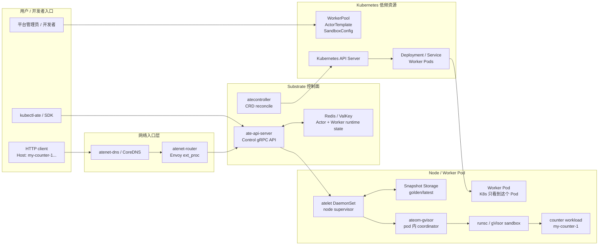
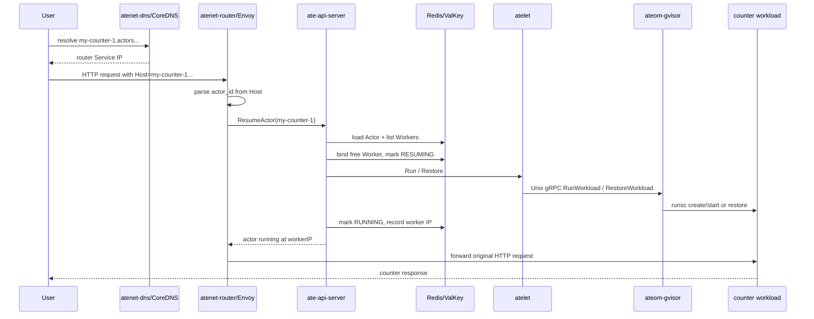
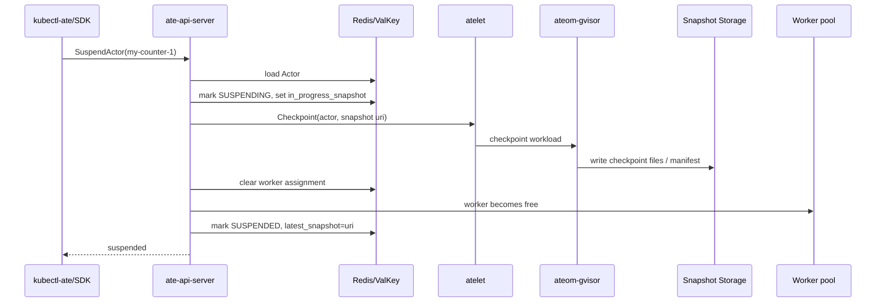
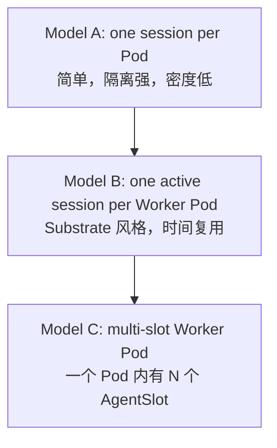
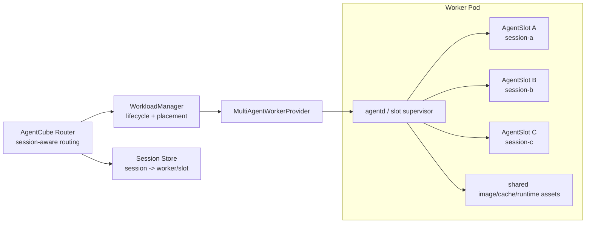
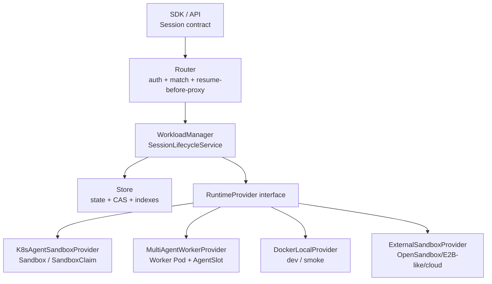

# Day 28：Agent Substrate 架构吃透与 AgentCube 差异化设计方向

日期：2026-06-24

## 今日目标

今天的目标不是继续泛泛调研 Agent Substrate，而是基于现有架构图、数据流图和源码证据，真正拆清楚它的系统边界，再反推出 AgentCube 后续可以借鉴什么、不能照搬什么、应该在哪些点上形成自己的差异化设计。

本日重点回答四个问题：

1. Agent Substrate 的 counter demo 到底说明了什么架构能力？
2. 这个项目和 AgentCube 未来的 Sleep/Resume / 高密度 session lifecycle 为什么相似？
3. AgentCube 如果沿着类似方向走，哪些设计可以学，哪些不能抄？
4. AgentCube 可能形成的两个差异化方向是什么：
   - 单 Pod 多 agent / 多 session multiplexing，而不是一个 worker slot 同时只跑一个 actor。
   - RuntimeProvider / substrate provider 抽象，而不是把 Kubernetes CRD 当成唯一底层。

> 注释：这里的“相似”不是说 AgentCube 要复刻 Agent Substrate。更准确的理解是：两者都在处理长期存在、经常空闲、需要低延迟恢复、需要状态保留的 agent-like workload。Agent Substrate 是一个已经把 actor、worker、router、snapshot、state store 串起来的参考样本；AgentCube 应该学习它的系统边界和测试问题，而不是复制它的代码、API 名称、目录结构或完整部署模型。

## 本日输入材料

| 类型 | 路径 / 来源 | 用途 |
| --- | --- | --- |
| Draw.io 架构图 | [agent-substrate-counter-architecture.drawio](agent-substrate-counter-architecture.drawio) | 作为 counter demo 的完整组件图 |
| 图解说明 | [agent-substrate-counter-architecture-explainer.txt](agent-substrate-counter-architecture-explainer.txt) | 解释图中 1-19 步流程 |
| Day21 调研 | [day21-opensandbox-agent-substrate-study.md](day21-opensandbox-agent-substrate-study.md) | AgentCube / OpenSandbox / Agent Substrate 三方源码级对比 |
| Day22 runbook | [day22-opensandbox-agent-substrate-runtime-runbook.md](day22-opensandbox-agent-substrate-runtime-runbook.md) | 端到端实测计划和本机 kind 阻塞证据 |
| Day24/25 Sleep/Resume | [day24-sandbox-sleep-resume-design-note.md](day24-sandbox-sleep-resume-design-note.md), [day25-sleep-resume-code-review-and-architecture-retrospective.md](day25-sleep-resume-code-review-and-architecture-retrospective.md) | AgentCube session lifecycle、Store CAS、Router/GC split 的设计基础 |
| Agent Substrate 本地源码 | `/tmp/agent-substrate` @ `bbafda0` | 读取 proto、router、resume/suspend workflow、CRD types |

Draw.io 文件校验：

```text
/root/.local/bin/python3.11 .agents/skills/drawio-skill/scripts/validate.py internship-reports/agent-substrate-counter-architecture.drawio
```

结果：`0 error(s), 24 warning(s)`。警告主要来自 swimlane 容器和内部节点的重叠，这是图形分组带来的预期现象，不影响 XML 结构有效性。

## 一句话结论

Agent Substrate 的核心不是“用 gVisor 很高级”，而是它把 long-session workload 拆成了四个面：

1. **控制面**：Actor lifecycle API、Worker 分配、状态机、并发 resume 去重。
2. **状态面**：高频 Actor / Worker 状态放 Redis/ValKey，低频配置放 Kubernetes CRD。
3. **数据面**：Router 先根据 Host 定位 actor，必要时 resume，再转发用户请求到 worker。
4. **runtime 面**：atelet / ateom-gvisor / runsc 负责真正启动、checkpoint、restore workload。

AgentCube 未来如果要做 Sleep/Resume 和高密度 agent hosting，也会自然走向类似四面结构。但 AgentCube 不应该简单照搬 Agent Substrate 的“一 worker pod 同时只承载一个 actor”模型。我们更值得探索的是：

- **AgentCube Session 作为上层一等对象**：SDK、Router、Store、GC、auth、metrics 都围绕 Session contract 收敛。
- **Multi-agent Worker Pod**：一个 Worker Pod 内部管理多个 AgentSlot，提高资源利用率，但必须重新设计隔离、端口、workspace、凭据、监控和故障域。
- **RuntimeProvider / SubstrateProvider 抽象**：Kubernetes + agent-sandbox 是一个 provider，不是唯一 provider。未来可以接 Docker/local dev、OpenSandbox-like backend、Substrate-like worker pool、cloud sandbox 或 external E2B-like service。

> 分析：如果只把 Substrate 理解成“gVisor checkpoint 项目”，会错过最重要的控制面思想。对 AgentCube 更关键的是 Router resume-before-proxy、Store CAS、worker/session location、snapshot capability、provider capability boundary，而不是第一天就复制 gVisor/runsc 的全部路径。

## Substrate counter demo 的真实系统结构

### 分层架构图



> 注释：这张 Mermaid 图是对 drawio 架构图的文本化重排。drawio 图更适合视觉展示，Mermaid 图更适合在报告里解释调用关系和组件边界。

### 四条关键链路

| 链路 | 起点 | 终点 | 说明 |
| --- | --- | --- | --- |
| 配置链路 | `WorkerPool` / `ActorTemplate` CRD | Deployment / golden snapshot | 低频声明式配置，由 Kubernetes controller reconcile |
| 请求链路 | HTTP Host | Worker Pod IP | Router 从 Host 解析 actor id，resume 后再转发 |
| 生命周期链路 | `CreateActor` / `ResumeActor` / `SuspendActor` | Redis Actor state + worker assignment | 高频状态不写成 Kubernetes CRD |
| runtime 链路 | atelet | ateom-gvisor / runsc | 真正启动、restore、checkpoint workload |

> 注释：`ActorTemplate` 类似“应用模板”，`Actor` 类似“具体会话实例”，`WorkerPool` 类似“预热执行槽池”。但这些只是理解类比，不能把它们机械映射成 AgentCube 的 API 名称。

## 源码证据摘要

本地源码位置：`/tmp/agent-substrate`，commit `bbafda0`。

| 文件 | 读到的关键信息 | 对 Day28 的意义 |
| --- | --- | --- |
| `pkg/proto/ateapipb/ateapi.proto` | `Control` service 暴露 `GetActor`、`CreateActor`、`UpdateActor`、`ResumeActor`、`SuspendActor`、`PauseActor`、`DeleteActor`、`ListWorkers`、`ListActors`；`Actor.Status` 包含 `RESUMING/RUNNING/SUSPENDING/SUSPENDED/PAUSING/PAUSED` | 生命周期是显式控制面契约，不只是内部字段 |
| `cmd/atenet/internal/router/resumer.go` | `ActorResumer` 使用 `singleflight` 去重同一个 actor 的并发 resume，并对 `codes.Aborted` 做重试 | Router 不是简单 proxy，它承担 activation gate 和并发控制 |
| `cmd/atenet/internal/router/extproc_in.go` | 从 `Host` / `:authority` 解析 actor id，并要求域名后缀匹配 actor DNS suffix | 路由是 actor-aware，而不是普通 Service 转发 |
| `cmd/ateapi/internal/controlapi/workflow_resume.go` | Resume 会读取 Actor、读取 ActorTemplate、筛选 WorkerPool、选择 free worker、绑定 worker、把 actor 标为 `RESUMING`，再调用 atelet restore/run | resume 是多步骤状态机，不是一个瞬时函数 |
| `cmd/ateapi/internal/controlapi/workflow_suspend.go` | Suspend 会标记 `SUSPENDING`、调用 atelet checkpoint、写 snapshot、释放 worker、把 actor 变成 `SUSPENDED` | pause/suspend 必须和 worker 释放、snapshot 写入、状态最终化绑定 |
| `pkg/api/v1alpha1/workerpool_types.go` | `WorkerPool` 定义 replicas、ateom image、pod template、sandboxClass、sandboxConfigName | Kubernetes 负责声明 Worker Pod 容量和 runtime 族 |
| `pkg/api/v1alpha1/actortemplate_types.go` | `ActorTemplate` 定义 pause image、containers、snapshotsConfig、workerSelector、golden snapshot status | template 负责 workload spec 和初始 snapshot |
| `pkg/proto/ateapipb/ateapi.proto` 的 `SessionIdentity` | session credential 不绑定某个固定 worker pod，而是通过当前 session 到 worker 映射验证 | 会迁移/恢复的 session 需要稳定身份，不能把权限硬绑 Pod IP |

> 分析：这里最值得 AgentCube 学的是“API contract 先行”。Substrate 的 proto 把生命周期动作和状态枚举集中定义，使 router、API server、CLI、store 都围绕同一组状态工作。AgentCube 现在更分散：SDK、Router、WorkloadManager、Store、agent-sandbox provider 都各自理解 session 的一部分。

## Counter 请求数据流

### 请求触发 resume



这条链路里有两个关键点：

1. Router 在 proxy 前调用 `ResumeActor`，所以用户请求不会盲目打到旧 endpoint。
2. ateapi 在状态面完成 actor -> worker 的绑定，Router 最终只拿到当前可用 worker IP。

> 注释：这和 AgentCube 的未来 `Router resume-before-proxy` 非常接近。AgentCube 当前 Router 已经能根据 session id 查 Store 并 proxy 到 entrypoint，但缺少 paused 状态分支、resume API、resume 成功后重新读取 endpoint、并发 resume 去重。

### suspend / checkpoint / release worker



这里不能忽略 worker release。Suspend 的价值不是“状态字段变成 suspended”，而是：

- workload 状态被保存。
- worker slot 被释放。
- 下次 resume 可以从 latest snapshot 恢复。
- Store 里的 actor location 不能继续指向旧运行实例。

这也是 AgentCube 设计 Sleep/Resume 时必须避免的误区：不能只加 `Paused` 状态字段，必须定义 runtime action、endpoint 清理、snapshot/workspace 保留和 GC 策略。

## Substrate 最值得学习的设计点

### 1. 高频状态不压到 Kubernetes API Server

Substrate 把 `WorkerPool`、`ActorTemplate`、`SandboxConfig` 放在 Kubernetes CRD 里，但把具体 Actor / Worker 的高频状态放在 Redis/ValKey。

这背后的判断是合理的：

- WorkerPool replica、template image、sandbox runtime 这类配置是低频变化。
- Actor resume、suspend、worker binding、snapshot version 是高频变化。
- 每次请求都可能触发 resume，如果全部写 Kubernetes API server，会把同步热路径变成 etcd / controller 热路径。

AgentCube 当前已经有 Store，所以不需要从零发明这层。但 AgentCube 需要更明确地把 Store 变成 session lifecycle source of truth，而不只是保存 endpoint JSON。

### 2. Router 是 activation gate

Substrate 的 router 不只是反向代理，它会：

- 从 Host 解析 actor id。
- 对同一个 actor 的并发 resume 做 singleflight 去重。
- 调用 `ResumeActor`。
- 拿到当前 worker IP 后再转发原始请求。

AgentCube 后续也需要同样的行为，只是入口形式不同：

- Substrate 用 Host 解析 actor id。
- AgentCube 当前更多通过 `x-agentcube-session-id` 和 entrypoint pathPrefix 定位 session。
- Substrate resume 成功返回 worker IP。
- AgentCube resume 成功后应该重新读 Store，拿新的 entrypoint / endpoint。

### 3. 状态机有中间态

Substrate 明确有 `RESUMING`、`SUSPENDING`、`PAUSING` 这类中间态。这一点比“Ready/Paused”二元状态更真实。

原因：

- provider action 可能失败。
- snapshot 写入可能失败。
- worker 绑定可能成功，但 runtime restore 失败。
- Router 可能看到正在 resume 的 session。
- GC 可能扫到卡在 transition 的 session。

AgentCube Day24/25 里已经得出类似结论：需要 `Ready / Pausing / Paused / Resuming / Deleted / Failed`，并且 Store CAS 不是优化项，而是并发正确性要求。

### 4. 模板预热和实例最新状态分开

Substrate 区分：

- golden snapshot：来自 ActorTemplate，给新 actor 加速首次启动。
- latest snapshot：来自具体 actor，保存该 actor 自己的最新状态。

这个思想对 AgentCube 的启发是：

- warm pool / SnapStart / image prewarm 解决的是模板级启动成本。
- session pause/resume 解决的是实例级状态保留。
- 不能把 warm pool ready 等同于 session context preserved。

### 5. Session identity 不绑定当前 Pod

Substrate 的 `SessionIdentity` 说明了一个重要方向：actor/session 可能迁移到不同 worker，因此身份和权限不能只绑定当前 Pod。

AgentCube 后续做 owner-aware resume、delete、egress、credential injection 时，也要避免把权限写死在旧 Pod 名或旧 Pod IP 上。

## Substrate 不能照搬的部分

### 1. 不应照搬一 worker pod 只跑一个 actor 的容量模型

Substrate 当前图解里的模型是：一个 Worker Pod 同一时刻最多承载一个 Actor。它的 multiplexing 主要发生在时间维度：

- Actor A running，占用 Worker 1。
- Actor A suspend，Worker 1 释放。
- Actor B resume，可以占用 Worker 1。

这种模型的优点是隔离和实现清晰，但缺点是容量粒度较粗。对于大量轻量 agent session，worker pod 的 CPU / memory reservation 可能不能被充分利用。

你的判断可以整理成一个假设：

> 如果一个 worker slot 同时只能服务一个 actor，而 agent 大部分时间轻负载或等待 I/O，那么资源利用率会被 slot occupancy 限制。实际服务资源利用率可能长期低于集群分配值，甚至在某些负载下只达到约 50%。

这个数字需要后续 benchmark 验证，不能直接作为事实写进 upstream。但它是一个合理的优化方向。

### 2. 不应过早绑定 gVisor checkpoint 作为唯一保存语义

Substrate 目标偏激进：memory + disk checkpoint。AgentCube 第一版 Sleep/Resume 未必需要承诺内存级恢复。

AgentCube 可以分层定义 preservation level：

| Level | 保留内容 | 适合场景 | 难度 |
| --- | --- | --- | --- |
| L0 metadata only | session metadata、endpoint、状态 | 只做控制面语义 | 低 |
| L1 workspace/rootfs | `/workspace`、文件状态 | code interpreter、tool execution | 中 |
| L2 process restart + workspace | 进程重启，但 workspace 保留 | 大多数 agent 工具 | 中 |
| L3 memory + disk checkpoint | 进程内存、文件、socket 等 | stateful actor / counter | 高 |

AgentCube 应该先把 L1/L2 的 contract 说清楚，再评估 L3 是否值得做。

### 3. 不应把外部用户 API 直接改成 Substrate 风格

Substrate 用 gRPC/proto 做内部控制面很合理。但 AgentCube 用户入口和 Python SDK 仍应保持简单 HTTP/SDK 体验。

更合理的路线是：

- 外部 API 保持稳定、易用。
- 内部 WorkloadManager / RuntimeProvider 可以逐步强类型化。
- 状态枚举和错误语义集中定义，而不是散落在 handler 里。

### 4. 不应复制目录、接口命名和实现策略

即使 Substrate 是开源项目，AgentCube 也不能把它当代码模板复制。我们应该：

- 引用和分析来源。
- 学习架构原则。
- 用 AgentCube 自己的需求、已有代码、社区路线重写设计。
- 用测试矩阵证明行为，而不是照搬它的测试名或 API 名。

## AgentCube 差异化方向一：单 Pod 多 agent / AgentSlot multiplexing

### 为什么要考虑这个方向

AgentCube 面向 AI Agent / code interpreter / long-session workload。很多 session 的典型特点是：

- 大量时间 idle。
- CPU 峰值短。
- 内存有 baseline，但未必持续高负载。
- 请求是间歇性的。
- 用户关心 session id、workspace、工具上下文，而不一定关心底层是不是独占 Pod。

如果每个 session 都长期占一个 Pod，或者每个 worker slot 同时只跑一个 session，资源利用率很容易被 idle baseline 拖低。

### 三种容量模型



| 模型 | Kubernetes 看到什么 | AgentCube 看到什么 | 优点 | 风险 |
| --- | --- | --- | --- | --- |
| Model A | 每个 session 一个 Pod/Sandbox | Session = runtime instance | 隔离清楚，易 debug | 冷启动和资源占用高 |
| Model B | 预热 Worker Pod 池 | Session/Actor 轮流占用 Worker | 启动快，控制面清楚 | 同一时刻一个 Worker 只能跑一个 session |
| Model C | 预热 MultiAgent Worker Pod | 一个 Worker Pod 有多个 AgentSlot | 密度更高，适合轻量 agent | 隔离、端口、workspace、metrics、故障域复杂 |

### MultiAgent Worker Pod 概念图



这里的核心对象不是 Substrate 的 Actor，而是 AgentCube 自己的 `Session` 和可能新增的 `AgentSlot`：

- `Session`：用户可见生命周期对象，包含 owner、runtime、workspace、status、timeouts、entrypoints。
- `AgentSlot`：Worker Pod 内部的执行槽，可能有独立端口、workspace、process group、cgroup、credential scope。
- `Worker Pod`：Kubernetes 看到的资源单位，承载多个 slots。
- `RuntimeProvider`：负责把 session 放进某种 runtime，可以是 K8s Sandbox，也可以是 multi-agent Worker Pod。

> 注释：单 Pod 多 agent 不是简单地在一个容器里开多个 Python 进程。只要运行的是不可信代码，就必须重新设计隔离边界。可以是 cgroup + namespace + seccomp 的轻隔离，也可以是 Worker Pod 内部再用 gVisor/runsc 做 per-slot sandbox。不同隔离级别对应不同产品定位。

### MultiAgent Worker 需要新增的控制面能力

| 能力 | 为什么需要 |
| --- | --- |
| slot allocation | session 不再等于 Pod，需要 Store 记录 `session -> worker pod -> slot` |
| per-slot endpoint | Router 要知道 session 对应哪个 slot 的端口或内部 path |
| workspace separation | 防止 session A 读写 session B 的文件 |
| credential scope | 每个 session 的 token / secret / egress 权限不能互相泄露 |
| per-slot resource accounting | 需要知道每个 session 的 CPU/memory/IO 使用 |
| noisy neighbor protection | 一个 agent 跑死循环不能拖垮同 Pod 其他 agent |
| failure domain policy | Worker Pod 崩溃会影响多个 sessions，需要恢复/重建策略 |
| cleanup semantics | delete session 必须清理 slot、workspace、process、Store index |

### 可行的演进路线

不要一上来就做最复杂的多租户 runtime。可以按四层推进：

| 阶段 | 目标 | 验证方式 |
| --- | --- | --- |
| S0 | 保持当前 one session per sandbox，补全 Session contract | Store/Router/GC 单测 |
| S1 | Worker Pod 内部只跑多个 trusted lightweight sessions | 本地 fake provider + command/file API 隔离测试 |
| S2 | Worker Pod 内部引入 per-slot cgroup / workspace / port namespace | noisy neighbor、workspace leakage、cleanup 测试 |
| S3 | Worker Pod 内部接 nested sandbox，例如 gVisor/runsc per slot | 安全隔离、snapshot、resume benchmark |

这条路线能避免直接复制 Substrate 的 gVisor checkpoint 路线，同时保留未来走向高密度 substrate 的空间。

## AgentCube 差异化方向二：Provider abstraction，不把 Kubernetes 当唯一底层

### 当前问题

AgentCube 当前强依赖 Kubernetes + agent-sandbox。这个路线和 Volcano 社区背景一致，但从 Day16-Day20 的适配经历看，风险也很清楚：

- `agent-sandbox v0.1.1 -> v0.4.6` 会影响 warm pool adoption、annotation、NetworkPolicy、codegen。
- `agent-sandbox v0.5.0rc1` 迁移到 v1beta1 后，`Replicas`、`TemplateRef`、API group 都变化。
- 如果 WorkloadManager handler 直接散落 provider-specific 字段，每次版本变动都会扩大 diff。
- Sleep/Resume 不应该被某个 agent-sandbox API 版本直接绑死。

### 推荐的 provider 分层



Provider 的职责不是暴露所有底层细节，而是把底层能力规整成 AgentCube 能理解的结果：

```go
type RuntimeCapabilities struct {
    SupportsHardPause       bool
    SupportsSoftPause       bool
    SupportsWorkspaceResume bool
    SupportsMemorySnapshot  bool
    SupportsMultiSlotWorker bool
    EndpointMayChange       bool
}

type RuntimeProvider interface {
    CreateSession(ctx context.Context, spec SessionRuntimeSpec) (RuntimeHandle, error)
    PauseSession(ctx context.Context, handle RuntimeHandle, policy PausePolicy) (PauseResult, error)
    ResumeSession(ctx context.Context, ref ResumeRef) (RuntimeHandle, error)
    DeleteSession(ctx context.Context, handle RuntimeHandle) error
    Capabilities(ctx context.Context) RuntimeCapabilities
}
```

> 注释：这个 interface 是设计草图，不是现在要提交的代码。真正落地时要从现有 WorkloadManager 的 create/delete、#387 的 agent-sandbox 适配、Day24 的 lifecycle service tests 里长出来，不能先写一个很大的抽象再倒逼业务。

### Provider 抽象的真正收益

| 收益 | 说明 |
| --- | --- |
| 版本隔离 | `agent-sandbox v0.4` / `v0.5` API 差异不扩散到 Router/SDK |
| 测试可控 | fake provider 可以稳定测 Store CAS、Router resume-before-proxy、GC split |
| 能力声明 | 不同 provider 明确声明是否支持 hard pause、workspace resume、memory checkpoint |
| benchmark 可比较 | cold/warm/pause/resume 可以按 provider 维度对比 |
| 未来可插拔 | Docker local、OpenSandbox-like backend、multi-agent worker、cloud sandbox 都可以接入 |

### Provider 抽象的风险

| 风险 | 控制方式 |
| --- | --- |
| 过早抽象 | 只抽现有痛点：create/delete/pause/resume/endpoint/capabilities |
| 语义过宽 | 先定义 preservation level，不要求所有 provider 支持 memory checkpoint |
| debug 变难 | RuntimeHandle 必须可追踪到底层 Pod/Sandbox/slot/snapshot |
| 社区接受难 | 先以 internal boundary 和 tests 推进，不一开始发大 proposal |

## AgentCube 和 Substrate 的映射关系

| Substrate | AgentCube 当前 / 未来 | 可借鉴点 | 不应照搬点 |
| --- | --- | --- | --- |
| Actor | Session / SandboxInfo | session 状态机、owner、snapshot、worker location | 名称和 gRPC API 不必一致 |
| ActorTemplate | AgentRuntime / CodeInterpreter template / future runtime spec | 模板级预热、golden snapshot 思想 | 不必把所有 template 都做成 CRD |
| WorkerPool | SandboxWarmPool / future WorkerPool / MultiAgentWorker pool | 预热容量、pool selector | 不必坚持一个 worker 一个 active actor |
| Worker | Sandbox Pod / Worker Pod / AgentSlot | session 到 runtime location 的绑定 | 不应把 worker identity 等同 session identity |
| atenet-router | AgentCube Router | resume-before-proxy、activation gate、并发 resume 去重 | 不必改成 Host-only routing |
| ate-api-server | WorkloadManager lifecycle service | 生命周期 API、Store CAS、provider 调用 | 不必全量引入 gRPC |
| Redis/ValKey actor state | AgentCube Store | 高频状态 source of truth | 不能只存 endpoint，必须存状态/版本/timeout/index |
| atelet / ateom-gvisor | RuntimeProvider / agentd / provider sidecar | node/runtime action 和控制面解耦 | 不必第一版使用 gVisor checkpoint |
| Snapshot Storage | SnapStart artifact store / workspace store / future snapshot store | golden/latest snapshot 分离 | 不要承诺未验证的 memory checkpoint |

## 不抄袭的设计原则

1. **概念可学习，代码不复制**：
   学习 actor/worker 分离、router activation、state store、snapshot layering，但不复制具体 Go 代码、proto 字段或目录布局。

2. **以 AgentCube 现有问题驱动抽象**：
   #387 说明 provider API 变化会扩散；Day24 说明 Store CAS 和 lifecycle service 必要；#394/#395 说明 SDK lifecycle contract 不完整。RuntimeProvider 应该从这些痛点中长出来。

3. **命名服务于 AgentCube 用户语义**：
   AgentCube 应优先使用 `Session`、`RuntimeProvider`、`AgentSlot`、`Workspace` 等自己的概念，而不是直接照搬 `Actor`、`WorkerPool`、`atelet`、`ateom`。

4. **测试从用户可见行为写起**：
   例如 session resume 后 workspace 是否保留、Router 是否重新读 endpoint、owner mismatch 是否禁止 resume、delete 是否清理 Store/Pod/slot/snapshot。这些比“是否和 Substrate 内部流程一样”更重要。

5. **明确引用来源**：
   本文已经把 Substrate 图、explainer、本地源码路径和 commit 记录下来。后续如果写公开 proposal，也应表述为 architecture inspiration / comparison，而不是把它当原创。

## 下一步建议

### 1. 继续补 AgentCube 自己的架构图

基于今天的 Substrate 图，下一步可以画 AgentCube future architecture：

- 当前 AgentCube：Router / WorkloadManager / Store / agent-sandbox / PicoD / AgentD。
- Sleep/Resume MVP：Session lifecycle service + Store CAS + RuntimeProvider。
- 高密度版本：MultiAgent Worker Pod + AgentSlot + slot supervisor。

建议继续用 Draw.io 做正式图，用 Mermaid 放在报告里做可读解释。

### 2. 写 MultiAgent Worker 的最小 proposal

不要直接提 upstream。先在本地写设计：

- 什么 workload 可以多 agent 同 Pod？
- isolation level 怎么分？
- slot capacity 如何配置？
- Router 如何定位 slot？
- Store 如何记录 `session -> worker -> slot`？
- delete / pause / resume / GC 怎么处理？
- 如何证明没有 workspace / credential leakage？

### 3. 为 provider abstraction 写最小 test contract

先不要写大 interface。可以先设计测试：

- fake provider create/delete。
- fake provider pause/resume。
- endpoint may change。
- provider unsupported capability。
- provider success but Store final CAS fail。
- provider timeout / retry / cleanup。

这些测试会反过来决定 RuntimeProvider 需要哪些方法。

### 4. 后续如果实测 Substrate，换环境

Day22 已证明当前机器 kind control-plane bootstrap 不稳定。下一次验证 Agent Substrate counter demo，应换：

- 干净 cgroup v2 VM。
- 或云端 GKE。
- 或先单独跑普通 `kind create cluster` 稳定性，再跑 Substrate。

目标链路仍然是：

```text
CreateActor -> router request -> ResumeActor -> counter increments ->
SuspendActor -> second router request -> ResumeActor -> counter value preserved
```

## Day28 产出

已完成：

- 把 `agent-substrate-counter-architecture.drawio` 纳入实习报告材料。
- 把 `agent-substrate-counter-architecture-explainer.txt` 纳入实习报告材料。
- 基于 drawio、explainer、Day21/22 和 Substrate 源码，形成本文档。
- 明确 AgentCube 可借鉴的四面结构：控制面、状态面、数据面、runtime 面。
- 明确 AgentCube 两个差异化方向：MultiAgent Worker Pod 和 RuntimeProvider / provider abstraction。
- 明确不能照搬的部分：一 worker 一 actor模型、gVisor checkpoint 绑定、gRPC 外部 API、目录/API 命名。

未完成：

- 没有生成新的 AgentCube future Draw.io 图。
- 没有实测 Substrate counter demo。
- 没有写 MultiAgent Worker provider spike。
- 没有对 upstream 发 proposal 或评论。

下一步更适合做的是本地设计和图，而不是仓促进入代码实现。尤其是 MultiAgent Worker 方向，一定要先把 isolation、resource accounting、credential scope、failure domain 和 test matrix 想清楚。
