# AgentCube 会话运行时架构拆解

> 配套图：[`day28-agentcube-session-runtime-architecture.drawio`](day28-agentcube-session-runtime-architecture.drawio)
>
> 状态：本文是设计拆解文档，用来解释架构图中的对象边界、真实流转、合理性和收益。它不是声明这些能力已经全部合入 upstream；其中 Sleep/Resume、Store CAS、RuntimeProvider 和 MultiAgent Worker / AgentSlot 属于后续设计方向或分阶段落地目标。

## 1. 架构总览

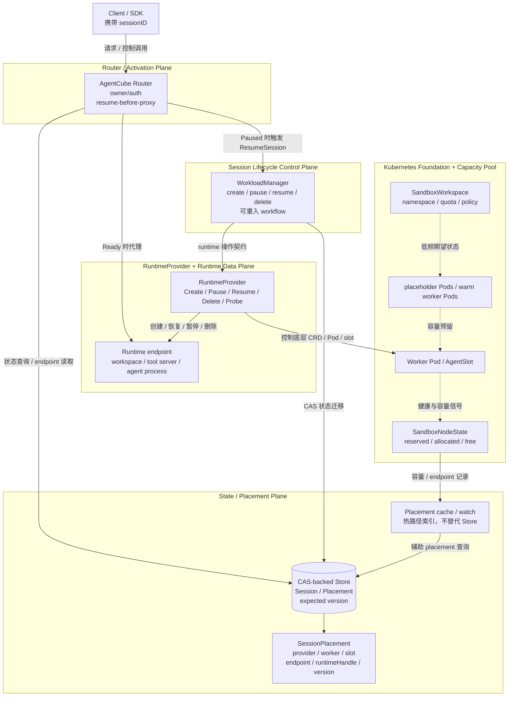

> 注释：图里的核心设计不是“把所有请求都塞进 Kubernetes”，而是拆成五类不同的系统面：Router 负责激活入口，WorkloadManager 负责生命周期，Store 负责高频一致性状态，RuntimeProvider 负责屏蔽底层 runtime 差异，Kubernetes 负责低频资源边界和容量池。

### 连线语义

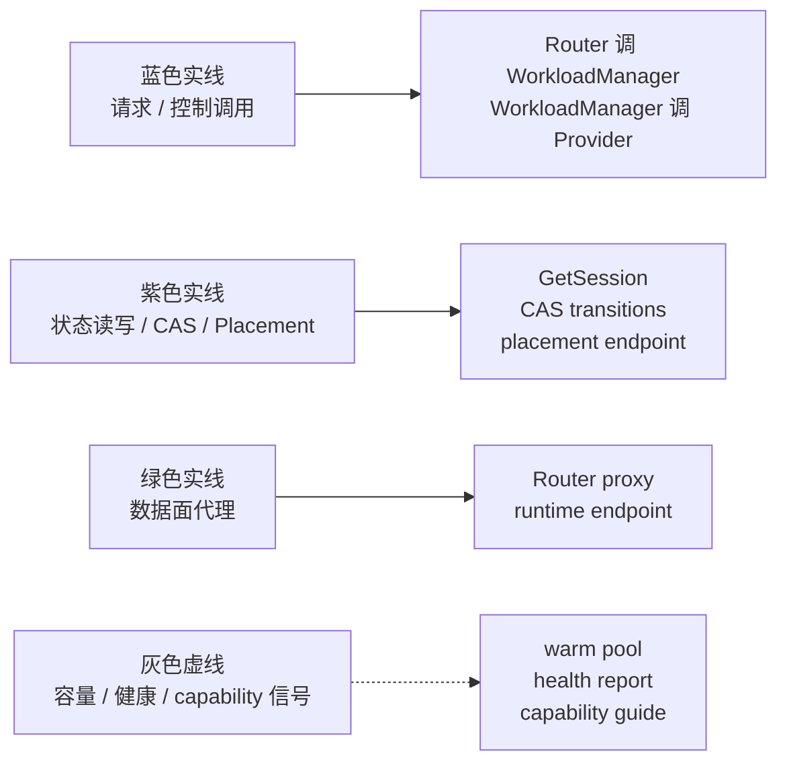

> 分析：这些线不是同一种“调用”。把数据面、控制面、状态面和容量信号分开，是为了避免把旧 endpoint、runtime identity、session identity 和 worker capacity 混成一个概念。

## 2. 为什么要这样分层

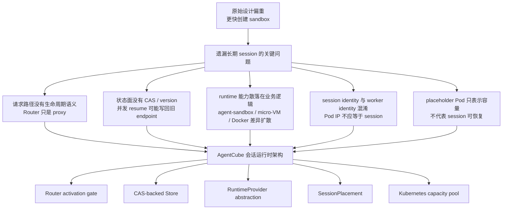

> 注释：Kubernetes 非常适合承载 namespace、quota、Pod、CRD、RBAC 这类低频期望状态，但不适合把每一次 session 状态跳转都放进 apiserver 热路径。高频状态应该落到低延迟 Store，并用 CAS 保证并发正确性。

## 3. 真实请求流转：Ready session

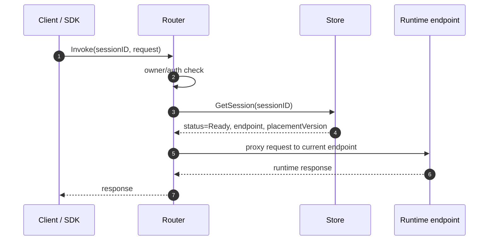

> 分析：Ready 路径里，Router 仍然不能绕过 Store。原因是 endpoint 只是 `SessionPlacement` 的一个结果，可能在上一次 resume、迁移或 failover 后变化。Router 每次进入前至少要确认 session 状态和 endpoint 是否可信。

## 4. 真实请求流转：Paused session 恢复后再代理

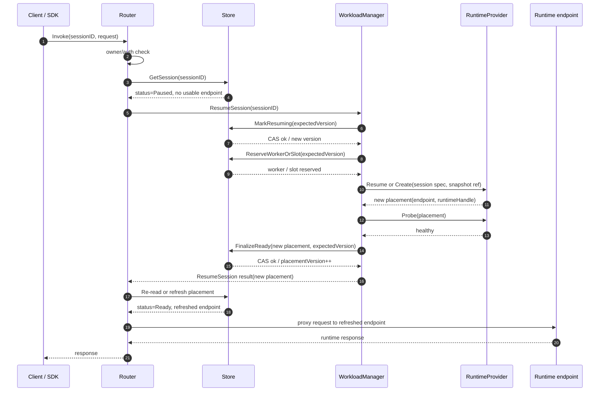

> 注释：关键点是“resume-before-proxy”。Router 不能拿 Paused 时留下的旧 endpoint 直接转发；恢复完成后必须使用 WorkloadManager 返回的新 placement，或者重新读 Store 获得最新 endpoint。

## 5. Session 状态机

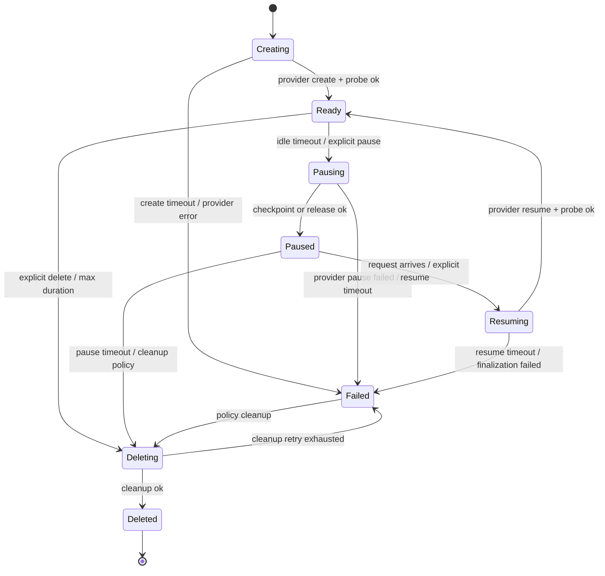

> 分析：`Paused`、`Resuming`、`Ready` 不能只是 UI 字段。它们决定 Router 是否可以 proxy、GC 是否可以删除、Store endpoint 是否可信、SDK 是否还能继续使用同一个 session id。

## 6. Pause / Resume workflow 为什么要拆成 CAS 步骤

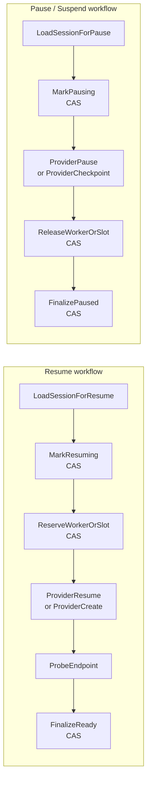

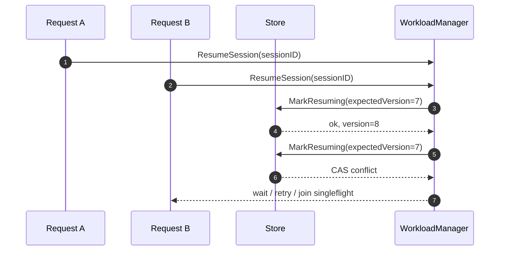

> 注释：CAS 是 Compare-And-Swap。它的价值不是“更快”，而是保证并发状态机正确：只有当前版本仍等于读取时的版本，才允许写入。没有 CAS 时，两个并发 resume 可能重复启动 runtime，或者把旧 endpoint 写回 Store。

## 7. RuntimeProvider 抽象

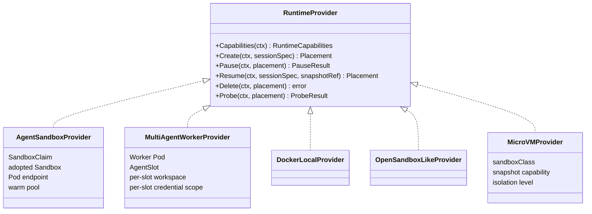

> 分析：Provider-first 的好处是上层 API、Router、Store 不需要知道底层到底是 `SandboxClaim`、Pod、AgentSlot、Docker container 还是 micro-VM。底层升级时主要修改 provider adapter，而不是把 CRD 细节扩散到业务逻辑。

## 8. Kubernetes capacity pool 的真实职责

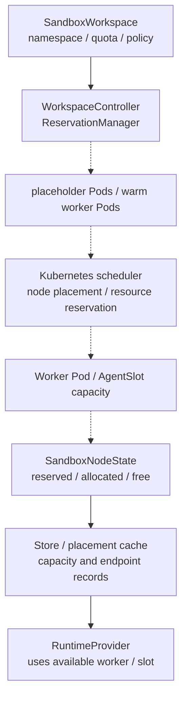

> 注释：placeholder Pod 和 warm worker Pod 解决的是容量与启动延迟问题，不解决 session 状态正确性。真正决定 session 是否 Ready、endpoint 是否可用、resume 是否完成的是 Store 状态机和 RuntimeProvider probe。

## 9. 数据面、控制面、状态面的边界

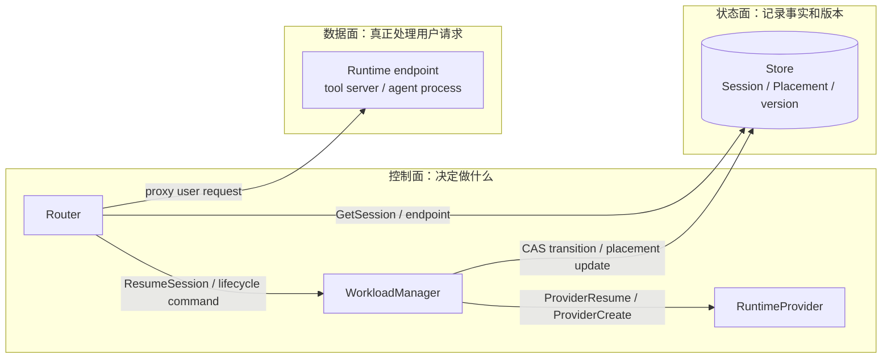

> 分析：这条边界能降低故障扩散。控制面失败不应伪装成数据面 endpoint 可用；状态面 CAS 冲突不应变成重复 runtime；数据面 runtime 挂掉后也应该通过 probe / reconcile 反馈到状态面，而不是让 Router 长期打旧 endpoint。

## 10. 失败补偿与 reconcile

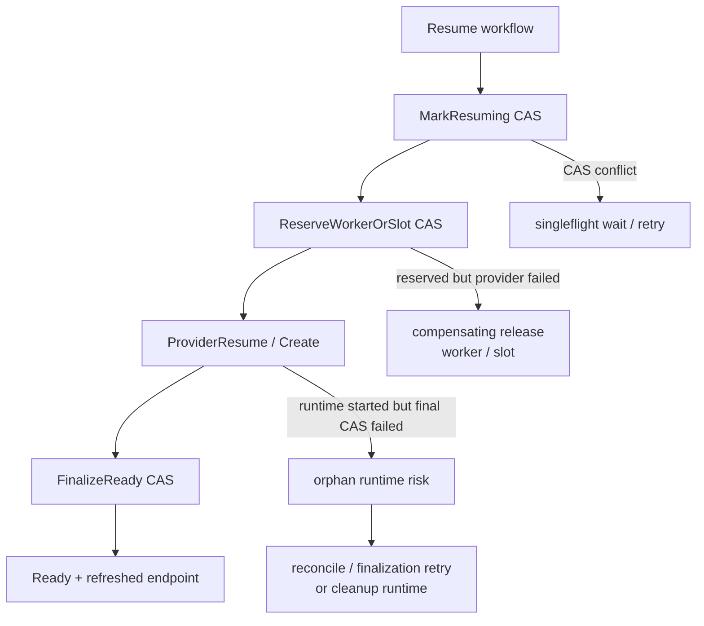

> 注释：分布式生命周期最危险的不是“某一步失败”，而是“底层 runtime 已经发生变化，但 Store 还没记录”。所以需要 finalization retry、orphan cleanup 和 reconcile，而不能只依赖一次同步函数返回。

## 11. 为什么这个设计更好

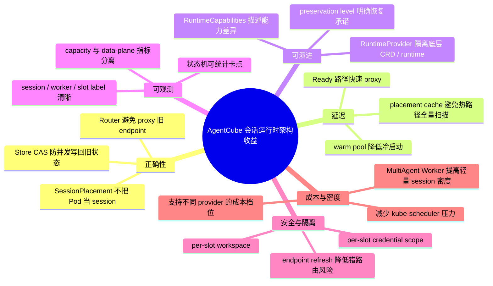

> 分析：这个架构的核心价值不是多画几层，而是把“长期会话”作为一等对象。资源池负责容量，Router 负责激活，Store 负责事实，Provider 负责 runtime，Runtime endpoint 负责真正执行。每一层职责清楚后，测试、调试和后续演进都会更可控。

## 12. 与当前实现和后续阶段的关系

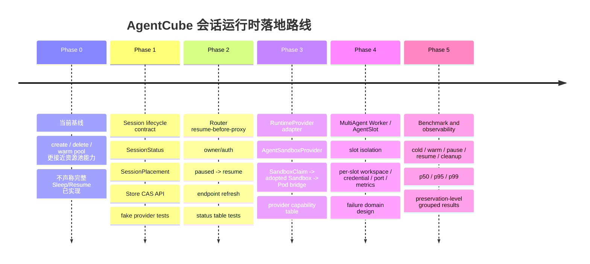

> 注释：这张图应该被理解成目标架构和分阶段设计，不是“一次性大重构”。最小可落地点是先把 Session 状态机、Store CAS 和 Router resume-before-proxy 的 contract 定清楚，再逐步包进真实 provider。

