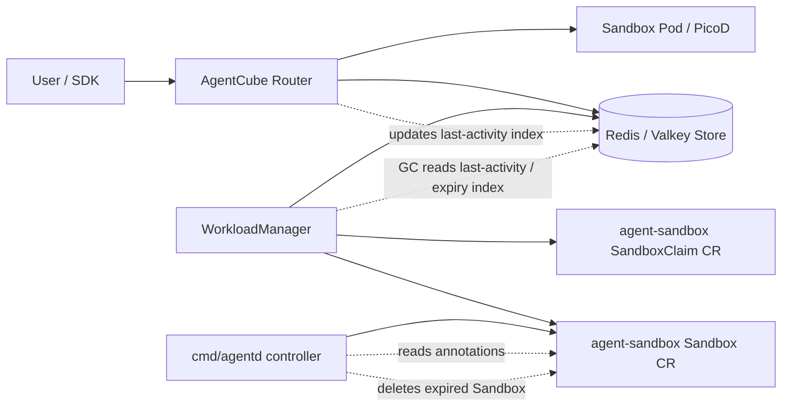

# Day 29：先分析 `cmd/agentd` 组件的作用

日期：2026-06-25

本报告先只做组件定位，不改代码，不发 upstream 评论。

分析对象：

- GitHub URL：<https://github.com/volcano-sh/agentcube/tree/main/cmd/agentd>
- 本地基线：`upstream/main` commit `bed6bd4cb9d965706e132aea9f252a3340849935`
- 代码范围：`cmd/agentd/main.go`、`pkg/agentd/agentd.go`、`pkg/agentd/agentd_test.go`
- 关联链路：`pkg/workloadmanager/*`、`pkg/router/handlers.go`、`pkg/store/*`

> 注释：这里的 `agentd` 名字容易误导。按名字看像是 sandbox 内部的 agent daemon，但当前 `main` 源码里它实际是一个 Kubernetes controller，监听 `agent-sandbox` 的 `Sandbox` CR，然后基于 last-activity 注解做 idle 删除。真正负责 code execution / file API / JWT 校验的默认 sandbox 内 daemon 是 `picod`，不是当前这个 `agentd`。

## 一句话结论

当前 `cmd/agentd` 是 AgentCube 对 `agent-sandbox` `Sandbox` CR 的轻量级 idle-timeout controller：

1. 它启动一个 `controller-runtime` manager。
2. 它把 Kubernetes core scheme 和 `sigs.k8s.io/agent-sandbox/api/v1alpha1` scheme 注册进去。
3. 它 watch `Sandbox` CR。
4. 每次 reconcile 一个 `Sandbox` 时，读取 `last-activity-time` 和 `runtime.agentcube.io/idle-timeout` 注解。
5. 如果 sandbox 已超过 idle timeout，就删除这个 `Sandbox` CR。
6. 如果还没过期，就 `RequeueAfter` 到过期时间。
7. 如果没有 `last-activity-time` 注解，当前逻辑不删除、不重排队。

所以它更接近一个“基于 Kubernetes CR 注解的 sandbox idle 回收器”，不是 Router、不是 WorkloadManager、也不是 PicoD。

## 入口文件做了什么

`cmd/agentd/main.go` 很短，核心只有三步。

第一步：注册 scheme。

```go
utilruntime.Must(scheme.AddToScheme(schemeBuilder))
utilruntime.Must(sandboxv1alpha1.AddToScheme(schemeBuilder))
```

这里说明 `agentd` 需要读写 Kubernetes API 对象，尤其是 `agent-sandbox` 的 `Sandbox` CR。

> 注释：scheme 可以理解成 controller-runtime 认识哪些 Kubernetes 对象类型的注册表。如果没有把 `Sandbox` 类型加进去，client 不能把 API server 里的 JSON/YAML 对象正确解码成 Go struct。

第二步：创建 controller-runtime manager。

```go
mgr, err := ctrl.NewManager(ctrl.GetConfigOrDie(), ctrl.Options{
    Scheme: schemeBuilder,
    Metrics: metricsserver.Options{
        BindAddress: "0",
    },
    HealthProbeBindAddress: "0",
})
```

这里用了 `ctrl.GetConfigOrDie()`，说明它依赖 Kubernetes kubeconfig / in-cluster config。它不是一个普通 HTTP runtime daemon，而是需要连 Kubernetes API server 的控制器进程。

当前入口还显式关闭了 metrics server 和 health probe server：

- `Metrics.BindAddress: "0"`
- `HealthProbeBindAddress: "0"`

这意味着当前 `agentd` 没有暴露 Prometheus metrics，也没有暴露 controller-runtime health probe。

第三步：注册 controller。

```go
err = ctrl.NewControllerManagedBy(mgr).
    For(&sandboxv1alpha1.Sandbox{}).
    Complete(&agentd.Reconciler{
        Client: mgr.GetClient(),
        Scheme: mgr.GetScheme(),
    })
```

这一段是最关键的定位证据：`agentd` 监听的是 `Sandbox` CR，不是 Pod、不是 AgentRuntime、不是 CodeInterpreter。

## Reconcile 逻辑

`pkg/agentd/agentd.go` 的 `Reconcile` 逻辑可以拆成下面几段。

### 1. 读取 Sandbox

```go
sandbox := &sandboxv1alpha1.Sandbox{}
err := r.Get(ctx, req.NamespacedName, sandbox)
```

如果对象不存在，直接返回成功：

```go
if errors.IsNotFound(err) {
    return ctrl.Result{}, nil
}
```

这符合 Kubernetes controller 常见写法：删除事件或 cache 延迟可能导致 reconcile 时对象已经没了，这不是错误。

### 2. 读取 last activity 注解

```go
lastActivityStr, exists := sandbox.Annotations[workloadmanager.LastActivityAnnotationKey]
```

这个 key 来自 `pkg/workloadmanager/k8s_client.go`：

```go
LastActivityAnnotationKey = "last-activity-time"
```

如果注解不存在，或者值为空，当前 `agentd` 不做任何事情：

```go
if exists && lastActivityStr != "" {
    ...
}
return ctrl.Result{}, nil
```

> 分析：这是当前实现的一个重要边界。`agentd` 不是按 Sandbox 创建时间兜底删除，也不是扫描 Store；它只对带有 `last-activity-time` 注解的 Sandbox 生效。

### 3. 解析时间

```go
lastActivity, err = time.Parse(time.RFC3339, lastActivityStr)
if err != nil {
    return ctrl.Result{RequeueAfter: 30 * time.Second}, err
}
```

如果注解格式非法，controller 返回 error，并要求 30 秒后重试。

> 注释：`time.RFC3339` 是一种标准时间格式，例如 `2026-06-25T10:00:00Z`。这里选择标准格式的好处是跨语言、跨组件都容易解析；坏处是如果写入方格式不严格，controller 会持续报错重试。

### 4. 计算过期时间

默认过期时间：

```go
expirationTime := lastActivity.Add(workloadmanager.DefaultSandboxIdleTimeout)
```

默认 idle timeout 来自 `pkg/workloadmanager/k8s_client.go`：

```go
DefaultSandboxIdleTimeout = 15 * time.Minute
```

如果 Sandbox 有自定义 idle timeout 注解，则使用自定义值：

```go
if timeoutStr, exists := sandbox.Annotations[workloadmanager.IdleTimeoutAnnotationKey]; exists && timeoutStr != "" {
    if customTimeout, err := time.ParseDuration(timeoutStr); err == nil && customTimeout > 0 {
        expirationTime = lastActivity.Add(customTimeout)
    }
}
```

`IdleTimeoutAnnotationKey` 是：

```go
IdleTimeoutAnnotationKey = "runtime.agentcube.io/idle-timeout"
```

非法、零值、负数的自定义 timeout 都会被忽略，回退到默认 15 分钟。

### 5. 删除或重排队

如果当前时间已经超过过期时间：

```go
if time.Now().After(expirationTime) {
    if err := r.Delete(ctx, sandbox); err != nil {
        if !errors.IsNotFound(err) {
            return ctrl.Result{}, err
        }
    }
}
```

如果还没过期：

```go
return ctrl.Result{RequeueAfter: time.Until(expirationTime)}, nil
```

> 注释：`RequeueAfter` 是 controller-runtime 的定时重试机制。它不需要自己启动 goroutine 或 sleep，而是告诉 controller-runtime 在指定时间后再次 reconcile。

## 测试证明了什么

`pkg/agentd/agentd_test.go` 用 fake Kubernetes client 覆盖了当前 controller 的主要行为。

已覆盖的行为：

| 测试场景 | 当前行为 |
| --- | --- |
| Sandbox 没有 `last-activity-time` | 不删除，不 requeue |
| `last-activity-time` 为空字符串 | 不删除，不 requeue |
| 最近有活动 | 不删除，按剩余时间 requeue |
| 正好到默认过期边界 | 删除 |
| 超过默认过期时间 | 删除 |
| 自定义短 timeout 已过期 | 删除 |
| 自定义长 timeout 未过期 | requeue |
| 自定义 timeout 非法 | 回退默认 timeout |
| 自定义 timeout 为负数或 0 | 回退默认 timeout |
| Sandbox 不存在 | 忽略 NotFound |
| last activity 时间格式非法 | 返回 error，并 30 秒后重试 |
| last activity 在未来 | 不删除，requeue 到未来过期点 |

这个测试集说明当前 `agentd` 的产品语义非常窄：它只负责 annotation-driven idle deletion。

## 和 WorkloadManager / Router / Store 的关系

当前 AgentCube 主链路可以拆成三条状态输入。

### 1. WorkloadManager 创建 Sandbox 时写 idle timeout 注解

`pkg/workloadmanager/workload_builder.go` 创建 direct `Sandbox` 时会写：

```go
Annotations: map[string]string{
    IdleTimeoutAnnotationKey: params.idleTimeout.String(),
}
```

创建 `SandboxClaim` 时也会写：

```go
Annotations: map[string]string{
    IdleTimeoutAnnotationKey: idleTimeout.String(),
}
```

也就是说 WorkloadManager 会把“这个 session 的 idle timeout 是多久”放进 Kubernetes 资源注解里。

### 2. Router 更新的是 Store 的 last-activity index

`pkg/router/handlers.go` 在代理请求前后都会调用：

```go
s.storeClient.UpdateSessionLastActivity(c.Request.Context(), sandbox.SessionID, time.Now())
```

这个更新的是 Redis / Valkey 里的 last-activity sorted set，不是 Kubernetes Sandbox CR 的 `last-activity-time` 注解。

> 分析：这就是当前 `agentd` 和主链路之间最关键的断点。`agentd` 读取 Kubernetes 注解；Router 更新 Store index。除非另一个组件把 Store last activity 同步回 Sandbox annotation，否则 `agentd` 不会因为正常 Router 请求自动刷新 idle 时间。

### 3. WorkloadManager GC 使用 Store index 做主线回收

`pkg/workloadmanager/garbage_collection.go` 当前会：

1. 从 Store 查 last-activity 过旧的 session。
2. 按每个 `SandboxInfo.IdleTimeout` 再判断是否真的过期。
3. 从 Store 查 TTL 到期的 session。
4. 合并去重。
5. 删除 Kubernetes `Sandbox` 或 `SandboxClaim`。
6. 删除 Store 里的 session 记录。

这条链路和 Router 的 Store update 是一致的。

> 分析：从当前 `main` 的实际代码看，WorkloadManager GC 才是和 Router last-activity 更新闭环的主回收路径。`agentd` 的 annotation-based 删除更像早期设计、备用路径或局部遗留逻辑。

## 它不是哪些组件

### 不是 PicoD

PicoD 是 sandbox 内部默认 code interpreter daemon，负责执行命令、文件读写、验证 Router 签发的 JWT。

当前 `agentd` 没有：

- HTTP route。
- command execution。
- file API。
- workspace 管理。
- JWT 验证。
- Router reverse proxy 入口。

所以当前不能把 `agentd` 解释成“用户代码执行服务”。

### 不是 WorkloadManager

WorkloadManager 负责：

- 接收创建 session API。
- 创建 `Sandbox` / `SandboxClaim`。
- 等待 Sandbox ready。
- 写 Store。
- 提供 delete session。
- 跑 Store-based GC。

当前 `agentd` 只 watch `Sandbox` CR，并按注解删除它。

### 不是 Router

Router 负责：

- 根据 session ID 查 Store。
- 做 owner / RLAC 检查。
- 反向代理到 sandbox entrypoint。
- 刷新 Store last-activity。

当前 `agentd` 不在请求路径上。

## 当前文档和源码有不一致

当前 docs 里有两处容易误导：

- `docs/agentcube/docs/developer-guide/project-structure.md` 说 `pkg/agentd/` 是 runs inside sandboxes 的 daemon。
- `docs/agentcube/docs/developer-guide/building-runtimes.md` 说自定义 runtime 可以基于 `ghcr.io/volcano-sh/agentd:latest`，并把 `agentd` 放进 ENTRYPOINT。

但按当前 `cmd/agentd/main.go`：

- 它需要 `ctrl.GetConfigOrDie()` 连接 Kubernetes API。
- 它注册 Kubernetes controller。
- 它 watch `Sandbox` CR。
- 它没有 sandbox 内执行 API。

所以更准确的当前描述应该是：

> `agentd` currently implements a controller for agent-sandbox `Sandbox` CR idle cleanup, while `picod` is the default in-sandbox daemon for code execution and file operations.

> 分析：这类文档漂移很常见，尤其是项目早期组件命名和职责还在变化时。做 review 或 proposal 时，优先相信当前源码和测试，不要只按目录名或旧文档推断职责。

## 当前实现的风险和问题面

### 1. last-activity 来源不闭环

`agentd` 读取 `Sandbox` annotation：

- `last-activity-time`
- `runtime.agentcube.io/idle-timeout`

Router 更新 Store：

- Redis / Valkey `lastActivityIndexKey`

WorkloadManager GC 也读 Store。

当前没有看到主线代码把 Router 的 last activity 写回 `Sandbox` annotation。

影响：

- 如果 Sandbox 没有 `last-activity-time` 注解，`agentd` 不会管理它。
- 如果某个旧路径写了 `last-activity-time`，但 Router 后续只更新 Store，Kubernetes 注解可能变旧，`agentd` 可能按旧注解删除仍然活跃的 Sandbox。
- 如果 `agentd` 和 WorkloadManager GC 同时启用，可能存在双重删除；当前删除 NotFound 被忽略，所以结果大概率可恢复，但可观测性和责任边界会变复杂。

### 2. 它只删除 Sandbox，不处理 Store

`agentd` 只调用：

```go
r.Delete(ctx, sandbox)
```

它没有调用 `DeleteSandboxBySessionID` 删除 Store 记录。

影响：

- 如果 `agentd` 独立删除了 Sandbox，Store 里可能还保留 session。
- Router 后续按 session 查到旧 entrypoint，可能转发失败，直到 WorkloadManager GC 或 delete API 清理 Store。

> 分析：这再次说明 `agentd` 不像完整 session lifecycle owner。完整 owner 应该同时维护 Kubernetes runtime 状态和 Store session 状态。

### 3. 它不处理 SandboxClaim

当前 `cmd/agentd` controller 只 `For(&sandboxv1alpha1.Sandbox{})`。

但 AgentCube 支持 direct `Sandbox` 和 warm-pool `SandboxClaim` 两条路径。WorkloadManager GC 能按 `Kind` 删除 `Sandbox` 或 `SandboxClaim`，而 `agentd` 只处理 `Sandbox`。

影响：

- 对 warm-pool claim path 来说，`agentd` 不是完整回收路径。
- 如果 claim 和 adopted sandbox 的 owner / lifecycle 关系变化，`agentd` 直接删 Sandbox 是否等价于删除 Claim，需要结合 agent-sandbox controller 行为验证。

### 4. 没有 metrics 和 health probe

入口关闭了 metrics 和 health probe。

影响：

- 如果这个 controller 真要生产部署，缺少 “删除了多少 sandbox / requeue 多少 / parse error 多少 / delete error 多少” 这类指标。
- 排查 idle deletion 行为时只能靠日志和 Kubernetes event，而当前代码没有 event recorder。

### 5. 文档命名会影响新人理解

`agentd` 名字和 docs 当前描述会让新人以为它是 sandbox 内 daemon。实际从源码看，它是 Kubernetes controller。

影响：

- 调试 code execution 问题时可能误读 `agentd`，但应该看 `picod`。
- 调试 idle cleanup 问题时可能忽略 WorkloadManager GC 和 Store last-activity index。

## 和 Sleep/Resume 方向的关系

Day24 / Day25 已经把 Sleep/Resume 方向拆成 Store 状态/CAS、Router resume-before-proxy、WorkloadManager lifecycle service、RuntimeProvider capability。

放到这个框架里，当前 `agentd` 的角色很有限：

- 它不是 pause/resume provider。
- 它没有 session state machine。
- 它不懂 `ready / paused / resuming / failed`。
- 它不会刷新 entrypoint。
- 它不会更新 Store 状态。

所以 Sleep/Resume 不应该直接建立在当前 `agentd` 逻辑上。更合理的方向是：

1. WorkloadManager 继续作为 session lifecycle owner。
2. Router 在请求路径做 resume-before-proxy。
3. Store 保存 session 状态、entrypoint、last activity、pause expiry。
4. RuntimeProvider 封装底层 agent-sandbox / Kuasar / future substrate 能力。
5. 如果未来保留 `agentd`，它应该明确是 node/runtime-side controller 还是 CR idle cleanup controller，不能和 PicoD 混名。

> 分析：当前 `agentd` 最有价值的参考点不是“实现 resume”，而是暴露了一个设计教训：生命周期控制不能散落在多个互相不同步的数据源里。last-activity 如果一份在 Store、一份在 Kubernetes annotation，就必须定义哪一个是 source of truth。

## 当前组件关系图



> 注释：图里的虚线表示“状态/控制信号”，不是用户请求流。用户请求路径是 `User -> Router -> Sandbox Pod / PicoD`，`agentd` 不在这条请求路径上。

## 初步判断

当前 `cmd/agentd` 可以先这样理解：

| 维度 | 判断 |
| --- | --- |
| 组件类型 | Kubernetes controller |
| 监听对象 | `sigs.k8s.io/agent-sandbox/api/v1alpha1.Sandbox` |
| 主职责 | 基于 `last-activity-time` 和 `runtime.agentcube.io/idle-timeout` 注解删除 idle Sandbox |
| 是否在用户请求路径上 | 否 |
| 是否执行用户代码 | 否 |
| 是否管理 Store session | 否 |
| 是否支持 Sleep/Resume | 否 |
| 当前主线回收是否依赖它 | 从源码看，主线更依赖 WorkloadManager GC + Store last-activity |
| 最大疑点 | `agentd` 读 Kubernetes 注解，Router / WorkloadManager GC 用 Store last-activity，数据源不统一 |

## 实际项目运行中是否使用

追加确认时间：2026-06-25

结论：按当前 `upstream/main bed6bd4` 和本机当前 AgentCube 集群状态看，`agentd` 没有进入官方默认运行路径。

这里要区分四层：

| 层级 | 是否使用 `agentd` | 证据 |
| --- | --- | --- |
| Go 二进制构建 | 会构建 | `Makefile` 有 `build-agentd`，`build-all` 也会调用它 |
| Docker / release 镜像 | 不发布 `agentd` 镜像 | `build-push-release.yml` 只 push `workloadmanager`、`agentcube-router`、`picod` |
| Helm chart 部署 | 不部署 | `manifests/charts/base/values.yaml` 只有 router / workloadmanager image；`helm template` 输出只有 `agentcube-router` 和 `workloadmanager` Deployment |
| e2e / sample workload | 不使用 | CodeInterpreter fixture 使用 `picod:latest`；AgentRuntime echo fixture 使用 `python:3.9-slim` |
| 当前本机集群 | 未运行 | `kubectl get deploy,pods` 只看到 redis、agentcube-router、workloadmanager，以及若干 `picod` CodeInterpreter Pod，没有 `agentd` Pod / container / image |

执行过的确认命令：

```bash
rg -n "agentd|AgentD|cmd/agentd|build-agentd|ghcr.io/volcano-sh/agentd|volcano-sh/agentd" . \
  -g '!docs/agentcube/node_modules/**' \
  -g '!internship-reports/**' \
  -g '!PROGRESS.md'
```

结果只命中源码、Makefile、文档、e2e 日志注释，没有命中 Helm Deployment 或 Dockerfile。

```bash
helm template agentcube manifests/charts/base --namespace agentcube | rg -n "agentd|picod|workloadmanager|agentcube-router|image:"
```

结果只出现：

- `ghcr.io/volcano-sh/agentcube-router:latest`
- `ghcr.io/volcano-sh/workloadmanager:latest`

没有 `agentd`。

```bash
kubectl get pods -A -o custom-columns='NAMESPACE:.metadata.namespace,NAME:.metadata.name,CONTAINERS:.spec.containers[*].name,IMAGES:.spec.containers[*].image' \
  | rg -i 'agentd|agentcube|workloadmanager|router|picod|redis'
```

当前本机集群只看到：

- `agentcube-router`：`ghcr.io/volcano-sh/agentcube-router:latest`
- `workloadmanager`：`ghcr.io/volcano-sh/workloadmanager:latest`
- `redis`：`redis:7-alpine`
- CodeInterpreter sandbox：`ghcr.io/volcano-sh/picod:latest`

没有 `agentd`。

> 分析：`agentd` 当前属于“仓库里仍保留并可编译的组件”，但不是“官方 release / chart / e2e 默认会启动的组件”。如果没有用户手工运行 `bin/agentd`、自定义镜像或自定义 Deployment，它不会参与实际请求链路，也不会参与当前集群的 sandbox 回收。

这也解释了为什么当前运行系统还能正常工作：实际 runtime path 是：

```text
SDK / user
  -> AgentCube Router
  -> Redis / Valkey Store
  -> WorkloadManager create / delete / GC
  -> agent-sandbox Sandbox / SandboxClaim
  -> sandbox Pod
  -> PicoD or user Agent container
```

而不是：

```text
SDK / user
  -> AgentD
```

更不是：

```text
sandbox Pod
  -> AgentD
```

当前文档中 “PicoD / AgentD” 混写，容易让读者误会 `agentd` 是默认沙箱内 daemon；但从实际部署看，默认沙箱内 daemon 是 `picod`。

## 清理 agentd 的 PR 工作记录

追加工作时间：2026-06-25

mentor 反馈确认：`agentd` 确实是早期设计留下来的组件，当前项目已经不用了。因此本轮从“组件分析”进入“干净删除 upstream PR 准备”。

本轮 `/goal`：

> Create a clean upstream PR branch that removes the unused agentd component, validates the codebase, and records the Day29/goal notes on the intern branch.

> 注释：这里的“干净”有两个含义。第一，PR 分支必须从 `upstream/main` 切出，只包含删除 `agentd` 相关代码和必要引用更新。第二，中文实习报告、TODO、PROGRESS 等学习记录只留在 `intern` 分支，不能混进 upstream-facing PR。

### PR 分支状态

| 项目 | 结果 |
| --- | --- |
| PR 分支 | `cleanup/remove-unused-agentd` |
| base | `upstream/main bed6bd4cb9d965706e132aea9f252a3340849935` |
| fork remote | `origin` / `ranxi2001/agentcube` |
| commit | `31b840a979b833d5a7734ab07fb8b3797f079930 cleanup: remove unused agentd component` |
| push 状态 | 已推送到 `origin cleanup/remove-unused-agentd:cleanup/remove-unused-agentd` |
| fork CI PR | [ranxi2001/agentcube#8](https://github.com/ranxi2001/agentcube/pull/8)，fork-only `[WIP]` PR，用于先跑 GitHub Actions |
| upstream PR | 尚未创建；需要用户明确确认 title/body/target 后再发 |

本轮删除和更新范围：

| 类型 | 文件 / 位置 | 说明 |
| --- | --- | --- |
| 删除代码 | `cmd/agentd/main.go` | 移除未使用的 `agentd` binary entrypoint |
| 删除代码 | `pkg/agentd/agentd.go` | 移除 annotation-driven idle cleanup controller 实现 |
| 删除测试 | `pkg/agentd/agentd_test.go` | 组件删除后测试也删除 |
| 删除 ownership | `pkg/agentd/OWNERS` | 组件目录删除后不再需要 |
| 构建 | `Makefile` | 删除 `build-agentd`，`build-all` 不再构建 `agentd`，`clean` 不再删除 `bin/agentd` |
| 文档 | `CONTRIBUTING.md`、`.github/copilot-instructions.md` | build target 列表移除 `agentd` |
| 文档 | `docs/agentcube/docs/developer-guide/*.md`、`docs/agentcube/docs/architecture/components.md`、`docs/agentcube/docs/intro.md` | 将 AgentD / PicoD 混写改成当前真实的 PicoD / WorkloadManager / Router 口径 |
| e2e 日志 | `test/e2e/run_e2e.sh` | sandbox 日志描述不再说 `agentd` |
| Go module checksum | `go.sum` | `make gen-check` 执行 `go mod tidy` 后移除两个 stale `golang.org/x/oauth2 v0.36.0` checksum |

> 分析：这次没有引入替代实现，因为 `agentd` 当前不是默认 release、Helm、e2e 或请求路径组件。删除它不会改变 WorkloadManager / Router / PicoD 当前主链路；真正要保留的是文档里的职责边界，避免 reviewer 以为我们把 sandbox 内执行 daemon 删掉了。

### 验证结果

PR 分支上已跑过：

```bash
go list ./... | grep -v '^github.com/volcano-sh/agentcube/test/e2e$' | xargs go test -count=1
make lint
make build-all
make gen-check
go test ./test/e2e -run '^$' -count=1
git diff --check
cd docs/agentcube && npm ci && npm run build
```

结果：

| 验证项 | 结果 | 备注 |
| --- | --- | --- |
| 非 e2e Go 单测 | 通过 | 排除 `test/e2e`，因为完整 e2e 需要运行中的服务和集群环境 |
| `make lint` | 通过 | 删除组件后没有 lint 回归 |
| `make build-all` | 通过 | 现在只构建 `workloadmanager` 和 `agentcube-router` |
| `make gen-check` | 通过 | 提交后重跑通过；未留下 generated diff |
| e2e 静态编译检查 | 通过 | `go test ./test/e2e -run '^$' -count=1` |
| whitespace check | 通过 | `git diff --check` |
| docs build | 通过 | 先执行 `npm ci` 安装 Docusaurus 依赖；`npm run build` 成功，仅有 blog truncate 和 Browserslist stale warning |

删除后还做了全仓引用扫描：

```bash
rg -n "agentd|AgentD|PicoD / AgentD|PicoD/AgentD|ghcr.io/volcano-sh/agentd|cmd/agentd|pkg/agentd|build-agentd" . \
  -g '!docs/agentcube/node_modules/**' \
  -g '!internship-reports/**' \
  -g '!PROGRESS.md'
```

结果：PR 分支中没有剩余命中。

### Review 风险口径

| 风险 / reviewer 疑问 | 当前回答 |
| --- | --- |
| 这是不是 breaking change？ | 对手工运行 `make build-agentd` 或自定义部署 `agentd` 的用户是删除行为；但官方 release workflow、Helm chart、e2e 和默认 runtime path 都未使用 `agentd`，PR 口径应明确这是清理 unused initial-design component。 |
| 会不会影响 sandbox 内代码执行？ | 不会。当前 sandbox 内默认执行 daemon 是 `picod`，不是 `agentd`。 |
| 会不会影响 session GC？ | 当前主链路 GC 在 WorkloadManager / Store 里；`agentd` 自己读 Kubernetes annotation 的 idle cleanup 没有被默认部署。 |
| 为什么改 `go.sum`？ | `make gen-check` 会运行 `go mod tidy`。删除 `agentd` 后 tidy 保持当前 dependency graph，只额外清掉 upstream 已存在的 stale `golang.org/x/oauth2 v0.36.0` checksum。 |
| 为什么也改 docs？ | 文档中存在 `PicoD / AgentD` 混写，删除代码后必须把用户可见组件说明同步到当前真实组件。 |

### Upstream PR 草稿

建议 title：

```text
cleanup: remove unused agentd component
```

建议 body：

````markdown
**What type of PR is this?**

/kind cleanup

**What this PR does / why we need it**:

This PR removes the unused `agentd` component. `agentd` was part of an earlier design, but the current runtime path no longer starts or publishes it: release builds publish `workloadmanager`, `agentcube-router`, and `picod`; the Helm chart deploys Workload Manager and Router; CodeInterpreter sandboxes use PicoD.

Changes:
- Remove `cmd/agentd` and `pkg/agentd`.
- Remove `make build-agentd` and stop including it in `make build-all`.
- Update docs and e2e log collection wording to refer to PicoD/user containers instead of AgentD.
- Keep `go.sum` aligned with `go mod tidy` because `make gen-check` runs tidy.

**Which issue(s) this PR fixes**:

None.

**Special notes for your reviewer**:

This PR was prepared with AI assistance. I verified that `agentd` has no remaining references after the removal and that the default runtime path is still Workload Manager / Router / PicoD.

The `go.sum` change only removes stale `golang.org/x/oauth2 v0.36.0` checksum entries produced by `go mod tidy` during `make gen-check`.

Tests:
- `go list ./... | grep -v '^github.com/volcano-sh/agentcube/test/e2e$' | xargs go test -count=1`
- `make lint`
- `make build-all`
- `make gen-check`
- `go test ./test/e2e -run '^$' -count=1`
- `cd docs/agentcube && npm ci && npm run build`
- `git diff --check`

**Does this PR introduce a user-facing change?**:

```release-note
NONE
```
````

> 注释：upstream PR 还没有发。根据本地协作规则，创建 upstream PR、issue、review comment、maintainer mention 都需要用户明确确认目标仓库、title 和 body。

### Fork CI PR

用户要求先在个人 fork 跑 CI，因此已创建 fork-only validation PR：

- PR: <https://github.com/ranxi2001/agentcube/pull/8>
- Title: `[WIP] cleanup: remove unused agentd component`
- Base: `ranxi2001/agentcube:main`
- Head: `ranxi2001/agentcube:cleanup/remove-unused-agentd`
- Head SHA: `31b840a979b833d5a7734ab07fb8b3797f079930`
- 目的：只跑 fork GitHub Actions，不请求 upstream review，不准备合并到 fork `main`。

第一次 CI 已全绿；随后复查残留时发现 `docs/agentcube/docs/developer-guide/local-development.md` 仍有 `Picod (Agent Daemon)` 的语义残留。它不是 `agentd` 字符串残留，但会延续 PicoD / AgentD 混淆，因此已 amend 到同一个 cleanup commit，改成 `PicoD (Code Interpreter daemon)`，并 force-with-lease 更新 fork PR #8。

复查命令：

```bash
rg -n -i "agentd|build-agentd|cmd/agentd|pkg/agentd|ghcr.io/volcano-sh/agentd|Agent Daemon|agent daemon" . \
  -g '!docs/agentcube/node_modules/**' \
  -g '!internship-reports/**' \
  -g '!PROGRESS.md'
```

结果：没有命中。

更新后的 CI 状态：

- 已通过：`python-sdk-tests`、`Python Lint`、`Check for spelling errors`
- 运行中：Go build、Codegen Check、golangci-lint、e2e-test、coverage
- 另有 Netlify / Vercel / Cloudflare Pages checks 排队，属于预览类 integration，不是 AgentCube Go 主验证链路。

## 下一步建议

分析阶段已经结束，当前更合适的下一步是开 cleanup PR，而不是继续追功能实现。

1. 等 fork PR #8 的 CI 完整结果。
2. 如果 CI 失败，先在 fork 分支修复并重新跑，不通知 upstream。
3. 如果 CI 全绿，用户确认 upstream PR title/body 后，从 `ranxi2001:cleanup/remove-unused-agentd` 向 `volcano-sh/agentcube:main` 创建 upstream PR。
4. PR 说明里把 `agentd` 的历史/未使用性质讲清楚，避免 reviewer 误以为删除的是 PicoD。
5. 如果 reviewer 要求 issue 先行，再把本报告里的运行证据整理成英文 issue comment。

## 本轮没有做的事

- 没有创建 upstream PR；只准备并推送了 fork 分支，并创建了 fork-only CI PR。
- 没有修改当前 WorkloadManager / Router / PicoD 主链路行为。
- 没有跑完整 e2e 集群场景；本轮做的是单测、构建、lint、codegen、docs build 和 e2e package 静态检查。
