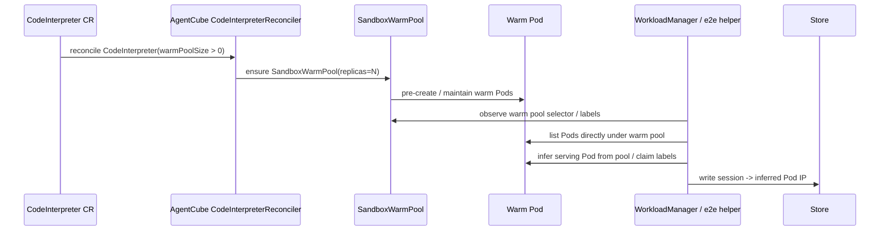
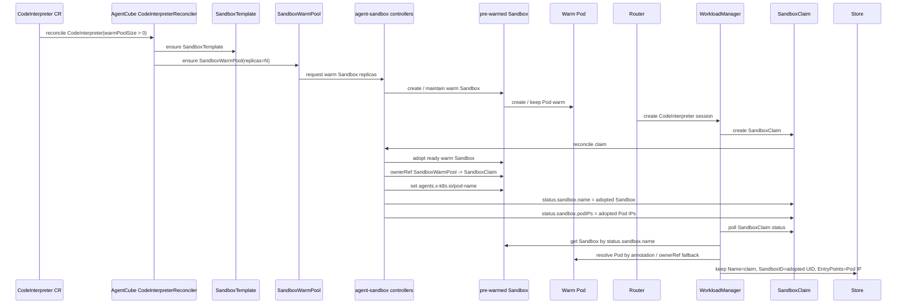
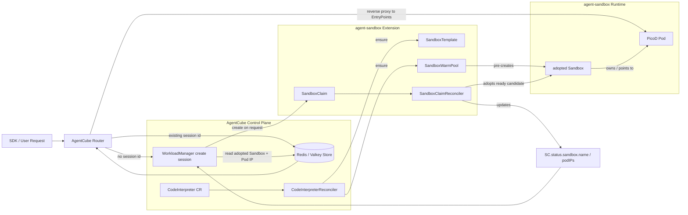
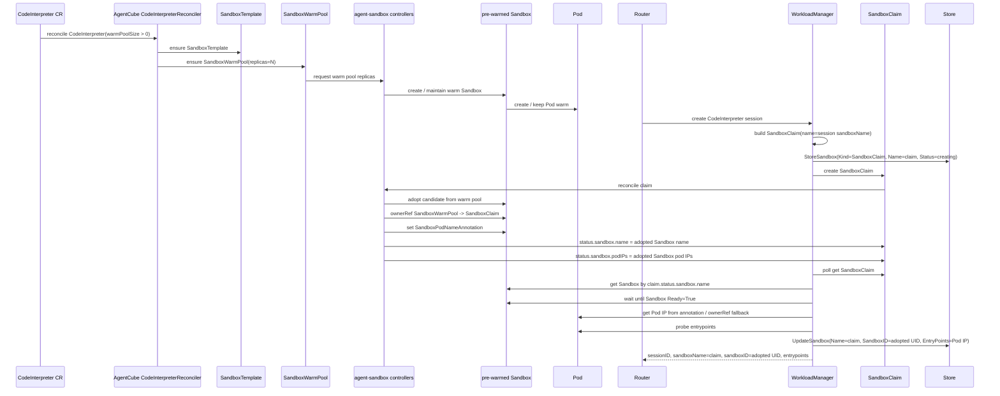
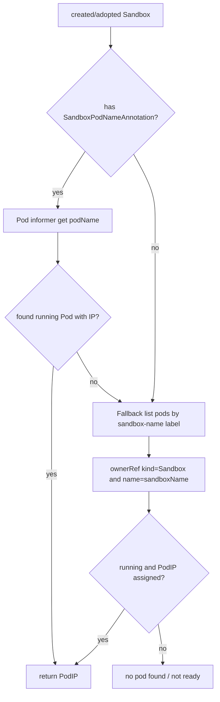
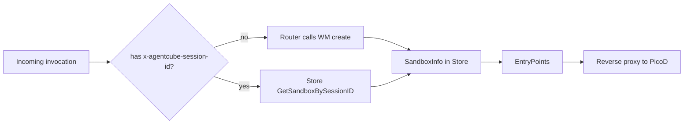
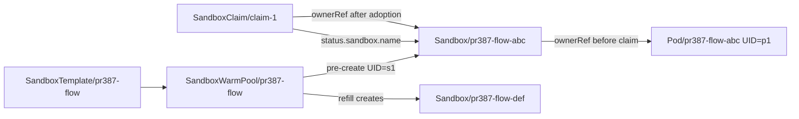
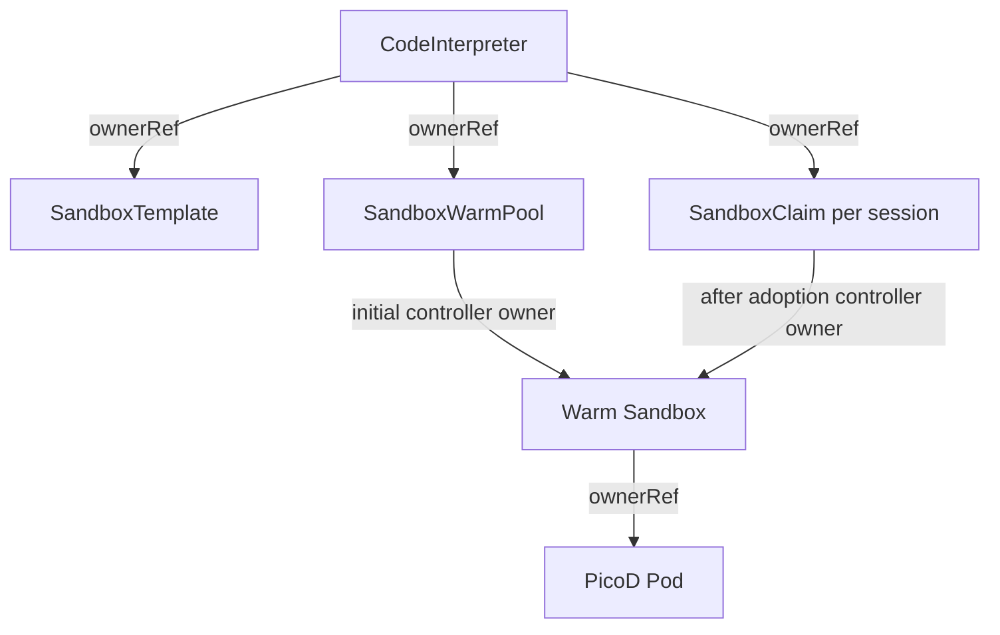
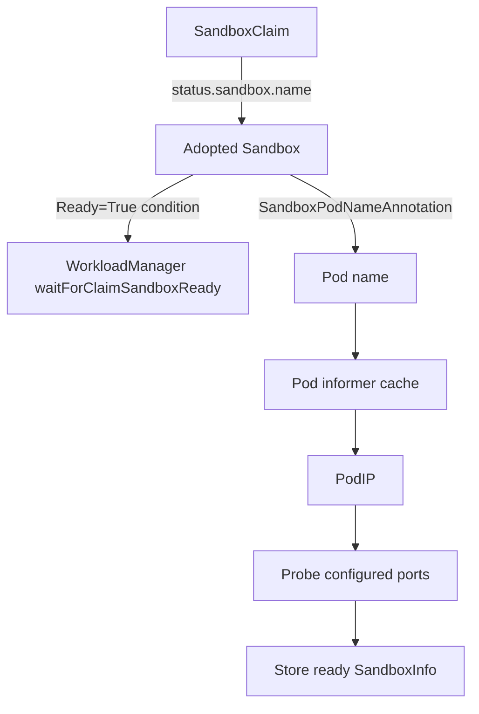
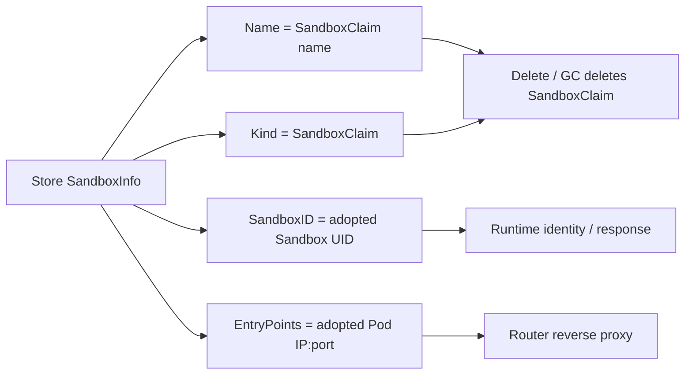

# Day 30：PR #387 Warm Pool Adoption 数据流 Review

日期：2026-06-25

## 结论先行

#387 不能只理解成“e2e 黑盒通过”。在本 PR scope 内，它已经把 AgentCube 对 `agent-sandbox v0.4.6` 的使用从 API 依赖层推进到运行时语义层对齐：

- API / dependency：Go module、import、CRD/GVR、generated client、codegen 与 `agent-sandbox v0.4.6` 的 `v1alpha1` 使用面完成对齐。
- Controller object flow：`CodeInterpreter` 维护 `SandboxTemplate` / `SandboxWarmPool`，warm pool 预热出来的是 `Sandbox -> Pod`，不是裸 Pod。
- Claim adoption：WorkloadManager 创建 `SandboxClaim` 后，通过 `SandboxClaim.status.sandbox.name` 找 serving Sandbox，而不是把 claim 名当 serving Sandbox 名。
- Runtime observation：AgentCube 通过 adopted Sandbox 的 `agents.x-k8s.io/pod-name` annotation 或 ownerRef fallback 找真实 Pod 和 Pod IP。
- Store / cleanup：Store 保留 `Kind=SandboxClaim`、`Name=<claim name>` 用于 delete / GC，同时 `SandboxID` 和 `EntryPoints` 来自 adopted Sandbox / Pod；删除 claim 后 adopted Sandbox/Pod 清理，warm pool refill。
- Evidence：unit / e2e / fork CI 覆盖代码路径；Day30 L1 白盒实测进一步验证了 UID continuity、ownerRef 转移、claim status bridge、warm pool refill 和 cleanup。

更准确的 reviewer 口径是：#387 is not just a black-box e2e pass; it aligns AgentCube with the actual `agent-sandbox v0.4.6` warm-pool runtime model within the PR scope.

> 通俗解释：可以把 warm pool 想成一排提前开好的机器。旧理解像是“池子里直接放着可用 Pod，拿到 Pod IP 就能用”；但 `agent-sandbox v0.4.6` 真实做法是“池子里提前放好 Sandbox，每个 Sandbox 下面才有真正跑代码的 Pod”。用户请求来了以后，AgentCube 不是直接拿 Pod，而是先创建一张 `SandboxClaim`，类似取号单。agent-sandbox controller 会把某个已经热好的 Sandbox 分配给这张取号单，并在 `SandboxClaim.status.sandbox.name` 里写清楚“你实际拿到的是哪个 Sandbox”。所以 #387 要做的关键事，就是沿着这张取号单找到真正的 Sandbox 和 Pod，把 Pod IP 写进 Store 给 Router 转发，同时 Store 里还要记住取号单名字，因为删除/回收时应该删 claim，而不是误删或找错那个真正的 Sandbox 名。我们这次 L1 白盒测试验证的不是“用户代码最后能跑出结果”这么粗的黑盒结果，而是验证这条取号、分配、找 Pod、写 Store、删除回收、warm pool 补位的链路每一步都真的按 v0.4.6 的模型发生了。

> Sandbox 和 Pod 的关系：`Sandbox` 不是 `Pod` 的新名字，也不是另一个容器。`Sandbox` 是 agent-sandbox 暴露给 AgentCube 的沙箱运行时对象，负责表达“这个沙箱是谁、属于哪个 warm pool 或 claim、是否 Ready、生命周期怎么清理、它对应哪个 Pod”。`Pod` 则是 Kubernetes 真正调度到节点上的运行实例，里面通常有一个 `code-interpreter` container，有 Pod IP，Router 最终转发请求时连接的是这个 Pod IP。可以简单理解为：Sandbox 是控制面/身份/生命周期层的对象，Pod 是数据面/进程/网络层的对象。#387 的关键修正就是不能跳过 Sandbox 直接按名字猜 Pod，而要先通过 `SandboxClaim.status.sandbox.name` 找到被分配的 Sandbox，再从这个 Sandbox 的 annotation 或 ownerRef 关系找到真实 Pod。

> PicoD 是什么：PicoD 是 AgentCube 放在默认 code-interpreter runtime 镜像里的一个小 HTTP daemon，不是 Kubernetes 控制器，也不是新的 Kubernetes 资源。Router 找到 Pod IP 以后，请求实际打到 Pod 里的 PicoD；PicoD 监听默认 `8080`，提供 `/health`，以及需要 JWT 鉴权的 `/api/execute` 和 `/api/files`。当用户通过 SDK/API 要执行代码或读写文件时，Router 只是转发请求，真正调用 `exec.CommandContext` 执行命令、限制工作目录、处理 stdout/stderr、上传下载文件的是 PicoD。这里说“用户代码”更准确地说是这个 runtime 镜像或 workspace 里的代码/依赖/文件，由 PicoD 在同一个 sandbox 运行环境里执行；不应理解成一定还有一个单独的“用户代码容器”。

目标：这次不再只解释 `agent-sandbox` API 接口适配，而是从实际项目运行流程理解 #387 的 warm pool adoption 数据流：warm pool 对象怎么创建、claim 怎么拿到 serving Sandbox、Pod 怎么被观测、WorkloadManager 为什么不能把 warm claim 当成同名 Sandbox 等待、Store 最终应该保存 claim 名还是 adopted Sandbox 名。

> 注释：reviewer 当前更关心的是“运行时数据如何流动”，不是“某个 Go package import 从哪个版本改到哪个版本”。因此本报告用 Mermaid 和源码证据解释 `CodeInterpreter -> SandboxTemplate / SandboxWarmPool -> SandboxClaim -> adopted Sandbox -> Pod -> Store -> Router` 的真实链路。

> 更正：本报告不应把“不使用 warm pool 的 direct Sandbox 路径”拿来和 “warm pool adoption 路径”做旧新对比。原来的实现也有 warm pool。正确对比对象是 warm pool 自身的观测模型：旧 helper / 旧理解更接近 `SandboxWarmPool -> Pod` 或从 claim 名直接推断 runtime 对象；#387 面对的 `agent-sandbox v0.4.6` 真实模型是 `SandboxWarmPool -> Sandbox -> Pod`，claim 通过 status 指向被 adopt 的 serving Sandbox。direct Sandbox 只作为 WorkloadManager 代码背景存在，不是本次 review 的主对照组。

## 一句话结论

#387 的核心不是简单把 `agent-sandbox` 升到 `v0.4.6`，而是修正 AgentCube 对 warm-pool 运行模型的假设：

- 旧 warm-pool 观测假设更像：从 `SandboxWarmPool -> Pod` 直接找 Pod，或者把 `SandboxClaim name` 当成 serving Sandbox / Pod 名去推断。
- #387 需要适配的真实模型是：`SandboxWarmPool -> pre-warmed Sandbox -> Pod`；请求到来后创建 `SandboxClaim`，`agent-sandbox` controller 从 warm pool 中 adopt 一个已有 Sandbox，并把 serving Sandbox 名写到 `SandboxClaim.status.sandbox.name`。
- AgentCube 必须通过 `SandboxClaim.status.sandbox.name` 找 adopted Sandbox，再从 adopted Sandbox 的 `agents.x-k8s.io/pod-name` annotation 或 owner/label 关系找到 Pod。
- Store 中仍应保存 `Kind=SandboxClaim` 和 `Name=<claim name>`，因为后续 delete / GC 应删除 claim；但 `SandboxID`、entrypoint、Pod IP 必须来自 adopted Sandbox / Pod。

Day30 追加了一轮 L1 white-box 实测，直接驱动 `SandboxTemplate` / `SandboxWarmPool` / `SandboxClaim` / `Sandbox` / `Pod`，不经过 CodeInterpreter API：

- 环境：临时 k3d 集群 `agentcube-flow-v046`，`agent-sandbox-controller:v0.4.6`，CRD storage version 均为 `v1alpha1`。
- 结果：warm pool 初始 Ready=2；创建 `SandboxClaim/pr387-claim-1` 后，`status.sandbox.name=pr387-flow2-q48z9`，该 Sandbox UID 保持不变并从 `SandboxWarmPool/pr387-flow2` 转移到 `SandboxClaim/pr387-claim-1`；Pod UID 也保持不变；warm pool refill 后仍为 Ready=2。
- 删除：删除 claim 后，adopted Sandbox 和 Pod 被清理，warm pool 剩余 2 个 ready Sandbox/Pod，没有 orphan runtime object。
- 原始证据：`internship-reports/benchmarks/day30-pr387-warmpool-flow/`。

> 分析：这就是 #387 最容易被误解的地方。对 Router 来说，它只需要 Store 里的 `EntryPoints` 转发请求；对 WorkloadManager delete/GC 来说，它需要知道删的是 `SandboxClaim` 还是 direct `Sandbox`。所以 warm path 的 Store 记录天然包含两种身份：控制身份是 claim，运行身份是 adopted Sandbox/Pod。

## 两张序列图：旧观测假设 vs v0.4.6 真实流转

下面两张是 reviewer 最容易看懂的“竖线图”。注意第一张不是 no-warm-pool direct Sandbox 路径，而是旧 warm-pool 观测 / 测试 helper 更接近的模型：把 warm pool 看成直接产出 Pod，或者从 claim / pool label 直接推断 serving Pod。

### 1. 旧 warm-pool 观测假设：SandboxWarmPool -> Pod



> 注释：这张图描述的是旧观测假设和测试 helper 视角，不是 #387 目标版本的完整 runtime truth。它的问题是缺少 `SandboxClaim.status.sandbox.name` 这个 bridge，也看不到被 adopt 的 Sandbox UID / ownerRef 转移。

### 2. v0.4.6 真实流转：SandboxWarmPool -> Sandbox -> Pod，再由 Claim adopt



> 分析：第二张才是 #387 需要适配的数据流。核心不是“有无 warm pool”，而是 warm pool 中间多了 serving `Sandbox`，claim 通过 status 指向它；Store 也必须同时保存 claim identity 和 runtime identity。

## 本地基线

- PR: <https://github.com/volcano-sh/agentcube/pull/387>
- 当前 head：`c2633c5 fix: reduce sandbox create handler complexity after rebase`
- 本地分支：`rebase/pr387-on-bed6bd4`
- base：`upstream/main bed6bd4`
- 关注文件：
  - `pkg/workloadmanager/codeinterpreter_controller.go`
  - `pkg/workloadmanager/workload_builder.go`
  - `pkg/workloadmanager/handlers.go`
  - `pkg/workloadmanager/k8s_client.go`
  - `pkg/workloadmanager/sandbox_helper.go`
  - `pkg/workloadmanager/handlers_test.go`
  - `test/e2e/e2e_test.go`
  - `sigs.k8s.io/agent-sandbox@v0.4.6/extensions/controllers/sandboxclaim_controller.go`

当前 PR 状态查询：

- #387 checks：failed `0`，pending `0`
- #387 assignee：`zhzhuang-zju`
- 下一步：等待正式 review、`/lgtm`、`/approve` 和 tide。

## L1 实测结果：agent-sandbox v0.4.6 object flow

这轮测试不是 CodeInterpreter e2e，而是直接创建 `agent-sandbox` CRD 对象，观测 Kubernetes API 中的 ownerRef、status、UID 和 cleanup。原始文件在 `internship-reports/benchmarks/day30-pr387-warmpool-flow/`。

测试环境：

| 项 | 值 |
| --- | --- |
| Cluster | 临时 k3d cluster `agentcube-flow-v046` |
| kubeconfig | `/tmp/agentcube-flow-v046-kubeconfig.yaml` |
| agent-sandbox controller | `registry.k8s.io/agent-sandbox/agent-sandbox-controller:v0.4.6` |
| CRD version | `sandboxes` / `sandboxclaims` / `sandboxtemplates` / `sandboxwarmpools` 均为 `v1alpha1:true:true`，storedVersions `["v1alpha1"]` |
| Namespace | `agentcube-flow-test` |
| Test template | `picod:latest` + `PICOD_AUTH_PUBLIC_KEY` secret injection |

> 注释：本机默认长驻 k3s 集群仍是 `agent-sandbox-controller:v0.1.1`，且 `default/my-interpreter` 观测到的是旧 warm-pool 形态：`SandboxWarmPool -> Pod`，没有 `Sandbox` CR。这个结果只能说明旧环境/旧版本的观测模型，不能作为 #387 的 v0.4.6 pass/fail 证据。因此本轮另建干净 k3d 集群安装 v0.4.6 manifest。

第一轮尝试使用 `picod:latest` 但未注入 `PICOD_AUTH_PUBLIC_KEY`，结果是：

- `SandboxWarmPool` 创建了 2 个 `Sandbox` 和 2 个 Pod，owner 链已经是 `SandboxWarmPool -> Sandbox -> Pod`。
- Pod 进入 CrashLoop，PicoD 日志为 `Failed to load public key from environment: environment variable PICOD_AUTH_PUBLIC_KEY is not set`。
- `Sandbox` status 为 `Ready=False`，`SandboxWarmPool.readyReplicas` 未达到 2。

判断：这是测试模板缺少 PicoD public key 的问题，不是 adoption controller 失败；所以只保留为 failed evidence。

第二轮补充 public key 后，L1 通过：

| 阶段 | 观测结果 |
| --- | --- |
| 初始 warm pool | `SandboxWarmPool/pr387-flow2` 达到 `readyReplicas=2`，创建 `Sandbox/pr387-flow2-q48z9` 和 `Sandbox/pr387-flow2-x5qtm` |
| 初始 owner chain | `Sandbox/pr387-flow2-q48z9` owner 为 `SandboxWarmPool/pr387-flow2`；Pod `pr387-flow2-q48z9` owner 为 `Sandbox/pr387-flow2-q48z9` |
| 初始 UID | Sandbox UID `4b5046d7-a6fc-437c-9f3e-7cb6096ee619`；Pod UID `9554d673-6e6b-43c0-8cb3-25c7ef5ae94a` |
| Claim status | 创建 `SandboxClaim/pr387-claim-1` 后，`status.sandbox.name=pr387-flow2-q48z9`，`Ready=True` |
| Adoption | adopted Sandbox UID 保持不变，owner 从 `SandboxWarmPool/pr387-flow2` 转为 `SandboxClaim/pr387-claim-1` |
| Pod continuity | adopted Pod UID 保持不变，owner 仍为 `Sandbox/pr387-flow2-q48z9`，Pod IP 为 `10.42.0.9` |
| Refill | claim active 时总数变成 3 个 Sandbox / 3 个 Pod，其中 warm pool refill 回 `readyReplicas=2` |
| Delete cleanup | 删除 `SandboxClaim/pr387-claim-1` 后，adopted Sandbox 和 Pod 均删除，warm pool 剩余 2 个 ready Sandbox/Pod |

关键断言摘要：

```text
claim.status.sandbox.name=pr387-flow2-q48z9
adopted.sandbox.owner=SandboxClaim/pr387-claim-1
adopted.pod.name=pr387-flow2-q48z9
adopted.pod.owner=Sandbox/pr387-flow2-q48z9
warmPool.readyReplicas=2
sandbox.count=3
pod.count=3

after delete:
claim.exists=0
adoptedSandbox.exists=0
adoptedPod.exists=0
warmPool.readyReplicas=2
sandbox.count=2
pod.count=2
```

> 分析：这个结果直接验证了 #387 的核心运行时假设。`SandboxClaim.status.sandbox.name` 是 claim 到 serving Sandbox 的 bridge；被 adopt 的 Sandbox/Pod 是预热对象本身，UID 不变；delete / GC 删除 claim 可以清理 serving runtime；同时 warm pool 会 refill，继续维持预热容量。因此 Store 不能把 `Name` 改成 adopted Sandbox name，否则 delete/GC 会删错对象；它应保留 claim name，并把 `SandboxID` / entrypoints 来自 adopted Sandbox/Pod。

测试结束状态：

- `agentcube-flow-test` namespace 已删除。
- 临时 k3d cluster `agentcube-flow-v046` 已删除。
- 未改 #387 upstream branch，未发 upstream comment。

## 对象关系总图



> 注释：`SandboxTemplate` 和 `SandboxWarmPool` 是 CodeInterpreter controller 预先准备的 warm pool 基础设施；`SandboxClaim` 是每次 session create 时 WorkloadManager 创建的请求对象；`Sandbox` 和 Pod 的真实生命周期由 agent-sandbox controller 管理。

## direct Sandbox 只作为代码背景

WorkloadManager 代码里仍然有不使用 warm pool 的 direct `Sandbox` 分支，例如 AgentRuntime 或 CodeInterpreter 未设置 `warmPoolSize` 时，会先注册 `WatchSandboxOnce(namespace, sandboxName)`，再创建同名 `Sandbox`。这段逻辑解释了为什么 #387 里需要把等待逻辑拆成两个函数：

- direct path：等待同名 `Sandbox` 的 Ready event。
- warm claim path：等待 `SandboxClaim.status.sandbox.name` 指向 adopted Sandbox。

但这不是本报告的旧新模型对照。原来的 AgentCube 也有 warm pool，所以 reviewer 真正要看的不是 “no warm pool -> warm pool”，而是 “warm pool 的对象图从直接 Pod 观测，变成 claim adoption 后的 Sandbox/Pod 观测”。

> 分析：这一区分很重要。direct watcher 的存在只能说明为什么 warm claim 不能复用同名 Sandbox watcher；它不能作为旧版 warm pool 的运行模型图。真正的 review 重点仍然是 `SandboxWarmPool -> Sandbox -> Pod`、`SandboxClaim.status.sandbox.name` 和 Store identity 分离。

## warm-pool 路径：SandboxClaim adoption

warm pool 路径里，WorkloadManager 不应该等待自己创建的 placeholder Sandbox 变 Ready，因为真正 serving 的不是这个 placeholder，而是 agent-sandbox 从 warm pool adopt 的已有 Sandbox。



> 分析：warm path 不能再使用 direct watcher 的原因是 watcher key 是 `namespace/name`。WorkloadManager 创建的 claim 名是 `ci-xxxxx`，但 agent-sandbox 可能 adopt 一个已经存在的 warm Sandbox，例如 `warm-pool-sandbox-abc`。如果还 watch `ci-xxxxx` 这个 Sandbox 名，就可能永远等不到 Ready。

## CodeInterpreter controller 负责预热基础设施

`pkg/workloadmanager/codeinterpreter_controller.go` 在 `CodeInterpreterReconciler.Reconcile` 中判断：

```go
if codeInterpreter.Spec.WarmPoolSize != nil && *codeInterpreter.Spec.WarmPoolSize > 0 {
    ensureSandboxTemplate(...)
    ensureSandboxWarmPool(...)
}
```

它做两件事：

1. `ensureSandboxTemplate`：把 `CodeInterpreter.spec.template` 转成 agent-sandbox `SandboxTemplate`。
2. `ensureSandboxWarmPool`：创建或更新 `SandboxWarmPool`，设置 `Spec.Replicas` 和 `Spec.TemplateRef.Name`。

重要细节：

- `SandboxTemplate.Spec.NetworkPolicyManagement` 被设置为 `NetworkPolicyManagementUnmanaged`，避免 agent-sandbox 默认 NetworkPolicy 干扰 AgentCube 现有连通性。
- `convertToPodTemplate` 会把 PicoD public key 注入到 warm pool template 里，所以 warm Pod 预热时已经带着 `PICOD_AUTH_PUBLIC_KEY`。

> 注释：这一段不是用户请求时发生的，而是 CodeInterpreter CR 被 apply 后由 WorkloadManager 内部 controller 预先维护。用户第一次执行 code 时，warm pool 理想情况下已经有 ready Sandbox/Pod 可被 claim adopt。

## WorkloadManager 创建 session 时的数据写入

`buildSandboxByCodeInterpreter` 是 session create 的对象构造点。

### Non-warm path 只是分支背景

没有 warm pool 时：

- 返回一个完整 `Sandbox`。
- `sandboxEntry.Kind = Sandbox`。
- 后续 create direct Sandbox。

这段不是 #387 warm pool review 的对照结论，只是说明同一个 builder 里存在 direct `Sandbox` 分支。

### Warm path

`WarmPoolSize > 0` 时：

- 构造 `SandboxClaim`，`Spec.TemplateRef.Name = CodeInterpreter.Name`。
- claim metadata 带：
  - `runtime.agentcube.io/session-id = <sessionID>`
  - `runtime.agentcube.io/sandbox-name = <claimName>`
  - `runtime.agentcube.io/idle-timeout = <duration>`
  - optional owner annotation / owner-hash label
- claim ownerReference 指向 `CodeInterpreter`。
- 返回一个 `simpleSandbox`，它只是 placeholder，用于复用 `buildSandboxPlaceHolder`、TTL 和 Store 初始化；它不是实际会被 create 的 serving Sandbox。
- `sandboxEntry.Kind = SandboxClaim`。

> 分析：这里的 `simpleSandbox` 是代码层面的占位对象，不是 agent-sandbox 的真实 runtime identity。review 时要避免把它解释成“先创建一个 Sandbox 再 claim”；warm path 实际创建的 K8s resource 是 `SandboxClaim`。

## agent-sandbox adoption 的真实动作

`agent-sandbox v0.4.6` 的 `SandboxClaimReconciler` 在 `getOrCreateSandbox` 中按顺序查找：

1. `claim.Status.SandboxStatus.Name` 已有值时，优先按 status 找之前 adopted 的 Sandbox。
2. `claim.Labels[AssignedSandboxNameLabel]` 有值时，按 label 找 adoption 中间态。
3. `claim.Name` 同名 Sandbox 存在时，走 cold path / name-based lookup。
4. warm pool policy 允许时，从 warm queue 中取 candidate 并 adopt。
5. warm pool 无可用 candidate 时，cold create Sandbox。

adoption 成功时，`completeAdoption` 会：

- 删除 warm-pool-only labels。
- 把 adopted Sandbox 的 ownerReference 从 `SandboxWarmPool` 转成 `SandboxClaim`。
- 确保 adopted Sandbox 有 `SandboxPodNameAnnotation`。
- 把 claim identity labels 写到 Sandbox 和 PodTemplate metadata。
- patch adopted Sandbox。

随后 `computeAndSetStatus` 会：

```go
claim.Status.SandboxStatus.Name = sandbox.Name
claim.Status.SandboxStatus.PodIPs = sandbox.Status.PodIPs
```

这就是 #387 选择轮询 `SandboxClaim.status.sandbox.name` 的源码依据。

## WorkloadManager 怎么等待 warm claim ready

#387 新增了 `waitForClaimSandboxReady`：

```text
loop every 1s until 2min:
  get SandboxClaim(namespace, claimName)
  if claim.status.sandbox.name != "":
      get Sandbox(namespace, status.sandbox.name)
      if Sandbox Ready=True:
          return adopted Sandbox
```

这个等待逻辑有三个关键点：

1. 等的是 claim status，而不是 direct Sandbox watcher。
2. 取的是 adopted Sandbox 名，而不是 claim 名。
3. 只有 adopted Sandbox `Ready=True` 才继续拿 Pod IP 和 probe entrypoint。

> 分析：这比“watch claim update event”更简单，但也有 tradeoff：它是 1s polling，不依赖 informer event；好处是容易用 dynamic client 和 user-specific client 统一处理，坏处是状态变化最多有 1s 额外延迟。对 session create 的 2min timeout 来说，这个 tradeoff 合理。

## Pod 观测：为什么要同时看 annotation 和 owner/label fallback

在 warm path 中，serving Pod 不一定和 claim 同名。#387 的 `createSandbox` 用 adopted Sandbox 决定 Pod：

```go
sandboxNameForPod := createdSandbox.Name
sandboxPodName := createdSandbox.Name
if podName, exists := createdSandbox.Annotations[sandboxv1alpha1.SandboxPodNameAnnotation]; exists {
    sandboxPodName = podName
}

podIP, err := s.k8sClient.GetSandboxPodIP(ctx, createdSandbox.Namespace, sandboxNameForPod, sandboxPodName)
```

`GetSandboxPodIP` 的逻辑：

1. 如果有 `podName`，先从 Pod informer cache 直接按名字取 Pod。
2. 如果按名字取不到，fallback 到 label selector：
   - selector：`runtime.agentcube.io/sandbox-name = <sandboxName>`
   - 再检查 Pod ownerReference 是否指向这个 Sandbox。
3. Pod 必须 `Running` 且有 `PodIP`。



> 注释：annotation 是 fast path；owner/label 是兼容和兜底。对 warm pool adoption 来说，annotation 尤其重要，因为 adopted Sandbox 可能来自 warm pool，Pod 名不应该由 claim 名推断。

## Store 字段语义：claim identity + runtime identity

warm path 的最终 Store 记录并不是简单复制 adopted Sandbox：

```go
storeCacheInfo := buildSandboxInfo(createdSandbox, podIP, sandboxEntry)
if sandboxClaim != nil {
    storeCacheInfo.Name = sandboxClaim.Name
    storeCacheInfo.SandboxNamespace = sandboxClaim.Namespace
    storeCacheInfo.ExpiresAt = placeholder.ExpiresAt
    storeCacheInfo.CreatedAt = placeholder.CreatedAt
}
```

最终语义：

| Store 字段 | warm path 来源 | 为什么 |
| --- | --- | --- |
| `Kind` | `SandboxClaim` | delete / GC 需要删除 claim |
| `Name` | `SandboxClaim.Name` | delete / GC 操作对象是 claim |
| `SessionID` | WorkloadManager 生成 | Router 后续按 session 查 Store |
| `SandboxID` | adopted Sandbox UID | 表示真实 serving runtime identity |
| `EntryPoints` | adopted Pod IP + ports | Router 需要真实转发目标 |
| `CreatedAt` / `ExpiresAt` | placeholder / claim session 语义 | 保持 AgentCube session TTL，而不是 warm Sandbox 的预热创建时间 |
| `Status` | adopted Sandbox Ready condition | Router / GC 看到的是实际可服务状态 |

> 分析：这是 #387 最值得保留的设计点。Store 的 `Name` 如果保存 adopted Sandbox 名，`handleDeleteSandbox` 和 GC 会删错对象：它们看到 `Kind=SandboxClaim` 时调用 `deleteSandboxClaim(namespace, Name)`。因此 warm path 必须 store claim name，同时把 runtime endpoint 绑定到 adopted Pod。

## Router 为什么不需要知道 adoption 细节

Router 的 `SessionManager.GetSandboxBySession` 做两件事：

- 没有 session ID：调用 WorkloadManager create。
- 有 session ID：从 Store 取 `SandboxInfo`。

Router 转发时只使用：

- `sandbox.SessionID`
- `sandbox.EntryPoints`
- `sandbox.OwnerID`
- `sandbox.Kind` 用于 JWT 生成判断

它不关心该 session 背后是 direct Sandbox 还是 SandboxClaim adoption。只要 WorkloadManager 把 Store 写对，Router 的 data plane 不需要改。



## Delete / GC 为什么必须保留 claim 名

`handleDeleteSandbox` 和 GC 都根据 Store 中的 `Kind` 选择删除对象：

- `Kind == SandboxClaim`：调用 `deleteSandboxClaim(namespace, name)`。
- 否则：调用 `deleteSandbox(namespace, name)`。

warm path 的 `name` 必须是 claim 名，不能是 adopted Sandbox 名。删除 claim 后，agent-sandbox controller 才能按 claim ownership / finalizer / cascading policy 清理 adopted Sandbox 和 Pod。

如果 Store 中 `Name` 错存为 adopted Sandbox 名，会产生问题：

```text
Kind=SandboxClaim
Name=warm-pool-sandbox-abc

delete path -> delete SandboxClaim/warm-pool-sandbox-abc
actual claim -> SandboxClaim/ci-xxxxx
result -> claim remains, session cleanup is wrong
```

> 分析：这也是 `TestServerCreateSandboxClaimUsesAdoptedSandboxButStoresClaimName` 的价值。它不只是测试字段，而是在锁定“控制对象名”和“运行对象 UID / Pod IP”分离的语义。

## #387 tests 覆盖了什么

### Unit tests

`pkg/workloadmanager/handlers_test.go` 覆盖：

- sandbox claim create path 会创建 `SandboxClaim`。
- claim create / pod lookup / entrypoint readiness / store update 失败时触发 rollback。
- direct watcher 的 nil、closed、empty sandbox failure。
- `TestServerCreateSandboxClaimUsesAdoptedSandboxButStoresClaimName` 明确覆盖：
  - claim status 指向 adopted Sandbox。
  - Pod 名来自 adopted Sandbox annotation。
  - Store 保存 claim name。
  - `SandboxID` 来自 adopted Sandbox UID。
  - entrypoint 来自 adopted Pod IP。

`pkg/workloadmanager/workload_builder_test.go` 覆盖：

- warm pool CodeInterpreter build 出 `SandboxClaim`。
- `entry.Kind == SandboxClaim`。
- claim ownerReference 指向 CodeInterpreter。
- `Spec.TemplateRef.Name == CodeInterpreter.Name`。

`pkg/workloadmanager/codeinterpreter_controller_test.go` 覆盖：

- `SandboxTemplate` 使用 `NetworkPolicyManagementUnmanaged`。
- RuntimeClassName 空字符串归一化。
- PicoD public key 注入 / authMode none 行为。

### E2E tests

`test/e2e/e2e_test.go` 的 warm pool helper 已经从旧 warm-pool bare Pod assumption 改成支持：

- 新模型：`SandboxWarmPool -> Sandbox -> Pod`
- 旧路径 fallback：`SandboxWarmPool -> Pod`

关键验证：

- 初始 warm pool Pod ready。
- 执行一次 CodeInterpreter 请求。
- 找到 `CodeInterpreter -> SandboxClaim -> Sandbox -> Pod`。
- claimed Pod 必须来自初始 warm pool Pod 集合。
- warm pool 会补回到 `warmPoolSize`。

> 注释：e2e 这里不是在测 Go API shape，而是在测真实 controller ownership graph。它能发现“claim created 了但没有真正 adopt warm Pod”这类 unit test 不容易发现的问题。

但现有 e2e 仍然偏黑盒：它通过 CodeInterpreter API 执行一次请求，再回头检查最终对象关系。它能证明最终路径可用，却不够解释“每个 Kubernetes API 对象什么时候创建、哪个 controller 写了哪个 status、Pod 是否真的是预热 Pod 被 adopt，而不是 cold create”。reviewer 如果追问数据流，应该补一种 white-box / conformance 风格的测试工具。

## 新增测试方法：Warm Pool Data-Flow Inspector

目标：新增一个不以 CodeInterpreter 执行结果为中心的测试工具，直接驱动和观测 `agent-sandbox` 的 warm pool CRD/API 数据流。它不是 SDK e2e，不执行用户代码，也不以 stdout 是否正确作为通过条件；它关心的是 `SandboxTemplate`、`SandboxWarmPool`、`SandboxClaim`、`Sandbox`、`Pod` 这些对象如何被创建、adopt、更新 status、转移 ownerReference、补池和清理。

推荐工具名：

- 本地 / fork 验证：`test/tools/warmpool-flow-inspector`
- 如果后续上游接受，可以改成 `test/integration/warmpool_flow` 或 `hack/inspect-warmpool-flow`

> 注释：放在 `test/tools` 的好处是它不是常规 e2e，不要求每次 CI 都跑；它更像一个 white-box conformance/debug 工具，review 时可以用它生成数据流证据。当前仓库没有 `test/tools` 目录，所以正式提交前需要确认维护者是否接受新增工具目录；若不接受，可以先作为 fork-only 脚本保留。

### 工具分层

建议分两层实现，避免又回到黑盒 e2e：

| 层级 | 名称 | 是否经过 CodeInterpreter | 主要问题 |
| --- | --- | --- | --- |
| L1 | agent-sandbox CRD data-flow probe | 否 | warm pool controller 是否按 `SandboxWarmPool -> Sandbox -> Pod` 创建预热资源，`SandboxClaim` 是否真正 adopt 预热 Sandbox |
| L2 | AgentCube WorkloadManager adapter probe | 可选，最小经过 WM API | WorkloadManager 是否把 claim status、adopted Sandbox、Pod IP 和 Store 字段映射正确 |

Day30 当前优先建议做 L1。原因是 reviewer 现在问的是数据怎么流，不是 CodeInterpreter SDK 是否可用。L1 直接测 Kubernetes API 和 controller 行为，能把 agent-sandbox 本身的数据流和 AgentCube adapter 逻辑拆开。

### L1：直接驱动 agent-sandbox API

L1 工具不创建 `CodeInterpreter`，而是直接创建 agent-sandbox 扩展资源：

1. 创建 `SandboxTemplate`，PodTemplate 使用一个最小可运行镜像。
2. 创建 `SandboxWarmPool`，`spec.replicas=N`，`spec.templateRef.name=<template>`。
3. 通过 watch 观察 `Sandbox` 创建。
4. 通过 watch 观察 Pod 创建并进入 Running/Ready。
5. 记录 warm pool 初始 `Sandbox UID -> Pod UID` 集合。
6. 创建 `SandboxClaim`，`spec.templateRef.name=<template>`。
7. 等待 `SandboxClaim.status.sandbox.name` 非空。
8. 读取 adopted Sandbox，确认它来自第 5 步的 warm pool 初始集合。
9. 确认 adopted Sandbox ownerReference 从 `SandboxWarmPool` 转为 `SandboxClaim`。
10. 确认 Pod ownerReference 仍指向 adopted Sandbox，Pod UID 与预热阶段相同。
11. 确认 Pod name 可从 adopted Sandbox 的 `SandboxPodNameAnnotation` 或 ownerRef fallback 找到。
12. 确认 warm pool refill：新的 warm Sandbox/Pod 被创建，warm pool 可用数量回到 N。
13. 删除 `SandboxClaim`，观察 adopted Sandbox/Pod 是否按 controller 语义清理或释放，至少不能留下指向已删除 claim 的孤儿 ownerReference。

> 注释：这里使用的是 #387 目标版本 `agent-sandbox v0.4.6` 的 `v1alpha1` 语义，`SandboxClaim.spec.templateRef.name` 指向 template / warm-pool 关联名。后续 `v0.5.x` / `v1beta1` 的 `WarmPoolRef` 是另一个 follow-up，不应混进 #387 的验证口径。

### 观测 API 和字段

工具应使用 dynamic client + unstructured 读取对象，尽量不要依赖某个生成 client。这样它能输出原始 API 字段，也更适合跨 `v1alpha1` / `v1beta1` 做后续扩展。

| 对象 | GVR | 关键字段 / 断言 |
| --- | --- | --- |
| `SandboxTemplate` | `extensions.agents.x-k8s.io/v1alpha1/sandboxtemplates` | create 成功；template 名与 warm pool ref 一致 |
| `SandboxWarmPool` | `extensions.agents.x-k8s.io/v1alpha1/sandboxwarmpools` | `spec.replicas=N`；`spec.templateRef.name=<template>` |
| warm `Sandbox` | `agents.x-k8s.io/v1alpha1/sandboxes` | ownerReference 初始为 `SandboxWarmPool/<name>`；Ready condition；UID 被记录 |
| warm Pod | core `pods` | ownerReference 为 `Sandbox/<warmSandbox>`；Pod UID 被记录；phase Running；PodIP |
| `SandboxClaim` | `extensions.agents.x-k8s.io/v1alpha1/sandboxclaims` | create 成功；`status.sandbox.name` 非空；`status.sandbox.podIPs` 如存在应和 PodIP 对齐 |
| adopted `Sandbox` | `agents.x-k8s.io/v1alpha1/sandboxes` | name 等于 `claim.status.sandbox.name`；UID 属于初始 warm set；ownerReference 变为 `SandboxClaim/<claim>` |
| adopted Pod | core `pods` | UID 属于初始 warm set；ownerRef 指向 adopted Sandbox；name 可由 annotation 或 ownerRef fallback 解析 |
| refill `Sandbox/Pod` | `sandboxes` / `pods` | claim 后新增一组 ownerReference 为 `SandboxWarmPool/<name>` 的 warm resources |

### Watch-first 设计

这个工具应先注册 watches，再创建对象，避免丢失很快发生的事件：

```text
start watch SandboxTemplate / SandboxWarmPool / SandboxClaim / Sandbox / Pod
create SandboxTemplate
create SandboxWarmPool
wait initial warm Sandbox + Pod ready
snapshot warm Sandbox UID / Pod UID
create SandboxClaim
wait claim.status.sandbox.name
read adopted Sandbox
read adopted Pod
assert ownership + UID continuity + status/podIP
wait warm pool refill
delete claim and fixtures
emit JSON timeline + Mermaid graph
```

这和现有 e2e 的本质区别是：e2e 是先调用上层 API，然后最终检查；inspector 是从第一步开始 watch Kubernetes API 事件，能给出每条边的时间戳和对象 UID。

### 建议命令行

```bash
go run ./test/tools/warmpool-flow-inspector \
  --namespace agentcube-flow-test \
  --name pr387-flow \
  --replicas 2 \
  --image registry.k8s.io/pause:3.10 \
  --timeout 120s \
  --output json \
  --cleanup
```

如果 `pause` 镜像不能让 agent-sandbox 标记 Sandbox Ready，则改用 `busybox:1.36`：

```bash
--image busybox:1.36 --command sleep --args 3600
```

> 分析：这里刻意不用 `picod` 或 CodeInterpreter 默认镜像作为核心依赖。工具目标是验证 CRD/controller 数据流和 Pod 创建，不是验证 PicoD HTTP 执行。只有 L2 需要验证 WorkloadManager entrypoint 时，才需要带端口和可探测服务。

### 输出格式

工具至少输出两类结果。

第一类是机器可读 JSON：

```json
{
  "namespace": "agentcube-flow-test",
  "warmPool": "pr387-flow",
  "replicas": 2,
  "events": [
    {"t": "2026-06-25T10:00:01Z", "kind": "SandboxWarmPool", "name": "pr387-flow", "action": "created"},
    {"t": "2026-06-25T10:00:03Z", "kind": "Sandbox", "name": "pr387-flow-abc", "uid": "s1", "owner": "SandboxWarmPool/pr387-flow", "action": "created"},
    {"t": "2026-06-25T10:00:06Z", "kind": "Pod", "name": "pr387-flow-abc", "uid": "p1", "owner": "Sandbox/pr387-flow-abc", "phase": "Running"},
    {"t": "2026-06-25T10:00:10Z", "kind": "SandboxClaim", "name": "claim-1", "action": "created"},
    {"t": "2026-06-25T10:00:11Z", "kind": "SandboxClaim", "name": "claim-1", "statusSandbox": "pr387-flow-abc"},
    {"t": "2026-06-25T10:00:12Z", "kind": "Sandbox", "name": "pr387-flow-abc", "uid": "s1", "owner": "SandboxClaim/claim-1", "action": "adopted"}
  ],
  "assertions": {
    "claimStatusPointsToExistingSandbox": true,
    "adoptedSandboxCameFromWarmPool": true,
    "adoptedPodUidUnchanged": true,
    "ownerRefTransferredToClaim": true,
    "warmPoolRefilled": true
  }
}
```

第二类是可贴给 reviewer 的 Mermaid：



### 失败归因矩阵

| 失败点 | 说明 | 更可能归因 |
| --- | --- | --- |
| `SandboxWarmPool` 创建后没有 `Sandbox` | warm pool controller 没创建预热资源 | agent-sandbox warm pool controller / CRD spec |
| 有 `Sandbox` 但没有 Pod | Sandbox controller 没把 Pod 创建出来 | agent-sandbox runtime controller / PodTemplate |
| Pod 已 Running 但 `Sandbox` 不 Ready | readiness condition 同步问题 | agent-sandbox status controller |
| `SandboxClaim.status.sandbox.name` 一直为空 | claim 没有被 reconcile 或没有匹配 warm candidate | SandboxClaim controller adoption |
| status 指向不存在的 `Sandbox` | claim status 完整性问题 | agent-sandbox controller bug |
| adopted Sandbox UID 不在初始 warm set | 实际走了 cold create，不是 warm adoption | warm pool policy / claim matching |
| ownerReference 未从 WarmPool 转为 Claim | adoption 不完整 | `completeAdoption` 行为 |
| Pod UID 改变 | 不是 adopt 预热 Pod，而是新建 Pod | adoption / sandbox controller |
| warm pool 未 refill | warm pool 维持 replicas 失败 | warm pool controller |

这张矩阵比黑盒 e2e 更有 review 价值，因为它能把“请求执行失败”拆成具体 API 边的失败，而不是只告诉我们 CodeInterpreter stdout 不对。

### L2：可选的 WorkloadManager adapter probe

L2 不必一开始做。等 L1 证明 agent-sandbox data flow 后，再补一个小工具或测试模式验证 AgentCube adapter：

1. 在已有 warm pool ready 的前提下，调用 WorkloadManager create API 创建 session。
2. 不执行 CodeInterpreter 代码，只读取 create response、Store 记录和 K8s 对象。
3. 断言 WorkloadManager 创建的是 `SandboxClaim`。
4. 断言 response / Store 中：
   - `Kind == SandboxClaim`
   - `Name == SandboxClaim.Name`
   - `SandboxID == adopted Sandbox UID`
   - `EntryPoints` 使用 adopted Pod IP
5. 删除 session，断言 delete path 删除 `SandboxClaim`，不是删除 adopted Sandbox 名。

L2 仍然不是传统黑盒 e2e，因为它不关心用户代码执行结果，而是验证 AgentCube 对 agent-sandbox data-flow 的读取和映射。

### 是否应该进入 #387

建议先不直接把完整 inspector 工具塞进 #387。原因：

- #387 已经是 compatibility feature，changed files 较多。
- 新工具会新增目录、命令、文档和 CI 入口，review 面会扩大。
- 它更适合作为 follow-up PR 或 fork-only validation evidence。

更干净的做法：

1. 先在 fork/local 写 `test/tools/warmpool-flow-inspector`，跑出 JSON timeline 和 Mermaid。
2. 若发现 #387 逻辑 bug，再回到 #387 做最小修复。
3. 若工具本身稳定，再单独开 upstream PR：`test: add warm pool data-flow inspector`。
4. PR 描述明确它不是 e2e，而是 Kubernetes object-flow conformance/debug 工具。

## Mermaid：reviewer 最关心的数据流

### 1. 控制对象流



### 2. 状态观测流



### 3. Store / Router 数据流



## Review 判断

当前 #387 的 warm pool data flow 改动方向是合理的：

1. warm claim path 不再复用同名 direct `Sandbox` watcher，而是按 `SandboxClaim.status.sandbox.name` 找 adopted Sandbox。
2. claim path 通过 `SandboxClaim.status.sandbox.name` 找 serving Sandbox，符合 `agent-sandbox v0.4.6` controller 语义。
3. Pod 查找先用 `SandboxPodNameAnnotation`，再 fallback label/ownerRef，能覆盖 warm-pool adopted Pod。
4. Store 记录保留 claim name，同时使用 adopted Sandbox UID 和 Pod IP，区分 control identity 与 runtime identity。
5. e2e helper 从旧 Pod ownership 过渡到 `SandboxWarmPool -> Sandbox -> Pod`，能真实验证 adoption graph。
6. 还应新增 white-box data-flow inspector，直接测 `SandboxTemplate/SandboxWarmPool/SandboxClaim/Sandbox/Pod` API 和 owner/status 转移，避免只依赖 CodeInterpreter 黑盒 e2e。

## Review 关注点 / 可追问点

### 1. Polling claim status 是否足够

`waitForClaimSandboxReady` 使用 1s ticker 轮询 claim 和 adopted Sandbox。这个实现简单、可靠，但相比 informer watch 有最多 1s 额外 latency。

判断：可以接受，不建议在 #387 里改成更复杂 watcher。原因是当前 create timeout 是 2min，warm pool create 本身也涉及 controller reconciliation；1s polling 的复杂度/收益比合理。

### 2. Pod informer cache 可能短暂滞后

`GetSandboxPodIP` 从 Pod informer cache 读 Pod。如果 adopted Sandbox 已 Ready，但 WorkloadManager 的 Pod informer cache 还没同步到 Pod IP，可能会返回错误并触发 rollback。

当前缓解：

- Pod ready 和 Sandbox Ready 理论上应相关。
- `GetSandboxPodIP` 有 direct name + fallback list。
- e2e 会覆盖真实环境。

可追问：是否需要把 `GetSandboxPodIP` 失败也纳入短 retry，而不是一次失败就 rollback？当前 `waitForSandboxEntryPointsReady` 只 retry TCP probe，不 retry Pod lookup。

> 分析：这是最有价值的 review 风险点之一。因为 Kubernetes informer cache 和 status update 是异步的，`Sandbox Ready=True` 并不必然保证 WorkloadManager 的 Pod informer cache 已经能立刻取到 Pod。若真实 CI/e2e 稳定，风险可接受；若出现 flaky create failure，这会是优先排查点。

### 3. claim status 中 PodIPs 已存在，为什么还要查 Pod informer

`SandboxClaim.status.sandbox.podIPs` 已由 agent-sandbox controller 镜像，但 #387 仍通过 adopted Sandbox annotation 和 Pod informer 获取 Pod IP。

判断：当前做法更一致，因为 direct path 也走 `GetSandboxPodIP` 并验证 Pod running；但从未来设计看，claim status PodIPs 可以作为 fallback 或减少一次 Pod cache 依赖。

不建议现在改：这会扩大 #387 scope，需要重新设计 status trust model。

### 4. Store CreatedAt / ExpiresAt 使用 placeholder 时间

warm path 用 adopted Sandbox 构建 `SandboxInfo` 后，又把 `CreatedAt` / `ExpiresAt` 覆盖回 placeholder：

- `CreatedAt = placeholder.CreatedAt`
- `ExpiresAt = placeholder.ExpiresAt`

判断：这是正确的。warm Sandbox 的创建时间可能早于用户 session；AgentCube session TTL 应从 session create 时间算，而不是从 warm pool 预热时间算。

### 5. rollback 删除 claim 是否足够

warm path 创建失败时，rollback 删除 `SandboxClaim` 并删除 Store placeholder。由于 adopted Sandbox owner 已转给 claim，删除 claim 应由 agent-sandbox controller / ownerReference / policy 处理 runtime cleanup。

可观察点：

- 如果 failure 发生在 adoption 后、Store update 前，删除 claim 应释放 adopted Sandbox/Pod。
- e2e cleanup 和 claim delete path 可覆盖大部分风险。

## 可用于 reviewer 的英文解释草稿

```text
The important runtime change is the identity split in the warm-pool path.

With agent-sandbox v0.4.x, the important warm-pool observation model is no longer a bare Pod list directly under the warm pool. The steady-state ownership chain is:

CodeInterpreter -> SandboxWarmPool -> pre-warmed Sandbox -> Pod

When a session is created, AgentCube creates a SandboxClaim. The agent-sandbox SandboxClaim controller adopts one warm Sandbox, transfers the Sandbox ownerRef from SandboxWarmPool to SandboxClaim, and publishes the serving Sandbox name through SandboxClaim.status.sandbox.name.

Therefore WorkloadManager cannot wait on a direct Sandbox watcher keyed by the claim name. It first waits for SandboxClaim.status.sandbox.name, then reads that adopted Sandbox, verifies Ready=True, resolves the Pod through the SandboxPodNameAnnotation / ownerRef fallback, probes the entrypoints, and finally writes Store.

The Store record intentionally keeps Name=<SandboxClaim name> and Kind=SandboxClaim, because delete/GC must delete the claim. At the same time, SandboxID and EntryPoints come from the adopted Sandbox/Pod, because Router needs the real serving runtime identity and Pod IP.
```

## 后续建议

1. 修正 review 口径：不要拿 no-warm-pool direct Sandbox 图和 warm-pool adoption 图做旧新对比；direct path 只用于解释 WorkloadManager 为什么需要两套等待逻辑。
2. 如果 reviewer 要求解释，优先用上面的 Mermaid / 英文草稿说明 warm pool adoption、claim status bridge、control identity 与 runtime identity 的分离。
3. 新增测试方法优先做 fork/local `warmpool-flow-inspector`，直接测 CRD/API/object flow；不要只靠 CodeInterpreter e2e 黑盒结果。
4. 如果 reviewer 追问 Pod informer race，可以建议 follow-up：给 `GetSandboxPodIP` 加短 retry，或将 `claim.status.sandbox.podIPs` 作为 fallback。
5. 不把 `agent-sandbox v0.5.x` / `v1beta1`、Sleep/Resume、PicoD cleanup 混进 #387。
6. 如果要发 upstream comment 或新增测试工具 PR，先让用户确认英文全文和 PR 范围。
