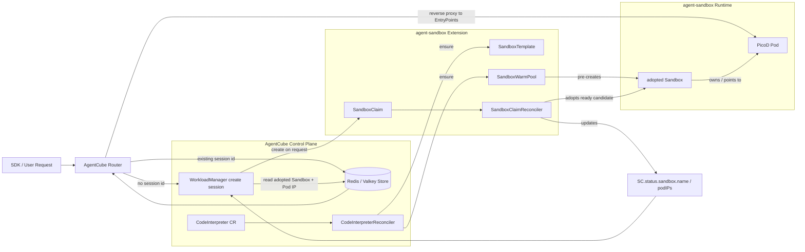
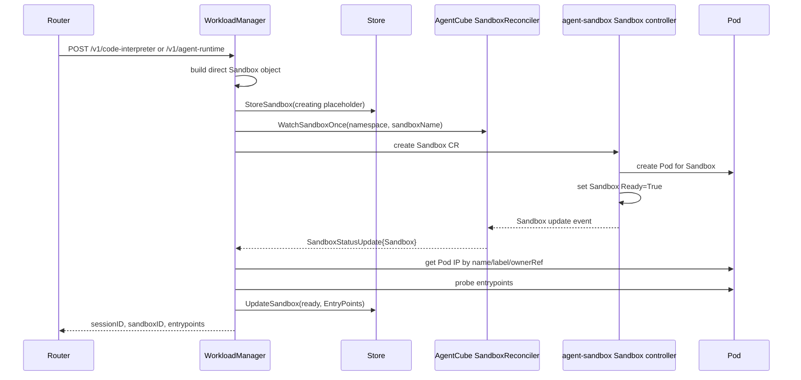
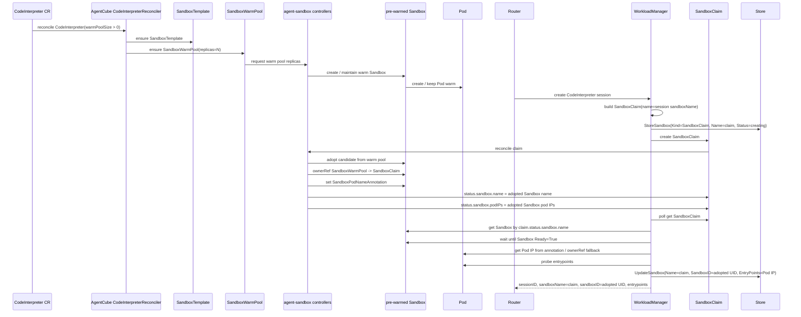
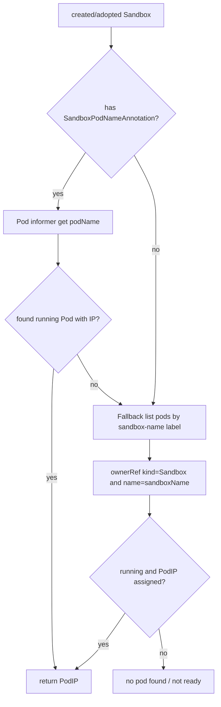
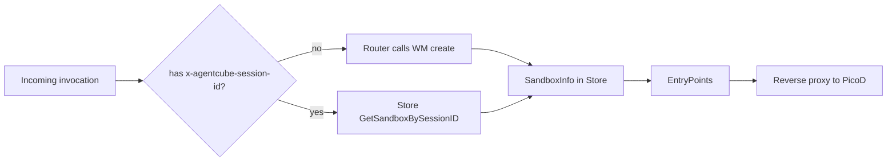
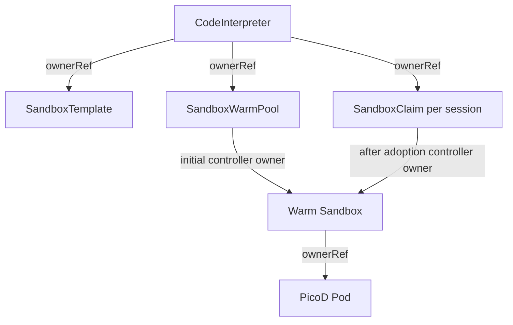
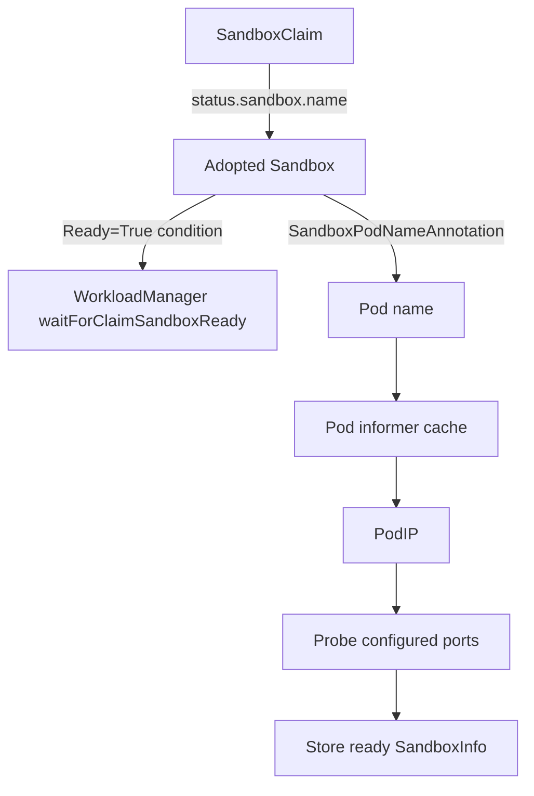
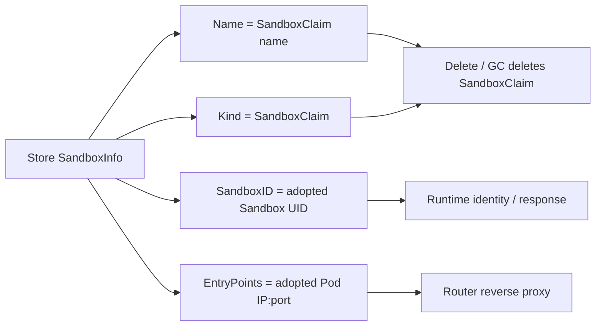

# Day 30：PR #387 Warm Pool Adoption 数据流 Review

日期：2026-06-25

目标：这次不再只解释 `agent-sandbox` API 接口适配，而是从实际项目运行流程理解 #387 的 warm pool adoption 数据流：对象怎么创建、claim 怎么拿到 serving Sandbox、Pod 怎么被观测、watcher 为什么要分 direct path 和 claim path、Store 最终应该保存 claim 名还是 adopted Sandbox 名。

> 注释：reviewer 当前更关心的是“运行时数据如何流动”，不是“某个 Go package import 从哪个版本改到哪个版本”。因此本报告用 Mermaid 和源码证据解释 `CodeInterpreter -> SandboxTemplate / SandboxWarmPool -> SandboxClaim -> adopted Sandbox -> Pod -> Store -> Router` 的真实链路。

## 一句话结论

#387 的核心不是简单把 `agent-sandbox` 升到 `v0.4.6`，而是修正 AgentCube 对 warm-pool 运行模型的假设：

- 旧理解更像：`SandboxWarmPool -> Pod` 或 `SandboxClaim name == serving Sandbox name == Pod name`。
- 新模型是：`SandboxWarmPool -> pre-warmed Sandbox -> Pod`；请求到来后创建 `SandboxClaim`，`agent-sandbox` controller 从 warm pool 中 adopt 一个已有 Sandbox，并把 serving Sandbox 名写到 `SandboxClaim.status.sandbox.name`。
- AgentCube 必须通过 `SandboxClaim.status.sandbox.name` 找 adopted Sandbox，再从 adopted Sandbox 的 `agents.x-k8s.io/sandbox-pod-name` annotation 或 owner/label 关系找到 Pod。
- Store 中仍应保存 `Kind=SandboxClaim` 和 `Name=<claim name>`，因为后续 delete / GC 应删除 claim；但 `SandboxID`、entrypoint、Pod IP 必须来自 adopted Sandbox / Pod。

> 分析：这就是 #387 最容易被误解的地方。对 Router 来说，它只需要 Store 里的 `EntryPoints` 转发请求；对 WorkloadManager delete/GC 来说，它需要知道删的是 `SandboxClaim` 还是 direct `Sandbox`。所以 warm path 的 Store 记录天然包含两种身份：控制身份是 claim，运行身份是 adopted Sandbox/Pod。

## 本地基线

- PR: <https://github.com/volcano-sh/agentcube/pull/387>
- 当前 head：`c2633c5 fix: reduce sandbox create handler complexity after rebase`
- 本地分支：`rebase/pr387-on-bed6bd4`
- base：`upstream/main bed6bd4`
- 关注文件：
  - `pkg/workloadmanager/codeinterpreter_controller.go`
  - `pkg/workloadmanager/workload_builder.go`
  - `pkg/workloadmanager/handlers.go`
  - `pkg/workloadmanager/k8s_client.go`
  - `pkg/workloadmanager/sandbox_helper.go`
  - `pkg/workloadmanager/handlers_test.go`
  - `test/e2e/e2e_test.go`
  - `sigs.k8s.io/agent-sandbox@v0.4.6/extensions/controllers/sandboxclaim_controller.go`

当前 PR 状态查询：

- #387 checks：failed `0`，pending `0`
- #387 assignee：`zhzhuang-zju`
- 下一步：等待正式 review、`/lgtm`、`/approve` 和 tide。

## 对象关系总图



> 注释：`SandboxTemplate` 和 `SandboxWarmPool` 是 CodeInterpreter controller 预先准备的 warm pool 基础设施；`SandboxClaim` 是每次 session create 时 WorkloadManager 创建的请求对象；`Sandbox` 和 Pod 的真实生命周期由 agent-sandbox controller 管理。

## 旧直连路径：direct Sandbox

当 CodeInterpreter 不使用 warm pool，或者 AgentRuntime 直接创建 sandbox 时，AgentCube 仍然创建一个 direct `Sandbox`。



关键点：

- `WatchSandboxOnce` 必须在创建 direct Sandbox 之前注册，避免 Ready event 太快发生而 missed。
- `SandboxReconciler` 只 watch `Sandbox`，看到 `Ready=True` 才通知等待者。
- direct path 的 sandbox 名、serving Sandbox 名和通常 Pod 名是一致的。

对应源码：

- `handleSandboxCreate`：direct path 下先注册 `WatchSandboxOnce`，然后 `createSandbox(...)`。
- `waitForDirectSandboxReady`：只从 `resultChan` 收一次 ready Sandbox。
- `SandboxReconciler.Reconcile`：只在 `getSandboxStatus(sandbox) == ready` 时发送 `SandboxStatusUpdate`。

## 新 warm-pool 路径：SandboxClaim adoption

warm pool 路径里，WorkloadManager 不应该等待自己创建的 placeholder Sandbox 变 Ready，因为真正 serving 的不是这个 placeholder，而是 agent-sandbox 从 warm pool adopt 的已有 Sandbox。



> 分析：warm path 不能再使用 direct watcher 的原因是 watcher key 是 `namespace/name`。WorkloadManager 创建的 claim 名是 `ci-xxxxx`，但 agent-sandbox 可能 adopt 一个已经存在的 warm Sandbox，例如 `warm-pool-sandbox-abc`。如果还 watch `ci-xxxxx` 这个 Sandbox 名，就可能永远等不到 Ready。

## CodeInterpreter controller 负责预热基础设施

`pkg/workloadmanager/codeinterpreter_controller.go` 在 `CodeInterpreterReconciler.Reconcile` 中判断：

```go
if codeInterpreter.Spec.WarmPoolSize != nil && *codeInterpreter.Spec.WarmPoolSize > 0 {
    ensureSandboxTemplate(...)
    ensureSandboxWarmPool(...)
}
```

它做两件事：

1. `ensureSandboxTemplate`：把 `CodeInterpreter.spec.template` 转成 agent-sandbox `SandboxTemplate`。
2. `ensureSandboxWarmPool`：创建或更新 `SandboxWarmPool`，设置 `Spec.Replicas` 和 `Spec.TemplateRef.Name`。

重要细节：

- `SandboxTemplate.Spec.NetworkPolicyManagement` 被设置为 `NetworkPolicyManagementUnmanaged`，避免 agent-sandbox 默认 NetworkPolicy 干扰 AgentCube 现有连通性。
- `convertToPodTemplate` 会把 PicoD public key 注入到 warm pool template 里，所以 warm Pod 预热时已经带着 `PICOD_AUTH_PUBLIC_KEY`。

> 注释：这一段不是用户请求时发生的，而是 CodeInterpreter CR 被 apply 后由 WorkloadManager 内部 controller 预先维护。用户第一次执行 code 时，warm pool 理想情况下已经有 ready Sandbox/Pod 可被 claim adopt。

## WorkloadManager 创建 session 时的数据写入

`buildSandboxByCodeInterpreter` 是 session create 的对象构造点。

### Non-warm path

没有 warm pool 时：

- 返回一个完整 `Sandbox`。
- `sandboxEntry.Kind = Sandbox`。
- 后续 create direct Sandbox。

### Warm path

`WarmPoolSize > 0` 时：

- 构造 `SandboxClaim`，`Spec.TemplateRef.Name = CodeInterpreter.Name`。
- claim metadata 带：
  - `runtime.agentcube.io/session-id = <sessionID>`
  - `runtime.agentcube.io/sandbox-name = <claimName>`
  - `runtime.agentcube.io/idle-timeout = <duration>`
  - optional owner annotation / owner-hash label
- claim ownerReference 指向 `CodeInterpreter`。
- 返回一个 `simpleSandbox`，它只是 placeholder，用于复用 `buildSandboxPlaceHolder`、TTL 和 Store 初始化；它不是实际会被 create 的 serving Sandbox。
- `sandboxEntry.Kind = SandboxClaim`。

> 分析：这里的 `simpleSandbox` 是代码层面的占位对象，不是 agent-sandbox 的真实 runtime identity。review 时要避免把它解释成“先创建一个 Sandbox 再 claim”；warm path 实际创建的 K8s resource 是 `SandboxClaim`。

## agent-sandbox adoption 的真实动作

`agent-sandbox v0.4.6` 的 `SandboxClaimReconciler` 在 `getOrCreateSandbox` 中按顺序查找：

1. `claim.Status.SandboxStatus.Name` 已有值时，优先按 status 找之前 adopted 的 Sandbox。
2. `claim.Labels[AssignedSandboxNameLabel]` 有值时，按 label 找 adoption 中间态。
3. `claim.Name` 同名 Sandbox 存在时，走 cold path / name-based lookup。
4. warm pool policy 允许时，从 warm queue 中取 candidate 并 adopt。
5. warm pool 无可用 candidate 时，cold create Sandbox。

adoption 成功时，`completeAdoption` 会：

- 删除 warm-pool-only labels。
- 把 adopted Sandbox 的 ownerReference 从 `SandboxWarmPool` 转成 `SandboxClaim`。
- 确保 adopted Sandbox 有 `SandboxPodNameAnnotation`。
- 把 claim identity labels 写到 Sandbox 和 PodTemplate metadata。
- patch adopted Sandbox。

随后 `computeAndSetStatus` 会：

```go
claim.Status.SandboxStatus.Name = sandbox.Name
claim.Status.SandboxStatus.PodIPs = sandbox.Status.PodIPs
```

这就是 #387 选择轮询 `SandboxClaim.status.sandbox.name` 的源码依据。

## WorkloadManager 怎么等待 warm claim ready

#387 新增了 `waitForClaimSandboxReady`：

```text
loop every 1s until 2min:
  get SandboxClaim(namespace, claimName)
  if claim.status.sandbox.name != "":
      get Sandbox(namespace, status.sandbox.name)
      if Sandbox Ready=True:
          return adopted Sandbox
```

这个等待逻辑有三个关键点：

1. 等的是 claim status，而不是 direct Sandbox watcher。
2. 取的是 adopted Sandbox 名，而不是 claim 名。
3. 只有 adopted Sandbox `Ready=True` 才继续拿 Pod IP 和 probe entrypoint。

> 分析：这比“watch claim update event”更简单，但也有 tradeoff：它是 1s polling，不依赖 informer event；好处是容易用 dynamic client 和 user-specific client 统一处理，坏处是状态变化最多有 1s 额外延迟。对 session create 的 2min timeout 来说，这个 tradeoff 合理。

## Pod 观测：为什么要同时看 annotation 和 owner/label fallback

在 warm path 中，serving Pod 不一定和 claim 同名。#387 的 `createSandbox` 用 adopted Sandbox 决定 Pod：

```go
sandboxNameForPod := createdSandbox.Name
sandboxPodName := createdSandbox.Name
if podName, exists := createdSandbox.Annotations[sandboxv1alpha1.SandboxPodNameAnnotation]; exists {
    sandboxPodName = podName
}

podIP, err := s.k8sClient.GetSandboxPodIP(ctx, createdSandbox.Namespace, sandboxNameForPod, sandboxPodName)
```

`GetSandboxPodIP` 的逻辑：

1. 如果有 `podName`，先从 Pod informer cache 直接按名字取 Pod。
2. 如果按名字取不到，fallback 到 label selector：
   - selector：`runtime.agentcube.io/sandbox-name = <sandboxName>`
   - 再检查 Pod ownerReference 是否指向这个 Sandbox。
3. Pod 必须 `Running` 且有 `PodIP`。



> 注释：annotation 是 fast path；owner/label 是兼容和兜底。对 warm pool adoption 来说，annotation 尤其重要，因为 adopted Sandbox 可能来自 warm pool，Pod 名不应该由 claim 名推断。

## Store 字段语义：claim identity + runtime identity

warm path 的最终 Store 记录并不是简单复制 adopted Sandbox：

```go
storeCacheInfo := buildSandboxInfo(createdSandbox, podIP, sandboxEntry)
if sandboxClaim != nil {
    storeCacheInfo.Name = sandboxClaim.Name
    storeCacheInfo.SandboxNamespace = sandboxClaim.Namespace
    storeCacheInfo.ExpiresAt = placeholder.ExpiresAt
    storeCacheInfo.CreatedAt = placeholder.CreatedAt
}
```

最终语义：

| Store 字段 | warm path 来源 | 为什么 |
| --- | --- | --- |
| `Kind` | `SandboxClaim` | delete / GC 需要删除 claim |
| `Name` | `SandboxClaim.Name` | delete / GC 操作对象是 claim |
| `SessionID` | WorkloadManager 生成 | Router 后续按 session 查 Store |
| `SandboxID` | adopted Sandbox UID | 表示真实 serving runtime identity |
| `EntryPoints` | adopted Pod IP + ports | Router 需要真实转发目标 |
| `CreatedAt` / `ExpiresAt` | placeholder / claim session 语义 | 保持 AgentCube session TTL，而不是 warm Sandbox 的预热创建时间 |
| `Status` | adopted Sandbox Ready condition | Router / GC 看到的是实际可服务状态 |

> 分析：这是 #387 最值得保留的设计点。Store 的 `Name` 如果保存 adopted Sandbox 名，`handleDeleteSandbox` 和 GC 会删错对象：它们看到 `Kind=SandboxClaim` 时调用 `deleteSandboxClaim(namespace, Name)`。因此 warm path 必须 store claim name，同时把 runtime endpoint 绑定到 adopted Pod。

## Router 为什么不需要知道 adoption 细节

Router 的 `SessionManager.GetSandboxBySession` 做两件事：

- 没有 session ID：调用 WorkloadManager create。
- 有 session ID：从 Store 取 `SandboxInfo`。

Router 转发时只使用：

- `sandbox.SessionID`
- `sandbox.EntryPoints`
- `sandbox.OwnerID`
- `sandbox.Kind` 用于 JWT 生成判断

它不关心该 session 背后是 direct Sandbox 还是 SandboxClaim adoption。只要 WorkloadManager 把 Store 写对，Router 的 data plane 不需要改。



## Delete / GC 为什么必须保留 claim 名

`handleDeleteSandbox` 和 GC 都根据 Store 中的 `Kind` 选择删除对象：

- `Kind == SandboxClaim`：调用 `deleteSandboxClaim(namespace, name)`。
- 否则：调用 `deleteSandbox(namespace, name)`。

warm path 的 `name` 必须是 claim 名，不能是 adopted Sandbox 名。删除 claim 后，agent-sandbox controller 才能按 claim ownership / finalizer / cascading policy 清理 adopted Sandbox 和 Pod。

如果 Store 中 `Name` 错存为 adopted Sandbox 名，会产生问题：

```text
Kind=SandboxClaim
Name=warm-pool-sandbox-abc

delete path -> delete SandboxClaim/warm-pool-sandbox-abc
actual claim -> SandboxClaim/ci-xxxxx
result -> claim remains, session cleanup is wrong
```

> 分析：这也是 `TestServerCreateSandboxClaimUsesAdoptedSandboxButStoresClaimName` 的价值。它不只是测试字段，而是在锁定“控制对象名”和“运行对象 UID / Pod IP”分离的语义。

## #387 tests 覆盖了什么

### Unit tests

`pkg/workloadmanager/handlers_test.go` 覆盖：

- sandbox claim create path 会创建 `SandboxClaim`。
- claim create / pod lookup / entrypoint readiness / store update 失败时触发 rollback。
- direct watcher 的 nil、closed、empty sandbox failure。
- `TestServerCreateSandboxClaimUsesAdoptedSandboxButStoresClaimName` 明确覆盖：
  - claim status 指向 adopted Sandbox。
  - Pod 名来自 adopted Sandbox annotation。
  - Store 保存 claim name。
  - `SandboxID` 来自 adopted Sandbox UID。
  - entrypoint 来自 adopted Pod IP。

`pkg/workloadmanager/workload_builder_test.go` 覆盖：

- warm pool CodeInterpreter build 出 `SandboxClaim`。
- `entry.Kind == SandboxClaim`。
- claim ownerReference 指向 CodeInterpreter。
- `Spec.TemplateRef.Name == CodeInterpreter.Name`。

`pkg/workloadmanager/codeinterpreter_controller_test.go` 覆盖：

- `SandboxTemplate` 使用 `NetworkPolicyManagementUnmanaged`。
- RuntimeClassName 空字符串归一化。
- PicoD public key 注入 / authMode none 行为。

### E2E tests

`test/e2e/e2e_test.go` 的 warm pool helper 已经从旧 direct Pod assumption 改成支持：

- 新模型：`SandboxWarmPool -> Sandbox -> Pod`
- 旧路径 fallback：`SandboxWarmPool -> Pod`

关键验证：

- 初始 warm pool Pod ready。
- 执行一次 CodeInterpreter 请求。
- 找到 `CodeInterpreter -> SandboxClaim -> Sandbox -> Pod`。
- claimed Pod 必须来自初始 warm pool Pod 集合。
- warm pool 会补回到 `warmPoolSize`。

> 注释：e2e 这里不是在测 Go API shape，而是在测真实 controller ownership graph。它能发现“claim created 了但没有真正 adopt warm Pod”这类 unit test 不容易发现的问题。

## Mermaid：reviewer 最关心的数据流

### 1. 控制对象流



### 2. 状态观测流



### 3. Store / Router 数据流



## Review 判断

当前 #387 的 warm pool data flow 改动方向是合理的：

1. direct path 和 claim path 分开等待，避免把 direct `Sandbox` watcher 误用于 warm claim adoption。
2. claim path 通过 `SandboxClaim.status.sandbox.name` 找 serving Sandbox，符合 `agent-sandbox v0.4.6` controller 语义。
3. Pod 查找先用 `SandboxPodNameAnnotation`，再 fallback label/ownerRef，兼容 warm-pool adopted Pod 和 direct Sandbox Pod。
4. Store 记录保留 claim name，同时使用 adopted Sandbox UID 和 Pod IP，区分 control identity 与 runtime identity。
5. e2e helper 从旧 Pod ownership 过渡到 `SandboxWarmPool -> Sandbox -> Pod`，能真实验证 adoption graph。

## Review 关注点 / 可追问点

### 1. Polling claim status 是否足够

`waitForClaimSandboxReady` 使用 1s ticker 轮询 claim 和 adopted Sandbox。这个实现简单、可靠，但相比 informer watch 有最多 1s 额外 latency。

判断：可以接受，不建议在 #387 里改成更复杂 watcher。原因是当前 create timeout 是 2min，warm pool create 本身也涉及 controller reconciliation；1s polling 的复杂度/收益比合理。

### 2. Pod informer cache 可能短暂滞后

`GetSandboxPodIP` 从 Pod informer cache 读 Pod。如果 adopted Sandbox 已 Ready，但 WorkloadManager 的 Pod informer cache 还没同步到 Pod IP，可能会返回错误并触发 rollback。

当前缓解：

- Pod ready 和 Sandbox Ready 理论上应相关。
- `GetSandboxPodIP` 有 direct name + fallback list。
- e2e 会覆盖真实环境。

可追问：是否需要把 `GetSandboxPodIP` 失败也纳入短 retry，而不是一次失败就 rollback？当前 `waitForSandboxEntryPointsReady` 只 retry TCP probe，不 retry Pod lookup。

> 分析：这是最有价值的 review 风险点之一。因为 Kubernetes informer cache 和 status update 是异步的，`Sandbox Ready=True` 并不必然保证 WorkloadManager 的 Pod informer cache 已经能立刻取到 Pod。若真实 CI/e2e 稳定，风险可接受；若出现 flaky create failure，这会是优先排查点。

### 3. claim status 中 PodIPs 已存在，为什么还要查 Pod informer

`SandboxClaim.status.sandbox.podIPs` 已由 agent-sandbox controller 镜像，但 #387 仍通过 adopted Sandbox annotation 和 Pod informer 获取 Pod IP。

判断：当前做法更一致，因为 direct path 也走 `GetSandboxPodIP` 并验证 Pod running；但从未来设计看，claim status PodIPs 可以作为 fallback 或减少一次 Pod cache 依赖。

不建议现在改：这会扩大 #387 scope，需要重新设计 status trust model。

### 4. Store CreatedAt / ExpiresAt 使用 placeholder 时间

warm path 用 adopted Sandbox 构建 `SandboxInfo` 后，又把 `CreatedAt` / `ExpiresAt` 覆盖回 placeholder：

- `CreatedAt = placeholder.CreatedAt`
- `ExpiresAt = placeholder.ExpiresAt`

判断：这是正确的。warm Sandbox 的创建时间可能早于用户 session；AgentCube session TTL 应从 session create 时间算，而不是从 warm pool 预热时间算。

### 5. rollback 删除 claim 是否足够

warm path 创建失败时，rollback 删除 `SandboxClaim` 并删除 Store placeholder。由于 adopted Sandbox owner 已转给 claim，删除 claim 应由 agent-sandbox controller / ownerReference / policy 处理 runtime cleanup。

可观察点：

- 如果 failure 发生在 adoption 后、Store update 前，删除 claim 应释放 adopted Sandbox/Pod。
- e2e cleanup 和 claim delete path 可覆盖大部分风险。

## 可用于 reviewer 的英文解释草稿

```text
The important runtime change is the identity split in the warm-pool path.

With agent-sandbox v0.4.x, a CodeInterpreter warm pool is no longer observed as a direct/bare Pod. The steady-state ownership chain is:

CodeInterpreter -> SandboxWarmPool -> pre-warmed Sandbox -> Pod

When a session is created, AgentCube creates a SandboxClaim. The agent-sandbox SandboxClaim controller adopts one warm Sandbox, transfers the Sandbox ownerRef from SandboxWarmPool to SandboxClaim, and publishes the serving Sandbox name through SandboxClaim.status.sandbox.name.

Therefore WorkloadManager cannot wait on a direct Sandbox watcher keyed by the claim name. It first waits for SandboxClaim.status.sandbox.name, then reads that adopted Sandbox, verifies Ready=True, resolves the Pod through the SandboxPodNameAnnotation / ownerRef fallback, probes the entrypoints, and finally writes Store.

The Store record intentionally keeps Name=<SandboxClaim name> and Kind=SandboxClaim, because delete/GC must delete the claim. At the same time, SandboxID and EntryPoints come from the adopted Sandbox/Pod, because Router needs the real serving runtime identity and Pod IP.
```

## 后续建议

1. 当前不需要给 #387 继续加代码，先等 reviewer 对数据流是否理解一致。
2. 如果 reviewer 要求解释，优先用上面的 Mermaid / 英文草稿说明 control identity 与 runtime identity 的分离。
3. 如果 reviewer 追问 Pod informer race，可以建议 follow-up：给 `GetSandboxPodIP` 加短 retry，或将 `claim.status.sandbox.podIPs` 作为 fallback。
4. 不把 `agent-sandbox v0.5.x` / `v1beta1`、Sleep/Resume、PicoD cleanup 混进 #387。
5. 如果要发 upstream comment，先让用户确认英文全文。
