# Day 32：Substrate 竞品分析、缺陷升级与 AgentCube 开源 PRD

日期：2026-06-26

> 状态：本文是内部产品设计和开源策略草稿，综合 Day28、`design.md` 和 AgentCube 会话运行时架构拆解形成。它不是声明 AgentCube 已经实现完整 Sleep/Resume、RuntimeProvider 或 MultiAgent Worker，而是把竞品能力、当前缺口和可分阶段贡献的 PRD 梳理清楚。

## 输入材料

| 输入 | 用途 |
| --- | --- |
| [Day28：Agent Substrate 架构吃透与 AgentCube 差异化设计方向](day28-agent-substrate-architecture-and-agentcube-differentiation.md) | 竞品参考、Substrate 控制面/状态面/数据面/runtime 面拆解、差异化方向 |
| [Agent Substrate Counter Actor 架构图](day28-agent-substrate-counter-architecture.png) / [drawio 源文件](day28-agent-substrate-counter-architecture.drawio) / [高清 PNG](day28-agent-substrate-counter-architecture.drawio.png) | 竞品参考的视觉架构依据，说明 Counter Actor 从 WorkerPool / ActorTemplate 到 router ResumeActor、ate-api 状态、Worker Pod 内 gVisor sandbox、ateom / atelet、checkpoint / restore 的完整链路 |
| [AgentCube 架构设计优化：基于 Agent Substrate 复核后的版本](design.md) | AgentCube 六面架构、RuntimeProvider、SessionPlacement、preservation level、分阶段路线 |
| [AgentCube 会话运行时架构拆解](day28-agentcube-session-runtime-architecture-breakdown.md) | 架构图解释、真实 Ready/Paused 请求流、状态机、CAS workflow、失败补偿 |
| [AgentCube 会话运行时架构图](day28-agentcube-session-runtime-architecture.drawio) / [高清 PNG](day28-agentcube-session-runtime-architecture.drawio.png) | 本文 PRD 的视觉架构依据 |

## 图解总览

如果只想快速看懂本文，先看这一节。Day32 的核心不是再写一篇长文字，而是把 Substrate 的可学习点、AgentCube 的缺口、产品 PRD 和开源打法串成一条可执行路线。

### 1. Agent Substrate Counter Actor 参考架构图

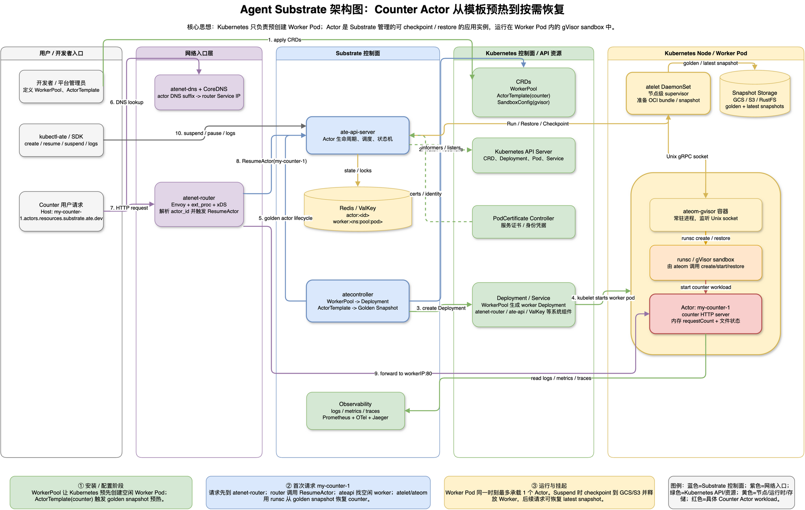

> 注释：这张图是本文竞品分析的参考图。它把 Substrate 的核心链路画成一个 Counter Actor 示例：Kubernetes 主要负责预创建 Worker Pod 和 CRD 资源，真正的 Actor 生命周期由 ate-api、atenet-router、Redis/ValKey 状态、atelet/ateom 和 gVisor sandbox 串起来；请求进入 router 后先 ResumeActor，再转发到恢复后的 Worker endpoint。
>
> 术语说明：这里的 Counter Actor 不是一种特殊 Kubernetes 资源，而是 Substrate demo 里的“计数器应用 + Actor 生命周期模型”。Counter 表示业务逻辑只是维护请求计数，Actor 表示这个应用实例由 Substrate 管理 resume、suspend、checkpoint 和 restore；如果暂停恢复后计数还能继续递增，就能直观看出状态恢复链路是否有效。

### 2. AgentCube 会话运行时目标架构图

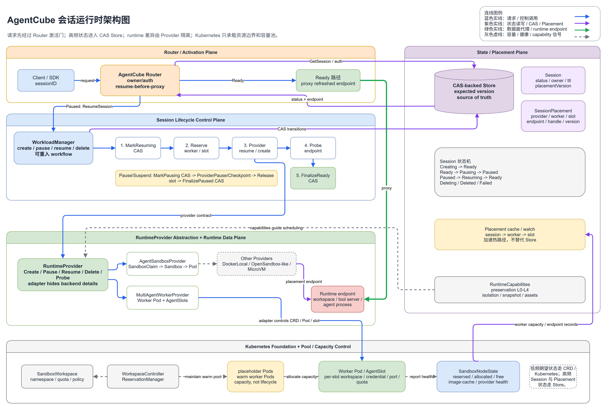

> 注释：这张图是本文 PRD 的主图。它把 AgentCube 目标架构压缩成五条主线：Router activation gate、Session lifecycle workflow、CAS-backed Store / Placement、RuntimeProvider abstraction、Kubernetes capacity pool。图里的线色也区分了请求/控制调用、状态读写、数据面 proxy 和容量/健康信号。

### 3. 从 Substrate 竞品能力到 AgentCube 机会

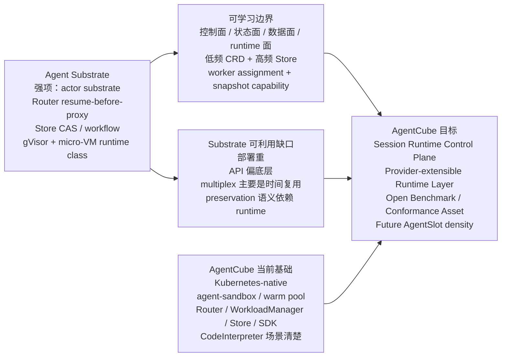

> 分析：AgentCube 不需要和 Substrate 在第一天比谁的底层 runtime 更激进。更好的路线是把 Substrate 的系统边界转译成 AgentCube 自己的 Session、RuntimeProvider、Store CAS、Router activation 和 benchmark/conformance 资产。

### 4. 缺陷升级成产品需求

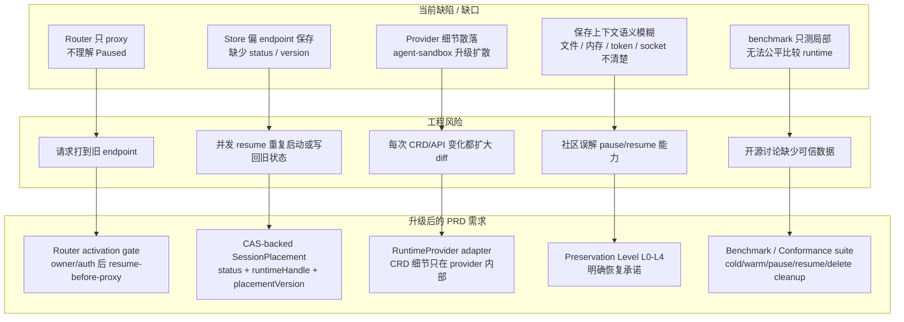

> 注释：这张图是本文所谓“缺陷升级分析”的核心。缺陷不是拿来抱怨当前系统不够好，而是转成可 review、可测试、可拆 PR 的产品需求。

### 5. PRD 闭环架构

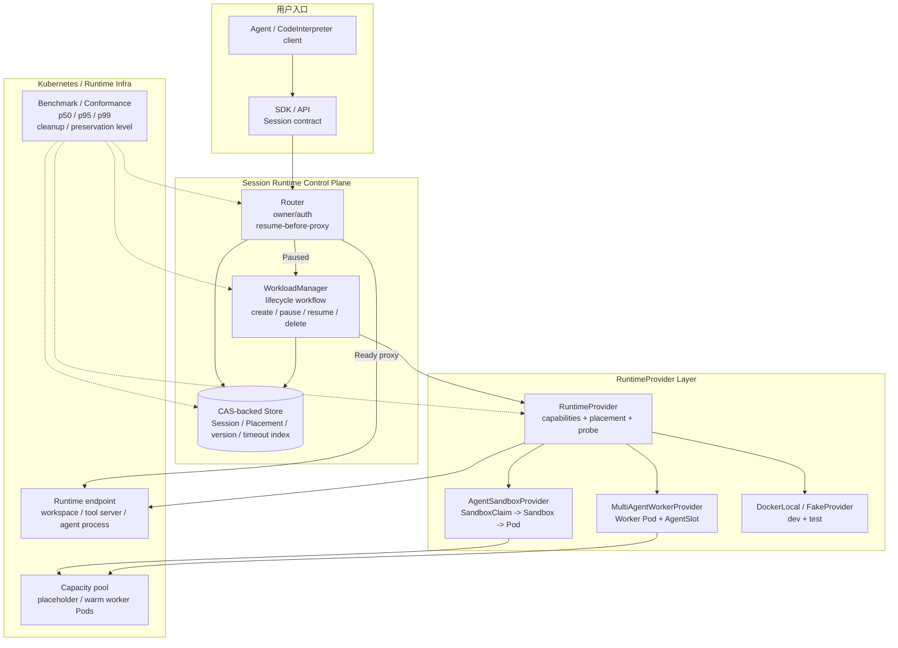

> 分析：PRD 的闭环不是只补一个接口，而是让入口、控制面、状态面、provider、runtime、benchmark 都围绕同一个 Session contract 工作。

### 6. 开源贡献路线图

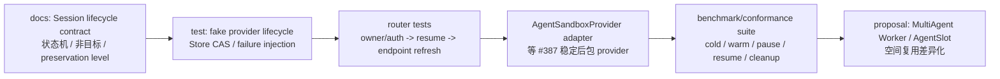

> 分析：这条路线刻意避免“一次性大重构”。AgentCube 要拿到更好的开源成绩，靠的是小 PR、强测试、清晰非目标、公开 benchmark 和持续 review 证据。

## 一句话结论

Agent Substrate 给 AgentCube 最大的启发不是“去复制 gVisor / micro-VM checkpoint”，而是证明 **Agent runtime 的竞争核心已经从 sandbox 创建速度，升级为长期 session 的生命周期控制面**。

AgentCube 要在 Substrate 基础上做出更好的开源成绩，应该走这条主线：

```text
Kubernetes-native agent-sandbox 兼容
  + 清晰的 Session lifecycle contract
  + Router resume-before-proxy
  + CAS-backed Store / Placement
  + RuntimeProvider 能力边界
  + 可验证 benchmark / conformance suite
  + 可选 MultiAgent Worker / AgentSlot 高密度方向
```

差异化不在于第一天就做更复杂的 runtime，而在于把 AgentCube 做成更容易被社区理解、验证、接入和贡献的 **open session runtime control plane**。

> 分析：Substrate 的强项是底层 substrate 思路完整，但部署、runtime 依赖、API 语义和使用门槛都更重。AgentCube 的机会是把 Kubernetes-native、SDK 体验、agent-sandbox 生态、CodeInterpreter 场景和开源协作流程结合起来，做成更容易落地的开源 Agent runtime 基础设施。

## 竞品分析

### 1. Agent Substrate：强参考，不是直接模板

Day28 复核后的判断是：Agent Substrate 是当前最值得学习的开源参考之一。它把 long-session workload 拆成了四个面：

| 面 | Substrate 做法 | 对 AgentCube 的启发 |
| --- | --- | --- |
| 控制面 | `ate-api-server` 暴露 `CreateActor / ResumeActor / SuspendActor / PauseActor / DeleteActor` 等 lifecycle API | AgentCube 需要明确 Session lifecycle contract，而不是让 SDK、Router、WorkloadManager、Store 各自理解状态 |
| 状态面 | Redis/ValKey 保存 Actor / Worker 高频状态，更新带 expected version | AgentCube Store 不能只存 endpoint JSON，需要 status、placement、version、timeout index |
| 数据面 | Router 从 Host 解析 actor，proxy 前先 `ResumeActor`，拿到 worker IP 后再转发 | AgentCube Router 应实现 owner/auth 后的 resume-before-proxy 和 endpoint refresh |
| runtime 面 | atelet / ateom-gvisor / ateom-microvm 负责 run、checkpoint、restore | AgentCube 应通过 RuntimeProvider 隔离 runtime action，不把 CRD 细节散落到上层 |

Substrate 的核心先进点：

- Router 是 activation gate，不是普通反向代理。
- Workflow 是可重入状态机，不是一次性同步函数。
- Store CAS 是并发正确性要求。
- Kubernetes CRD 承载低频配置，Redis/ValKey 承载高频运行状态。
- `SandboxConfig` / `sandboxClass` 把 runtime class 与模板解耦。
- Worker cache 说明 resume / placement 是高频热路径。

Substrate 的可利用缺口：

| 缺口 | 具体表现 | AgentCube 机会 |
| --- | --- | --- |
| 部署门槛高 | 需要多组件控制面、Redis/ValKey、gVisor/runsc 或 micro-VM 环境，micro-VM 还涉及 `/dev/kvm` | AgentCube 可以先用 Kubernetes + agent-sandbox + fake provider / local provider 做更低门槛的验证路径 |
| 用户 API 偏 substrate 内部语义 | Actor、WorkerPool、atelet、ateom 等命名偏底层 | AgentCube 可以保持 `Session`、`RuntimeProvider`、`CodeInterpreter` 等更贴近 Agent 开发者的概念 |
| 当前 multiplex 是时间复用 | 多个 Actor 竞争少量 Worker Pods，但一个 Worker 同时最多一个 Actor | AgentCube 可探索 MultiAgent Worker Pod / AgentSlot 的空间复用 |
| preservation 语义复杂 | micro-VM 路径 guest RAM 可恢复，但 rootfs reset-to-golden，不能笼统说 memory + disk 都保留 | AgentCube 可以把 preservation level 变成显式产品契约 |
| 项目仍早期演进 | API 命名、runtime class discoverability、worker cache metrics 等仍有 TODO | AgentCube 可以用更清晰的文档、测试矩阵和 benchmark 先占住开源可信度 |

> 注释：这里的“竞品”不是商业对立，而是开源 Agent Infra 路线的可比较对象。我们要学习 Substrate 的系统边界，同时避免把它当前的部署模型、命名、runtime 绑定和容量模型机械搬到 AgentCube。

### 2. AgentCube 当前位置

AgentCube 的已有优势：

| 优势 | 说明 |
| --- | --- |
| Kubernetes-native 背景 | 和 Volcano、agent-sandbox、warm pool、CRD/controller 生态天然贴近 |
| 已有 Router / WorkloadManager / Store / SDK | 具备形成 session control plane 的组件基础 |
| CodeInterpreter 场景清楚 | 用户能理解 session、workspace、tool call、文件读写和 LLM agent 链路 |
| agent-sandbox 适配已经推进 | #387 / Day30 已证明 `SandboxClaim -> adopted Sandbox -> Pod -> Store -> Router` 的真实路径可以被梳理和验证 |
| 开源协作材料完整 | Day16-Day31 已沉淀 PR rationale、review matrix、benchmark/runbook、架构图和图解文档 |

AgentCube 的当前短板：

| 短板 | 当前影响 |
| --- | --- |
| Session lifecycle contract 不完整 | `Ready / Paused / Resuming / Failed` 等状态还不是统一 contract |
| Router 还不是 activation gate | 当前设计需要补 `Paused -> ResumeSession -> refreshed endpoint -> proxy` |
| Store 语义偏 endpoint 保存 | 缺少 status、placementVersion、CAS、pause expiry 等生命周期字段 |
| Runtime 差异未被 provider 隔离 | agent-sandbox v0.4/v0.5、Docker/local、OpenSandbox-like、MultiAgent Worker 容易扩散到业务逻辑 |
| preservation level 未产品化 | “保存上下文”如果不拆分，会在社区讨论和 benchmark 中产生误解 |
| benchmark 还不够 contract 化 | 冷启动、warm create、pause/resume、cleanup、preservation level 需要统一 schema |

> 分析：这些短板不能只当 bug 修。它们其实是 AgentCube 从 sandbox runtime 项目升级为 agent session runtime control plane 的产品需求来源。

### 3. 竞争焦点变化

早期竞争问题是：

```text
谁创建 sandbox 更快？
谁启动 code interpreter 更快？
谁的隔离更强？
```

现在更高阶的竞争问题是：

```text
谁能稳定管理长期 agent session？
谁能在请求到来时正确恢复、刷新 endpoint 并避免并发状态错乱？
谁能解释清楚恢复后到底保留了什么？
谁能让第三方 runtime 低成本接入？
谁能用公开 benchmark 和 conformance 测试建立可信度？
```

AgentCube 的开源成绩应该围绕第二组问题建立。

## 缺陷升级分析

### 缺陷不应停留在“哪里不够好”

更有价值的写法是把缺陷升级成产品需求：

| 观察到的缺陷 | 工程风险 | 升级后的产品需求 |
| --- | --- | --- |
| Router 只 proxy，不理解 Paused | 请求可能打到旧 endpoint，或无法唤醒 session | Router activation gate：owner/auth 后 resume-before-proxy |
| Store 只保存 endpoint / metadata | 并发 resume 可能重复启动或写回旧 endpoint | CAS-backed SessionPlacement：status、endpoint、runtimeHandle、version |
| WorkloadManager 同步调用 provider | provider 成功但 final Store 写失败时状态不一致 | 可重入 lifecycle workflow + finalization retry / orphan cleanup |
| provider 细节散落 | agent-sandbox API 升级造成大范围 diff | RuntimeProvider adapter：CRD 细节只在 provider 内部 |
| `Paused` 语义模糊 | 社区不知道文件、进程、token、socket 是否保留 | preservation level：L0-L4 明确恢复承诺 |
| warm pool 被误当 lifecycle | 只解决容量，不解决 session 状态 | capacity pool 与 session lifecycle 分层 |
| benchmark 只测局部 | 无法和 Substrate/OpenSandbox/E2B-like 路线公平比较 | cold/warm/pause/resume/delete cleanup 分组 benchmark |
| 多 session 密度不足 | 轻量 agent 长期 idle 时资源浪费 | MultiAgent Worker / AgentSlot 空间复用方向 |

> 注释：缺陷升级分析的目标不是证明 AgentCube 当前差，而是把“差距”变成可 review、可测试、可开源协作的需求清单。

### Substrate 缺口也能升级成 AgentCube 机会

| Substrate 当前限制 | AgentCube 可以做得更好的方向 |
| --- | --- |
| 部署重、runtime 要求高 | 先提供 fake provider / DockerLocalProvider / K8s agent-sandbox provider 的低门槛路径 |
| Actor/Worker 命名偏底层 | 对外坚持 Session / Runtime / Workspace / CodeInterpreter 语义 |
| 一个 Worker 同时最多一个 Actor | 设计 MultiAgent Worker Pod / AgentSlot 作为高密度差异化 |
| preservation 语义依赖 runtime | 把 preservation level 放进 SDK/API/Provider capabilities |
| 内部控制面成熟度仍在演进 | 通过公开 PRD、状态机、测试矩阵和 benchmark schema 赢得社区信任 |

## 产品定位

### 产品名称草案

```text
AgentCube Session Runtime Control Plane
```

或在社区内更保守地称为：

```text
Session Lifecycle and RuntimeProvider Architecture
```

### 产品愿景

AgentCube 应成为 Kubernetes-native、provider-extensible、可观测、可 benchmark 的开源 Agent session runtime control plane。

它不只负责创建 sandbox，还负责：

- 管理长期 session 的状态和生命周期。
- 在请求到来时按需恢复 runtime。
- 将 session identity 与 runtime placement 解耦。
- 允许不同 runtime provider 按能力接入。
- 用统一 benchmark 证明冷启动、恢复、清理、隔离和成本表现。

### 目标用户

| 用户 | 关心什么 | AgentCube 应提供什么 |
| --- | --- | --- |
| Agent 应用开发者 | session id 稳定、workspace 保留、SDK 简单 | 清晰的 create/invoke/pause/resume/delete contract |
| 平台工程 / SRE | 资源利用率、清理、监控、故障恢复 | 状态机、metrics、cleanup、benchmark、容量池 |
| runtime provider 维护者 | 怎么接入自己的 sandbox/runtime | RuntimeProvider interface、capability table、conformance tests |
| 开源 reviewer / maintainer | 改动是否小、是否有证据、是否破坏现有路径 | 分阶段 PR、focused tests、运行证据、文档说明 |
| 研究/benchmark 使用者 | 可重复比较不同 runtime | JSON schema、环境记录、p50/p95/p99、preservation level 分组 |

## PRD：问题定义

### 背景

当前 AgentCube 已有 sandbox create/delete、warm pool、Router proxy、Store、WorkloadManager 和 Python SDK。但长期 agent session 需要的不只是“快速启动一个 sandbox”：

- 用户请求可能在 session idle 后再次到来。
- runtime endpoint 可能在 resume 后变化。
- session 与底层 Pod / Sandbox / Worker / AgentSlot 不是同一个身份。
- agent-sandbox、OpenSandbox-like backend、micro-VM、多 slot worker 的能力不同。
- 并发请求、GC、provider failure 和 cleanup 都会影响状态正确性。

### 核心问题

AgentCube 缺少一个统一的 Session lifecycle control plane，把 SDK、Router、WorkloadManager、Store、RuntimeProvider 和 Kubernetes capacity pool 串成闭环。

### 产品目标

| 编号 | 目标 | 验收信号 |
| --- | --- | --- |
| G1 | 明确 Session lifecycle contract | 状态表、API 行为、错误语义和 timeout 规则被文档化 |
| G2 | Router 成为 activation gate | Paused session 请求会 owner/auth 后 resume，再使用新 endpoint proxy |
| G3 | Store 成为 session source of truth | status、placement、version、pause expiry、last activity 都有明确语义 |
| G4 | RuntimeProvider 隔离底层差异 | agent-sandbox / fake / local / future multi-slot provider 可用同一 contract 测试 |
| G5 | preservation level 产品化 | SDK/API/benchmark 明确 L0-L4 恢复承诺 |
| G6 | 形成可开源贡献路线 | 每阶段可拆成低争议 PR / issue / test plan |
| G7 | 建立 benchmark 可信度 | cold/warm/pause/resume/delete cleanup p50/p95/p99 可重复输出 |

### 非目标

- 不在第一阶段实现完整 gVisor / micro-VM memory checkpoint。
- 不直接复制 Substrate 的 API、proto、目录或组件命名。
- 不把 MultiAgent Worker 混进 Sleep/Resume MVP。
- 不声称所有 provider 都支持同样的 preservation level。
- 不在没有 maintainer 分工确认前抢 #386 / Sleep/Resume 的大实现 PR。

## PRD：功能需求

### FR1：Session lifecycle contract

AgentCube 需要定义统一 Session 状态机：

| 状态 | 含义 | Router 行为 | GC 行为 |
| --- | --- | --- | --- |
| `Creating` | provider 创建 runtime 中 | 返回 retryable 或等待 | 超时后 Failed / cleanup |
| `Ready` | endpoint 可用 | proxy 当前 endpoint | idle 后进入 pause candidate |
| `Pausing` | provider pause/checkpoint 中 | 不 proxy 旧 endpoint | 超时诊断，不直接 delete |
| `Paused` | runtime 已释放或不可直接访问 | trigger resume-before-proxy | pauseTimeout 后 delete |
| `Resuming` | provider resume/create 中 | singleflight wait / retry | 超时诊断 / Failed |
| `Deleting` | cleanup 中 | reject request | retry cleanup |
| `Deleted` | 终态 | 404 / gone | no-op |
| `Failed` | 状态异常，需要 reconcile | 返回明确错误 | policy cleanup |

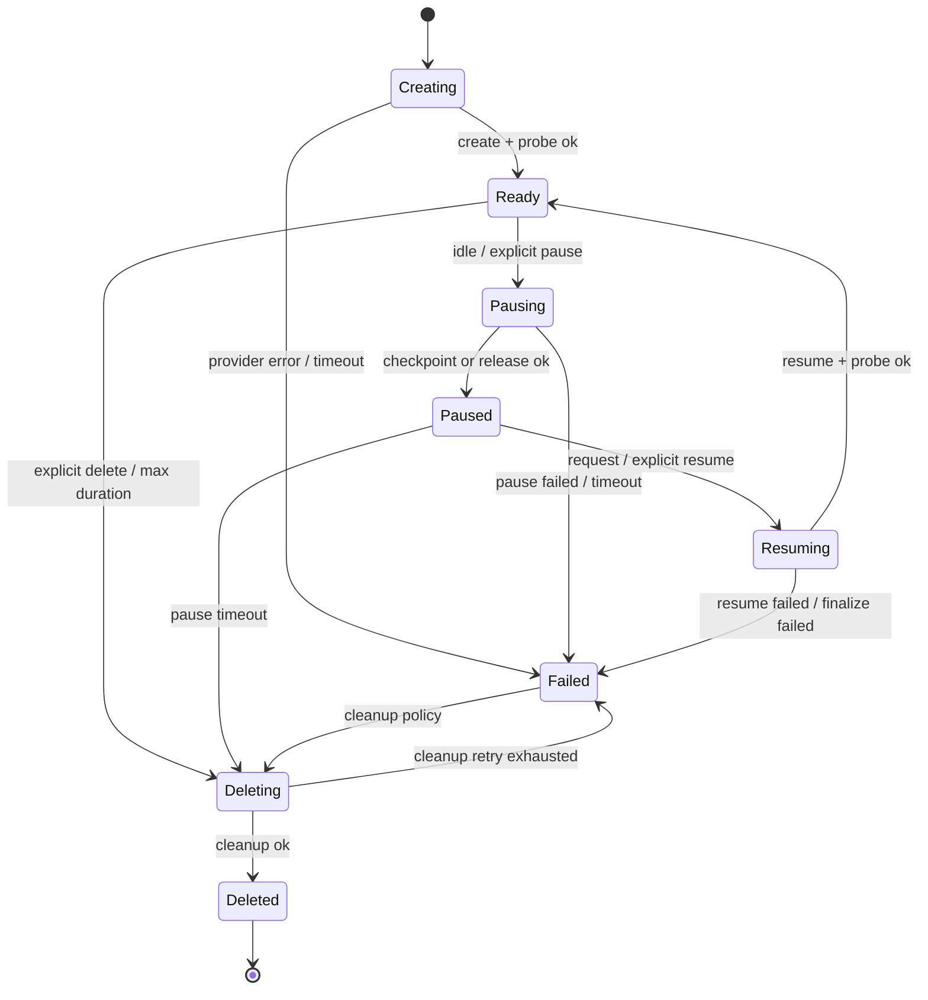

### FR2：Router resume-before-proxy

Ready 路径：

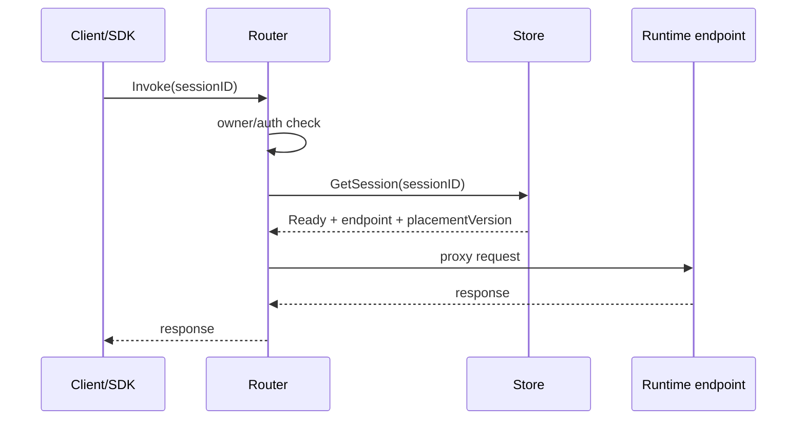

Paused 路径：

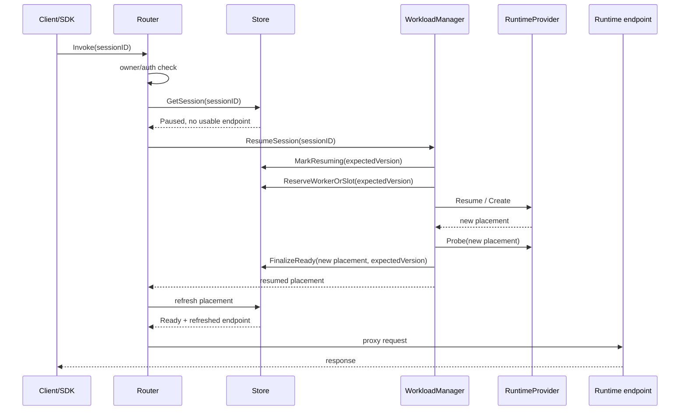

验收要求：

- owner mismatch 时不能触发 resume。
- resume 成功后不能使用旧 endpoint。
- `Resuming` 中并发请求要 singleflight 或返回 retryable。
- provider failure 不应更新 last activity 为成功请求。

### FR3：CAS-backed Store / Placement

最小数据模型：

```text
Session {
  sessionID
  owner
  status
  ttl / maxSessionDuration
  lastActivityAt
  pauseTimeout / pauseExpiresAt
  placementVersion
  provider
  runtimeClass
  preservationLevel
}

SessionPlacement {
  sessionID
  provider
  workerID
  slotID
  endpoint
  runtimeHandle
  snapshotRef
  version
  updatedAt
}
```

核心 API：

| API | 作用 |
| --- | --- |
| `GetSession(sessionID)` | 读取 session source of truth |
| `UpdateSessionStatusCAS(sessionID, expectedVersion, patch)` | 状态迁移 |
| `UpdatePlacementCAS(sessionID, expectedPlacementVersion, placement)` | endpoint / runtimeHandle 更新 |
| `ListPauseExpiredSessions(now)` | GC 扫描 paused timeout |
| `ListIdleReadySessions(now)` | GC 扫描 ready idle |

> 注释：CAS 是 Compare-And-Swap。这里不是为了性能，而是为了防止两个并发 resume 同时修改同一个 session，或者 provider 已经恢复成功但旧请求把旧 endpoint 覆盖回来。

### FR4：RuntimeProvider abstraction

概念接口：

```go
type RuntimeProvider interface {
    Capabilities(ctx context.Context) RuntimeCapabilities
    Create(ctx context.Context, session SessionSpec) (Placement, error)
    Pause(ctx context.Context, placement Placement) (PauseResult, error)
    Resume(ctx context.Context, session SessionSpec, snapshot SnapshotRef) (Placement, error)
    Delete(ctx context.Context, placement Placement) error
    Probe(ctx context.Context, placement Placement) (ProbeResult, error)
}
```

Provider matrix：

| Provider | 用途 | 第一阶段要求 |
| --- | --- | --- |
| `FakeProvider` | 单测 lifecycle、CAS、failure injection | 必须有 |
| `AgentSandboxProvider` | 当前 Kubernetes-native 主路径 | 等 #387 稳定后包进 adapter |
| `DockerLocalProvider` | 本地开发 / benchmark smoke | 可选 |
| `OpenSandboxLikeProvider` | 外部 backend 实验 | 后续 |
| `MultiAgentWorkerProvider` | AgentSlot 高密度方向 | PRD / prototype，不混入 MVP |
| `MicroVMProvider` | 高隔离 future path | 依赖 KVM 环境，非当前机器目标 |

### FR5：Preservation level

| Level | 名称 | 恢复承诺 | 适用场景 |
| --- | --- | --- | --- |
| L0 | Metadata only | 只保留 session metadata，runtime 可重建 | 无状态工具 |
| L1 | Workspace preservation | 文件 / workspace 保留，进程重启 | CodeInterpreter |
| L2 | Process restart + workspace | 应用可从 workspace 恢复上下文 | 大多数 agent 工具 |
| L3 | Memory snapshot | 进程内存恢复，文件语义按 provider 定义 | gVisor / micro-VM memory snapshot |
| L4 | Memory + writable disk snapshot | 内存和可写磁盘都恢复 | 高一致性长期 actor |

验收要求：

- API / SDK 不得笼统承诺“上下文全部保存”。
- Provider 必须声明支持的 level。
- benchmark 结果必须按 level 分组。

### FR6：Kubernetes capacity pool 与 lifecycle 分离

Kubernetes pool 的职责：

- namespace / quota / policy。
- placeholder Pods / warm worker Pods。
- node placement / resource reservation。
- worker health / capacity reporting。

它不负责：

- 判断 session 是否 Ready。
- 判断 endpoint 是否可信。
- 判断 pause/resume 是否完成。
- 保存 session identity。

> 分析：这能避免把 warm pool 当成完整 Sleep/Resume。warm pool 解决容量和启动延迟，Session lifecycle 解决用户可见状态和一致性。

### FR7：MultiAgent Worker / AgentSlot 差异化

AgentCube 可以在 Substrate 时间复用模型之上探索空间复用：

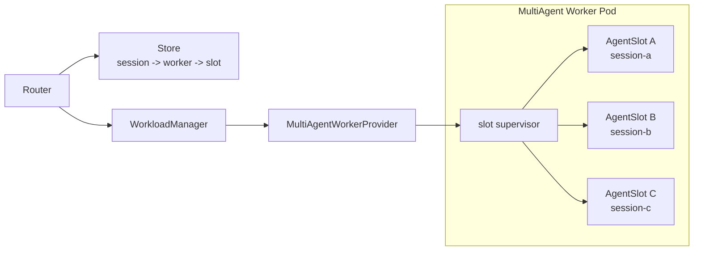

最小 PRD 要求：

| 能力 | 说明 |
| --- | --- |
| slot allocation | Store 记录 `session -> worker -> slot` |
| per-slot endpoint | Router 定位 slot port/path |
| workspace separation | 独立目录 / volume / cleanup |
| credential scope | 每个 session 独立 secret/token scope |
| resource accounting | per-slot CPU/memory/IO metrics |
| noisy neighbor control | cgroup/process limit/timeout |
| failure domain policy | Worker Pod 崩溃时批量标记和恢复 |

非目标：第一版不把 untrusted multi-tenant 安全隔离做成生产承诺；先从 trusted lightweight session / fake provider 验证模型。

## PRD：非功能需求

| 类别 | 要求 |
| --- | --- |
| 正确性 | 并发 resume 不重复启动；endpoint 不回退；provider 成功但 Store final CAS 失败要能补偿 |
| 可观测 | 每个状态迁移、provider latency、CAS conflict、orphan cleanup、pause/resume 成功率都有指标 |
| 可调试 | RuntimeHandle 能追溯到底层 Pod / Sandbox / slot / snapshot |
| 向后兼容 | 当前 create/delete/warm pool 路径不被大重构破坏 |
| 可测试 | fake provider 覆盖大多数状态机行为，真实 provider e2e 覆盖 object-flow |
| 安全 | owner/auth 先于 resume；workspace / credential / endpoint 不串 session |
| 可演进 | provider capability 决定功能，不要求所有 runtime 支持同一能力 |

## 验收指标

### 技术指标

| 指标 | 目标 |
| --- | --- |
| Ready invoke latency | 不因 lifecycle 设计显著退化 |
| Paused resume p50/p95/p99 | 按 provider / preservation level 输出 |
| CAS conflict handling | 并发 resume 下无重复 runtime / 无旧 endpoint 覆盖 |
| orphan runtime count | provider 成功但 Store finalization 失败后可检测 / 清理 |
| cleanup success rate | delete 后 Store、Pod/Sandbox/slot、workspace、snapshot 无残留 |
| endpoint freshness | resume 后 Router 使用新 endpoint |
| benchmark reproducibility | 记录 OS、K8s、runtime、provider、warm size、并发数 |

### 开源指标

| 指标 | 目标 |
| --- | --- |
| PR 可 review 性 | 每个 PR 聚焦一个 contract / test / adapter，不混大重构 |
| 社区讨论质量 | issue / proposal 有图、状态表、测试矩阵、非目标和兼容性说明 |
| 维护者信任 | 不抢已有 assignee 的实现，优先提交证据、测试、review matrix |
| 新贡献者上手 | README / docs 能解释 Session lifecycle、Provider、benchmark 怎么跑 |
| 竞品可信对比 | benchmark 不用营销口径，明确环境限制和 preservation level |

> 分析：开源成绩不是只看 star 或 PR 数。对基础设施项目，更重要的是 maintainer 是否愿意 review、是否降低理解成本、是否能把争议问题拆成可验证的小 PR。

## 分阶段路线图

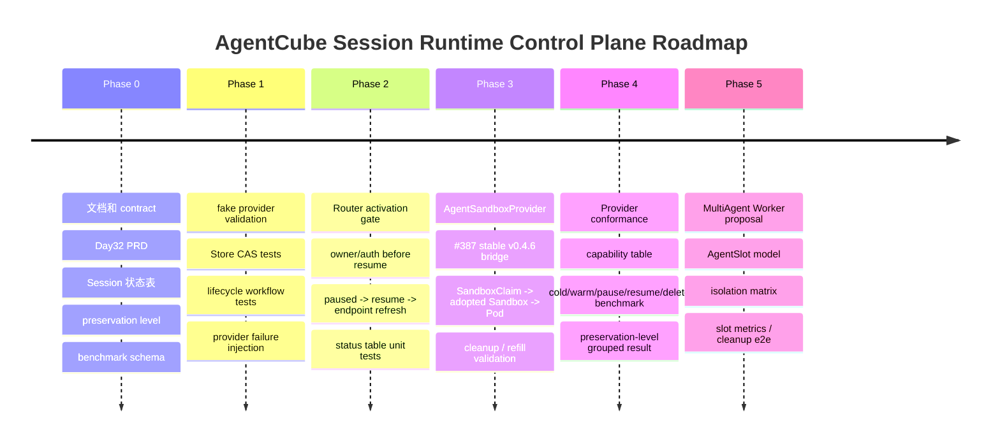

### Phase 0：先拿文档和测试标准建立共识

输出：

- 英文 proposal 草稿：Session lifecycle contract。
- 状态机和 Router 行为表。
- preservation level 定义。
- benchmark JSON schema。
- open questions：是否作为 #386 子 issue，还是先本地设计。

适合的开源动作：

- 暂不直接开大 PR。
- 可以准备 issue comment / proposal，但必须先给用户确认英文全文。

### Phase 1：fake provider + Store CAS

输出：

- Store CAS 单测。
- fake provider 注入 failure / timeout / final CAS conflict。
- lifecycle workflow table-driven tests。

为什么适合开源：

- 不依赖真实 agent-sandbox pause 能力。
- 不抢底层 provider 实现。
- 能证明设计正确性。

### Phase 2：Router resume-before-proxy

输出：

- Router status handling tests。
- owner mismatch 不 resume。
- resume 成功后 refresh endpoint。
- `Resuming` 返回 retryable。

风险：

- 依赖 WorkloadManager resume API contract。
- 如果已有 maintainer 接手，需要转成 review/test feedback。

### Phase 3：AgentSandboxProvider adapter

输出：

- `AgentSandboxProvider` 包装 `SandboxClaim -> adopted Sandbox -> Pod`。
- capability table：workspace resume、hard pause、endpoint may change。
- object-flow e2e：claim status、ownerRef、Pod annotation、Store placement、cleanup/refill。

前置：

- #387 stable v0.4.6 compatibility 更适合作为基础。
- v0.5/v1beta1 等正式 release 或 maintainer 要求后再升级。

### Phase 4：Benchmark / conformance suite

输出：

- cold create / warm create / pause / resume / delete cleanup。
- p50 / p95 / p99。
- provider / preservation level 分组。
- raw logs + host environment。
- math-agent / tool-call e2e 链路。

开源价值：

- 这是最不容易和别人抢实现的贡献。
- 能让 AgentCube 和 Substrate / OpenSandbox-like / E2B-like 路线形成可信对比。

### Phase 5：MultiAgent Worker / AgentSlot

输出：

- PRD / proposal。
- slot isolation matrix。
- trusted prototype。
- per-slot workspace / credential / port / metrics / cleanup tests。

非目标：

- 不第一版承诺生产级多租户安全隔离。
- 不混进 Sleep/Resume MVP。

## 如何在 Substrate 基础上做出更好的开源成绩

### 1. 不复制，而是转译

Substrate 给出的概念要转译成 AgentCube 语义：

| Substrate | AgentCube 应使用的语义 |
| --- | --- |
| Actor | Session |
| Worker | Runtime placement / Worker Pod / AgentSlot |
| WorkerPool | RuntimePool / capacity pool |
| ate-api-server | WorkloadManager lifecycle service |
| atenet-router | Router activation gate |
| SandboxConfig | RuntimeClassConfig / RuntimeCapabilities |

这样做的好处是：社区读者不会觉得 AgentCube 在追随另一个项目的 API，而是看到 AgentCube 正在形成自己的用户语义。

### 2. 用小 PR 建立可信度

不要一上来发“完整 Sleep/Resume + Provider + MultiAgent Worker”大 PR。更好的开源路径：

| PR / issue 类型 | 价值 | 风险 |
| --- | --- | --- |
| docs: session lifecycle contract | 建立共同语言 | 低 |
| test: fake provider lifecycle table | 证明 CAS 和状态机 | 低 |
| docs: preservation level and benchmark schema | 避免误解恢复语义 | 低 |
| test/tool: warmpool object-flow inspector | 支持 #387 / agent-sandbox review | 中 |
| router tests: paused status behavior | 贴近实现但可控 | 中 |
| provider adapter: AgentSandboxProvider | 有真实价值但需等 #387 | 中高 |
| proposal: MultiAgent Worker / AgentSlot | 差异化强，但不能急于实现 | 高 |

> 分析：这条路径能把 AgentCube 的开源形象从“提交一个大功能”变成“持续提供可验证架构判断”。这对 maintainer 更友好，也更容易获得 review。

### 3. 把 benchmark 做成公开资产

AgentCube 可以比 Substrate 更早把 benchmark 口径讲清楚：

```text
provider = agent-sandbox / fake / docker-local / future-multi-slot
preservationLevel = L0 / L1 / L2 / L3 / L4
operation = coldCreate / warmCreate / pause / resume / invokeReady / deleteCleanup
metrics = p50 / p95 / p99 / successRate / orphanCount / cleanupResidue
environment = OS / kernel / K8s / runtime / /dev/kvm / warmPoolSize / concurrency
```

这能形成开源优势：

- 不和竞品打口水仗。
- 用可复现数据讨论 tradeoff。
- 让不同 runtime provider 愿意接入 AgentCube 跑同一套测试。

### 4. 把“缺陷”包装成“成熟度路线”

对外不应说“AgentCube 缺这些所以不行”，而应说：

```text
AgentCube currently has a Kubernetes-native sandbox and warm-pool foundation.
The next maturity step is to make Session lifecycle explicit:
Store CAS, Router resume-before-proxy, RuntimeProvider capabilities,
and preservation-level-aware benchmarks.
```

中文内部理解：

- 当前缺口是真实的。
- 但缺口正好说明 AgentCube 有清楚演进空间。
- 只要每一步都有测试和文档，就能变成开源贡献节奏。

## 风险与约束

| 风险 | 当前情况 | 控制方式 |
| --- | --- | --- |
| #386 已有人可能接手 Sleep/Resume | FAUST-BENCHOU 表示愿意接手 | 不抢大实现，优先做设计、tests、review matrix |
| #387 未合并 | agent-sandbox v0.4.6 compatibility 仍在 review | provider adapter 等 #387 稳定后推进 |
| v0.5/v1beta1 还在变化 | rc1 已验证但正式 release 未定 | 不把 rc1 混进 stable PR |
| 本机无法实测 KVM/micro-VM | `/dev/kvm` 不可用 | 不承诺 micro-VM benchmark，只做源码/设计分析 |
| MultiAgent Worker 安全风险高 | 空间复用涉及隔离、凭据、workspace | 先 PRD + trusted prototype，不直接生产承诺 |
| 大抽象不易被社区接受 | RuntimeProvider 可能被认为过早 | 先从 fake provider tests 和 agent-sandbox adapter 痛点长出来 |

## 近期可执行计划

### 立刻可做

1. 把本文压缩成英文 proposal 草稿，但暂不发布。
2. 从本文抽一个最小 issue comment：Session lifecycle contract + Router resume-before-proxy + Store CAS。
3. 设计 benchmark JSON schema，先放本地报告。
4. 如果继续代码验证，只做 fake provider / Store CAS / Router table tests 的 fork-local spike。

### 等待条件

| 条件 | 满足后可以做 |
| --- | --- |
| #387 合并或 maintainer 明确 v0.4.6 方向 | 设计 `AgentSandboxProvider` adapter / object-flow tests |
| #386 分工明确 | 决定是否提 Router / Store / WorkloadManager 子 PR |
| 有 KVM 环境 | 复测 micro-VM / Substrate runtime path |
| 用户确认 upstream 文本 | 发送英文 proposal / issue comment |

## Day32 结论

AgentCube 要比 Substrate 做出更好的开源成绩，不应该在第一阶段比谁的底层 runtime 更复杂，而应该在四件事上领先：

1. **更清楚的用户语义**：用 Session / RuntimeProvider / Workspace / PreservationLevel 表达 Agent 开发者真正关心的东西。
2. **更低门槛的验证路径**：fake provider、agent-sandbox provider、benchmark schema、object-flow inspector，让贡献者不用先搭完整 substrate 才能参与。
3. **更强的 Kubernetes-native 落地**：利用 agent-sandbox、warm pool、CRD/controller 生态，但不把高频 session 状态压到 Kubernetes API server。
4. **更可信的开源节奏**：小 PR、强测试、清晰非目标、公开 benchmark，而不是一次性大重构。

最终目标不是“AgentCube 变成另一个 Substrate”，而是：

```text
AgentCube = Kubernetes-native Agent Session Runtime Control Plane
           + Provider-extensible Runtime Layer
           + Open Benchmark / Conformance Asset
           + Future MultiAgent Worker Density Advantage
```

这条路线既吸收了 Substrate 的架构边界，又保留了 AgentCube 自己的社区位置和产品差异化。
