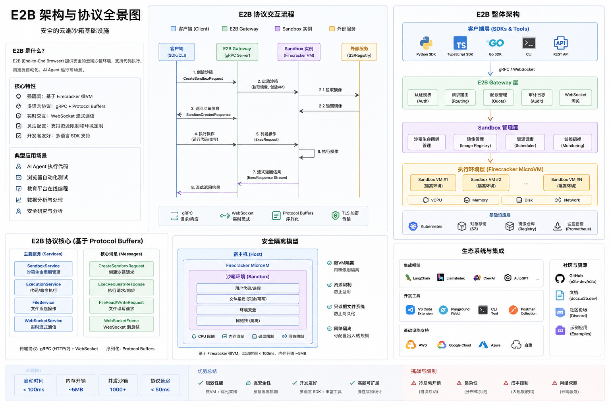

# Day 33：E2B 协议面与“Agent 时代 Docker”调研

日期：2026-07-01

## 图解总览



> 注释：这张图用于快速建立 E2B 的整体心智模型：客户端 SDK / API、Gateway、sandbox 管理、执行环境、基础设施和生态集成之间的关系。具体协议和兼容性边界仍以本文后面对 E2B 官方 OpenAPI、envd proto 和 SDK 源码的拆解为准。

## 今日目标

Mentor 提到 E2B 可能是“Agent 时代的 Docker 公司”。今天不做泛泛竞品介绍，重点回答四个问题：

1. E2B 到底是什么，所谓 “E2B 协议”指哪几层接口。
2. 为什么它会被类比为 Docker，而不只是一个普通 code interpreter SaaS。
3. AgentCube、OpenSandbox、CubeSandbox、Agent Substrate 和 E2B 分别站在哪一层。
4. 如果 AgentCube 后续要做 E2B-compatible API / SDK，需要先设计哪些边界和 conformance test。

> 注释：这里的“协议”不要先理解成 TCP、HTTP、OCI 这类中立标准。E2B 当前更像“事实上的开发者 API / SDK 兼容面”：上层有 Python / TypeScript SDK，中间有 REST 生命周期 API，sandbox 内部还有 envd 的 process / filesystem RPC。别人说“兼容 E2B”，通常是在说“官方 E2B SDK 或常见 E2B 调用能否少改代码跑起来”。

## 调研方法与资料来源

本次主要看官方源码和已有本地报告，不以二手文章为依据。

| 来源 | 本地 / 在线位置 | 用途 |
| --- | --- | --- |
| E2B 官方仓库 | `/tmp/e2b-research`，remote `https://github.com/e2b-dev/e2b.git`，HEAD `2b7dd17 feat(sdk): add gzip option to template copy layer (#1482)` | SDK、OpenAPI、envd proto、README |
| E2B README | `/tmp/e2b-research/README.md` | 官方定位、快速开始、自托管入口 |
| E2B OpenAPI | `/tmp/e2b-research/spec/openapi.yml` | sandbox lifecycle、template、network、snapshot、volume、node API |
| E2B envd process proto | `/tmp/e2b-research/spec/envd/process/process.proto` | sandbox 内 process / command / PTY / signal / stdin 流式接口 |
| E2B envd filesystem proto | `/tmp/e2b-research/spec/envd/filesystem/filesystem.proto` | sandbox 内文件 stat/list/mkdir/move/remove/watch 接口 |
| E2B Python SDK | `/tmp/e2b-research/packages/python-sdk/e2b/` | `Sandbox.create/connect/pause/kill`、connection config、SDK 语义 |
| 既有实习记录 | [Day11](day11-cloud-agent-sandbox-projects.md)、[Day21](day21-opensandbox-agent-substrate-study.md)、[Day32](day32-substrate-competitive-analysis-and-agentcube-prd.md) | CubeSandbox / OpenSandbox / Agent Substrate / AgentCube 对比基线 |

过程修正：

- 一开始使用了网页和宽泛搜索，信息面太散；后续改为直接 clone 官方 E2B 仓库，本地读 `spec/openapi.yml`、`spec/envd/*.proto` 和 SDK 源码。
- 本地 `rg` 正则里如果直接放 `|`，在当前 Windows/Git Bash 工具层容易被外层 shell 误拆；后续改成 `rg -e pattern` 或直接读取具体文件段落。

> 分析：这次的工程判断是，调研“协议面”最可靠的入口不是官网文案，而是 OpenAPI / proto / SDK 源码。README 说明定位，OpenAPI 和 proto 说明真实契约，SDK 说明开发者实际会依赖哪些行为。

## 一句话结论

E2B 不是一个已经中立标准化的“协议”，而是一套正在形成事实标准影响力的 **Agent sandbox 开发者平台接口**：`template` 类似 Docker image，`sandbox` 类似 container，`commands/files/PTY` 类似 `docker exec/cp/attach`，`pause/connect/snapshot/timeout/network/volume` 则把 Agent 长会话需要的状态管理、安全和资源生命周期补到了 API 层。

Mentor 说它像“Agent 时代的 Docker”，关键不是说它底层等于 Docker，而是说它试图占住 Docker 当年占住的那一层：**让开发者用一个简单、可复用、可移植的抽象去打包、启动、控制、连接和销毁运行环境**。

> 注释：Docker 的核心价值不是“我也能创建 Linux namespace”，而是把 Dockerfile、image、registry、container、exec、logs、network、volume 组合成一个开发者默认入口。E2B 的野心类似：让 agent / LLM 应用默认通过 E2B SDK 去拿一个可执行、可持久、可观测、可暂停恢复的 sandbox。

## E2B 的“协议面”拆解

E2B 至少要分四层看。

| 层 | 代表文件 / 入口 | 核心能力 | 对兼容方的要求 |
| --- | --- | --- | --- |
| SDK 层 | Python / TypeScript SDK | `Sandbox.create()`、`connect()`、`pause()`、`kill()`、`commands.run()`、`files.*`、template build | 兼容官方 SDK 的参数、返回字段、错误语义和环境变量 |
| 控制面 REST API | `spec/openapi.yml` | `/sandboxes`、`/sandboxes/{id}`、`/pause`、`/connect`、`/timeout`、`/network`、`/snapshots`、`/templates`、`/volumes` | 暴露 E2B-style lifecycle endpoint，并能返回 SDK 需要的 sandbox endpoint / token / envd version |
| sandbox 内 envd RPC | `spec/envd/process/*.proto`、`spec/envd/filesystem/*.proto` | process list/start/connect/stream input/signal/PTY；filesystem stat/list/move/mkdir/remove/watch | sandbox 内必须有等价 daemon，或者 gateway 能把这些 RPC 翻译到自身执行服务 |
| 运行时 / 产品能力层 | README + infra/self-hosting 入口 | template、snapshot、network egress、volume、metrics、logs、node capacity | 不只是能跑命令，还要有状态、网络、安全、观测和配额 |

> 注释：`envd` 可以理解为 E2B sandbox 里的“执行守护进程”。SDK 创建 sandbox 后，后续命令执行和文件操作并不是直接 SSH 进去，而是访问 sandbox 内的 envd API。AgentCube 现在的 PicoD 扮演了类似角色，但 PicoD API 不是 E2B envd proto。

### 控制面 REST

`spec/openapi.yml` 里的核心 endpoint 包括：

| Endpoint | 语义 |
| --- | --- |
| `GET /sandboxes` | 列出 running sandbox，可按 metadata 过滤 |
| `POST /sandboxes` | 从 template 创建 sandbox |
| `GET /v2/sandboxes` | 列出所有 sandbox，支持 state / pagination |
| `GET /sandboxes/{sandboxID}` | 查询 sandbox detail |
| `DELETE /sandboxes/{sandboxID}` | kill sandbox |
| `POST /sandboxes/{sandboxID}/pause` | pause sandbox，可指定 memory snapshot |
| `POST /sandboxes/{sandboxID}/resume` | resume sandbox，但当前 OpenAPI 标记 deprecated |
| `POST /sandboxes/{sandboxID}/connect` | 连接 sandbox；如果 paused，会 resume；只延长 TTL |
| `POST /sandboxes/{sandboxID}/timeout` | 设置 TTL |
| `PUT /sandboxes/{sandboxID}/network` | 更新 running sandbox 的网络出站策略 |
| `POST /sandboxes/{sandboxID}/snapshots` | 从 sandbox 当前状态创建持久 snapshot |
| `GET /snapshots` | 列出 snapshot |
| `POST /v3/templates` | 创建 / 构建 template |
| `GET /templates`、`GET /templates/{templateID}` | 查询 template / builds |
| `GET /sandboxes/{sandboxID}/metrics`、`GET /sandboxes/{sandboxID}/logs` | 观测接口 |

重要字段：

| Schema | 字段 | 含义 |
| --- | --- | --- |
| `NewSandbox` | `templateID` | sandbox 从哪个 template 创建 |
| `NewSandbox` | `timeout` | TTL |
| `NewSandbox` | `autoPause` / `autoPauseMemory` | 超时后是否 pause，以及 pause 是 memory snapshot 还是 filesystem-only |
| `NewSandbox` | `autoResume` | paused sandbox 是否允许流量触发自动恢复 |
| `NewSandbox` | `secure` | sandbox 系统通信是否加访问 token |
| `NewSandbox` | `allow_internet_access` / `network` | 出站网络控制 |
| `NewSandbox` | `envVars` / `metadata` / `mcp` / `volumeMounts` | 环境变量、元数据、MCP、卷挂载 |
| `SandboxPauseRequest` | `memory` | `false` 时只保留 filesystem，resume 是 cold boot，会丢 running process 和 open connection |

> 分析：这里最重要的不是 endpoint 数量，而是 E2B 把 “timeout 后 kill 还是 pause”、“pause 是否保留内存”、“paused 是否能 auto-resume” 变成了 API 语义。AgentCube 当前的 idle delete / warm pool create 还没有同等清晰的对外 lifecycle contract。

### SDK 行为

Python SDK 的 `Sandbox.create()` 支持：

- `template`
- `timeout`
- `metadata`
- `envs`
- `secure`
- `allow_internet_access`
- `mcp`
- `network`
- `lifecycle`
- `volume_mounts`

`Sandbox.connect()` 的语义是：如果 sandbox 已暂停，会自动恢复；running sandbox 只在新 timeout 更长时延长 TTL。

`Sandbox.pause(keep_memory=True)` 的语义是：默认保留 memory snapshot；`keep_memory=False` 时只保留 filesystem，恢复时 cold boot，会丢进程和打开连接。

SDK 连接配置支持：

- `E2B_API_KEY`
- `E2B_DOMAIN`
- `E2B_API_URL`
- `E2B_SANDBOX_URL`
- `E2B_DEBUG`
- `E2B_VALIDATE_API_KEY`
- request timeout / proxy / custom API headers

> 注释：`E2B_API_URL` 和 `E2B_SANDBOX_URL` 对兼容实现很关键。像 CubeSandbox 这类项目能让用户把官方 E2B SDK 指向自己的 API server，本质上就是利用 SDK 可配置 endpoint。但只改 `E2B_API_URL` 不够，sandbox 内执行面也要能被 SDK 正确访问。

### envd process RPC

`spec/envd/process/process.proto` 定义了 `Process` service：

| RPC | 作用 |
| --- | --- |
| `List` | 列出进程 |
| `Start` | 启动进程，stream 返回 start/data/end/keepalive |
| `Connect` | 连接到已有进程，stream 返回过程事件 |
| `Update` | 更新 PTY size 等 |
| `StreamInput` | 客户端输入流，保证输入顺序 |
| `SendInput` | 发送 stdin / pty 输入 |
| `SendSignal` | 发送 SIGTERM / SIGKILL |
| `CloseStdin` | 关闭 stdin |

它还显式建模：

- `PTY` 行列大小。
- `ProcessConfig` 的 `cmd`、`args`、`envs`、`cwd`。
- `ProcessSelector` 可按 `pid` 或 `tag` 选择。
- `ProcessEvent` 区分 stdout、stderr、pty、exit_code、keepalive。

> 注释：这解释了为什么“兼容 E2B commands.run”不是简单 HTTP `POST /execute`。SDK 依赖的是一套可流式、可重连、可输入、可发信号、可 PTY 的 process contract。AgentCube 的 PicoD `/api/execute` 能覆盖一次性 command，但离完整 envd process 兼容还有差距。

### envd filesystem RPC

`spec/envd/filesystem/filesystem.proto` 定义了 `Filesystem` service：

| RPC | 作用 |
| --- | --- |
| `Stat` | 查询文件 / 目录信息 |
| `MakeDir` | 创建目录 |
| `Move` | 移动 |
| `ListDir` | 列目录 |
| `Remove` | 删除 |
| `WatchDir` | 流式 watch 文件事件 |
| `CreateWatcher` / `GetWatcherEvents` / `RemoveWatcher` | 非流式 watcher |

文件信息包含：

- name / type / path / size
- mode / permissions / owner / group
- modified_time
- symlink_target
- user-defined metadata

> 分析：文件 API 是 agent sandbox 的核心，因为 agent 的长期上下文很多时候落在 workspace 里。E2B 把文件系统 watch 也放进 proto，说明它面向的不只是“执行一段 Python”，还包括 agent 对工作区的持续读写、监听和增量处理。

## 为什么像 Docker

这个类比可以按 Docker 的抽象层逐项对应。

| Docker 抽象 | E2B 对应物 | 说明 |
| --- | --- | --- |
| Dockerfile / image | Template / template build / snapshot template | 定义可复用运行环境 |
| Container | Sandbox | 一个具体运行实例，有 ID、状态、资源、网络、TTL |
| `docker run` | `Sandbox.create()` / `POST /sandboxes` | 从 template 启动实例 |
| `docker exec` | `sandbox.commands.run()` / envd process `Start` | 在实例内执行命令 |
| `docker attach` / terminal | envd process `Connect` / PTY | 连接运行中进程或终端 |
| `docker cp` | `sandbox.files.*` / envd filesystem API | 读写 sandbox 文件 |
| `docker logs` | `/sandboxes/{id}/logs` | 取运行日志 |
| `docker stats` | `/sandboxes/{id}/metrics` | 取资源指标 |
| Docker network | sandbox network allow / deny / transform | 控制出入站网络 |
| Docker volume | E2B volume / volumeMounts | 持久化或共享数据 |
| `docker pause/start/kill` | `pause/connect/kill` | 生命周期控制 |
| registry / image ecosystem | template registry / snapshots / SDK ecosystem | 复用环境并降低迁移成本 |

相似点：

- 都把底层 runtime 复杂性压成开发者默认入口。
- 都强调可复用环境、实例生命周期、命令执行、文件操作、网络和日志。
- 都让上层框架可以围绕一个统一 abstraction 做集成。

不同点：

- Docker 是通用容器生态和 OCI 事实标准入口；E2B 是面向 AI-generated code / agent sandbox 的产品 API 和 SDK 生态。
- Docker 更偏本地和基础设施底层；E2B 更偏远端 cloud sandbox、SDK-first、LLM/agent workflow。
- Docker 的 container 不默认带 agent 生命周期语义；E2B 把 TTL、pause、connect、snapshot、auto-resume、MCP、egress 这些 agent 场景需要的语义放进 API。
- Docker 生态核心是 image；E2B 生态核心是 template + sandbox session + SDK。

> 分析：所以“Agent 时代 Docker”不是说 E2B 一定会替代 Docker，也不是说它一定会成为 OCI 级标准。更准确的说法是：如果 agent 应用需要一个默认 sandbox API，E2B 现在在抢这个默认入口。

## 和现有竞品 / AgentCube 的位置对比

| 项目 | 更像哪一层 | 和 E2B 的关系 |
| --- | --- | --- |
| E2B | SDK-first agent sandbox platform | 事实上的兼容对象和开发者入口 |
| CubeSandbox | 高性能 KVM sandbox platform + E2B-compatible API gateway | 通过 E2B 兼容降低迁移成本，是自建 E2B 替代方向 |
| OpenSandbox | 通用 sandbox API / SDK / MCP + 多 backend adapter | E2B-like，但维护自身 API；Day21 已记录其 issue #800 对完整 E2B drop-in 持 not planned 态度 |
| Agent Substrate | stateful actor substrate / suspend-resume runtime | 不是 E2B API 实现，重点是 actor lifecycle、worker multiplex、resume-before-proxy |
| AgentCube | Kubernetes-native Agent / CodeInterpreter runtime control plane | 当前是自有 SDK/API，不能声称 E2B-compatible；后续可做 facade |

> 注释：`E2B-like` 和 `E2B-compatible` 要严格区分。前者表示概念上也有 sandbox create / command / file API；后者表示官方 E2B SDK 或 E2B 常见调用可以实际跑通。AgentCube 当前只能说有 code interpreter / sandbox 能力，不能说兼容 E2B。

## 对 AgentCube 的启发

AgentCube 如果要认真做 E2B 方向，不能把它混在 #387 agent-sandbox compatibility 或 Sleep/Resume PR 里。它应该是一个独立 facade / compatibility proposal。

### 推荐分层

| 层 | AgentCube 当前基础 | E2B compatibility 需要补什么 |
| --- | --- | --- |
| Control API | WorkloadManager session create/delete、Router proxy、自有 Python SDK | E2B-style `/sandboxes` lifecycle facade；sandbox ID 与 AgentCube session ID 映射 |
| Runtime identity | `CodeInterpreter` / `AgentRuntime` CRD，Store 保存 session | 明确 E2B `sandboxID`、templateID、metadata、timeout 与 Store 字段关系 |
| Data plane | Router -> PicoD `/api/execute` / files | envd process/filesystem proto 兼容，或 SDK adapter 把 E2B calls 翻译到 PicoD |
| Lifecycle | 当前偏 idle delete；Sleep/Resume 仍在设计 | `pause/connect/timeout/on_timeout/auto_resume` 语义表 |
| Template | CodeInterpreter image / sandbox template / warm pool | E2B `templateID` 到 AgentCube runtime template 的映射，startCmd / readyCmd 语义 |
| Network | 当前主要依赖 K8s / service / NetworkPolicy 后续设计 | E2B allow/deny egress、public traffic、host mask、header transform 的最小子集 |
| Auth | Router JWT / PicoD public key / API auth | E2B API key、envd access token、traffic access token 或等价替代 |
| Observability | 基础日志、PR #400 metrics 方向 | E2B-compatible logs/metrics endpoint 或明确不支持 |
| Volume / workspace | sandbox workspace 文件路径、PVC 方向待设计 | volumeMounts、snapshot、filesystem persistence 语义 |

### 兼容等级

| 等级 | 定义 | AgentCube 可行路径 |
| --- | --- | --- |
| L0：概念对齐 | 文档说明 AgentCube API 和 E2B API 的概念映射 | 可立即写 design note |
| L1：SDK wrapper | 写一个 AgentCube SDK，让 API 命名接近 E2B，但不跑官方 E2B SDK | 成本低，但不能宣传 E2B-compatible |
| L2：REST lifecycle 子集 | 支持 `POST /sandboxes`、`GET /sandboxes/{id}`、`DELETE`、`timeout`、基础 metadata/envs | 可作为第一版 facade |
| L3：官方 SDK 常用路径 | 官方 Python/JS SDK 的 `create/connect/kill/commands.run/files.read/write/list` 跑通 | 才能谨慎说 partial E2B-compatible |
| L4：完整 drop-in | lifecycle、envd process/filesystem/PTY/watch、template、snapshot、network、logs/metrics、volumes、错误模型都对齐 | 长期目标，维护成本高 |

> 分析：如果只做 L2，就应该叫 “E2B-style lifecycle API”。如果做到 L3，并用官方 SDK conformance 证明，才能叫 “E2B-compatible subset”。这条线要避免营销口径走在工程证据前面。

### 最小 conformance test 计划

如果后续写 AgentCube E2B facade，建议先用官方 E2B Python SDK 做以下测试：

| 编号 | 测试 | 通过条件 |
| --- | --- | --- |
| C1 | `Sandbox.create(template=..., timeout=..., envs=..., metadata=...)` | 返回 sandbox ID、domain / endpoint、envd version 或兼容字段 |
| C2 | `sandbox.commands.run(\"echo ok\")` | stdout 为 `ok`，exit code 为 0，错误结构符合 SDK 预期 |
| C3 | `sandbox.files.write()` / `read()` / `list()` | workspace 文件能跨命令保留 |
| C4 | `sandbox.set_timeout()` | TTL 可延长 / 缩短，后端 Store 语义明确 |
| C5 | `sandbox.pause()` + `Sandbox.connect(id)` | paused 后 connect 能恢复；如果只支持 filesystem-only，要明确不支持 transparent auto-resume |
| C6 | `sandbox.kill()` | 后端 CR / Pod / Store 清理，无资源残留 |
| C7 | wrong ID / expired ID / permission mismatch | 404 / 401 / 403 / 409 映射稳定 |
| C8 | official JS SDK 同路径 | 验证不是只兼容 Python SDK 的偶然行为 |

这组测试应放在 fork/local validation 或独立 compatibility branch，不应夹到 #387、#403、PR #400 这种已有明确 scope 的 PR 中。

## 对 Sleep/Resume 设计的补充

E2B 的 lifecycle 字段给 AgentCube Sleep/Resume 一个很清晰的参考：

| 问题 | E2B 暴露方式 | AgentCube 可借鉴 |
| --- | --- | --- |
| timeout 后做什么 | `on_timeout=kill/pause`、`autoPause` | 不要把 idle timeout 永远绑定 delete；应拆成 pause candidate 和 hard delete |
| pause 保留什么 | `memory=true/false`、`keep_memory` | 明确 preservation level：memory / filesystem / workspace / none |
| 谁触发 resume | `connect()` 或 auto-resume traffic | Router resume-before-proxy 与 explicit resume API 要分清 |
| resume 后 endpoint 是否变化 | `connect()` 返回 sandbox details | AgentCube resume 后必须重新读 Store / entrypoint |
| filesystem-only 是否能透明恢复 | E2B 明确不能 auto-resume | AgentCube 如果只是重建 Pod + PVC，不能承诺透明保留进程 |

> 注释：`memory snapshot` 是保存进程内存和运行现场，用户感知更接近“暂停后继续”。`filesystem-only` 是只保留磁盘 / workspace，恢复时进程会重启。两者都可以叫 pause，但产品语义完全不同。AgentCube 文档里必须把这件事说清楚。

## 今日结论

1. E2B 的核心竞争力不是单个 runtime 技术，而是 SDK、API、template、envd、snapshot、network、volume、logs/metrics 组合成的开发者默认面。
2. “E2B protocol” 更准确地说是三层契约：REST lifecycle API、envd process/filesystem RPC、SDK 行为和环境变量。
3. E2B 之所以像 Docker，是因为它把 agent sandbox 从基础设施问题包装成了开发者可复用的运行环境抽象。
4. AgentCube 当前不能声称 E2B-compatible；最多说具备 code interpreter / sandbox 基础能力。
5. AgentCube 后续若做 E2B，要先做 facade proposal 和 conformance tests，把 sandbox ID、session ID、template、PicoD/envd、pause/connect、auth、network、volume 映射讲清楚。
6. 短期最有价值的不是马上实现完整兼容，而是写清楚 L0-L4 compatibility ladder，并用官方 E2B SDK 定义最小验收。

## 下一步

建议后续单独开一份设计草案：

```text
AgentCube E2B Compatibility Facade Proposal

Scope:
- E2B-compatible lifecycle subset
- sandboxID <-> AgentCube sessionID mapping
- official Python/JS SDK conformance suite

Non-goals:
- not full envd PTY/watch compatibility in MVP
- not mixed into agent-sandbox v0.4.6 compatibility PR
- not claiming drop-in replacement before L3 conformance passes
```

可优先做的本地任务：

1. 写 `docs/design/e2b-compatibility-facade.md` 草案。
2. 写最小 conformance script，先针对真实 E2B SDK 抽象出测试步骤。
3. 对 AgentCube 当前 PicoD API 和 envd process/filesystem proto 做差距表。
4. 评估是做 `E2B API gateway -> PicoD translation`，还是在 sandbox 内新增 envd-compatible sidecar。
