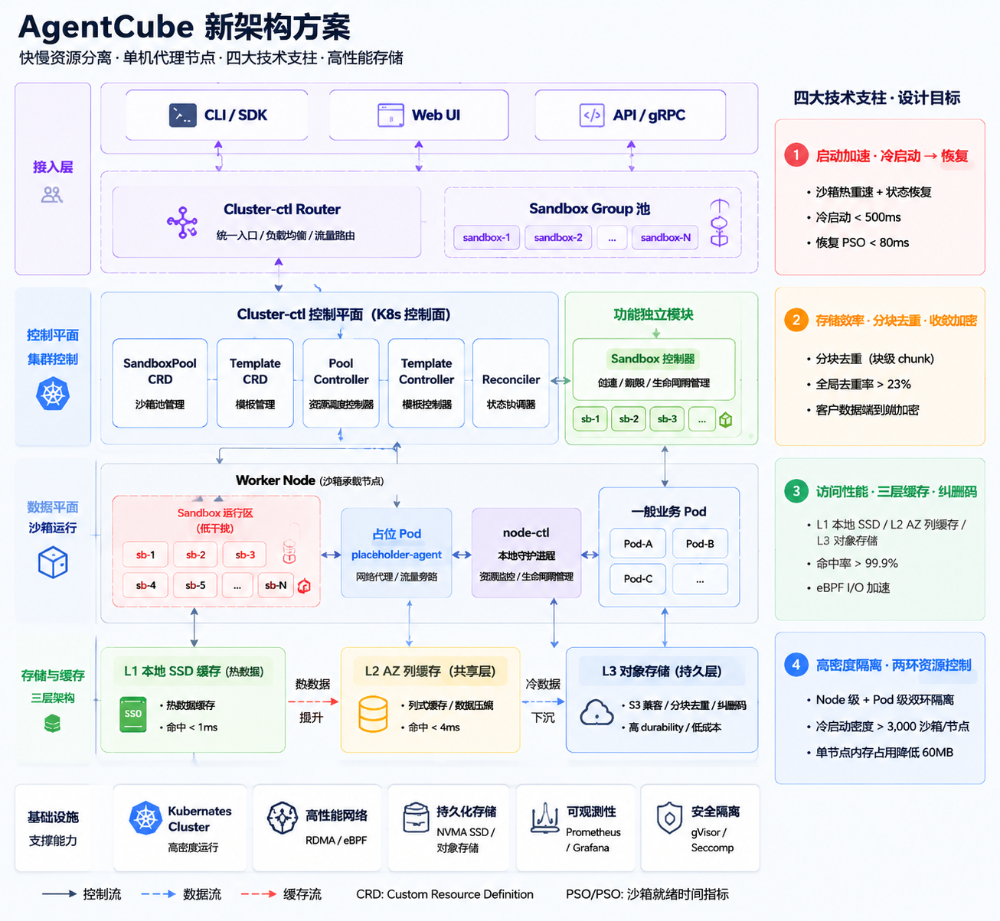

# Day 35：三期会议迭代讨论后的 AgentCube 新架构结论分析

日期：2026-07-02

## 图解总览



> 注释：这张图是本轮三期会议讨论后的架构收敛图，用来表达 AgentCube 从“按需创建沙箱”走向“高并发 Agent 沙箱加速平台”的目标状态。图里的指标，例如冷启动 `< 500ms`、恢复 PSO `< 80ms`、单节点 `> 3,000` 沙箱节点，当前应理解为设计目标和后续 benchmark 验收方向，不应直接写成已实现结果。

## 关联材料

| 材料 | 文件 | 作用 |
| --- | --- | --- |
| 新架构方案图 | [day35-agentcube-new-architecture-proposal.png](day35-agentcube-new-architecture-proposal.png) | 汇总接入层、控制面、节点侧、三级缓存和四大技术支柱 |
| CRD 详细设计 | [docs/design/k8s-crd-sandbox-resource-pool-lifecycle-control-design.md](../docs/design/k8s-crd-sandbox-resource-pool-lifecycle-control-design.md) | 外部参考设计稿，展开 SandboxPoolTemplate、SandboxPool、占位 Pod、placeholder-agent、node-ctl 黑盒接口和控制器流程 |
| Substrate 差异化设计 | [Day 28](day28-agent-substrate-architecture-and-agentcube-differentiation.md) | 提供 WorkerPool / worker cache / router activation gate 等参考基线 |
| AgentCube 开源 PRD | [Day 32](day32-substrate-competitive-analysis-and-agentcube-prd.md) | 把 Substrate 竞品分析转成 AgentCube Session Runtime Control Plane 方向 |
| E2B 协议面调研 | [Day 33](day33-e2b-protocol-and-agent-era-docker-study.md) | 明确 E2B-compatible 不是一句口号，而是 SDK / REST lifecycle / envd RPC / template snapshot 等兼容面 |

## 一句话结论

本次 AgentCube 新架构的本质，是把 Kubernetes 从“每个沙箱的直接调度器”调整为“慢资源和资源边界管理器”，把高频的沙箱创建、恢复、暂停和销毁下沉到节点本地；同时通过 sandbox pool、microVM 快照、run-builder 模板复用和 L1/L2/L3 三级缓存，把沙箱启动从“创建式”优化为“恢复式”，最终形成低延迟、高密度、可弹性伸缩的云原生 Agent 沙箱平台。

> 分析：这不是否定 Kubernetes，而是重新划分 Kubernetes 的责任边界。Kubernetes 仍然负责资源声明、调度边界、节点选择、控制器模型和可观测生态；AgentCube 负责更高频、更贴近 Agent 请求路径的沙箱生命周期。

## 三期迭代的设计演进

这次会议可以理解为第三期架构讨论的收敛点。前两期更多是在理解现状、竞品和控制面边界，第三期开始把“AgentCube 应该长成什么样”落成明确的模块和资源模型。

| 阶段 | 主要问题 | 形成的判断 |
| --- | --- | --- |
| 第一期：现有架构理解 | AgentCube 当前主要围绕 WorkloadManager、Router、Store、PicoD、agent-sandbox 做按需 session / sandbox 生命周期管理 | 当前模式能跑通 Agent workflow，但沙箱创建路径仍受 Pod / CRD / controller / runtime 链路影响，不适合极高频短生命周期场景 |
| 第二期：竞品和方向校准 | Agent Substrate、OpenSandbox、CubeSandbox、E2B 等项目分别解决了调度、runtime、API facade、template / snapshot 问题 | AgentCube 不应只复制某个竞品实现，而要形成 Kubernetes-native + node-local runtime + E2B-compatible facade 的组合路线 |
| 第三期：新架构收敛 | 如何同时解决冷启动、恢复速度、单节点密度、存储复用和可运维性 | 使用 CRD 管理资源池、占位 Pod 锁定慢资源边界、node-ctl / sandbox-ctl 管理本地沙箱生命周期、三级缓存和 microVM runtime 支撑高密度 |

> 注释：这里的“三期”不是发布版本号，而是本地方案讨论的迭代阶段。第三期的价值是把之前分散的概念收束成一张能解释端到端链路的系统架构图。

## 背景问题

原有沙箱创建路径更接近“按请求创建运行环境”：

1. 控制面接收到创建请求。
2. WorkloadManager 或 controller 创建底层资源。
3. Kubernetes 调度 Pod / CRD 对象。
4. runtime 拉镜像、初始化网络、挂载存储。
5. Router 再把请求转发到可用 entrypoint。

这个路径在普通服务部署场景里合理，但对 Agent sandbox 有几个问题：

| 问题 | 对 Agent 场景的影响 |
| --- | --- |
| Pod 级调度路径长 | 高频创建 / 销毁 sandbox 时，kube-scheduler、kubelet、CNI、镜像准备都会进入关键路径 |
| runtime 初始化重复 | 相同模板、相同依赖、相同 rootfs 反复拉取和初始化，浪费 I/O 和启动时间 |
| 控制面承压 | 如果每个 sandbox 都是完整控制面对象，会让中心控制器承担过多高频状态变化 |
| 单节点密度不足 | 一个 sandbox 对应完整 Pod 语义时，内存、进程、网络和控制面对象开销都偏重 |
| 恢复语义不清 | 只做 warm pool 不等于拥有完整 pause / resume / snapshot / connect lifecycle contract |

> 分析：Agent 的运行特点是短生命周期、多轮工具调用、并发高、状态要保留、启动延迟敏感。它和长期运行的业务 Pod 不完全一样，因此不能把 Kubernetes Pod 作为唯一沙箱粒度。

## 设计目标

第三期方案把目标拆成四大技术支柱：

| 支柱 | 设计目标 | 关键机制 |
| --- | --- | --- |
| 启动加速 | 冷启动 `< 500ms`，恢复 PSO `< 80ms` | sandbox pool、microVM 快照、状态恢复、模板预热 |
| 存储效率 | 分块去重、全局去重率 `> 23%`、客户数据端到端加密 | run-builder、chunk store、模板复用、收敛加密或租户级加密 |
| 访问性能 | L1/L2/L3 三级缓存，热点命中率目标 `> 99.9%` | 本地 SSD、AZ 级缓存、对象存储回源、eBPF / I/O 加速 |
| 高密度隔离 | Node / Pod 双层资源隔离，单节点 `> 3,000` sandbox，单节点额外内存 `< 60MB` | Kubernetes 外层资源边界、node-local 内层 runtime、microVM / gVisor / seccomp |

> 注释：PSO / PSO-like 指图中用于描述“沙箱就绪 / 恢复就绪”路径的性能指标。后续写正式设计文档时，需要把该指标统一成社区能理解的 benchmark 名称，例如 `resume p50`、`ready-to-exec latency` 或 `sandbox restore latency`。

## 总体架构

新架构按职责拆成七层。E2B-like SDK 兼容主入口应标注在 **接入层**：它是面向 Python / TypeScript SDK、REST API 和上层 Agent framework 的 facade / adapter，负责把 E2B 风格的 `Sandbox.create()`、`connect()`、`kill()`、`commands.run()`、`files.*` 等调用翻译成 AgentCube 内部 API / gRPC。

| 层 | 组件 | 责任 | E2B-like SDK 兼容标注 |
| --- | --- | --- | --- |
| 接入层 | CLI / SDK、Web UI、API / gRPC、E2B-like SDK Facade | 面向用户和上层 Agent framework，提供创建、连接、执行、恢复、销毁等接口 | **主入口**：兼容 E2B SDK / REST 调用形态，把 E2B-like API 转成内部 API |
| 路由层 | Cluster-ctl Router、Sandbox Group 池 | 统一入口、鉴权、负载均衡、流量路由、按 sandbox group 分发请求 | 支撑 `connect`、`pause/resume`、`timeout`、`kill` 等 lifecycle 路由 |
| 集群控制层 | Cluster-ctl 控制平面、SandboxPool CRD、Template CRD、Pool Controller、Template Controller、Reconciler | 负责全局策略、声明式资源池、模板版本、状态对齐和异常修复 | 支撑 sandbox / template / metadata 的 desired state |
| 功能独立模块 | Sandbox 控制器 | 管理 sandbox 创建、领取、生命周期调度的独立能力，减少主控制面耦合 | 承接 facade 转换后的 sandbox lifecycle 操作 |
| 节点执行层 | Worker Node、占位 Pod、placeholder-agent、node-ctl | 在节点本地执行高频生命周期操作，避免每次请求都走完整 Kubernetes 调度链路 | 执行 node-local create / restore / pause / delete |
| 沙箱运行层 | Sandbox 运行区、sandbox-ctl、microVM / lightweight isolation | 承载真实 sandbox，提供进程 / 文件系统 / 网络隔离和 snapshot / restore | 支撑 `commands.run`、process stream、`files.*` 等执行面兼容 |
| 存储与缓存层 | L1 本地 SSD、L2 AZ 缓存、L3 对象存储 | 缓存模板、rootfs、snapshot、chunk，降低启动和恢复 I/O 延迟 | 支撑 template、snapshot、volume、workspace / file 数据兼容 |

> 注释：如果画在架构图里，建议把 `E2B-like SDK Facade` 放在接入层，与 CLI / SDK、API / gRPC 并列；再用虚线标注它向下依赖三类能力：路由层 lifecycle、沙箱运行层 commands / files / process、存储缓存层 template / snapshot。这样不会误解成“只在 SDK 层写一层 wrapper 就完成 E2B 兼容”。

> 分析：最关键的架构变化是控制面和数据面的分工。集群控制面看全局，节点本地控制器处理高频局部决策，缓存层处理数据路径，Router 处理请求路径。每一层只持有自己必须知道的状态，避免单个中心组件变成所有事件的串行瓶颈。

## 核心机制一：Kubernetes CRD 管理资源池

CRD 层的核心资源是：

| 资源 | 作用 |
| --- | --- |
| `SandboxPoolTemplate` | 定义全局资源池模板、节点选择、资源策略、占位 Pod 模板和同步策略 |
| `SandboxPool` | 每节点一个实例，记录节点级资源池状态、placeholder-agent 状态、node-ctl 连接状态和只读 poolInfo |
| `Template CRD` | 管理镜像、运行环境、启动模板、snapshot / rootfs 版本 |
| `Pool Controller` | 负责按模板创建每节点资源池、扩缩容和策略下发 |
| `Template Controller` | 负责模板构建、同步、版本管理和可复用 artifact |
| `Reconciler` | 负责状态对齐、异常恢复和资源清理 |

这层的设计原则是：Kubernetes 负责声明式资源和慢路径调度，不直接承载每个 sandbox 的完整生命周期。

> 注释：这和现有 AgentCube 使用 agent-sandbox CRD 不冲突。当前 #387 等工作解决的是 AgentCube 与现有 agent-sandbox 的兼容和 warm-pool adoption；Day35 方案讨论的是更长期的高密度 resource pool / runtime 形态。

## 核心机制二：快慢资源分离

快慢资源分离是这次架构中最重要的判断。

慢资源包括：

- 节点选择。
- CPU / Memory 资源边界。
- 网络和安全边界。
- 持久化存储挂载能力。
- Kubernetes 可观测和调度生态。

快资源包括：

- sandbox 创建。
- sandbox 恢复。
- sandbox 暂停。
- sandbox 销毁。
- sandbox group 内的本地分配。
- snapshot / rootfs 本地读取。

占位 Pod 的作用是把慢资源提前锁定。Kubernetes 调度占位 Pod，确认这部分资源属于 AgentCube sandbox pool；随后多个 sandbox 在占位 Pod 对应的节点资源边界里由 node-local 组件快速创建和恢复。

可以把它概括成：

```text
Kubernetes 管慢资源边界
AgentCube node-local runtime 管快生命周期
```

> 分析：如果每个 sandbox 都重新进入 Kubernetes 调度路径，那么冷启动优化会被 kube-scheduler、kubelet、CNI 和镜像路径限制。占位 Pod 的价值是把这些慢动作前置，真正请求到来时走本地 fast path。

## 核心机制三：node-ctl / sandbox-ctl 下沉生命周期

节点侧组件承担高频操作：

| 组件 | 职责 |
| --- | --- |
| `node-ctl` | 节点本地守护进程，负责节点状态上报、资源水位、生命周期协调、与控制面通信 |
| `sandbox-ctl` | 管理 sandbox 创建、恢复、暂停、销毁，以及 sandbox 与 microVM / runtime 的映射 |
| `placeholder-agent` | 占位 Pod 内常驻进程，激活和守护 node-ctl，向 kubelet / 控制器报告占位 Pod 状态 |
| `cache-ctl` | 管理 L1 本地缓存命中、淘汰和回源 |
| `store-ctl` | 管理 chunk / snapshot / rootfs 与 L2 / L3 的同步 |
| `vswitch-ctl` | 管理 sandbox 网络转发、端口映射、隔离和观测 |
| `run-builder` | 构建模板、rootfs、manifest、snapshot，并上传到后端存储 |
| `run-sandbox` | 执行具体 sandbox runtime 启动和恢复 |

第三期方案的关键不是把所有组件都一次性实现，而是把职责边界先定义清楚：

```text
cluster control plane: global policy + desired state
node-ctl: node-local resource and lifecycle coordination
sandbox-ctl: sandbox runtime lifecycle
cache/store/vswitch: data path and isolation support
```

> 注释：详细 CRD 设计稿里暂时把 `node-ctl` 当黑盒依赖，只定义控制面需要调用的接口。这是合理拆法：先固定控制面和节点代理的契约，再决定 node-ctl 内部如何实现 microVM、snapshot、network 和缓存。

## 核心机制四：microVM 高密度隔离

运行时层目标是用 microVM 或类似轻量隔离环境替代“每个 sandbox 都是完整 Pod”的粒度。

microVM 负责：

- 进程隔离。
- 文件系统隔离。
- 网络隔离。
- 用户态运行环境。
- snapshot / restore。
- 高密度承载。

这里需要注意两点：

1. microVM 是目标运行时方向，不等于第一版必须完全实现 Firecracker / Cloud Hypervisor / Kata 的生产级集成。
2. AgentCube 需要定义 `RuntimeProvider` 或等价抽象，让 gVisor、microVM、agent-sandbox、future runtime 可以在统一生命周期契约下演进。

> 分析：Day28 对 Agent Substrate 的复核已经说明，runtime 选择不应绑死在一种实现上。AgentCube 更应该先定义 Session / Sandbox lifecycle contract，再让不同 runtime provider 实现 create / pause / resume / delete / snapshot / restore 能力。

## 核心机制五：run-builder 模板构建

`run-builder` 把构建链路前置：

1. `import`：导入基础镜像或环境，转换为统一 artifact。
2. `steps`：执行 Dockerfile / Commands / ENV / WORKDIR 等构建步骤。
3. `template`：生成 sandbox 启动模板、rootfs、manifest 和可复用 snapshot。
4. `upload`：上传到 L2 / L3 存储，供后续 sandbox 快速加载。

它解决的问题是：不要让每次 sandbox 创建都重复做镜像构建、依赖安装和 rootfs 准备。

> 注释：这和 E2B 的 template 概念相近。后续如果要做 E2B-compatible API，`template`、`sandbox`、`commands.run`、`files.*`、`pause/connect/kill` 都需要有明确映射，而不是只提供一个 HTTP execute endpoint。

## 核心机制六：L1 / L2 / L3 三级缓存

三级缓存链路：

```text
sandbox 启动 / 恢复
  -> L1 本地 SSD 缓存
  -> L2 AZ 级共享缓存
  -> L3 对象存储
```

| 层 | 定位 | 缓存内容 | 目标 |
| --- | --- | --- | --- |
| L1 本地 SSD | Worker Node 本地热数据 | 热点 rootfs、snapshot、template、chunk | 命中 `< 1ms` 级别，本地快速恢复 |
| L2 AZ 缓存 | 可用区共享层 | 跨节点复用的模板和 chunk | 减少重复回源对象存储，命中 `< 4ms` 级别 |
| L3 对象存储 | 持久层 | 模板、manifest、blob、snapshot | 低成本、高可靠、跨节点共享 |

设计收益：

1. 启动路径优先命中本地热数据。
2. 多节点共享相同模板时减少重复拉取。
3. 对象存储只作为最终持久化和 miss 回源，不在每次恢复路径上承担全部压力。

> 分析：缓存设计的难点不在“有三层”，而在一致性、租户隔离和淘汰策略。尤其是 snapshot 可能包含用户数据，必须区分可共享模板层和不可共享会话状态层。

## E2B 兼容边界

会议中提到 e2b 协议兼容，但需要保持精确口径。

E2B-compatible 至少包含四层：

| 层 | 需要兼容的内容 | AgentCube 对应设计 |
| --- | --- | --- |
| SDK 层 | Python / TypeScript SDK 的 create / connect / kill / commands / files 语义 | CLI / SDK / API / gRPC 接入层，后续可提供 E2B facade |
| REST lifecycle 层 | sandbox create / connect / pause / timeout / kill / metadata | Cluster-ctl Router + sandbox lifecycle API |
| sandbox 内执行层 | commands.run、process stream、filesystem API | PicoD 或 future envd-compatible daemon |
| template / snapshot 层 | template build、snapshot、volume、network、timeout | run-builder、microVM snapshot、L1/L2/L3 存储 |

因此，Day35 方案里“兼容 E2B”更准确的表述应该是：

> AgentCube 新架构为 E2B-compatible facade 预留控制面、模板和执行面接口，但真正兼容需要单独定义 SDK conformance test 和 envd / process / filesystem 映射。

> 注释：不要在对外材料里直接说“已经兼容 E2B”。当前更稳妥的说法是“架构上支持向 E2B-compatible API 演进”。

## 和现有 AgentCube 的关系

Day35 架构不是让当前所有 PR 和现有实现作废，而是给下一阶段产品化方向定边界。

| 当前工作 | Day35 新架构里的位置 |
| --- | --- |
| #387 agent-sandbox compatibility | 当前 runtime provider / agent-sandbox 兼容基础，为后续生命周期抽象提供底座 |
| Sleep / Resume 设计 | Session lifecycle contract 的一部分，未来会映射到 sandbox-ctl / RuntimeProvider |
| Router resume-before-proxy | Cluster-ctl Router / gateway 层的关键语义，未来仍需要 |
| Store CAS / placement version | 控制面状态一致性能力，未来可以支撑 sandbox group / placement / node-local state |
| PicoD / execute / files | sandbox 内执行面的当前实现，未来可演进到 E2B envd-like process / filesystem API |
| Day35 CRD 资源池设计 | 更长期的资源池控制面，用来把 Pod 级创建降到节点资源池级别 |

> 分析：这说明短期 upstream PR 仍应小步推进，例如 push CI、agent-sandbox 兼容、PicoD metrics、Sleep/Resume contract；Day35 架构适合先作为设计文档和原型方向，不适合一次性开一个大 PR。

## 关键风险与待验证假设

| 风险 | 说明 | 下一步验证 |
| --- | --- | --- |
| 占位 Pod 跳过真实 cgroup 的实现风险 | Kubernetes / kubelet 对 Pod cgroup、QoS、eviction、metrics 有默认假设，完全跳过 cgroup 可能破坏 kubelet 行为 | 先做最小 RuntimeClass / CRI spike，验证 kubelet create / status / eviction / metrics 路径 |
| 调度器看不到真实 sandbox 用量 | Kubernetes 只看到占位资源，node 内真实 sandbox 超配由 node-ctl 管理，容易出现双层状态不一致 | 定义 node-ctl watermark、admission、backpressure 和状态回写机制 |
| node-ctl 黑盒接口不稳定 | 如果接口只写概念，不写错误码、幂等、超时、版本兼容，控制器很难可靠 reconcile | 先定义 protobuf / OpenAPI contract 和 fake node-ctl tests |
| microVM restore 指标未验证 | `< 80ms` 恢复目标依赖 runtime、snapshot 格式、文件系统和宿主机能力 | 建立 benchmark suite，区分 cold start、warm pool、snapshot restore、ready-to-exec |
| 三级缓存一致性和安全边界复杂 | 模板可共享，用户 workspace / snapshot 未必可共享；收敛加密也有泄漏和密钥管理问题 | 按 template layer、runtime layer、user data layer 分开设计 cache key 和 encryption policy |
| E2B 兼容范围容易失焦 | 只做 create / execute 不能称为完整 E2B compatible | 用官方 E2B SDK 和 commands/files/process lifecycle 写 conformance matrix |
| 控制面状态和节点真实状态可能分裂 | CRD status、node-ctl state、cache state、runtime state 都可能出现短暂不一致 | 定义 source of truth、reconcile 顺序、lease / heartbeat、stale state 处理 |

> 分析：第三期方案的方向是对的，但最大工程风险集中在“节点本地控制权”这件事上。只要把高频生命周期下沉到节点，本地控制器、缓存、网络、资源水位就必须有强约束和可观测性，否则只是把中心控制面的复杂度转移到每个节点。

## 后续拆分路线

建议不要把 Day35 架构作为一个大 PR 推到 upstream。更合理的是拆成可 review 的小步骤：

| 阶段 | 产出 | 目标 |
| --- | --- | --- |
| 0. 设计对齐 | 架构 proposal / design doc | 明确目标、非目标、术语、性能指标和与现有 AgentCube 的关系 |
| 1. API contract | Sandbox lifecycle / RuntimeProvider / node-ctl interface draft | 先固定接口和错误语义，不急着绑定具体 runtime |
| 2. CRD skeleton | SandboxPoolTemplate / SandboxPool API 草案和 controller fake tests | 验证资源模型、status、ownerRef、reconcile 边界 |
| 3. placeholder spike | 最小占位 Pod / RuntimeClass / CRI 实验 | 证明 kubelet 路径可行或及时否定“跳过 cgroup”假设 |
| 4. node-local fake runtime | fake node-ctl + fake sandbox-ctl | 本地验证 create / pause / resume / delete / resource watermark 的状态机 |
| 5. cache prototype | L1 local cache + L3 object store 最小链路 | 验证 template / snapshot 数据路径和 cache miss 行为 |
| 6. benchmark suite | cold / warm / restore / ready-to-exec / cleanup 指标 | 用数据判断是否接近 `< 500ms` / `< 80ms` 目标 |
| 7. E2B facade | E2B SDK conformance subset | 先覆盖 create / connect / commands.run / files read-write / kill，再扩展 process stream |

## 会议后可对外表达的版本

适合放进 PPT 或对 mentor 说明的版本：

> AgentCube 新架构面向高并发、短生命周期的 Agent 沙箱场景，采用 Kubernetes 原生控制面与节点本地沙箱运行时相结合的分层设计。系统通过 CRD 管理 SandboxPool、Template 等资源对象，通过占位 Pod 提前锁定慢资源边界，将高频的沙箱创建、恢复、暂停和销毁下沉到 node-ctl / sandbox-ctl 等节点本地组件完成，从而避免每次沙箱操作都经过完整 Kubernetes 调度链路。在运行时层，系统基于 microVM 提供轻量级强隔离执行环境，并通过 sandbox pool、快照恢复和模板复用实现冷启动加速。在数据层，系统构建 L1 本地 SSD、L2 AZ 缓存集群、L3 对象存储的三级缓存体系，提升模板、快照和文件系统数据的访问性能，同时支持分块去重、租户级加密和跨节点复用。整体架构在为 E2B-compatible API 预留接口的同时，实现启动加速、存储效率、访问性能和高密度隔离四个核心目标。

更精炼的版本：

> AgentCube 新架构把 Kubernetes 从每个沙箱的直接调度器调整为慢资源和资源边界管理器，把真正高频的沙箱生命周期管理下沉到节点本地完成；同时通过 sandbox pool、microVM 快照、run-builder 模板复用和 L1/L2/L3 三级缓存，将沙箱启动从创建式优化为恢复式，最终形成低延迟、高密度、可弹性伸缩的云原生 Agent 沙箱平台。

## 我的结论

Day35 的关键收获是：AgentCube 未来不能只围绕“如何更快创建 Pod”做优化，而应该把问题重新定义为“如何构建一个 Kubernetes-native 的 Agent sandbox acceleration layer”。

这个 acceleration layer 的三个边界必须保持清楚：

1. Kubernetes 边界：只管慢资源、声明式状态、节点选择、资源上限和生态集成。
2. 节点本地边界：管理 sandbox lifecycle、runtime、cache、network 和资源水位。
3. API 兼容边界：向上提供 E2B-like / E2B-compatible 的开发者体验，但兼容性必须用 conformance test 证明。

> 分析：如果这三个边界清楚，AgentCube 就能把现有的 WorkloadManager / Router / Store / PicoD / agent-sandbox 经验继续复用，并逐步演进到更高密度、更低延迟的架构。如果边界不清楚，就会变成一个同时重写 Kubernetes runtime、对象存储、沙箱调度器和 E2B API 的超大系统，开源协作和工程落地都会失控。
