# Day 36：项目分工与 K8s 慢资源控制面深入设计

日期：2026-07-02

## 今日目标

Day35 已经把 AgentCube 三期新架构收束为“快慢资源分离 + K8s CRD 资源池 + node-local runtime fast path”。Day36 进一步按当前项目分工做拆解：**node-ctl / sandbox-ctl / microVM / snapshot / cache 等节点快路径暂时由其他同学负责，本轮重点深入 K8s 生态内的慢资源控制面**。

本文关注四件事：

1. 慢资源控制面在整体架构中的边界。
2. `SandboxPoolTemplate` 全局策略 CRD 和 `SandboxPool` 节点实例 CRD 的关系。
3. `Template Controller` 和 `Pool Controller` 两条控制循环分别负责什么。
4. 如何用 Mermaid 图把快慢双轨、CRD 层级、reconcile 流程和状态机表达清楚。

> 注释：这里的“慢资源”不是说资源本身性能慢，而是说它们适合走 Kubernetes 声明式调度和控制器模型，例如节点选择、资源边界、占位 Pod、策略下发、状态聚合和异常补偿。真正每个 sandbox 的创建、恢复、暂停、销毁属于高频快路径，不应该每次都进入 Kubernetes API server / scheduler / kubelet 的完整链路。

## 输入材料

| 材料 | 文件 | 本文使用方式 |
| --- | --- | --- |
| 三期新架构总结 | [Day35](day35-agentcube-architecture-iteration-conclusion.md) | 作为总体架构背景，本文只展开 K8s 慢资源控制面 |
| 新架构图 | [day35-agentcube-new-architecture-proposal.png](day35-agentcube-new-architecture-proposal.png) | 提供“快慢资源分离”和四大技术支柱的视觉基线 |
| K8s CRD 参考设计 | [docs/design/k8s-crd-sandbox-resource-pool-lifecycle-control-design.md](../docs/design/k8s-crd-sandbox-resource-pool-lifecycle-control-design.md) | 作为外部参考设计，本文把它重新整理成项目分工和控制循环视角 |
| Day32 PRD 修订 | [Day32 附录](day32-substrate-competitive-analysis-and-agentcube-prd.md#%E9%99%84%E5%BD%95day35-%E6%96%B0%E7%89%88%E6%9C%AC%E8%AE%BE%E8%AE%A1%E5%90%8E%E7%9A%84-prd-%E4%BF%AE%E8%AE%A2) | 明确 Day32 已是历史版，当前主线转为高并发 Agent 沙箱加速平台 |

## 当前分工判断

当前最重要的协作判断是：**不要把 node-ctl 内部实现、sandbox runtime 和 K8s 控制面混成一个大任务**。这三块虽然端到端相关，但设计节奏不同。

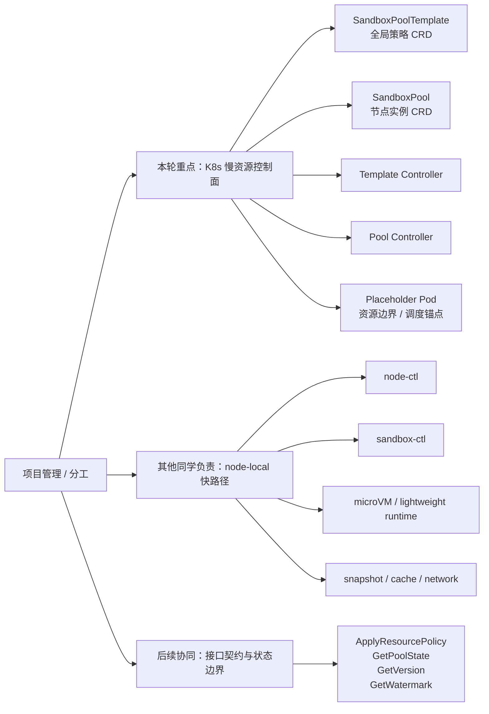

> 分析：我们这一侧要做的是“把 Kubernetes 能稳定管理的慢状态定义好”，而不是提前假设 node-ctl 一定如何实现。只要接口契约清楚，node-ctl 可以先 fake，再接真实 runtime；K8s 控制面也可以先通过 fake node-ctl client 验证 CRD 和 controller 逻辑。

## 一句话结论

K8s 慢资源控制面的核心设计，是用 `SandboxPoolTemplate` 表达全局资源池策略，用 `SandboxPool` 表达每个节点上的资源池实例；`Template Controller` 像 DaemonSet controller 一样把全局策略展开到匹配节点，`Pool Controller` 像节点 agent 一样把单节点策略同步给 node-ctl 并采集状态。Kubernetes 只管理慢资源边界和声明式状态，不直接管理每个 sandbox 的高频生命周期。

## 快慢资源双轨体系

快慢双轨可以先用一张图理解：

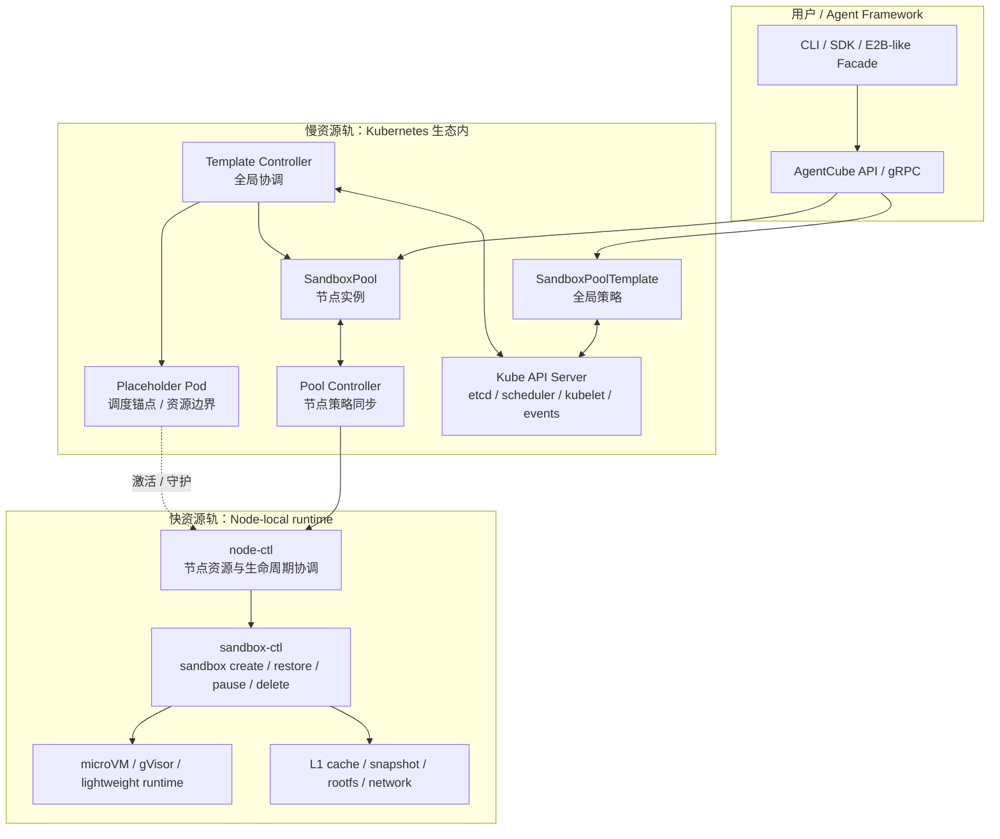

### 慢资源轨负责什么

| 类型 | 是否属于慢资源控制面 | 原因 |
| --- | --- | --- |
| 节点选择、label selector、taint/toleration | 是 | 这是 Kubernetes scheduler 的强项 |
| 每节点资源池 CPU / Memory 边界 | 是 | 需要和 Kubernetes capacity / quota / eviction 语义对齐 |
| 占位 Pod 生命周期 | 是 | 它是把资源池绑定到节点的 K8s 锚点 |
| `SandboxPoolTemplate` / `SandboxPool` 状态 | 是 | 适合声明式 API、status、condition、event |
| node-ctl 健康和资源水位聚合 | 是，但只读 | K8s 控制面只采集和展示，不直接执行 sandbox 操作 |
| 每个 sandbox 的 create / restore / pause / delete | 否 | 高频生命周期，应该在 node-local fast path 内完成 |
| microVM snapshot / rootfs 读写 | 否 | 属于 runtime / cache 数据路径，不应进入 K8s API server |

> 注释：慢资源控制面不直接管理 sandbox 实例，是为了避免 API server 和 controller 成为高频状态变化瓶颈。`SandboxPool.status.poolInfo.sandboxCount` 可以汇总数量，但不要把每个 sandbox 的详细状态都写成 CRD 子资源。

## 总体架构：K8s 慢资源控制面

慢资源控制面的架构可以理解为四层：用户策略层、全局协调层、节点实例层、K8s 原生执行层。

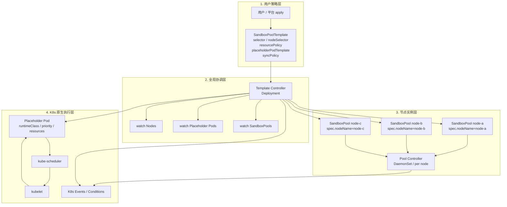

> 分析：`Template Controller` 是全局视角，关心“哪些节点应该有资源池”；`Pool Controller` 是单节点视角，关心“本节点这个资源池是否已经把策略同步给 node-ctl，并且状态是否健康”。这和 Kubernetes 里 Deployment / ReplicaSet / Pod 的分层类似，但这里的节点粒度更接近 DaemonSet。

## CRD 模型一：SandboxPoolTemplate

`SandboxPoolTemplate` 是全局策略 CRD。这里的“全局”更准确地说是“策略级”，第一版可以设计成 namespaced 资源，后续再决定是否需要 cluster-scoped。

### 关键语义

| 字段 | 作用 | 谁写 | 谁读 |
| --- | --- | --- | --- |
| `spec.selector` | 选择哪些节点属于该资源池候选范围 | 用户 / 平台 | Template Controller |
| `spec.nodeSelector` | 补充 Kubernetes 节点选择条件 | 用户 / 平台 | Template Controller |
| `spec.resourcePolicy` | 每节点要锁定的 CPU / Memory 资源边界 | 用户 / 平台 | Template Controller / Pool Controller |
| `spec.placeholderPodTemplate` | 占位 Pod 的 annotations、tolerations、runtimeClass、priority | 用户 / 平台 | Template Controller |
| `spec.syncPolicy` | 状态同步、健康检查、超时等控制参数 | 用户 / 平台 | Pool Controller |
| `status.totalSandboxPools` | 匹配节点数 / 期望节点实例数 | Template Controller | 用户 / 平台 |
| `status.readySandboxPools` | Ready 节点资源池数量 | Template Controller | 用户 / 平台 |
| `status.conditions` | 模板整体健康状态 | Template Controller | 用户 / 平台 |

### 示例结构

```yaml
apiVersion: sandbox-pool.io/v1alpha1
kind: SandboxPoolTemplate
metadata:
  name: default-pool
  namespace: sandbox-system
spec:
  selector:
    matchLabels:
      sandbox-node: "true"
  nodeSelector:
    kubernetes.io/os: linux
  resourcePolicy:
    cpu: "8"
    memory: "16Gi"
  placeholderPodTemplate:
    annotations:
      sandbox-pool.io/skip-cgroup: "true"
    runtimeClassName: placeholder
    tolerations:
    - operator: Exists
  syncPolicy:
    syncInterval: 30s
    healthCheckInterval: 60s
status:
  totalSandboxPools: 10
  readySandboxPools: 9
  notReadySandboxPools: 1
  conditions:
  - type: TemplateReady
    status: "False"
    reason: SomePoolsNotReady
```

> 注释：`SandboxPoolTemplate.status` 只放聚合视图，不放每个节点的完整详情。节点详情应该在对应的 `SandboxPool.status` 中，这样用户可以用 `kubectl get sandboxpool` 看列表，也可以 drill down 到某个节点实例。

## CRD 模型二：SandboxPool

`SandboxPool` 是节点实例 CRD。每个 `SandboxPoolTemplate` 在每个匹配节点上展开成一个 `SandboxPool`。

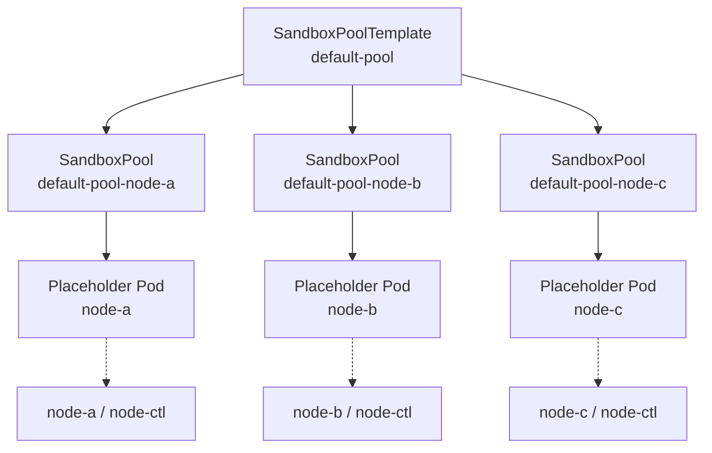

### 关键语义

| 字段 | 作用 | 谁写 | 谁读 |
| --- | --- | --- | --- |
| `spec.templateRef` | 关联父级 `SandboxPoolTemplate` | Template Controller | Pool Controller / 用户 |
| `spec.nodeName` | 绑定目标节点 | Template Controller | Pool Controller |
| `spec.nodeCtl` | 本节点 node-ctl endpoint、超时、健康检查配置 | Template Controller / 用户覆盖 | Pool Controller |
| `spec.resourcePolicyOverride` | 可选的节点级资源覆盖 | 用户 / 平台 | Pool Controller |
| `status.phase` | `Pending / Provisioning / Ready / Degraded / Failed / Draining` | Pool Controller | 用户 / Template Controller |
| `status.placeholderPod` | 占位 Pod 名称、UID、phase、IP | Pool Controller | 用户 / Template Controller |
| `status.nodeCtl` | node-ctl 是否连接、版本、最后心跳 | Pool Controller | 用户 / Template Controller |
| `status.poolInfo` | 从 node-ctl 采集的只读资源池状态 | Pool Controller | 用户 / Template Controller |
| `status.lastAppliedGeneration` | 已成功同步到 node-ctl 的策略版本 | Pool Controller | Template Controller / 用户 |
| `status.conditions` | ResourceSynced、NodeCtlHealthy、PlaceholderReady 等条件 | Pool Controller | 用户 / Template Controller |

> 分析：`SandboxPool` 不是 sandbox 列表，而是“节点资源池实例”。它既是 Template Controller 的展开结果，也是 Pool Controller 的 reconcile 对象。这个设计能把节点维度的状态聚合进 K8s 生态，同时避免把高频 sandbox 生命周期上翻到 API server。

## 两个 Controller 的职责边界

### Template Controller：全局策略展开器

`Template Controller` 对应 `SandboxPoolTemplateReconciler`，以 Deployment 形式运行即可。它的核心职责是把一个全局策略展开成每个节点上的占位 Pod 和 `SandboxPool` 实例。

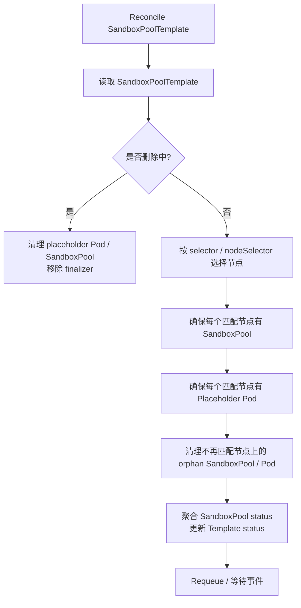

### Pool Controller：节点实例协调器

`Pool Controller` 对应 `SandboxPoolReconciler`。如果它需要访问本地 Unix socket 或本机 node-ctl，推荐以 DaemonSet 部署，每个节点上的 controller 只 reconcile `spec.nodeName == 当前节点` 的 `SandboxPool`。

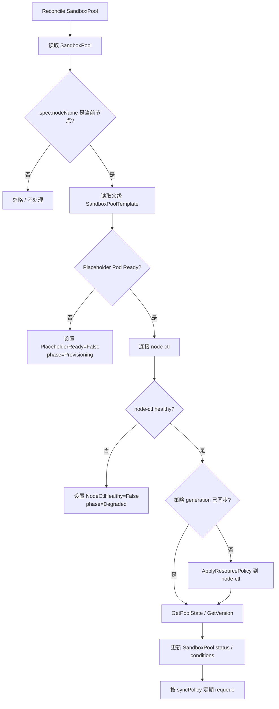

### 职责对照表

| 事项 | Template Controller | Pool Controller |
| --- | --- | --- |
| watch `SandboxPoolTemplate` | 是 | 读父级即可，不主 watch 全量 |
| watch Node 变化 | 是 | 不负责节点选择 |
| 创建 / 删除 `SandboxPool` | 是 | 不创建，只 reconcile 自己节点的实例 |
| 创建 / 删除 Placeholder Pod | 是 | 不创建，可以读取状态 |
| 资源策略继承 / override 跳过 | 是，负责传播模板变更 | 是，负责计算最终策略并下发 |
| 和 node-ctl 通信 | 否 | 是 |
| 采集 poolInfo | 否 | 是 |
| 更新 Template 聚合状态 | 是 | 否 |
| 更新 Pool 节点状态 | 不直接写 runtime 状态 | 是 |
| 管理 sandbox 生命周期 | 否 | 否，只调用 node-ctl 的资源池接口 |

> 注释：Pool Controller 也不应该直接创建 sandbox。它最多把资源池策略同步给 node-ctl，并把 node-ctl 汇报的资源池级状态写回 `SandboxPool.status`。sandbox create / restore / pause / delete 仍属于 node-ctl / sandbox-ctl。

## 创建流程：从全局策略到节点资源池

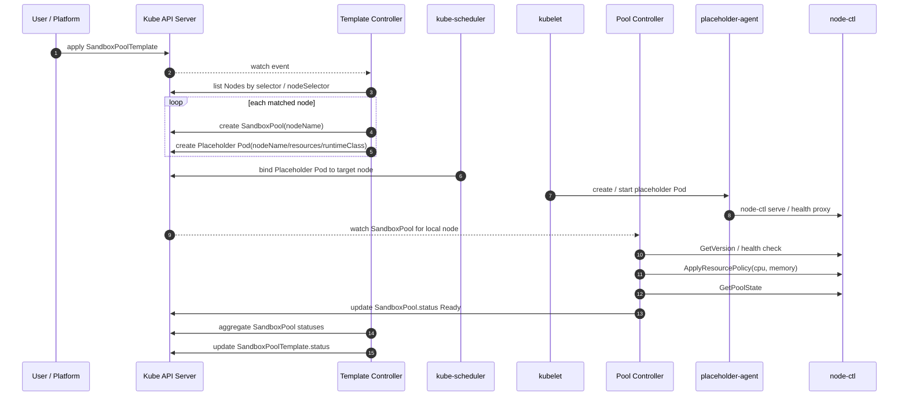

这个流程里有两个关键点：

1. `Template Controller` 只负责“应该在哪些节点上有资源池”。
2. `Pool Controller` 只负责“本节点资源池是否和 node-ctl 对齐”。

## 更新流程：全局策略变更

当用户修改 `SandboxPoolTemplate.spec.resourcePolicy` 或 `placeholderPodTemplate` 时，变更不能直接覆盖所有节点。因为某些节点可能已经有单点 override，或者正在 resize / degraded 状态。

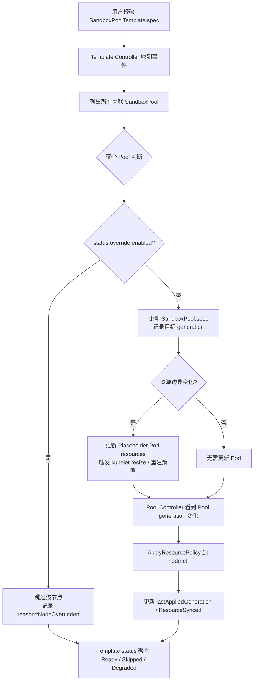

> 分析：这里要把“模板变更”和“节点生效”分开。`metadata.generation` 表示用户期望发生了变化，`status.lastAppliedGeneration` 表示节点侧已成功同步。两者不一致时，说明该节点还在同步中或失败中。

## 节点级 override 流程

节点级 override 是为了处理特殊节点，例如某个高配节点可以承担更大池子，或者某个节点需要临时降配。

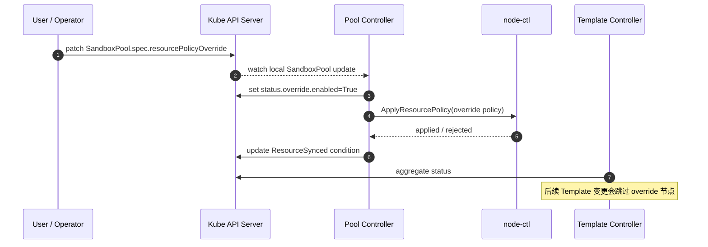

节点级 override 的边界：

| 行为 | 设计建议 |
| --- | --- |
| 用户直接修改 `SandboxPool` 资源策略 | 允许，但必须打 `override.enabled=true` |
| 后续 Template 资源策略变更 | 默认跳过 override 节点 |
| 用户希望重新回到模板管理 | 显式清除 override 标记或删除 `resourcePolicyOverride` |
| override 节点影响模板 Ready | 不应算失败，应单独计入 `overriddenSandboxPools` 或 condition reason |

## 状态机设计

### SandboxPool 节点状态机

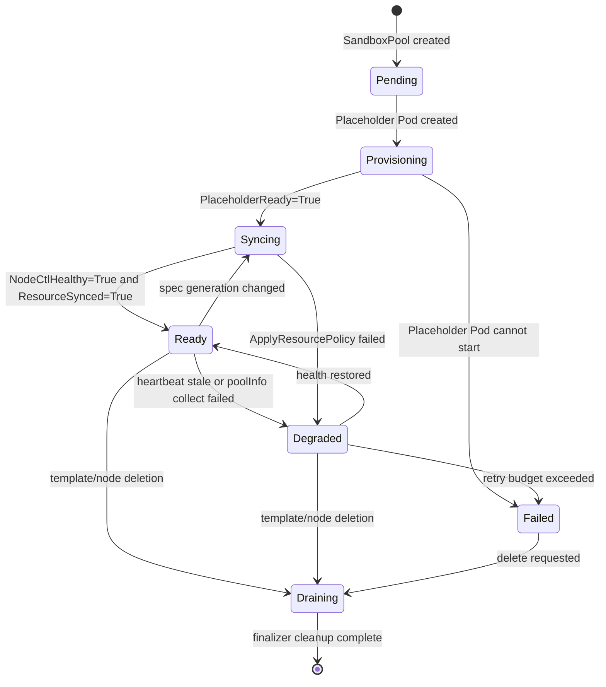

### 关键 Conditions

| Condition | True 表示 | False 常见 reason | Owner |
| --- | --- | --- | --- |
| `PlaceholderReady` | 占位 Pod 已 Running / Ready | `PodPending`、`PodFailed`、`PodMissing` | Pool Controller |
| `NodeCtlHealthy` | node-ctl 可连接且版本可读 | `ConnectionRefused`、`HeartbeatTimeout`、`VersionMismatch` | Pool Controller |
| `ResourceSynced` | 资源策略已成功同步到 node-ctl | `ApplyFailed`、`GenerationMismatch`、`OverrideConflict` | Pool Controller |
| `PoolReady` | 本节点资源池可接收 fast path 调度 | 任一前置 condition False | Pool Controller |
| `TemplateReady` | 匹配节点的资源池整体满足 ready 策略 | `SomePoolsNotReady`、`NoMatchedNodes` | Template Controller |

> 注释：`PoolReady=True` 不等于某个具体 sandbox ready。它只表示这个节点资源池基础设施 ready，后续快路径可以让 node-ctl 在这个池子里创建或恢复 sandbox。

## 状态所有权：谁能写什么

状态所有权要严格，否则 controller 之间会互相覆盖。

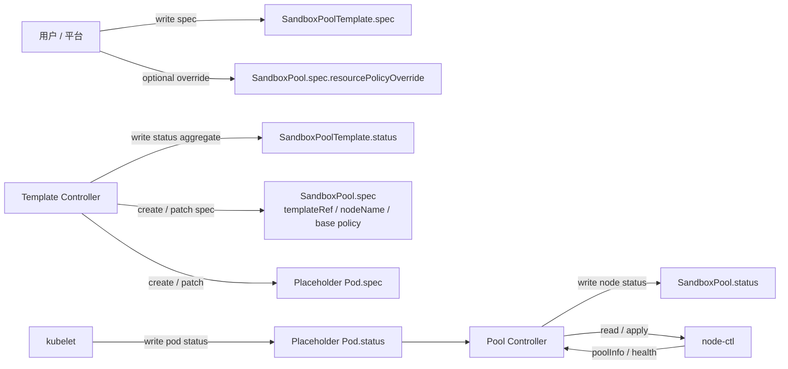

| 对象 | Spec 写入者 | Status 写入者 | 注意事项 |
| --- | --- | --- | --- |
| `SandboxPoolTemplate` | 用户 / 平台 | Template Controller | Template status 只放聚合视图 |
| `SandboxPool` | Template Controller；用户可写 override | Pool Controller | Pool status 放节点详情和 node-ctl 只读汇总 |
| Placeholder Pod | Template Controller | kubelet | Pool Controller 只读 Pod status |
| node-ctl runtime state | node-ctl / sandbox-ctl | node-ctl | K8s 侧只读汇总，不写每个 sandbox |

## 故障恢复设计

### 占位 Pod 被删除

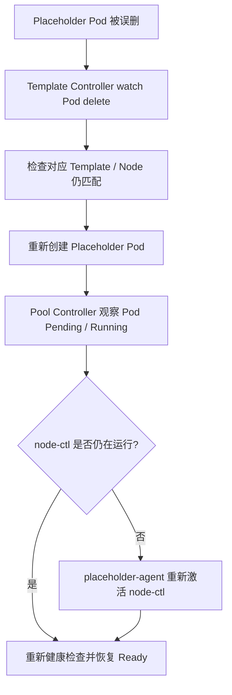

### node-ctl 不可达

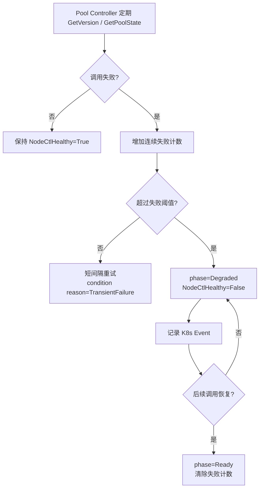

### 节点不再匹配模板

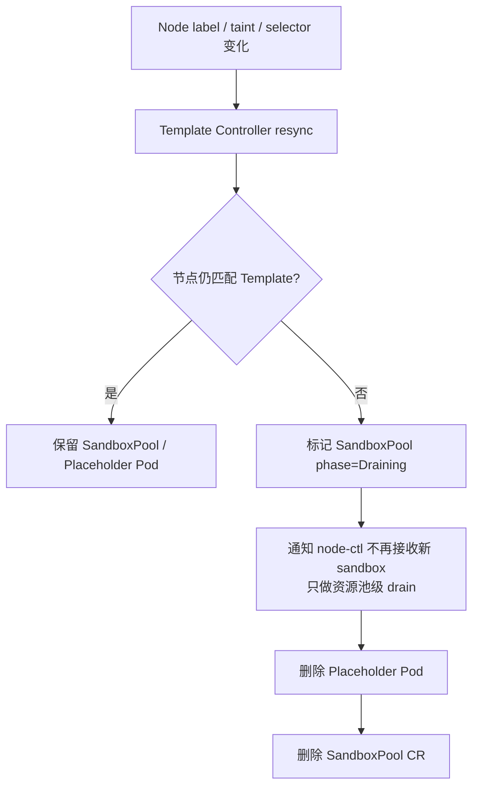

> 分析：这里的 drain 不能假设能直接杀掉 sandbox。慢资源控制面只能表达“该节点资源池要退出模板管理”，真正已有 sandbox 如何迁移、等待、强删，应由 node-ctl / 上层调度策略定义。

## 与 node-ctl 的最小接口契约

虽然 node-ctl 内部由其他同学负责，但慢资源控制面必须定义最小接口，否则 `Pool Controller` 无法闭环。

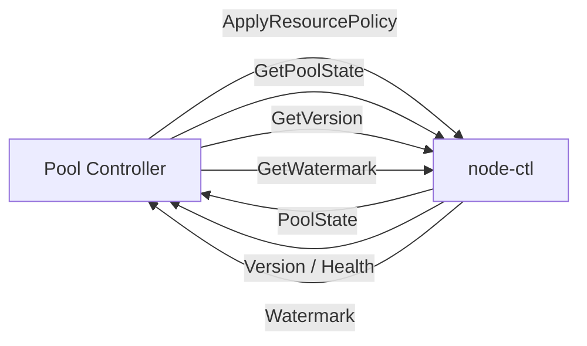

| 接口 | 方向 | 用途 | 触发时机 |
| --- | --- | --- | --- |
| `ApplyResourcePolicy` | Pool Controller -> node-ctl | 下发 CPU / Memory / reserve / overcommit 等资源池边界 | Pool spec 变化、Template 更新、override 更新 |
| `GetPoolState` | Pool Controller -> node-ctl | 采集 sandbox 数量、active 数量、实际资源使用量 | 周期性 sync |
| `GetVersion` | Pool Controller -> node-ctl | 健康检查和版本兼容判断 | 启动、周期性、失败重试 |
| `GetWatermark` | Pool Controller / placeholder-agent -> node-ctl | 判断是否允许缩容、是否高水位 | VPA / resize / drain |

> 注释：这些接口都应该是资源池级接口，而不是 sandbox 级接口。不要让 Pool Controller 调 `CreateSandbox`、`PauseSandbox`、`RestoreSandbox`，否则慢资源控制面会重新侵入快路径。

## Template Controller Reconcile 草图

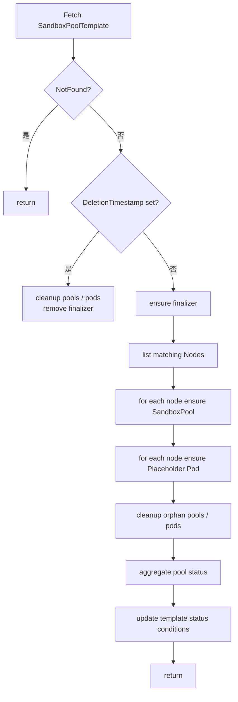

伪代码表达：

```text
reconcile(template):
  nodes = listNodes(template.spec.selector, template.spec.nodeSelector)

  for node in nodes:
    ensureSandboxPool(template, node)
    ensurePlaceholderPod(template, node)

  cleanupSandboxPoolsNotIn(nodes)
  cleanupPlaceholderPodsNotIn(nodes)

  pools = listSandboxPools(label template.name)
  updateTemplateStatus(template, aggregate(pools))
```

## Pool Controller Reconcile 草图

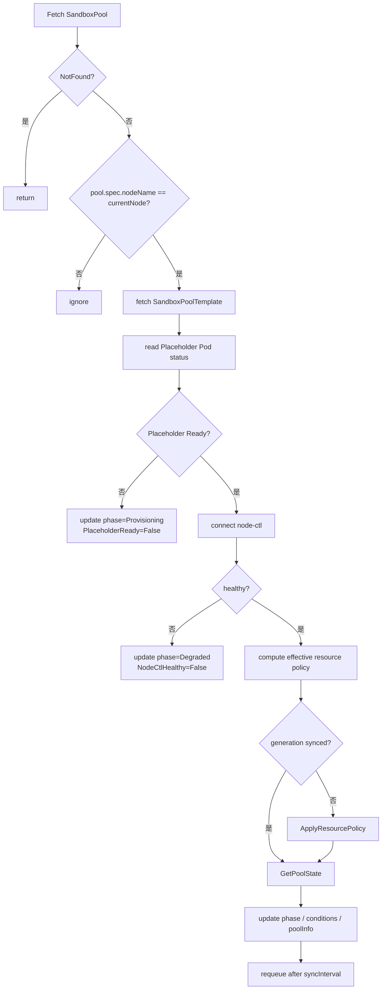

伪代码表达：

```text
reconcile(pool):
  if pool.spec.nodeName != currentNode:
    return

  template = get(pool.spec.templateRef)
  pod = getPlaceholderPod(pool)

  if !pod.ready:
    setCondition(pool, PlaceholderReady=False)
    return

  client = nodeCtlClient(pool.spec.nodeCtl.endpoint)
  if !client.healthy():
    setCondition(pool, NodeCtlHealthy=False)
    return

  effectivePolicy = merge(template.spec.resourcePolicy, pool.spec.resourcePolicyOverride)
  if pool.status.lastAppliedGeneration != pool.metadata.generation:
    client.ApplyResourcePolicy(effectivePolicy)

  state = client.GetPoolState()
  updatePoolStatus(pool, state)
```

## API 设计需要特别避免的坑

| 风险 | 为什么危险 | 设计约束 |
| --- | --- | --- |
| `SandboxPool.status` 写入每个 sandbox 详情 | 高频状态会压垮 API server / etcd，也让 controller loop 变慢 | 只写聚合数量和水位，不写实例列表 |
| Template Controller 直接连 node-ctl | 全局 controller 会变成所有节点的中心瓶颈，也难访问本地 Unix socket | node-ctl 通信只放 Pool Controller |
| Pool Controller 创建 Placeholder Pod | 职责反转，节点 controller 会影响全局节点选择和清理 | Pod 生命周期由 Template Controller 管 |
| override 语义不清 | Template 更新可能覆盖手动节点调整 | 明确 `override.enabled` 和重新绑定流程 |
| 将 `PoolReady` 理解为 sandbox ready | 容易误导 Router 或用户 | `PoolReady` 只代表节点资源池 ready |
| 第一版就承诺跳过 cgroup | kubelet / CRI / eviction / metrics 兼容风险高 | 把 skip-cgroup 作为 spike 假设，准备 fallback |

## 与 Kubernetes 生态的结合点

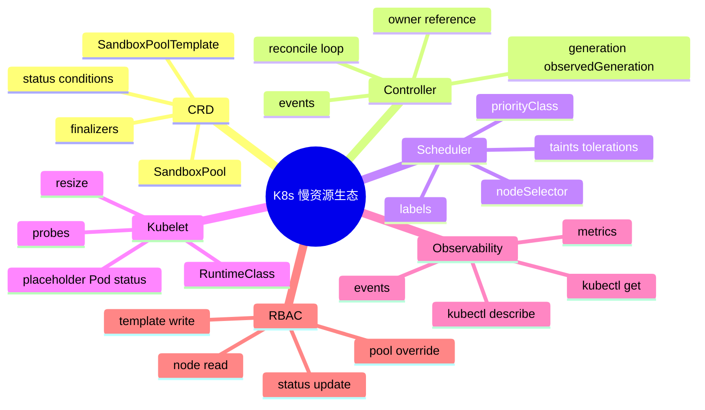

> 分析：把慢资源留在 Kubernetes 生态内的价值，是能直接复用 CRD、controller-runtime、kubectl、RBAC、event、condition、scheduler、kubelet 等成熟能力。AgentCube 不需要自己重写一个全局资源管理系统。

## 当前设计的关键假设与待验证点

| 假设 | 风险 | 验证方式 |
| --- | --- | --- |
| 占位 Pod 可以通过 RuntimeClass / placeholder-agent 跳过真实 cgroup | 可能和 kubelet、CRI、eviction、metrics、QoS 语义冲突 | 单独做 placeholder spike，不把它当成已验证事实 |
| Pool Controller 以 DaemonSet 运行能稳定访问本地 node-ctl | socket 权限、hostPath、安全边界需要确认 | fake node-ctl + hostPath / Unix socket e2e |
| `SandboxPoolTemplate` -> `SandboxPool` 的 DaemonSet-like 展开可复用 ownerRef / finalizer 管理 | 跨 namespace / cluster scope 会影响 ownerRef 合法性 | 第一版先 namespaced，后续再评估 cluster-scoped |
| 资源缩容可以依赖 node-ctl watermark 判断 | 高水位时 resize / shrink 可能长时间 deferred | 在 status 中明确 `resize.status=Deferred` 和 reason |
| Template status 聚合足够表达整体健康 | 大规模节点下状态更新频率可能过高 | 只聚合计数和 condition，不频繁写详细列表 |

## 建议的落地切片

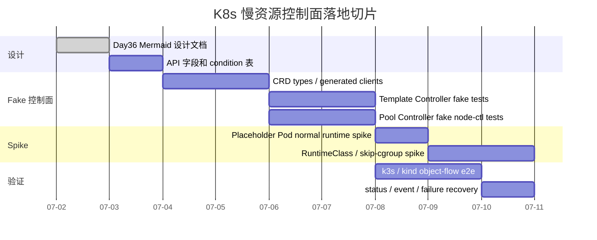

阶段建议：

| 阶段 | 目标 | 不做什么 |
| --- | --- | --- |
| Phase 0：设计文档 | 固定 CRD 职责、controller 职责、状态机、接口边界 | 不写 node-ctl 内部实现 |
| Phase 1：API skeleton | 定义 `SandboxPoolTemplate` / `SandboxPool` types、status、conditions | 不接真实 microVM |
| Phase 2：fake controller tests | 用 fake client 验证 node 选择、pool 展开、status 聚合、override 跳过 | 不依赖真实 Kubernetes 集群 |
| Phase 3：fake node-ctl | Pool Controller 通过 fake node-ctl client 验证 Apply / GetState / health | 不创建真实 sandbox |
| Phase 4：placeholder spike | 验证占位 Pod 与 kubelet / RuntimeClass / probes / events 的兼容性 | 不承诺 skip-cgroup 已生产可用 |
| Phase 5：object-flow e2e | 在 k3s / kind 中验证 Template -> Pool -> Pod -> Status 全链路 | 不做完整 E2B facade |

## 今日结论

Day36 的收敛结论是：当前我们应该把 AgentCube 新架构拆成两个并行工作面。node-ctl / sandbox-ctl 负责快路径，解决 microVM、snapshot、cache、网络和 sandbox lifecycle；我们这边先把 K8s 慢资源控制面设计清楚，用 `SandboxPoolTemplate` 和 `SandboxPool` 两个 CRD 表达全局策略与节点实例，用 `Template Controller` 和 `Pool Controller` 两条 reconcile loop 分别管理全局展开和节点同步。

这个拆法的好处是：

1. 项目分工清楚，不和 node-ctl 实现互相阻塞。
2. 慢资源控制面可以先用 fake node-ctl 独立验证。
3. Kubernetes 生态能力能被复用，包括 scheduler、kubelet、CRD、status、event、RBAC 和 kubectl。
4. 后续如果 skip-cgroup 或 RuntimeClass 假设被否定，CRD / controller 的大部分设计仍可保留，只需要调整 placeholder Pod 和 node-ctl 的资源边界实现。

> 后续建议：下一步不急着写完整实现，可以先把本文压缩成 API 字段表和 controller test plan；真正 upstream 化时，优先做 CRD skeleton + fake reconciler tests，而不是一次性提交完整 node-ctl / placeholder-agent / microVM 方案。
