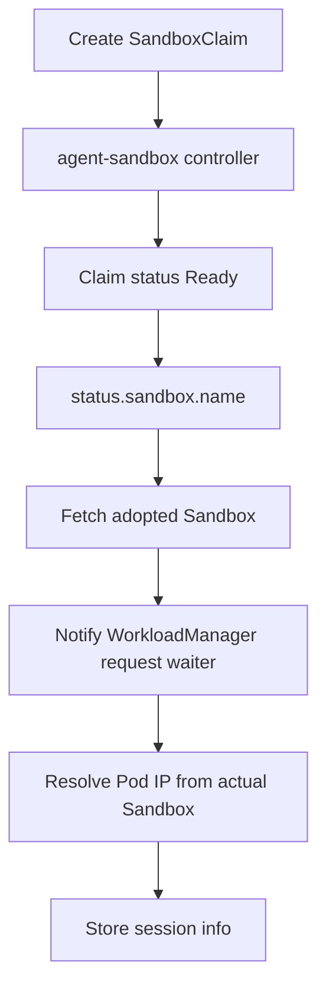
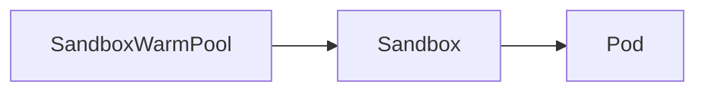

# Day41：agent-sandbox v0.5.0 正式发布后的 AgentCube 适配问题分析

日期：2026-07-07

## 今日目标

今天的重点不是继续泛泛讨论 “agent-sandbox latest”，而是把新的客观前提重新对齐：

1. `kubernetes-sigs/agent-sandbox` 已经正式发布 `v0.5.0`。
2. AgentCube 之前的 #387 是围绕 `agent-sandbox v0.4.6` 做的兼容 PR。
3. Day18 做过 `v0.5.0rc1` 前沿验证，但 rc1 和正式 `v0.5.0` 的兼容面并不完全一样。
4. 刚刚关注的 AgentCube issue #277 / PR #413 也围绕 sandbox pod annotation，但它是一个更窄的查 Pod 简化问题，不等同于 `v0.5.0` 全量适配。

> 注释：这里要区分三个层次。“依赖能升级并编译”只是第一层；“代码使用 v1beta1 API 语义”是第二层；“现有集群能从 v1alpha1 平滑迁移到 v1beta1”是第三层。Day41 先做第一层和范围判断，不把它误说成完整升级已经完成。

## 一句话结论

`agent-sandbox v0.5.0` 正式版比 Day18 的 rc1 更兼容：它同时保留 `api/v1alpha1`、`extensions/api/v1alpha1`、`api/v1beta1`、`extensions/api/v1beta1` 包，并通过 multi-version CRD + conversion webhook 支撑迁移。因此当前 AgentCube 主干做最小依赖升级时，第一处编译失败不是 `v1alpha1` 包缺失，而是 `SandboxPodNameAnnotation` 常量从 `controllers` 包迁到了 API 包。

最小临时修复后，非 e2e Go 测试可以通过。但这只说明“短期继续基于 v1alpha1 兼容包可以编译”，不代表已经完成正式 `v1beta1` 适配。真正的 upstream follow-up 仍然需要处理 `SandboxClaim.spec.warmPoolRef`、`Sandbox.spec.operatingMode`、v0.5.0 官方 manifest、migration guide、NetworkPolicy namespace 约束和运行时验证。

## 已确认的正式发布信息

使用命令：

```bash
gh release view v0.5.0 \
  --repo kubernetes-sigs/agent-sandbox \
  --json tagName,name,publishedAt,createdAt,isDraft,isPrerelease,url,body
```

确认结果：

| 字段 | 结果 |
| --- | --- |
| Release | `v0.5.0` |
| URL | https://github.com/kubernetes-sigs/agent-sandbox/releases/tag/v0.5.0 |
| Published at | `2026-06-24T20:57:48Z` |
| Draft | `false` |
| Prerelease | `false` |

使用命令：

```bash
go list -m -json sigs.k8s.io/agent-sandbox@v0.5.0
```

确认结果：

| 字段 | 结果 |
| --- | --- |
| Module | `sigs.k8s.io/agent-sandbox` |
| Version | `v0.5.0` |
| GoVersion | `1.26` |
| Tag hash | `a1a58a019a5479ec6cd77f95234927da7a1f434d` |
| Tag ref | `refs/tags/v0.5.0` |

> 注释：这个版本已经不是 rc，也不是 pseudo-version，所以 Day17/Day18 里“不要把 rc 支持放进 #387”的前提需要更新。现在可以讨论正式 v0.5.0 适配，但仍要独立评估 scope，不应该直接塞进已经很大的 #387。

## v0.5.0 对 AgentCube 的破坏性变化

正式 release note 中对 AgentCube 影响最大的点如下：

| 变化 | 对 AgentCube 的影响 |
| --- | --- |
| Core / extension APIs 从 `v1alpha1` graduation 到 `v1beta1` | AgentCube 如果要跟随正式 API，需要把 typed imports、GVR、scheme、manifest/e2e 安装版本一起对齐到 `v1beta1`。 |
| `v1alpha1` deprecated，但通过 multi-version CRD 和 conversion webhook 保留迁移兼容 | 当前代码可以短期继续使用 `v1alpha1` 包编译，但这只是兼容窗口，不应作为长期目标。 |
| `Sandbox.spec.replicas` 被 `spec.operatingMode` 替代 | 直接 Sandbox 创建路径不能再用 `Replicas: 1` 表示运行态；应改成 `OperatingMode: Running`。Sleep/Resume 后续也会和 `Suspended` 语义挂钩。 |
| `SandboxClaim.spec.templateRef` 被 `spec.warmPoolRef` 替代 | warm pool claim 创建逻辑不能再直接写 templateRef；即使冷启动，也需要引用一个 `replicas: 0` 的 `SandboxWarmPool`。 |
| 默认 `NetworkPolicy` 限制 `sandbox-router` namespace | 如果 AgentCube 依赖自己的 Router / WorkloadManager 路径访问 sandbox，需要确认是继续设置 unmanaged network policy，还是把 router 部署进 `agent-sandbox-system`。 |
| Assigned sandbox name 改用 annotation 存储 | 和 AgentCube 的 claim -> adopted sandbox 数据流有关，不能继续假设 label 是唯一来源。 |
| Pod name annotation 成为关键路径 | 和 #277/#413 直接相关，AgentCube 应优先使用 Sandbox 上的 pod-name annotation 找 backing Pod。 |

> 分析：`v0.5.0` 不是简单的依赖版本号变化，它把 “claim 按 template 创建 sandbox” 改成 “claim 从 warm pool checkout sandbox”。这和 AgentCube 的 CodeInterpreter warm pool 模型高度相关，所以正式适配必须围绕 warm pool 语义重测，而不是只改 imports。

## 最小依赖升级实验

为了避免只凭 release note 推断，我在临时 worktree 上从最新 `upstream/main` 做了最小 bump 实验。

临时 worktree：

```bash
rm -rf /tmp/agentcube-day41-v050
git worktree add --detach /tmp/agentcube-day41-v050 upstream/main
```

基线提交：

```text
a9ef47e Merge pull request #416 from ranxi2001/ci/fix-release-chart-version
```

执行命令：

```bash
go get sigs.k8s.io/agent-sandbox@v0.5.0
go mod tidy
go test ./pkg/workloadmanager -count=1
```

依赖升级结果：

| 模块 | 原版本 | 新版本 |
| --- | --- | --- |
| `sigs.k8s.io/agent-sandbox` | `v0.1.1` | `v0.5.0` |
| `k8s.io/api` | `v0.34.1` | `v0.35.4` |
| `k8s.io/apimachinery` | `v0.34.1` | `v0.35.4` |
| `k8s.io/client-go` | `v0.34.1` | `v0.35.4` |
| `sigs.k8s.io/controller-runtime` | `v0.22.2` | `v0.23.3` |
| `k8s.io/klog/v2` | `v2.130.1` | `v2.140.0` |

第一处编译失败：

```text
pkg/workloadmanager/handlers.go:272:63: undefined: controllers.SandboxPodNameAnnotation
pkg/workloadmanager/handlers_test.go:83:53: undefined: controllers.SandboxPodNameAnnotation
FAIL    github.com/volcano-sh/agentcube/pkg/workloadmanager [build failed]
```

失败原因：

`v0.5.0` 中 `SandboxPodNameAnnotation` 不再暴露在 `sigs.k8s.io/agent-sandbox/controllers` 包里，而是在 API 包里：

```go
sigs.k8s.io/agent-sandbox/api/v1alpha1.SandboxPodNameAnnotation
sigs.k8s.io/agent-sandbox/api/v1beta1.SandboxPodNameAnnotation
```

> 注释：这和 #413 的 Copilot 评论也有关。把注解常量绑定到 controller 包本身就比较脆弱，因为 controller 是实现包，不是稳定 API surface。更稳的写法是从 API 包取常量；如果后续切 v1beta1，再统一换到 `sandboxv1beta1.SandboxPodNameAnnotation`。

## 正式版和 Day18 rc1 的差异

Day18 对 `v0.5.0rc1` 的判断不能完整外推到正式 `v0.5.0`。

我重新确认了正式版模块中的包：

```bash
go list \
  sigs.k8s.io/agent-sandbox/api/v1alpha1 \
  sigs.k8s.io/agent-sandbox/extensions/api/v1alpha1 \
  sigs.k8s.io/agent-sandbox/api/v1beta1 \
  sigs.k8s.io/agent-sandbox/extensions/api/v1beta1
```

结果四个包都存在：

```text
sigs.k8s.io/agent-sandbox/api/v1alpha1
sigs.k8s.io/agent-sandbox/extensions/api/v1alpha1
sigs.k8s.io/agent-sandbox/api/v1beta1
sigs.k8s.io/agent-sandbox/extensions/api/v1beta1
```

正式版源码中也有迁移文档：

```text
sigs.k8s.io/agent-sandbox@v0.5.0/docs/api-migration-guide.md
```

这个文档明确了两件事：

1. `SandboxClaim` 不兼容字段变化由 conversion webhook 处理，但 cold-start claim 需要 pre-upgrade bootstrap 创建 `shadow-pool-<template>`。
2. `Sandbox.spec.replicas` 到 `Sandbox.spec.operatingMode` 的转换由 webhook 处理，`replicas: 0` 对应 `Suspended`，`replicas: 1` 或 unset 对应 `Running`。

> 分析：正式版加入 multi-version CRD / conversion webhook 后，“代码使用 v1alpha1 包还能编译”是正常的。这降低了最小 bump 的难度，但也制造了一个容易误判的陷阱：编译通过不等于 AgentCube 已经跟上正式 v1beta1 API。上游 PR 口径必须说明我们是在做兼容 bump、还是做正式 v1beta1 migration。

## 临时最小修复后的测试结果

我在临时 worktree 里做了一个不提交的最小替换：

```diff
- "sigs.k8s.io/agent-sandbox/controllers"
+ // remove controllers import

- controllers.SandboxPodNameAnnotation
+ sandboxv1alpha1.SandboxPodNameAnnotation
```

然后运行：

```bash
go test ./pkg/workloadmanager -count=1
```

结果：

```text
ok      github.com/volcano-sh/agentcube/pkg/workloadmanager    0.757s
```

继续运行非 e2e Go 包测试：

```bash
go test $(go list ./... | grep -v '/test/e2e') -count=1
```

结果：

```text
ok      github.com/volcano-sh/agentcube/pkg/api                0.014s
ok      github.com/volcano-sh/agentcube/pkg/common/types       0.011s
ok      github.com/volcano-sh/agentcube/pkg/mtls               1.093s
ok      github.com/volcano-sh/agentcube/pkg/picod              9.188s
ok      github.com/volcano-sh/agentcube/pkg/router             27.236s
ok      github.com/volcano-sh/agentcube/pkg/store              0.078s
ok      github.com/volcano-sh/agentcube/pkg/workloadmanager    0.936s
```

结论：

1. 纯 `agent-sandbox@v0.5.0` 依赖升级在当前主干上的第一处失败是注解常量位置变化。
2. 如果只想让当前 `v1alpha1` 代码在 `v0.5.0` 模块下编译，最小代码改动很小。
3. 这不是最终适配方案，因为它没有把 AgentCube 的资源创建语义迁移到 `v1beta1`。
4. 这也没有验证 Kubernetes runtime、CRD conversion webhook、e2e manifest、NetworkPolicy namespace 或已有集群 migration。

> 注释：这个实验有价值，因为它把“正式版能不能先升依赖”拆出来了。Day18 证明过 v1beta1 迁移可行，Day41 则说明正式版还允许更小的中间层兼容 PR。但要不要走中间层，需要看社区更希望小步升级，还是直接接受完整 v1beta1 迁移。

## #277 / #413 在做什么

Issue #277：

- URL：https://github.com/volcano-sh/agentcube/issues/277
- 标题：`Simplify sandbox pod match`
- 状态：open
- Label：`kind/enhancement`
- Assignees：`safiya2610`, `krrishrastogi05`
- 核心背景：`agent-sandbox` 在 PR #272 之后，每个 `Sandbox` 会通过 annotation 指向 backing Pod。因此 AgentCube 不需要再通过 label selector + ownerReference 遍历来找 Pod。

PR #413：

- URL：https://github.com/volcano-sh/agentcube/pull/413
- 标题：`Use sandbox pod annotation for GetSandboxPodIP`
- 状态：open
- 作者：`safiya2610`
- 关联：`Fixes #277`
- 改动文件：
  - `pkg/workloadmanager/k8s_client.go`
  - `pkg/workloadmanager/k8s_client_test.go`
  - `go.sum`

PR #413 的目标是：

1. 如果调用方已经传入 `podName`，优先直接从 pod lister 取 Pod。
2. 如果没有传入 `podName`，从 `Sandbox` 资源 annotation 读取 pod name。
3. 移除旧的 label selector + ownerReference fallback。

Copilot 目前给 #413 的主要 review 点：

| 类型 | 内容 |
| --- | --- |
| 错误信息 | `dynamicClient == nil` 时错误太像普通 NotFound，建议区分配置问题。 |
| 错误包装 | 读取 Sandbox 失败时应该保留原始 error，例如 RBAC / API transient failure。 |
| 测试覆盖 | annotation fallback 路径缺少 fake dynamic client + annotated Sandbox 的单测。 |
| 日志 | lister 返回 `(nil, nil)` 时日志会打印 `err=<nil>`，容易误导。 |
| 注释 | 测试和代码注释里有不准确描述。 |
| API version | 测试里硬编码 Sandbox API version，建议用 `sandboxv1alpha1.SchemeGroupVersion.String()`。 |
| PR 描述 | 文案说 NotFound，但代码返回普通 `fmt.Errorf`，需要统一。 |

> 分析：#413 是一个很典型的“小范围 cleanup PR”。它不升级 agent-sandbox 版本，不处理 `v1beta1`，也不处理 warm pool claim 语义变化。我们不应该开重复 PR 抢 #277；如果参与，更合适的是做 review、补测试建议，或等 #413 停滞后再按社区规则接手。

## #387、#277/#413 和 v0.5.0 适配的关系

| 事项 | 范围 | 当前状态 | 和 v0.5.0 的关系 |
| --- | --- | --- | --- |
| PR #387 | `agent-sandbox v0.4.6` compatibility，重点是 CodeInterpreter warm pool adoption | open，当前 `mergeable=CONFLICTING` | 不是 `v0.5.0` 正式适配；它解决 v0.4.6 的 API / warm pool 数据流。 |
| Issue #277 | 简化 `GetSandboxPodIP` 的 Pod 匹配 | open，已有 assignees | 依赖 sandbox pod annotation，是 v0.3.10 之后就可以做的窄 cleanup。 |
| PR #413 | 实现 #277 | open，有 Copilot review | 可能和 #387 / v0.5.0 分支在 `k8s_client.go` 附近冲突，但语义窄于 v0.5.0。 |
| Day18 fork PR #5 | `v0.5.0rc1` v1beta1 前沿验证 | fork-only，CI 曾通过 | 可作为正式 `v0.5.0` follow-up 起点，但要更新为正式 tag 和 migration 口径。 |
| Day41 最小 bump | `upstream/main` + `agent-sandbox@v0.5.0` | 本地临时验证通过非 e2e Go tests | 证明存在小步兼容升级路线，但不是最终 v1beta1 迁移。 |

我的判断：

1. #387 做得不是 #277 的同一个问题。#387 为 warm-pool-backed CodeInterpreter 适配 `agent-sandbox v0.4.6` 的数据流；#277/#413 是把 Pod 查找从 label/ownerReference 简化到 annotation。
2. #387 也不是完整 `v0.5.0` 适配。它仍然是 `v1alpha1` 时代的稳定版兼容 PR。
3. 现在 `v0.5.0` 正式发布后，最干净的做法是单独开 follow-up 适配，而不是继续把 #387 扩大。
4. 如果 #413 先合并，后续 `v0.5.0` 分支需要 rebase 并复用它的 Pod 查找路径，避免重复实现。
5. 如果 #413 长期没人更新，我们可以考虑做 review/comment 或在明确无人推进后接手，但要先确认社区状态。

> 注释：开源协作里，“我也能写”不等于“我应该开同一个 PR”。#277 已有 open PR，重复实现会增加 maintainer review 成本。更高价值的路线是基于正式 `v0.5.0` 做版本适配，这个 scope 和 #413 不完全重合。

## 可能的后续路线

### 路线 A：最小兼容 bump

目标：

- 把 `sigs.k8s.io/agent-sandbox` 升到 `v0.5.0`。
- 保持 AgentCube 代码暂时使用 `v1alpha1` 包。
- 把 `controllers.SandboxPodNameAnnotation` 改成 API 包里的 `sandboxv1alpha1.SandboxPodNameAnnotation`。
- 跑 unit / lint / gen-check / fork CI。

优点：

- 改动小。
- 能快速跟上正式 release。
- 规避一次性 v1beta1 迁移的大 diff。

缺点：

- 口径容易被质疑：既然 `v0.5.0` 已经 graduation 到 `v1beta1`，为什么 AgentCube 仍使用 deprecated `v1alpha1` API。
- 没有解决 `SandboxClaim.spec.warmPoolRef` 和 `Sandbox.spec.operatingMode` 的正式语义。
- 不能替代 Day18 的 v1beta1 runtime 验证。

适用场景：

社区希望先把依赖更新到正式版，但不要求立即迁移资源 API。

### 路线 B：正式 v1beta1 迁移

目标：

- 将 AgentCube 的 agent-sandbox imports 从 `v1alpha1` 切到 `v1beta1`。
- direct Sandbox 创建路径使用 `OperatingMode: Running`。
- warm pool claim 创建路径使用 `WarmPoolRef`。
- cold-start claim 通过 `replicas: 0` 的 `SandboxWarmPool` 表达。
- e2e 安装脚本改用 `v0.5.0` official manifests。
- 重新跑 WorkloadManager unit、non-e2e Go tests、codegen 检查、fork CI 和真实 k3d/k3s runtime smoke。

优点：

- 符合正式 release 的推荐方向。
- 可以把 Day18 的 rc1 验证升级为正式版证据。
- 对后续 Sleep/Resume 的 `OperatingMode=Suspended` 设计更有价值。

缺点：

- 会改动更多文件。
- 很可能和 #387 / #413 冲突。
- 需要明确 migration 口径，不能只验证 clean install。

适用场景：

社区认可直接进入 `v0.5.0` 正式适配，或者 #387 因时间过久已经不适合继续维护为 `v0.4.6` PR。

### 路线 C：先做 review，不开代码 PR

目标：

- 跟进 #413 的 review 点。
- 如果需要，给出测试建议或复现结果。
- 同时在本地准备 `v0.5.0` 分支，但不急着 upstream。

优点：

- 不抢已有 issue/PR。
- 可以减少后续冲突。
- 适合当前 #387 仍 open 且 conflicting 的状态。

缺点：

- 不能直接推动 AgentCube 跟上 `v0.5.0`。

适用场景：

维护者暂时希望先合并 #413 / #387，再讨论正式 `v0.5.0`。

## 当前推荐

我倾向于先不更新 #387，也不重复开 #277 的 PR，而是在本地做一个新的 fork-only `v0.5.0` validation branch：

1. 从最新 `upstream/main` 起一个干净分支。
2. 先完成路线 A 的最小 bump，保留 `v1alpha1` 兼容，证明 `v0.5.0` 依赖栈没有大面积破坏当前主干。
3. 再基于 Day18 的 fork PR #5 做路线 B 的正式 `v1beta1` 迁移分支。
4. 比较两条路线的 diff、测试成本和冲突面。
5. 等 #387 / #413 状态更清晰后，再决定是提最小 bump PR、正式 v1beta1 PR，还是先发 issue/comment 说明计划。

> 分析：这个推荐的核心是“先拿数据再定 upstream 口径”。现在我们已经知道正式 `v0.5.0` 的最小 bump 很小，但 full migration 的价值更高。直接把 full migration 塞进 #387 会让 review 更难；直接抢 #277 又会和 #413 重复。

## 第一阶段暂未做的事

1. 没有修改 upstream PR。
2. 没有向 #277 / #413 评论。
3. 没有创建新的 upstream PR。
4. 第一阶段没有跑真实 Kubernetes runtime / e2e；后续已在 kind clean 集群补测，见下文“真实 kind runtime 验证”。
5. 没有验证 `v1alpha1` 现有集群到 `v1beta1` 的 migration 流程。

这些限制要在后续对外沟通时明确说明。

## 后续实现：基于 v0.5.0 的适配层分支

在确认 `agent-sandbox v0.5.0` 正式发布后，已经基于最新 `upstream/main` 新建干净 topic branch：

- 本地 worktree：`/tmp/agentcube-runtime-adapter-v05`
- 分支：`feat/agent-sandbox-runtime-adapter-v05`
- fork 远端：`origin/feat/agent-sandbox-runtime-adapter-v05`
- 提交：`726a984 feat: add agent-sandbox v0.5 adapter`

这次没有把改动叠到 #387，也没有从 `intern` 分支带入实习报告、中文记录或本地 benchmark 文件。

> 注释：这个分支不是一次简单的 `go get sigs.k8s.io/agent-sandbox@v0.5.0`。如果只是升级依赖，代码仍然会把 `SandboxClaim` 当作同名 `Sandbox` 等待，warm-pool adoption 场景会有运行时风险。

### 设计边界

本次实现选择新增 `pkg/workloadmanager/agentsandbox` 适配层，把 AgentCube 生产代码对 `agent-sandbox` API 包的直接依赖集中到一个包中。

适配层负责：

- 注册 `v1alpha1` / `v1beta1` core 与 extensions scheme。
- 对外暴露当前创建路径使用的 `v1beta1` GVR。
- 构造 `v1beta1 Sandbox`、`SandboxClaim`、`SandboxTemplate`、`SandboxWarmPool`。
- 兼容读取 `v1alpha1` 与 `v1beta1` 的 Sandbox pod annotation、shutdown time、pod template、ready condition。
- 兼容读取 `v1alpha1` 与 `v1beta1` 的 SandboxClaim ready condition、`status.sandbox.name` 和 pod IPs。

> 分析：这就是前面讨论的“中间件 / adapter”思路。WorkloadManager 不再到处 import `sigs.k8s.io/agent-sandbox/api/...`，以后如果 `agent-sandbox` API 再变，优先改适配层，而不是让 handler、builder、controller、test 到处同步改。

### 关键运行时修正

这次除了类型迁移，还补了 `SandboxClaimReconciler`：



原因是 `agent-sandbox v0.5.0` 的 warm-pool claim 路径会通过 `claim.status.sandbox.name` 返回被认领的实际 Sandbox 名称。这个 Sandbox 名称可能不等于 claim 名。

因此 create path 现在分两条：

- direct Sandbox：继续 watch `Sandbox` ready。
- warm-pool claim：watch `SandboxClaim` ready，再根据 `status.sandbox.name` 获取 actual Sandbox。

同时，store 里对 `SandboxClaimsKind` 仍保留 claim 名作为 `Name`，因为后续删除时需要删除 `SandboxClaim`，不能拿 actual Sandbox 名去删 claim。

> 注释：这里要区分两个身份：claim identity 用于 AgentCube session delete / GC；runtime identity 用于查 actual Sandbox、Pod annotation、Pod IP 和 Sandbox UID。把这两个名字混成一个，是 warm-pool 适配最容易出错的地方。

### 已验证命令

本地验证结果：

```bash
go test ./pkg/workloadmanager/... -count=1
go test $(go list ./... | grep -v '^github.com/volcano-sh/agentcube/test/e2e$') -count=1
make build-all
go test ./test/e2e -run '^$' -count=1
make lint
make gen-check
git diff --check
git diff --cached --check
```

结果均通过。

`make gen-check` 过程中会打印 `code-generator@v0.34.1` 临时导致的 downgrade 信息，例如 `agent-sandbox v0.5.0 => v0.2.1`，但命令末尾 `go mod tidy` 会重新解析 `api/v1beta1` / `extensions/api/v1beta1`，最终 `go list -m` 确认版本为：

```text
sigs.k8s.io/agent-sandbox v0.5.0
k8s.io/api v0.35.4
sigs.k8s.io/controller-runtime v0.23.3
```

> 分析：这个 downgrade 日志是当前生成脚本固定 `code-generator@v0.34.1` 的副作用，不代表最终模块版本被降级。后续如果维护者介意，可以单独讨论 code-generator 版本与 Kubernetes 依赖栈是否应该同步升级。

### 真实 kind runtime 验证

用户确认本机是 Ubuntu 24 后，改用 kind 做真实 Kubernetes runtime 验证。

环境关键信息：

- Host：Ubuntu 24.04.4 LTS
- Kernel：`6.8.0-124-generic`
- Docker server：`29.1.3`
- kind：临时安装到 `/tmp/agentcube-local-bin`，版本 `v0.32.0`
- Helm：临时安装到 `/tmp/agentcube-local-bin`，版本 `v3.19.3`
- 集群名：`agentcube-v05-runtime-kind`
- KUBECONFIG：`/tmp/agentcube-v05-runtime-kind-kubeconfig.yaml`

> 注释：之前记录里 kind 曾因 kubelet / cgroup 环境失败。这次在 Ubuntu 24 + Docker 29 环境下，kind 能成功创建 `kindest/node:v1.36.1` 单节点集群，所以本轮 runtime 阻塞不再是 kind 基础环境。

完整默认脚本验证命令：

```bash
PATH="/tmp/agentcube-local-bin:$PATH" \
KUBECONFIG=/tmp/agentcube-v05-runtime-kind-kubeconfig.yaml \
E2E_CLUSTER_NAME=agentcube-v05-runtime-kind \
E2E_CLEAN_CLUSTER=true \
AGENT_SANDBOX_VERSION=v0.5.0 \
ARTIFACTS_PATH=/home/agentcube/internship-reports/benchmarks/day41-agent-sandbox-v05-runtime/e2e-logs \
./test/e2e/run_e2e.sh
```

结果：脚本最终输出 `All tests passed!`。

观察到的过程问题：

1. `kind load docker-image` 对 `agent-sandbox-controller:v0.5.0`、`python:3.9-slim`、`redis:7-alpine` 出现 Docker 29 / containerd image store digest 缺失错误，脚本按预期降级为让 kind 节点从 registry 拉取。
2. SPIRE 初始启动时 `agentcube-router` / `workloadmanager` 因等待 mTLS 证书短暂 `CrashLoopBackOff`，`spiffe-helper` 在 SPIRE agent 成功 attestation 后写入证书，两个主容器随后恢复为 `Running`。
3. 默认 mTLS 场景下，Go AgentRuntime 路径通过，direct CodeInterpreter / warm-pool 测试会按测试逻辑跳过，因为测试客户端没有 WorkloadManager mTLS client cert。

> 分析：第 1 点是本地镜像导入兼容性问题，不是 AgentCube 代码失败；第 2 点是 SPIRE 启动顺序问题，最终恢复；第 3 点说明默认脚本能证明 router -> WorkloadManager -> agent-sandbox 的 AgentRuntime 路径，但不能单独证明 direct WorkloadManager CodeInterpreter / SandboxClaim adoption。

为补齐 direct / warm-pool 覆盖，保留同一个 kind 集群和 `agent-sandbox v0.5.0` CRD，把 AgentCube Helm release 切到 `spire.enabled=false`，再只跑目标 Go E2E：

```bash
WORKLOAD_MANAGER_URL=http://127.0.0.1:18080 \
ROUTER_URL=http://127.0.0.1:18081 \
MTLS_ENABLED=false \
API_TOKEN="$API_TOKEN" \
WORKLOAD_NAMESPACE=agentcube \
go test -v ./test/e2e -run 'TestCodeInterpreter(WarmPool|BasicInvocation)$' -count=1
```

第一次目标测试暴露一个测试侧假设过期：

- 旧 helper 用 `SandboxWarmPool -> Pod` 直接 ownerRef 计数。
- `agent-sandbox v0.5.0` 实际对象链是 `SandboxWarmPool -> Sandbox -> Pod`。
- 因此集群里 `SandboxWarmPool.status.readyReplicas=2`、两个 pod 都 `Running`，但测试仍在等待。

已在 `test/e2e/e2e_test.go` 中把 warm-pool helper 改为：



修正后目标测试通过：

```text
--- PASS: TestCodeInterpreterWarmPool (6.39s)
--- PASS: TestCodeInterpreterBasicInvocation (1.59s)
PASS
ok  	github.com/volcano-sh/agentcube/test/e2e	8.010s
```

补充静态验证：

```bash
go test ./test/e2e -run '^$' -count=1
go test ./pkg/workloadmanager/... -count=1
git diff --check
```

结果均通过。

本轮还修正了 E2E 默认版本：

- `test/e2e/run_e2e.sh` 默认 `AGENT_SANDBOX_VERSION` 从 `v0.1.1` 改为 `v0.5.0`。
- `Makefile` 默认 `AGENT_SANDBOX_VERSION` 从 `main` 改为 `v0.5.0`。
- `make e2e` 显式把 `AGENT_SANDBOX_VERSION=$(AGENT_SANDBOX_VERSION)` 传给脚本。

> 分析：这是必要修正。否则本地显式传参能跑 `v0.5.0`，但 CI 里的 `make e2e` 仍会安装旧 CRD，导致验证路径和代码适配目标不一致。

原始证据：

- `internship-reports/benchmarks/day41-agent-sandbox-v05-runtime/direct-warmpool-go-test.log`
- `internship-reports/benchmarks/day41-agent-sandbox-v05-runtime/runtime-cluster-evidence.txt`

验证结束后已删除 kind 集群：

```bash
kind delete cluster --name agentcube-v05-runtime-kind
```

### 仍未覆盖的风险

仍需后续验证：

1. 现有集群从旧 CRD storedVersions 迁移到 `v1beta1` 的路径是否安全。本轮验证是 clean kind install，不等于无缝升级验证。
2. 当前 PR 范围是否应同时处理 `code-generator@v0.34.1` 与 `k8s.io/* v0.35.4` 的版本对齐问题。
3. 默认 mTLS 场景下 direct WorkloadManager 测试仍会跳过；本轮用非 mTLS Helm 配置补了 direct / warm-pool 目标测试，但还没有实现带 client cert 的 direct test harness。

## 下一步清单

1. 复用 Day18 的 v1beta1 适配经验，更新为正式 `v0.5.0` tag 和 official manifests。
2. 单独验证 `api-migration-guide.md` 中的 bootstrap / migrate 流程，尤其是 cold-start claim 的 `shadow-pool-<template>`。
3. 检查 #413 是否继续更新；如果停滞，可以准备一条 review comment，聚焦 fake dynamic client annotation fallback test、error wrapping 和 API package constant。
4. 重新评估 #387：如果维护者仍想合并 `v0.4.6` compatibility，就把 `v0.5.0` 作为 follow-up；如果维护者倾向跳到正式 `v0.5.0`，考虑重开 clean PR 而不是继续扩大旧 PR。
5. 任何 upstream-facing comment / PR body 先准备英文全文，再确认后发布。

## 参考链接

- agent-sandbox v0.5.0 release：https://github.com/kubernetes-sigs/agent-sandbox/releases/tag/v0.5.0
- agent-sandbox v0.5.0 API migration guide：https://github.com/kubernetes-sigs/agent-sandbox/blob/v0.5.0/docs/api-migration-guide.md
- AgentCube issue #277：https://github.com/volcano-sh/agentcube/issues/277
- AgentCube PR #413：https://github.com/volcano-sh/agentcube/pull/413
- AgentCube PR #387：https://github.com/volcano-sh/agentcube/pull/387
- Day18 v0.5 前沿适配记录：[day18-agent-sandbox-v05-forward-adaptation.md](day18-agent-sandbox-v05-forward-adaptation.md)
