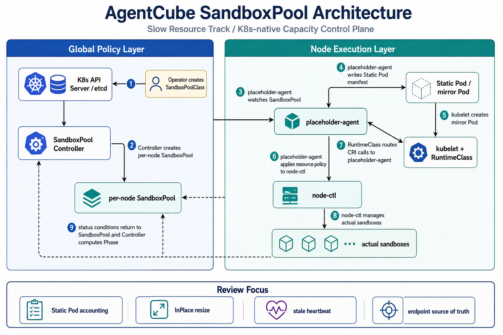
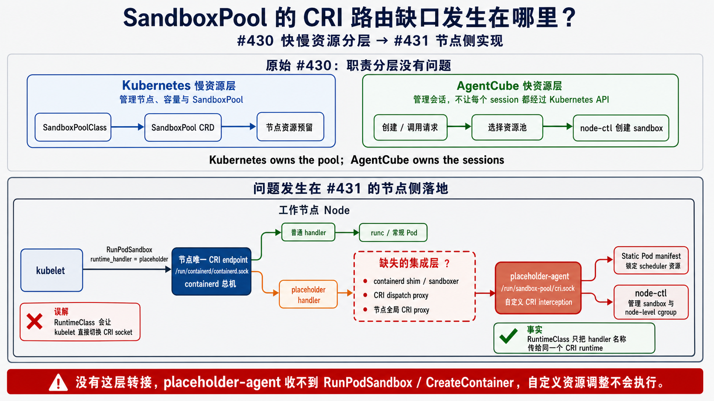

# Day 44：SandboxPool 管理正式 Proposal #431 Review

日期：2026-07-09

## 今日目标

今天开始看 upstream PR [#431](https://github.com/volcano-sh/agentcube/pull/431)：`[Proposal] add sandbox-pool management proposal`。这是基于 [#430](https://github.com/volcano-sh/agentcube/issues/430) 的正式 proposal，主题是 AgentCube 下一代架构里的 **slow resource track**：用 Kubernetes CRD 管理节点级 sandbox resource pool，把每个 session 的高频生命周期从 Kubernetes hot path 中拆出去。

> 注释：这里的 “formal proposal” 不是普通 issue comment，而是新增 `docs/proposals/sandbox-pool-management/README.md` 的文档 PR。它进入了 AgentCube 的 proposal 目录体系，因此后续讨论会更像设计评审，而不是临时 brainstorm。

本文记录四件事：

1. #431 当前社区和 CI 状态。
2. #430 到 #431 的设计脉络。
3. #431 proposal 的架构和 API 设计拆解。
4. 我们可以关注的 review 点，以及是否适合发 upstream comment。

## Proposal Review 应该怎么做

Proposal review 和普通代码 review 不一样。代码 review 主要看实现是否正确、测试是否覆盖、是否引入 bug；proposal review 更早一层，核心是判断：

1. 这个问题是否值得项目解决。
2. 这个设计是否合理、是否符合现有架构。
3. 这个方案会给长期兼容性、迁移、性能、安全、测试和维护带来什么成本。

> 分析：一旦 proposal 被接受，后续代码通常会围绕这个设计展开。因此 proposal review 的价值在于提前发现架构方向、API 边界和维护成本问题，而不是等实现完成后再发现“方向不该这样走”。

导师说“有疑问和意见可以提 PR comment”，这里的前提不是“看到一个点就评论”，而是先把 proposal 当成一份设计稿彻底读懂。Proposal review 更像审一份架构本子：

1. 先复述作者到底想解决什么问题。
2. 再复述作者明确不解决什么问题。
3. 然后画出对象、组件、状态机、读写边界和失败路径。
4. 最后才判断文本有没有漏掉假设、边界、验证方式或会误导实现者的地方。

> 注释：proposal 还没有代码，很多“问题”不是 bug，而是“文本没有把未来实现必须知道的约束写清楚”。所以 review 的贡献往往不是直接要求改逻辑，而是建议把 scope、source of truth、状态转换、feature gate、failure mode、test plan、rollout plan 写得更清楚。

### 读 proposal 的四层顺序

| 层级 | 要回答的问题 | #431 中对应内容 |
| --- | --- | --- |
| 问题层 | 为什么现在要改架构？旧架构瓶颈是什么？ | #430 的 K8s per-session hot path、API server 压力、idle waste、capacity planning 混乱 |
| 边界层 | 这个 proposal 做什么、不做什么？ | #431 只做 slow resource track，不做 node-ctl sandbox lifecycle / overcommit / snapshot |
| 机制层 | API、controller、agent、状态机如何协作？ | `SandboxPoolClass` / `SandboxPool`、SandboxPool Controller、placeholder-agent、Static Pod、SSA status ownership |
| 验证层 | 哪些高风险声明需要实验或测试证明？ | Static Pod resource locking、skip-cgroup、InPlace Resize、stale heartbeat、deletion/finalizer |

如果这四层里任意一层说不清，就不应该急着发 upstream comment。可以先写中文内部笔记，直到能用自己的话完整解释提案。

### 通用 Proposal Review Checklist

以后看 AgentCube、Kubernetes、Volcano 这类 CNCF 风格项目的 proposal，可以用下面这张表做第一轮 checklist：

| 检查项 | Review 时要问的问题 |
| --- | --- |
| Problem | 为什么要做？是真实用户问题、性能瓶颈、维护痛点，还是边缘场景？有没有 benchmark、用户反馈、issue 或具体场景支撑？ |
| Goals / Non-goals | scope 是否清晰？有没有从一个目标膨胀成多个系统一起改？ |
| Alternatives | 为什么不选其他方案？为什么不复用已有 API / CRD / controller / interface？ |
| API / Interface | 命名是否一致？是否有 breaking change？新增接口是否必要？ |
| Data Flow | 数据和请求怎么流？是否有绕路、重复写、循环依赖或不必要的组件跳转？ |
| Ownership | 哪个组件负责哪个字段、状态和动作？有没有职责混乱，例如执行器同时更新控制面数据库？ |
| Backward Compatibility | 旧 API、旧 CRD、旧 SDK、旧 Helm values、旧配置是否会被破坏？ |
| Migration | 现有用户如何升级？是否需要 conversion、defaulting、deprecation 或 migration guide？ |
| Performance | 是否增加延迟、内存、CPU、API server 压力、调度压力或 controller churn？有没有测试计划？ |
| Security | 是否新增 HTTP API、credential、RBAC、TLS、Secret、node-local socket、tenant boundary 或 privilege assumption？ |
| Maintainability | 是否新增长期维护路径？逻辑能不能和已有实现共享？以后 bug 是修一次还是多处都要修？ |
| Test Plan | 是否覆盖 unit、integration、e2e、benchmark、rollback、failure-path test？ |

这张表和 #431 的对应关系：

- Problem：#430 里已经解释 Kubernetes hot path、API server 压力和 idle resource waste，这是 #431 成立的背景。
- Goals / Non-goals：#431 明确只做 slow resource track，不做 node-ctl sandbox lifecycle，这是优点；但 `Fixes #430` 可能让 scope closure 变得过大。
- Alternatives：需要进一步解释为什么新增 `sandbox-pool.io` API group，而不是沿用 AgentCube API group 或复用 agent-sandbox warm pool 资源。
- Design：Static Pod、placeholder-agent、RuntimeClass handler、SSA status ownership 是核心设计，需要检查 source of truth 和组件职责。
- Compatibility / Migration：如果未来引入 CRD、RuntimeClass、host-level systemd agent、Static Pod manifest，升级路径和安装前置条件需要更清楚。
- Performance / Test Plan：Static Pod resource locking、skip-cgroup、in-place resize 都是性能和资源语义相关风险，应有 targeted spike。
- Security：host-level placeholder-agent、CRI socket、node-ctl proxy、kube credential 都是安全审查点。
- Maintainability：如果资源池、node-ctl、placeholder-agent、controller 都引入新路径，proposal 需要说明哪些是第一阶段，哪些是后续。

### 高质量 Review Comment 的形状

避免只说：

- `I don't like this.`
- `This feels complicated.`
- `This may be risky.`

更好的 comment 应该包含三件事：

1. 具体问题是什么。
2. 为什么这会影响实现、兼容、测试或维护。
3. 作者可以如何补充 proposal 文本。

例如：

```md
Could you describe the migration path for existing users?

Why it matters: this proposal introduces a new RuntimeClass and node-local agent, so existing deployments may need extra installation and upgrade steps.

Suggested clarification: add a short "Migration / rollout" section covering first-time install, upgrade from existing warm-pool deployments, and rollback.
```

> 注释：proposal comment 最好是 question + why it matters + suggested clarification，而不是直接给作者下结论。除非我们有代码证据、测试证据或官方文档依据，否则不要把推断写成 blocking concern。

### 评论不是找茬，而是补齐可实现性

Proposal comment 适合聚焦三类内容：

1. **文本范围问题**：例如 `Fixes #430` 是否会过早关闭一个 broad discussion；front matter 是否缺 `tracking-issue`。
2. **实现者会误解的问题**：例如 CRD 里有 `nodeCtlEndpoint`，但 placeholder-agent 又说只读 systemd 参数，这就是 source of truth 不清。
3. **验证计划不足的问题**：例如 Static Pod + skip-cgroup + InPlace Resize 是 proposal 最有风险的组合，文本需要说明用什么 spike / e2e 证明。

不适合评论的内容：

- 个人偏好的命名风格，除非会影响 API 长期一致性。
- 已经被作者或 maintainer 正在处理的 AI review 小问题。
- 没有证据支撑的“我觉得可能不行”。
- 一口气把所有疑问塞进很长的 omnibus comment。

> 分析：真正有质量的 proposal review 应该能让作者说“这个点补进 proposal 后，后续实现和 review 都会更清楚”。如果只是证明自己发现了很多问题，反而会增加社区沟通噪音。

### 这次 #431 的评论策略

短期更合理的策略不是马上发评论，而是先把疑问分级：

| 等级 | 例子 | 是否适合现在评论 |
| --- | --- | --- |
| 流程/文本小修 | DCO、`tracking-issue`、`Fixes #430` | 可以评论，但 DCO/tracking issue 可能作者会自己修；`Fixes #430` 更值得提醒 |
| 设计澄清 | `nodeCtlEndpoint` source of truth、API group 是否用 `sandbox-pool.io` | 适合以 question 形式评论 |
| 高风险机制 | Static Pod resource locking、skip-cgroup、Static Pod resize、stale heartbeat | 最好先配合官方文档或最小实验，再评论 |
| 实现建议 | 具体 controller 代码、node-ctl 细节 | 现在不适合，因为 proposal 明确把 node-ctl 内部作为 non-goal |

因此，如果后面要写 #431 comment，第一版应该短，只选 1-2 个最关键点，例如：

- “Since #430 is the broader architecture discussion and this PR covers only the slow resource track, should this be `Refs #430` instead of `Fixes #430`?”
- “Could the proposal add a validation spike for Static Pod resource accounting and in-place resize behavior, since these mechanisms are central to the resource-locking guarantee?”

这类评论不是否定 proposal，而是帮助 proposal 文本变得更可实现、可验证、可维护。

### Skill 沉淀

这次经验应该沉淀到本地 skill，而不是只留在日报里。后续看 proposal 时应复用固定流程：

1. 抓 thread context。
2. 读 proposal template。
3. 写 understand-first 中文 summary。
4. 用 review matrix 分类：scope / API / state machine / ownership / failure mode / security / compatibility / test plan。
5. 只把高价值、可行动、英文清楚的问题变成 upstream comment draft。

已将这个流程沉淀到 `.agents/skills/agentcube-issue-discussion/references/proposal-review.md`，并在 issue-discussion skill 中加入入口。后续如果 proposal review 变成高频独立任务，再考虑拆出单独 `agentcube-proposal-review` skill；现在先作为 issue-discussion 的专项 reference 更合适，因为它仍依赖同一套 GitHub thread 抓取、角色权重和 upstream comment guardrails。

## 早期 Proposal PR 是怎么 battle 的

为了理解 proposal review 到底该看什么，我回看了一批早期 AgentCube proposal / design PR 和关联 issue。这里的 “battle” 不是吵架，而是维护者通过问题把 proposal 从“大方向描述”压到“可实现、可维护、可验证的设计契约”。

> 注释：早期 proposal 大多还放在 `docs/design/`，不是现在的 `docs/proposals/<name>/README.md` 目录结构。#415 合入后，AgentCube 才正式有了 proposal index 和 template。因此看历史样本时，不能只按当前模板要求倒推，而要看 reviewer 关注了哪些稳定问题。

### 样本概览

| PR / issue | 结果 | battle 主线 | 对 proposal review 的启发 |
| --- | --- | --- | --- |
| [#28 AgentRun CLI proposal](https://github.com/volcano-sh/agentcube/pull/28) | merged | CLI 命令语义、provider 行为、proxy / status / publish 等用户可见 contract | 用户入口类 proposal 要问清命令到底等待什么、失败怎么报、哪些字段只对某 provider 生效 |
| [#29 PicoD Design](https://github.com/volcano-sh/agentcube/pull/29) | merged | PicoD 是否是 sandbox manager、HTTP/gRPC/API 细节、auth token 传递、workspace 限制 | 名词边界和协议细节不能模糊；proposal 不能把组件职责写成另一个系统 |
| [#37 AgentCube Task design](https://github.com/volcano-sh/agentcube/pull/37) | closed | 范围过大，几乎没有真人 maintainer 深入 review | 太大的 outsider proposal 即使内容多，也可能因为 scope 不可评审而停掉 |
| [#38 sandbox warm pool proposal](https://github.com/volcano-sh/agentcube/pull/38) | closed | WarmPool API 是否该完整暴露给用户、namespace 是否该出现在 path、admin 流程和 apiserver 内部流程混在一起 | 资源池 proposal 最重要的是区分用户 API、管理员 API 和内部实现细节 |
| [#44 runtime API design](https://github.com/volcano-sh/agentcube/pull/44) | merged | 为什么新设计 API，而不是复用已有 SandboxTemplate；设计文档和 Go API type 一致性 | 正式 API proposal 必须回答 reuse-vs-new-resource，并保持文档 / 代码 contract 一致 |
| [#80 overall AgentCube proposal](https://github.com/volcano-sh/agentcube/pull/80) | merged | AgentRuntime / CodeInterpreter / WorkloadManager / Router 的边界、用户入口、session 概念 | 系统级 proposal 的核心是产品模型和组件边界，不只是架构图漂亮 |
| [#114 PicoD plain auth proposal](https://github.com/volcano-sh/agentcube/pull/114) | merged | JWT issuer 概念、Secret / ConfigMap source of truth、token reuse/rotation、部分写入失败恢复 | 安全 proposal 要审 threat model、source of truth、atomicity、rotation 和 recovery |
| [#164 PR template proposal issue](https://github.com/volcano-sh/agentcube/issues/164) | closed | 维护者要求参考 Volcano 生态已有模板，而不是随意新造流程 | 流程类 proposal 也要先对齐项目生态惯例 |
| [#241 AuthN/AuthZ design proposal](https://github.com/volcano-sh/agentcube/pull/241) | merged | 用户身份如何从 Router 传到 runtime、mTLS/SPIRE 是否影响低延迟、tenant isolation、证书轮换和安装边界 | 安全和性能 trade-off 要落到具体路径、延迟预算、配置方式和实现切片 |

### 真人 review 和 AI review 的差别

这些样本里，AI reviewer 的价值主要是帮助扫一致性和局部错误，例如字段名不一致、示例代码错误、endpoint 表述与当前实现不一致、文档链接或模板问题。它很有用，但通常不是设计方向的来源。

真人 maintainer 的评论更像架构压力测试，常见问题是：

1. 这个能力应该暴露给用户，还是应该藏在 AgentCube apiserver / controller 后面？
2. 为什么要新增 API / CRD，而不是复用已有资源？
3. 这个字段谁写、谁读、是否有两个 source of truth？
4. 如果一半成功一半失败，系统怎么恢复？
5. 安全方案会不会破坏低延迟或多租户隔离？
6. 图里每一步是动作还是名词？用户流程和内部流程是否混在一起？
7. proposal 是否写了太多安装教程或实现细节，反而没有讲清核心设计？

> 分析：这说明 proposal review 不是“挑文档毛病”，而是在代码出现前提前保护未来实现边界。一个好问题应该能让 proposal 多出一段清楚的 contract，而不是只让作者改一个词。

### 几个典型 battle 模式

**1. API 暴露边界**

#38 的 warm pool proposal 很接近 #431。维护者关注的不是 warm pool 是否有价值，而是完整 WarmPool API 是否应该直接暴露给用户。如果用户可以绕过 AgentCube apiserver 创建或操纵 WarmPool，那 AgentCube 再包装一层 API 的意义就会变弱。

对 #431 的启发：`SandboxPoolClass` / `SandboxPool` 是管理员资源、AgentCube 内部资源，还是未来用户可见资源？`nodeCtlEndpoint`、namespace、host socket 这类细节是否应该进入 CRD spec，需要用“谁应该 declaratively control 它”来判断。

**2. Reuse vs new API**

#44 的 runtime API proposal 被追问为什么要设计新 API，而不是直接使用已有 `SandboxTemplate`。这类问题很关键，因为 API 一旦合入，后续会带来兼容性、client-go、CRD 版本和迁移成本。

对 #431 的启发：如果新增 `sandbox-pool.io` API group 和 `SandboxPoolClass`，proposal 应该解释它和现有 AgentCube runtime API、agent-sandbox `SandboxWarmPool` / `SandboxTemplate` 的关系。不是说不能新增，而是要说明为什么不能复用、为什么应该成为长期 API。

**3. 用户流程 vs 内部实现流程**

#80 的 overall proposal 被反复追问 WorkloadManager 是否应该暴露给用户、CodeInterpreter 和 AgentRuntime 为什么并存、session 到底是应用会话还是基础设施会话。#29 也类似，PicoD 的定位不能写成 sandbox management。

对 #431 的启发：proposal 应该把两条路径拆开：管理员创建 / 更新 pool 的慢路径，以及 AgentCube session 从 pool 中快速分配 runtime 的快路径。否则 reviewer 很难判断 Static Pod、placeholder-agent、node-ctl 分别在哪条路径上工作。

**4. Source of truth 和 atomicity**

#114 的 PicoD auth proposal 里，Secret / ConfigMap 分离方案被追问原子性：如果 Secret 创建成功但 ConfigMap 创建失败，系统会处于什么状态？最后设计收敛到更清楚的 Secret source of truth。

对 #431 的启发：`SandboxPoolClass.spec.nodeCtlEndpoint`、`SandboxPool.spec.nodeCtl.endpoint`、placeholder-agent 启动参数、systemd 配置之间不能同时宣称自己是 source of truth。若 endpoint 只是状态展示或文档 hint，就应写清楚；若未来可配置，就要写 reconcile 和失败恢复。

**5. 性能 / 安全 trade-off**

#241 的 auth proposal 最后不是停在“mTLS 更安全”这个抽象层，而是讨论 Router -> PicoD / runtime 路径是否需要用户身份、TLS handshake 是否破坏 100ms 级 bootstrap、JWT mode 和 mTLS mode 是否都要保留。

对 #431 的启发：Static Pod + skip-cgroup + RuntimeClass CRI handler 不能只说“可以锁资源”。它的 trade-off 是 scheduler accounting、eviction、metrics、QoS、host 权限和 resize 行为都要被验证。proposal 的 Test Plan 应该写 targeted spike，而不是只写 controller unit test。

**6. Closed proposal 的失败模式**

#37 和 #38 都 closed。它们的共同点不是“没有想法”，而是范围或边界让 review 成本太高：#37 设计面太大，像一次性定义新系统；#38 则把 API 暴露、namespace path、apiserver 内部流程和用户流程混在一起。

对 #431 的启发：#431 要避免变成“资源池、node-ctl、overcommit、snapshot、session runtime 全部一次讲完”。它现在明确 non-goal 是优点；review 可以帮助它继续保持 slow resource track 的边界。

### 可以迁移到 #431 的 review 视角

结合这些历史样本，#431 的高价值 comment 不应是“我觉得 Static Pod 风险大”这种泛泛意见，而应该压成可回答的问题：

1. **Scope**：#431 只覆盖 slow resource track，是否应该 `Refs #430` 而不是 `Fixes #430`？
2. **API boundary**：`SandboxPoolClass` / `SandboxPool` 面向管理员还是内部控制面？哪些字段是 declarative spec，哪些只是 status / hint？
3. **Reuse rationale**：为什么使用新的 `sandbox-pool.io` API group，而不是沿用 AgentCube 域名或复用 agent-sandbox warm pool 资源？
4. **Source of truth**：node-ctl endpoint 到底由 CRD、systemd flag，还是 placeholder-agent 配置决定？
5. **Validation**：Static Pod resource accounting、skip-cgroup、mirror Pod rebuild、manifest resize 是否有独立 spike？
6. **Failure mode**：placeholder-agent 挂死但 Node 仍存在时，Ready phase 如何避免 stale？

> 分析：这就是 mentor 说的“有疑问和意见可以提 PR comment”的前提。不是把自己所有疑问发出去，而是先知道历史上 maintainer 真正关心什么，再选择能改善 proposal 文本和未来实现路径的问题。

## 社区状态快照

时间点：2026-07-09 本地查询。

| 项目 | 当前状态 |
| --- | --- |
| PR | [#431](https://github.com/volcano-sh/agentcube/pull/431) |
| 标题 | `[Proposal] add sandbox-pool management proposal` |
| 作者 | `@lichuqiang` |
| 类型 | Proposal PR / `/kind feature` |
| 状态 | Open，非 draft |
| 文件范围 | 新增 `docs/proposals/sandbox-pool-management/README.md` |
| Diff | 1 file, +643 lines |
| labels | `kind/feature`, `size/XL` |
| assignee | 无 |
| PR 认领 @ | 无 |
| 关联 issue | [#430](https://github.com/volcano-sh/agentcube/issues/430) |
| 最近提交 | `9f03cca add sandbox-pool management proposal` |
| DCO | Success |
| tide | Pending |
| 普通 CI | 最新 force-push 后 build / codegen / lint / Python / coverage / e2e 等已 success |

初始两个 commit 没有 `Signed-off-by` trailer：

```text
9787221 fix AI review comments
7d97d7e add sandbox-pool management proposal
```

2026-07-09 更新：作者先把提交整理为一个 commit `3028841`，DCO 变为 Success。PR body 中 `Which issue(s) this PR fixes` 已从 `Fixes #430` 改为 `Refs #430`，#430 仍保持 open。

2026-07-09 进一步同步：#431 又 force-push 到单 commit `9f03cca`。最新 proposal 已经吸收几条 AI / 社区评论：front matter 增加 `tracking-issue: "#430"`；`ResourcePolicy` 和 `ResizeInfo` 的 CPU / Memory 字段改成 `resource.Quantity`；`ResizeNone` 不再作为显式 enum；`NodeNotFound=False` 后改为重新评估所有 conditions，而不是直接转 Ready；Markdown fence 问题也已修正。

2026-07-09 再次同步：#431 普通 checks 已全部通过，`tide` 仍 pending，原因是缺 `approved` / `lgtm` labels。Copilot 后续新增 5 条 proposal 级评论，集中在 `<5s` mirror pod rebuild 硬保证、`pause:3.9` 与 “no actual process / no cgroup” 表述冲突、SSA 多 writer conditions 需要 CRD list-map schema、`nodeCtlEndpoint` source of truth。作者回复了 `<5s` 是 rough estimate，并解释 placeholder-agent 是 host process、image 配置只是满足 K8s 形式要求；但截至 `9f03cca`，proposal 正文尚未按这些回复更新。

> 分析：DCO 是合并门禁问题，和 proposal 技术内容无关。`Fixes #430 -> Refs #430` 的修正说明 scope / closing semantics comment 已被采纳，避免了 merge #431 时自动关闭 broader discussion #430。

## 参与者与评论权重

| 角色 | 账号 | 权重判断 |
| --- | --- | --- |
| 讨论 issue 作者 / 维护者 | `@RainbowMango` | #430 作者，Collaborator；目前 #431 中被 `/cc`，但尚未技术回复 |
| Proposal PR 作者 | `@lichuqiang` | 负责当前 proposal 内容；不是 maintainer consensus |
| 其他贡献者 | `@vivek41-glitch` | 跟进提醒 DCO，并赞同 `Refs #430` 关闭语义；不是 maintainer consensus |
| 流程 bot | `@volcano-sh-bot` | 提示 approval / OWNERS / first PR；不是技术判断 |
| CI / coverage bot | `@codecov-commenter` | 说明 coverage 和上传状态；不是技术判断 |
| AI reviewer | `@gemini-code-assist[bot]`, `@copilot-pull-request-reviewer[bot]` | 可作为检查清单；不能当作维护者结论 |

目前没有真人维护者对 #431 的技术意见。因此今天的结论只能写成“我们的 review 观察”和“已有 contributor 跟进”，不能写成“维护者已经达成共识”。

## #430 到 #431 的脉络

#430 由 `@RainbowMango` 发起，核心问题是 AgentCube 当前把每个 agent / code-interpreter session 都落到 Kubernetes CR / Pod 上，会遇到几个瓶颈：

1. session 创建慢：CR 创建、reconcile、Pod 创建、调度、kubelet sync、image pull、microVM boot 都在用户可见路径上。
2. API server / etcd 不适合承载大量短生命周期对象。
3. idle sandbox 浪费资源，Kubernetes 没有原生 Pod suspend/resume。
4. 容量规划和 session 生命周期混在一起，管理员不能先规划 agent capacity，再由 AgentCube 快速分配 session。

#430 的方向可以压缩成一句话：

> Kubernetes owns the pool; AgentCube owns the sessions.

也就是说，Kubernetes 负责管理长期存在、低频变化的资源池；AgentCube 控制面负责高频 session 分配，不再为每个 session 触发 Kubernetes 对象创建。

#431 是对这个方向里 **Kubernetes owns the pool** 部分的正式 proposal。它明确说只做 slow resource track，不设计 node-ctl 的 sandbox create/suspend/resume/delete、overcommit coordination、snapshot 这些 fast path 内部实现。

> 注释：这和 Day35/Day36 的内部结论对齐：Kubernetes 适合管理慢状态、资源边界和全局可观测性；真正高频的 sandbox 生命周期应该下沉到 node-local runtime / node-ctl / sandbox-ctl。

## 回到 #430 原始讨论：问题空间怎么拆

#430 不是一个 bug issue，而是 `@RainbowMango` 发起的 architecture discussion。它没有 assignee、没有评论，正文最后写的是“start a discussion and agree on a direction, welcome proposals”。因此，review #431 时要先把 #430 的问题空间拆开，避免把一个 proposal 当成整个 #430 的 closure。

| #430 原始问题 | 本质 | #431 覆盖情况 | Review 判断 |
| --- | --- | --- | --- |
| Session creation 慢 | 每个 session 都走 CR creation → reconcile → Pod creation → scheduling → kubelet sync → image pull → microVM boot | **间接覆盖一部分**：#431 先预留 node-level pool，但不设计 session assignment fast path | #431 不能证明 session 秒开；它只为后续 fast path 准备容量层 |
| API server / etcd 短生命周期对象压力 | bursty short-lived sessions 产生大量 K8s object create/update/delete | **部分覆盖**：Pool CRD 是长期对象，不再把每个 session 映射成 K8s 对象，但 session store / fast control plane 不在 scope | 需要明确 #431 不是“去掉 hot-path K8s writes”的完整方案 |
| Idle sandboxes 浪费资源 | Agent 多数时间 idle；K8s 没有原生 Pod suspend/resume，即便有也不适合每次唤醒走 API server | **基本不覆盖**：suspend/resume/delete 是 node-ctl / fast track non-goal | 不应要求 #431 做 Sleep/Resume，但要确认它不阻碍后续 session lifecycle |
| Capacity planning 和 session lifecycle 混在一起 | 管理员不能独立声明“给 agent 预留多少容量” | **直接覆盖**：`SandboxPoolClass` / `SandboxPool` 正是在做 resource pool declaration 和 per-node capacity snapshot | 这是 #431 最强的 problem fit |
| Kubernetes owns pool; AgentCube owns sessions | K8s 管慢资源池，AgentCube 管高频 session，不在 hot path 创建 K8s 对象 | **覆盖前半句**：K8s owns pool；**不覆盖后半句**：AgentCube owns sessions | PR body 用 `Refs #430` 是对的，#430 应继续保留给 fast track / session lifecycle proposals |

> 分析：这张表能帮助我们判断 comment 是否值得发。如果一个问题属于 “AgentCube owns sessions”，比如 session store、Router fast assignment、pause/resume、snapshot restore，就不应该拿来要求 #431 解决；但可以要求 #431 把 Non-goals 和后续依赖写清楚。相反，如果问题属于 “Kubernetes owns pool”，比如资源锁、Pool CRD source of truth、Pool status、Static Pod resize、node-level agent 权限，就属于 #431 的核心 review 面。

## #431 当前真正值得 review 的轴

从 #430 反推，#431 的 review 不是问“能不能解决所有架构演进问题”，而是问它作为 **slow resource capacity control plane** 是否成立。当前可以按四条轴看：

| Review 轴 | 核心问题 | 当前状态 |
| --- | --- | --- |
| Problem fit | 是否真正解决 capacity planning 与 pool declaration | 方向匹配，是 #431 最稳的部分 |
| API boundary | `SandboxPoolClass` / `SandboxPool` 是否是用户/admin API，哪些字段是 declarative source of truth | `nodeCtlEndpoint` 仍有双 source-of-truth 风险 |
| Node mechanism | Static Pod + RuntimeClass + placeholder-agent 是否能安全锁定资源 | `<5s`、`pause:3.9`、skip-cgroup、InPlaceResize 都需要更强验证或更谨慎表述 |
| Status correctness | controller 和 placeholder-agent 双写 status 是否可靠 | SSA FieldOwner 方向合理，但 `conditions` list-map schema、stale heartbeat、`hasEverBeenReady` 持久判断仍需明确 |

最新 Copilot 评论和作者回复可以作为检查清单，但不是维护者共识。作者回复说明了设计意图：placeholder-agent 是 host process，placeholder Pod 里的 image 主要是形式化配置；但 proposal 正文如果仍写 “no actual process/no cgroup created”，未来实现者可能按普通 K8s/CRI 行为误解。这个属于 proposal 文本必须精确的地方。

## Proposal 设计拆解

### 1. 总体架构

#431 把系统分成两层：

| 层 | 组件 | 职责 |
| --- | --- | --- |
| Global Policy Layer | `SandboxPool Controller` | Class 到 Pool 的映射、节点选择、policy snapshot sync、Phase 聚合、finalizer、node check |
| Node Execution Layer | `placeholder-agent` | host-level systemd service，负责 CRI handler、Static Pod manifest 管理、node-ctl proxy、CRD watch、condition 上报 |
| Node Execution Layer | Static Pod / mirror Pod | 作为 Kubernetes 调度资源占位，锁定 `resources.requests/limits` |
| Node Execution Layer | `node-ctl` | sandbox create/suspend/resume/delete、资源超配、snapshot 等 fast path；proposal 中当作黑盒 |

核心设计选择：

- 用 Static Pod 锁定调度资源，mirror Pod 被误删后由 kubelet 重建。
- placeholder-agent 是 host-level systemd 服务，不跑在 placeholder Pod 内。
- RuntimeClass handler `placeholder` 把 CRI 调用路由到 placeholder-agent 的 socket。
- 通过 SSA FieldOwner 协调 controller 和 placeholder-agent 的 status 写入。
- 用 InPlace Pod Resize 做资源在线调整。

> 分析：这个结构比 Day36 的“Template Controller + Pool Controller”更节点本地化。Day36 里 Pool Controller 仍像 DaemonSet/controller；#431 则把节点侧职责集中到 host-level placeholder-agent，并让它直接写 Static Pod manifest、实现 CRI handler、代理 node-ctl。

### 2. CRD 模型

Proposal 定义两个 cluster-scoped CRD：

| CRD | 作用 |
| --- | --- |
| `SandboxPoolClass` | 全局资源池策略，包含 node selector、resource policy、placeholder Pod template、node-ctl endpoint 等 |
| `SandboxPool` | 节点级资源池实例，包含 `classRef`、`nodeName`、policy snapshot、override 和节点状态 |

`SandboxPoolClass` 的关键字段：

- `spec.selector`
- `spec.nodeSelector`
- `spec.resourcePolicy.cpu`
- `spec.resourcePolicy.memory`
- `spec.placeholderPodTemplate`
- `spec.nodeCtlEndpoint`

`SandboxPool` 的关键字段：

- `spec.classRef`
- `spec.nodeName`
- `spec.nodeCtl`
- `spec.resourcePolicy`
- `spec.override`
- `status.phase`
- `status.placeholderPod`
- `status.placeholderAgent`
- `status.resize`
- `status.nodeCtl`
- `status.poolInfo`
- `status.conditions`

当前 API group 写成 `sandbox-pool.io/v1alpha1`。

> 分析：现有 AgentCube runtime API group 是 `runtime.agentcube.volcano.sh/v1alpha1`。新 proposal 使用 `sandbox-pool.io`，可能来自早期独立设计稿。正式进入 AgentCube upstream 前，API group 是否应该对齐 AgentCube 域名，是一个值得 reviewer 问清楚的问题。

### 3. Status 写入模型

Proposal 用 SSA FieldOwner 分离 status 写入：

| FieldOwner | 组件 | 管理字段 |
| --- | --- | --- |
| `placeholder-agent` | node-local agent | `placeholderPod`, `placeholderAgent`, `override`, `resize`, `nodeCtl`, `poolInfo`, non-`NodeNotFound` conditions, `lastAppliedGeneration` |
| `sandboxpool-controller` | global controller | `phase`, `NodeNotFound` condition |

好处是 controller 可以在节点被删除或 placeholder-agent 不可达时仍然更新 `phase`，不会完全依赖节点本地组件。

风险是 stale condition：如果 placeholder-agent 挂了但 Node 还存在，controller 只靠 `NodeNotFound` 并不能判断 status 是否过期。Proposal 的 risk table 说“Node NotReady 间接覆盖”，但没有定义 controller 如何把 Node NotReady、heartbeat stale 或 `LastHeartbeat` 超时转换成 `Unready`。

> 分析：这可能是 #431 最值得深入 review 的正确性问题。节点不存在时好处理；节点存在但 placeholder-agent / CRI socket / node-ctl proxy 卡死时，旧的 Ready condition 可能保留在 CRD status 里。如果 controller 不主动检查 `lastHeartbeat` 或 Node condition，Phase 可能继续显示 Ready。

### 4. Phase 状态机

#431 定义四个 phase：

| Phase | 语义 |
| --- | --- |
| `Pending` | placeholder Pod 从未 ready |
| `Ready` | placeholder Pod ready，node-ctl healthy，resource synced 或 resize deferred |
| `Degraded` | node-ctl 短时不可达，或 policy 未同步 |
| `Unready` | node-ctl 长时间不可达、placeholder Pod 异常、NodeNotFound |

AI reviewer 曾指出 `NodeNotFound=False -> Ready` 不安全，因为 Node 恢复不等于 placeholder Pod 和 node-ctl 健康。当前 head 已修成：`NodeNotFound=False` 后重新评估所有 conditions，再决定 Ready/Pending/Degraded。

proposal 自己也记录了一个风险：`hasEverBeenReady` 只是近似判断，可能误判 Pending / Unready，未来可能加 `status.hasBeenReady`。

> 分析：既然 phase 语义已经依赖 “was Ready” 和 “never Ready”，`status.hasBeenReady` 不一定应该等未来。v1alpha1 若直接需要这个判断，最好从第一版就把字段纳入 status，避免实现时靠内存或 condition history 猜。

### 5. Static Pod / RuntimeClass / skip-cgroup 模型

#431 最关键也最有风险的点是：

- Static Pod 用来锁定 Kubernetes 调度资源。
- placeholder Pod “no actual process, skip cgroup”。
- placeholder-agent 作为 host-level systemd 进程提前启动。
- kubelet 根据 RuntimeClass handler 把 CRI 调用路由到 `/run/sandbox-pool/cri.sock`。
- placeholder-agent 通过 CRI handler 响应 kubelet，并把 carved-out resources 交给 node-ctl 使用。

Kubernetes 官方文档里，Static Pod 是由 kubelet 在特定节点直接管理的 Pod；kubelet 会在 API server 中创建 mirror Pod，让它可见，但不能从 API server 控制该 Pod。文档也说明 Static Pod 不能引用 ServiceAccount / Secret / ConfigMap，且如果是在集群里给每个节点跑节点级 workload，通常应优先考虑 DaemonSet。

> 注释：这不表示 #431 的 Static Pod 方案一定错。它利用 Static Pod 的地方恰恰是“mirror Pod 被删后 kubelet 会重建”这个特性。但它偏离常规节点 agent 模型，所以需要额外证明调度资源、kubelet admission、eviction、metrics、QoS 和 resize 行为都符合预期。

需要验证的具体问题：

1. Static Pod 的 mirror Pod 是否稳定参与 scheduler resource accounting，能否真实阻止普通 Pod 抢占这部分 request。
2. 如果 CRI shim 故意 `skip-cgroup`，kubelet / cadvisor / eviction manager 是否还能正确看待这个 Pod 的 request、limit、usage、QoS。
3. mirror Pod 被删后“<5s 重建”在不同 kubelet config、API server 延迟、压力场景下是否成立。
4. Static Pod manifest 更新资源后，kubelet 是原地 resize 还是重建 Pod。
5. host-level placeholder-agent 如何安全获取 kubeconfig / token，因为 Static Pod 本身不能挂 ServiceAccount。

### 6. InPlace Resize 版本和适用范围

#431 的兼容性表写：

```text
VPA InPlaceResize: 1.27 Alpha / 1.31 GA
```

需要复核。Kubernetes 官方博客显示 In-Place Pod Resize 在 v1.33 进入 Beta 并默认启用，在 v1.35 进入 Stable。官方 v1.35 博客也提到 VPA 的 `InPlaceOrRecreate` update mode 当时是 beta，`InPlace` mode 仍在推进。

> 分析：#431 把 “Kubernetes in-place Pod resize feature” 和 “VPA 集成能力” 有点混在一起。Proposal 里应明确到底依赖原生 Pod resize subresource、VPA recommender/updater，还是 placeholder-agent 自己改 Static Pod manifest。三者的版本、权限、测试方式不一样。

尤其要注意：Kubernetes in-place resize 通常通过更新 Pod spec / `resize` subresource 触发；Static Pod 的 mirror Pod 又不能由 API server 控制。#431 需要用 e2e spike 证明“Static Pod + local manifest update + CRI UpdateContainerResources”真的能在不重建 Pod 的情况下生效，否则目标里的 “without rebuilding Pods” 可能不成立。

### 7. Process / metadata 问题

这一类问题在第一版 proposal 里比较明显，但最新 `9f03cca` 已经修掉大部分：

| 项目 | 初始状态 | 最新状态 |
| --- | --- | --- |
| DCO | 两个 commit 缺 `Signed-off-by` | 已整理为单 commit，DCO success |
| tracking issue | front matter 缺 `tracking-issue` | 已补 `tracking-issue: "#430"` |
| closing semantics | PR body 写 `Fixes #430` | 已改为 `Refs #430`，#430 仍 open |
| reviewers / approvers | `TBD` | 仍是 `TBD`，draft proposal 阶段可接受 |

> 分析：这说明第一条 upstream comment 的方向是有效的，但后续不要继续围绕已经解决的流程问题刷评论。现在 review 重心应该转向架构假设：Static Pod 是否能安全做资源锁、placeholder-agent 如何避免 stale Ready、VPA/InPlaceResize 是否适用于 Static Pod manifest 路径，以及 node-ctl endpoint/API group 是否形成长期 API 债。

## 和 Day35 / Day36 内部方案的关系

| 主题 | Day35/Day36 内部判断 | #431 当前 proposal | 判断 |
| --- | --- | --- | --- |
| 快慢资源分离 | K8s 管慢资源，node-local 管高频生命周期 | 明确 slow resources / fast resources 双轨 | 对齐 |
| CRD 模型 | `SandboxPoolTemplate` + `SandboxPool` | `SandboxPoolClass` + `SandboxPool` | 名称不同，语义接近 |
| controller 分层 | Template Controller + Pool Controller | SandboxPool Controller + host-level placeholder-agent | #431 更强调节点本地 agent |
| 占位资源 | Day36 建议先用普通 Guaranteed Pod，skip-cgroup 另做 spike | 直接选择 Static Pod + skip-cgroup + CRI handler | #431 激进，需要验证 |
| node-ctl 边界 | 先定义接口，node-ctl 可 fake | node-ctl 黑盒，placeholder-agent 唯一 proxy | 对齐，但接口还不够细 |
| status 聚合 | 需要定义 source of truth、heartbeat、stale state | SSA FieldOwner + controller phase aggregation | 方向好，但 stale heartbeat 仍需补 |
| upstream 形态 | 建议先拆 design proposal / CRD skeleton / placeholder spike | 先提交完整 design proposal | 合理，但 review 应要求测试切片 |

> 注释：#431 并不是把 Day36 原样搬到 upstream。它做了两个明显选择：一是把 `SandboxPoolTemplate` 改成 `SandboxPoolClass`；二是直接采用 Static Pod + CRI shim 模型。这两个选择都可以讨论，但后者的验证成本更高。

## 架构剖析：#431 到底在设计什么

配套图：

- 默认阅读用 Mermaid 图，直接嵌在本节下方。
- 可编辑 draw.io 源文件：[`day44-sandboxpool-architecture.drawio`](day44-sandboxpool-architecture.drawio)。
- GPT image 视觉版架构图：[`day44-sandboxpool-gpt-image-architecture.png`](day44-sandboxpool-gpt-image-architecture.png)，生成提示词见 [`day44-sandboxpool-gpt-image-prompt.md`](day44-sandboxpool-gpt-image-prompt.md)。

> 注释：用户反馈后续在 Linux 机器上优先用 Mermaid 或 GPT image draw，不强依赖 draw.io CLI。这里保留 `.drawio` 源文件作为可选资产，同时补 Mermaid 版本作为报告里的默认架构图。



```mermaid
flowchart LR
  user([Operator / Admin])

  subgraph cp["Global Policy Layer: Kubernetes Control Plane"]
    api[(K8s API Server / etcd)]
    class["SandboxPoolClass<br/>selector + resourcePolicy"]
    ctrl["SandboxPool Controller<br/>Class -> Pool mapping<br/>policy snapshot sync<br/>phase aggregation"]
    pool["SandboxPool per node<br/>spec: nodeName / classRef / policy<br/>status: conditions + phase"]
    phase["Controller-owned Phase<br/>Pending / Ready / Degraded / Unready"]
  end

  subgraph node["Node Execution Layer"]
    agent["placeholder-agent<br/>host-level systemd<br/>CRI handler + manifest manager<br/>sole node-ctl proxy"]
    cri["CRI socket<br/>/run/sandbox-pool/cri.sock<br/>RuntimeClass: placeholder"]
    manifest["Static Pod manifest<br/>/etc/kubernetes/manifests/..."]
    kubelet["kubelet<br/>watches manifest<br/>creates mirror Pod<br/>routes CRI calls"]
    mirror["Static Pod / mirror Pod<br/>K8s-visible resource lock<br/>skip-cgroup placeholder"]
    nodectl["node-ctl<br/>existing black box<br/>sandbox lifecycle / overcommit / snapshots"]
    sandboxes["Actual sandboxes<br/>fast lifecycle out of #431 scope"]
    cond["placeholder-agent-owned status<br/>PlaceholderPodReady<br/>ResourceSynced<br/>NodeCtlHealthy<br/>Resize*"]
  end

  user -->|"create / update"| class
  class -->|"stored as CRD"| api
  ctrl <-->|"watch / patch"| api
  class -->|"desired policy"| ctrl
  ctrl -->|"create Pool per matched node<br/>sync policy snapshot"| pool
  pool -->|"watch Pool for this node"| agent
  agent -->|"write / update"| manifest
  manifest -->|"static pod file watch"| kubelet
  kubelet -->|"creates mirror Pod"| mirror
  kubelet -->|"CRI calls"| cri
  cri -->|"handled by placeholder-agent"| agent
  agent -->|"ApplyResourcePolicy"| nodectl
  nodectl -->|"actual sandbox lifecycle"| sandboxes
  agent -->|"patch every 30s"| cond
  cond -->|"conditions / poolInfo / nodeCtl status"| pool
  pool -->|"conditions"| phase
  ctrl -->|"compute phase"| phase
```

一句话概括：#431 不是完整的 Agent session lifecycle proposal，而是给“慢资源轨道”设计一个 Kubernetes-native 的节点级 sandbox 资源池控制面。它只负责把一部分节点资源声明、锁住、下发给 node-local runtime，并把健康状态汇总回 K8s；真正的 sandbox create / suspend / resume / delete 仍然属于 node-ctl / fast track。

> 分析：这一点很重要。review 时不要用“它没有设计 session resume / snapshot / fast lifecycle”去否定 #431，因为这些已经列为 Non-goals。真正要问的是：作为 slow resource control plane，它的 API 边界、资源锁机制、状态聚合和故障恢复是否足够严谨。

### 1. 分层模型

| 层 | 组件 | 本质职责 | 需要 review 的边界 |
| --- | --- | --- | --- |
| Global policy layer | K8s API Server / etcd | 存 CRD、status、events，是唯一持久状态面 | 是否只靠 etcd 足够；API group / version 是否长期合理 |
| Global policy layer | SandboxPool Controller | 把 Class 映射成 per-node Pool，同步 policy snapshot，聚合 Phase | 不应直接碰 node-ctl；要避免 controller 和 agent 双写同一字段 |
| Node execution layer | placeholder-agent | 节点本地执行器：watch Pool、写 Static Pod manifest、处理 CRI、代理 node-ctl、patch status | 它是 host-level systemd daemon，凭证、权限和 stale heartbeat 必须讲清 |
| Node execution layer | Static Pod / mirror Pod | K8s 可见的资源锁，不是真正业务 workload | Static Pod + skip-cgroup 是否和 scheduler / kubelet / metrics / eviction 相容 |
| Runtime / fast path | node-ctl | 黑盒 runtime：真实 sandbox 生命周期、overcommit、snapshot | #431 不实现，但必须定义最小接口和错误语义 |

这套分层的优点是职责基本清楚：controller 只做全局声明式 reconcile，placeholder-agent 做节点落地，node-ctl 继续做高频 runtime 生命周期。它避免了 controller 直接远程调用每个 node-ctl，也避免把 node-ctl 的内部状态直接暴露成 K8s API。

风险也来自这个分层：一旦 placeholder-agent 挂死，K8s API 里最后一次 Ready condition 可能还在；一旦 Static Pod 的资源锁假设不成立，K8s scheduler 以为资源被保留，实际 node-ctl 又可能用另一套 cgroup；一旦 CRD 里有 endpoint 字段但 agent 实际只读 systemd flag，API 就会误导用户。

### 2. 对象模型

| 对象 | 可以理解成 | 关键字段 | 主要 owner |
| --- | --- | --- | --- |
| `SandboxPoolClass` | 全局资源池模板 / class | `selector`、`nodeSelector`、`resourcePolicy`、`placeholderPodTemplate`、`nodeCtlEndpoint` | 用户声明，controller 读取 |
| `SandboxPool` | 某个 node 上的资源池实例 / policy snapshot | `classRef`、`nodeName`、`resourcePolicy`、`override`、`nodeCtl` | controller 创建 spec，placeholder-agent 读取并写 status |
| Static Pod manifest | 节点本地资源锁配置 | requests/limits、RuntimeClass、labels/annotations | placeholder-agent 写，kubelet 消费 |
| mirror Pod | API server 里可见的 Static Pod 影子对象 | labels、phase、resource requests | kubelet 维护，只能间接观察 |
| Conditions / Phase | 健康和聚合状态 | `PlaceholderPodReady`、`ResourceSynced`、`NodeCtlHealthy`、`NodeNotFound`、`phase` | agent 写 conditions；controller 写 phase |

`SandboxPoolClass -> SandboxPool` 的设计像一个“模板到实例”的模型：Class 表达全局策略，Controller 根据 node selector 创建每个节点的 Pool，并把 Class 里的 resourcePolicy 拷贝成 Pool spec 的 policy snapshot。这样做的好处是 per-node override 有位置；缺点是 Class 变更、Pool override、agent 实际 applied generation 之间要定义清楚 precedence。

> 分析：proposal 已经写了 `lastAppliedGeneration`，但还没有把 “Class generation -> Pool spec resourcePolicy -> agent apply -> node-ctl effective quota” 这一条链路做成 source-of-truth 表。后续 review 可以建议补一个 field ownership / generation table，而不是只说“这里复杂”。

### 3. 四个核心控制循环

**循环一：Class 到 Pool 的全局 reconcile**

1. 用户创建或更新 `SandboxPoolClass`。
2. Controller 根据 `selector` / `nodeSelector` 找目标节点。
3. Controller 为每个节点创建或更新 `SandboxPool`，并同步 policy snapshot。
4. Controller 聚合 Class status 和 Pool phase。

这个循环是标准 K8s controller 风格，风险较低。更需要关注的是 selector immutable、一个 node 不能属于多个 Class、override 后 Class 更新如何处理。

**循环二：Pool 到 Static Pod 的节点 reconcile**

1. placeholder-agent watch 本节点对应的 `SandboxPool`。
2. agent 根据 Pool spec 写 `/etc/kubernetes/manifests/...` 下的 Static Pod manifest。
3. kubelet watch manifest 并创建 Static Pod / mirror Pod。
4. RuntimeClass handler 把 CRI 调用路由到 placeholder-agent 的 socket。

这是 #431 最关键的非典型路径。它不是普通 Deployment/DaemonSet，也不是 API server 驱动的 Pod 更新，而是“CRD -> host-level daemon -> 本地 manifest -> kubelet”的本地闭环。review 的重点应该从普通 controller correctness 转向 kubelet/CRI 行为实证。

**循环三：node-ctl resource apply**

1. placeholder-agent 从 Pool spec 看到目标 resourcePolicy。
2. agent 更新 Static Pod manifest 或触发 resize 相关流程。
3. agent 调用 node-ctl `ApplyResourcePolicy` 或等价接口。
4. node-ctl 调整本地 sandbox 资源池 / cgroup / overcommit 策略。
5. agent 读取 node-ctl 状态并 patch `poolInfo` / `nodeCtl` status。

这里的关键是“双重资源世界”要闭合：K8s 看到的 placeholder Pod request/limit 必须和 node-ctl 实际可用资源保持一致。如果一边更新成功、一边失败，状态机应能进入 Degraded，而不是继续 Ready。

**循环四：Conditions 到 Phase 的状态聚合**

1. placeholder-agent 写 node-local conditions：`PlaceholderPodReady`、`ResourceSynced`、`NodeCtlHealthy`、`ResizeInProgress`、`ResizeDeferred`。
2. Controller 写 global condition：`NodeNotFound`。
3. Controller 根据 conditions 计算 `phase`。

这个模型比“agent 自己写 phase”更合理，因为节点被删时 agent 已经无法写状态。但它还缺一个清晰的 stale 判定：如果 Node 仍存在，但 placeholder-agent 停止 patch status，controller 是否应该根据 heartbeat 超时把 Phase 降级？

> 分析：这是一个很适合写成 upstream review comment 的点，但前提是 comment 要具体：指出 “NodeNotFound covers deleted nodes, but not a stopped placeholder-agent on an otherwise Ready node”，并建议 test plan 增加 “Node exists, placeholder-agent stopped, previous status Ready”。

### 4. 从 review 角度看，哪些假设必须被证明

| 假设 | 如果不成立会怎样 | 最小验证方式 |
| --- | --- | --- |
| Static Pod mirror Pod 的 requests 会稳定进入 scheduler accounting | 普通 Pod 可能和 sandboxes 抢同一部分资源，slow resource pool 失效 | 创建高 request Static Pod，再调度普通 Pod 验证 Node allocatable / scheduling result |
| `skip-cgroup` 不破坏 kubelet eviction / metrics / QoS 语义 | kubelet 看到的 usage、QoS、eviction 判断和真实资源使用脱节 | 检查 kubelet/cadvisor/metrics-server/eviction under pressure |
| Static Pod manifest 更新可以实现 in-place resize | “without rebuilding Pods” 目标不成立，运行中 sandbox 可能被中断 | 修改 manifest resources，观察 kubelet event、container ID、CRI `UpdateContainerResources` |
| placeholder-agent stale 能被 controller 发现 | Phase 可能长期 Ready，但本地 agent 已挂 | 停止 agent，保持 Node Ready，等待超过 heartbeat TTL，检查 Phase |
| CRD endpoint 字段不是第二 source of truth | 用户以为改 CRD endpoint 生效，实际 systemd flag 决定行为 | 删除字段，或明确字段只用于 future / documentation，补 reconcile 规则 |
| Phase 依赖 “was Ready” 有持久依据 | controller restart 后可能分不清 Pending 和 Unready | v1alpha1 加 `status.hasBeenReady`，或定义从 condition transition time 推导 |

这类验证比普通 proposal 文本润色更重要。原因是 #431 的核心不是“多一个 CRD”，而是把 Kubernetes 调度资源锁和 node-local runtime 资源池绑定在一起；如果绑定关系不稳定，后续代码即使按 proposal 实现也可能不可用。

### 5. 这套架构和 #430 的关系

#430 想解决的是更大问题：AgentCube 当前每个 session 都经过 K8s API server / scheduler / kubelet / image pull / microVM boot，导致 burst 场景下 latency 和 scale 都受限。#431 只解决其中一个前置问题：如何在 K8s 节点上预留并管理一块 sandbox 资源池，让 fast track 后续可以直接在节点本地消费。

所以 #431 的成功标准不是“session 秒开”或“实现 suspend/resume”，而是：

1. operator 能声明不同 node group 的 sandbox resource policy；
2. K8s scheduler 能看到这部分资源被稳定锁住；
3. node-ctl 能拿到一致的资源配额；
4. Pool 健康状态能在 API server 中可信展示；
5. 节点丢失、agent 停止、node-ctl 不健康、resize defer 等故障不会误报 Ready。

> 分析：这个标准可以帮助后续写 review comment：如果 comment 不能落到这五个成功标准之一，可能就不是 #431 当前 scope 内最重要的问题。

### 6. GPT image draw smoke test

2026-07-09 按用户要求试跑本地 GPT image workflow，目标是验证 `/home/agentcube/.agents/skills/gpt-image-draw/SKILL.md` 所描述的 `gpt-image-2` 图片生成路径是否可用，并用 Day44 需要的 SandboxPool 架构生成一张视觉版图。

步骤记录：

1. 已完整读取本地 skill 文件和 `draw.py` 脚本。该技能没有出现在当前 Codex skill registry 中，但本地路径存在，可按脚本直接调用。
2. 安全检查：环境变量中存在 `OPENAI_API_KEY`，没有打印 key；当前目录、仓库根和 `~/.hermes/.env` 未发现 `.env` 文件。
3. 依赖检查：系统 Python 缺少 `openai` 包。
4. 直接执行 `python3 -m pip install --user openai` 失败，原因是系统 Python 是 PEP 668 externally-managed environment。
5. 解决方式：创建临时 venv `/tmp/gpt-image-draw-venv`，并在 venv 内安装 `openai`。
6. 使用 `draw.py` 生成图片：

```bash
/tmp/gpt-image-draw-venv/bin/python /home/agentcube/.agents/skills/gpt-image-draw/draw.py \
  --prompt-file internship-reports/day44-sandboxpool-gpt-image-prompt.md \
  -s 16:9 \
  -o internship-reports/day44-sandboxpool-gpt-image-architecture.png
```

结果：

- 生成成功，输出文件：[`day44-sandboxpool-gpt-image-architecture.png`](day44-sandboxpool-gpt-image-architecture.png)。
- 文件大小约 `1.4M`。
- `file` 检查显示实际尺寸为 `1536 x 1024`，虽然脚本请求尺寸为 `1672x941`。

> 分析：这说明当前代理/API 分组会把请求的 `16:9` 固定尺寸重映射或降级到另一档尺寸。后续使用 GPT image draw 时，不能把脚本请求尺寸当成严格输出尺寸；需要在生成后用 `file` 或图片查看确认实际尺寸。Day44 这张图作为报告视觉辅助可用，但精确结构图仍以 Mermaid 为准。

## 当前可 review 的问题清单

下面这些是我认为如果要参与 #431 讨论，最值得压缩成英文 comment 的点。其中 Scope / metadata 的 `Fixes #430` 关闭语义已经在用户确认后发出一条短 upstream comment，且最新 `9f03cca` 已吸收；其余技术点先保留为本地 review 观察，不继续堆评论。

### A. Scope / metadata

- 已完成：PR body 从 `Fixes #430` 改成 `Refs #430`，避免 merge #431 时自动关闭 broader discussion #430。
- 已完成：front matter 增加 `tracking-issue: "#430"`。
- 已完成：DCO 已恢复 success。
- 仍可观察：front matter `reviewers` / `approvers` 仍是 `TBD`，但 draft proposal 阶段不是高优先级问题。

2026-07-09 已发出的 upstream comment：

- <https://github.com/volcano-sh/agentcube/pull/431#issuecomment-4921407064>

评论内容只聚焦 `Fixes #430` 是否应改为 `Refs #430`，理由是 #430 是 broader architecture discussion，而 #431 自己明确只覆盖 slow resource track / SandboxPool management。这个评论属于 proposal review 中的 scope / closure semantics，不涉及实现细节。

2026-07-09 后续：

- `@vivek41-glitch` 跟进赞同：#430 是 discussion issue，不应该被 `Fixes` 自动关闭。
- 作者随后更新 PR body：`Which issue(s) this PR fixes` 当前为 `Refs #430`。
- #430 当前仍然 open。

结论：这条 scope / closing semantics comment 已达到目的，不需要继续回复。

### B. Static Pod 资源锁定需要独立验证

问题不是“Static Pod 会不会重建”，而是：

- mirror Pod 的 requests 是否稳定进入 scheduler accounting；
- `skip-cgroup` 后 kubelet / metrics / eviction / QoS 是否仍然一致；
- Static Pod manifest 更新是否真的支持 in-place resize，而不是重建；
- host-level systemd agent 的 kube credential / CRI socket 权限如何管控。

建议 proposal 的 Test Plan 增加一个独立 spike：

1. 创建 Static Pod placeholder，设置明确 CPU/memory requests。
2. 尝试调度普通 Pod，验证 scheduler 是否把 placeholder requests 纳入 Node allocatable 计算。
3. 删除 mirror Pod，测量重建时间。
4. 修改 manifest resources，验证是 in-place resize 还是 Pod rebuild。
5. 检查 kubelet/cadvisor/metrics-server/eviction 对 skip-cgroup Pod 的行为。

### C. Stale status / heartbeat

当前 controller 只拥有 `NodeNotFound` condition，placeholder-agent 拥有 `NodeCtlHealthy` 等 condition。如果 placeholder-agent 本身挂死，且 Node 还存在，旧 condition 可能长期保持 Ready。

建议增加：

- controller-owned `PlaceholderAgentHeartbeatStale` 或 `NodeAgentReachable` condition；
- phase computation 使用 `status.placeholderAgent.lastHeartbeat` / `status.nodeCtl.lastHeartbeat` 的过期时间；
- fault injection test 覆盖 “Node exists, placeholder-agent stopped, previous status Ready”。

### D. InPlace Resize 依赖边界

需要把以下三件事拆清：

| 概念 | 问题 |
| --- | --- |
| Kubernetes In-Place Pod Resize | 官方版本状态要更新；v1.33 beta、v1.35 stable |
| VPA `InPlaceOrRecreate` / `InPlace` | 是否真的引入 VPA 组件，还是只借用概念 |
| Static Pod manifest resource update | 是否能触发原地 resize，需要实测 |

### E. API group / naming

`sandbox-pool.io` 是否要作为 AgentCube 长期 API group 需要确认。现有 runtime API group 是 `runtime.agentcube.volcano.sh`，正式 CRD proposal 最好解释为什么新 group 不沿用 AgentCube 域名。

### F. node-ctl endpoint source of truth

`SandboxPoolClass.spec.nodeCtlEndpoint` 和 `SandboxPool.spec.nodeCtl.endpoint` 出现在 API 中，但注释说 placeholder-agent 不读这些字段，而是从 `--node-ctl-socket` 启动参数拿地址。

这会造成两个 source of truth：

- 用户看到 CRD 中有 endpoint，以为能 declaratively change；
- 节点实际行为由 systemd 参数决定。

建议要么删除 CRD endpoint 字段，要么明确它只是 documentation/status hint；如果未来要支持 per-pool endpoint，也要定义 placeholder-agent 何时读取和如何 reconcile。

### G. SSA conditions list-map schema

最新 Copilot 评论指出一个 Kubernetes API 细节：proposal 说 controller 和 placeholder-agent 都通过 SSA FieldOwner 写 `status.conditions` 的不同 condition type，但 Go struct 只写了：

```go
Conditions []metav1.Condition `json:"conditions,omitempty"`
```

如果 CRD OpenAPI schema 没有把 `conditions` 定义为 map list keyed by `type`，SSA 可能把整个 list 当作一个字段整体处理，导致一个 writer 替换另一个 writer 的 condition，而不是分别拥有不同 condition entries。

> 分析：这个点很适合 proposal review，因为它不是实现风格问题，而是 API contract 问题。#431 的 status ownership 设计把 `NodeNotFound` 给 controller，其他 conditions 给 placeholder-agent；如果 schema 不支持按 `type` 合并，FieldOwner 设计就可能不成立。后续可以建议在 proposal 中明确 CRD schema / kubebuilder marker，例如 conditions list uses `x-kubernetes-list-type: map` and `x-kubernetes-list-map-keys: ["type"]`。

### H. `pause:3.9` / no-process / skip-cgroup 表述

最新 Copilot 评论指出 proposal 同时写了：

- `No actual process, skip cgroup`
- manifest uses `pause:3.9`
- Static Pod has `no actual process/no cgroup created`

作者回复的意图是：placeholder-agent 是 host process，不在 Pod 内运行；image 配置只是为了满足 Kubernetes Pod manifest 形式。但从 Kubernetes/CRI 语义看，普通 PodSandbox 通常会有 pause 容器和 cgroup。除非 RuntimeClass handler / placeholder-agent 的 CRI 实现明确跳过这些行为，否则 “no actual process/no cgroup created” 容易被实现者误读。

> 分析：这不是挑字眼。#431 依赖 Static Pod 作为资源锁，如果真实 cgroup 不创建，scheduler accounting、kubelet admission、eviction、metrics、QoS 的关系必须被 proposal 解释清楚。最稳的改法是把 “no actual process” 改成 “no workload process; placeholder-agent runs as a host-level process”，并单独说明 cgroup skipping 依赖 custom runtime handler，属于需要 e2e spike 验证的行为。

### I. `<5s` mirror pod rebuild guarantee

proposal 写 “mirror pod rebuilt within <5s after accidental deletion”。作者回复说这是 rough estimate，而且删除 mirror Pod 不影响 placeholder Pod 的资源使用。

这个回复方向合理，但正文如果仍写成硬保证，reviewer 会自然追问：

- `<5s` 是设计目标、经验值，还是必须满足的 SLO？
- 它依赖 kubelet sync frequency、API server 延迟、node pressure 还是 CRI handler 行为？
- 如果 mirror Pod 删除后重建慢于 5s，资源锁是否真的受影响？

> 分析：这里更适合要求 proposal 文本软化为 “target / expected / measured under X condition”，或者把 `<5s` 移到 test/validation target，而不是作为无条件保证。

## 从开发 owner 视角预先要问的问题

如果后续这个 proposal 交给我们开发，疑问不能只停在“文本哪里不清楚”，而要变成“哪些 contract 不澄清就没法切 PR、写测试、定义 done”。下面这些问题适合作为内部问单，后续再筛成少量 upstream comment。

### 1. MVP 范围和 PR 切片

最先要问清楚的是 v1 到底要交付什么。#431 现在写的是 slow resource track，但实现跨度可能从“只加 CRD / controller proposal”一路扩到 “CRD + controller + placeholder-agent + RuntimeClass handler + node-ctl proxy + resize + e2e”。

可问的问题：

- For the first implementation, is the expected MVP only the CRDs and SandboxPool controller, or does it also include the node-local placeholder-agent and RuntimeClass handler?
- Should the first version integrate with existing Router / WorkloadManager session assignment, or is user-visible fast session provisioning explicitly out of scope for this proposal?
- What would be the preferred implementation order: API types/CRDs, controller class-to-pool sync, placeholder-agent static-pod writer, status ownership, resize flow, then node-ctl integration?
- Should this be guarded by a feature gate or disabled by default while the runtime handler is still experimental?

> 分析：这个问题决定我们能不能把开发拆成 reviewable PRs。如果 v1 必须一次性包含 node runtime handler 和 CRD controller，review 风险会很高；如果 maintainers 接受分阶段实现，第一阶段可以先落 API contract 和 controller skeleton。

### 2. API source of truth

开发时最容易踩坑的是字段“看起来 declarative，但实际不被任何组件读取”。当前 `nodeCtlEndpoint` 已经暴露了这个风险。

可问的问题：

- Which fields in `SandboxPoolClass.spec` and `SandboxPool.spec` are authoritative user/admin inputs, and which fields are reserved or informational?
- Is `spec.nodeCtlEndpoint` intended to be the source of truth, or should placeholder-agent only use its local `--node-ctl-socket` configuration?
- Which spec fields are mutable after creation? If a class changes CPU/memory/runtime/endpoint, should existing per-node pools update in place, recreate their static pod, or stay on the old snapshot?
- Should `status.phase` be a derived summary from conditions, or an independently persisted field with its own transition rules?
- Should the proposal include a field ownership table for controller-owned, placeholder-agent-owned, and user-owned fields?

> 分析：如果 source-of-truth 不清楚，后续实现会出现 controller、placeholder-agent、systemd config 三方漂移。这个问题比命名更重要，因为它直接影响 reconcile loop 和升级行为。

### 3. Node-side runtime contract

#431 最难实现的部分不是 controller，而是 node-local placeholder-agent 到底以什么身份和 kubelet / CRI / node-ctl 交互。

可问的问题：

- Is placeholder-agent expected to implement a CRI runtime handler, proxy selected CRI calls, or only generate static pod manifests and report status?
- How is the `placeholder` RuntimeClass handler registered for containerd / CRI-O, and is multi-runtime portability a goal for v1?
- Which CRI calls must be implemented or intercepted for the placeholder pod: `RunPodSandbox`, `StopPodSandbox`, `UpdateContainerResources`, status calls, or more?
- Does the placeholder pod create a real PodSandbox / pause process / cgroup in v1, or does cgroup skipping require custom runtime support?
- If no workload container is created, what exact kubelet signal makes the mirror pod become Running / Ready?

> 分析：这组问题可以把 “no actual process / no cgroup” 从文案争议变成实现 contract。开发者需要知道自己是在写 Kubernetes controller、node daemon、CRI shim，还是三者都要写。

### 4. 资源锁定、计量和 resize 语义

这个 proposal 的核心价值是提前占住 node capacity，但资源锁到底由 scheduler accounting、kubelet admission、cgroup、还是 placeholder-agent 自己维护，需要明确。

可问的问题：

- What is the authoritative definition of pool capacity: Kubernetes requested resources, node-local runtime capacity, or node-ctl reported free capacity?
- If the placeholder pod skips cgroup creation, how do we verify scheduler accounting, kubelet eviction, QoS, and node metrics remain consistent?
- Is InPlace Pod Resize expected to work for static pods in the target Kubernetes versions, or should resize be implemented as delete/recreate of the static pod manifest?
- What should happen when resize partially succeeds: CRD status updated but static pod not resized, static pod resized but node-ctl rejects capacity, or kubelet reports stale capacity?
- Are GPU, hugepages, extended resources, NUMA/topology, or overcommit explicitly out of scope for v1?

> 分析：这些问题直接决定 test plan。只写 controller unit test 证明不了资源锁成立，必须有 node-level spike 或 e2e 证据。

### 5. Failure / recovery / deletion 行为

实现时最容易被 review 卡住的是异常路径。proposal 已有 phase / conditions，但还不足以指导所有恢复动作。

可问的问题：

- What is the stale heartbeat threshold for placeholder-agent, and when should the pool move from Ready to Unready?
- After controller restart or placeholder-agent restart, which component rebuilds desired state first, and how do we avoid false Ready?
- If a user deletes `SandboxPool` or `SandboxPoolClass`, what is the exact cleanup order for finalizer, static pod manifest, mirror pod, node-ctl pool state, and status?
- What should happen if API server state says a pool is deleted but the node is unreachable and the static pod manifest cannot be cleaned up?
- How should manual node-side drift be handled, such as an operator editing or deleting the static pod manifest directly?

> 分析：这类问题适合让 proposal 补一个 failure/recovery table。实现者拿到表以后，才能把每个异常路径映射到 unit / integration / e2e。

### 6. 安全、权限和部署形态

placeholder-agent 是 host-level process，还要碰 CRI socket、static pod manifest、node-ctl socket。这不是普通 Pod controller 权限。

可问的问题：

- How is placeholder-agent installed and upgraded: systemd package, DaemonSet with host privileges, node image component, or Helm-managed hostPath deployment?
- What host privileges are required: writing static pod manifests, accessing CRI socket, accessing node-ctl socket, and reading kubelet state?
- What authentication/authorization is required between placeholder-agent and node-ctl? Is a Unix socket permission model enough, or is mTLS/token auth expected?
- What RBAC does placeholder-agent need to update `SandboxPool.status`, and how is it scoped to its own node?
- Are tenant isolation and untrusted workload boundaries in scope, or is v1 limited to trusted cluster-admin managed pools?

> 分析：这组问题不一定要让 #431 全部解决，但 proposal 至少要声明安全假设。否则开发时会在 Helm、RBAC、node daemon 安装方式上反复返工。

### 7. 验证标准和 CI 可运行性

最后要问清楚 done definition。这个设计依赖 node-local 行为，普通 envtest / controller unit test 不够。

可问的问题：

- What is the minimum validation environment for v1: envtest, kind/k3s, real node with custom runtime handler, or a dedicated node-e2e job?
- Which claims must be validated before implementation merge: static pod resource accounting, mirror pod rebuild, resize behavior, status ownership, cleanup, or node-ctl connectivity?
- What metrics should prove #430's direction is improving: reduced API-server writes, lower session provisioning latency, stable pool capacity under burst, or only successful pool reconciliation?
- Should the proposal define acceptance tests before code starts, especially for resource accounting and failure recovery?

> 分析：从开发 owner 角度，最怕的是 proposal merge 后才发现 CI 环境根本不能验证 runtime handler。提前问 validation environment，可以把不可测的设计风险暴露出来。

### 8. 和 #430 fast track 的接口边界

#431 只做 slow track，但它会成为 fast track 的资源入口。如果接口边界不清楚，后续 session lifecycle 方案可能被迫迁就早期 API。

可问的问题：

- Which API will the future fast session lifecycle use to discover available pool capacity: `SandboxPool.status`, node-ctl API, Router cache, or a separate session store?
- Does #431 intentionally avoid defining session assignment, suspend/resume, and snapshot restore APIs, or should it reserve extension points for them?
- How should we prevent the slow-track API from leaking node-local implementation details that future fast-track components should not depend on?

> 分析：这不是要求 #431 做 fast track，而是确保 #431 不把未来 `AgentCube owns sessions` 的空间提前锁死。

## 二次精读校准：哪些问题已经有答案

重新逐段读 #431 后，需要把前面的开发问单收窄。proposal 已经回答了不少实现层问题，后续不能再拿这些泛泛地问，否则会显得没有认真读。

| 开发疑问 | proposal 已有答案 | 还缺什么 |
| --- | --- | --- |
| 第一版范围是什么 | `Implementation Plan` 把实现拆成 5 阶段；`v1alpha1 Scope` 明确包含 Class→Pool、policy snapshot、Static Pod management、VPA resize、Phase aggregation | 仍可问每个阶段是否对应独立 PR / feature gate，但不该再问“有没有实现计划” |
| 是否做 session create/suspend/resume/delete | `Non-Goals` 明确这些由 node-ctl 处理；snapshot、overcommit、node-ctl 内部实现也 out of scope | 不应要求 #431 设计 fast session lifecycle；最多问 slow-track API 是否会限制后续 fast track |
| Controller / placeholder-agent / node-ctl 分工 | Component matrix 写明 controller 做 Class→Pool、node selection、policy snapshot、Phase aggregation；placeholder-agent 做 CRI handler、manifest、node-ctl proxy、CRD watch、conditions；node-ctl 是 black box | 分工大方向清楚；剩下是 placeholder-agent 的具体 runtime contract |
| Phase 和 Conditions 基本模型 | Status writer table、Phase state machine、condition definitions 都比较完整；Phase 由 controller 聚合，placeholder-agent 写 node-local conditions | SSA conditions schema、stale heartbeat、NodeNotReady/agent unreachable 的判定仍需更精确 |
| 创建 / 更新 / 删除流程 | Proposal 写了 Creation Flow、Update Flow、Deletion Flow、Node Startup Sequence | 部分失败、timeout 后强删、node unreachable 时的清理语义仍需澄清 |
| RBAC / webhook / K8s 版本 / test plan | 已有 RBAC table、validation webhook、K8s version compatibility、unit/integration/e2e/fault/VPA test plan | 安装形态、host privileges、socket auth、CI 环境可运行性仍不够具体 |

> 分析：这轮精读后，适合保留的不是“请补实现计划 / 请说明是否做 fast path”这类问题，而是更窄的实现 contract 问题：node-side runtime semantics、source of truth、SSA schema、unreachable/stale 状态、resize fallback、security assumptions、validation environment。

## 精读后最值得保留的少量问题

如果后续只发一两条 comment，优先级可以这样排：

1. **Node-side runtime contract**：proposal 同时说 placeholder-agent 是 CRI handler、Static Pod 使用 RuntimeClass、CRI Server responds `RunPodSandbox → CreateContainer → StartContainer`，又说 no actual process / skip cgroup。实现前需要明确 v1 是创建普通 PodSandbox/pause/cgroup，还是通过 custom runtime handler 跳过；否则 resource locking、Ready、metrics、eviction、resize 都没法验证。
2. **Source of truth for node-ctl endpoint**：`spec.nodeCtlEndpoint` / `spec.nodeCtl.endpoint` 出现在 declarative API，但注释又说 placeholder-agent 不读字段、只用 `--node-ctl-socket`。这个会直接影响 controller reconcile 和用户预期。
3. **Stale / unreachable status semantics**：Risk table 说 placeholder-agent unreachable 时由 NodeNotFound 或 Node NotReady 间接覆盖，但 condition 里只有 `NodeNotFound`，没有 `NodeNotReady` / `PlaceholderAgentHealthy`。如果 node 还存在但 agent 挂了，Phase 如何从 stale Ready 变成 Degraded/Unready 仍不够明确。
4. **Resize fallback and compatibility**：proposal 把 VPA InPlaceResize 作为 core goal 和 v1alpha1 scope，但 version table 写 1.27 Alpha / 1.31 GA + feature gate。需要明确目标 K8s 版本、feature gate 关闭时是否禁用 resize，或者 static pod manifest change 是否允许 rebuild fallback。
5. **Validation environment**：Test Plan 类型齐全，但没有说明哪种 CI / e2e 环境能跑 RuntimeClass handler、Static Pod resource accounting、CRI `UpdateContainerResources`、skip-cgroup 行为。对于这个 proposal，验证环境本身就是设计约束。

> 分析：这 5 个点里，1、2 已被 Copilot 直接或间接覆盖；如果作者后续更新正文，我们可以不重复。第 3 点更像 human reviewer 可以补的实现视角：它不是挑文案，而是问 stale Ready 怎么被纠正。

## 建议下一步

短期不建议我们继续发长评论。原因：

1. 现在还没有真人 maintainer review，贸然发大段评论可能打断作者和维护者的第一轮对齐；当前只发一条 `Fixes #430` scope comment 更合适。
2. 最新一轮 AI comments 已经覆盖了 `<5s`、no-process/no-cgroup、SSA conditions、node-ctl endpoint 等多个点；在作者更新 proposal 正文前，我们不需要重复评论。
3. Static Pod / InPlaceResize 的问题最好用 Kubernetes 官方文档和最小实验证据支撑，不要只凭直觉质疑。

更好的顺序：

1. `Fixes #430` 已改为 `Refs #430`，DCO 和 `tracking-issue` 已修复；继续观察真人 maintainer 是否开始技术 review。
2. 观察作者是否根据最新 Copilot comments 更新正文；如果没有更新，再考虑是否补一条更聚焦的 human review comment。
3. 本地准备一个小的 Static Pod resource accounting / manifest resize 验证计划，必要时再跑。
4. 如果后续用户确认继续发 upstream comment，优先考虑 **stale heartbeat / Phase correctness** 或 **validation plan** 这类尚未被充分覆盖的点；不要把所有问题混成一条长评论。
5. 不认领实现，不承诺我们会做 node-ctl / placeholder-agent；当前更适合做 design review、test plan 和验证反馈。

## 今日结论

#431 是值得认真跟进的正式 proposal，因为它把 Day35/Day36 的内部架构方向推进到了 upstream 可评审状态。它的总体方向和 #430 一致：Kubernetes 管资源池，AgentCube 管 session。

但它也做了几个需要强验证的设计选择：Static Pod 作为资源锁、placeholder-agent 作为 host-level CRI handler、skip-cgroup、不通过 API server 控制的 Static Pod resize。这些设计不是普通 controller 逻辑，必须靠 targeted spike 和 failure-path test plan 证明。

当前最现实的行动是：scope / closing semantics comment 已被 PR 更新吸收，暂不需要继续回复。后续先观察作者或 maintainer 对 proposal 本身的技术 review；Static Pod / InPlaceResize / stale heartbeat 等技术问题暂不继续发，除非有更强文档或实验证据，且用户确认具体英文评论。

## 2026-07-10 Resize 回复与设计迁移

我们在 [Static Pod / native resize comment](https://github.com/volcano-sh/agentcube/pull/431#discussion_r3556111395) 中要求作者在三条路径中明确选择：native `/resize`、local manifest rebuild、custom runtime mechanism。

作者随后在 [reply](https://github.com/volcano-sh/agentcube/pull/431#discussion_r3557359462) 中确认：旧文里的 “VPA” 只是类比，Static Pod manifest resource spec 变化实际会 delete-and-recreate。对应 commit `b6a784c fix VPA issue` 对 proposal 做了 31 行修改（+23/-8）。

> 注释：回复者 `lichuqiang` 是 proposal 作者，GitHub association 为 `NONE`。这能确定作者设计意图，但不代表 AgentCube maintainer 已经接受该架构。

### 新的规范路径

更新后的设计是一个混合机制：

| 层面 | 新机制 | 不再依赖什么 |
| --- | --- | --- |
| Kubernetes scheduler reservation | 修改 Static Pod manifest，kubelet rebuild Pod / mirror Pod | 不走 `/resize` subresource |
| node-ctl actual capacity | node-level cgroup 在 placeholder rebuild 期间持续存在 | 不依赖 placeholder Pod cgroup 保存 sandbox state |
| resource policy apply | placeholder-agent 在新一轮 `CreateContainer` 路径执行 custom CRI interception | 不依赖 VPA controller / `InPlacePodVerticalScaling` feature gate |
| rebuild window safety | mirror Pod API view 可短暂消失；依赖 kubelet local podManager/admission 拒绝冲突 Pod | 不把 scheduler cache 连续可见当成安全前提 |

> 分析：这已经正面修正了原 proposal 最危险的兼容性错误。Static Pod 仍然 rebuild，文档不再声称原生 no-rebuild resize，也删除了错误的 Kubernetes VPA 版本依赖。这里解决的是设计 contract；kubelet admission 能否在 mirror gap 中稳定阻止冲突 Pod，仍需真实节点 e2e 证明。

### 已解决与未解决

`SP-01` 可以标记为 resolved，因为作者已经补齐：

- 机制选择；
- rebuild 行为；
- scheduler/mirror window 的设计假设；
- feature gate / K8s version dependency；
- scale-driven rebuild 与真实 deletion 对 node-ctl 生命周期的区分。

但 `b6a784c` 让另一个问题变得更关键：正文现在把 `custom CRI interception` 作为核心机制，同时仍说 RuntimeClass handler 会让 kubelet 把单个 Pod 的 CRI 请求路由到 `/run/sandbox-pool/cri.sock`。

Kubernetes 的实际契约是：kubelet 使用已配置的 runtime service endpoint，把 RuntimeClass 解析出的 handler 作为 `RunPodSandboxRequest.runtime_handler` 传给同一 CRI implementation。RuntimeClass 本身不会让 kubelet 切换到第二个 CRI socket。proposal 仍需明确 placeholder-agent 到底是 containerd runtime v2 shim / sandbox controller、CRI dispatch proxy，还是节点全局 CRI proxy。

> 分析：这不是对已解决问题的追问，而是新方案暴露出的下一层 integration contract。它决定 Phase 2/3 能否在不替换正常 workload CRI 路径的前提下实现。

### Review 决策

- 不在已经解决的 resize thread 留纯礼貌回复。
- `SP-01` 从 `POSTED_WAITING` 改为 `RESOLVED`。
- `SP-02` 从 P1 提升到 P0，但仍需用户确认 exact inline comment 后才能发布。
- Copilot 已覆盖 `VPA` 残留措辞、broken links、`<5s`、no-process/no-cgroup 等问题，不重复评论。
- PR 最新观测 head 为 `b6a784c`；该 head 的 build、e2e、coverage、lint、codegen、DCO 等 ordinary checks 均成功，tide 仍因缺 `lgtm` / `approved` pending。

## 2026-07-10 RuntimeClass / CRI 路由缺口图解

下面的信息图把 `SP-02` 放回原始 #430 的架构上下文中。上半部分是 #430 已明确的职责分层：Kubernetes 管资源池，AgentCube 管 session。下半部分放大 #431 的节点侧实现；问题不在 CRD、Static Pod 或 node-ctl，而在 containerd 收到 `runtime_handler=placeholder` 之后，如何真正连接到独立的 `placeholder-agent` CRI socket。



图中红色虚线框是 proposal 尚未定义的 integration layer。RuntimeClass 只把 handler 名称交给 kubelet 已配置的同一个 CRI runtime，不会自动让 kubelet 改连 `/run/sandbox-pool/cri.sock`。因此实现必须明确选择 containerd shim/sandboxer、CRI dispatch proxy，或节点全局 CRI proxy。

> 注释：这张 GPT 图片是架构解释图，不是精确协议 source of truth。准确的 Kubernetes/CRI 契约、证据链接和 upstream comment 草稿仍以 [Day44 comment tracker](day44-sandboxpool-pr431-comment-drafts.md#candidate-1-node-side-runtimeclass--cri-integration-contract) 为准。

生成记录：

- 模型：`gpt-image-2`
- 比例：16:9；实际 PNG 为 `1672x941`
- 文件：`day44-sandboxpool-runtimeclass-cri-routing-gap.png`
- 可复用 prompt：[day44-sandboxpool-runtimeclass-cri-routing-gap-gpt-image-prompt.md](day44-sandboxpool-runtimeclass-cri-routing-gap-gpt-image-prompt.md)
- 文件检查：`file` 确认为 8-bit RGB、non-interlaced PNG；大小约 1.4 MiB；已通过 `view_image` 原尺寸目视检查
- 小问题：环境没有 ImageMagick `identify`，命令返回 `identify: command not found`；改用 `file` 获取格式与 `1672 x 941` 尺寸，并结合 `view_image` 完成验证，不影响产物

## 参考链接

- AgentCube discussion #430: <https://github.com/volcano-sh/agentcube/issues/430>
- AgentCube proposal PR #431: <https://github.com/volcano-sh/agentcube/pull/431>
- Day44 scope review comment on #431: <https://github.com/volcano-sh/agentcube/pull/431#issuecomment-4921407064>
- Kubernetes Static Pods 文档: <https://kubernetes.io/docs/concepts/workloads/pods/static-pods/>
- Kubernetes Static Pod 创建文档: <https://kubernetes.io/docs/tasks/configure-pod-container/static-pod/>
- Kubernetes v1.33 In-Place Pod Resize Beta: <https://kubernetes.io/blog/2025/05/16/kubernetes-v1-33-in-place-pod-resize-beta/>
- Kubernetes v1.35 In-Place Pod Resize Stable: <https://kubernetes.io/blog/2025/12/19/kubernetes-v1-35-in-place-pod-resize-ga/>
