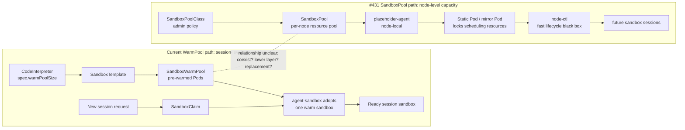
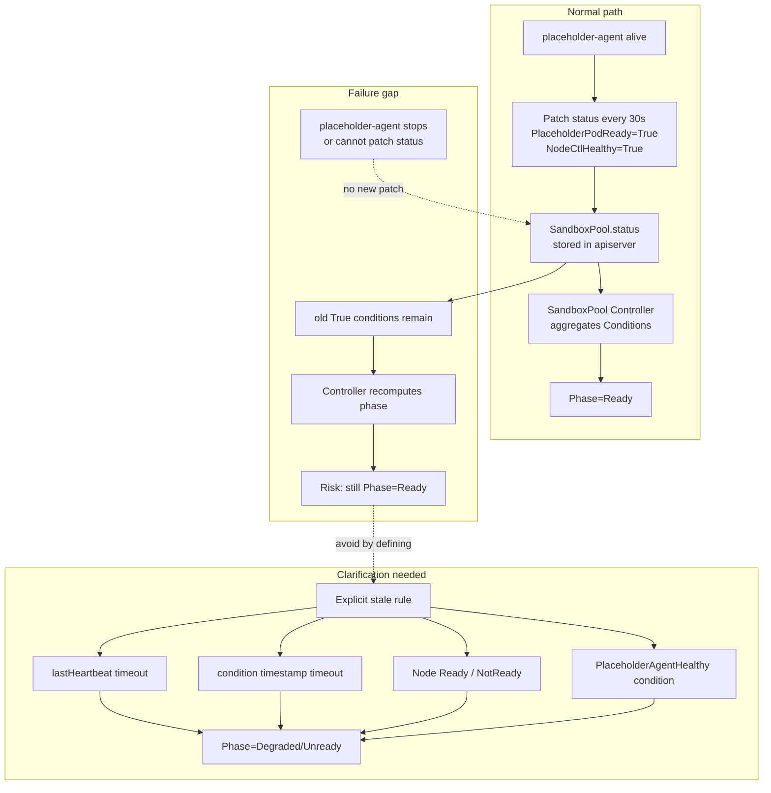

# Day44 SandboxPool PR #431 Comment Drafts

日期：2026-07-09

继续审阅：2026-07-10

目标：持续整理 #431 SandboxPool proposal 的开发视角疑问，给用户审阅，并记录经用户逐字确认后发布的 upstream comment。

目标 PR：

- PR: <https://github.com/volcano-sh/agentcube/pull/431>
- Head observed: `3d1bd0d` (`add sandbox-pool management proposal`, force-pushed 2026-07-12)
- File: `docs/proposals/sandbox-pool-management/README.md`
- Status: open; `@acsoto` 已提出一条真人 MEMBER 架构问题；普通 checks 已通过，仍缺 `lgtm` / `approved`
- Comment rule: upstream-facing text must be English; do not post without explicit user confirmation.

## 总体策略

不要一次性发多条。当前最合适的策略是等待作者处理已经激活的架构问题；每次只选择 1 条有独立证据、未被覆盖且会影响实现契约的 human comment。

2026-07-09 更新：`@acsoto` 作为 MEMBER 新增评论，询问 #431 和现有 `CodeInterpreter.warmPoolSize` / `SandboxTemplate` / `SandboxWarmPool` / `SandboxClaim` 路径的关系：二者是并存的两种模式，还是 SandboxPool 未来成为现有 WarmPool 的底层替代。这是目前第一条真人 maintainer/member 技术问题，权重高于 AI reviewer。

这条新评论不覆盖 Candidate 3 的 stale/unreachable 问题，但会影响发言节奏：社区现在先在确认新旧架构关系，我们如果发 Candidate 3，应保持为一个很短的 inline implementation question，不要扩展成整套架构评论。

2026-07-10 继续审阅结论：Candidate 3 已发出并被 `35d361e` 基本吸收，因此不能继续作为推荐评论。对最新正文和 Kubernetes / containerd 官方契约交叉核对后，发现两个更基础的可实现性问题：

1. Proposal 把 Static Pod 和 Kubernetes 原生 In-place Pod Resize 同时作为 v1alpha1 核心机制，但 Kubernetes KEP-1287 明确把 Static Pod resize 列为 `Infeasible`。
2. Proposal 写成 RuntimeClass handler 会把 kubelet CRI 调用路由到另一个 Unix socket；实际 Kubernetes 契约是把 handler 字符串放进同一个 CRI `RunPodSandbox` 请求，containerd 再按 handler 选择 runtime/shim/sandboxer 配置。若要让 `placeholder-agent` 独立监听 CRI socket，还缺一个明确的 containerd shim、sandboxer proxy 或 CRI proxy 集成层。

> 分析：这两点不是文案偏好，而是会决定 Phase 2/3 是否能按 proposal 实现。它们的优先级高于继续润色 API 字段或测试环境描述。

2026-07-10 作者回复后更新：`lichuqiang` 在 [resize thread](https://github.com/volcano-sh/agentcube/pull/431#discussion_r3557359462) 明确接受 Static Pod manifest 变化会触发 delete-and-recreate，并说明旧文中的 VPA 只是类比。随后提交 `b6a784c fix VPA issue`：

- 把 core design / goal / decision table 改为 `custom CRI interception (VPA analogy)`。
- Update Flow 明确只有 Static Pod rebuild，不走 Kubernetes `/resize`。
- 删除 `InPlacePodVerticalScaling` feature gate 和版本依赖。
- 新增 rebuild 期间的 node-ctl、node-level cgroup、mirror Pod、scheduler/kubelet admission 安全表。

这正面回答了 `SP-01`，不需要在原 thread 继续追问。但新方案把 `custom CRI interception` 变成 Phase 2/3 的核心机制，而正文仍声称 RuntimeClass handler 会让 kubelet 改连 `/run/sandbox-pool/cri.sock`。因此 `SP-02` 不再只是后续实现细节，而是新方案能否接入现有节点 runtime 的前置契约。

> 分析：这是 proposal 作者对自己设计的明确修改，但作者的 GitHub association 是 `NONE`，不能表述成 maintainer consensus。是否接受整个 SandboxPool 方案仍要等 MEMBER/OWNER review。

2026-07-10 `SP-02` 回复后更新：`lichuqiang` 在 [RuntimeClass / CRI thread](https://github.com/volcano-sh/agentcube/pull/431#discussion_r3558484860) 选择了 containerd runtime v2 shim 路径，并提交 `ef96939 fix CRI flow issue`。正文不再声称 RuntimeClass 会让 kubelet 直连第二个 CRI socket，而是明确为 `kubelet -> containerd CRI -> placeholder runtime handler -> placeholder-agent shim v2`；普通 Pod 继续使用 `runc` handler。该 commit 修改 proposal 73 行（+44/-29），同步更新架构图、职责表、RuntimeClass、创建/更新/删除流程、节点启动流程和实现阶段。

这足以解决原评论所问的 integration-layer 选择，`SP-02` 可以标为 `RESOLVED`。但它只证明了高层路由模型已澄清，并没有证明自定义 shim 的生命周期语义可行。新正文仍把 CRI `StopPodSandbox` / `RemovePodSandbox` 写成 shim 可直接处理的回调，同时又在架构图中写 `shim.Delete -> mark stop (does not touch node-ctl)`、删除流程中写 `placeholder-agent shim stops node-ctl`；containerd runtime v2 shim 实际暴露的是 Task API（`Create`、`Start`、`Kill`、`Delete`、`Shutdown` 等），CRI server 才接收 `StopPodSandbox` / `RemovePodSandbox`。该窄问题单独记为 `SP-10`，不重新打开已经解决的 `SP-02`。

> 分析：作者回复和 `ef96939` 是有效的 proposal 改进，但仍然只是作者设计意图，不是 maintainer acceptance。当前普通 checks 全绿，`tide` 仍等待 `lgtm` / `approved`。

2026-07-13 force-push 复审：作者把历史提交压成 `3d1bd0d`，相对 `ef96939` 修改 72 行（+40/-32）。独立 agent heartbeat、optional status pointer、conditions list-map、Pool immutable fields、shim/daemon 分工和 deletion wording 都有实质改进；旧的 CRI/shim method 混用基本消失。当前 11 个 checks 全绿，tide 仍等待 `lgtm` / `approved`，没有真人 maintainer review。

新正文仍有多个未被现有 review 覆盖的实现不变量。本轮已经把其中四个可独立回复的问题作为同一个 `COMMENT` review 发布：containerd Task lifecycle、heartbeat timeout reconcile trigger、force-finalizer 后的 orphan cleanup，以及跨 Class 的 per-node 原子 ownership。`ConditionEverReady` 的 writer/condition contract 仍保留为 `HOLD`，不在这一批继续扩张范围。

## 剩余问题跟踪表

最后同步：2026-07-13；PR head `3d1bd0d`；本表是 #431 后续 review 状态的唯一索引。详细证据和英文草稿仍保留在各 Candidate 小节。

状态约定：

- `POSTED_WAITING`：已发 upstream，等待作者回复，不追加同类评论。
- `READY_LOCAL`：证据和草稿已具备，但尚未获得用户发布确认。
- `HOLD`：问题成立，但当前不适合打断已有架构讨论。
- `NEEDS_EVIDENCE`：只有风险信号，证据未达到评论阈值。
- `HUMAN_THREAD`：已有真人 reviewer 讨论，我们只观察、不重复提问。
- `RESOLVED`：正文或作者 commit 已吸收。

| ID | Priority | Topic | 当前判断 | Coverage / Status | 下一步 |
| --- | --- | --- | --- | --- | --- |
| `SP-01` | P0 | Static Pod 与 native in-place resize | 作者明确选择 Static Pod rebuild + custom CRI interception，不再依赖 native `/resize`；设计歧义已解决，runtime guarantee 尚未实测 | `RESOLVED`；[comment](https://github.com/volcano-sh/agentcube/pull/431#discussion_r3556111395)、[reply](https://github.com/volcano-sh/agentcube/pull/431#discussion_r3557359462)、`b6a784c` | 不在原 thread 追评；custom CRI integration 归入 `SP-02`，rebuild-window e2e 归入 `SP-08` |
| `SP-02` | P0 | RuntimeClass / CRI socket integration | 作者选择 containerd runtime v2 shim；正文已改为 kubelet 保持连接 containerd，由 `placeholder` handler 选择 placeholder-agent shim，普通 Pod 继续走 `runc` | `RESOLVED`；[comment](https://github.com/volcano-sh/agentcube/pull/431#discussion_r3557686951)、[reply](https://github.com/volcano-sh/agentcube/pull/431#discussion_r3558484860)、`ef96939`；Candidate 1 | 不在原 thread 追评；Task API lifecycle 精度转入 `SP-10`，real-node acceptance 仍归 `SP-08` |
| `SP-03` | P2 | placeholder-agent heartbeat signal | `3d1bd0d` 已增加独立 `status.placeholderAgent.lastHeartbeat`，不再混用 node-ctl heartbeat | `RESOLVED`；Candidate 3 follow-up | 不重复；超时如何触发 reconcile 另记 `SP-11` |
| `SP-04` | P2 | Phase recovery 条件 | `c2f2502` 仍允许 `PlaceholderAgentHealthy=True -> Ready`，没有重新检查 Pod、node-ctl、ResourceSynced | `POSTED_WAITING`；[follow-up](https://github.com/volcano-sh/agentcube/pull/431#discussion_r3578213530) | 等作者把 agent recovery 改成完整条件重算；不把单一健康信号当 Ready predicate |
| `SP-05` | P1 | force-finalizer 后 orphan manifest | `c2f2502` 已加 startup scan，解决 deletion event 不重放；但“按 UID GET”、NotFound 删除和“only UID mismatch”互相冲突，API failure 行为未定义 | `POSTED_WAITING`；[original](https://github.com/volcano-sh/agentcube/pull/431#discussion_r3567680819)、[follow-up](https://github.com/volcano-sh/agentcube/pull/431#discussion_r3578213539) | 等作者定义 GET-by-name + UID compare，并区分 NotFound、mismatch、transient/Forbidden |
| `SP-06` | P2 | per-node RBAC isolation | `c2f2502` 明确每个 host agent 使用可 patch 全部 SandboxPool status 的 ClusterRole；node filter 仍只是客户端约定 | `POSTED_WAITING`；[comment](https://github.com/volcano-sh/agentcube/pull/431#discussion_r3578213534) | 等作者定义 authenticated node 到 `spec.nodeName` 的服务端写边界或 controller-owned aggregation |
| `SP-07` | P3 | 与现有 WarmPool 路径的关系 | 作者口头说明 two-generation architecture，但正文尚未形成 Relationship / Compatibility contract | `HUMAN_THREAD`；`@acsoto` 已提问并获作者回复 | 不抢答；观察作者是否补正文、迁移/并存边界 |
| `SP-08` | P3 | node-local validation environment | envtest 无法覆盖 systemd、Static Pod、RuntimeClass、CRI socket、cgroup、mirror rebuild，也不能证明 mirror gap 中冲突 Pod 会被 kubelet admission 拒绝 | `HOLD`；Candidate 5 | Phase 2/3 实现前要求 real-node/dedicated e2e，覆盖 rebuild 时 UID/mirror gap、conflicting Pod admit failure 和 node-ctl cgroup continuity |
| `SP-09` | P2 | agent unreachable 后 stale Ready | 原正文没有 agent stale detection，旧 True conditions 可能长期保留 | `RESOLVED`；[comment](https://github.com/volcano-sh/agentcube/pull/431#discussion_r3549854078)，`35d361e` 已增加 `PlaceholderAgentHealthy` | 不重复；只跟踪 `SP-03` / `SP-04` 的后续精度问题 |
| `SP-10` | P1 | containerd shim Task lifecycle contract | `3d1bd0d` 已移除大部分 CRI/shim method 混用，并把 node-ctl stop 放回 daemon 的 Pool deletion path；但 no-workload-process shim 仍需满足 Task `Create/Start/State/Wait/Kill/Delete/Shutdown`、PID 和 exit contract | `POSTED_WAITING`；[comment](https://github.com/volcano-sh/agentcube/pull/431#discussion_r3567680814)；containerd main `ba01536` Task v2 proto 已复核 | 等待作者定义虚拟 task/process、PID、Wait/exit 和 reconnect contract；不先替作者假设实现 |
| `SP-11` | P1 | heartbeat timeout reconcile trigger | `c2f2502` 增加 heartbeat-expiry `RequeueAfter` 和 30s full Pool sweep，并补无事件 fault-injection test | `RESOLVED`；[comment](https://github.com/volcano-sh/agentcube/pull/431#discussion_r3567680816)、`c2f2502` | 实现时验证 leader switch/restart 不丢 timer；proposal thread 不重复 |
| `SP-12` | P1 | per-node Class uniqueness race | `c2f2502` 改为稳定 `placeholder-{node}` 名，两个 Class 争用同一 API object，由 create conflict 保证同一时刻最多一个 Pool | `RESOLVED`；[comment](https://github.com/volcano-sh/agentcube/pull/431#discussion_r3567680822)、`c2f2502` | 实现时补 concurrent create + deterministic loser convergence test；proposal thread 不重复 |
| `SP-13` | P2 | EverReady state source | Phase priority 依赖 never/was Ready，risk table 声称 sticky `ConditionEverReady` 已实现，但 Condition Definitions 未列 writer、初始化、持久语义 | `HOLD`；暂无独立 Candidate | 可与 `SP-04` 一起在作者再次修改状态机时核对，不单独发 |
| `SP-14` | P1 | Deferred downscale reservation ordering | manifest-first downscale 会先降低 kubelet/scheduler request；watermark 返回 Deferred 时 node-ctl 仍保留旧 allocation，资源锁定出现重叠 | `POSTED_WAITING`；[comment](https://github.com/volcano-sh/agentcube/pull/431#discussion_r3578213523) | 等作者定义 asymmetric desired/applied staging，并保留 Deferred 的 last-applied reservation |
| `SP-15` | P2 | Static Pod priority API | `PriorityClassName` 对 Static Pod 不生效；节点压力保护需要 manifest 直接设置 numeric `priority` | `POSTED_WAITING`；[comment](https://github.com/volcano-sh/agentcube/pull/431#discussion_r3578213525) | 等作者改为 `Priority *int32` 或固定 node-critical numeric priority |

### 已有覆盖，不重复评论

| Topic | Existing coverage | 处理原则 |
| --- | --- | --- |
| `nodeCtlEndpoint` source of truth | [Copilot](https://github.com/volcano-sh/agentcube/pull/431#discussion_r3549383909) | 等作者改正文，不重复 |
| SSA multi-writer Conditions schema | [Copilot](https://github.com/volcano-sh/agentcube/pull/431#discussion_r3549383877) | 应使用 list-map-by-type；不重复 |
| non-pointer struct + `omitempty` | Copilot [template](https://github.com/volcano-sh/agentcube/pull/431#discussion_r3550185924) / [nodeCtl](https://github.com/volcano-sh/agentcube/pull/431#discussion_r3550185961) / [status](https://github.com/volcano-sh/agentcube/pull/431#discussion_r3550185995) | 不重复 |
| mirror Pod `<5s` rebuild guarantee | [Copilot](https://github.com/volcano-sh/agentcube/pull/431#discussion_r3549383770) | 等实测或正文降级为 target |
| `pause:3.9` 与 no-process/no-cgroup | Copilot [line 113](https://github.com/volcano-sh/agentcube/pull/431#discussion_r3549383825) / [line 126](https://github.com/volcano-sh/agentcube/pull/431#discussion_r3549383854)，`ef96939` 后又在 [line 125](https://github.com/volcano-sh/agentcube/pull/431#discussion_r3558496149) / [line 139](https://github.com/volcano-sh/agentcube/pull/431#discussion_r3558496179) 精确重提 | 不重复表面措辞；Task lifecycle / no-process 可行性归 `SP-10`，real-node acceptance 归 `SP-08` |

> 分析：proposal 已经回答了 Implementation Plan、v1alpha1 scope、Non-Goals、component responsibility、phase/conditions、creation/update/deletion flow、RBAC/webhook/version/test plan 的大框架。评论应避免重复问这些已经存在的内容。

## 新评论通俗解释：WarmPool 和 SandboxPool 到底差在哪

`@acsoto` 问的是：AgentCube 现在已经有一个 WarmPool 机制，为什么还要一个 SandboxPool？这两个 pool 是两套模式并存，还是 SandboxPool 以后会成为 WarmPool 的底座？

通俗理解：

- 现有 **WarmPool** 是“提前做好几间可直接入住的房间”。`CodeInterpreter.warmPoolSize=2` 就让系统提前创建 2 个 session-level sandbox pod。用户请求来时，用 `SandboxClaim` 认领一个已经热好的 sandbox。
- 新 proposal 的 **SandboxPool** 更像“先在楼里划出一片面积和水电容量”。它不直接表示一个可用 session，而是 node-level 资源池：先锁住 CPU/memory，再让后续 fast path / node-ctl 在这块资源里快速创建 sandbox。
- 所以 WarmPool 是 **session 级预热池**；SandboxPool 是 **node 级资源容量池**。二者不在同一层。

当前 proposal 说它只做 slow resource track，不做 create/suspend/resume/delete；这暗示 SandboxPool 不是 WarmPool 的直接替代品。但它也可能成为未来 fast path 的下层资源来源。这个关系 proposal 没有明确写，所以 maintainer 在问。



> 分析：这条 maintainer comment 是更高层的 product / architecture boundary 问题。它适合由 proposal 作者回答，不适合我们抢答。我们可以先观察作者是否补 “Relationship with existing WarmPool” 小节。

## Candidate 1: Node-side RuntimeClass / CRI integration contract

建议状态：在 `b6a784c` 后提升为 P0。已有 Copilot comments 只覆盖 no-process/no-cgroup 和 VPA 残留措辞，没有覆盖 RuntimeClass handler 如何连接到独立 CRI socket 这个更基础的集成契约。

### Evidence

Proposal evidence:

- Head `b6a784c` lines 44/60/118: resource adjustment is now explicitly `custom CRI interception (VPA analogy)` and no longer uses native in-place resize.
- Lines 112-113: design table says the placeholder uses Static Pod, and execution mode says no actual process / skip cgroup.
- Lines 124-126: responsibility matrix says placeholder-agent is CRI handler; Static Pod routes CRI calls through RuntimeClass and claims no actual process / no cgroup.
- Lines 174-181: placeholder pod template says the manifest uses `pause:3.9` as placeholder image, while placeholder-agent runs as host-level systemd.
- Lines 364-378: RuntimeClass `placeholder` routes CRI calls to placeholder-agent socket `/run/sandbox-pool/cri.sock`.
- Lines 446-452: creation flow says the CRI server responds to `RunPodSandbox`, `CreateContainer`, and `StartContainer`.
- Lines 552 and 566: `PlaceholderPodReady` means CRI sandbox READY; label `sandbox-pool.io/skip-cgroup` is defined as a skip-cgroup flag.

Existing review evidence:

- Copilot comment at line 113: <https://github.com/volcano-sh/agentcube/pull/431#discussion_r3549383825>
- Copilot comment at line 126: <https://github.com/volcano-sh/agentcube/pull/431#discussion_r3549383854>
- Author reply at line 113: <https://github.com/volcano-sh/agentcube/pull/431#discussion_r3549422712>
- Author reply at line 126: <https://github.com/volcano-sh/agentcube/pull/431#discussion_r3549430177>

Official contract evidence:

- Kubernetes RuntimeClass 文档说明 handler 标识节点 CRI 实现中预先配置的一套 runtime configuration；containerd 对应配置位于 `containerd.runtimes.${HANDLER_NAME}`：<https://kubernetes.io/docs/concepts/containers/runtime-class/>
- Kubernetes v1.36.2 kubelet 先解析 `runtimeHandler`，然后仍通过已有的 `runtimeService.RunPodSandbox(..., runtimeHandler)` 发出请求：<https://github.com/kubernetes/kubernetes/blob/v1.36.2/pkg/kubelet/kuberuntime/kuberuntime_sandbox.go#L56-L68>
- CRI v1 把 handler 定义为 `RunPodSandboxRequest.runtime_handler` 字段，而不是另一个 endpoint：<https://github.com/kubernetes/cri-api/blob/v0.34.1/pkg/apis/runtime/v1/api.proto#L515-L524>
- containerd 的 handler 配置选择 `runtime_type` / `runtime_path`；containerd 2.x 还可通过 `sandboxer` 接入 shim 或 sandbox proxy，但这些接口不等于让 kubelet 直接切换到另一个完整 CRI socket：<https://github.com/containerd/containerd/blob/main/docs/cri/config.md#runtime-classes>

### Why It Matters

如果 v1 创建普通 PodSandbox / pause / cgroup，那么测试要验证的是 no workload container、resource requests、Ready、resize、eviction、metrics 是否一致。如果 v1 走自定义 containerd runtime shim / sandboxer 并跳过 cgroup，那么测试要验证的是 kubelet / scheduler / mirror Pod / metrics 在没有普通 cgroup 时是否仍能表达资源锁。

当前文本把 `RuntimeClass handler` 和独立 `CRI endpoint` 当成同一件事。除非节点把 kubelet 的全局 CRI endpoint 指到一个能按 handler 转发的代理，否则 RuntimeClass 本身不会让 kubelet 针对单个 Pod 改连 `/run/sandbox-pool/cri.sock`。这会直接改变 placeholder-agent 需要实现的接口：完整 CRI server、containerd runtime v2 shim / sandboxer integration，或 CRI dispatch proxy。

### Draft Comment

Proposed inline target:

- PR: `volcano-sh/agentcube#431`
- Head: `b6a784cb1418edde3a323e1a593f35e8f1a6d6ec`
- File: `docs/proposals/sandbox-pool-management/README.md`
- Right-side line: `378`
- Target text: `kubelet routes CRI calls to placeholder-agent's Socket ... based on the RuntimeClass handler name.`
- Nature: implementation-contract question; not a formal blocking review
- Duplicate check: latest 38 review comments contain no `RuntimeClass` / `runtime_handler` / second-CRI-endpoint discussion

Publication record:

- Published after the user confirmed the exact target and body on 2026-07-10.
- Comment: <https://github.com/volcano-sh/agentcube/pull/431#discussion_r3557686951>
- GitHub review comment ID: `3557686951`
- Server-side verification: body, commit ID, path, right-side line `378`, and side all match the approved payload.
- Current state: `RESOLVED`; author selected the containerd runtime v2 shim path in [reply `3558484860`](https://github.com/volcano-sh/agentcube/pull/431#discussion_r3558484860), and `ef96939` updated the architecture and lifecycle text. Do not append a courtesy reply; narrower Task API lifecycle questions are tracked separately as `SP-10`.

```md
I have one question about the node-side RuntimeClass / CRI integration contract.

The updated proposal makes custom CRI interception part of the resource-adjustment path. It also says that kubelet routes CRI calls to `/run/sandbox-pool/cri.sock` based on the `placeholder` RuntimeClass handler, with `placeholder-agent` implementing the CRI server.

In [kubelet v1.36.2](https://github.com/kubernetes/kubernetes/blob/v1.36.2/pkg/kubelet/kuberuntime/kuberuntime_sandbox.go#L56-L68), RuntimeClass is resolved to a `runtimeHandler` and passed to the already configured `runtimeService.RunPodSandbox(...)`; it does not select a second CRI endpoint. With containerd, the handler selects a configured runtime/shim (or sandboxer integration) behind the same CRI service.

Could the proposal specify the missing integration layer between the `placeholder` handler and `placeholder-agent`?

- Is `placeholder-agent` intended to integrate as a containerd runtime v2 shim / sandboxer?
- Is there a CRI proxy in front of containerd that dispatches by `runtime_handler`?
- Or is the node-wide kubelet CRI endpoint expected to point directly to `placeholder-agent`, with normal workloads forwarded elsewhere?

This determines which API `placeholder-agent` must implement, how normal Pods continue to use the default runtime, and whether the proposed per-Pod routing can work without replacing the node's CRI path.
```

## Candidate 2: node-ctl endpoint source of truth

建议状态：暂不发。Copilot 已经精准覆盖；除非作者更新后仍没有改正文，再考虑简短跟进。

### Evidence

Proposal evidence:

- Lines 164-166: `SandboxPoolClassSpec.NodeCtlEndpoint` exists, but comment says placeholder-agent does not read it and obtains the address via `--node-ctl-socket`.
- Lines 214-216 and 234-236: `SandboxPoolSpec.NodeCtl.Endpoint` also exists.
- Lines 37-45 and 58-64: proposal describes declarative CRD APIs and declarative synchronization as goals/core design.
- Lines 124-127: placeholder-agent is the sole party interacting with node-ctl.

Existing review evidence:

- Copilot comment at line 166: <https://github.com/volcano-sh/agentcube/pull/431#discussion_r3549383909>

### Why It Matters

如果 endpoint 字段是 declarative source of truth，placeholder-agent 必须 watch/reconcile 它；如果 endpoint 只是 reserved/informational，v1alpha1 暴露它会让用户误以为修改 CRD 能改变节点行为。实现时这会影响 validation、reconcile、upgrade 和 troubleshooting。

### Draft Comment

```md
One source-of-truth question about `node-ctl` endpoint configuration:

The proposal exposes `spec.nodeCtlEndpoint` / `spec.nodeCtl.endpoint`, but the `SandboxPoolClassSpec` comment says `placeholder-agent` does not read this field and instead uses its local `--node-ctl-socket` startup parameter.

Could the proposal clarify whether the CRD endpoint is authoritative in v1alpha1, or only reserved/informational?

If it is authoritative, the implementation needs a reconciliation rule for endpoint changes. If it is not authoritative, it may be clearer to omit it from the v1alpha1 API or document it as a status/configuration hint to avoid a second source of truth.
```

## Candidate 3: stale / unreachable placeholder-agent semantics

建议状态：原问题已完成并关闭。它在 2026-07-09 是最推荐项，现已发出且被 `35d361e` 吸收，不应重复评论。

2026-07-09 已按用户确认发为 inline comment：

- Target: `docs/proposals/sandbox-pool-management/README.md:604`
- URL: <https://github.com/volcano-sh/agentcube/pull/431#discussion_r3549854078>
- Nature: clarification question, not a blocking concern

2026-07-09 follow-up：作者推送了 `35d361e fix stale state issue`，随后在这条 inline thread 回复 `Good suggestion. Updated related content`（<https://github.com/volcano-sh/agentcube/pull/431#discussion_r3550260383>）。这次修改基本正面回答了问题：

- Status writer table 改为 controller owns `NodeNotFound, PlaceholderAgentHealthy`；placeholder-agent owns non-`NodeNotFound/PlaceholderAgentHealthy` conditions。
- Explanation 增加：当 node 被删除时 controller 用 `NodeNotFound`；当 node 仍存在但 agent crash 时，controller 检测 stale `NodeCtl.LastHeartbeat` `> 2min`，设置 `PlaceholderAgentHealthy=False`，把 Phase 降级到 `Degraded/Unready`。
- Condition table 新增 `PlaceholderAgentHealthy`，writer 是 `sandboxpool-controller`。
- Risk table 把原先 “NodeNotFound / Node NotReady indirectly covering” 改成 “Controller detects agent heartbeat staleness via `PlaceholderAgentHealthy` Condition”。

当前判断：我们的 comment 已被正文吸收，不需要追问同一个问题。剩余可观察的小点是 Phase transition table 里 `PlaceholderAgentHealthy=True → Ready` 写得偏宽，可能会被理解成 agent 恢复即可 Ready，而不是重新同时检查 `PlaceholderPodReady` / `NodeCtlHealthy` / `ResourceSynced`。不过 Phase Computation Priority 最后仍有全量优先级，暂时不建议马上追加评论。

### 2026-07-10 Follow-up: heartbeat signal is still conflated

`35d361e` 解决了“controller 是否负责 stale detection”，但新正文选择 `NodeCtl.LastHeartbeat` 作为 `PlaceholderAgentHealthy` 的依据，仍存在语义混用：

- `NodeCtlStatus.LastHeartbeat` 位于 `status.nodeCtl`，自然表达的是 placeholder-agent 最后一次成功探测 node-ctl 的时间。
- `NodeCtlHealthy` 已经用来表达 node-ctl 是否可达。
- 如果 placeholder-agent 正常运行但 node-ctl 挂掉，`NodeCtl.LastHeartbeat` 同样会超过 2 分钟，controller 会把 `PlaceholderAgentHealthy=False`，把 node-ctl 故障误报为 agent 故障。
- 如果目标是判断 placeholder-agent 是否还在成功 patch API，应使用每次 status report 都更新的独立 agent heartbeat，例如 `status.placeholderAgent.lastHeartbeat`；`metav1.Condition.lastTransitionTime` 不能替代周期心跳，因为状态不变化时它不应刷新。

建议状态：保留为 P2 follow-up，不立即追在刚解决的 thread 后继续发。若作者准备实现 Phase controller，再用一条独立短评论问清 signal source。

Draft follow-up:

```md
Thanks for adding the controller-owned `PlaceholderAgentHealthy` condition. I have one follow-up question about its signal source.

The current text derives agent health from `status.nodeCtl.lastHeartbeat`. If `placeholder-agent` is still reporting normally but node-ctl is down, that timestamp would also become stale, so the controller could set both `NodeCtlHealthy=False` and `PlaceholderAgentHealthy=False` even though the agent itself is alive.

Would it be clearer to give `status.placeholderAgent` its own report heartbeat, updated on every periodic status patch, and reserve `status.nodeCtl.lastHeartbeat` for node-ctl reachability? That would let the phase logic distinguish an agent/reporting failure from a node-ctl failure and make the two fault-injection cases independently testable.
```

通俗解释：proposal 里说 placeholder-agent 每 30 秒向 Kubernetes 汇报一次“我这边 OK，node-ctl 也健康”。Controller 根据这些汇报算出 `SandboxPool.status.phase=Ready/Degraded/Unready`。问题是：如果 placeholder-agent 挂了，最后一次汇报的 “OK” 还留在 API server 里。Controller 如果只看旧值，就可能继续认为 Pool 是 Ready。

我们要问的不是“你没写健康检查”，而是更精确的 contract：

- placeholder-agent 停止上报后，Controller 什么时候认为状态 stale？
- 是看 `lastHeartbeat` 超时、condition timestamp 超时、Node Ready 状态，还是新增 `PlaceholderAgentHealthy` condition？
- 这条规则由谁写入 status，placeholder-agent 还是 controller？



### Evidence

Proposal evidence:

- Lines 131-138: placeholder-agent owns node-local status fields and non-`NodeNotFound` conditions; controller owns `phase` and `NodeNotFound`.
- Lines 135-136: placeholder-agent patches status every 30s; controller patches phase during reconcile.
- Lines 394-430: Phase is computed from conditions; `NodeCtlHealthy=False` and `PlaceholderPodReady=False` drive Degraded/Unready transitions.
- Lines 552-557: condition definitions include `PlaceholderPodReady`, `ResourceSynced`, `NodeCtlHealthy`, resize conditions, and `NodeNotFound`; no explicit `PlaceholderAgentHealthy` or stale heartbeat condition.
- Lines 603-604: risk table says stale condition values when placeholder-agent is unreachable may delay Phase, and mitigation relies on `NodeNotFound` or Node becoming NotReady indirectly.
- Lines 611-615: test plan includes phase computation, fault injection for API server disconnect, node deletion, and agent restart.

Gap:

- If the Kubernetes Node object still exists but placeholder-agent is stopped, cannot reach apiserver, or cannot patch status, the last written `PlaceholderPodReady=True` / `NodeCtlHealthy=True` may remain stale.
- `NodeNotFound` only covers deleted nodes. Node NotReady is mentioned in the risk table but not modeled as a condition or phase input.

### Why It Matters

这个问题会影响 controller 代码如何避免 stale Ready。实现者需要知道 Phase aggregation 是否应 look at `lastHeartbeat` / condition timestamps / `lastAppliedGeneration` / Node readiness / a new controller-owned condition。否则 Ready 状态可能在 agent 挂掉后长期不变。

### Draft Comment

```md
I have one question about stale status when `placeholder-agent` becomes unreachable.

My reading is that `placeholder-agent` owns the node-local conditions and patches status every 30s, while the controller owns `phase` and `NodeNotFound`. The risk table also notes that conditions may get stuck when `placeholder-agent` is unreachable, with `NodeNotFound` or Node NotReady indirectly covering some cases.

Could the proposal make the stale-status rule explicit for the case where the Kubernetes Node still exists, but `placeholder-agent` has stopped or can no longer patch status?

For example, should the controller derive Unready/Degraded from a `lastHeartbeat` timeout, Node readiness, condition timestamps, or a separate controller-owned `PlaceholderAgentHealthy` condition?

Why this matters: without an explicit stale-status rule, `PlaceholderPodReady=True` / `NodeCtlHealthy=True` values written by the last successful agent heartbeat could keep the pool looking Ready even after the node-local agent is no longer managing the placeholder pod or node-ctl.
```

## Candidate 4: resize fallback and Kubernetes compatibility

建议状态：提升为 P0，也是当前最推荐保留的一条候选评论。官方 KEP 表明这不是一般的 feature-gate fallback 问题，而是 Static Pod 与 Kubernetes 原生 In-place Pod Resize 当前不兼容。

### Evidence

Proposal evidence:

- Lines 44 and 60: VPA InPlaceResize is a core design/goal and should adjust resources without rebuilding Pods.
- Line 118: resource adjustment method is VPA InPlaceResize.
- Lines 456-475: update flow says kubelet detects manifest change and performs `InPlace resize / Pod rebuild`, then placeholder-agent calls `UpdateContainerResources`.
- Lines 590-597: version table says VPA InPlaceResize is 1.27 Alpha / 1.31 GA and depends on `InPlacePodVerticalScaling`.
- Lines 613-615: test plan includes placeholder pod resize lifecycle and VPA resize tests.
- Lines 631-639: implementation plan includes VPA resize in Phase 3 and v1alpha1 scope includes VPA resize.

Official Kubernetes evidence:

- Kubernetes KEP-1287 的 `PodResizePending/Infeasible` 原因明确包含 “The pod is a static pod”：<https://github.com/kubernetes/enhancements/blob/master/keps/sig-node/1287-in-place-update-pod-resources/README.md#resize-status>
- 同一个 KEP 的 metrics 原因列表也包含 `static_pod - In-place resize is not supported for static pods`。
- KEP metadata 记录的成熟度是 v1.27 alpha、v1.33 beta、v1.35 stable，不是 proposal 兼容表中的 v1.31 GA：<https://github.com/kubernetes/enhancements/blob/master/keps/sig-node/1287-in-place-update-pod-resources/kep.yaml>
- 2026-07-10 用户确认版本语义：Kubernetes 当前官方 stable channel 是 `v1.36.2`，而 KEP 的 `stable: v1.35` 表示该 feature 从 v1.35 开始毕业为 stable，不是在声明当前最新 Kubernetes 版本。评论里的 milestone 表述正确，无需修改；proposal 的 `1.31 GA` 仍与 KEP 不符。
- Kubernetes 官方任务文档说明标准触发路径是修改 Pod desired resources 并调用 `/resize` subresource：<https://kubernetes.io/docs/tasks/configure-pod-container/resize-container-resources/>
- Static Pod 的 source of truth 是节点本地 manifest，API server 中只有 kubelet 维护的 mirror Pod：<https://kubernetes.io/docs/tasks/configure-pod-container/static-pod/>

2026-07-10 原因补证：

- Kubernetes Static Pod 文档明确说 mirror Pod 只让节点上的 Pod 在 API Server 可见，`cannot be controlled from there`。因此标准 `/resize` 对 API Pod spec 的更新不能成为本地 Static Pod 的 source of truth。
- Kubernetes v1.36.2 `pkg/kubelet/config/common.go:60-92` 显示：当 Static Pod manifest 未显式提供 UID 时，kubelet 对整个 Pod 内容和文件来源做 hash，并将 hash 作为 Pod UID / `kubernetes.io/config.hash`。修改 CPU/memory 会改变 Pod 内容，从而产生新的 UID。
- kubelet 的 static-pod worker 按 full name 串行处理不同 UID；旧 UID 终止清理完成后，新 UID 才能启动。这对应 replacement/rebuild，而不是同一 Pod UID 下的原地 resize。
- 所以 #431 不是整体不可用：Class→Pool、固定容量的 Static Pod resource reservation、status/phase 等仍可独立实现；冲突集中在 Phase 3 和 v1alpha1 声称的 no-rebuild resize。若选择 rebuild，需要定义 replacement window；若选择 custom runtime resize，需要另外证明 Kubernetes-visible requests、mirror state 与 node-ctl actual limits 的一致性。

Gap:

- Proposal 同时把 Static Pod resource lock 与不重建 Pod 的 InPlaceResize 列为 v1alpha1 core scope，但 KEP 明确不支持 Static Pod in-place resize。
- 修改 Static Pod 本地 manifest 不等于调用 API server 的 `/resize` subresource；kubelet 可能把 manifest 变化作为 Pod replacement，而不是原生 in-place resize。
- Update flow 把 `InPlace resize / Pod rebuild` 并列，没有定义哪一个才是规范行为，也没有解释 rebuild 窗口如何维持 scheduler resource lock。
- `VPA InPlaceResize` 这一术语混合了 VPA controller 与 Kubernetes `InPlacePodVerticalScaling` API/feature gate；正文没有说明是否真的部署或依赖 VPA。
- 兼容性表的 GA 版本错误，会让实现者和部署者错误估计 feature gate / cluster prerequisite。

### Why It Matters

如果坚持 Static Pod，native in-place resize 不能作为 v1alpha1 已成立的能力，需要明确接受 rebuild，或提出并验证一条不同于 KEP-1287 `/resize` 的自定义 runtime mechanism。如果坚持原生 in-place resize，则 placeholder resource 的 Kubernetes object model 可能不能继续选 Static Pod。这个选择会反过来改变 resource-lock guarantee、API compatibility 和整个 Phase 3 test plan。

### Draft Comment

`Proposed inline target`: `docs/proposals/sandbox-pool-management/README.md:598` at head `35d361e` (right side).

2026-07-10 已按用户确认发布：

- URL: <https://github.com/volcano-sh/agentcube/pull/431#discussion_r3556111395>
- GitHub review comment ID: `3556111395`
- Nature: compatibility clarification with implementation-blocking evidence; not a formal blocking review
- Verification: GitHub returned path line 598 and commit `35d361eb55a283ee8718a94b38b6ad8a1d44ee93`; posted body matches the approved draft below

```md
I think the compatibility assumption here needs clarification because the proposal combines two behaviors that the native Kubernetes resize path does not currently support together.

The proposal makes both Static Pod resource locking and no-rebuild `VPA InPlaceResize` part of the v1alpha1 core scope. However, Kubernetes [KEP-1287](https://github.com/kubernetes/enhancements/blob/481e3710995d9996e27c7364b14d9ab870b65e74/keps/sig-node/1287-in-place-update-pod-resources/README.md#L332-L336) explicitly lists "The pod is a static pod" as an `Infeasible` in-place resize case. Its [metadata](https://github.com/kubernetes/enhancements/blob/481e3710995d9996e27c7364b14d9ab870b65e74/keps/sig-node/1287-in-place-update-pod-resources/kep.yaml#L35-L42) records v1.27 alpha, v1.33 beta, and v1.35 stable, rather than v1.31 GA.

Could the proposal clarify which mechanism Phase 3 intends to use?

- Native Kubernetes `/resize`: Static Pods are unsupported.
- Local Static Pod manifest update: if kubelet rebuilds the Pod, this is not a no-rebuild resize, and the resource-locking behavior during replacement needs to be defined.
- A custom `placeholder-agent` / runtime path: could the proposal describe how Kubernetes-visible requests, mirror Pod state, and node-ctl's actual limits remain consistent, instead of treating it as the native `InPlacePodVerticalScaling` path?

This distinction changes the compatibility table, implementation contract, and e2e acceptance criteria.
```

### 2026-07-10 Author Reply and Resolution

作者回复：<https://github.com/volcano-sh/agentcube/pull/431#discussion_r3557359462>

作者提交：`b6a784c fix VPA issue`

作者选择的是一个组合路径：

1. **Kubernetes-visible reservation**：修改节点本地 Static Pod manifest，接受 kubelet delete-and-recreate；不使用 `/resize`。
2. **Actual sandbox capacity**：node-ctl 的 node-level cgroup 在 placeholder rebuild 期间保持运行，并通过 custom CRI interception 接收新 policy。
3. **Scheduler safety**：mirror Pod 在 API Server 中有短暂删除窗口；proposal 不依赖这一窗口内的 scheduler cache，而依赖 kubelet local podManager/admission 拒绝冲突 Pod。

这已经满足原评论要求的机制选择、compatibility table 修正和 rebuild-window 说明，因此 `SP-01` 状态改为 `RESOLVED`。同一 thread 不需要再回复。

仍需区分两件事：

- 原生 Static Pod `/resize` 兼容性问题已解决。
- custom CRI interception 如何通过 RuntimeClass 接入仍未解决，转入独立 `SP-02`。

正文还残留 `VPA resize tests`、Phase 3 `VPA resize`、v1alpha1 `VPA resize` 和 PR body 的 `VPA InPlaceResize` 表述；Copilot 已在 `b6a784c` 上直接指出这些术语一致性问题，不重复发 human comment。

## Candidate 5: validation environment for node-local behavior

建议状态：不要单独发太早。可以并入 Candidate 4；如果 maintainer 要求 implementation confidence，再作为 validation-plan comment。

### Evidence

Proposal evidence:

- Lines 95-105: architecture includes host-level placeholder-agent, Static Pod, node-ctl, and Unix socket communication.
- Lines 124-126: placeholder-agent includes CRI handler and manifest management; Static Pod routes CRI calls through RuntimeClass.
- Lines 378 and 512-520: kubelet routes CRI calls to `/run/sandbox-pool/cri.sock` and container runtime must find the handler config.
- Lines 509-514: node startup assumes placeholder-agent binary is pre-installed and started as systemd.
- Lines 559-567: labels/annotations include skip-cgroup and manifest hash.
- Lines 611-615: test plan lists unit/integration/e2e/fault/VPA tests but does not state the minimum environment.

Gap:

- envtest can cover API/controller logic but not kubelet, RuntimeClass handler, Static Pod mirror behavior, CRI socket routing, systemd, or cgroup/skip-cgroup behavior.
- Standard CI may not have a custom runtime handler or host-level systemd install path.

### Why It Matters

Without a concrete validation environment, code review may merge a controller/API implementation while the most important node-local assumptions remain untested. This proposal’s highest-risk claims are not pure controller logic.

### Draft Comment

```md
Could the validation plan also name the minimum environment needed for the node-local parts of this proposal?

The current test plan lists unit, integration, e2e, fault injection, and VPA resize tests, which is helpful. The node-side design also depends on host-level `placeholder-agent`, Static Pod manifest management, RuntimeClass handler registration, CRI socket routing to `/run/sandbox-pool/cri.sock`, and the skip-cgroup/resource-accounting behavior.

Could the proposal clarify which of these can be covered by envtest/controller tests, and which require a real node or dedicated e2e environment with the custom runtime handler installed?

This would help set the acceptance criteria for the risky parts of the proposal, especially resource accounting, mirror pod rebuild, `UpdateContainerResources`, and cleanup behavior.
```

## Candidate 6: Phase recovery must re-evaluate all Ready conditions

建议状态：P2，属于 `35d361e` 为修复 stale agent 状态而新引入的状态机文本不一致。先记录，不和 P0/P1 一起形成 omnibus comment。

### Evidence

- Current line 445 defines `Ready` as `PlaceholderPodReady=True + NodeCtlHealthy=True + ResourceSynced=True (or ResizeDeferred=True)`.
- Current line 446 says a `Degraded` Pool exits via `PlaceholderAgentHealthy=True -> Ready` without requiring `NodeCtlHealthy` or `ResourceSynced`.
- Current line 447 says an `Unready` Pool exits via `PlaceholderAgentHealthy=True -> Ready` without requiring `PlaceholderPodReady` or `NodeCtlHealthy`.
- Current line 449's Phase Computation Priority implies all higher-priority unhealthy conditions must be evaluated before the fallback `Ready` state.
- Existing Gemini/Copilot review already required `NodeNotFound=False` to “re-evaluate all conditions”; `35d361e` correctly changed that branch but did not apply the same rule to `PlaceholderAgentHealthy=True`.

### Why It Matters

如果 controller 逐字实现 Phase table，agent 心跳恢复就可能把仍然 `NodeCtlHealthy=False`、`PlaceholderPodReady=False` 或 `ResourceSynced=False` 的 Pool 提前标为 Ready。若实现者按 line 430 的 priority function，则表格又与真实实现不一致。Proposal 应保持单一状态机 contract。

### Draft Comment

```md
One small state-machine follow-up on the new `PlaceholderAgentHealthy` condition:

The Degraded and Unready rows currently allow `PlaceholderAgentHealthy=True -> Ready`. Agent recovery alone does not necessarily mean that `PlaceholderPodReady`, `NodeCtlHealthy`, and `ResourceSynced` have also recovered. This seems similar to the earlier `NodeNotFound=False` case, which now correctly says to re-evaluate all conditions.

Could these exits also say `PlaceholderAgentHealthy=True -> re-evaluate all conditions`, with `Ready` reached only when the normal Ready criteria hold? That would keep the transition table consistent with the Phase Computation Priority rule.
```

## Candidate 7: forced finalizer removal can orphan node-local resources

建议状态：P1 failure-recovery gap。`3d1bd0d` 仍未解决，现有 bot/human review 均未覆盖；草稿可用，但不要和其它 `READY_LOCAL` 问题同轮发布。

### Evidence

- Current lines 524-529 say only `placeholder-agent` removes the local Static Pod manifest, while shim cleanup and node-ctl stop follow afterward.
- Current lines 532-535 say the controller waits for mirror Pod removal, but after 10 minutes force-removes the finalizer and emits a Warning Event.
- The node-local manifest is outside Kubernetes API storage and has no OwnerReference; deleting the `SandboxPool` CR cannot garbage-collect that file.
- The node startup sequence only says the agent watches current `SandboxPool` objects. It does not describe scanning managed manifest files and deleting any whose Pool no longer exists.

### Why It Matters

如果 agent 在删除期间不可达，10 分钟后 controller 会让 Pool 从 API 中消失，但本地 manifest 仍可能存在。kubelet 会继续运行 Static Pod、scheduler 仍可能计算其 requests、node-ctl 也可能继续运行。agent 恢复后若只处理 watch 当前对象，就不会收到已经完成的删除事件，形成长期 orphan resource lock。这个路径需要启动时双向 reconcile 或保留可恢复的 tombstone/source of truth。

### Draft Comment

```md
I have one failure-recovery question about the forced finalizer timeout.

The deletion flow says that `placeholder-agent` removes the node-local manifest, while the controller force-removes the Pool finalizer after 10 minutes if the mirror Pod is still present. If the agent is unreachable for that whole window, the `SandboxPool` can disappear from the API while its local Static Pod manifest still exists on the node.

When the agent later recovers, how is that orphaned manifest detected and removed? A watch of current Pool objects would not replay the already-completed deletion.

Could the proposal add a startup reconciliation rule that scans agent-managed manifests and removes any whose Pool UID no longer exists (or describe another durable tombstone mechanism)? This would ensure the timeout does not leave resources locked with no control-plane object or status.
```

## Candidate 8: heartbeat expiry needs a reconcile trigger

建议状态：P1，`READY_LOCAL`。适合回复我们已有的 stale-status thread，而不是新开长 inline comment。

### Evidence

- Current lines 148-153 define the controller as owner of `PlaceholderAgentHealthy` and derive it from `status.placeholderAgent.lastHeartbeat > 2min`.
- Current line 295 adds the correct independent agent heartbeat field.
- Current lines 594 and 643 repeat the 2-minute stale rule.
- The proposal only says the controller computes this during Pool Reconcile; it does not specify `RequeueAfter`, a periodic sweep, or another time-based trigger.
- When the agent stops after its last successful status Patch, wall-clock time crossing two minutes does not itself generate a Kubernetes watch event.

### Draft Follow-up

```md
Thanks for adding the separate `status.placeholderAgent.lastHeartbeat`; that makes the health signal clear.

One remaining timing question: the controller derives `PlaceholderAgentHealthy` during Pool Reconcile, but if the agent stops after a fresh status patch, there may be no later object update when that timestamp crosses the two-minute threshold.

Could the proposal specify how the timeout schedules another reconciliation, for example `RequeueAfter` based on the heartbeat expiry or a periodic controller sweep? It would also help to include a fault-injection case where the agent stops and no further Pool/Node events occur, verifying that the Phase still leaves `Ready` after the timeout.
```

## Candidate 9: single-Class-per-node validation is not atomic

建议状态：P1，`READY_LOCAL`。这是 Class→Pool mapping 的核心不变量，现有 review comments 只覆盖字段 immutable，没有覆盖并发创建。

### Evidence

- Current line 344 defines Pool names as `{class-name}-{node-name}`.
- Current lines 349-351 require `spec.nodeName` / `spec.classRef.name` immutability and say one node cannot have Pools from different Classes.
- Current line 626 assigns the single-Class rule to a validating webhook, but does not define deterministic Class precedence or an atomic per-node claim.
- Two overlapping Classes produce different Pool names, so Kubernetes object-name conflict does not serialize their creates. Concurrent webhook requests can both observe no conflicting Pool and both be admitted.

### Draft Comment

```md
I have one concurrency question about the single-Class-per-node invariant.

The proposal says a node cannot have Pools from different Classes, but Pool names include both the Class and node names. If two Classes select the same node, their controllers can therefore create two different Pool objects. A validating webhook that lists existing Pools cannot make that cross-object check atomic: concurrent create requests could both observe no conflicting Pool and both be admitted.

Could the proposal define an atomic ownership mechanism for each node, such as a stable per-node claim/name that uses Kubernetes create conflict, or a deterministic Class precedence rule with reconciliation of the loser? A concurrent-create integration test would make this invariant verifiable.
```

## 2026-07-13 Batch Review Payload

用户决定本轮一次性提交多个问题。为保持可回复性，不使用一条 omnibus body，而是创建一个 `COMMENT` review，包含 4 条独立 inline comments。

发布状态：`POSTED_WAITING`。用户已确认以下完整 payload，并于 2026-07-13 作为一个 `COMMENT` review 发布；当前等待作者逐条回复。

### Review Metadata

- Repository: `volcano-sh/agentcube`
- PR: `#431`
- Upstream-facing: yes
- Event: `COMMENT`（不是 `REQUEST_CHANGES` / `APPROVE`）
- Commit: `3d1bd0d13928b2fa6320d6d50ce37c35f1d1db63`
- Path for all comments: `docs/proposals/sandbox-pool-management/README.md`
- Duplicate check: 48 review threads；1 active current-diff thread 只覆盖 PR body 的 VPA mismatch；本批 4 个 topic 均无现有 review comment
- Validation: proposal 全文 682 行已读；相对 `ef96939` diff 已读；containerd main `ba01536` Task v2 proto 已本地复核；latest 11 checks 全绿

### Review Summary Body

```md
I reviewed the latest force-pushed proposal. The recent updates resolve the earlier heartbeat-source, RuntimeClass routing, optional-field, and SSA condition ownership questions. I left four focused questions about time-driven reconciliation, per-node ownership atomicity, deletion recovery, and the containerd Task contract.
```

### Inline 1: containerd Task lifecycle contract

- Right-side line: `138`
- Target text: `placeholder-agent shim | containerd runtime shim v2 (Task API), stateless TTRPC proxy`
- Nature: implementation-contract question

```md
One implementation-contract question about the no-workload-process shim:

The proposal describes the shim as a stateless TTRPC proxy and says `Start` only marks the container as Running. However, containerd's [Task v2 service](https://github.com/containerd/containerd/blob/ba015360dd6857dbd0f0b36912d89a5946220057/api/runtime/task/v2/shim.proto#L29-L50) expects the shim to own the task lifecycle and exposes `Create`, `Start`, `State`, `Kill`, `Wait`, `Delete`, `Connect`, and `Shutdown`; the responses also carry PID and exit status/time.

What task or process represents this placeholder Pod, and how will PID, `State`, `Wait`, and exit events be satisfied when there is no workload process? Could the Phase 2 plan include a minimal shim spike/e2e covering create/start, CRI readiness, stop/remove, wait/exit, and reconnect behavior before `PlaceholderPodReady` is derived from “shim task created”?
```

### Inline 2: heartbeat expiry reconcile trigger

- Right-side line: `151`
- Target text: `Controller detects stale PlaceholderAgent.LastHeartbeat (> 2min)`
- Nature: failure-detection question

```md
Thanks for adding the separate `status.placeholderAgent.lastHeartbeat`; that makes the health signal clear.

One remaining timing question: the controller derives `PlaceholderAgentHealthy` during Pool Reconcile, but if the agent stops after a fresh status patch, there may be no later object update when that timestamp crosses the two-minute threshold.

Could the proposal specify how the timeout schedules another reconciliation, for example `RequeueAfter` based on the heartbeat expiry or a periodic controller sweep? It would also help to include a fault-injection case where the agent stops and no further Pool/Node events occur, verifying that the Phase still leaves `Ready` after the timeout.
```

### Inline 3: forced-finalizer orphan recovery

- Right-side line: `535`
- Target text: `Timeout (> 10min) → force remove Finalizer + Warning Event`
- Nature: failure-recovery question

```md
I have one failure-recovery question about the forced finalizer timeout.

The deletion flow says that `placeholder-agent` removes the node-local manifest, while the controller force-removes the Pool finalizer after 10 minutes if cleanup has not completed. If the agent is unreachable for that whole window, the `SandboxPool` can disappear from the API while its local Static Pod manifest still exists on the node.

When the agent later recovers, how is that orphaned manifest detected and removed? A watch of current Pool objects would not replay the already-completed deletion. Could the proposal add a startup reconciliation rule that scans agent-managed manifests and removes any whose Pool UID no longer exists, or describe another durable tombstone/cleanup-ack mechanism?
```

### Inline 4: atomic single-Class-per-node ownership

- Right-side line: `626`
- Target text: `A single node cannot have Pools of different Classes`
- Nature: concurrency/invariant question

```md
I have one concurrency question about the single-Class-per-node invariant.

The proposal says a node cannot have Pools from different Classes, but Pool names include both the Class and node names. If two Classes select the same node, concurrent reconciles can therefore create two different Pool objects. A validating webhook that lists existing Pools cannot make that cross-object check atomic: concurrent create requests could both observe no conflicting Pool and both be admitted.

Could the proposal define an atomic ownership mechanism for each node, such as a stable per-node claim/name that uses Kubernetes create conflict, or a deterministic Class precedence rule with reconciliation of the loser? A concurrent-create integration test would make this invariant verifiable.
```

### Publication Record

- Review: [pullrequestreview-4681333180](https://github.com/volcano-sh/agentcube/pull/431#pullrequestreview-4681333180)
- Review ID: `4681333180`
- Submitted at: `2026-07-13T02:16:04Z`
- Event / state: `COMMENT` / `COMMENTED`
- Exact commit: `3d1bd0d13928b2fa6320d6d50ce37c35f1d1db63`
- Inline 1, line 138, Task lifecycle: [discussion_r3567680814](https://github.com/volcano-sh/agentcube/pull/431#discussion_r3567680814), ID `3567680814`
- Inline 2, line 151, heartbeat timer: [discussion_r3567680816](https://github.com/volcano-sh/agentcube/pull/431#discussion_r3567680816), ID `3567680816`
- Inline 3, line 535, orphan cleanup: [discussion_r3567680819](https://github.com/volcano-sh/agentcube/pull/431#discussion_r3567680819), ID `3567680819`
- Inline 4, line 626, atomic ownership: [discussion_r3567680822](https://github.com/volcano-sh/agentcube/pull/431#discussion_r3567680822), ID `3567680822`
- Server-side verification: review comments API 回读到 4 条，全部绑定上述 exact commit；GraphQL review-thread 回读确认四条均为 current-diff active thread，锚点分别为 `138/151/535/626`。

### Submitted API Shape

```text
POST /repos/volcano-sh/agentcube/pulls/431/reviews
commit_id = 3d1bd0d13928b2fa6320d6d50ce37c35f1d1db63
event = COMMENT
body = <Review Summary Body above>
comments = [line 138, line 151, line 535, line 626]
```

## 2026-07-14 Current-Head Follow-up Inline Review

最新 head `c2f25021938e64c92a9fbbaad729fe7588c5a602` 新增了 heartbeat requeue、synthetic Task table、startup orphan scan 和 deterministic per-node Pool name。本轮重新按资源锁定不变量、Static Pod 限制、Phase 聚合、status writer 权限和 API error semantics 审计；已有 Copilot 的 PR body mismatch 与 `ConditionEverReady` 评论没有重复发布。

用户先确认 consolidated review 草稿，随后建议改成 inline review。最终按第二次 exact-text 确认，用一个 `COMMENT` review 原子提交 5 条 inline comments：

| Tracker | Line | Contract | Thread |
| --- | ---: | --- | --- |
| `SP-14` | 533 | Deferred downscale 必须保留 last-applied Kubernetes reservation | [discussion_r3578213523](https://github.com/volcano-sh/agentcube/pull/431#discussion_r3578213523) |
| `SP-15` | 215 | Static Pod 使用 numeric `priority`，不能依赖 `priorityClassName` | [discussion_r3578213525](https://github.com/volcano-sh/agentcube/pull/431#discussion_r3578213525) |
| `SP-04` follow-up | 470 | agent heartbeat 恢复只能触发完整 Phase 重算，不能直接 Ready | [discussion_r3578213530](https://github.com/volcano-sh/agentcube/pull/431#discussion_r3578213530) |
| `SP-06` | 660 | node-local agent 的 status patch 必须有 server-enforced node boundary | [discussion_r3578213534](https://github.com/volcano-sh/agentcube/pull/431#discussion_r3578213534) |
| `SP-05` follow-up | 586 | orphan cleanup 必须按 name GET、比较 UID，并区分 NotFound 与 API failure | [discussion_r3578213539](https://github.com/volcano-sh/agentcube/pull/431#discussion_r3578213539) |

Publication record：

- Review: [pullrequestreview-4693432020](https://github.com/volcano-sh/agentcube/pull/431#pullrequestreview-4693432020)
- Review ID: `4693432020`
- Submitted at: `2026-07-14T10:36:04Z`
- Event / state: `COMMENT` / `COMMENTED`
- Exact commit: `c2f25021938e64c92a9fbbaad729fe7588c5a602`
- Reviewer-visible draft size: 430 words / 11 nonblank lines across summary and five threads

> 分析：`SP-14` 是本轮最关键的新发现。提案当前先降低 Static Pod request，再在重建后的 shim `Create` 路径做 watermark check；若结果是 Deferred，Kubernetes reservation 已变小而 node-ctl 仍保留旧 allocation，资源锁定不变量不再成立。安全顺序必须区分 scale-up 与 scale-down，而不能把两者都表达成同一条 manifest-first 流程。

> 注释：review 创建后，批量 comments 列表接口一度将 `line/side` 投影为 `null`；逐 comment API 回读确认五条均为 `side=RIGHT`，`line/original_line/position` 分别是 `533/215/470/660/586`，全部绑定 exact head 和 review `4693432020`。这是接口响应形态差异，不是评论锚点失效。

当前状态统一标为 `POSTED_WAITING`。作者回复或 push 后，先按 exact new head 判断每条是 `RESOLVED`、需要窄追问，还是转成实现 spike/e2e gate；未经用户确认不自动回复。

## Previous Recommended Comment (Already Posted)

历史记录：Candidate 4 已按用户确认发布，并由 `b6a784c` 正面处理。Candidate 3 也已经发出并被吸收；两者都不能重复发。

Nature: design clarification with implementation-blocking evidence. 原评论已发布在 line 598，对应 URL 为 <https://github.com/volcano-sh/agentcube/pull/431#discussion_r3556111395>。

Recommended text:

```md
I think the compatibility assumption here needs clarification because the proposal combines two behaviors that the native Kubernetes resize path does not currently support together.

The proposal makes both Static Pod resource locking and no-rebuild `VPA InPlaceResize` part of the v1alpha1 core scope. However, Kubernetes [KEP-1287](https://github.com/kubernetes/enhancements/blob/481e3710995d9996e27c7364b14d9ab870b65e74/keps/sig-node/1287-in-place-update-pod-resources/README.md#L332-L336) explicitly lists "The pod is a static pod" as an `Infeasible` in-place resize case. Its [metadata](https://github.com/kubernetes/enhancements/blob/481e3710995d9996e27c7364b14d9ab870b65e74/keps/sig-node/1287-in-place-update-pod-resources/kep.yaml#L35-L42) records v1.27 alpha, v1.33 beta, and v1.35 stable, rather than v1.31 GA.

Could the proposal clarify which mechanism Phase 3 intends to use?

- Native Kubernetes `/resize`: Static Pods are unsupported.
- Local Static Pod manifest update: if kubelet rebuilds the Pod, this is not a no-rebuild resize, and the resource-locking behavior during replacement needs to be defined.
- A custom `placeholder-agent` / runtime path: could the proposal describe how Kubernetes-visible requests, mirror Pod state, and node-ctl's actual limits remain consistent, instead of treating it as the native `InPlacePodVerticalScaling` path?

This distinction changes the compatibility table, implementation contract, and e2e acceptance criteria.
```

## Current Posted Single Comment

2026-07-10 已按用户对 exact target/body 的确认，发布 `SP-02` RuntimeClass / CRI integration contract 独立 inline question；没有塞进已经解决的 resize thread。

发布 target：`docs/proposals/sandbox-pool-management/README.md` 的 RuntimeClass 说明，即 `b6a784c` 中“kubelet routes CRI calls to placeholder-agent's Socket”这一行。

Nature: implementation-contract clarification. 发布前确认 PR 仍为 open、head 精确为 `b6a784cb1418edde3a323e1a593f35e8f1a6d6ec`、right-side line 378 原文未变，且已有 review comments 无重复。发布后通过 GitHub API 回读，正文和锚点与确认内容一致：[discussion_r3557686951](https://github.com/volcano-sh/agentcube/pull/431#discussion_r3557686951)。

```md
I have one question about the node-side RuntimeClass / CRI integration contract.

The updated proposal makes custom CRI interception part of the resource-adjustment path. It also says that kubelet routes CRI calls to `/run/sandbox-pool/cri.sock` based on the `placeholder` RuntimeClass handler, with `placeholder-agent` implementing the CRI server.

In [kubelet v1.36.2](https://github.com/kubernetes/kubernetes/blob/v1.36.2/pkg/kubelet/kuberuntime/kuberuntime_sandbox.go#L56-L68), RuntimeClass is resolved to a `runtimeHandler` and passed to the already configured `runtimeService.RunPodSandbox(...)`; it does not select a second CRI endpoint. With containerd, the handler selects a configured runtime/shim (or sandboxer integration) behind the same CRI service.

Could the proposal specify the missing integration layer between the `placeholder` handler and `placeholder-agent`?

- Is `placeholder-agent` intended to integrate as a containerd runtime v2 shim / sandboxer?
- Is there a CRI proxy in front of containerd that dispatches by `runtime_handler`?
- Or is the node-wide kubelet CRI endpoint expected to point directly to `placeholder-agent`, with normal workloads forwarded elsewhere?

This determines which API `placeholder-agent` must implement, how normal Pods continue to use the default runtime, and whether the proposed per-Pod routing can work without replacing the node's CRI path.
```
