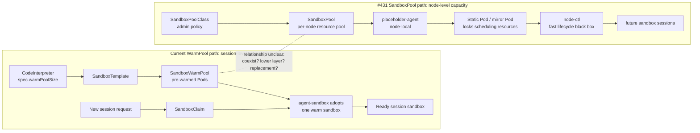
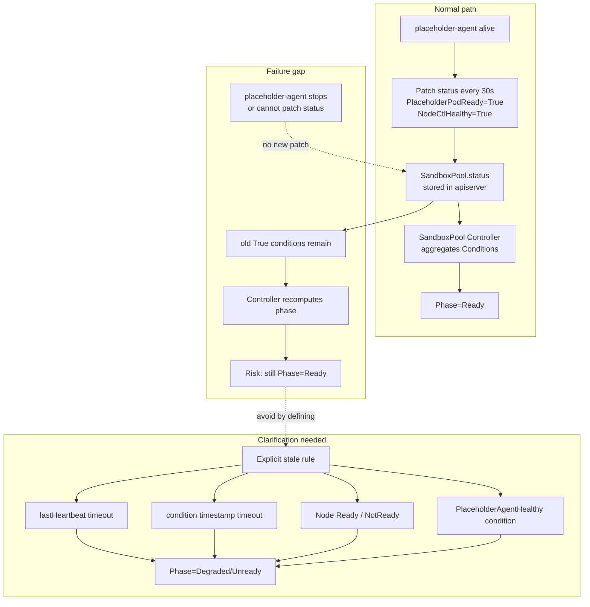

# Day44 SandboxPool PR #431 Comment Drafts

日期：2026-07-09

目标：整理 #431 SandboxPool proposal 的 5 个开发视角疑问，给用户审阅。本文档只用于内部审稿，不直接发 upstream。

目标 PR：

- PR: <https://github.com/volcano-sh/agentcube/pull/431>
- Head observed: `9f03cca`
- File: `docs/proposals/sandbox-pool-management/README.md`
- Status: open, no human maintainer technical review yet
- Comment rule: upstream-facing text must be English; do not post without explicit user confirmation.

## 总体策略

不要一次性发 5 条。当前最合适的策略是先等作者是否根据已有 Copilot comments 更新正文；如果正文不更新，再选 1 条最有实现价值的 human comment。

2026-07-09 更新：`@acsoto` 作为 MEMBER 新增评论，询问 #431 和现有 `CodeInterpreter.warmPoolSize` / `SandboxTemplate` / `SandboxWarmPool` / `SandboxClaim` 路径的关系：二者是并存的两种模式，还是 SandboxPool 未来成为现有 WarmPool 的底层替代。这是目前第一条真人 maintainer/member 技术问题，权重高于 AI reviewer。

这条新评论不覆盖 Candidate 3 的 stale/unreachable 问题，但会影响发言节奏：社区现在先在确认新旧架构关系，我们如果发 Candidate 3，应保持为一个很短的 inline implementation question，不要扩展成整套架构评论。

优先级建议：

| Priority | Topic | Reason |
| --- | --- | --- |
| P1 | stale / unreachable placeholder-agent semantics | Copilot 没有完整覆盖；直接影响 Phase 正确性和 failure tests |
| P2 | resize fallback / validation environment | 影响 v1 可实现性和 CI/e2e 验证 |
| P3 | node-side runtime contract | 很关键，但 Copilot 已经覆盖 no-process/no-cgroup，建议等作者更新正文后再决定是否补 |
| P4 | node-ctl endpoint source of truth | 已被 Copilot 精准覆盖，除非正文不改，否则不重复 |
| P5 | broader validation environment | 可和 resize comment 合并，避免单独发太散 |

> 分析：proposal 已经回答了 Implementation Plan、v1alpha1 scope、Non-Goals、component responsibility、phase/conditions、creation/update/deletion flow、RBAC/webhook/version/test plan 的大框架。评论应避免重复问这些已经存在的内容。

## 新评论通俗解释：WarmPool 和 SandboxPool 到底差在哪

`@acsoto` 问的是：AgentCube 现在已经有一个 WarmPool 机制，为什么还要一个 SandboxPool？这两个 pool 是两套模式并存，还是 SandboxPool 以后会成为 WarmPool 的底座？

通俗理解：

- 现有 **WarmPool** 是“提前做好几间可直接入住的房间”。`CodeInterpreter.warmPoolSize=2` 就让系统提前创建 2 个 session-level sandbox pod。用户请求来时，用 `SandboxClaim` 认领一个已经热好的 sandbox。
- 新 proposal 的 **SandboxPool** 更像“先在楼里划出一片面积和水电容量”。它不直接表示一个可用 session，而是 node-level 资源池：先锁住 CPU/memory，再让后续 fast path / node-ctl 在这块资源里快速创建 sandbox。
- 所以 WarmPool 是 **session 级预热池**；SandboxPool 是 **node 级资源容量池**。二者不在同一层。

当前 proposal 说它只做 slow resource track，不做 create/suspend/resume/delete；这暗示 SandboxPool 不是 WarmPool 的直接替代品。但它也可能成为未来 fast path 的下层资源来源。这个关系 proposal 没有明确写，所以 maintainer 在问。



> 分析：这条 maintainer comment 是更高层的 product / architecture boundary 问题。它适合由 proposal 作者回答，不适合我们抢答。我们可以先观察作者是否补 “Relationship with existing WarmPool” 小节。

## Candidate 1: Node-side runtime contract

建议状态：保留，不优先发。已有 Copilot comments 覆盖了 no-process/no-cgroup 的一部分；如果作者只在 review thread 解释但不改 proposal 正文，可以再发更聚焦的实现 contract 问题。

### Evidence

Proposal evidence:

- Lines 112-113: design table says the placeholder uses Static Pod, and execution mode says no actual process / skip cgroup.
- Lines 124-126: responsibility matrix says placeholder-agent is CRI handler; Static Pod routes CRI calls through RuntimeClass and claims no actual process / no cgroup.
- Lines 174-181: placeholder pod template says the manifest uses `pause:3.9` as placeholder image, while placeholder-agent runs as host-level systemd.
- Lines 364-378: RuntimeClass `placeholder` routes CRI calls to placeholder-agent socket `/run/sandbox-pool/cri.sock`.
- Lines 446-452: creation flow says the CRI server responds to `RunPodSandbox`, `CreateContainer`, and `StartContainer`.
- Lines 552 and 566: `PlaceholderPodReady` means CRI sandbox READY; label `sandbox-pool.io/skip-cgroup` is defined as a skip-cgroup flag.

Existing review evidence:

- Copilot comment at line 113: <https://github.com/volcano-sh/agentcube/pull/431#discussion_r3549383825>
- Copilot comment at line 126: <https://github.com/volcano-sh/agentcube/pull/431#discussion_r3549383854>
- Author reply at line 113: <https://github.com/volcano-sh/agentcube/pull/431#discussion_r3549422712>
- Author reply at line 126: <https://github.com/volcano-sh/agentcube/pull/431#discussion_r3549430177>

### Why It Matters

如果 v1 创建普通 PodSandbox / pause / cgroup，那么测试要验证的是 no workload container、resource requests、Ready、resize、eviction、metrics 是否一致。如果 v1 走自定义 RuntimeClass handler 并跳过 cgroup，那么测试要验证的是 kubelet / scheduler / mirror Pod / metrics 在没有普通 cgroup 时是否仍能表达资源锁。

这不是文案问题，而是 implementation contract。不同答案会导致完全不同的 placeholder-agent、CRI shim 和 e2e 设计。

### Draft Comment

```md
Thanks for clarifying that `placeholder-agent` is intended to run as a host-level process.

I still have one implementation-contract question around the node-side runtime behavior. My reading is:

- the proposal models the placeholder as a Static Pod and routes CRI calls through the `placeholder` RuntimeClass;
- the creation flow includes `RunPodSandbox`, `CreateContainer`, and `StartContainer`;
- at the same time, the design says the placeholder has no actual process and skips cgroup creation, while the template mentions a `pause:3.9` placeholder image.

Could the proposal explicitly state which behavior v1 expects?

1. a normal PodSandbox / pause process / cgroup is created, but there is no workload container; or
2. the custom runtime handler intentionally skips the normal PodSandbox/cgroup path.

This distinction affects the implementation and the validation plan for resource accounting, Ready semantics, eviction/QoS behavior, metrics, and resize handling.
```

## Candidate 2: node-ctl endpoint source of truth

建议状态：暂不发。Copilot 已经精准覆盖；除非作者更新后仍没有改正文，再考虑简短跟进。

### Evidence

Proposal evidence:

- Lines 164-166: `SandboxPoolClassSpec.NodeCtlEndpoint` exists, but comment says placeholder-agent does not read it and obtains the address via `--node-ctl-socket`.
- Lines 214-216 and 234-236: `SandboxPoolSpec.NodeCtl.Endpoint` also exists.
- Lines 37-45 and 58-64: proposal describes declarative CRD APIs and declarative synchronization as goals/core design.
- Lines 124-127: placeholder-agent is the sole party interacting with node-ctl.

Existing review evidence:

- Copilot comment at line 166: <https://github.com/volcano-sh/agentcube/pull/431#discussion_r3549383909>

### Why It Matters

如果 endpoint 字段是 declarative source of truth，placeholder-agent 必须 watch/reconcile 它；如果 endpoint 只是 reserved/informational，v1alpha1 暴露它会让用户误以为修改 CRD 能改变节点行为。实现时这会影响 validation、reconcile、upgrade 和 troubleshooting。

### Draft Comment

```md
One source-of-truth question about `node-ctl` endpoint configuration:

The proposal exposes `spec.nodeCtlEndpoint` / `spec.nodeCtl.endpoint`, but the `SandboxPoolClassSpec` comment says `placeholder-agent` does not read this field and instead uses its local `--node-ctl-socket` startup parameter.

Could the proposal clarify whether the CRD endpoint is authoritative in v1alpha1, or only reserved/informational?

If it is authoritative, the implementation needs a reconciliation rule for endpoint changes. If it is not authoritative, it may be clearer to omit it from the v1alpha1 API or document it as a status/configuration hint to avoid a second source of truth.
```

## Candidate 3: stale / unreachable placeholder-agent semantics

建议状态：最推荐发。这个问题和已有 Copilot comments 不重复，且直接影响 controller 状态机实现。

2026-07-09 已按用户确认发为 inline comment：

- Target: `docs/proposals/sandbox-pool-management/README.md:604`
- URL: <https://github.com/volcano-sh/agentcube/pull/431#discussion_r3549854078>
- Nature: clarification question, not a blocking concern

2026-07-09 follow-up：作者没有直接回复这条 inline comment，但推送了 `35d361e fix stale state issue`。这次修改基本正面回答了问题：

- Status writer table 改为 controller owns `NodeNotFound, PlaceholderAgentHealthy`；placeholder-agent owns non-`NodeNotFound/PlaceholderAgentHealthy` conditions。
- Explanation 增加：当 node 被删除时 controller 用 `NodeNotFound`；当 node 仍存在但 agent crash 时，controller 检测 stale `NodeCtl.LastHeartbeat` `> 2min`，设置 `PlaceholderAgentHealthy=False`，把 Phase 降级到 `Degraded/Unready`。
- Condition table 新增 `PlaceholderAgentHealthy`，writer 是 `sandboxpool-controller`。
- Risk table 把原先 “NodeNotFound / Node NotReady indirectly covering” 改成 “Controller detects agent heartbeat staleness via `PlaceholderAgentHealthy` Condition”。

当前判断：我们的 comment 已被正文吸收，不需要追问同一个问题。剩余可观察的小点是 Phase transition table 里 `PlaceholderAgentHealthy=True → Ready` 写得偏宽，可能会被理解成 agent 恢复即可 Ready，而不是重新同时检查 `PlaceholderPodReady` / `NodeCtlHealthy` / `ResourceSynced`。不过 Phase Computation Priority 最后仍有全量优先级，暂时不建议马上追加评论。

通俗解释：proposal 里说 placeholder-agent 每 30 秒向 Kubernetes 汇报一次“我这边 OK，node-ctl 也健康”。Controller 根据这些汇报算出 `SandboxPool.status.phase=Ready/Degraded/Unready`。问题是：如果 placeholder-agent 挂了，最后一次汇报的 “OK” 还留在 API server 里。Controller 如果只看旧值，就可能继续认为 Pool 是 Ready。

我们要问的不是“你没写健康检查”，而是更精确的 contract：

- placeholder-agent 停止上报后，Controller 什么时候认为状态 stale？
- 是看 `lastHeartbeat` 超时、condition timestamp 超时、Node Ready 状态，还是新增 `PlaceholderAgentHealthy` condition？
- 这条规则由谁写入 status，placeholder-agent 还是 controller？



### Evidence

Proposal evidence:

- Lines 131-138: placeholder-agent owns node-local status fields and non-`NodeNotFound` conditions; controller owns `phase` and `NodeNotFound`.
- Lines 135-136: placeholder-agent patches status every 30s; controller patches phase during reconcile.
- Lines 394-430: Phase is computed from conditions; `NodeCtlHealthy=False` and `PlaceholderPodReady=False` drive Degraded/Unready transitions.
- Lines 552-557: condition definitions include `PlaceholderPodReady`, `ResourceSynced`, `NodeCtlHealthy`, resize conditions, and `NodeNotFound`; no explicit `PlaceholderAgentHealthy` or stale heartbeat condition.
- Lines 603-604: risk table says stale condition values when placeholder-agent is unreachable may delay Phase, and mitigation relies on `NodeNotFound` or Node becoming NotReady indirectly.
- Lines 611-615: test plan includes phase computation, fault injection for API server disconnect, node deletion, and agent restart.

Gap:

- If the Kubernetes Node object still exists but placeholder-agent is stopped, cannot reach apiserver, or cannot patch status, the last written `PlaceholderPodReady=True` / `NodeCtlHealthy=True` may remain stale.
- `NodeNotFound` only covers deleted nodes. Node NotReady is mentioned in the risk table but not modeled as a condition or phase input.

### Why It Matters

这个问题会影响 controller 代码如何避免 stale Ready。实现者需要知道 Phase aggregation 是否应 look at `lastHeartbeat` / condition timestamps / `lastAppliedGeneration` / Node readiness / a new controller-owned condition。否则 Ready 状态可能在 agent 挂掉后长期不变。

### Draft Comment

```md
I have one question about stale status when `placeholder-agent` becomes unreachable.

My reading is that `placeholder-agent` owns the node-local conditions and patches status every 30s, while the controller owns `phase` and `NodeNotFound`. The risk table also notes that conditions may get stuck when `placeholder-agent` is unreachable, with `NodeNotFound` or Node NotReady indirectly covering some cases.

Could the proposal make the stale-status rule explicit for the case where the Kubernetes Node still exists, but `placeholder-agent` has stopped or can no longer patch status?

For example, should the controller derive Unready/Degraded from a `lastHeartbeat` timeout, Node readiness, condition timestamps, or a separate controller-owned `PlaceholderAgentHealthy` condition?

Why this matters: without an explicit stale-status rule, `PlaceholderPodReady=True` / `NodeCtlHealthy=True` values written by the last successful agent heartbeat could keep the pool looking Ready even after the node-local agent is no longer managing the placeholder pod or node-ctl.
```

## Candidate 4: resize fallback and Kubernetes compatibility

建议状态：推荐作为第二优先级，或和 validation environment 合并成一条。

### Evidence

Proposal evidence:

- Lines 44 and 60: VPA InPlaceResize is a core design/goal and should adjust resources without rebuilding Pods.
- Line 118: resource adjustment method is VPA InPlaceResize.
- Lines 456-475: update flow says kubelet detects manifest change and performs `InPlace resize / Pod rebuild`, then placeholder-agent calls `UpdateContainerResources`.
- Lines 590-597: version table says VPA InPlaceResize is 1.27 Alpha / 1.31 GA and depends on `InPlacePodVerticalScaling`.
- Lines 613-615: test plan includes placeholder pod resize lifecycle and VPA resize tests.
- Lines 631-639: implementation plan includes VPA resize in Phase 3 and v1alpha1 scope includes VPA resize.

Gap:

- The proposal says resize should happen without rebuilding Pods, but the update flow includes “InPlace resize / Pod rebuild”.
- It does not say whether clusters without the feature gate should disable resize, fail validation, or use rebuild fallback.
- It does not define the expected behavior when static pod manifest change does not result in in-place resize.

### Why It Matters

If VPA InPlaceResize is mandatory, v1 has a Kubernetes version/feature-gate prerequisite. If rebuild fallback is allowed, the design must explain how resource locking remains reliable during rebuild and how this interacts with “without rebuilding Pods”.

### Draft Comment

```md
One compatibility question about resize behavior:

The proposal treats VPA InPlaceResize as a core goal for v1alpha1 and says placeholder Pod resources are adjusted without rebuilding Pods. In the update flow, however, the kubelet step is described as `InPlace resize / Pod rebuild`, and the compatibility table notes the `InPlacePodVerticalScaling` feature-gate dependency.

Could the proposal clarify the expected v1 behavior when InPlaceResize is unavailable or not supported for the target environment?

- Is v1alpha1 expected to require a Kubernetes version / feature gate where InPlaceResize works?
- If the feature is unavailable, should resize be rejected/deferred, or is pod rebuild an accepted fallback?
- If rebuild is a fallback, what preserves the resource-locking guarantee during the rebuild window?

This would make the implementation and e2e acceptance tests much clearer.
```

## Candidate 5: validation environment for node-local behavior

建议状态：不要单独发太早。可以并入 Candidate 4；如果 maintainer 要求 implementation confidence，再作为 validation-plan comment。

### Evidence

Proposal evidence:

- Lines 95-105: architecture includes host-level placeholder-agent, Static Pod, node-ctl, and Unix socket communication.
- Lines 124-126: placeholder-agent includes CRI handler and manifest management; Static Pod routes CRI calls through RuntimeClass.
- Lines 378 and 512-520: kubelet routes CRI calls to `/run/sandbox-pool/cri.sock` and container runtime must find the handler config.
- Lines 509-514: node startup assumes placeholder-agent binary is pre-installed and started as systemd.
- Lines 559-567: labels/annotations include skip-cgroup and manifest hash.
- Lines 611-615: test plan lists unit/integration/e2e/fault/VPA tests but does not state the minimum environment.

Gap:

- envtest can cover API/controller logic but not kubelet, RuntimeClass handler, Static Pod mirror behavior, CRI socket routing, systemd, or cgroup/skip-cgroup behavior.
- Standard CI may not have a custom runtime handler or host-level systemd install path.

### Why It Matters

Without a concrete validation environment, code review may merge a controller/API implementation while the most important node-local assumptions remain untested. This proposal’s highest-risk claims are not pure controller logic.

### Draft Comment

```md
Could the validation plan also name the minimum environment needed for the node-local parts of this proposal?

The current test plan lists unit, integration, e2e, fault injection, and VPA resize tests, which is helpful. The node-side design also depends on host-level `placeholder-agent`, Static Pod manifest management, RuntimeClass handler registration, CRI socket routing to `/run/sandbox-pool/cri.sock`, and the skip-cgroup/resource-accounting behavior.

Could the proposal clarify which of these can be covered by envtest/controller tests, and which require a real node or dedicated e2e environment with the custom runtime handler installed?

This would help set the acceptance criteria for the risky parts of the proposal, especially resource accounting, mirror pod rebuild, `UpdateContainerResources`, and cleanup behavior.
```

## Recommended Single Comment

如果只发一条，建议发 Candidate 3。它不和 Copilot 重复，而且最像 human implementation review。

Recommended text:

```md
I have one question about stale status when `placeholder-agent` becomes unreachable.

My reading is that `placeholder-agent` owns the node-local conditions and patches status every 30s, while the controller owns `phase` and `NodeNotFound`. The risk table also notes that conditions may get stuck when `placeholder-agent` is unreachable, with `NodeNotFound` or Node NotReady indirectly covering some cases.

Could the proposal make the stale-status rule explicit for the case where the Kubernetes Node still exists, but `placeholder-agent` has stopped or can no longer patch status?

For example, should the controller derive Unready/Degraded from a `lastHeartbeat` timeout, Node readiness, condition timestamps, or a separate controller-owned `PlaceholderAgentHealthy` condition?

Why this matters: without an explicit stale-status rule, `PlaceholderPodReady=True` / `NodeCtlHealthy=True` values written by the last successful agent heartbeat could keep the pool looking Ready even after the node-local agent is no longer managing the placeholder pod or node-ctl.
```
