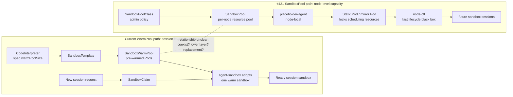
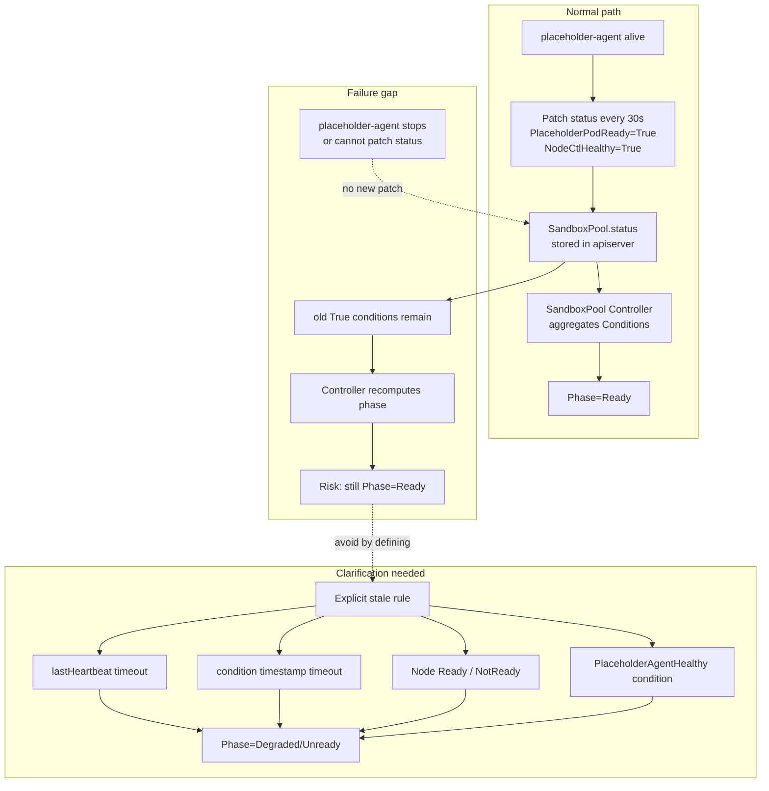

# Day44 SandboxPool PR #431 Comment Drafts

日期：2026-07-09

继续审阅：2026-07-10

目标：持续整理 #431 SandboxPool proposal 的开发视角疑问，给用户审阅。本文档只用于内部审稿，不直接发 upstream。

目标 PR：

- PR: <https://github.com/volcano-sh/agentcube/pull/431>
- Head observed: `35d361e` (`fix stale state issue`)
- File: `docs/proposals/sandbox-pool-management/README.md`
- Status: open; `@acsoto` 已提出一条真人 MEMBER 架构问题；普通 checks 已通过，仍缺 `lgtm` / `approved`
- Comment rule: upstream-facing text must be English; do not post without explicit user confirmation.

## 总体策略

不要一次性发 5 条。当前最合适的策略是先等作者是否根据已有 Copilot comments 更新正文；如果正文不更新，再选 1 条最有实现价值的 human comment。

2026-07-09 更新：`@acsoto` 作为 MEMBER 新增评论，询问 #431 和现有 `CodeInterpreter.warmPoolSize` / `SandboxTemplate` / `SandboxWarmPool` / `SandboxClaim` 路径的关系：二者是并存的两种模式，还是 SandboxPool 未来成为现有 WarmPool 的底层替代。这是目前第一条真人 maintainer/member 技术问题，权重高于 AI reviewer。

这条新评论不覆盖 Candidate 3 的 stale/unreachable 问题，但会影响发言节奏：社区现在先在确认新旧架构关系，我们如果发 Candidate 3，应保持为一个很短的 inline implementation question，不要扩展成整套架构评论。

2026-07-10 继续审阅结论：Candidate 3 已发出并被 `35d361e` 基本吸收，因此不能继续作为推荐评论。对最新正文和 Kubernetes / containerd 官方契约交叉核对后，发现两个更基础的可实现性问题：

1. Proposal 把 Static Pod 和 Kubernetes 原生 In-place Pod Resize 同时作为 v1alpha1 核心机制，但 Kubernetes KEP-1287 明确把 Static Pod resize 列为 `Infeasible`。
2. Proposal 写成 RuntimeClass handler 会把 kubelet CRI 调用路由到另一个 Unix socket；实际 Kubernetes 契约是把 handler 字符串放进同一个 CRI `RunPodSandbox` 请求，containerd 再按 handler 选择 runtime/shim/sandboxer 配置。若要让 `placeholder-agent` 独立监听 CRI socket，还缺一个明确的 containerd shim、sandboxer proxy 或 CRI proxy 集成层。

> 分析：这两点不是文案偏好，而是会决定 Phase 2/3 是否能按 proposal 实现。它们的优先级高于继续润色 API 字段或测试环境描述。

优先级建议：

| Priority | Topic | Reason |
| --- | --- | --- |
| P0 | Static Pod 与 In-place Pod Resize 冲突 | KEP-1287 明确把 Static Pod resize 判为 Infeasible，直接冲突于 v1alpha1 核心目标 |
| P1 | RuntimeClass / CRI 路由契约 | 当前正文缺少从 containerd handler 到独立 `placeholder-agent` socket 的真实集成层 |
| P2 | placeholder-agent heartbeat 信号源 | `NodeCtl.LastHeartbeat` 同时被当成 node-ctl 与 agent 心跳，故障分类会混淆 |
| P2 | Phase 恢复条件 | `PlaceholderAgentHealthy=True -> Ready` 跳过其它 Ready 条件，与全量优先级规则矛盾 |
| P2 | force-finalizer 后的 orphan manifest | agent 不可达时强制完成删除，节点恢复后可能继续保留无 CRD 对应的 Static Pod |
| P4 | node-ctl endpoint source of truth | 已被 Copilot 精准覆盖，除非正文不改，否则不重复 |
| P5 | broader validation environment | 可并入 P0/P1，避免单独发太散 |

> 分析：proposal 已经回答了 Implementation Plan、v1alpha1 scope、Non-Goals、component responsibility、phase/conditions、creation/update/deletion flow、RBAC/webhook/version/test plan 的大框架。评论应避免重复问这些已经存在的内容。

## 新评论通俗解释：WarmPool 和 SandboxPool 到底差在哪

`@acsoto` 问的是：AgentCube 现在已经有一个 WarmPool 机制，为什么还要一个 SandboxPool？这两个 pool 是两套模式并存，还是 SandboxPool 以后会成为 WarmPool 的底座？

通俗理解：

- 现有 **WarmPool** 是“提前做好几间可直接入住的房间”。`CodeInterpreter.warmPoolSize=2` 就让系统提前创建 2 个 session-level sandbox pod。用户请求来时，用 `SandboxClaim` 认领一个已经热好的 sandbox。
- 新 proposal 的 **SandboxPool** 更像“先在楼里划出一片面积和水电容量”。它不直接表示一个可用 session，而是 node-level 资源池：先锁住 CPU/memory，再让后续 fast path / node-ctl 在这块资源里快速创建 sandbox。
- 所以 WarmPool 是 **session 级预热池**；SandboxPool 是 **node 级资源容量池**。二者不在同一层。

当前 proposal 说它只做 slow resource track，不做 create/suspend/resume/delete；这暗示 SandboxPool 不是 WarmPool 的直接替代品。但它也可能成为未来 fast path 的下层资源来源。这个关系 proposal 没有明确写，所以 maintainer 在问。



> 分析：这条 maintainer comment 是更高层的 product / architecture boundary 问题。它适合由 proposal 作者回答，不适合我们抢答。我们可以先观察作者是否补 “Relationship with existing WarmPool” 小节。

## Candidate 1: Node-side RuntimeClass / CRI integration contract

建议状态：提升为 P1。已有 Copilot comments 只覆盖了 no-process/no-cgroup 的表面矛盾，没有覆盖 RuntimeClass handler 如何连接到独立 CRI socket 这个更基础的集成契约。

### Evidence

Proposal evidence:

- Lines 112-113: design table says the placeholder uses Static Pod, and execution mode says no actual process / skip cgroup.
- Lines 124-126: responsibility matrix says placeholder-agent is CRI handler; Static Pod routes CRI calls through RuntimeClass and claims no actual process / no cgroup.
- Lines 174-181: placeholder pod template says the manifest uses `pause:3.9` as placeholder image, while placeholder-agent runs as host-level systemd.
- Lines 364-378: RuntimeClass `placeholder` routes CRI calls to placeholder-agent socket `/run/sandbox-pool/cri.sock`.
- Lines 446-452: creation flow says the CRI server responds to `RunPodSandbox`, `CreateContainer`, and `StartContainer`.
- Lines 552 and 566: `PlaceholderPodReady` means CRI sandbox READY; label `sandbox-pool.io/skip-cgroup` is defined as a skip-cgroup flag.

Existing review evidence:

- Copilot comment at line 113: <https://github.com/volcano-sh/agentcube/pull/431#discussion_r3549383825>
- Copilot comment at line 126: <https://github.com/volcano-sh/agentcube/pull/431#discussion_r3549383854>
- Author reply at line 113: <https://github.com/volcano-sh/agentcube/pull/431#discussion_r3549422712>
- Author reply at line 126: <https://github.com/volcano-sh/agentcube/pull/431#discussion_r3549430177>

Official contract evidence:

- Kubernetes RuntimeClass 文档说明 handler 标识节点 CRI 实现中预先配置的一套 runtime configuration；containerd 对应配置位于 `containerd.runtimes.${HANDLER_NAME}`：<https://kubernetes.io/docs/concepts/containers/runtime-class/>
- Kubernetes v1.34.1 kubelet 先解析 `runtimeHandler`，然后仍通过已有的 `runtimeService.RunPodSandbox(..., runtimeHandler)` 发出请求：<https://github.com/kubernetes/kubernetes/blob/v1.34.1/pkg/kubelet/kuberuntime/kuberuntime_sandbox.go#L56-L68>
- CRI v1 把 handler 定义为 `RunPodSandboxRequest.runtime_handler` 字段，而不是另一个 endpoint：<https://github.com/kubernetes/cri-api/blob/v0.34.1/pkg/apis/runtime/v1/api.proto#L515-L524>
- containerd 的 handler 配置选择 `runtime_type` / `runtime_path`；containerd 2.x 还可通过 `sandboxer` 接入 shim 或 sandbox proxy，但这些接口不等于让 kubelet 直接切换到另一个完整 CRI socket：<https://github.com/containerd/containerd/blob/main/docs/cri/config.md#runtime-classes>

### Why It Matters

如果 v1 创建普通 PodSandbox / pause / cgroup，那么测试要验证的是 no workload container、resource requests、Ready、resize、eviction、metrics 是否一致。如果 v1 走自定义 containerd runtime shim / sandboxer 并跳过 cgroup，那么测试要验证的是 kubelet / scheduler / mirror Pod / metrics 在没有普通 cgroup 时是否仍能表达资源锁。

当前文本把 `RuntimeClass handler` 和独立 `CRI endpoint` 当成同一件事。除非节点把 kubelet 的全局 CRI endpoint 指到一个能按 handler 转发的代理，否则 RuntimeClass 本身不会让 kubelet 针对单个 Pod 改连 `/run/sandbox-pool/cri.sock`。这会直接改变 placeholder-agent 需要实现的接口：完整 CRI server、containerd runtime v2 shim、containerd sandbox controller，或 CRI dispatch proxy。

### Draft Comment

```md
I have one question about the RuntimeClass integration contract.

The proposal says that kubelet routes CRI calls to `/run/sandbox-pool/cri.sock` based on the `placeholder` RuntimeClass handler, and that `placeholder-agent` implements the CRI server. My understanding of the Kubernetes CRI contract is that kubelet keeps using its configured runtime service and passes the resolved handler as `RunPodSandboxRequest.runtime_handler`. For containerd, that handler selects a configured runtime/shim (or, in containerd 2.x, a sandboxer); RuntimeClass by itself does not select a second CRI endpoint.

Could the proposal specify the missing integration layer between the `placeholder` handler and `placeholder-agent`?

- Is `placeholder-agent` intended to be a containerd runtime v2 shim / sandbox controller?
- Is there a CRI proxy in front of containerd that dispatches by `runtime_handler`?
- Or is the node-wide kubelet CRI endpoint expected to point directly to `placeholder-agent`, with normal workloads forwarded elsewhere?

This determines which API `placeholder-agent` must implement and whether the proposed per-Pod routing can work without replacing the node's normal CRI path.
```

## Candidate 2: node-ctl endpoint source of truth

建议状态：暂不发。Copilot 已经精准覆盖；除非作者更新后仍没有改正文，再考虑简短跟进。

### Evidence

Proposal evidence:

- Lines 164-166: `SandboxPoolClassSpec.NodeCtlEndpoint` exists, but comment says placeholder-agent does not read it and obtains the address via `--node-ctl-socket`.
- Lines 214-216 and 234-236: `SandboxPoolSpec.NodeCtl.Endpoint` also exists.
- Lines 37-45 and 58-64: proposal describes declarative CRD APIs and declarative synchronization as goals/core design.
- Lines 124-127: placeholder-agent is the sole party interacting with node-ctl.

Existing review evidence:

- Copilot comment at line 166: <https://github.com/volcano-sh/agentcube/pull/431#discussion_r3549383909>

### Why It Matters

如果 endpoint 字段是 declarative source of truth，placeholder-agent 必须 watch/reconcile 它；如果 endpoint 只是 reserved/informational，v1alpha1 暴露它会让用户误以为修改 CRD 能改变节点行为。实现时这会影响 validation、reconcile、upgrade 和 troubleshooting。

### Draft Comment

```md
One source-of-truth question about `node-ctl` endpoint configuration:

The proposal exposes `spec.nodeCtlEndpoint` / `spec.nodeCtl.endpoint`, but the `SandboxPoolClassSpec` comment says `placeholder-agent` does not read this field and instead uses its local `--node-ctl-socket` startup parameter.

Could the proposal clarify whether the CRD endpoint is authoritative in v1alpha1, or only reserved/informational?

If it is authoritative, the implementation needs a reconciliation rule for endpoint changes. If it is not authoritative, it may be clearer to omit it from the v1alpha1 API or document it as a status/configuration hint to avoid a second source of truth.
```

## Candidate 3: stale / unreachable placeholder-agent semantics

建议状态：原问题已完成并关闭。它在 2026-07-09 是最推荐项，现已发出且被 `35d361e` 吸收，不应重复评论。

2026-07-09 已按用户确认发为 inline comment：

- Target: `docs/proposals/sandbox-pool-management/README.md:604`
- URL: <https://github.com/volcano-sh/agentcube/pull/431#discussion_r3549854078>
- Nature: clarification question, not a blocking concern

2026-07-09 follow-up：作者推送了 `35d361e fix stale state issue`，随后在这条 inline thread 回复 `Good suggestion. Updated related content`（<https://github.com/volcano-sh/agentcube/pull/431#discussion_r3550260383>）。这次修改基本正面回答了问题：

- Status writer table 改为 controller owns `NodeNotFound, PlaceholderAgentHealthy`；placeholder-agent owns non-`NodeNotFound/PlaceholderAgentHealthy` conditions。
- Explanation 增加：当 node 被删除时 controller 用 `NodeNotFound`；当 node 仍存在但 agent crash 时，controller 检测 stale `NodeCtl.LastHeartbeat` `> 2min`，设置 `PlaceholderAgentHealthy=False`，把 Phase 降级到 `Degraded/Unready`。
- Condition table 新增 `PlaceholderAgentHealthy`，writer 是 `sandboxpool-controller`。
- Risk table 把原先 “NodeNotFound / Node NotReady indirectly covering” 改成 “Controller detects agent heartbeat staleness via `PlaceholderAgentHealthy` Condition”。

当前判断：我们的 comment 已被正文吸收，不需要追问同一个问题。剩余可观察的小点是 Phase transition table 里 `PlaceholderAgentHealthy=True → Ready` 写得偏宽，可能会被理解成 agent 恢复即可 Ready，而不是重新同时检查 `PlaceholderPodReady` / `NodeCtlHealthy` / `ResourceSynced`。不过 Phase Computation Priority 最后仍有全量优先级，暂时不建议马上追加评论。

### 2026-07-10 Follow-up: heartbeat signal is still conflated

`35d361e` 解决了“controller 是否负责 stale detection”，但新正文选择 `NodeCtl.LastHeartbeat` 作为 `PlaceholderAgentHealthy` 的依据，仍存在语义混用：

- `NodeCtlStatus.LastHeartbeat` 位于 `status.nodeCtl`，自然表达的是 placeholder-agent 最后一次成功探测 node-ctl 的时间。
- `NodeCtlHealthy` 已经用来表达 node-ctl 是否可达。
- 如果 placeholder-agent 正常运行但 node-ctl 挂掉，`NodeCtl.LastHeartbeat` 同样会超过 2 分钟，controller 会把 `PlaceholderAgentHealthy=False`，把 node-ctl 故障误报为 agent 故障。
- 如果目标是判断 placeholder-agent 是否还在成功 patch API，应使用每次 status report 都更新的独立 agent heartbeat，例如 `status.placeholderAgent.lastHeartbeat`；`metav1.Condition.lastTransitionTime` 不能替代周期心跳，因为状态不变化时它不应刷新。

建议状态：保留为 P2 follow-up，不立即追在刚解决的 thread 后继续发。若作者准备实现 Phase controller，再用一条独立短评论问清 signal source。

Draft follow-up:

```md
Thanks for adding the controller-owned `PlaceholderAgentHealthy` condition. I have one follow-up question about its signal source.

The current text derives agent health from `status.nodeCtl.lastHeartbeat`. If `placeholder-agent` is still reporting normally but node-ctl is down, that timestamp would also become stale, so the controller could set both `NodeCtlHealthy=False` and `PlaceholderAgentHealthy=False` even though the agent itself is alive.

Would it be clearer to give `status.placeholderAgent` its own report heartbeat, updated on every periodic status patch, and reserve `status.nodeCtl.lastHeartbeat` for node-ctl reachability? That would let the phase logic distinguish an agent/reporting failure from a node-ctl failure and make the two fault-injection cases independently testable.
```

通俗解释：proposal 里说 placeholder-agent 每 30 秒向 Kubernetes 汇报一次“我这边 OK，node-ctl 也健康”。Controller 根据这些汇报算出 `SandboxPool.status.phase=Ready/Degraded/Unready`。问题是：如果 placeholder-agent 挂了，最后一次汇报的 “OK” 还留在 API server 里。Controller 如果只看旧值，就可能继续认为 Pool 是 Ready。

我们要问的不是“你没写健康检查”，而是更精确的 contract：

- placeholder-agent 停止上报后，Controller 什么时候认为状态 stale？
- 是看 `lastHeartbeat` 超时、condition timestamp 超时、Node Ready 状态，还是新增 `PlaceholderAgentHealthy` condition？
- 这条规则由谁写入 status，placeholder-agent 还是 controller？



### Evidence

Proposal evidence:

- Lines 131-138: placeholder-agent owns node-local status fields and non-`NodeNotFound` conditions; controller owns `phase` and `NodeNotFound`.
- Lines 135-136: placeholder-agent patches status every 30s; controller patches phase during reconcile.
- Lines 394-430: Phase is computed from conditions; `NodeCtlHealthy=False` and `PlaceholderPodReady=False` drive Degraded/Unready transitions.
- Lines 552-557: condition definitions include `PlaceholderPodReady`, `ResourceSynced`, `NodeCtlHealthy`, resize conditions, and `NodeNotFound`; no explicit `PlaceholderAgentHealthy` or stale heartbeat condition.
- Lines 603-604: risk table says stale condition values when placeholder-agent is unreachable may delay Phase, and mitigation relies on `NodeNotFound` or Node becoming NotReady indirectly.
- Lines 611-615: test plan includes phase computation, fault injection for API server disconnect, node deletion, and agent restart.

Gap:

- If the Kubernetes Node object still exists but placeholder-agent is stopped, cannot reach apiserver, or cannot patch status, the last written `PlaceholderPodReady=True` / `NodeCtlHealthy=True` may remain stale.
- `NodeNotFound` only covers deleted nodes. Node NotReady is mentioned in the risk table but not modeled as a condition or phase input.

### Why It Matters

这个问题会影响 controller 代码如何避免 stale Ready。实现者需要知道 Phase aggregation 是否应 look at `lastHeartbeat` / condition timestamps / `lastAppliedGeneration` / Node readiness / a new controller-owned condition。否则 Ready 状态可能在 agent 挂掉后长期不变。

### Draft Comment

```md
I have one question about stale status when `placeholder-agent` becomes unreachable.

My reading is that `placeholder-agent` owns the node-local conditions and patches status every 30s, while the controller owns `phase` and `NodeNotFound`. The risk table also notes that conditions may get stuck when `placeholder-agent` is unreachable, with `NodeNotFound` or Node NotReady indirectly covering some cases.

Could the proposal make the stale-status rule explicit for the case where the Kubernetes Node still exists, but `placeholder-agent` has stopped or can no longer patch status?

For example, should the controller derive Unready/Degraded from a `lastHeartbeat` timeout, Node readiness, condition timestamps, or a separate controller-owned `PlaceholderAgentHealthy` condition?

Why this matters: without an explicit stale-status rule, `PlaceholderPodReady=True` / `NodeCtlHealthy=True` values written by the last successful agent heartbeat could keep the pool looking Ready even after the node-local agent is no longer managing the placeholder pod or node-ctl.
```

## Candidate 4: resize fallback and Kubernetes compatibility

建议状态：提升为 P0，也是当前最推荐保留的一条候选评论。官方 KEP 表明这不是一般的 feature-gate fallback 问题，而是 Static Pod 与 Kubernetes 原生 In-place Pod Resize 当前不兼容。

### Evidence

Proposal evidence:

- Lines 44 and 60: VPA InPlaceResize is a core design/goal and should adjust resources without rebuilding Pods.
- Line 118: resource adjustment method is VPA InPlaceResize.
- Lines 456-475: update flow says kubelet detects manifest change and performs `InPlace resize / Pod rebuild`, then placeholder-agent calls `UpdateContainerResources`.
- Lines 590-597: version table says VPA InPlaceResize is 1.27 Alpha / 1.31 GA and depends on `InPlacePodVerticalScaling`.
- Lines 613-615: test plan includes placeholder pod resize lifecycle and VPA resize tests.
- Lines 631-639: implementation plan includes VPA resize in Phase 3 and v1alpha1 scope includes VPA resize.

Official Kubernetes evidence:

- Kubernetes KEP-1287 的 `PodResizePending/Infeasible` 原因明确包含 “The pod is a static pod”：<https://github.com/kubernetes/enhancements/blob/master/keps/sig-node/1287-in-place-update-pod-resources/README.md#resize-status>
- 同一个 KEP 的 metrics 原因列表也包含 `static_pod - In-place resize is not supported for static pods`。
- KEP metadata 记录的成熟度是 v1.27 alpha、v1.33 beta、v1.35 stable，不是 proposal 兼容表中的 v1.31 GA：<https://github.com/kubernetes/enhancements/blob/master/keps/sig-node/1287-in-place-update-pod-resources/kep.yaml>
- 2026-07-10 用户确认版本语义：Kubernetes 当前官方 stable channel 是 `v1.36.2`，而 KEP 的 `stable: v1.35` 表示该 feature 从 v1.35 开始毕业为 stable，不是在声明当前最新 Kubernetes 版本。评论里的 milestone 表述正确，无需修改；proposal 的 `1.31 GA` 仍与 KEP 不符。
- Kubernetes 官方任务文档说明标准触发路径是修改 Pod desired resources 并调用 `/resize` subresource：<https://kubernetes.io/docs/tasks/configure-pod-container/resize-container-resources/>
- Static Pod 的 source of truth 是节点本地 manifest，API server 中只有 kubelet 维护的 mirror Pod：<https://kubernetes.io/docs/tasks/configure-pod-container/static-pod/>

Gap:

- Proposal 同时把 Static Pod resource lock 与不重建 Pod 的 InPlaceResize 列为 v1alpha1 core scope，但 KEP 明确不支持 Static Pod in-place resize。
- 修改 Static Pod 本地 manifest 不等于调用 API server 的 `/resize` subresource；kubelet 可能把 manifest 变化作为 Pod replacement，而不是原生 in-place resize。
- Update flow 把 `InPlace resize / Pod rebuild` 并列，没有定义哪一个才是规范行为，也没有解释 rebuild 窗口如何维持 scheduler resource lock。
- `VPA InPlaceResize` 这一术语混合了 VPA controller 与 Kubernetes `InPlacePodVerticalScaling` API/feature gate；正文没有说明是否真的部署或依赖 VPA。
- 兼容性表的 GA 版本错误，会让实现者和部署者错误估计 feature gate / cluster prerequisite。

### Why It Matters

如果坚持 Static Pod，native in-place resize 不能作为 v1alpha1 已成立的能力，需要明确接受 rebuild，或提出并验证一条不同于 KEP-1287 `/resize` 的自定义 runtime mechanism。如果坚持原生 in-place resize，则 placeholder resource 的 Kubernetes object model 可能不能继续选 Static Pod。这个选择会反过来改变 resource-lock guarantee、API compatibility 和整个 Phase 3 test plan。

### Draft Comment

`Proposed inline target`: `docs/proposals/sandbox-pool-management/README.md:598` at head `35d361e` (right side).

2026-07-10 已按用户确认发布：

- URL: <https://github.com/volcano-sh/agentcube/pull/431#discussion_r3556111395>
- GitHub review comment ID: `3556111395`
- Nature: compatibility clarification with implementation-blocking evidence; not a formal blocking review
- Verification: GitHub returned path line 598 and commit `35d361eb55a283ee8718a94b38b6ad8a1d44ee93`; posted body matches the approved draft below

```md
I think the compatibility assumption here needs clarification because the proposal combines two behaviors that the native Kubernetes resize path does not currently support together.

The proposal makes both Static Pod resource locking and no-rebuild `VPA InPlaceResize` part of the v1alpha1 core scope. However, Kubernetes [KEP-1287](https://github.com/kubernetes/enhancements/blob/481e3710995d9996e27c7364b14d9ab870b65e74/keps/sig-node/1287-in-place-update-pod-resources/README.md#L332-L336) explicitly lists "The pod is a static pod" as an `Infeasible` in-place resize case. Its [metadata](https://github.com/kubernetes/enhancements/blob/481e3710995d9996e27c7364b14d9ab870b65e74/keps/sig-node/1287-in-place-update-pod-resources/kep.yaml#L35-L42) records v1.27 alpha, v1.33 beta, and v1.35 stable, rather than v1.31 GA.

Could the proposal clarify which mechanism Phase 3 intends to use?

- Native Kubernetes `/resize`: Static Pods are unsupported.
- Local Static Pod manifest update: if kubelet rebuilds the Pod, this is not a no-rebuild resize, and the resource-locking behavior during replacement needs to be defined.
- A custom `placeholder-agent` / runtime path: could the proposal describe how Kubernetes-visible requests, mirror Pod state, and node-ctl's actual limits remain consistent, instead of treating it as the native `InPlacePodVerticalScaling` path?

This distinction changes the compatibility table, implementation contract, and e2e acceptance criteria.
```

## Candidate 5: validation environment for node-local behavior

建议状态：不要单独发太早。可以并入 Candidate 4；如果 maintainer 要求 implementation confidence，再作为 validation-plan comment。

### Evidence

Proposal evidence:

- Lines 95-105: architecture includes host-level placeholder-agent, Static Pod, node-ctl, and Unix socket communication.
- Lines 124-126: placeholder-agent includes CRI handler and manifest management; Static Pod routes CRI calls through RuntimeClass.
- Lines 378 and 512-520: kubelet routes CRI calls to `/run/sandbox-pool/cri.sock` and container runtime must find the handler config.
- Lines 509-514: node startup assumes placeholder-agent binary is pre-installed and started as systemd.
- Lines 559-567: labels/annotations include skip-cgroup and manifest hash.
- Lines 611-615: test plan lists unit/integration/e2e/fault/VPA tests but does not state the minimum environment.

Gap:

- envtest can cover API/controller logic but not kubelet, RuntimeClass handler, Static Pod mirror behavior, CRI socket routing, systemd, or cgroup/skip-cgroup behavior.
- Standard CI may not have a custom runtime handler or host-level systemd install path.

### Why It Matters

Without a concrete validation environment, code review may merge a controller/API implementation while the most important node-local assumptions remain untested. This proposal’s highest-risk claims are not pure controller logic.

### Draft Comment

```md
Could the validation plan also name the minimum environment needed for the node-local parts of this proposal?

The current test plan lists unit, integration, e2e, fault injection, and VPA resize tests, which is helpful. The node-side design also depends on host-level `placeholder-agent`, Static Pod manifest management, RuntimeClass handler registration, CRI socket routing to `/run/sandbox-pool/cri.sock`, and the skip-cgroup/resource-accounting behavior.

Could the proposal clarify which of these can be covered by envtest/controller tests, and which require a real node or dedicated e2e environment with the custom runtime handler installed?

This would help set the acceptance criteria for the risky parts of the proposal, especially resource accounting, mirror pod rebuild, `UpdateContainerResources`, and cleanup behavior.
```

## Candidate 6: Phase recovery must re-evaluate all Ready conditions

建议状态：P2，属于 `35d361e` 为修复 stale agent 状态而新引入的状态机文本不一致。先记录，不和 P0/P1 一起形成 omnibus comment。

### Evidence

- Line 426 defines `Ready` as `PlaceholderPodReady=True + NodeCtlHealthy=True + ResourceSynced=True (or ResizeDeferred=True)`.
- Line 427 says a `Degraded` Pool exits via `PlaceholderAgentHealthy=True -> Ready` without requiring `NodeCtlHealthy` or `ResourceSynced`.
- Line 428 says an `Unready` Pool exits via `PlaceholderAgentHealthy=True -> Ready` without requiring `PlaceholderPodReady` or `NodeCtlHealthy`.
- Line 430's Phase Computation Priority implies all higher-priority unhealthy conditions must be evaluated before the fallback `Ready` state.
- Existing Gemini/Copilot review already required `NodeNotFound=False` to “re-evaluate all conditions”; `35d361e` correctly changed that branch but did not apply the same rule to `PlaceholderAgentHealthy=True`.

### Why It Matters

如果 controller 逐字实现 Phase table，agent 心跳恢复就可能把仍然 `NodeCtlHealthy=False`、`PlaceholderPodReady=False` 或 `ResourceSynced=False` 的 Pool 提前标为 Ready。若实现者按 line 430 的 priority function，则表格又与真实实现不一致。Proposal 应保持单一状态机 contract。

### Draft Comment

```md
One small state-machine follow-up on the new `PlaceholderAgentHealthy` condition:

The Degraded and Unready rows currently allow `PlaceholderAgentHealthy=True -> Ready`. Agent recovery alone does not necessarily mean that `PlaceholderPodReady`, `NodeCtlHealthy`, and `ResourceSynced` have also recovered. This seems similar to the earlier `NodeNotFound=False` case, which now correctly says to re-evaluate all conditions.

Could these exits also say `PlaceholderAgentHealthy=True -> re-evaluate all conditions`, with `Ready` reached only when the normal Ready criteria hold? That would keep the transition table consistent with the Phase Computation Priority rule.
```

## Candidate 7: forced finalizer removal can orphan node-local resources

建议状态：P2 failure-recovery gap。它没有被已有 bot review 覆盖，但在 P0/P1 澄清前不优先发。

### Evidence

- Lines 487-492 say only `placeholder-agent` removes the local Static Pod manifest and stops/removes the CRI sandbox.
- Lines 495-498 say the controller waits for mirror Pod removal, but after 10 minutes force-removes the finalizer and emits a Warning Event.
- The node-local manifest is outside Kubernetes API storage and has no OwnerReference; deleting the `SandboxPool` CR cannot garbage-collect that file.
- The node startup sequence only says the agent watches current `SandboxPool` objects. It does not describe scanning managed manifest files and deleting any whose Pool no longer exists.

### Why It Matters

如果 agent 在删除期间不可达，10 分钟后 controller 会让 Pool 从 API 中消失，但本地 manifest 仍可能存在。kubelet 会继续运行 Static Pod、scheduler 仍可能计算其 requests、node-ctl 也可能继续运行。agent 恢复后若只处理 watch 当前对象，就不会收到已经完成的删除事件，形成长期 orphan resource lock。这个路径需要启动时双向 reconcile 或保留可恢复的 tombstone/source of truth。

### Draft Comment

```md
I have one failure-recovery question about the forced finalizer timeout.

The deletion flow says that `placeholder-agent` removes the node-local manifest, while the controller force-removes the Pool finalizer after 10 minutes if the mirror Pod is still present. If the agent is unreachable for that whole window, the `SandboxPool` can disappear from the API while its local Static Pod manifest still exists on the node.

When the agent later recovers, how is that orphaned manifest detected and removed? A watch of current Pool objects would not replay the already-completed deletion.

Could the proposal add a startup reconciliation rule that scans agent-managed manifests and removes any whose Pool UID no longer exists (or describe another durable tombstone mechanism)? This would ensure the timeout does not leave resources locked with no control-plane object or status.
```

## Recommended Single Comment

2026-07-10 判断：Candidate 4 已按用户确认发布。Candidate 3 已经发出并被吸收，不能重复发；Candidate 4 有官方 KEP 直接证据，并且决定 Phase 3 是否可实现。

Nature: design clarification with implementation-blocking evidence. 建议发在 line 598 的 K8s Version Compatibility 表，或 line 634 的 Phase 3 implementation plan；发出前仍需用户确认 exact target 和全文。

Recommended text:

```md
I think the compatibility assumption here needs clarification because the proposal combines two behaviors that the native Kubernetes resize path does not currently support together.

The proposal makes both Static Pod resource locking and no-rebuild `VPA InPlaceResize` part of the v1alpha1 core scope. However, Kubernetes [KEP-1287](https://github.com/kubernetes/enhancements/blob/481e3710995d9996e27c7364b14d9ab870b65e74/keps/sig-node/1287-in-place-update-pod-resources/README.md#L332-L336) explicitly lists "The pod is a static pod" as an `Infeasible` in-place resize case. Its [metadata](https://github.com/kubernetes/enhancements/blob/481e3710995d9996e27c7364b14d9ab870b65e74/keps/sig-node/1287-in-place-update-pod-resources/kep.yaml#L35-L42) records v1.27 alpha, v1.33 beta, and v1.35 stable, rather than v1.31 GA.

Could the proposal clarify which mechanism Phase 3 intends to use?

- Native Kubernetes `/resize`: Static Pods are unsupported.
- Local Static Pod manifest update: if kubelet rebuilds the Pod, this is not a no-rebuild resize, and the resource-locking behavior during replacement needs to be defined.
- A custom `placeholder-agent` / runtime path: could the proposal describe how Kubernetes-visible requests, mirror Pod state, and node-ctl's actual limits remain consistent, instead of treating it as the native `InPlacePodVerticalScaling` path?

This distinction changes the compatibility table, implementation contract, and e2e acceptance criteria.
```

## 2026-07-10 Review Decision

- **已关闭**：Candidate 3 原始 stale/unreachable 问题，`35d361e` 已增加 controller-owned `PlaceholderAgentHealthy`。
- **已发出、等待作者回复**：Candidate 4 的 Static Pod / native resize 冲突；comment URL 为 <https://github.com/volcano-sh/agentcube/pull/431#discussion_r3556111395>。
- **第二顺位**：Candidate 1 的 RuntimeClass / CRI integration layer；需要作者明确 containerd shim、sandboxer 或 CRI proxy 方案。
- **先本地保留**：heartbeat signal conflation、Candidate 6 Phase recovery 和 Candidate 7 orphan cleanup；它们是后续正确性问题，不宜与 P0/P1 混成一条长评论。
- **不重复**：node-ctl endpoint、SSA conditions list-map、`omitempty`、`<5s` rebuild、no-process/no-cgroup 均已有 bot review coverage。
- **社区节奏**：`@acsoto` 的 existing WarmPool relationship 问题仍未进入 proposal 正文，等待作者补 Relationship / Compatibility 说明，不抢答也不重复问。
