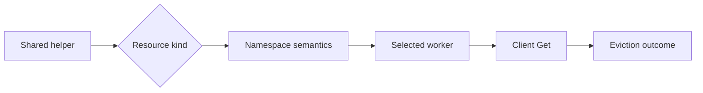
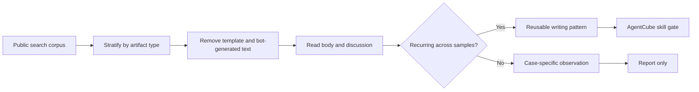
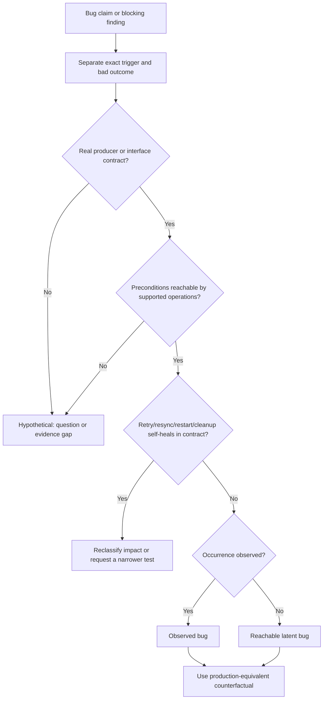
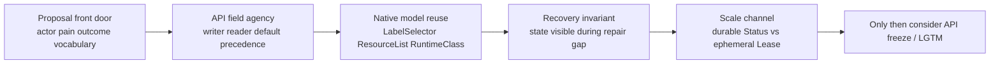

# Day46：RainbowMango Maintainer Review 方法研究

日期：2026-07-14

## 一句话结论

高质量 maintainer review 不是“多找 bug”，而是按顺序控制认知风险：先验证问题是否成立和 scope 是否正确，再确认公共命名、组件职责与既有机制，然后沿状态转换、错误、队列、finalizer、status 和测试追踪行为；只有这些证据闭合后才简短批准。

## 研究边界

本报告只分析 `@RainbowMango` 的公开 GitHub review 行为，不研究个人身份或非公开讨论。

- GitHub 账号公开创建时间是 2014-07-25。
- 本轮可逐条验证的 review 样本跨度为 2020-11 到 2026-07，接近 6 年。
- GitHub contributions API 显示最近一年共有 868 次公开 PR review contribution；最近返回的 100 条中包括 AgentCube 20 条、Karmada 15 条、Karmada Dashboard 51 条等。这里的 repo 分布只代表 API 返回的最近 100 条，不能外推为全部 868 条分布。
- AgentCube 搜索得到 24 个 `reviewed-by:RainbowMango` PR；大量记录只有 `/lgtm` / `/approve`，不能用于反推审查思路。

> 注释：用户提到其有七八年开源经验。本轮不直接把这个年限写成事实；我们只能证明 GitHub 账号始于 2014，以及选中的实质 review 语料覆盖近 6 年。经验年限与 review 方法应分别用证据说明。

## 采样与排除规则

有效方法样本共 15 个：

| 仓库 | PR | 类型 | 选择原因 |
| --- | --- | --- | --- |
| AgentCube | [#357](https://github.com/volcano-sh/agentcube/pull/357) | focused cleanup | 证明 scope discipline |
| AgentCube | [#366](https://github.com/volcano-sh/agentcube/pull/366) | proposal | 要求外部产品提供权威链接 |
| AgentCube | [#396](https://github.com/volcano-sh/agentcube/pull/396) | CI configuration | 使用成熟先例、追问 grouping rationale、理由成立后接受 |
| AgentCube | [#431](https://github.com/volcano-sh/agentcube/pull/431) | architecture proposal | 用户动机、feature/component naming、当前术语、external protocol reference |
| Karmada | [#4](https://github.com/karmada-io/karmada/pull/4) / [#6](https://github.com/karmada-io/karmada/pull/6) | controller/API | comment/log/API marker 与生成合同基础 |
| Karmada | [#34](https://github.com/karmada-io/karmada/pull/34) | finalizer | 单一职责：delete helper 不应顺便移除 finalizer |
| Karmada | [#59](https://github.com/karmada-io/karmada/pull/59) | status controller | helper/finalizer 去重、error/requeue、condition、status update-if-changed |
| Karmada | [#62](https://github.com/karmada-io/karmada/pull/62) | orphan cleanup | 延迟可观测性、GVK/GVR、命名、错误返回、算法注释 |
| Karmada | [#84](https://github.com/karmada-io/karmada/pull/84) / [#93](https://github.com/karmada-io/karmada/pull/93) | controller refactor | 明确 second round，结构问题未闭合时不因局部修正批准 |
| Karmada | [#7395](https://github.com/karmada-io/karmada/pull/7395) | cleanup classification | 证明 alleged slice bug 对 caller 不可见，纠正 bug 分类 |
| Karmada | [#7613](https://github.com/karmada-io/karmada/pull/7613) | taint manager | temporary/indefinite queue cost与 namespaced/cluster-scoped worker routing |
| Karmada | [#7640](https://github.com/karmada-io/karmada/pull/7640) | regression test | 先问 expected behavior，不接受错误 bug premise |
| Karmada | [#7732](https://github.com/karmada-io/karmada/pull/7732) | e2e flake | approval 链接 root-cause evidence，范围保持 test-only |

排除项：

- AgentCube #326、#363：reviewer 本人是 PR author，inline 主要是作者回复。
- #391、#393、#414、#420、#423、#436 等：只有批准或流程命令，保留为 outcome 证据，不用于推断方法。
- Dependabot 批量批准：证明 maintainer 承担门禁，但不提供可分析 reasoning。

## 方法一：先验证问题，再看修复

### 证据

- [Karmada #7395](https://github.com/karmada-io/karmada/pull/7395#pullrequestreview-4473590000)：reviewer 沿 `append()`、slice len 和 caller observation 判断所谓 aliasing bug 实际不可见，接受 cleanup，但拒绝错误 bug 叙事。
- [Karmada #7640](https://github.com/karmada-io/karmada/pull/7640#discussion_r3464422452)：先问 expected behavior 为什么不是 allow，而不是因为测试“防 panic”就默认 issue 正确。
- [AgentCube #357](https://github.com/volcano-sh/agentcube/pull/357#discussion_r3332276367)：明确“有道理，但超出本 PR scope”。

### 我们的改进

每次 review 先写一张四行卡片：

```text
Claimed problem:
Observable caller/user:
Expected contract:
PR scope:
```

卡片无法填写完整时，先验证 premise，不进入代码风格和修复方案审查。

## 方法二：从已有 owner / helper / precedent 开始

### 证据

- [Karmada #59](https://github.com/karmada-io/karmada/pull/59#discussion_r545801954) 直接指出相同 readiness helper 已在 util 包存在；随后又发现相似 finalizer constant。
- [Karmada #84](https://github.com/karmada-io/karmada/pull/84#discussion_r548823344) 对多个 controller 重复函数要求共同抽象。
- [AgentCube #396](https://github.com/volcano-sh/agentcube/pull/396#discussion_r3517204392) 先引用 Karmada 成熟 Dependabot 配置，要求 predictable schedule；但对 grouping 没有武断否决，而是[要求解释](https://github.com/volcano-sh/agentcube/pull/396#discussion_r3517380161)，作者说明减少 PR 噪音后明确接受。

### 我们的改进

从“这个写法对不对”升级为三个问题：

1. 这个 invariant 当前由谁拥有？
2. 仓库里是否已有 helper/finalizer/retry/config convention？
3. 若要新建，语义差异是否足以证明第二套机制合理？

## 方法三：共享抽象必须逐调用方验证

[Karmada #7613](https://github.com/karmada-io/karmada/pull/7613#discussion_r3557152654) 是最强样本。`enqueueBinding()` 同时服务 `ResourceBinding` 和 `ClusterResourceBinding`，却始终进入 namespaced worker；cluster-scoped key 最终用空 namespace Get 并静默失败。Reviewer 没停在 helper 局部，而是跨越：



他同时追问 indefinite 与 temporary toleration 对 queue rate 的影响，说明 correctness 与 performance 不是两轮独立审查，而是同一条事件路径的两个结果。

> 分析：这和 AgentCube 的 `Sandbox`/`SandboxClaim`、cluster-scoped SandboxPool、不同 status writer、不同 cleanup owner 高度相关。看到 shared helper 时不能只看类型能否编译，必须做 kind → scope → destination → owner 矩阵。

## 方法四：Controller Review 的核心是状态转换

[Karmada #59](https://github.com/karmada-io/karmada/pull/59) 的评论覆盖了完整 controller contract：

- finalizer 是否重复、为什么等待；
- transient error 与 valid unhealthy 是否分开；
- error 是否 return/requeue；
- condition 是否只在需要时更新；
- status 是否 compare-before-write；
- controller-runtime 是否已打印错误；
- log 是否包含 object identity。

[Karmada #62](https://github.com/karmada-io/karmada/pull/62) 又补充 scheduler readiness 可能延迟，因此需要 info log；错误信息要带 GVK/GVR 和 namespace/name；复杂块的 comment 应解释 algorithm，而不是没有信息量的旁白。

这不是 clean-code checklist，而是：状态变化、重试、API 写入和可观测性必须表达同一个 reconciliation model。

## 方法五：Review 是多轮收敛，不是一次找完

- [Karmada #84](https://github.com/karmada-io/karmada/pull/84#pullrequestreview-558767362) 明确写 `I need to review a second round.`；发现公共抽象缺失和函数承担太多逻辑后，没有因修掉局部 nit 就批准。
- [Karmada #93](https://github.com/karmada-io/karmada/pull/93#pullrequestreview-559426518) 同样声明需要 second round，并继续核对 worker 数量和触发模型。
- #84 最终关闭，转向更干净的 #106，而不是在旧 PR 上无限叠补丁。

### 我们的改进

后续大型 PR 分两轮：

1. Round 1：problem、scope、ownership、public contract、主要状态路径。
2. Round 2：作者修改后的语义保持、失败路径、测试因果性、clean code 和批准条件。

## 评论风格：短，但不是随意

稳定互动模式：

- 意图不明确时用问题，不替作者补背景。
- invariant 明确时给最小 suggestion。
- 作者给出合理 trade-off 后明确接受，不固守初始偏好。
- unrelated improvement 即使正确也不塞进 focused PR。
- 证据和范围闭合后直接批准，不制造评论数量。

我们不能照抄的部分：

- 2020 年部分评论只有 `typo`、`?` 或一句命令；对当前新贡献者上下文不足。
- 不能因为 maintainer 能凭长期上下文写短句，我们也省略触发路径和后果。
- Karmada 历史约定不能自动成为 AgentCube 约定，必须先验证两仓库共享模型。

## 对现有 AgentCube Review Skill 的升级

本轮新增：

- `scripts/maintainer_review_history.py`：按 reviewer + PR 列表提取 PR 结果、文件、review summary、inline、普通评论和作者回复；支持排除 reviewer authored PR。
- `references/maintainer-review-methods.md`：保存 maintainer-calibrated review 顺序、互动方法和误用边界。
- `review-patterns.md` 新增四条真实案例模式：problem premise、shared helper routing、status meaningful transition、existing ownership search。
- `SKILL.md` 增加历史 review corpus 的调用方式和阅读门槛。

## 过程阻塞

### Repo-wide review comment 分页不稳定

尝试使用：

```bash
gh api --method GET --paginate repos/volcano-sh/agentcube/pulls/comments
```

现象：仓库级全量分页耗时长，组合 `jq -s` 时没有稳定产出；第一次还因 `-f per_page=100` 未显式指定 GET，导致 `gh` 按 POST 请求并返回 404。

解决：改为先用 `reviewed-by:` 搜索确定 PR corpus，再由新脚本逐 PR 请求 reviews、review comments、issue comments 和 files。逐 PR 方式更慢，但证据结构清楚，也能正确关联作者回复和 PR outcome。

### 单元测试命令写法错误

首次执行：

```bash
python3 -m unittest .agents/skills/agentcube-pr-review/scripts/test_maintainer_review_history.py
```

现象：路径中的 `.agents` 被 unittest 当成空 module segment，返回 `ValueError: Empty module name`。

解决：直接执行测试文件；新脚本 2 tests 与既有 review surface 4 tests 全部通过，并通过 `py_compile`。

## 下一步

1. 在下一次真实 proposal review 前强制填写 problem card，并先跑 front-door gate。
2. 对 controller PR 先画 kind/scope/worker/writer matrix，再查错误和 status。
3. 作者 push 后执行第二轮 semantic-preservation review，不把第一轮评论已回复等同于 ready。
4. 继续观察 #431 maintainer review；只有出现新的、可泛化且不与现有模式重复的证据才升级 skill。

## 参考链接

- [RainbowMango GitHub profile](https://github.com/RainbowMango)
- [AgentCube reviewed PR search](https://github.com/volcano-sh/agentcube/pulls?q=is%3Apr+reviewed-by%3ARainbowMango)
- [Karmada reviewed PR search](https://github.com/karmada-io/karmada/pulls?q=is%3Apr+reviewed-by%3ARainbowMango)
- [AgentCube PR #431 maintainer review](https://github.com/volcano-sh/agentcube/pull/431#pullrequestreview-4692780216)

---

## 追加研究：`@zhzhuang-zju` 的 Issue / PR 写作方法

### 研究目标与边界

这部分研究的是公开 issue / PR 文本如何帮助协作者理解问题、划分任务和验证变更，不评价个人，也不把 Karmada 模板原样搬到 AgentCube。

2026-07-14 的 GitHub public search 快照显示：

- `author:zhzhuang-zju is:issue` 共 103 条，其中 80 条位于 `karmada-io/karmada`，另外包括 AgentCube、Karmada website/community 等仓库；
- `author:zhzhuang-zju is:pr` 共 479 条，其中 `karmada-io/karmada` 有 328 条；全局结果还混有 fork、cherry-pick、release 和文档发布 PR；
- 公开账号创建时间是 2021-03-23。本轮不使用 profile 数据推断身份、职务或非公开经验。

> 注释：GitHub search 总数是动态快照，会随新贡献变化。数量只能帮助确定采样面，不能直接证明写作质量。

### 采样方法

本轮精读 29 个样本，跨度为 2023-10 到 2026-07：

- 17 个 issue：bug、question、feature、umbrella、CI、flaky-test、LFX project 和跨仓库 AgentCube issue；
- 12 个 PR：早期 focused PR、proposal、bug fix、performance、API migration、admission validation、CI cleanup、deprecation 和跨项目文档修复；
- 主要仓库为 Karmada，同时加入 AgentCube 与 `kubernetes-sigs/agent-sandbox`，用于区分个人习惯与仓库模板。

采样工具会移除 HTML 隐藏模板注释和已知自动生成 summary block，再计算 reviewer-visible words、nonblank lines、heading、task、link 与 code fence；PR 额外记录 diff 大小、merge outcome 和第一条可见外部人工反馈。



> 分析：这里先分层再提炼，是为了避免只挑 merged PR 或长文。Merge 可能来自代码正确、maintainer 补充、仓库熟悉度或后续修改，不能反推初始正文的每个写法都值得复制。

### 样本统计

| 类型 | 样本数 | 可见词数中位数 | 范围 | 带任务清单 | 有可见外部人工文字反馈 |
| --- | ---: | ---: | ---: | ---: | ---: |
| Issue | 17 | 254 | 156-441 | 9 | 13 |
| PR | 12 | 138 | 57-318 | 不适用 | 9 |

12 个 PR 中 11 个已 merged，唯一 open 样本是 performance PR [#7175](https://github.com/karmada-io/karmada/pull/7175)。这组数据证明了所选样本中 issue 通常比 PR 承担更多上下文，但不能外推为全部 479 个 PR 的总体分布。

> 注释：可见词数只衡量 review 成本，不衡量正确性。61 词可以准确描述一个小修复，也可能严重遗漏 API migration；318 词可以提供必要 benchmark，也可能重复 issue 内容。

### Issue 方法一：标题直接暴露现象或能力

高信号标题通常能在不打开正文时说明对象和失败：

- [Karmada #7135](https://github.com/karmada-io/karmada/issues/7135)：`Job.status.startTime immutability blocks status aggregation...` 同时给出字段、约束和影响；
- [Karmada #7550](https://github.com/karmada-io/karmada/issues/7550)：`Multi-component workloads may be scheduled to clusters with insufficient resources` 描述用户可见错误；
- [AgentCube #401](https://github.com/volcano-sh/agentcube/issues/401)：`Codegen Check path filter causes false pass` 描述 CI 机制和后果；
- [AgentCube #417](https://github.com/volcano-sh/agentcube/issues/417)：`publish release artifacts only for tags` 把期望策略放进标题。

可复用规则：标题使用 `affected object + observable failure/capability`。`[Umbrella]`、`[LFX]`、`[Feature]` 只在它确实改变 issue 类型时保留，不堆叠标签。

### Issue 方法二：用最短因果链连接证据与影响

[Karmada #7112](https://github.com/karmada-io/karmada/issues/7112) 从 quota plugin 所需 namespace，追到 gRPC request，再追到空的 `PodTemplateSpec.Namespace`，最后用日志证明空 namespace 导致跨 namespace quota listing。它不是简单贴错误，而是形成：

```text
observed failure -> required input -> actual source -> missing value -> wrong query scope
```

[Karmada #7135](https://github.com/karmada-io/karmada/issues/7135) 则用三个 member cluster 的时间值解释 first report 与 later earlier report 的 race，再连接 Kubernetes 对 running Job `startTime` immutable 的合同。

[AgentCube #401](https://github.com/volcano-sh/agentcube/issues/401) 把 #367 引入的 `go.sum` 冗余、path filter skip 与 #393 后续暴露串成 latent inconsistency 的时间链。

可复用规则：bug issue 不只要 `What happened`，还要一条能被 reviewer 复算的 causal path。若链路未被日志、源码或复现证明，明确写成 hypothesis，不能把猜测包装成 root cause。

### Issue 方法三：Umbrella 是可维护台账，不是愿望清单

- [Karmada #5048](https://github.com/karmada-io/karmada/issues/5048) 把 CLOMonitor maturity check 拆成 24 个 checkbox，并回填 owner、PR 与完成状态；
- [Karmada #6841](https://github.com/karmada-io/karmada/issues/6841) 要求每个 flaky case 提供 test name、error symptom 和 CI link，再把修复 PR 回填；
- [Karmada #7269](https://github.com/karmada-io/karmada/issues/7269) 按 macOS parity、Killercoda scenarios 等独立交付物组织 LFX 项目；
- [Karmada #7390](https://github.com/karmada-io/karmada/issues/7390) 将 proposal、API、scheduler、webhook、E2E、docs 串成 feature delivery graph；
- [AgentCube #392](https://github.com/volcano-sh/agentcube/issues/392) 将 workflow hardening 拆到具体 workflow 文件。

> 分析：好的 umbrella body 同时是范围边界和并行协作协议。每个 task 应能独立认领、review、关闭；否则 checkbox 只是排版，没有降低冲突风险。

维护要求同样重要。#7390 中 maintainer 提醒 tasks 要与 final proposal 保持一致，作者随后更新正文。我们应把“正文是否仍代表当前共识”加入 umbrella review，而不只检查 checkbox 是否勾选。

### Issue 方法四：讨论回复直接回答问题，并及时切 scope

[Karmada #7055](https://github.com/karmada-io/karmada/issues/7055) 的讨论用 quote 逐条回答 style guide 放置位置、AI tool 是否能引用 repo-local file，并纠正“不能通过 web link”与“能读取同仓库路径”的语义混淆。

[Karmada #7135](https://github.com/karmada-io/karmada/issues/7135) 在正文说明 immutability failure 后，把 initial aggregation 与 suspended/resumed lifecycle 分成 Part 1/Part 2；当讨论确认 lifecycle 更大时，明确另开 issue 跟踪，而不是把当前 bug fix 扩成完整 Job lifecycle redesign。

可复用规则：回复时引用 exact question，第一句给直接答案，再给必要证据；新发现若改变当前 scope，就更新 body 或拆 follow-up issue。

### PR 方法一：从旧失败写到新行为

[Karmada #7138](https://github.com/karmada-io/karmada/pull/7138) 是最完整的 focused bug-fix body：

1. 说明 first-reporting 与 later-earlier member status 的 race；
2. 说明 Kubernetes immutable validation 导致 persistent error loop；
3. 说明新逻辑只在 control-plane `startTime == nil` 时设置；
4. 明确 suspended/resumed lifecycle out of scope；
5. 给出准确 release note。

这比“fix race condition”多出的信息都改变 review 决策：为什么错、修复保持什么 invariant、什么尚未修。

### PR 方法二：大兼容变更必须写迁移合同

[Karmada #7298](https://github.com/karmada-io/karmada/pull/7298) 对 91 文件 protobuf migration 解释了 Kubernetes 1.35/1.36 的 `ProtoMessage()` 变化、temporary build tag、peer bytes fields、wire compatibility、helper layer 与 deprecated fields，并把用户可见字段变化写入 release note。

可复用规则：API / generated-code / dependency migration 的正文至少回答：旧合同为什么失效、混合版本如何工作、何时删除兼容层、调用方需要做什么。文件很多不是长正文理由，兼容合同才是。

### PR 方法三：性能结论要带 workload scale

[Karmada #7175](https://github.com/karmada-io/karmada/pull/7175) 给出 workload 数量、namespace 分布、dependent resource 数量、重启场景和 before/after：existing-resource reconciliation 11 分钟降到 5 分钟，single match 100ms 降到 0.9ms。

> 分析：这组样本仍缺少多轮重复、硬件与 p95/p99，因此可作为 reviewer attention evidence，不能直接当完整 benchmark。AgentCube 继续要求环境、方法、原始记录和 limitation。

### PR 方法四：Issue 承担全局图，PR 只说明当前 delta

[Karmada #7078](https://github.com/karmada-io/karmada/pull/7078) 用 proposal 解释 hybrid-cloud 用户问题；后续 [#7386](https://github.com/karmada-io/karmada/pull/7386)、[#7430](https://github.com/karmada-io/karmada/pull/7430) 分别交付 API 与 validation，并由 umbrella [#7390](https://github.com/karmada-io/karmada/issues/7390) 维护端到端任务图。

[agent-sandbox #974](https://github.com/kubernetes-sigs/agent-sandbox/pull/974) 则展示小型跨项目 PR 的适配能力：一句话指出 manual PDB example 引用了缺失的 SandboxWarmPool，并说明补齐 example，无需复制整套 AgentCube compatibility 背景。

### 不应复制的部分

1. **Merge 不等于 body 完美。** API PR #7386 有 13 个文件、823 行新增，但可见正文只有 61 词，没有 upgrade/skew、generated artifacts 或验证说明。
2. **不要保留空模板槽位。** #7561 的 rationale 清楚，但 issue link 是空的 `Fixes #`，special reviewer notes 与 release note 也为空；AgentCube 应写 `Refs`/`Fixes` 的真实关系和 `NONE`。
3. **不要用 release note 替代正文。** #7590 准确列出 removed fields，但正文没有解释 removal timing、compatibility gate 和验证。
4. **不要复制标题语法错误或大小写漂移。** 样本中存在 `waitingObkects`、`depercated`、`Parts of` 等拼写/格式问题；学习语义组织，不复制表面风格。
5. **不要把 proposed fix 写成唯一问题定义。** #7693 很早提出 `--cert-mode=rotate`；更稳妥的 AgentCube issue 应先固定 user contract、secret ownership、failure/rollback，再把 flag 作为候选方案。
6. **不要留下虚假的环境完整性。** 多个 bug issue 保留空的 environment 字段。未知可以明确写 `not captured`，但不能让模板存在看起来像证据齐全。

### 对 AgentCube Skills 的升级

新增 `.agents/skills/agentcube-issue-discussion/scripts/contributor_writing_history.py`：

- 输入多个 `owner/repo#number`，验证 expected author；
- 清除隐藏模板与已知 generated summary；
- 输出可见正文结构、任务/链接/代码块、issue/PR outcome 与首条外部人工文字反馈；
- 明确提示 template confound 和 merge-outcome limitation。

新增 4 个单元测试，覆盖：

- 隐藏模板和 generated block 清理；
- 粗体模板 heading、task 与 code fence 统计；
- author/bot/command-only 过滤与 item reference parsing。
- GitHub REST `Link` header 的 next-page 解析。

`concise-issue-writing.md` 新增 evidence-to-work shape；`concise-pr-writing.md` 新增 problem-to-behavior shape，并同时记录 thin API PR、空验证和不完整 link 等反例。

### 过程阻塞与修正

#### 自动化账号被误识别为人工反馈

第一次前向测试中，`codecov-commenter` 和 `k8s-ci-robot` 的 API user type 不能只靠 `[bot]` 后缀可靠过滤，脚本把 coverage/welcome comment 当成 first external human response。

修正：增加常见 automation login pattern，并把 inline review comments 纳入候选；若只有 bot 或 command-only review，则明确输出 `none found`，不伪造互动证据。该 pattern 仍是启发式过滤，遇到未知 automation account 时必须回读账号和正文，不能把脚本分类当作身份事实。

#### 模板结构统计漏掉粗体字段

Karmada issue / PR 模板常用 `**What happened**:`，不是 `### What happened`。第一版只识别 Markdown `#` heading，导致结构统计为空。

修正：同时识别 ATX heading 与整行粗体 section label，单测锁定。

#### 长管道首次无统计输出

29 项 JSON 聚合第一次完成但终端没有返回文本，不能确认统计结果。

修正：先用 2 项样本验证 script -> JSON -> `jq` 管道，再拆成 17 issue 与 12 PR 两批运行；两批均返回 exit 0 和完整统计。报告只记录拆分后的结果。

### 下一次应用

在起草 AgentCube issue 时先填写：

```text
Observable problem/capability:
Decisive evidence:
Expected contract or decision:
Independent tasks / current owner:
Unknowns and proposed solution status:
```

在起草 PR body 时先填写：

```text
Old observable behavior:
New contract-level behavior:
Issue relationship:
Validation evidence:
Compatibility / non-goal / residual risk:
```

然后再套 AgentCube 官方模板和 concise budget。个人历史用于校准，不替代仓库规则。

### 追加参考链接

- [zhzhuang-zju GitHub profile](https://github.com/zhzhuang-zju)
- [Karmada authored issues search](https://github.com/karmada-io/karmada/issues?q=is%3Aissue%20author%3Azhzhuang-zju)
- [Karmada authored PRs search](https://github.com/karmada-io/karmada/pulls?q=is%3Apr%20author%3Azhzhuang-zju)
- [AgentCube #401](https://github.com/volcano-sh/agentcube/issues/401)
- [Karmada #7135](https://github.com/karmada-io/karmada/issues/7135)
- [Karmada #7138](https://github.com/karmada-io/karmada/pull/7138)
- [Karmada #7298](https://github.com/karmada-io/karmada/pull/7298)
- [Karmada #7390](https://github.com/karmada-io/karmada/issues/7390)

---

## 追加学习：Production Reachability Gate 与 Karmada PR #7623

### 为什么 E0-E4 还不够

原有 review skill 用 E0-E4 表达证据强度：源码机制、focused test、baseline-versus-patch counterfactual 逐级增强。这条轴仍然必要，但它没有单独回答另一个问题：测试里的 trigger 是否能由真实系统产生。

一个 fake client 可以注入任意 error，并做出很强的 E4 counterfactual：旧代码失败、补丁后通过。但如果真实 client 永远不会返回这种 error，或测试状态被 validation、lock、ownership、controller ordering 排除，这个 E4 仍然不能证明 production reachability。反过来，即使没有事故日志，源码和 Kubernetes API 合同也可以证明一个真实 writer conflict 能发生。

> 注释：`production reachability` 不是“必须先在线上出事故”。它要求证明 trigger 有真实 producer、前置状态可由受支持操作到达，并且 retry/resync/restart/cleanup 不会在合同允许的时间内自动修复后果。

因此，证据强度与生产可达性是两条正交轴：

| 分类 | 最小证据 | 可以说什么 | Issue / review 边界 |
| --- | --- | --- | --- |
| Observed bug | 真实日志、CI、live/e2e reproduction 同时覆盖 trigger 与 impact | `发生了`，但影响时长仍按观测范围描述 | 可以写 bug；若由当前 PR 引入且影响达到门槛，可以 blocking |
| Reachable latent bug | `CODE` / `DOC` 证明真实 producer 和可达前置状态，focused test 证明坏结果，无真实 occurrence | `可以发生`、`尚未观察到实例` | 可以作为 source-proven bug 风险；常规外部错误破坏 correctness/safety 时可以 blocking |
| Hypothetical scenario | 只有 mock、手工对象或想象时序，producer 或前置状态未闭合 | `如果该状态可达，则...` | 不得作为 bug issue 或 blocking finding；改成 question、evidence gap 或 test idea |

> 分析：`can occur` 与 `has occurred` 必须分开。把 latent bug 写成 incident 会夸大证据；把所有未观察问题都降成 hypothetical，又会漏掉源码和接口合同已经证明的真实 correctness 缺陷。

### 可执行 Gate



执行顺序不能倒置：

1. 先拆开 trigger 与 bad outcome，包括 error、timing、concurrency 和 prior state。
2. 找真实 producer；mock return 不是 producer。
3. 检查 validation、lock、ownership、ordering、feature gate 和所有 writer，证明前置状态可达。
4. 追 retry、resync、restart、later event、rollback、cleanup，判断状态是否持续错误。
5. 可达性闭合后再做 counterfactual，并尽量注入真实边界允许的 error/state。
6. 最后才决定 observed、reachable latent 或 hypothetical，以及是否足以 blocking。

### #7623 为什么是 Reachable Latent Bug

Karmada PR #7623 的 finding 不是“mock 能返回 error，所以线上一定坏了”。完整证据链是：

1. 新 target fingerprint 在 executor rebuild 和 rule-history status 写入完成前就提交到进程内 cache。
2. 第一次 `Status().Update` 失败后，下一次 reconcile 看到 fingerprint unchanged，提前返回并跳过缺失的 status side effect。
3. fault-injected focused test 证明了这个 post-trigger consequence：第一次 update error，第二次 reconcile 返回 `nil` 且不再尝试 status write。
4. `Status().Update` 是真实 Kubernetes API 写边界，不是 fake-only 方法；Conflict、timeout 和 transport/server error 都属于边界允许的错误。
5. 另一个 cron status writer 会读取并写同一个对象的 `ExecutionHistories`，因此 stale `resourceVersion` / concurrent status write 的前置条件可由受支持操作产生。
6. 当前没有生产日志、CI artifact 或真实集群 reproduction 证明该顺序已经发生。

结论应准确写成 **reachable latent correctness bug**：真实触发路径与错误后果可达，但没有 observed production incident。它仍可作为 blocking finding，因为 controller 必须正确处理常规 API 写失败，不能让 retry 被过早提交的 cache marker 吞掉。

> 分析：通用 injected error 只证明“这个错误分支之后会怎样”，不能宣称复现了具体的 Kubernetes Conflict。更强 regression 应使用 `apierrors.NewConflict`，最好在 `envtest` / real API server 中让两个 writer 先读同一版本，由 writer B 更新 status 后让 writer A 用 stale `resourceVersion` 提交，再验证下一次 reconcile 确实重试并保留双方 status 字段。

本次 AgentCube 吸收没有修改 #7623 的既有 upstream review，也没有向 AgentCube upstream 发布 issue、comment 或 finding。

### AgentCube Overlay 的改动

- `agentcube-pr-review/SKILL.md`：在 evidence ladder 后新增 Production Reachability Gate，明确 evidence strength 与 reachability 正交，并要求 finding 输出 reachability class。
- `agentcube-pr-review/references/agentcube-review-checks.md`：要求区分 trigger reachability 与 consequence；Kubernetes concurrency regression 优先使用真实 Conflict/stale `resourceVersion`。
- `agentcube-pr-review/references/review-patterns.md`：新增 `Fault injection does not prove production reachability`，保留 producer、precondition、recovery 和 false-positive guard。
- `agentcube-issue-discussion/SKILL.md`：在 bug title、label、severity、requested fix 之前强制执行 Bug Reachability Gate。
- `agentcube-issue-discussion/references/concise-issue-writing.md`：Observed 与 latent 使用不同措辞；mock-only 场景不套 bug template。
- `open-source-contribution-format-standard.md`：官方 bug template 的本地使用规范同时容纳 observed reproduction 与 source-proven latent evidence，不再强迫 latent bug 假装成已观察事故。

没有新建第三套 skill。PR review 与 issue writing 分别拥有 review blocker 和 upstream bug publication 的门禁，详细模式继续放在 reference，避免主 `SKILL.md` 膨胀。

### 校验与 Fresh-Context Forward Test

结构与现有工具验证：

```text
quick_validate.py agentcube-pr-review: PASS
quick_validate.py agentcube-issue-discussion: PASS
agentcube-pr-review script tests: 6/6 PASS
agentcube-issue-discussion script tests: 4/4 PASS
git diff --check: PASS
```

三个 fresh-context Agent 只拿到更新后的两份 skills 和各自原始场景，没有收到预期分类：

| 原始场景 | 独立结论 | 关键边界 |
| --- | --- | --- |
| live k3s 记录真实 409、两次 retry no-op、Session `Creating` 五分钟且 Router 503 | Observed bug；PR attribution 成立时可 P1/blocking | 只能说“至少五分钟”，未验证 restart/later event 前不得说 permanently stuck |
| 真实 `Status().Update`、独立 status writer、API contract 允许 Conflict，但只有 generic fake error test | Reachable latent bug；当前 PR 引入时可 blocking | 明说无 production/CI/e2e occurrence；建议 two-writer envtest 触发真实 Conflict |
| 手工插入构造器禁止的 empty owner，加 mock-only `ErrHalfResumed` | Hypothetical；不得开 bug 或 blocking | 先用受支持 Store/session API 和真实 WorkloadManager error contract 验证 producer |

> 注释：这些 forward tests 验证的是 gate 能否把三类证据传播到 issue/review 决策，并不证明 #7623 已在线上发生，也不替代真实 API server regression。

### 过程修正与后续使用

最初在 `/home/agentcube` 内找不到用户提到的源 skill；继续做本机 local-first 检索后，在 `/tmp/karmada-intern-worktree` 找到已验证版本。精读源 gate 后补回了摘要中容易漏掉的 recovery/self-heal 步骤，并把 Karmada controller 术语映射为 AgentCube 的 Store writer、CR spec/status writer 和 lifecycle cleanup，而不是直接复制目录。

以后每个潜在 bug 先填写：

```text
Exact trigger / bad outcome:
Observed occurrence:
Real producer / interface contract:
Reachable preconditions and writers:
Retry / resync / restart / cleanup recovery:
Classification and wording boundary:
Production-equivalent regression:
```

只有这张卡能闭合 production path，才进入 bug issue 或 blocking finding 写作。

---

## 追加学习：PR #431 第二轮从 API Freeze 继续向恢复与规模推进

### 证据边界

2026-07-15 再次同步 [AgentCube PR #431](https://github.com/volcano-sh/agentcube/pull/431) 的完整 discussion、review comments、current proposal 和 checks。本轮固定证据为：

- head `f380208b94ed9ff0ddb8e68f66aed24c7f6d4672`，base `fa254b15fec43480a343a60cdf5773156c72b80a`；
- PR `OPEN / MERGEABLE`，没有 `lgtm`、`approved` 或正式 review decision；
- `@RainbowMango` 发起的 17 个 root threads 中，8 个 current-diff unresolved、1 个 outdated unresolved、8 个 resolved；
- 7 月 15 日新增的 8 条 current thread 全部围绕 API 字段、Kubernetes 原生类型、字段合同和节点 runtime 前置条件；
- 旧 manifest/status thread 虽被 UI 标记 resolved，Mango 的最新追问仍暴露了 recovery gap 和 heartbeat scale 两个未闭合设计问题。

> 注释：GitHub 的 `resolved` 只表示对话被折叠，不表示 reviewer 已接受正文，更不等于整个 PR 获得批准。本轮作者自行 resolve 了若干仍有技术分歧的 thread，因此必须回读当前正文、最后回复和 review decision 三项证据。

### Review 关注点为什么发生了变化

第一轮 review 先修 proposal front door：功能名、管理员动机、组件名、外部协议链接和 Phase/manifest 基本解释。第二轮开始审查这个设计能否形成长期 API：字段是否正交、是否有真实 consumer、是否复用 Kubernetes 已有语义，以及故障恢复和心跳在大规模下是否仍保护原目标。



> 分析：这不是从“重要问题”退化成“字段命名”。一个 `v1alpha1` 字段进入 CRD 后会传播到 OpenAPI、generated client、RBAC、controller、upgrade 和用户配置。API freeze 前删除冗余字段，比实现后背兼容债务更便宜。

### 方法一：每个公共字段必须拥有独立的行为能力

Mango 先问 [`Selector` 与 `NodeSelector` 的关系](https://github.com/volcano-sh/agentcube/pull/431#discussion_r3584268549)。`metav1.LabelSelector` 已包含 `matchLabels` 和 `matchExpressions`，额外 `map[string]string` 没有定义 AND/OR、优先级、冲突或独立 owner。作者明确承认这是 redundant design，但当前 head 尚未修改。

随后他问 [`NodeCtlEndpoint` 是否真的应由用户填写](https://github.com/volcano-sh/agentcube/pull/431#discussion_r3584330267)。proposal 自己说明真实地址来自 host 启动参数 `--node-ctl-socket`，spec 字段只是 informational/future。这个字段没有 authoritative consumer，却让用户误以为修改 CRD 能改变运行时 endpoint。

以后看到 proposal API 字段，先填：

```text
Field:
Authoritative writer:
Current reader / reconciler:
Distinct behavior enabled:
Unset / zero / nil behavior:
Related-field precedence or conflict:
Why this must be public now:
```

只有 distinct current behavior 成立，字段才值得进入 API。未来设想可以写在 non-normative design note，不应先占一个 inert spec 字段。

### 方法二：开放维度先找 Kubernetes 原生扩展类型

当前 `ResourcePolicy` 把 CPU 和 memory 写成两个字段。Mango 指出它不能自然表达 GPU、hugepages 或 vendor resource，并建议使用 [`corev1.ResourceList`](https://github.com/volcano-sh/agentcube/pull/431#discussion_r3584314319)。本地 `go doc` 验证其定义为：

```go
type ResourceList map[ResourceName]resource.Quantity
```

作者用“未来可能支持百分比”解释保留 `ResourcePolicy` 名称，但没有回答 ResourceList 扩展性。绝对量和百分比是两种不同合同：后者还需要基数、舍入、上下界、Node capacity 变化后的重算与互斥规则。不能用一个模糊名字代替模式设计。

> 分析：原生类型优先不是机械复用。若维度确实是封闭集合，而且每个字段有不同 ownership、validation 或 lifecycle，显式字段更清楚；只有当新 Kubernetes resource name 会迫使 schema/client 每次升级时，`ResourceList` 才是正确的扩展模型。

### 方法三：Self-healing 要检查恢复窗口，而不只是最终状态

作者为 manifest 删除增加了定期重写，但 Mango 继续沿时间线检查：kubelet 发现 manifest 消失后会立即停止 Static Pod，scheduler-visible reservation 随之释放；普通 Pod 可能先占用容量，随后恢复的 Static Pod 反而 admission 失败。详见 [manifest recovery thread](https://github.com/volcano-sh/agentcube/pull/431#discussion_r3585155189)。

作者回复这是 destructive operation constraint。这个回答可以形成一种边界，但必须二选一：

- 若支持 manifest self-healing，就要说明恢复窗口如何保持 reservation，或如何进入可观测的 degraded/terminal 状态并安全恢复；
- 若手工删除 manifest 明确不受支持，就应删除“与 mirror Pod 一样自动恢复”的连续性承诺，把它写成限制。

> 注释：eventual convergence 只证明最后重新出现了对象；它没有证明中间的容量、ownership、identity 或 admission 不变量一直成立。

通用检查顺序是：

```text
failure -> detection delay -> visible intermediate state
        -> competing actor action -> repair attempt
        -> repair admission/conflict -> final invariant
```

### 方法四：按语义和频率选择状态通道

proposal 让每个 node agent 每 30 秒 SSA Apply Pool status。规模为 `N` 个节点时，仅 heartbeat 就是约 `N / 30` writes/s；1 万节点约 333 writes/s，还未计算 controller sweep、condition transition 和 watch fan-out。

作者说机制“类似 kubelet”，Mango 进一步追问为何不复用 kubelet 的 [`Lease` heartbeat](https://github.com/volcano-sh/agentcube/pull/431#discussion_r3585166678)。Kubernetes 官方 [Lease 文档](https://kubernetes.io/docs/concepts/architecture/leases/) 明确说明 kubelet 用 `coordination.k8s.io/Lease.spec.renewTime` 传递 node liveness。

2026-07-15 15:29 CST，作者在该 thread 回复 `good suggestion`。这表示方向得到口头认可，但 head 仍是 `f380208`，proposal 尚未增加 Lease object、status/Lease 分工、RBAC、expiry 或测试合同，因此状态应记录为 `acknowledged, not implemented`。

可复用的拆分是：

- Lease：高频、紧凑、短生命周期的 liveness/freshness；
- CR status：`Ready`、`Degraded`、resource applied、failure reason 等语义转换；
- controller：负责 Lease expiry 的时间驱动重算，因为“时间过去”本身不一定产生 watch event。

Lease 不是无条件答案。仍需定义 name/namespace、RBAC、per-node identity、renew jitter、expiry threshold 和规模预算；若目标规模小，或完整 status 必须原子续约且实测负载可接受，status heartbeat 仍可能合理。

### 方法五：作者回复与 UI 状态都必须二次验证

这轮有三个清楚的互动样本：

1. 作者对 component rename 给出“等待更广讨论”的合理 scope 解释，Mango直接回复 `Fair enough`，没有为了坚持建议继续拉扯。
2. 作者说 containerd Task v2 reference 已 `done`，Mango实际打开后发现是 [dead link](https://github.com/volcano-sh/agentcube/pull/431#discussion_r3585039966)。当前有效的上游入口是 [containerd runtime v2](https://github.com/containerd/containerd/blob/main/docs/runtime-v2.md)。
3. 多个 thread 被 resolve，但 Lease、manifest recovery 和 deprecated `node-ctl` vocabulary 仍无闭合答案。

因此 review loop 应使用：

```text
author reply -> current diff -> actual link/test/runtime contract
             -> reviewer acceptance or remaining disagreement
```

不能使用：

```text
author says done OR thread resolved -> assume fixed
```

### RuntimeClass 回答的精确边界

作者回答“无需修改 kubelet configuration，因为 shim 注册在 containerd”方向基本正确，但“不需要 kubelet 特殊配置”不等于“不需要节点前置条件”。Kubernetes 官方 [RuntimeClass 文档](https://kubernetes.io/docs/concepts/containers/runtime-class/) 要求：

- Node 的 CRI implementation 先配置对应 handler；
- cluster 创建匹配的 RuntimeClass object；
- kubelet 根据 `runtimeClassName` 选择 handler，并通过 CRI 传给 container runtime。

因此 proposal 仍应说明 containerd handler、shim binary、daemon、RuntimeClass object、目标 Node readiness/label 和真实 kubelet+containerd spike。这个结论属于节点安装合同，不是说 kubelet 要增加一个 AgentCube 专用配置项。

### 对 Review Skill 的增量

本轮没有扩张主 `SKILL.md`，只更新按需 reference：

- `maintainer-review-methods.md`：增加 API field agency、native type search、Lease cadence、恢复窗口和 resolved-thread 复核；
- `agentcube-review-checks.md`：增加完整字段合同、开放维度、self-healing gap 和 liveness/status 分离检查；
- `review-patterns.md`：新增 public field agency、native extensible type、recovery-window invariant 三个模式；
- 现有 `Status reconciliation should write only meaningful transitions` 合并 Lease/QPS 增量，不再创建重复 pattern。

没有把 `PlaceholderPod` 命名、单次 RuntimeClass 回答或 selector immutable 理由各自建成模式：这些仍可由 API naming、limitations 和 lifecycle gates 覆盖，且部分 thread 尚未收敛。

### 过程阻塞与并行安全

本轮出现四个需要保留的过程信号：

1. 直接打开 GitHub PR 页面返回 `TimeoutError`；改用本地 `thread_brief.py`、GitHub REST/GraphQL 和 `gh pr view` 获取权威 conversation/state。
2. `git fetch upstream refs/pull/431/head:refs/remotes/upstream/pr/431` 因作者 force-push 返回 non-fast-forward rejection；只对专用 remote-tracking ref 使用显式 `+refs/pull/431/head:...`，没有切换或改写工作分支。
3. `gh pr view` 不支持 `baseRefOid` 字段；改用 REST PR 对象的 `.base.sha`，没有从 merge state 猜基线。
4. 工作树中出现另一条并行任务正在修改 Day44 #431 报告并生成 draw.io 资产。本轮不修改、不删除、不暂存这些文件，只更新 Day46 与 review skill，避免覆盖并行成果。
5. 首次用 `python3 -m unittest .agents.skills.agentcube-pr-review...` 运行测试时，带连字符的目录无法成为 Python module，报 `ValueError: Empty module name`；改为直接执行两个 `test_*.py` 文件，2 个 history tests 与 4 个 surface tests 全部通过。

### 当前结论

Mango 的最新 review 尚未完成，不能写成 maintainer consensus 或 LGTM。当前 proposal 可以继续做 CRD/controller happy-path 骨架和 runtime feasibility spike，但现有 selector/resource/endpoint/comment contract、manifest recovery guarantee 和 heartbeat channel 仍不足以冻结完整 `v1alpha1`。

我们的学习重点不是复制他的短句，而是复制证据顺序：先问字段是否有 agency，再找成熟原生模型；对“自愈”追完整恢复窗口；对高频状态先算规模成本；最后回读实际产物而不是信任 `done` 或 resolved UI。

## 追加学习：Karmada PR #7764 的 Review 可理解性与可视化 Gate

2026-07-16 继续学习 Karmada intern commit `462c6acd8`。这次经验不是“多画图更专业”，而是一次真实 review miss：PR #7764 作者分别在 fast-wait 和 retry thread 明确表示难以理解。两条评论的技术方向并非完全错误，问题在于关键因果桥只存在于 reviewer 的本地报告和聊天上下文中，评论本身只留下抽象结论与 UID、generation、`handleErr`、`Forget` 等术语。

> 分析：line anchor 只能说明“评论放在哪里”，不能替代“为什么这里有问题”。礼貌的 `Could ...?` 也只负责提出 action，不能替代 observation、counterexample 和 reasoning。

因此 AgentCube review workflow 新增两道相邻但不同的 gate：

1. **Comprehension Gate**：非平凡评论按 `observation -> concrete counterexample -> reasoning -> action` 自包含；反驳推断时明确写出 signal 与 claim，例如“单次日志命中”不等于“运行时没有 retry”。
2. **Visualization Gate**：涉及三个以上 actor/state/step、竞争原因、retry/cleanup/recovery 时序或 current/proposed 节点变化时，默认比较一个 4-10 节点 inline Mermaid 与 prose，选择认知成本更低的表达。

图的结构固定为“一句 finding -> 最小关系图 -> 一句 evidence boundary 与 action”。图用来替换原本需要读者脑补的箭头和顺序，不是在长评论后再追加一个附件。单一局部条件仍用一两句文字；作者说不理解时，应从具体反例重写，而不是继续叠加术语、链接或更大的架构图。

> 注释：GitHub 可以直接在 Pull Request、Issue 和 Discussion 中渲染 fenced Mermaid。一次性 upstream comment 的 exact fenced block 可以作为本地待审批草稿的 canonical source，不强制额外生成 `.mmd + PNG`；报告、proposal 或可复用证据仍保存 canonical `.mmd` 和渲染图。

current/proposed 对比还增加了稳定视觉语义：两侧保持相同方向、节点顺序和标签；current/unchanged 使用中性色，changed/new 使用克制强调色，open question 使用琥珀色，只有 material risk 使用红色。颜色必须由 `Current`、`Changed`、`Risk` 等文字、边框或线型重复表达，不能成为唯一信息载体。

这条规则还有证据边界：会议、日志、实验或研究综合图必须同时说明 source supports、does not establish 和 provenance limitation。Mermaid 让关系显得确定，反而更需要防止把 hypothesis 画成事实。

### 对 AgentCube 的选择性迁移

- `project-mermaid` 同步 Karmada clean commit `462c6acd8` 的 inline review mode、proposal-change 模板和 preview；
- `agentcube-pr-review` 新增 comprehension/visualization gates，并在 pattern library 固化真实 miss 与 false-positive guard；
- `agentcube-pr-management` 把两道 gate 接入 exact-text posting approval，要求报告 Mermaid source 和本地 render/syntax 状态；
- 不复制 Karmada #7764 的具体日志结论，也不把 hard-wrap 风格偏好升级为 AgentCube correctness blocker。

AgentCube #387 的 comment 清理提供了另一侧反例：把完整 file rationale、调试时间线和测试矩阵搬进 inline comment 会淹没 reviewer；Karmada #7764 则说明过度压缩成术语也会让作者无法补全因果。新的目标不是“更长”或“更短”，而是让评论只保留完成当前判断所需的最小自包含模型。

### 验证

三个 skill 的 quick validation、renderer Python compile/CLI help 和 `agentcube-pr-review` 的 6 个脚本测试均通过。data-flow、sequence 和新增 proposal-change 三个模板使用官方 `@mermaid-js/mermaid-cli@11.16.0` 的显式 npx backend 成功白底渲染；proposal preview 为 `1531x554`，重新渲染与 bundled PNG byte-identical，原图检查无文字裁切、节点重叠或歧义箭头。

两场 fresh-context teach-back 分别生成 live API / stale informer / rollback 的 sequence comment，以及 current delete-first / proposed target-first 的 comparison comment。第一份 exact source 初次渲染失败：sequence `Note` 中的分号被 Mermaid 当作语句分隔符，报 parse error；改为 `<br/>` 后得到 `769x487` PNG。第二份直接得到 `1118x618` PNG。两张原图均无裁切、重叠或不连贯箭头，且都保留 finding、evidence boundary 和 action。这个失败说明 syntax gate 必须验证最终准备发布的 fenced source，不能只看草稿结构；对应 troubleshooting 已写回 `project-mermaid`。本轮没有发布任何 upstream comment。
