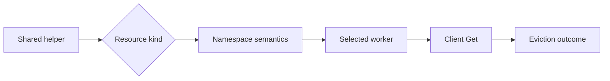

# Day46：RainbowMango Maintainer Review 方法研究

日期：2026-07-14

## 一句话结论

高质量 maintainer review 不是“多找 bug”，而是按顺序控制认知风险：先验证问题是否成立和 scope 是否正确，再确认公共命名、组件职责与既有机制，然后沿状态转换、错误、队列、finalizer、status 和测试追踪行为；只有这些证据闭合后才简短批准。

## 研究边界

本报告只分析 `@RainbowMango` 的公开 GitHub review 行为，不研究个人身份或非公开讨论。

- GitHub 账号公开创建时间是 2014-07-25。
- 本轮可逐条验证的 review 样本跨度为 2020-11 到 2026-07，接近 6 年。
- GitHub contributions API 显示最近一年共有 868 次公开 PR review contribution；最近返回的 100 条中包括 AgentCube 20 条、Karmada 15 条、Karmada Dashboard 51 条等。这里的 repo 分布只代表 API 返回的最近 100 条，不能外推为全部 868 条分布。
- AgentCube 搜索得到 24 个 `reviewed-by:RainbowMango` PR；大量记录只有 `/lgtm` / `/approve`，不能用于反推审查思路。

> 注释：用户提到其有七八年开源经验。本轮不直接把这个年限写成事实；我们只能证明 GitHub 账号始于 2014，以及选中的实质 review 语料覆盖近 6 年。经验年限与 review 方法应分别用证据说明。

## 采样与排除规则

有效方法样本共 15 个：

| 仓库 | PR | 类型 | 选择原因 |
| --- | --- | --- | --- |
| AgentCube | [#357](https://github.com/volcano-sh/agentcube/pull/357) | focused cleanup | 证明 scope discipline |
| AgentCube | [#366](https://github.com/volcano-sh/agentcube/pull/366) | proposal | 要求外部产品提供权威链接 |
| AgentCube | [#396](https://github.com/volcano-sh/agentcube/pull/396) | CI configuration | 使用成熟先例、追问 grouping rationale、理由成立后接受 |
| AgentCube | [#431](https://github.com/volcano-sh/agentcube/pull/431) | architecture proposal | 用户动机、feature/component naming、当前术语、external protocol reference |
| Karmada | [#4](https://github.com/karmada-io/karmada/pull/4) / [#6](https://github.com/karmada-io/karmada/pull/6) | controller/API | comment/log/API marker 与生成合同基础 |
| Karmada | [#34](https://github.com/karmada-io/karmada/pull/34) | finalizer | 单一职责：delete helper 不应顺便移除 finalizer |
| Karmada | [#59](https://github.com/karmada-io/karmada/pull/59) | status controller | helper/finalizer 去重、error/requeue、condition、status update-if-changed |
| Karmada | [#62](https://github.com/karmada-io/karmada/pull/62) | orphan cleanup | 延迟可观测性、GVK/GVR、命名、错误返回、算法注释 |
| Karmada | [#84](https://github.com/karmada-io/karmada/pull/84) / [#93](https://github.com/karmada-io/karmada/pull/93) | controller refactor | 明确 second round，结构问题未闭合时不因局部修正批准 |
| Karmada | [#7395](https://github.com/karmada-io/karmada/pull/7395) | cleanup classification | 证明 alleged slice bug 对 caller 不可见，纠正 bug 分类 |
| Karmada | [#7613](https://github.com/karmada-io/karmada/pull/7613) | taint manager | temporary/indefinite queue cost与 namespaced/cluster-scoped worker routing |
| Karmada | [#7640](https://github.com/karmada-io/karmada/pull/7640) | regression test | 先问 expected behavior，不接受错误 bug premise |
| Karmada | [#7732](https://github.com/karmada-io/karmada/pull/7732) | e2e flake | approval 链接 root-cause evidence，范围保持 test-only |

排除项：

- AgentCube #326、#363：reviewer 本人是 PR author，inline 主要是作者回复。
- #391、#393、#414、#420、#423、#436 等：只有批准或流程命令，保留为 outcome 证据，不用于推断方法。
- Dependabot 批量批准：证明 maintainer 承担门禁，但不提供可分析 reasoning。

## 方法一：先验证问题，再看修复

### 证据

- [Karmada #7395](https://github.com/karmada-io/karmada/pull/7395#pullrequestreview-4473590000)：reviewer 沿 `append()`、slice len 和 caller observation 判断所谓 aliasing bug 实际不可见，接受 cleanup，但拒绝错误 bug 叙事。
- [Karmada #7640](https://github.com/karmada-io/karmada/pull/7640#discussion_r3464422452)：先问 expected behavior 为什么不是 allow，而不是因为测试“防 panic”就默认 issue 正确。
- [AgentCube #357](https://github.com/volcano-sh/agentcube/pull/357#discussion_r3332276367)：明确“有道理，但超出本 PR scope”。

### 我们的改进

每次 review 先写一张四行卡片：

```text
Claimed problem:
Observable caller/user:
Expected contract:
PR scope:
```

卡片无法填写完整时，先验证 premise，不进入代码风格和修复方案审查。

## 方法二：从已有 owner / helper / precedent 开始

### 证据

- [Karmada #59](https://github.com/karmada-io/karmada/pull/59#discussion_r545801954) 直接指出相同 readiness helper 已在 util 包存在；随后又发现相似 finalizer constant。
- [Karmada #84](https://github.com/karmada-io/karmada/pull/84#discussion_r548823344) 对多个 controller 重复函数要求共同抽象。
- [AgentCube #396](https://github.com/volcano-sh/agentcube/pull/396#discussion_r3517204392) 先引用 Karmada 成熟 Dependabot 配置，要求 predictable schedule；但对 grouping 没有武断否决，而是[要求解释](https://github.com/volcano-sh/agentcube/pull/396#discussion_r3517380161)，作者说明减少 PR 噪音后明确接受。

### 我们的改进

从“这个写法对不对”升级为三个问题：

1. 这个 invariant 当前由谁拥有？
2. 仓库里是否已有 helper/finalizer/retry/config convention？
3. 若要新建，语义差异是否足以证明第二套机制合理？

## 方法三：共享抽象必须逐调用方验证

[Karmada #7613](https://github.com/karmada-io/karmada/pull/7613#discussion_r3557152654) 是最强样本。`enqueueBinding()` 同时服务 `ResourceBinding` 和 `ClusterResourceBinding`，却始终进入 namespaced worker；cluster-scoped key 最终用空 namespace Get 并静默失败。Reviewer 没停在 helper 局部，而是跨越：



他同时追问 indefinite 与 temporary toleration 对 queue rate 的影响，说明 correctness 与 performance 不是两轮独立审查，而是同一条事件路径的两个结果。

> 分析：这和 AgentCube 的 `Sandbox`/`SandboxClaim`、cluster-scoped SandboxPool、不同 status writer、不同 cleanup owner 高度相关。看到 shared helper 时不能只看类型能否编译，必须做 kind → scope → destination → owner 矩阵。

## 方法四：Controller Review 的核心是状态转换

[Karmada #59](https://github.com/karmada-io/karmada/pull/59) 的评论覆盖了完整 controller contract：

- finalizer 是否重复、为什么等待；
- transient error 与 valid unhealthy 是否分开；
- error 是否 return/requeue；
- condition 是否只在需要时更新；
- status 是否 compare-before-write；
- controller-runtime 是否已打印错误；
- log 是否包含 object identity。

[Karmada #62](https://github.com/karmada-io/karmada/pull/62) 又补充 scheduler readiness 可能延迟，因此需要 info log；错误信息要带 GVK/GVR 和 namespace/name；复杂块的 comment 应解释 algorithm，而不是没有信息量的旁白。

这不是 clean-code checklist，而是：状态变化、重试、API 写入和可观测性必须表达同一个 reconciliation model。

## 方法五：Review 是多轮收敛，不是一次找完

- [Karmada #84](https://github.com/karmada-io/karmada/pull/84#pullrequestreview-558767362) 明确写 `I need to review a second round.`；发现公共抽象缺失和函数承担太多逻辑后，没有因修掉局部 nit 就批准。
- [Karmada #93](https://github.com/karmada-io/karmada/pull/93#pullrequestreview-559426518) 同样声明需要 second round，并继续核对 worker 数量和触发模型。
- #84 最终关闭，转向更干净的 #106，而不是在旧 PR 上无限叠补丁。

### 我们的改进

后续大型 PR 分两轮：

1. Round 1：problem、scope、ownership、public contract、主要状态路径。
2. Round 2：作者修改后的语义保持、失败路径、测试因果性、clean code 和批准条件。

## 评论风格：短，但不是随意

稳定互动模式：

- 意图不明确时用问题，不替作者补背景。
- invariant 明确时给最小 suggestion。
- 作者给出合理 trade-off 后明确接受，不固守初始偏好。
- unrelated improvement 即使正确也不塞进 focused PR。
- 证据和范围闭合后直接批准，不制造评论数量。

我们不能照抄的部分：

- 2020 年部分评论只有 `typo`、`?` 或一句命令；对当前新贡献者上下文不足。
- 不能因为 maintainer 能凭长期上下文写短句，我们也省略触发路径和后果。
- Karmada 历史约定不能自动成为 AgentCube 约定，必须先验证两仓库共享模型。

## 对现有 AgentCube Review Skill 的升级

本轮新增：

- `scripts/maintainer_review_history.py`：按 reviewer + PR 列表提取 PR 结果、文件、review summary、inline、普通评论和作者回复；支持排除 reviewer authored PR。
- `references/maintainer-review-methods.md`：保存 maintainer-calibrated review 顺序、互动方法和误用边界。
- `review-patterns.md` 新增四条真实案例模式：problem premise、shared helper routing、status meaningful transition、existing ownership search。
- `SKILL.md` 增加历史 review corpus 的调用方式和阅读门槛。

## 过程阻塞

### Repo-wide review comment 分页不稳定

尝试使用：

```bash
gh api --method GET --paginate repos/volcano-sh/agentcube/pulls/comments
```

现象：仓库级全量分页耗时长，组合 `jq -s` 时没有稳定产出；第一次还因 `-f per_page=100` 未显式指定 GET，导致 `gh` 按 POST 请求并返回 404。

解决：改为先用 `reviewed-by:` 搜索确定 PR corpus，再由新脚本逐 PR 请求 reviews、review comments、issue comments 和 files。逐 PR 方式更慢，但证据结构清楚，也能正确关联作者回复和 PR outcome。

### 单元测试命令写法错误

首次执行：

```bash
python3 -m unittest .agents/skills/agentcube-pr-review/scripts/test_maintainer_review_history.py
```

现象：路径中的 `.agents` 被 unittest 当成空 module segment，返回 `ValueError: Empty module name`。

解决：直接执行测试文件；新脚本 2 tests 与既有 review surface 4 tests 全部通过，并通过 `py_compile`。

## 下一步

1. 在下一次真实 proposal review 前强制填写 problem card，并先跑 front-door gate。
2. 对 controller PR 先画 kind/scope/worker/writer matrix，再查错误和 status。
3. 作者 push 后执行第二轮 semantic-preservation review，不把第一轮评论已回复等同于 ready。
4. 继续观察 #431 maintainer review；只有出现新的、可泛化且不与现有模式重复的证据才升级 skill。

## 参考链接

- [RainbowMango GitHub profile](https://github.com/RainbowMango)
- [AgentCube reviewed PR search](https://github.com/volcano-sh/agentcube/pulls?q=is%3Apr+reviewed-by%3ARainbowMango)
- [Karmada reviewed PR search](https://github.com/karmada-io/karmada/pulls?q=is%3Apr+reviewed-by%3ARainbowMango)
- [AgentCube PR #431 maintainer review](https://github.com/volcano-sh/agentcube/pull/431#pullrequestreview-4692780216)
