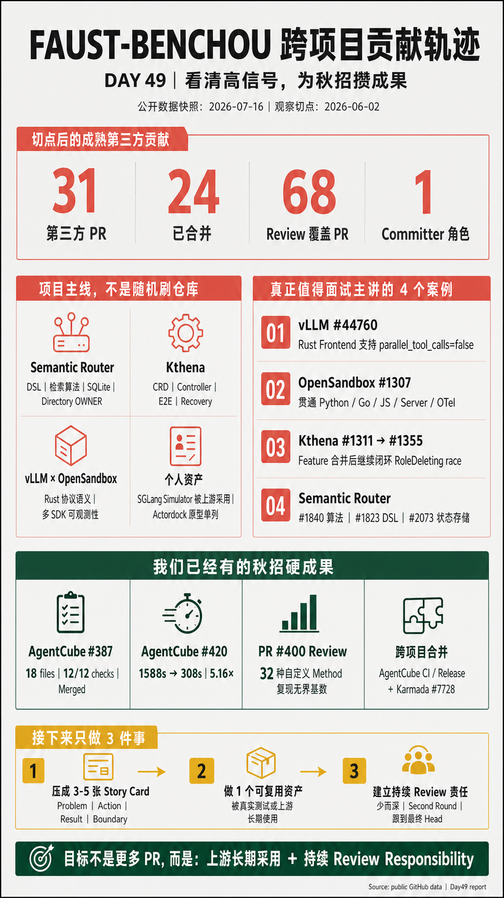

# Day 49：FAUST-BENCHOU 跨项目开源贡献轨迹与秋招成果对标

日期：2026-07-16

公开数据快照：2026-07-16 22:45 CST

研究对象：<https://github.com/FAUST-BENCHOU>

## 一页信息图



> 注释：信息图是本报告的 executive summary；PR 状态、统计口径、证据边界和残余风险仍以正文为准。可复用生成提示词见 [Day49 infographic prompt](day49-faust-benchou-contribution-career-infographic-prompt.md)。

## 今日目标

用户提供的背景是：`FAUST-BENCHOU` 是前本岗位实习生，最近又向多个项目提交了很多 PR。

本轮不只回答“他提了多少 PR”，而是回答四个更适合秋招准备的问题：

1. AgentCube 最后一笔 authored PR 之后，他把精力放到了哪些项目？
2. 哪些贡献是成熟上游真正接受的功能、修复、测试或维护职责？
3. 哪些数字容易被个人 fork、自合并 PR、generated files 或集中创建 issue 放大？
4. 我们已经有哪些不弱于这条轨迹的成果，还缺哪类公开证据？

## 结论先行

一句话结论：`FAUST-BENCHOU` 的强项不是单纯的 PR 数量，而是已经形成了“成熟上游实现 + 持续 review + directory owner/committer + 自建可复用工具 + 自驱产品原型”五层组合。

截至快照时间，可复核的核心数字是：

| 口径 | 数量 | 解释 |
| --- | ---: | --- |
| 最近 12 个月 authored PR | 315 | 包含本人账号仓库和 fork |
| 最近 12 个月外部 owner 仓库 PR | 230 | 排除 `FAUST-BENCHOU/*`；43 个仓库 |
| 上述外部 PR 已合并 | 190 | 另有 18 open、22 closed-unmerged |
| 最后一个 AgentCube authored PR 后的外部 PR | 33 | 以 2026-06-02 为代理起点 |
| 其中成熟或独立第三方项目 PR | 31 | 排除 `actordock` 两个自驱项目 PR |
| 31 个 PR 中已合并 | 24 | 另有 5 open、2 closed-unmerged |
| 代理起点后的其他项目 review contribution | 68 | GitHub contribution graph 定义的不同 PR，不等于 68 次 approval |
| `semantic-router` 公开角色 | committer / directory owner | 不是 root maintainer |
| `actordock` 公开 contributor 数据 | 163 commits，唯一公开 contributor | 自驱项目，不能与第三方上游 merge 等价 |

最值得秋招主讲的公开证据不是“最近 31 个 PR”，而是：

- [vLLM #44760](https://github.com/vllm-project/vllm/pull/44760)：Rust Frontend 的 OpenAI `parallel_tool_calls=false` 语义，经 maintainer 要求下沉抽象后合并。
- [OpenSandbox #1307](https://github.com/opensandbox-group/OpenSandbox/pull/1307)：跨 Python/Go/JavaScript SDK、server、spec、OTel 与真实 E2E 的 create latency telemetry，经多轮真人 review 收敛后合并。
- [semantic-router #1840](https://github.com/vllm-project/semantic-router/pull/1840)：history-aware hybrid tool retriever，包含算法 fallback、阈值与回归测试。
- [semantic-router #1823](https://github.com/vllm-project/semantic-router/pull/1823)：session/lookup-backed routing signal，贯穿 DSL、配置投影和 runtime decision engine。
- [semantic-router #2073](https://github.com/vllm-project/semantic-router/pull/2073)：SQLite projection store、transaction、schema version、fail-open 与 lifecycle Close。
- [Kthena #1311](https://github.com/volcano-sh/kthena/pull/1311) 与 [#1355](https://github.com/volcano-sh/kthena/pull/1355)：RoleRollingUpdate partition 及其后续 RoleDeleting race 修复闭环。
- [`sglang-inference-sim`](https://github.com/FAUST-BENCHOU/sglang-inference-sim) + [Kthena #1231](https://github.com/volcano-sh/kthena/pull/1231)：个人工具被成熟上游 E2E fixture 采用。

对我们的直接启发也不是“一个月投 30 个 PR”。我们已经有：

- AgentCube [#387](https://github.com/volcano-sh/agentcube/pull/387) 的 18 文件 `+1189/-312` 兼容性与 warm-pool lifecycle 主线；
- [#420](https://github.com/volcano-sh/agentcube/pull/420) 的 GitHub runner A/B benchmark，三个 buildx 命令总耗时从 `1588s` 降到 `308s`，提升 `5.16x`；
- [#400 review](https://github.com/volcano-sh/agentcube/pull/400#discussion_r3584390695) 发现 unbounded HTTP method label cardinality，并推动作者修复；
- AgentCube #414/#416/#422/#423 和 Karmada #7728 等已合并的跨 CI、release、供应链改动。

当前真正缺的是：

1. 把这些材料压成 3-5 个 recruiter 能快速核验的 story cards；
2. 获得持续 review 或目录 ownership 的公开角色信号；
3. 让一个我们维护的测试工具或 benchmark 被上游长期采用；
4. 减少“报告很深、公开首页看不出来”的证据可见性差距。

> 分析：PR 数量是漏斗顶部指标。秋招真正有辨识度的是“问题是否重要、改动是否进入真实路径、测试能否证明行为、review 是否推动设计收敛、结果是否被上游或用户采用”。

## 研究边界与证据分层

### 用户提供的背景

“前本岗位实习生”来自用户，不由 GitHub 数据独立证明。

其 GitHub profile 当前公开 bio 为 `Ex-intern @Huawei`，`semantic-router` 团队页公开显示 `Tongji University`。这些只说明公开自述和项目页面状态，不能据此推断：

- 精确入职或离职日期；
- 当前雇佣关系；
- 当前岗位 title；
- 秋招或转正结果；
- 每个仓库贡献是否由工作、课程、实习或个人兴趣驱动。

### “后续”采用的代理切点

公开 GitHub 没有可靠的实际离职时间字段。

本报告采用一个可复核但有限的代理切点：

- 最后一个 AgentCube authored PR 是 [#370](https://github.com/volcano-sh/agentcube/pull/370)；
- 创建时间是 2026-05-31；
- 合并时间是 2026-06-01；
- 因此统计“最后一笔 AgentCube authored PR 后”时，从 2026-06-02 起算。

> 注释：这个切点只表示公开 authored PR 轨迹发生变化，不等于真实实习结束日。

他在切点后仍参与 AgentCube review，例如 2026-06-25 review [#405](https://github.com/volcano-sh/agentcube/pull/405)。因此正文使用“AgentCube 最后一笔 authored PR 后”，不使用“离职后完全离开 AgentCube”。

### 统计对象

主要统计：

- authored PR；
- PR 当前 merged/open/closed-unmerged 状态；
- base repository owner；
- review contribution；
- linked issue、files、tests、review response；
- 默认分支 contributor 计数；
- 公开 `OWNER` / team role；
- GitHub Actions 可见结果。

明确排除或单列：

- `FAUST-BENCHOU/*` 下的个人 fork PR；
- 自动 backport；
- 零文件重复 PR；
- 第三方个人 fork；
- self-merge 项目 PR；
- generated data 对 lines changed 的放大；
- bot review 与真人 review 的混算；
- issue 批量拆分与独立社区 defect 的混算。

### 状态定义

| 状态 | 本报告含义 |
| --- | --- |
| merged | GitHub `merged_at` 非空，代码进入目标仓库分支 |
| open | 当前仍开放，包含 draft |
| closed-unmerged | 已关闭但没有 merge，不能写成完成成果 |
| review contribution | GitHub contribution graph 记录在某个 PR 提交过 review；可能是 `COMMENTED`，不等于 approval |
| directory owner | 当前某个 non-root `OWNER` 文件列名；不自动等于 root maintainer |
| self-directed project | 仓库主要由本人 direct commit、自合并和自己规划 issue 驱动 |

### 数据局限

1. GitHub Search 最多返回可访问的公开对象；private/restricted contribution 无法展开。
2. 当前 profile contribution graph 另显示 36 条 private/restricted contribution，本报告不计入明细。
3. 仓库、PR、review、stars 和 CI 状态都会继续变化。
4. `contributors` API 统计默认分支可归因 commit，不等于 authored PR。
5. `reviewed-by:` 搜索按 PR 条件过滤；contribution graph 按 review 发生时间记录，两者不应混成一个口径。
6. merged 证明上游接受，不证明每个自动 review finding 都已消失。
7. lines changed 可能包含 lockfile、generated clients、generated leaderboard 或 vendored code。

## 最近 12 个月的公开轨迹

### 外部 PR 总览

最近 12 个月字面 authored PR 是 315 个、58 个仓库。

其中：

| 分类 | PR | 仓库 | merged | open | closed-unmerged |
| --- | ---: | ---: | ---: | ---: | ---: |
| 全部 authored | 315 | 58 | 231 | 34 | 50 |
| 本人账号仓库 / fork | 85 | 15 | 41 | 16 | 28 |
| 外部 owner 仓库 | 230 | 43 | 190 | 18 | 22 |

更保守的“独立其他项目贡献”还应排除：

- 6 个 Karmada 自动 cherry-pick/backport；
- Casbin #1550 零文件重复 PR；
- `7h3-3mp7y-m4n/karmada#1` 第三方 fork；
- `actordock` 两个自驱项目 PR。

采用这个更保守口径时，上限约为 204 个 PR。

> 分析：数量仍然非常高，但“230”不能直接翻译成“230 个独立核心功能”。正确做法是继续看 repository role、merge、tests、review 和项目影响。

### 月度变化

公开外部 owner 仓库 PR 的月度轨迹如下：

| 月份 | PR | merged | open | closed-unmerged | 涉及仓库 |
| --- | ---: | ---: | ---: | ---: | ---: |
| 2025-08 | 7 | 6 | 0 | 1 | 3 |
| 2025-09 | 16 | 11 | 0 | 5 | 7 |
| 2025-11 | 13 | 10 | 2 | 1 | 6 |
| 2025-12 | 40 | 35 | 1 | 4 | 8 |
| 2026-01 | 39 | 31 | 5 | 3 | 11 |
| 2026-02 | 16 | 14 | 1 | 1 | 6 |
| 2026-03 | 16 | 14 | 2 | 0 | 5 |
| 2026-04 | 18 | 16 | 1 | 1 | 6 |
| 2026-05 | 31 | 27 | 1 | 3 | 8 |
| 2026-06 | 24 | 20 | 2 | 2 | 7 |
| 2026-07（截至 16 日） | 10 | 6 | 3 | 1 | 5 |

这个时间线说明：

- 活跃不是 2026 年 6 月突然开始；
- 2025 年 12 月到 2026 年 1 月已经形成第一轮高峰；
- 2026 年 3-5 月已并行进入 `semantic-router`；
- 6-7 月的变化更像主阵地从 AgentCube/Karmada 扩展到 model serving、semantic routing 和 agent sandbox。

## 项目演进时间线

### 2025-08 至 2025-09：Casbin 生态

公开轨迹以 Casbin 及多语言 CLI、website、editor、fasthttp-auth 为主。

能力信号主要是：

- 跨语言仓库适应；
- 小型功能与测试；
- 初步外部社区协作；
- 快速积累 merge 记录。

这部分证明开源起步，但不是当前 Agent Infra 求职主线。

### 2025-11 至 2026-01：Kubernetes / cloud native 扩展

主要项目包括：

- `krkn-chaos/krkn-ai`；
- `volcano-sh/agentcube`；
- `volcano-sh/kthena`；
- `karmada-io/karmada`；
- `volcano-sh/apis`；
- `volcano-sh/volcano`。

AgentCube 公开 authored PR 共 16 个：

| 状态 | 数量 |
| --- | ---: |
| merged | 13 |
| open | 2 |
| closed-unmerged | 1 |

代表内容覆盖：

- Pod informer；
- controller map memory leak；
- runtimeClassName；
- SandboxClaim rollback；
- E2E diagnostics；
- MCP server；
- LangChain CodeInterpreter provider；
- mTLS E2E skip。

这说明其在本岗位阶段已经从小修复走到 SDK/integration 和 lifecycle path。

### 2026-03 至 2026-06：Semantic Router 深入

截至快照：

| 指标 | 数量 |
| --- | ---: |
| authored PR | 39 |
| merged | 35 |
| open | 1 |
| closed-unmerged | 3 |
| contributors API commits | 40 |

贡献从中文文档逐步进入：

- routing DSL；
- tool retriever；
- session/lookup signal；
- dashboard config projection；
- SQLite recovery；
- deployment split；
- contributor governance tooling。

2026-06-18，[#2245](https://github.com/vllm-project/semantic-router/pull/2245) 将其加入 v0.3 new committer pool，并更新 22 个 non-root `OWNER` 文件。

当前公开 team data 把其标为 `memberType: committer`，`src/OWNER`、`dashboard/OWNER`、`tools/OWNER` 等列有该账号。

root `OWNER` 仍是项目 root owner，不能把其写成 root maintainer。

### 2026-06 至 2026-07：Agent Infra 多项目化

这一阶段出现四条并行线：

1. `Kthena`：ModelServing controller、partition、E2E、SGLang simulator。
2. `semantic-router` / `vLLM`：routing signal、dashboard state、Rust frontend。
3. `OpenSandbox` / `CubeSandbox`：多 SDK、E2B-compatible integration、telemetry。
4. `actordock`：自驱 E2B-compatible sandbox platform prototype。

> 分析：这些仓库看似分散，技术主题其实高度收敛：AI inference routing、Kubernetes controller、agent sandbox、session lifecycle、E2B-compatible API、SDK 和 observability。

## 观察切点后的成熟第三方 PR 账本

### 汇总

从 2026-06-02 起，排除个人账号仓库、AgentCube 和 `actordock` 自驱项目 PR 后：

| 仓库 | PR | merged | open | closed-unmerged | 主要方向 |
| --- | ---: | ---: | ---: | ---: | --- |
| `vllm-project/semantic-router` | 13 | 11 | 1 | 1 | Dashboard、config projection、recovery、docs、community tooling |
| `volcano-sh/kthena` | 10 | 6 | 3 | 1 | controller、Role partition、router plugin E2E、SGLang simulator |
| `volcano-sh/volcano` | 3 | 3 | 0 | 0 | E2E cleanup、Actions pinning |
| `opensandbox-group/OpenSandbox` | 2 | 2 | 0 | 0 | SDK 类型兼容、create latency telemetry |
| `vllm-project/vllm` | 1 | 1 | 0 | 0 | Rust Frontend tool-call semantics |
| `agentic-in/inferoa` | 1 | 1 | 0 | 0 | route selection runtime/TUI |
| `TencentCloud/CubeSandbox` | 1 | 0 | 1 | 0 | LangGraph + E2B example |
| 合计 | 31 | 24 | 5 | 2 | 7 个成熟或独立第三方项目 |

### 完整列表

| 日期 | 项目 / PR | 当前状态 | 贡献类型 | 信号判断 |
| --- | --- | --- | --- | --- |
| 06-03 | [Kthena #1179](https://github.com/volcano-sh/kthena/pull/1179) router-plugin E2E | merged | E2E | 中：覆盖多种 router plugin |
| 06-03 | [Semantic Router #2024](https://github.com/vllm-project/semantic-router/pull/2024) ClawOS participants | merged | Dashboard | 中：产品功能，但偏 UI |
| 06-03 | [Semantic Router #2028](https://github.com/vllm-project/semantic-router/pull/2028) OpenClaw tool calls | merged | Dashboard | 中：session JSONL 到 UI |
| 06-04 | [Kthena #1182](https://github.com/volcano-sh/kthena/pull/1182) retry flaky E2E | merged | Test reliability | 低到中：需证明 retry 不是遮蔽 bug |
| 06-04 | [Semantic Router #2035](https://github.com/vllm-project/semantic-router/pull/2035) MCP config server foundation | closed-unmerged | WIP | 低：未进入上游 |
| 06-05 | [Semantic Router #2043](https://github.com/vllm-project/semantic-router/pull/2043) Chinese docs | merged | Docs | 中低：本地化贡献 |
| 06-05 | [Semantic Router #2045](https://github.com/vllm-project/semantic-router/pull/2045) leaderboard Chinese docs | merged | Docs | 中低 |
| 06-05 | [Semantic Router #2060](https://github.com/vllm-project/semantic-router/pull/2060) split runtime containers | merged | Runtime/deploy cleanup | 高：`+53/-542`，移除 monolith path |
| 06-06 | [Semantic Router #2064](https://github.com/vllm-project/semantic-router/pull/2064) MCP config SQLite | merged | State/config | 中高 |
| 06-06 | [Volcano #5396](https://github.com/volcano-sh/volcano/pull/5396) queue cleanup ordering | merged | E2E lifecycle | 中：经历 changes requested 后修复 |
| 06-06 | [Semantic Router #2069](https://github.com/vllm-project/semantic-router/pull/2069) SQLite restart recovery | merged | Kubernetes E2E | 高：PVC、Pod restart、safe cleanup |
| 06-07 | [Semantic Router #2073](https://github.com/vllm-project/semantic-router/pull/2073) config projection store | merged | State/lifecycle | 高：SQLite WAL、transaction、schema/lifecycle |
| 06-07 | [vLLM #44760](https://github.com/vllm-project/vllm/pull/44760) `parallel_tool_calls=false` | merged | Rust/core protocol | 高：maintainer-directed abstraction change |
| 06-08 | [Semantic Router #2084](https://github.com/vllm-project/semantic-router/pull/2084) deployed config bootstrap | open | Config lifecycle | 中高但未完成 |
| 06-08 | [Semantic Router #2085](https://github.com/vllm-project/semantic-router/pull/2085) OpenAI API docs alignment | merged | Docs/API | 中 |
| 06-11 | [Semantic Router #2158](https://github.com/vllm-project/semantic-router/pull/2158) first-admin registration | merged | Dashboard auth | 中高 |
| 06-15 | [Kthena #1199](https://github.com/volcano-sh/kthena/pull/1199) GPU usage plugin E2E | merged | E2E | 中 |
| 06-16 | [Kthena #1222](https://github.com/volcano-sh/kthena/pull/1222) KVCache-aware plugin E2E | open draft | E2E | 未完成 |
| 06-16 | [Inferoa #55](https://github.com/agentic-in/inferoa/pull/55) route selection TUI | merged | Integration | 中高：跨 runtime/TUI |
| 06-17 | [Kthena #1231](https://github.com/volcano-sh/kthena/pull/1231) SGLang simulator | merged | Test infrastructure | 中高：个人工具进入上游 fixture |
| 06-18 | [Volcano #5469](https://github.com/volcano-sh/volcano/pull/5469) pin Actions SHA | merged | Supply chain CI | 中：安全维护，不是核心功能 |
| 07-02 | [CubeSandbox #710](https://github.com/TencentCloud/CubeSandbox/pull/710) LangGraph integration | open / changes requested | Example/E2B | 进行中，不能写成 upstream accepted |
| 07-02 | [Volcano #5567](https://github.com/volcano-sh/volcano/pull/5567) unify Actions SHA | merged | Supply chain CI | 中 |
| 07-07 | [Kthena #1311](https://github.com/volcano-sh/kthena/pull/1311) Role partition | merged | CRD/controller/E2E | 高，但有后续 race |
| 07-07 | [Kthena #1312](https://github.com/volcano-sh/kthena/pull/1312) constructor test fix | closed-unmerged | Test fix | 低：被其他改动替代或不需合并 |
| 07-11 | [Kthena #1343](https://github.com/volcano-sh/kthena/pull/1343) SG unavailable while rolling | open | Status semantics | 高潜力，未完成 |
| 07-11 | [Kthena #1345](https://github.com/volcano-sh/kthena/pull/1345) flaky self-healing E2E merge | merged | Test cleanup | 中 |
| 07-12 | [Semantic Router #2454](https://github.com/vllm-project/semantic-router/pull/2454) contributor leaderboard | merged | Community tooling | 中；generated diff 大，仍需 runtime proof |
| 07-14 | [Kthena #1355](https://github.com/volcano-sh/kthena/pull/1355) RoleDeleting ordinal | open | Controller recovery | 高潜力，仍等 final gate |
| 07-14 | [OpenSandbox #1298](https://github.com/opensandbox-group/OpenSandbox/pull/1298) uid/gid width | merged | Cross-SDK compatibility | 高判断密度、小 diff |
| 07-15 | [OpenSandbox #1307](https://github.com/opensandbox-group/OpenSandbox/pull/1307) create metrics | merged | Multi-SDK/server/OTel | 高：跨语言、真实 E2E、多轮 review |

> 注释：表里的“高”表示适合做技术深挖，不等于代码没有缺陷；“open”即使代码和 CI 很完整，也不能写成已被上游接受。

## Review 与角色信号

### Review contribution 数量

GitHub `pullRequestReviewContributions` 在最近 12 个月返回 155 个不同 PR。

其中 12 个与本人 authored PR 重叠；排除后，是 143 个“其他作者 PR”的 review contribution。

从 2026-06-02 代理切点后：

| 项目 | 不同 PR 的 review contribution |
| --- | ---: |
| `vllm-project/semantic-router` | 54 |
| `volcano-sh/kthena` | 13 |
| `volcano-sh/volcano` | 1 |
| 其他项目合计 | 68 |

另外还有 3 个 AgentCube/AgentCube fork review contribution，本报告没有混入“其他项目”。

这些数字不能写成：

- 68 个深入 code review；
- 68 次 approval；
- 68 个被其发现的 bug；
- 68 个由其推动合并的 PR。

它们能证明的是：review 已成为持续活动，而不是偶尔给自己 PR 回复。

### Semantic Router committer

当前可复核事实：

- 团队页把其标为 `committer`；
- generated activity 在 2026-07-14 的 3 个月窗口记录 `29 PR / 49 reviews / 27 issues / total 105`；
- `src/OWNER`、`dashboard/OWNER`、`tools/OWNER`、`e2e/OWNER`、`docs/OWNER` 等 non-root owner 文件包含该账号；
- [#2245](https://github.com/vllm-project/semantic-router/pull/2245) 明确写 `v0.3 new committer pool`；
- root `OWNER` 没有因此变化。

准确的秋招表述：

```text
vLLM Semantic Router committer and directory owner
```

不准确的表述：

```text
vLLM root maintainer
```

### Kthena 角色边界

Kthena contributors API 当前记录其 103 个默认分支 commits，authored PR 56 个、48 merged。

但根 `OWNERS` 当前只有项目既有 approver/reviewer，不包含该账号。

因此准确表述是：

- active contributor；
- high-volume author/reviewer；
- 某些 feature 的持续 owner；

不能写成 Kthena maintainer。

> 分析：角色文件是“社区把什么责任交给你”的证据。它通常比总 PR 数更容易让 recruiter 判断长期影响。

## 代表案例一：vLLM Rust Frontend 协议语义

PR：[vllm-project/vllm #44760](https://github.com/vllm-project/vllm/pull/44760)

### 问题

Rust Frontend 尚未正确支持 OpenAI Chat Completions 的：

```text
parallel_tool_calls = false
```

这不是简单丢弃一个字段。

系统必须同时保证：

- wire request 映射到内部 `ChatRequest`；
- omitted 时默认行为保持 true；
- explicit false 时 streaming 只输出第一个 tool call；
- final `AssistantMessage` 也只有一个 tool call；
- non-streaming 与 streaming 语义一致。

### 改动

| 指标 | 数值 |
| --- | ---: |
| files | 8 |
| additions | 135 |
| deletions | 23 |
| commits | 2 |
| checks | 21 success |

改动覆盖：

- OpenAI request conversion；
- internal request type；
- default/harmony output path；
- structured stream；
- validation；
- focused tests。

### Review 收敛

初版倾向在 route 层过滤。

Maintainer `BugenZhao` 要求把策略下沉到 `structured_chat_event_stream`，理由是：

- structured stream 已拥有稳定 tool-call index；
- streaming/non-streaming 应共用语义；
- route 只负责 wire mapping；
- 未来 endpoint 不应重复过滤逻辑。

作者接受后重构，最终获得 approval 并合并。

### 秋招信号

这个案例可以证明：

- Rust；
- OpenAI API compatibility；
- streaming state semantics；
- abstraction ownership；
- 根据架构 review 重构，而不是只修编译。

它比十个 docs/CI 小 PR 更适合作为核心 story。

## 代表案例二：OpenSandbox create latency telemetry

PR：[opensandbox-group/OpenSandbox #1307](https://github.com/opensandbox-group/OpenSandbox/pull/1307)

### 问题

Sandbox create latency 分散在 SDK client、server create、readiness 与 runtime 路径中。

目标不是给一个函数加 timer，而是建立一个跨 SDK 的 best-effort telemetry contract：

- create 成功/失败都能记录；
- telemetry 失败不能影响 sandbox usability；
- 不同 SDK 使用同一 wire event；
- server 能转成 OTEL histogram；
- 用户可以 opt out；
- skip health check 不能造成 success ratio 偏差；
- custom transport、TLS、proxy、timeout 仍需生效。

### 改动规模

| 指标 | 数值 |
| --- | ---: |
| files | 37 |
| additions | 2172 |
| deletions | 4 |
| commits | 6 |
| review events | 23 |
| checks | 52 total，40 success，0 failure |

覆盖：

- Python async SDK；
- Python sync SDK；
- Go SDK；
- JavaScript SDK；
- FastAPI/Pydantic server；
- OpenAPI spec；
- OTEL metrics；
- Go/Python/JS unit 和真实 sandbox E2E；
- user-facing docs。

### 真人 review 重点

`Pangjiping` 的 review 包括：

1. 不把 `sdkLanguage` 固定成 enum，避免旧 server + 新 SDK 422；
2. Python fire-and-forget task 必须有 strong reference；
3. 新 endpoint 只保留 `/v1` 路径；
4. 提供 `OPENSANDBOX_DISABLE_METRICS=1` opt-out；
5. skip-health-check 仍需产生可区分 success metric；
6. telemetry vocabulary 和 forward compatibility。

作者逐项修改，并为 opt-out、skip-health-check 等补真实测试。

自动 review 还暴露：

- monotonic clock；
- custom transport reuse；
- Go mutable header map race；
- Python thread startup failure；
- OTEL label cardinality；
- failure cleanup latency contamination。

### 正确解读大 diff

`+2172` 不能全部算手写核心逻辑，其中包含测试、docs、spec 和生成/依赖变化。

真正高信号的是：

- contract 跨语言；
- review 触达并发、兼容和 observability；
- 作者能把 feedback 转成实现和测试；
- 最终两名 reviewer approve 并 merge。

### 对我们的启发

未来做 AgentCube latency/benchmark 贡献时，不应只上传一份结果表。

更强的成果形态是：

```text
measurement point
-> stable event/schema
-> bounded labels
-> failure does not affect user path
-> SDK parity
-> opt-out/security
-> real E2E
```

## 代表案例三：小 diff 的跨 SDK 类型判断

PR：[opensandbox-group/OpenSandbox #1298](https://github.com/opensandbox-group/OpenSandbox/pull/1298)

### 问题

execd spec 的 UID/GID 是 `uint32`。

不同语言的表示能力不同：

| SDK | 原类型 | 是否覆盖完整 uint32 |
| --- | --- | --- |
| Go | `*uint32` | 是 |
| Python | `int` | 是 |
| TypeScript | `number` | 是，safe integer 足够 |
| C# | `int?` | 否，只到 Int32.MaxValue |
| Kotlin | `Int?` | 否，只到 Int32.MaxValue |

### 改动

- C# `int? -> long?`；
- Kotlin `Int? -> Long?`；
- create/info/state 全部对齐；
- Kotlin private wire DTO 同步；
- 加 `uid > Int32.MaxValue` 序列化/反序列化测试。

| 指标 | 数值 |
| --- | ---: |
| files | 5 |
| additions | 68 |
| deletions | 6 |
| review | 真人 approval |
| result | merged |

### 为什么这是高信号小 PR

linked issue 明确写了：

- 为什么只有 C#/Kotlin 要改；
- 为什么真实 Linux UID 通常不会触发；
- 为什么仍要保证 API contract；
- non-goals；
- backward compatibility。

> 分析：好的秋招案例不一定行数大。能把跨语言类型、现实概率、API 承诺和测试边界讲清楚，本身就是工程判断。

## 代表案例四：Semantic Router 算法与 DSL 主线

这些贡献创建于 AgentCube 最后一笔 authored PR 之前，但它们证明 `semantic-router` 不是 6 月才临时进入的仓库。

### Hybrid history-aware retriever

PR：[semantic-router #1840](https://github.com/vllm-project/semantic-router/pull/1840)

| 指标 | 数值 |
| --- | ---: |
| files | 11 |
| additions | 829 |
| deletions | 117 |
| commits | 2 |
| result | 2026-04-28 merged |

实现的 ranking 组合包括：

- semantic similarity；
- short-term transition；
- decision/category prior；
- repetition penalty；
- confidence-gated fallback to semantic-only。

Review 发现 fallback 可能：

- 绕过 lexical/combined thresholds；
- 把已过滤 candidate 重新引入。

作者第二个 commit 修正，并保留 focused behavior tests。

这是算法边界和 fallback correctness 的高信号成果。

### Session/lookup-backed signals

PR：[semantic-router #1823](https://github.com/vllm-project/semantic-router/pull/1823)

| 指标 | 数值 |
| --- | ---: |
| files | 31 |
| additions | 1088 |
| deletions | 317 |
| result | 2026-04-27 merged |

改动贯穿：

- DSL compiler/decompiler；
- validator；
- canonical config；
- runtime hydration；
- projection；
- decision engine；
- tests；
- docs。

Reviewer 质疑两个暴露 signal 是否应统一，作者改成单一 `session metrics` API。

它适合证明“配置语言到 runtime decision”的跨层 contract，而不是只写“新增路由字段”。

## 代表案例五：Config projection 与 Kubernetes recovery

### Projection store

PR：[semantic-router #2073](https://github.com/vllm-project/semantic-router/pull/2073)

| 指标 | 数值 |
| --- | ---: |
| files | 19 |
| additions | 1483 |
| deletions | 60 |
| result | merged |

核心设计：

- SQLite WAL；
- schema version；
- transactional snapshot；
- deploy/update/rollback write path；
- API 查询；
- activation version。

`rootfs` 的 request changes 覆盖：

- CGO dependency；
- startup hard-fail；
- synchronous DB blocking；
- Store 没有 Close；
- schema migration 缺口。

最终代码补出：

- fail-open；
- Store lifecycle Close；
- async refresh；
- schema version；
- 纳秒级唯一 activation version。

不足是 PR body 仍很薄。技术适合面试主讲，但原 PR 文案不是沟通能力的好模板。

### Restart recovery E2E

PR：[semantic-router #2069](https://github.com/vllm-project/semantic-router/pull/2069)

| 指标 | 数值 |
| --- | ---: |
| files | 5 |
| additions | 348 |
| deletions | 1 |
| result | merged |

测试流程：

1. 创建 PVC-backed workflow store；
2. 写入 workflow SQLite data；
3. 删除 dashboard Pod；
4. 等待新 Pod；
5. 验证数据在 restart 后恢复；
6. cleanup 只删除 test-owned PVC。

Review 促使作者修复：

- namespace collision；
- PVC name collision；
- unconditional cleanup 误删用户数据；
- StorageClass flake；
- 等待 PVC Bound。

> 分析：这个案例的价值不在“加了一个 E2E”，而在于测试本身也遵守资源 ownership 和 cleanup contract。

## 代表案例六：Kthena feature 与回归 ownership

### RoleRollingUpdate partition

PR：[Kthena #1311](https://github.com/volcano-sh/kthena/pull/1311)

| 指标 | 数值 |
| --- | ---: |
| files | 12 |
| additions | 946 |
| deletions | 155 |
| commits | 8 |
| review submissions | 26 |
| inline comments | 102 |
| result | merged 2026-07-09 |

102 条 inline comments 必须继续拆分：

| author type | 数量 |
| --- | ---: |
| Copilot | 87 |
| human reviewers | 9 |
| author replies | 6 |

因此不能写成“102 条 maintainer review”。

Feature 覆盖：

- API type；
- CRD；
- generated client/applyconfig/deepcopy；
- webhook validation；
- controller rollout；
- unit test；
- E2E；
- user-facing release note。

人类 reviewer 重点追问：

- partition 下 protected replica crash 后应使用哪个 revision recreate；
- role list ordering；
- inline `RollingUpdateConfiguration`；
- RoleDeleting 与 non-contiguous ordinal。

### Follow-up race

Issue：[Kthena #1354](https://github.com/volcano-sh/kthena/issues/1354)

PR：[Kthena #1355](https://github.com/volcano-sh/kthena/pull/1355)

问题链：

```text
RoleDeleting object still occupies datastore
-> scale-up treats ordinal as free
-> AddRole revision/identity collision
-> wrong ordinal or Ready cannot converge
```

#1355 当前 `+73/-34`、3 files，修 controller、unit test 和 E2E assertions。

Reviewer 明确要求：E2E 不一定可靠撞到 race，因此必须补包含 `RoleDeleting` replica 的 unit test。

作者已补测试并处理 list ordering 建议；截至快照仍 open，LGTM 在新 push 后被移除，等待最终 gate。

### 正确的秋招包装

不应说：

```text
一次性正确实现 Role partition
```

更准确的是：

```text
实现 RoleRollingUpdate partition，随后对删除中角色引发的 ordinal/revision race
完成日志定位、issue 复现、unit/E2E 语义校准和 follow-up 修复。
```

在 #1355 merge 前，最后一句必须写“修复已提交并通过当前 CI，等待 upstream final review”。

## 代表案例七：个人测试工具被上游采用

仓库：[`FAUST-BENCHOU/sglang-inference-sim`](https://github.com/FAUST-BENCHOU/sglang-inference-sim)

上游采用：[Kthena #1231](https://github.com/volcano-sh/kthena/pull/1231)

### 工具定位

这是从 `llm-d-inference-sim` fork/extended 的 Go simulator，目标是无需 GPU 和真实模型权重，模拟：

- SGLang-native `/generate`；
- OpenAI-compatible APIs；
- TTFT / per-token latency / queue/load metrics；
- LoRA lifecycle；
- P/D disaggregation；
- KV-cache ZMQ events；
- Prometheus metrics；
- tokenizer 与 weight-update stubs。

### 公开验证

- 2026-06-17 创建；
- 9 个可见 Actions runs 中 7 success、2 failure；
- 有 Go package tests、Docker packaging 和 CI；
- Kthena #1231 把 E2E image 切到 `sglang-inference-sim:0.1.1`；
- Kthena fixture 覆盖 router、controller-manager 和 P/D disaggregation。

### 高信号点

个人项目最有价值的终点不是 star 数，而是：

```text
上游真实测试依赖它
```

这比“我写了一个 simulator”更能证明复用价值。

### 边界

- GitHub repo metadata 当前没有识别到 top-level license；
- README 写 Apache 2.0，但 public tree 未见 root `LICENSE`；
- 项目源自另一个 simulator，需要把 lineage/license 文件补齐；
- Kthena #1231 仍有 image digest、metrics compatibility、E2E error handling 等 review caveat。

> 分析：可复用工具是我们下一阶段很值得追的成果形态，但必须把 provenance、license、release tag、immutable image 和 consumer tests 一起做好。

## 进行中案例：CubeSandbox LangGraph integration

PR：[TencentCloud/CubeSandbox #710](https://github.com/TencentCloud/CubeSandbox/pull/710)

### 已完成内容

| 指标 | 数值 |
| --- | ---: |
| files | 10 |
| additions | 525 |
| result | open / changes requested |

内容包括：

- LangGraph / Deep Agents；
- E2B-compatible SDK；
- CubeSandbox MicroVM；
- envd root/stdin patch；
- sandbox TLS 与 LLM TLS 隔离；
- cleanup；
- 中英文文档；
- OpenCloudOS 9.4、KVM、真实 sandbox ID 和输出日志。

### 为什么还不能算完成成果

Reviewer 要求补真实 CubeSandbox 集群的可核验证据。

作者当前回复强调“日志和 sandbox ID 是真实的”，但还没有把 reviewer 需要的证据形式补齐。

Automated review 还指出：

- empty messages 可能 IndexError；
- model name colon split 可能破坏 fine-tuned model id；
- missing cert path 静默忽略；
- import-time patch 影响 testability；
- HTTP default 和 cert validation 边界。

### 沟通学习

面对“请证明真实集群”的请求，最佳回复不是辩解没有造假，而是提供：

1. cluster/runtime version；
2. commit SHA；
3. deploy command；
4. server-side object/log；
5. client output；
6. cleanup state；
7. screenshot 或 artifact URL；
8. 可复跑脚本。

> 分析：工程证据不仅要真实，还要让 reviewer 低成本验收。这个差别直接影响 open PR 能否变成简历上的 upstream accepted result。

## Self-directed project：Actordock

仓库：<https://github.com/actordock/actordock>

### 为什么单列

公开数据表明：

- 仓库创建于 2026-06-19；
- contributors API 当前只列 `FAUST-BENCHOU`，163 commits；
- 公开 issue 中 94 个由其在 6 月 19-24 日集中创建；
- 这些 issue 组成 v0.0.1 至 v0.1.x work packages 和 backlog；
- 两个 authored PR 都在创建后约 9 秒 self-merge；
- 没有外部 review。

所以它更适合评价为个人产品/架构 ownership，不适合混进 mature upstream merge rate。

### 产品主线

Actordock README 声明目标是：

- E2B-compatible API；
- Kubernetes-native；
- worker multiplexing；
- idle suspend/resume；
- snapshot；
- Router resume-before-proxy；
- Redis session metadata；
- envd process/filesystem；
- Helm 和 Kind local install。

公开 release progression 包括：

| 版本 | 目标 |
| --- | --- |
| v0.0.1 | create/run/kill proof |
| v0.0.2 | Redis visibility |
| v0.0.3 | manual TTL |
| v0.0.4 | scheduler auto cleanup |
| v0.0.5 | idle suspend / auto resume |
| v0.0.6 | observability routes |
| v0.0.7 | real cgroup/envd telemetry |
| v0.0.8 | connect/network/snapshot |
| v0.0.9 | volume CRUD metadata |
| v0.0.10 | template read APIs |
| v0.0.11 | ops dashboard |
| v0.1.1 | vendored runtime + template build pipeline |

6 月 19-25 日公开了上述 12 个 GitHub Releases，速度非常快。

### PR #72 / #73

| PR | 内容 | Diff | Review | Merge 时 CI |
| --- | --- | --- | --- | --- |
| [#72](https://github.com/actordock/actordock/pull/72) | React/TS dashboard design system | `+4792/-23`，36 files | 无 | checks 后续可见 success |
| [#73](https://github.com/actordock/actordock/pull/73) | Go BFF/proxy + SPA embed | `+582`，9 files | 无 | 1 failure，E2E skipped |

#72 的大 diff 包含大量 lockfile 和 release docs，不能把 4792 行全部当核心前端实现。

### 当前可验证质量

最新可见 main head CI run `28590900903` 成功，包含：

- gofmt；
- vet；
- unit tests；
- dashboard verify；
- Helm verify；
- binary build；
- Kind install；
- E2B SDK E2E；
- agent framework examples。

最近 30 个 Actions runs 中 12 success、18 failure，说明快速迭代过程中经历了大量 CI 修正；最新 green 比累计失败率更有意义，但还缺稳定期数据。

### 不能直接采信的产品 claim

README 写 `30x+ session oversubscription`。

当前 public tree 没有发现 benchmark-named artifact 或 raw result，不能把这个数字当作第三方可复核事实。

另外：

- repo API `license` 当前为 null；
- tree 中存在 vendored `runtime/LICENSE`，但没有 top-level `LICENSE`；
- 31 stars / 4 forks 是当日 snapshot，不等于 production adoption；
- 单 contributor、self-merge、无 external review 使 bus factor 与独立验证较弱。

### 正确的秋招包装

可以写：

```text
从 0 到 1 设计并实现 E2B-compatible Kubernetes agent sandbox prototype，
拆分 Platform/Router/Scheduler/Redis/runtime/envd，建立 Kind + E2B SDK E2E，
并迭代 pause/resume、telemetry、template 和 dashboard。
```

不能只写：

```text
向开源社区提交 94 issues、163 commits、12 releases、2 large PRs。
```

后者强调数量，却没有解释独立 review、license、benchmark 和用户采用。

## High-signal 与 volume signal 分层

### A 级：秋招核心 story

满足多数条件：

- mature upstream；
- merged；
- production/core path；
- focused tests；
- independent human review；
- review 后有架构或行为收敛；
- 结果能从 current main 或 release 复核。

候选：

- vLLM #44760；
- OpenSandbox #1307；
- Semantic Router #1840/#1823/#2073；
- Kthena #1311，加 #1355 follow-up status；
- OpenSandbox #1298 作为小而精的 contract story。

### B 级：支撑持续工程能力

- Kubernetes recovery E2E；
- CI supply-chain pinning；
- flaky test cleanup；
- docs/localization；
- dashboard integration；
- self-directed project latest green E2E；
- upstream-adopted test fixture。

这些适合放项目详情或面试追问，不应占简历第一屏所有空间。

### C 级：只计活动，不计成果

- open PR；
- closed-unmerged PR；
- personal fork merge；
- auto backport；
- zero-file duplicate；
- self-merge in seconds；
- generated data/lockfile line count；
- batch-created issue count；
- bot review count；
- README 中没有 raw evidence 的 benchmark claim。

> 分析：用 A/B/C 分层不是贬低小贡献，而是防止 recruiter 追问时把最脆弱的数字放到最显眼的位置。

## 他的能力轨迹如何形成

### 轨迹一：从 task 到 subsystem

早期：

- docs；
- tests；
- small bug；
- CI。

中期：

- AgentCube lifecycle/integration；
- Karmada/Kthena controller；
- ModelServing API。

近期：

- routing DSL；
- SQLite projection；
- Rust frontend；
- multi-SDK telemetry；
- sandbox product prototype。

### 轨迹二：从 author 到 reviewer/owner

```text
merged PRs
-> repeated review participation
-> v0.3 committer pool
-> non-root directory OWNER
-> generated activity tracks active status
```

这是最值得复制的开源成长路径。

### 轨迹三：从一次修复到 reusable asset

`sglang-inference-sim` 的价值链是：

```text
真实 SGLang E2E 缺 GPU-friendly simulator
-> fork existing vLLM simulator lineage
-> retarget APIs/metrics/disaggregation
-> publish image and CI
-> Kthena consumes it in controller/router E2E
```

这比单个 fixture patch 更有长期复用性。

### 轨迹四：从项目参与到产品叙事

Actordock 把：

- E2B API；
- Substrate-like runtime；
- session lifecycle；
- Router；
- template；
- dashboard；
- Kind E2E；

组合成一个可以 demo 的产品叙事。

它的工程验证还不等同成熟 upstream，但对秋招作品集很有展示价值。

## 与 Day27 能力地图的对应

| Day27 能力线 | FAUST-BENCHOU 公开证据 | 当前强度 |
| --- | --- | --- |
| Agent runtime / sandbox | OpenSandbox、CubeSandbox、Actordock、AgentCube | 高 |
| Kubernetes control plane | Kthena Role partition、recovery、Karmada | 高 |
| Session lifecycle | AgentCube、Actordock pause/resume、SQLite recovery | 中高 |
| Tool protocol / agent integration | MCP、LangChain、LangGraph、E2B | 高 |
| Router / API | semantic-router DSL、vLLM protocol、Kthena router | 高 |
| Security / compatibility | UID/GID type、Action SHA、telemetry opt-out | 中高 |
| Observability / eval | OpenSandbox metrics、Kthena metrics/simulator | 中高 |
| Open-source review | 68 recent other-project review contributions、committer role | 高 |
| Reusable engineering asset | SGLang simulator、Actordock | 中高 |
| Independent production adoption | mature upstream merge 多；个人产品用户证据少 | 中 |

## 我们与这条轨迹的差距矩阵

### 已有强证据

| 能力 | 我们的证据 | 与对标对象相比 |
| --- | --- | --- |
| Agent sandbox compatibility | AgentCube #387，v0.4.6、warm-pool adoption、Store/runtime identity、deadline fix | 单项深度不弱 |
| Performance root cause | #420，QEMU arm64 Go compile A/B benchmark，5.16x total speedup | 量化证据更强 |
| CI/release/supply chain | #414/#416/#422/#423、Karmada #7728 | 已有跨项目 merge |
| Review correctness | #400 method cardinality，32 custom methods 复现，作者修复 | 高信号 review 已存在 |
| Architecture review | #431 API/Lease/RuntimeClass/status ownership 深审 | 分析深，但公开可见性需筛选 |
| E2E/benchmark evidence | fork CI、kind/k3s、real dynamic client/HTTP reproduction | 证据严谨度高 |

### 当前差距

| 差距 | 现状 | 风险 | 下一步 |
| --- | --- | --- | --- |
| 公开角色 | 尚无 committer/directory owner | recruiter 只看到 author，不易看长期责任 | 持续 review + follow-through，不主动索要头衔 |
| Portfolio 首页 | 深度散落在 49 天报告 | 外部无法快速理解 | 做 3-5 张 story card + evidence index |
| Reusable upstream asset | 多为 PR/benchmark，工具尚未成为上游依赖 | 长期复用信号弱 | 把 warm-pool data-flow inspector 或 focused test harness 做成被 tests 使用的工具 |
| 外部项目 breadth | AgentCube/Karmada 强，sandbox competitor contribution 少 | 容易被看成单仓库经历 | 选择 1 个相邻项目做测试/review，不追热点撒网 |
| Public review corpus | #400 高信号，但数量和角色尚少 | 难证明持续 reviewer responsibility | 对少数 PR 做完整 second-round review |
| Recruiter wording | 报告强调过程，简历 bullet 尚未收敛 | 成果不易扫描 | 量化 result + boundary + link |
| Demo product | 有 math-agent/benchmark，但尚未包装成稳定 demo | 缺产品化第一印象 | 做可复跑 demo，不另造大平台 |

### 不需要复制的做法

我们不需要：

- 在一个月内追 30 个 PR；
- 批量创建几十个 issue；
- 为行数做 generated churn；
- 先 self-merge 再等 CI；
- 把所有相邻项目都做一遍 docs/typo；
- 把 open PR 写成 shipped feature。

我们的优势是 evidence depth，应保留并压缩展示。

## 秋招 Story Card 1：Agent-sandbox compatibility

### 标题

AgentCube agent-sandbox v0.4.6 兼容与 warm-pool lifecycle 修复

### Problem

旧实现绑定 agent-sandbox v0.1.1，warm-pool path 错把 claim name 当同名 Sandbox，无法正确跟踪 adopted Sandbox 和 Pod identity。

Claim GET 还可能在 2 分钟内部 timer 到期后继续阻塞，并最终返回 success。

### Action

- 升级依赖和生成物；
- 按 `SandboxClaim.status.sandbox.name` 跟踪 adopted Sandbox；
- 拆 control identity / runtime identity；
- 修 E2E 让 warm-pool 用例真实执行；
- 用 dynamic client + `httptest.Server` 复现 GET 超时；
- 把 internal deadline 传入真实 client-go request；
- 完成 final rebase、DCO、12/12 official checks。

### Result

- 18 files，`+1189/-312`；
- exact head `95fae1f`；
- official 12/12 checks success；
- WarmPool tests 实际 PASS；
- 2026-07-16 merged 到 upstream main。

### 简历 bullet 草案

```text
升级 AgentCube 对 kubernetes-sigs/agent-sandbox v0.4.6 的兼容层，重构
SandboxClaim warm-pool adoption 的 control/runtime identity 与 readiness 路径；
用真实 client-go HTTP 边界复现并修复内部 2 分钟 deadline 失效问题，
18 文件改动通过 12/12 upstream checks 和 focused WarmPool E2E 后合并。
```

### 面试边界

- 不是完整 Sleep/Resume；
- 不包含 v0.5 storedVersions migration；
- mTLS 与 non-mTLS coverage 要分开解释。

## 秋招 Story Card 2：Multi-arch build 5.16x

### 标题

AgentCube multi-arch image build 性能优化

### Problem

GitHub x86 runner 在 buildx `linux/arm64` builder stage 中通过 QEMU 运行 Go compiler，workloadmanager arm64 compile 超过 1400 秒。

### Action

- 对比 Karmada host-native cross compile；
- 建 baseline / Scheme A fork-only benchmark；
- 只把三个 Go builder stage 切到 `$BUILDPLATFORM`；
- 保留 `TARGETOS/TARGETARCH` 和 multi-arch runtime contract；
- 运行真实 release workflow，验证 image push + Helm publish。

### Result

| 指标 | Baseline | Scheme A | 改善 |
| --- | ---: | ---: | ---: |
| 三个 buildx 命令 | 1588s | 308s | 5.16x |
| workloadmanager | 1423s | 182s | 7.82x |
| workloadmanager arm64 Go build | 1404.5s | 169.4s | 8.29x |
| benchmark wall time | 1610s | 331s | 4.86x |

PR #420 已合并。

### 简历 bullet 草案

```text
定位 AgentCube 多架构镜像构建的 QEMU arm64 Go compiler 慢路径，设计
GitHub runner baseline/Scheme A 对照实验；通过 BUILDPLATFORM 原生交叉编译
将三个 buildx 命令总耗时从 1588s 降至 308s（5.16x），方案以 #420 合并。
```

### 面试边界

- PicoD runtime `apt-get python3` 仍是剩余慢点；
- benchmark 不包含 registry 网络完全相同条件时要区分；
- 不能把 5.16x 说成所有 release 场景固定收益。

## 秋招 Story Card 3：Prometheus cardinality review

### 标题

PicoD metrics PR 的 label cardinality review

### Problem

PR 已把 route path 归一化，但 HTTP method 仍直接使用网络输入。

Go HTTP 接受任意合法 token method，攻击者可以制造无限 method label series。

### Action

- 临时测试发送 32 个 custom methods；
- 证明生成 32 个 counter + 32 个 histogram label sets；
- 检查 `promhttp` 对未知 method 折叠到 `unknown` 的先例；
- 发布 focused inline finding；
- 作者新增 standard method allowlist 和 `unknown` regression test；
- second-round 复核源码、race tests、merge-tree 和 CI。

### Result

- finding 被作者修复；
- focused/race tests 通过；
- review completion comment 已公开；
- PR 仍由 maintainer 决定 final merge gate。

### 简历 bullet 草案

```text
审查 AgentCube PicoD Prometheus metrics，构造 32 种自定义 HTTP method
复现无界 label cardinality；提出 bounded taxonomy 修复并完成 second-round
验证，推动作者增加标准方法 allowlist 与 unknown 聚合回归测试。
```

### 面试边界

- 不把 merge 归因于自己；
- bucket residual scope 已明确非阻塞；
- `/lgtm` 因权限被 Prow 拒绝，不能写成已授予 LGTM label。

## 秋招 Story Card 4：Release 与供应链治理

### 组合内容

- #414：fork push validation workflow；
- #416：`latest` image 与 Helm SemVer `0.0.0` 拆分；
- #422：Dependabot 非标准 Dockerfile 扫描和 Go builder ignore；
- #423：11 个 `ubuntu-latest` 固定到 `ubuntu-24.04`，保留明确的 e2e `22.04`；
- Karmada #7728：跨仓库 runner update。

### 适合的组合表述

```text
围绕 AgentCube release/CI 建立可预测的供应链维护闭环：恢复 latest image
与合法 Helm chart 版本发布，加入 fork push validation，验证非标准 Dockerfile
的 Dependabot 行为，并固定 11 个浮动 runner label；多项改动已进入 upstream。
```

### 为什么不拆成五个第一屏 bullet

每个改动独立有价值，但技术主题相同。

合并成一个“CI/release governance”故事，比列五个小 PR 更清楚。

## 秋招 Story Card 5：Architecture / review judgment

### 标题

SandboxPool proposal API 和 recovery gate

### 可讲内容

- K8s owns slow pool，AgentCube owns hot sessions；
- Selector duplication；
- `ResourceList` 扩展性；
- event-driven status + Lease；
- status dual-writer authorization；
- object name/label/path budgets；
- generation freshness；
- Node UID incarnation；
- RuntimeClass/containerd bootstrap；
- destructive manifest recovery window。

### 包装边界

这张 card 适合面试架构题和 code review，不适合作为“我实现了 SandboxPool”。

准确表述：

```text
对 AgentCube SandboxPool proposal 做 API、状态 ownership、规模和恢复路径审查，
推动 selector/ResourceList/Lease 等设计收敛，并保留 dual-writer、generation、
Node incarnation 和 RuntimeClass bootstrap 等 freeze gates。
```

## 未来四周行动建议

### Week 1：先做成果压缩

目标：让 recruiter 5 分钟内看到真实结果。

动作：

1. 建立 5 张 story card；
2. 每张只保留 Problem/Action/Result/Boundary；
3. 每张链接 PR、CI、benchmark、报告；
4. 做中英文 1-line bullet；
5. GitHub profile 或 portfolio index 只列已核验结果。

验收：

- 每张 card 200-350 中文字；
- 每张最多 3 个主链接；
- recruiter 不读日报也能理解；
- open/merged 状态准确。

### Week 2：完成一个 follow-through contribution

优先候选：

- Pod informer cleanup 独立 PR；
- #429 Go toolchain governance follow-through；
- #400 或 #431 新 push 后 second-round review；
- 不与 #438 的 v0.5.2 ownership 冲突。

验收：

- scope focused；
- linked rationale；
- targeted unit/race/repeat；
- final head audit；
- reviewer response 闭环。

### Week 3：做一个 reusable asset

建议不是另造大平台，而是把现有能力产品化：

- `warmpool-flow-inspector`；
- watch-first JSON timeline；
- claim/Sandbox/Pod identity assertions；
- failure classification；
- machine-readable artifact；
- reusable E2E helper。

验收：

- 被至少一个真实 test 或 review 使用；
- 有版本、license、README、CI；
- 有 consumer example；
- 不只是报告截图。

### Week 4：建立 reviewer/owner 信号

动作：

1. 只选 2-3 个熟悉组件 PR；
2. Round 1 审 problem/scope/ownership；
3. Round 2 审 failure/tests/final head；
4. 记录作者采纳与 residual scope；
5. 不为了 review 数量评论 nit。

验收：

- 至少一个 finding 被修复；
- 至少一个 PR 完成 second-round；
- 评论自包含；
- 不重复 AI reviewer；
- 不越权发布 `/lgtm` 或 approval。

## 下一项贡献的选择规则

候选任务先打分：

| 维度 | 0 分 | 1 分 | 2 分 |
| --- | --- | --- | --- |
| 用户价值 | 无明确用户 | 间接维护 | 直接行为/性能/可靠性 |
| 技术深度 | docs/typo | 单模块 | 跨 contract/lifecycle |
| 可验证性 | 无测试 | unit/CI | real E2E/benchmark/repro |
| 社区空位 | 已有人做 | 可协作 | 明确 unowned/邀请参与 |
| 复用性 | 一次性 | repo 内复用 | 多消费者/长期工具 |
| 秋招叙事 | 无法一句话 | 可解释 | 可量化 Problem/Action/Result |

建议只做总分至少 8/12 的新任务。

停止条件：

- 已有作者或 assignee；
- 只能增加 PR 数，不能形成新能力；
- 需要本机没有的 KVM/生产环境且无替代证据；
- scope 会和 #438/#431 等既有 ownership 冲突；
- 无法设计 failure-path test；
- 结果只能存在于 private/local report。

## 对秋招简历数字的建议

### 可以写的数字

- `#420: 5.16x buildx total speedup`；
- `#387: 18 files, 12/12 checks, warm-pool E2E`；
- `#400 review: 32 custom methods reproduction`；
- `11 workflow runner labels pinned`；
- `4+ merged CI/release PRs`；
- `Karmada + AgentCube cross-project`。

### 不要写的数字

- 实习报告行数；
- AI review thread 总数；
- 本地分支 commit 数；
- 没有上游采用的 issue 数；
- README 未验证 benchmark；
- open PR 当 merged；
- 把 checks 数当测试用例数。

### 推荐第一屏结构

1. 一个 core lifecycle story：#387。
2. 一个量化 performance story：#420。
3. 一个 reviewer impact story：#400。
4. 一个 cross-project/governance story：Karmada + AgentCube CI/release。
5. 一个 architecture/reusable asset story：#431 review 或 flow inspector。

## 过程阻塞与调试记录

### Day49 一页分区信息图生成

用户要求把 1678 行研究压成“一页看清楚”的海报分区图。本轮按 `gpt-image-draw` skill 使用 `gpt-image-2` 原生生成完整中文图文，没有用 SVG、HTML/CSS、canvas 或本地后期贴字。

可复用产物：

- prompt：[day49-faust-benchou-contribution-career-infographic-prompt.md](day49-faust-benchou-contribution-career-infographic-prompt.md)；
- PNG：[day49-faust-benchou-contribution-career-infographic.png](day49-faust-benchou-contribution-career-infographic.png)。

第一次运行前，系统 `python3` 导入失败：

```text
ModuleNotFoundError: No module named 'openai'
```

曾先创建 `/tmp/gpt-image-draw-venv` 作为临时环境。用户随后明确要求把依赖持久安装供后续复用，因此改走系统 Python 的 user site。

root-wide 安装命令失败：

```text
sudo: a terminal is required to read the password
sudo: a password is required
```

最终使用：

```bash
python3 -m pip install --user --break-system-packages openai
```

验证结果：

```text
openai 2.45.0
/home/ranxi/.local/lib/python3.12/site-packages/openai/__init__.py
```

图片 API 首请求约 4 分钟才返回，期间进程保持运行、没有错误、文件尚未落盘。本轮没有在等待时重复提交请求；首请求最终成功，不需要 skill 允许的第二次重试。

生成结果：

```text
PNG image data, 941 x 1672, 8-bit/color RGB, non-interlaced
file size: 1,569,748 bytes
```

一次可选的 Pillow 尺寸检查因系统没有 `PIL` 失败；`file` 已能验证准确尺寸，因此没有为了重复检查再安装 Pillow。

原图视觉检查确认：

- `31 / 24 / 68 / 1` 四个快照数字准确；
- `1588s -> 308s / 5.16x`、`18 files / 12/12 checks` 和 `32` 种 Method 均清晰；
- 五个分区层级明确；
- 中文没有可见乱码或关键错字；
- 底部结论和 source 没有裁切；
- 所有文字、图标和分区均在 9:16 安全边距内，没有遮挡。

> 分析：海报只保留 executive-summary 信息，不能替代正文的统计口径和 open/merged 边界。原生图文生成适合成果展示，精确证据仍由 Markdown 报告和 GitHub 链接承担。

### GitHub profile 页面不能直接给完整 PR 账本

现象：contribution graph 只展示聚合活动，不能区分：

- authored vs reviewed；
- personal fork vs upstream；
- merged vs self-merged；
- generated diff；
- review depth。

解决：使用 GitHub Search/API 分页，按 repository owner、state、date 分类，再逐 PR 读取 files/reviews/comments/checks。

### `gh search prs` 会把个人 fork 算入

第一次字面统计得到 325 个 all-time authored PR，其中包括：

- `FAUST-BENCHOU/kthena`；
- `FAUST-BENCHOU/agentcube`；
- `FAUST-BENCHOU/karmada`；
- 其他个人 fork。

解决：按 `repository.nameWithOwner` 排除 `FAUST-BENCHOU/*`，并再单列 `actordock`。

### Review 搜索与 contribution graph 口径不同

`reviewed-by:` 搜索以 PR 自身 created/date 条件为中心；GraphQL contribution collection 按 review contribution 的发生时间。

同一时间窗口可能得到不同 repo 分布。

解决：

- authored PR 用 PR createdAt；
- reviewer activity 用 `pullRequestReviewContributions`；
- 两个数字不相加；
- 报告中明确“不同 PR”而非 review event。

### `gh api` GraphQL 偶发 TLS timeout

现象：部分请求返回：

```text
net/http: TLS handshake timeout
```

解决：

- 对只读请求重试；
- 关键数字用 REST Search 和 PR endpoint 交叉；
- 不把单次 EOF/timeout 当账号没有数据。

### Token 缺少 `read:org`

现象：查询公开 organizations GraphQL field 时提示缺少 `read:org`。

解决：

- 不扩权；
- 使用公开 repo、team file、OWNER 和 contributor endpoints；
- 不推断隐藏 organization membership。

### `gh api search/issues` 默认 method 误用

未显式 `-X GET` 时，带 `-f` 参数可能按 POST 发到 Search endpoint 并返回 404。

修正：

```bash
gh api -X GET search/issues -f q='...'
```

### `actordock` release/issue 数量放大

字面 issue 搜索在代理切点后得到 110 个 external issue，其中 94 个来自 Actordock work package。

解决：

- 把它解释为 roadmap decomposition；
- 不叫 94 个独立社区 bug；
- 结合 contributor、merge latency、review 和 CI 判断。

### Semantic Router leaderboard merged 不等于 runtime 已验证

#2454 已合并并获两次 approval，但当前 main 的 workflow 仍只有：

```yaml
permissions:
  contents: write
```

没有显式 `pull-requests: read`。

当前 generator 也仍在合并 `reviewStats` 前计算 `newContributorKeys`。

快照时 workflow 的可见 run 没有成功记录；最新几个 push-associated run 显示 failure 且没有 job log。

因此本报告把它归为已合并 community tooling，但不写成 daily refresh 已在 production 正常运行。

> 分析：merge 是重要 outcome，但 reviewer 仍要回读 current main 和运行证据。这一点和我们审 #387/#400/#431 的方法一致。

## 后续刷新方法

同一主题后续继续追加本 Day49，不要过早创建 Day50。

建议触发刷新条件：

- Kthena #1355 merged/closed/new review；
- Kthena #1343 status 变化；
- CubeSandbox #710 补真实集群证据或 merge；
- OpenSandbox 新 authored PR；
- Semantic Router committer/OWNER 角色变化；
- Actordock 新外部 contributor、benchmark artifact、license 或 release；
- 新 mature upstream 出现 2 个以上 substantive PR。

刷新时保存：

```text
snapshot time
query range
repository owner exclusions
authored PR state
review contribution definition
representative PR head/state
new role files
CI/release evidence
```

不要只更新 contribution graph screenshot。

## 最终判断

`FAUST-BENCHOU` 的公开轨迹证明了一条有效路径：

```text
小贡献建立信任
-> 在两个主仓库持续实现
-> 对他人 PR 做 review
-> 获得 committer/directory owner 责任
-> 做跨语言或核心路径 feature
-> 建个人 reusable tool
-> 用自驱项目组合产品叙事
```

这条路径里最值得我们复制的是：

1. 长期围绕同一技术主题，不是随机刷仓库；
2. 让个人工具进入成熟上游测试；
3. 从 author 走向 reviewer/owner；
4. feature 后继续修 recovery regression；
5. 同时保留 core feature、小而精 contract fix 和 E2E evidence。

最不值得复制的是：

1. 用总 PR 数代替技术影响；
2. 把 self-merge 和 mature upstream merge 混算；
3. 用 generated lines、issue 数或 release 速度夸大成果；
4. open PR 没收敛证据就写进核心简历；
5. README benchmark 缺 raw data；
6. 真实证据没有按 reviewer 可验收形式交付。

我们当前不缺深度成果，缺的是公开成果的压缩、复用和角色化。

下一步应该先完成 story cards，再选一个能产生“上游长期使用”或“持续 review responsibility”的任务，而不是继续扩大日报数量或 PR 数量。

## 主要公开证据入口

- GitHub profile：<https://github.com/FAUST-BENCHOU>
- Public user API：<https://api.github.com/users/FAUST-BENCHOU>
- AgentCube authored PR：<https://github.com/pulls?q=is%3Apr+author%3AFAUST-BENCHOU+repo%3Avolcano-sh%2Fagentcube>
- Kthena authored PR：<https://github.com/pulls?q=is%3Apr+author%3AFAUST-BENCHOU+repo%3Avolcano-sh%2Fkthena>
- Semantic Router authored PR：<https://github.com/pulls?q=is%3Apr+author%3AFAUST-BENCHOU+repo%3Avllm-project%2Fsemantic-router>
- Semantic Router team data：<https://github.com/vllm-project/semantic-router/blob/main/website/src/data/teamMembers.tsx>
- Semantic Router activity data：<https://github.com/vllm-project/semantic-router/blob/main/website/src/data/committerActivity.generated.ts>
- Semantic Router `src/OWNER`：<https://github.com/vllm-project/semantic-router/blob/main/src/OWNER>
- Committer pool PR #2245：<https://github.com/vllm-project/semantic-router/pull/2245>
- Kthena root OWNERS：<https://github.com/volcano-sh/kthena/blob/main/OWNERS>
- vLLM #44760：<https://github.com/vllm-project/vllm/pull/44760>
- OpenSandbox #1298：<https://github.com/opensandbox-group/OpenSandbox/pull/1298>
- OpenSandbox #1307：<https://github.com/opensandbox-group/OpenSandbox/pull/1307>
- Kthena #1311：<https://github.com/volcano-sh/kthena/pull/1311>
- Kthena #1355：<https://github.com/volcano-sh/kthena/pull/1355>
- SGLang simulator：<https://github.com/FAUST-BENCHOU/sglang-inference-sim>
- Actordock：<https://github.com/actordock/actordock>
- CubeSandbox #710：<https://github.com/TencentCloud/CubeSandbox/pull/710>
