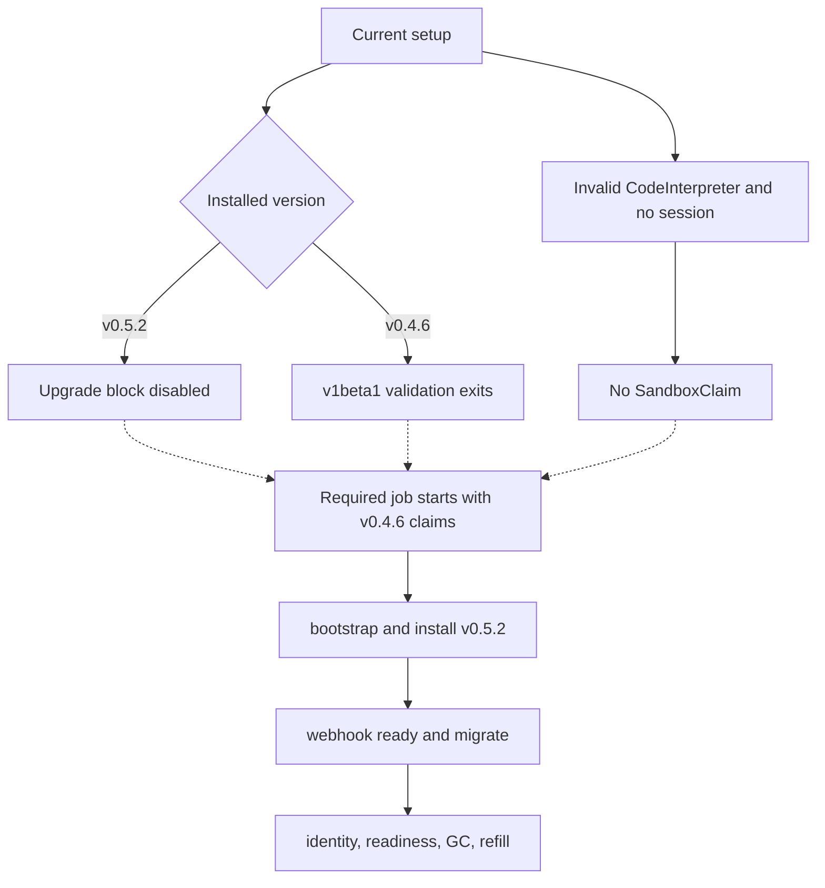
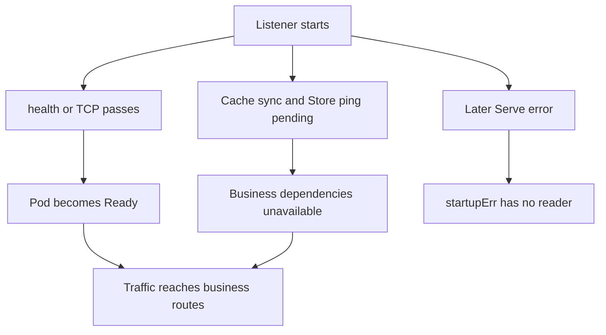

# Day 55：PR #442 Review Drafts

日期：2026-07-27；发布前复核：2026-07-28

状态：`POSTED ROOT COMMENT / ARCHIVED INLINE DRAFTS DO NOT POST`

## Approval Package

| 项目 | 内容 |
| --- | --- |
| Target | `volcano-sh/agentcube` PR #442 |
| Base branch | upstream `main` |
| Exact reviewed head | `4f9d4f3265c722b367dcf4e0430eb59aa0ff7d6e` |
| Action | 已发布一条 root PR comment 说明 maintainer review 已覆盖 blocking findings；未发布 archived review body / inline comments |
| Posting state | 已发布 [`#issuecomment-5099164520`](https://github.com/volcano-sh/agentcube/pull/442#issuecomment-5099164520)；`@acsoto` 已在同一 head 提交覆盖这些问题的 `CHANGES_REQUESTED`，原四条 exact text 仅保留为历史草稿 |
| Diff reviewed | 38 files，`+924/-710` |
| Why now | 原计划在作者 force-push 恢复完整 v0.5.2 adapter 后补 current-head review；2026-07-28 09:53 CST 已被 maintainer current-head review 取代 |

验证摘要：focused Go tests、WorkloadManager race、E2E compile、shell syntax、module verify、gen-check、lint、build 通过；2026-07-28 复查 exact head 仍为 `4f9d4f3`，12 checks green，只有 Tide 等待 `lgtm` / `approved`；release `migrate.sh` URL 返回 404；diff check 有 6 处 whitespace；Docusaurus 本地 build 因依赖未安装而未执行。09:49 CST 的扫描尚无变化，但 09:53 CST `@acsoto` 在同一 head 提交 7 条 inline 和 1 个 `CHANGES_REQUESTED`，PR review comments 从 181 增至 188。

Visualization gate：migration finding 同时包含版本分支、validator 提前退出、无效 parent fixture、缺失真实 Claim producer 和所需四阶段升级路径；readiness finding 同时包含 probe/readiness 与 late Serve error 两条生命周期分支，均超过 3 个有意义节点。因此两条评论使用 10-node / 8-node inline Mermaid；已用官方 `@mermaid-js/mermaid-cli@11.16.0` 本地渲染并目视通过。404 与 coverage deletion 仍是单步因果，保留 prose。

历史草稿 metrics：review body `106 words / 2 nonblank lines`；inline 1 `158 / 16`；inline 2 `96 / 2`；inline 3 `165 / 13`；inline 4 `86 / 2`。aggregate 为 `611 words / 35 nonblank lines`，其中 23 行是两个小型 Mermaid 源码。它们不再是待批准的 reviewer-visible 文本。

## 2026-07-28 Maintainer Review Supersession

`@acsoto` 在 exact head `4f9d4f3` 提交 [`CHANGES_REQUESTED`](https://github.com/volcano-sh/agentcube/pull/442#pullrequestreview-4793033983)，要求直接转向稳定的 v0.5.3，并补 `Sandbox.spec.volumeClaimTemplates` immutable coverage，同时评估或调整新的 `sandbox-concurrent-workers=100`，避免意外增加 API Server 压力。这改变了本轮 review 的前提：作者接下来应重做依赖版本和 migration contract，而不是继续修补 v0.5.2 草稿。

重复映射：

| 本地草稿 | Maintainer current-head review | 决策 |
| --- | --- | --- |
| Inline 1：migration 不可达、required CI、真实 Claim lifecycle | [两阶段 migration](https://github.com/volcano-sh/agentcube/pull/442#discussion_r3662193160)、[required CI](https://github.com/volcano-sh/agentcube/pull/442#discussion_r3662193164)、[session/claim cleanup 与 refill](https://github.com/volcano-sh/agentcube/pull/442#discussion_r3662193171) | 不重复发布；`spec.template` 和真实 Claim producer 细节留作新 head 复核 |
| Inline 2：404 与 helper procedure | [v0.5.2 release asset 404](https://github.com/volcano-sh/agentcube/pull/442#discussion_r3662193167) | 不重复发布 |
| Inline 3：false readiness 与 late Serve error | [liveness/readiness 分离](https://github.com/volcano-sh/agentcube/pull/442#discussion_r3662193177)、[listener lifetime supervision](https://github.com/volcano-sh/agentcube/pull/442#discussion_r3662193180) | 不重复发布 |
| Inline 4：删除 OIDC/LangChain/MCP coverage | [恢复被删除 suites](https://github.com/volcano-sh/agentcube/pull/442#discussion_r3662193173) | 不重复发布 |

现有 [`Resource()` compatibility thread](https://github.com/volcano-sh/agentcube/pull/442#discussion_r3631523674) 仍可在新 head 复核，但不足以证明此时再发一份独立 root review 有净增益。当前动作改为仅准备一条非重复 root explanation：说明不再重复 maintainer 已覆盖的技术线程，同时保留两个低层测试细节和下一版复核范围。

## Posted Non-Duplicate Root Comment

Target：`volcano-sh/agentcube` PR #442

Action：one root PR comment; no GitHub review event, no inline comment, no maintainer mention, no Prow command.

Posted：2026-07-28 10:16:54 CST，[`#issuecomment-5099164520`](https://github.com/volcano-sh/agentcube/pull/442#issuecomment-5099164520). Posting guard passed immediately before the comment: `headRefOid` still `4f9d4f3265c722b367dcf4e0430eb59aa0ff7d6e` and `updatedAt` still `2026-07-28T01:53:19Z`.

Why upstream-visible now：用户要求即使已有 maintainer review，也需要在 PR 下说明本轮复核结论。该 comment 不新增 blocking thread，而是公开记录当前 reviewer stance：maintainer review 已覆盖 blocking findings，本轮不重复打扰，但会在下一版复核 `spec.template`、真实 `SandboxClaim` producer、existing `Resource()` thread、v0.5.3 immutable PVC template coverage 和 worker-concurrency assessment。

Metrics：`81 visible words / 2 nonblank lines`，below ordinary comment soft limit. Visualization gate：prose only；这是 review coverage/status explanation，不是新的多 actor lifecycle finding。2026-07-28 用户指出上一版第一段过细、读起来生疏，已压缩为一句自然状态说明。

Exact body posted:

```md
Reviewed current head `4f9d4f3`. The maintainer review already captures the main blockers I found on this head, so I won't add duplicate inline threads.

For the next revision, I will still keep two migration-test details on my checklist: the pre-upgrade `CodeInterpreter` fixture needs to be admission-valid (`spec.template` is required), and the test should create the `SandboxClaim` through the real WorkloadManager session path. I will also recheck the existing [`Resource()` compatibility thread](https://github.com/volcano-sh/agentcube/pull/442#discussion_r3631523674), plus the requested v0.5.3 immutable `volumeClaimTemplates` coverage and worker-concurrency assessment.
```

## Review Body

<!-- DRAFT:REVIEW_BODY:START -->
Reviewed `4f9d4f3`. The production v0.5.2 adapter and fresh-install checks are restored, and all 12 exact-head checks are green. Those checks, however, explicitly disable the migration block, and the opt-in path still cannot construct or execute a v0.4.6-to-v0.5.2 migration. The inline comments cover the unreachable migration job, inaccurate operator procedure, WorkloadManager false readiness, and removed integration coverage.

I did not duplicate the existing [`Resource()` compatibility thread](https://github.com/volcano-sh/agentcube/pull/442#discussion_r3631523674). The current helper still returns `GroupResource`, so please recheck that resolved thread against the current artifact. I do not think this is ready until the upgrade path is required and executable, readiness is dependency-aware, and the removed E2E suites are restored.
<!-- DRAFT:REVIEW_BODY:END -->

## Inline 1: Migration Reachability And Fixture

Target: `test/e2e/run_e2e.sh:537`

<!-- DRAFT:INLINE_1:START -->
The upgrade block remains unreachable as a migration test. Normal CI installs v0.5.2 and sets the flag false, while opt-in v0.4.6 setup exits at the beta-only validator. Both CodeInterpreter fixtures omit required `spec.template`; even a valid CodeInterpreter creates only SandboxTemplate/WarmPool, while a WorkloadManager session request, which this block never sends, creates SandboxClaim.



Could this become a dedicated required job that creates admitted v0.4.6 claims with a v1alpha1-compatible WorkloadManager or explicit alpha fixtures, runs bootstrap, install, webhook readiness, and migrate from the pinned upstream helper, and fails on warm-adopted or cold-unbound identity, readiness, GC, or refill regressions?
<!-- DRAFT:INLINE_1:END -->

## Inline 2: Operator Guide

Target: `docs/getting-started.md:48`

<!-- DRAFT:INLINE_2:START -->
This line still reproduces the earlier [migration-procedure thread](https://github.com/volcano-sh/agentcube/pull/442#discussion_r3611817313) and [404 thread](https://github.com/volcano-sh/agentcube/pull/442#discussion_r3630869702): the v0.5.2 release has no `migrate.sh` asset. The [tagged upstream guide](https://github.com/kubernetes-sigs/agent-sandbox/blob/v0.5.2/docs/api-migration-guide.md) runs `dev/tools/migrate.sh` from a source checkout (wrapping `helm/files/migrate.sh`), backs up all four agent-sandbox kinds, and probes the conversion webhook before the storage rewrite. This guide omits SandboxTemplate/SandboxWarmPool from the backup and checks only the controller Deployment for readiness.

Could this follow the tagged guide exactly, retain the CodeInterpreter backup while adding Sandbox/SandboxClaim/SandboxTemplate/SandboxWarmPool, probe the webhook with a beta list, and state that bootstrap is conditionally mandatory while the v0.5.2 post-upgrade migrate phase remains optional?
<!-- DRAFT:INLINE_2:END -->

## Inline 3: WorkloadManager Readiness

Target: `pkg/workloadmanager/server.go:154`

<!-- DRAFT:INLINE_3:START -->
Starting the listener here creates a source-proven false-readiness window when cache sync or the Store ping outlasts the first readiness probe. `/health` always returns 200, and the chart uses it, or TCP under SPIRE, for readiness, so service traffic can reach business routes while dependencies are unavailable. I did not observe a production outage; this is source-proven from the startup and probe wiring.



After initialization, `Start` reads `startupErr` once and returns; a later fatal Serve error has no consumer. Could we keep early liveness, add dependency-aware readiness plus route gating, and supervise the listener for the process lifetime? A focused test should hold each dependency unready and then release it, and inject a late listener failure.
<!-- DRAFT:INLINE_3:END -->

## Inline 4: Removed Integration Coverage

Target: `test/e2e/run_e2e.sh:534`

<!-- DRAFT:INLINE_4:START -->
This replacement removes the conditional OIDC run, the unconditional LangChain and local MCP HTTP/stdio runs, and the in-cluster MCP run when setup is enabled. Their test files, dependencies, README contract, and cleanup variables remain, but `run_e2e.sh` no longer invokes them. The green E2E jobs therefore provide less regression coverage for behavior unrelated to this dependency upgrade.

Could equivalent invocations be restored and the migration scenario moved to a dedicated script/job, so adding upgrade coverage does not trade away the integration coverage previously exercised by `make e2e`?
<!-- DRAFT:INLINE_4:END -->

## Posting Guard

Do not submit the archived review body or four inline comments. Do not repost the root comment, reply to, resolve, mention, or issue Prow commands on the maintainer review. After the author pushes a new v0.5.3 head, re-read the full diff and current threads before deciding whether any independent finding remains.
