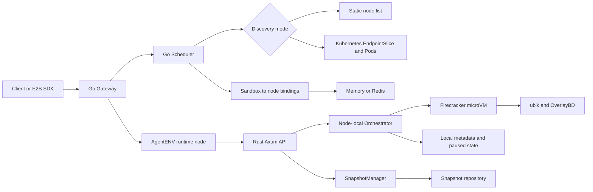

# Day 59：kvcache-ai/AgentENV 架构调研——它真的完全脱离 Kubernetes 了吗

日期：2026-08-11

## 调研问题

本轮针对 [`kvcache-ai/AgentENV`](https://github.com/kvcache-ai/AgentENV) 回答四个问题：

1. “AgentENV 已经完全脱离 Kubernetes”是否符合当前开源实现？
2. sandbox 创建、调度、状态、快照和数据面分别由谁负责？
3. 它和 AgentCube 的 Kubernetes-native 路径真正差在哪里？
4. 哪些设计值得 AgentCube 借鉴，哪些项目声明还不能当作独立验证结果？

## 一句话结论

> **“完全脱离 Kubernetes”不准确。更准确的结论是：AgentENV 的 sandbox 资源模型、生命周期热路径和 Firecracker 数据面不依赖 Kubernetes；但它仍把 Kubernetes 作为第一方、可选的多节点部署与节点发现层。**

换句话说，AgentENV 是 **Kubernetes-independent core, Kubernetes-optional integration**，不是 Kubernetes-free system。

它最重要的架构选择不是“拒绝 Kubernetes”，而是：

> Kubernetes 模式管理 AgentENV 的粗粒度 workload、Service、ConfigMap、RBAC、Pod scheduling / rollout 和 runtime node discovery；但它不拥有 per-sandbox 对象与生命周期热路径。每个高频 sandbox 不创建 Pod、CRD 或 etcd object，而是在 node 内直接创建 Firecracker microVM，并由 AgentENV 自己维护生命周期状态和路由绑定。

> 注释：本文的“热路径”指一次 sandbox 请求从进入 Gateway，到完成 node placement 和 runtime create / pause / resume / fork 的调用链；它不包括 AgentENV 服务自身的部署和升级。

这和 AgentCube 当前的核心差异，不只是 runtime 从 Pod 换成 microVM，而是 **谁拥有 sandbox truth、谁执行调度事务、一次创建是否经过 Kubernetes API Server**。

## 结论校准

| 命题 | 当前判定 | 证据 |
| --- | --- | --- |
| 单节点 AgentENV 必须运行在 Kubernetes 上 | **否** | 可用 systemd、Docker 或手工启动 Rust server |
| 多节点 AgentENV 必须依赖 Kubernetes | **否** | 支持 static node list + gateway/scheduler + systemd，也支持 Docker Compose 模拟 |
| 每个 sandbox 对应一个 Pod / CRD | **否** | 每个 sandbox 是 node 内的 Firecracker backend，metadata 和 handle 由 Rust orchestrator 管理 |
| sandbox 创建热路径调用 Kubernetes API | **否** | Gateway 调自建 scheduler，再把 HTTP 请求代理到选中的 AgentENV node |
| Kubernetes 只是仓库中的示例 YAML | **否** | Go scheduler 直接使用 `client-go` watch EndpointSlice 和 Pod |
| Kubernetes 模式下 K8s 会影响调度候选 | **是** | serving / terminating endpoint 和 Pod label 决定 active、lingering、ignored node |
| AgentENV 的公开历史显示它后来“迁出 K8s” | **没有证据** | 首个公开 tag `v0.1.0` 已同时包含 static discovery、K8s discovery 和完整 Kustomize manifests |

所以，“脱离 Kubernetes”只有在限定成“**把 Kubernetes 从 per-sandbox 对象模型与热路径中移开**”时才成立。

## 调研口径与证据边界

### 固定版本

| 项目 | 固定快照 |
| --- | --- |
| AgentENV `main` | `0475f403b119c29d3b74aa32b5c10dff07c68493` |
| 最新 release | `v0.1.2`，tag commit `db1492b`，2026-08-10 发布 |
| 首个公开 release | `v0.1.0`，tag commit `8f028b1`，2026-07-25 发布 |
| AgentCube 对照 | `upstream/main@4b38a442ba37db7ebf75903b051710c8b8936402` |

截至 2026-08-11 扫描时，AgentENV 仓库创建于 2026-07-23，共 71 个可见 commits，约 3.1k stars、259 forks、24 个 open issues 和 20 个 open PRs。GitHub repository API 的 `open_issues_count = 44` 同时包含 issue 与 PR，不能直接当作 issue 数。这里的动态数字只说明项目在公开初期获得了很高关注，**不直接证明生产成熟度、长期兼容性或故障恢复质量**。

### 证据标签

- **Observed**：当前源码、配置、manifest 或官方文档直接可见。
- **Verified**：本轮在固定 SHA 上运行命令得到结果。
- **Inferred**：由调用链或状态模型推导，报告会显式标记。
- **Not verified**：项目方声明存在，但本轮没有对应环境或原始结果独立复现。

### 本轮验证

- `(cd services && go test ./...)`：通过，覆盖 gateway、scheduler、shared config 和 logging packages；
- `make k8s-render`：通过，当前 Kustomize manifests 可离线渲染；
- Git 历史检查：`v0.1.0` 已包含 `deploy/k8s/`、`client-go` 依赖、Kubernetes discovery 和默认 static discovery；
- Rust / Firecracker：本轮研究容器没有 `cargo`，也没有 `/dev/kvm`，未运行 Rust unit/integration tests 或真实 microVM；
- 性能：未运行 snapshot benchmark，也未独立复现 README 中的规模、延迟和 overcommit 数字。

受限处理是保留固定 SHA 做源码级调用链核对，并只运行当前容器可执行的 Go control-plane tests 和 Kustomize render；没有临时安装 Rust toolchain，也没有把源码存在或项目声明替代成 runtime / performance PASS。

## 先看完整架构



图中最关键的边界是：

- scheduler 决定“新请求去哪个 node”，维护“sandbox ID 在哪个 node”的软绑定；
- Rust orchestrator 决定“这个 sandbox 实际处于什么状态”，直接操作 Firecracker、网络和块设备；
- Snapshot API 通过 orchestrator 捕获 runtime snapshot，再由独立的 `SnapshotManager` 发布到 repository；
- Kubernetes discovery 只提供一种 runtime node roster，不拥有单个 sandbox 对象；
- heartbeat 携带完整 sandbox ID roster，用来把 node-local truth 对账回 scheduler binding。

官方架构文档也把多节点控制面描述为 `Gateway -> Scheduler -> AgentENV nodes`，而不是 `API -> CRD -> controller -> Pod`。[`architecture.md`](https://github.com/kvcache-ai/AgentENV/blob/0475f403b119c29d3b74aa32b5c10dff07c68493/docs/src/internals/architecture.md#L216-L245)

## 一次 sandbox 请求实际怎么走

### 1. Gateway 先做路由，不创建资源

已有 sandbox 请求可以从 host、header 或控制面 URL path 提取 sandbox ID，然后调用 scheduler 的 `LookupNode`。没有 sandbox ID 的创建请求调用 `Schedule`。Gateway 得到 node endpoint 后，直接把原始 HTTP / WebSocket 请求反向代理到该 AgentENV node。[`server.go`](https://github.com/kvcache-ai/AgentENV/blob/0475f403b119c29d3b74aa32b5c10dff07c68493/services/gateway/internal/server.go#L181-L264)

创建成功后，Gateway 才从 2xx response 中提取 sandbox ID，并 best-effort 调用 `RecordAssignment` 写入 `sandbox -> node` binding。也就是说：

```text
Schedule node
  -> proxy create to node
  -> node creates sandbox successfully
  -> best-effort RecordAssignment
```

**Observed：** node 创建成功前，控制面没有 reservation 或 binding；`Schedule` 本身不会先占用 node capacity，也不会创建 tentative binding。

**Inferred：** 因此这不是 reservation-backed two-phase placement transaction。

### 2. Node 内部直接执行生命周期

每个 runtime node 是一个 Rust server。启动时它初始化：

- OverlayBD P2P facade；
- ublk device manager；
- Firecracker pool；
- SnapshotManager；
- file-backed Orchestrator；
- ObservabilityReporter；
- Axum HTTP API。

入口可见于 [`src/bin/server.rs`](https://github.com/kvcache-ai/AgentENV/blob/0475f403b119c29d3b74aa32b5c10dff07c68493/src/bin/server.rs#L69-L141)。其中没有 Kubernetes client 或 CRD client。

Orchestrator 的 `SandboxBackend` contract 直接提供：

- `start` / `wait_for_ready`；
- `pause` / `resume`；
- `snapshot`；
- `fork`；
- `stop`；
- runtime network policy update。

这些不是 Kubernetes object phase 的映射，而是 node-local backend 方法。[`backend.rs`](https://github.com/kvcache-ai/AgentENV/blob/0475f403b119c29d3b74aa32b5c10dff07c68493/src/sandbox/backend.rs#L167-L256)

### 3. 状态真相分层保存

| 状态 | 当前 owner / store | 持久性 |
| --- | --- | --- |
| runtime node membership | Scheduler `AtomicNodeRegistry` | 内存；来自 static config 或 K8s discovery |
| observed node metrics / heartbeat | Scheduler node registry | 内存 + TTL |
| sandbox -> node route binding | Scheduler binding store | 默认内存 + TTL；可选 Redis |
| all tracked sandbox metadata，包括 transitional 和 paused 状态 | Node `InMemoryMetadataStore` | node 进程内存；paused 状态另有 durable record |
| Firecracker handles / proxy routes | Node orchestrator | node 进程内存 |
| paused sandbox runtime state | Node RocksDB record + artifact root | 本地 durable |
| committed snapshot | 本地/共享 POSIX filesystem 或 S3-compatible object storage（`oss` backend） | repository durable truth |
| P2P artifact index | Scheduler / node caches | 加速层，非 committed truth |

`InMemoryMetadataStore` 使用带状态前置条件的更新和 watch channel 协调 node 内并发；heartbeat 上报的 sandbox roster 也来自该 store 的全部 ID，而不只来自 Running 状态。[`in_memory.rs`](https://github.com/kvcache-ai/AgentENV/blob/0475f403b119c29d3b74aa32b5c10dff07c68493/src/orchestrator/store/in_memory.rs#L14-L41) [`service.rs`](https://github.com/kvcache-ai/AgentENV/blob/0475f403b119c29d3b74aa32b5c10dff07c68493/src/orchestrator/service.rs#L670-L678)

Paused sandbox 才会写 file-backed record；恢复时由 backend-specific state 重建 runtime。[`file_backed.rs`](https://github.com/kvcache-ai/AgentENV/blob/0475f403b119c29d3b74aa32b5c10dff07c68493/src/orchestrator/persistence/file_backed.rs#L336-L378)

因此 scheduler 并不是 sandbox lifecycle 的权威数据库。它持有的是可过期、可由 heartbeat roster 重建的路由视图。

## 自建 scheduler 做了什么

### Node discovery

Scheduler 有两种模式：

- `static`：读取配置中的 node ID 和 endpoint，当前默认值就是 static；
- `kubernetes`：通过 in-cluster client watch headless Service 的 EndpointSlice，并可用 Pod label 做 ignore / no-schedule 策略。

模式切换入口在 [`services/scheduler/cmd/main.go`](https://github.com/kvcache-ai/AgentENV/blob/0475f403b119c29d3b74aa32b5c10dff07c68493/services/scheduler/cmd/main.go#L48-L81)，默认 static 配置在 [`config.go`](https://github.com/kvcache-ai/AgentENV/blob/0475f403b119c29d3b74aa32b5c10dff07c68493/services/shared/config/config.go#L277-L299)。

> 注释：`EndpointSlice` 是 Kubernetes 为 Service 记录可用后端地址的资源。这里 scheduler 从中发现 AgentENV runtime Pod，而不是用它表示某个 sandbox。

这里有一个重要限制：unknown node 不能只靠 heartbeat 自动注册。它必须先出现在 static config 或 Kubernetes discovery 中，heartbeat 才会被接受。

### Placement

当前 placement 顺序是：

```text
discovered non-lingering nodes
  -> attach latest heartbeat snapshot
  -> resource threshold filter
  -> round_robin or random
```

内置策略只有 round-robin 和 random，两者当前都忽略 request hint。[`strategy.go`](https://github.com/kvcache-ai/AgentENV/blob/0475f403b119c29d3b74aa32b5c10dff07c68493/services/scheduler/internal/strategy.go#L13-L59)

资源 filter 会检查当前 heartbeat 报告的 sandbox count、CPU、memory，以及包含 paused sandbox 的可选上限；但没有 heartbeat snapshot 的 node 会被保留为候选。[`filter.go`](https://github.com/kvcache-ai/AgentENV/blob/0475f403b119c29d3b74aa32b5c10dff07c68493/services/scheduler/internal/filter.go#L5-L25)

这里还有一条更隐蔽的 eligibility 边界。`Schedule` 用 `Snapshot(false)` 排除已经退出 discovery、仍处于 lingering grace period 的 node，但读取 heartbeat 时调用的是原始 `PeekObserved`，而不是会根据 TTL 派生 `UNHEALTHY` 状态的 observed view；resource filter 本身也不检查 `NodeStatus`。因此，只要 node 仍是 active discovery member，heartbeat 已过期或 node 自报非 `READY` 都不会单独将它排除，除非资源阈值恰好把它过滤掉。换句话说，`NodeStatus` 和 heartbeat TTL 当前影响 observed view，不构成 placement eligibility gate。[`service.go`](https://github.com/kvcache-ai/AgentENV/blob/0475f403b119c29d3b74aa32b5c10dff07c68493/services/scheduler/internal/service.go#L81-L99) [`node_registry.go`](https://github.com/kvcache-ai/AgentENV/blob/0475f403b119c29d3b74aa32b5c10dff07c68493/services/scheduler/internal/node_registry.go#L334-L403)

**Inferred：** 这是一种 lightweight advisory placement，不是强 reservation scheduler。并发创建可能读取同一份滞后 heartbeat，阈值只能降低过载概率，不能严格防止瞬时超配。

### Binding 与 HA

默认 binding store 是内存 map + TTL，也可以改成 Redis。Redis 允许多个 query-only scheduler replicas 继续服务已有 sandbox 的 `LookupNode`，但 primary scheduler 仍负责新建、调度、assignment write、node API 和 P2P scheduler API。

**Observed：** Gateway 调用 `RecordAssignment` 失败时只记录 warning，不回滚已经创建的 sandbox，也不会把上游 2xx 改成失败。因此 client 可能先拿到创建成功，而 scheduler 暂时没有对应 route binding；后续 heartbeat roster 可以做 eventual reconciliation，但它不是这次创建事务的一部分。[`server.go`](https://github.com/kvcache-ai/AgentENV/blob/0475f403b119c29d3b74aa32b5c10dff07c68493/services/gateway/internal/server.go#L400-L455)

所以当前 HA 是“existing-sandbox data-plane lookup HA”，不是完整 control-plane HA。官方部署文档也明确说明 primary 不可用时新 sandbox 创建仍会失败。[`services/README.md`](https://github.com/kvcache-ai/AgentENV/blob/0475f403b119c29d3b74aa32b5c10dff07c68493/services/README.md#L278-L283)

## Firecracker 与存储路径

### 不是 README-only 的 runtime

源码中可以确认以下实现存在：

- 直接启动 Firecracker binary，并在 sandbox network namespace 内运行；
- vCPU、memory、dirty-page tracking 和 virtio-blk rate limit 配置；
- `Diff` memory snapshot；
- running sandbox fork；
- OverlayBD incremental layer restack；
- ublk userspace block device；
- 本地/共享 POSIX filesystem 和 S3-compatible object storage snapshot repository；
- 独立 network namespace、veth/tap、iptables SNAT/DNAT 与 egress policy。

这说明 AgentENV 不是把 Firecracker 当一个可替换的 `RuntimeClassName`，而是把 VM、snapshot、block device、network 和 cache 作为同一套 node runtime 深度集成。

> 注释：KVM 是 Linux 的硬件虚拟化接口，Firecracker 通过 `/dev/kvm` 创建 microVM；ublk 则把 userspace storage backend 暴露成 Linux block device。两者都是 node runtime 能力，不是 Kubernetes API 能力。

这里还要保留配置边界：当前默认 `direct_overlaybd = true`，但配置文件把这条 memory snapshot path 标为 experimental；`track_dirty_pages` 默认是 `false`。默认路径仍会创建 state-only Diff snapshot，再读取 Firecracker 报告的 memory ranges 生成 OverlayBD memory layer，不能把“实现存在”继续扩大成“所有 memory snapshot 优化都已默认、稳定启用”。[`default.toml`](https://github.com/kvcache-ai/AgentENV/blob/0475f403b119c29d3b74aa32b5c10dff07c68493/config/default.toml#L296-L314) [`sandbox.rs`](https://github.com/kvcache-ai/AgentENV/blob/0475f403b119c29d3b74aa32b5c10dff07c68493/src/sandbox/firecracker/sandbox.rs#L805-L849)

### Pause / resume / fork

核心状态机包含：

```text
Creating -> Running
Running -> Pausing -> Paused
Paused -> Resuming -> Running
Running -> Snapshotting -> Running
Running -> Forking -> Running
Running or Paused -> Killing -> Deleted
```

Fork 会对 source 捕获一次 checkpoint，先恢复 source，再从同一 snapshot config 并发启动 child。单个 child 失败可以独立清理，不要求所有 child 同时成功。[`sandbox.rs`](https://github.com/kvcache-ai/AgentENV/blob/0475f403b119c29d3b74aa32b5c10dff07c68493/src/sandbox/firecracker/sandbox.rs#L335-L407)

准确说，它是 AgentENV runtime layer 编排的 snapshot fan-out，不是 Firecracker API 原生的 `fork` 操作。当前所有 child 都在 source 所属的同一个 runtime node 上启动，不会重新经过 cluster scheduler 做跨节点 placement；它仍然不同于“复制一个 Sandbox CR 再等 controller 创建 Pod”。

### 项目性能声明不能直接升级成验证事实

README 当前声明：

- production 中覆盖 150 万 images；
- snapshot-backed boot / resume `<50 ms`；
- pause 和重写盘后的 snapshot `<100 ms`；
- production memory overcommit 达 9.6x。

这些数字来自项目方 README / Kimi K3 技术报告。本仓库虽然包含 snapshot Criterion benchmark、KVM integration workflow 和 E2E 入口，但没有随 SHA 提交可直接审计的对应结果数据。本轮也没有 KVM 环境复现，所以应写成 **project-reported production metrics**，不能写成“本地验证通过”。[`README.md`](https://github.com/kvcache-ai/AgentENV/blob/0475f403b119c29d3b74aa32b5c10dff07c68493/README.md#L22-L31)

证据强度还要再降一级：benchmark workflow 只支持手动触发，snapshot harness 在部分 setup / prepare 失败时会打印 `Skipping` 并继续。因此“仓库有 benchmark harness”只能证明存在测量入口，不能单独证明所有 case 在某次 workflow 中实际执行。[`benchmark.yml`](https://github.com/kvcache-ai/AgentENV/blob/0475f403b119c29d3b74aa32b5c10dff07c68493/.github/workflows/benchmark.yml#L1-L29) [`snapshot_benchmark.rs`](https://github.com/kvcache-ai/AgentENV/blob/0475f403b119c29d3b74aa32b5c10dff07c68493/crates/benchmarks/benches/snapshot_benchmark.rs#L109-L121)

### 一个文档与实现偏差

内部架构文档描述 ublk 可使用 AutoReg buffer 获得零拷贝路径；但当前 `OverlaybdTarget` 实现明确拒绝 `AutoReg`，只接受 `UserBuffer`。[`architecture.md`](https://github.com/kvcache-ai/AgentENV/blob/0475f403b119c29d3b74aa32b5c10dff07c68493/docs/src/internals/architecture.md#L83-L99) [`overlaybd_target.rs`](https://github.com/kvcache-ai/AgentENV/blob/0475f403b119c29d3b74aa32b5c10dff07c68493/storage/ublk/src/impls/overlaybd_target.rs#L177-L198)

因此当前代码可以证明“使用 ublk + OverlayBD”，不能仅凭架构文档继续推导“OverlayBD 数据面已启用 AutoReg zero-copy”。这是本轮读源码比只读 README 多得到的一条校准结论。

## Kubernetes 到底还负责什么

### Kubernetes 模式的真实 topology

```text
Gateway Deployment + ClusterIP Service
Scheduler Deployment + ClusterIP Service
AgentENV privileged DaemonSet, one runtime Pod per worker
Headless Service -> EndpointSlice discovery
```

Runtime DaemonSet 需要：

- privileged container；
- host `/dev`，包括 `/dev/kvm`；
- hostPath `/var/lib/aenv`；
- privileged container 内创建 sandbox network namespace、veth / tap 和 iptables rule 的能力；
- 一小时 termination grace period，以及轮询 `GET /sandboxes` 的 preStop gate。该 API 只列出 Running sandbox；hook 不会主动 pause / delete，也不统计 paused 或 transitional 状态，只是被动等待外部系统把 Running sandbox 清零。

这些可见于 [`agentenv-daemonset.yaml`](https://github.com/kvcache-ai/AgentENV/blob/0475f403b119c29d3b74aa32b5c10dff07c68493/deploy/k8s/base/agentenv-daemonset.yaml#L15-L141)。`GET /sandboxes` 的 Running-only filter 则可见于 [`sandbox.rs`](https://github.com/kvcache-ai/AgentENV/blob/0475f403b119c29d3b74aa32b5c10dff07c68493/src/api/impls/sandbox.rs#L535-L559)。

该 manifest 没有设置 `hostNetwork`、`hostPID`，也没有显式 mount host network namespace。上游[部署文档](https://github.com/kvcache-ai/AgentENV/blob/0475f403b119c29d3b74aa32b5c10dff07c68493/docs/src/deployment/kubernetes.md#L14-L18)写的是“host iptables”，但本轮能从 manifest 直接确认的只有 privileged runtime 执行 network namespace / iptables 操作；它是否修改 node host netns 仍需运行时 trace，不能仅凭文档措辞认定。

Scheduler 则真实依赖 `k8s.io/api`、`apimachinery` 和 `client-go`。它使用 in-cluster config 和 informer watch EndpointSlice / Pod，不是“只把 binary 放进 Pod”。[`go.mod`](https://github.com/kvcache-ai/AgentENV/blob/0475f403b119c29d3b74aa32b5c10dff07c68493/services/go.mod#L5-L15) [`kubernetes_discovery.go`](https://github.com/kvcache-ai/AgentENV/blob/0475f403b119c29d3b74aa32b5c10dff07c68493/services/scheduler/internal/kubernetes_discovery.go#L14-L95)

Static mode 运行时不访问 Kubernetes API，但 scheduler 的同一个 Go artifact 仍因无条件编译 `client-go` adapter 而携带 Kubernetes module dependency。也就是说，运行行为可以不依赖 Kubernetes，当前 binary dependency 并未彻底移除。

### Kubernetes 不负责什么

即使运行在 Kubernetes 中，它也不负责：

- 为每个 sandbox 创建 Pod；
- 保存 sandbox spec / status；
- 用 kube-scheduler 为每个 sandbox placement；
- 用 CRD controller reconcile sandbox lifecycle；
- 为 sandbox 分配 CNI network namespace；
- 持久化 snapshot metadata；
- 代理 sandbox 内的 command / file / HTTP data plane。

对 sandbox placement 而言，kube-scheduler 只负责放置粗粒度的 AgentENV workload Pod，其中 runtime DaemonSet 在每个 worker 上运行一个 Pod；AgentENV scheduler 再把许多 sandbox 放进 runtime node。这里是两级 placement，但细粒度资源单位属于 AgentENV。

### 非 Kubernetes 路径不是单机 toy mode

官方已经给出 static multi-node runbook：Gateway 和 Scheduler 可由 systemd 运行，runtime node 使用固定地址和 heartbeat，不需要 Kubernetes。[`static-multi-node.md`](https://github.com/kvcache-ai/AgentENV/blob/0475f403b119c29d3b74aa32b5c10dff07c68493/docs/src/deployment/static-multi-node.md#L1-L26)

不过 static mode 也有明确代价：node membership 改动需要修改配置并重启 scheduler，unknown heartbeat 不会自动扩容节点列表。它证明“不需要 Kubernetes”，不等于已经提供完整的云厂商级 node lifecycle manager。

## 它是不是从 Kubernetes 架构迁出来的

当前公开历史不支持这个叙事。

首个公开 tag `v0.1.0` 已同时包含：

- `deploy/k8s/base` 和 Kustomize overlays；
- privileged runtime DaemonSet；
- EndpointSlice / Pod discovery；
- `client-go v0.29.4`；
- scheduler 默认 `static`，可切换 `kubernetes`。

这些内容可以直接在 [`v0.1.0/deploy/k8s`](https://github.com/kvcache-ai/AgentENV/tree/v0.1.0/deploy/k8s) 和 [`v0.1.0 config.go`](https://github.com/kvcache-ai/AgentENV/blob/v0.1.0/services/shared/config/config.go#L277-L299) 中核对。

2026-07-31 才补充 `Static Multi-Node (Without Kubernetes)` 文档，但 static mode 实现不是那天才出现。能从公开仓库得出的结论是：

> AgentENV 开源时就是 dual-mode architecture，而不是先 Kubernetes-native、后来完整迁出。

Moonshot 内部在开源前如何演进、Kimi K3 生产具体选择哪种 deployment topology，本轮没有公开材料足以重建，不能从开源目录反推内部迁移史。

## 与 AgentCube 的本质差异

固定在 `AgentCube upstream/main@4b38a442` 对照：

| 维度 | AgentENV | AgentCube 当前实现 |
| --- | --- | --- |
| 对外资源单位 | 自建 HTTP sandbox API | `AgentRuntime` / `CodeInterpreter` + agent-sandbox resources |
| sandbox truth | Node-local orchestrator | Kubernetes `Sandbox` / `SandboxClaim` object + controller status |
| 创建热路径 | Gateway -> custom scheduler -> node HTTP -> Firecracker | cold/direct：创建 Sandbox，再由 controller 创建 Pod；warm pool：创建 SandboxClaim，认领预创建的 Sandbox / Pod |
| placement | 自建 node registry + heartbeat filter + RR/random | direct path 的 Pod 由 `PodSpec.schedulerName` 指定的 Kubernetes scheduler placement，未指定时走默认 scheduler；warm-pool 请求复用已经 placement 的 Pod |
| 每 sandbox K8s object | 无 | 有 Sandbox / Claim，并最终落到 Pod 语义 |
| runtime | 深度集成 Firecracker + ublk + OverlayBD | 复用 Kubernetes Pod / RuntimeClass / agent-sandbox 抽象 |
| routing state | scheduler memory/Redis binding | Redis/Valkey session state + Kubernetes object/informer |
| policy / tenancy | 当前无内建 authorization | K8s namespace/RBAC 可作为 substrate；Router OIDC 和 WorkloadManager auth 都需要显式启用 |
| 非 K8s 部署 | 单机和 static multi-node 都支持 | 核心 workload lifecycle 依赖 Kubernetes |

AgentCube 当前 `K8sClient` 会创建并 watch `Sandbox` / `SandboxClaim`，直接依赖 Kubernetes dynamic client、typed client 和 informer。[`k8s_client.go`](https://github.com/volcano-sh/agentcube/blob/4b38a442ba37db7ebf75903b051710c8b8936402/pkg/workloadmanager/k8s_client.go#L17-L280)

构造的 `Sandbox` 内仍是 `PodTemplate`，并可设置 `RuntimeClassName`。[`workload_builder.go`](https://github.com/volcano-sh/agentcube/blob/4b38a442ba37db7ebf75903b051710c8b8936402/pkg/workloadmanager/workload_builder.go#L123-L277)

这里不能把 AgentCube 的所有请求都简化为“每次重新走 kube-scheduler”。CodeInterpreter 配置 warm pool 时，WorkloadManager 创建的是 `SandboxClaim`，随后等待它认领一个已经创建和 placement 的 Sandbox / Pod；只有 cold/direct path 才在请求后创建新的 Sandbox / Pod。[`workload_builder.go`](https://github.com/volcano-sh/agentcube/blob/4b38a442ba37db7ebf75903b051710c8b8936402/pkg/workloadmanager/workload_builder.go#L365-L395) [`handlers.go`](https://github.com/volcano-sh/agentcube/blob/4b38a442ba37db7ebf75903b051710c8b8936402/pkg/workloadmanager/handlers.go#L275-L291) [`handlers.go`](https://github.com/volcano-sh/agentcube/blob/4b38a442ba37db7ebf75903b051710c8b8936402/pkg/workloadmanager/handlers.go#L327-L365)

Direct path 也不等于只能使用默认 kube-scheduler。`AgentRuntime` template 的完整 `PodSpec` 会被 deep-copy 到 `Sandbox`，包括可选 `schedulerName`；只有未指定时才由默认 scheduler 处理。[`workload_builder.go`](https://github.com/volcano-sh/agentcube/blob/4b38a442ba37db7ebf75903b051710c8b8936402/pkg/workloadmanager/workload_builder.go#L259-L284)

认证也不是固定 SHA 下默认开启的能力：WorkloadManager 的 `--enable-auth` 默认是 `false`，当前 Helm template 未传入该 flag；Router 只有在配置非空 issuer URL 时才初始化 OIDC validator，而 chart 的 issuer 默认是空字符串。[`main.go`](https://github.com/volcano-sh/agentcube/blob/4b38a442ba37db7ebf75903b051710c8b8936402/cmd/workload-manager/main.go#L54-L63) [`server.go`](https://github.com/volcano-sh/agentcube/blob/4b38a442ba37db7ebf75903b051710c8b8936402/pkg/router/server.go#L101-L121) [`values.yaml`](https://github.com/volcano-sh/agentcube/blob/4b38a442ba37db7ebf75903b051710c8b8936402/manifests/charts/base/values.yaml#L40-L47)

所以两者不是“都用了 Router + Redis，架构差不多”。真正区别是：

- AgentCube 把 Kubernetes API semantics 当作 sandbox control-plane contract；
- AgentENV 把 Kubernetes 降为可选 node-process substrate，自己拥有 sandbox runtime contract。

## 两种选择分别换来了什么

本节均为基于上述 **Observed** boundaries 的 architectural inference，不是 benchmark 结果。

### AgentENV 得到的能力

1. 高频 create / pause / resume / fork 不需要 per-sandbox etcd write 和 controller convergence。
2. Node runtime 能跨 Firecracker、ublk、OverlayBD、balloon、network slot，以及同一 memory snapshot 的只读 ublk device / page cache 复用做统一优化。
3. 一个 runtime node / DaemonSet Pod 可以编排多个独立 Firecracker child processes，ublk 另由 daemon 管理；Kubernetes 只看到 coarse-grained runtime Pod，不看到每个 microVM。
4. static multi-node 和 systemd 部署使核心 runtime 可用于没有 Kubernetes 的训练集群。

### AgentENV 自己承担的成本

1. 必须自行实现 node discovery、placement、binding、heartbeat、drain、HA 和 recovery。
2. 当前 built-in scheduler 仍很轻：无 reservation，策略忽略 hint，资源数据依赖滞后 heartbeat。
3. 默认 binding 和 node observation 是进程内状态；Redis 也只补了部分路由 HA。
4. Paused state 主要是 node-local durable data，node failure、artifact availability 和重调度语义需要单独设计。
5. 当前没有内建 API authorization，且 node runtime 持有 KVM、ublk、network namespace / iptables 操作所需的高权限。
6. 深度绑定 Firecracker storage stack，换 runtime 的成本高于 RuntimeClass adapter。

### AgentCube 保留的能力

1. namespace、RBAC、admission、audit、quota、object watch 和 declarative reconciliation 可作为复用基础；端到端授权仍取决于 Router、WorkloadManager 和部署侧的显式配置。
2. Pod / RuntimeClass contract 更容易接普通 container、gVisor、Kata 等多种 runtime。
3. Kubernetes 已经承担 Node 状态观察，以及 Pod scheduling、lifecycle、rollout 和相关故障处理语义；物理机或 VM worker lifecycle 仍需云厂商、autoscaler 或其他基础设施控制器负责。
4. 维护者和用户不需要同时运维另一套完整 cluster control plane。

### AgentCube 当前承担的成本

1. per-sandbox CR / Claim / Pod 会进入 API Server、etcd、informer 和 controller queue。
2. 高频 RL environment creation 会增加 API persistence 和 controller convergence；实际延迟与瓶颈必须用目标规模 benchmark 判断。
3. runtime-specific snapshot / fork / page-cache optimization 若只通过通用 Pod contract 暴露，通常需要额外 runtime API 或 controller contract。
4. warm pool 可以隐藏一部分冷启动，但不能消除每 sandbox object、ownership 和 reconcile 成本。

## 对 AgentCube 的启示

### 不是立即“去 Kubernetes”

AgentENV 不能直接证明 AgentCube 应重写成独立控制面。两者目标不同：AgentENV 明确服务高密度 agentic RL environment；AgentCube 当前实现则保留 Kubernetes object、namespace 和 RuntimeClass integration，其项目目标还包括 Kubernetes-native integration、runtime portability 和社区协作。

在没有先证明 API Server / etcd 已经成为目标规模的主瓶颈前，整体迁出 Kubernetes 会把大量成熟语义变成 AgentCube 自己的待办。

### 更值得做的是两层状态模型

Day56 调研 `sandbox-operator` 时已经得到一个方向：Kubernetes 保存低频 intent / policy，node-local runtime 保存高频 instance truth。AgentENV 从另一个方向提供了可对照的实现证据，只是它没有保留 Kubernetes per-sandbox API surface；这仍不能替代 AgentCube workload 上的可行性与性能验证。

AgentCube 可以进一步研究：

```text
Kubernetes slow plane
  tenant / policy / desired pool capacity / runtime class / audit

Node-local fast plane
  create / pause / resume / fork / runtime handle / hot state

Cluster routing plane
  session -> node binding / heartbeat / drain / recovery
```

真正需要先回答的不是“要不要脱离 K8s”，而是：

1. 哪些状态必须保留完整 Kubernetes object semantics？
2. 哪些高频状态可以只存在 node，允许最终汇总？
3. node 丢失时，routing、paused state 和 committed snapshot 如何恢复？
4. 怎样避免自建 scheduler 只做出 round-robin + stale heartbeat？
5. auth、tenant quota、audit 和 admission boundary 放在哪一层？

### 可直接借鉴的工程点

- 把 sandbox backend 做成显式 lifecycle interface，而不是在业务层散落 runtime-specific branch；
- heartbeat 同时上报 node resources 和完整 sandbox roster，用 roster 修正 routing drift；
- 区分 route binding、paused runtime state、committed snapshot 三种不同 durability；
- 让 Kubernetes discovery 成为 adapter，而不是让 runtime core import Kubernetes；
- benchmark 必须分别测 create、resume、pause、fork、image miss、node drain 和 control-plane recovery，不能只报一个 cold-start 数字。

## 当前实现的风险与未完成边界

### Security

- README 和 `SECURITY.md` 明确说明当前没有 built-in API authorization，不能直接暴露到公网；
- API auth 实现只要求 credential/header 非空，不能当作真实身份校验；[`auth.rs`](https://github.com/kvcache-ai/AgentENV/blob/0475f403b119c29d3b74aa32b5c10dff07c68493/src/api/impls/auth.rs#L8-L60)
- AgentENV node daemon 需要 `CAP_NET_ADMIN`、`CAP_SYS_ADMIN`，Kubernetes deployment 直接使用 privileged container 和 host `/dev`；manifest 未启用 `hostNetwork` / `hostPID`。Firecracker child 进入 sandbox netns 后以空 capability set 启动，不能把 daemon 权限误写成 guest / child 权限；[`privileges.rs`](https://github.com/kvcache-ai/AgentENV/blob/0475f403b119c29d3b74aa32b5c10dff07c68493/src/privileges.rs#L18-L48) [`instance.rs`](https://github.com/kvcache-ai/AgentENV/blob/0475f403b119c29d3b74aa32b5c10dff07c68493/src/sandbox/firecracker/instance.rs#L99-L140)
- 本轮未在该 SHA 找到 per-VM cgroup enforcement、Firecracker jailer/chroot 或 AgentENV-owned seccomp 配置，因此不能替项目声称这些额外 host containment 已启用。

### Scheduling and recovery

- static mode 变更 node list 需要 scheduler restart；
- active discovery member 即使没有 heartbeat、heartbeat 已过期或自报非 `READY`，也不会仅因此退出 placement 候选集；
- schedule 没有 capacity reservation；
- default binding 在 scheduler restart 后丢失，只能等待 create / heartbeat roster 重建；
- `RecordAssignment` failure 只记 warning，create 2xx 与 route binding 之间存在 eventual-reconciliation window；
- Redis query-only replica 只维持 existing-sandbox lookup，不能接管完整 primary；
- `ReportSandboxEvent` 当前主要记录日志，不直接修改 binding 或 resource state；
- Kubernetes preStop 只等待 Running sandbox 数量归零，不主动 drain，也不能证明 paused / transitional state 或 node-local artifact 已恢复。

### Runtime and storage

- P2P artifact transport 被官方标为 experimental、未在 production 测试；
- domain allow egress 当前会返回 `TCP egress proxy not enabled`，不能把 API schema 等同于完整能力；[`policy.rs`](https://github.com/kvcache-ai/AgentENV/blob/0475f403b119c29d3b74aa32b5c10dff07c68493/src/sandbox/network/policy.rs#L102-L119)
- ublk AutoReg zero-copy 文档与当前 OverlayBD target 实现不一致；
- 仓库有 benchmark harness，没有随源码提交 README headline 对应的原始结果。

## 最终判断

### 对“完全脱离 K8s”的回答

**不成立。** 当前准确分层是：

| 层 | 是否依赖 Kubernetes |
| --- | --- |
| Firecracker sandbox runtime | 不依赖 |
| sandbox lifecycle state machine | 不依赖 |
| snapshot / fork / OverlayBD / ublk | 不依赖 |
| single-node deployment | 不依赖 |
| static multi-node deployment | 不依赖 |
| gateway routing / custom scheduling | 核心不依赖 |
| static scheduler artifact | 运行时不访问 K8s API，但仍编译并携带 `client-go` dependency |
| Kubernetes node discovery adapter | **直接依赖 client-go** |
| Kubernetes deployment topology | **直接依赖 DaemonSet / Deployment / Service / RBAC / Kustomize** |

一句最不容易误导的表述是：

> AgentENV 把 Kubernetes 从 sandbox resource model 和 per-instance hot path 中移除了，但保留了 Kubernetes 作为可选的 fleet deployment 与 node discovery substrate。

### 对项目价值的回答

AgentENV 的价值也不该被简化为“又一个 Firecracker wrapper”。它把 Firecracker、incremental snapshot/fork、OverlayBD、ublk、同一 memory snapshot 的 page-cache sharing、ballooning、node-local lifecycle 和分布式 routing 放进了一个可读的开源系统边界。

但项目仍处于 `v0.1.x` 初期，自建 scheduler、完整 HA、authorization、host hardening、node failure recovery 和可独立审计的性能材料都还没有达到可以忽略的程度。

对 AgentCube 最有价值的结论不是照搬，而是重新审视：**Kubernetes 应该拥有 sandbox 的全部实时状态，还是只拥有低频 intent、policy 和 fleet-level capacity。**

## 主要来源

- [`kvcache-ai/AgentENV` README，固定 SHA](https://github.com/kvcache-ai/AgentENV/blob/0475f403b119c29d3b74aa32b5c10dff07c68493/README.md)
- [AgentENV architecture](https://github.com/kvcache-ai/AgentENV/blob/0475f403b119c29d3b74aa32b5c10dff07c68493/docs/src/internals/architecture.md)
- [AgentENV static multi-node deployment](https://github.com/kvcache-ai/AgentENV/blob/0475f403b119c29d3b74aa32b5c10dff07c68493/docs/src/deployment/static-multi-node.md)
- [AgentENV Kubernetes deployment](https://github.com/kvcache-ai/AgentENV/blob/0475f403b119c29d3b74aa32b5c10dff07c68493/docs/src/deployment/kubernetes.md)
- [AgentENV scheduler source](https://github.com/kvcache-ai/AgentENV/tree/0475f403b119c29d3b74aa32b5c10dff07c68493/services/scheduler)
- [AgentENV runtime source](https://github.com/kvcache-ai/AgentENV/tree/0475f403b119c29d3b74aa32b5c10dff07c68493/src/sandbox)
- [AgentENV security policy](https://github.com/kvcache-ai/AgentENV/blob/0475f403b119c29d3b74aa32b5c10dff07c68493/SECURITY.md)
- [AgentENV v0.1.2 release](https://github.com/kvcache-ai/AgentENV/releases/tag/v0.1.2)
- [MoonshotAI/Kimi-K3 technical report](https://github.com/MoonshotAI/Kimi-K3/blob/main/k3_tech_report.pdf)
- [AgentCube architecture at comparison SHA](https://github.com/volcano-sh/agentcube/blob/4b38a442ba37db7ebf75903b051710c8b8936402/docs/agentcube/docs/architecture/overview.md)
