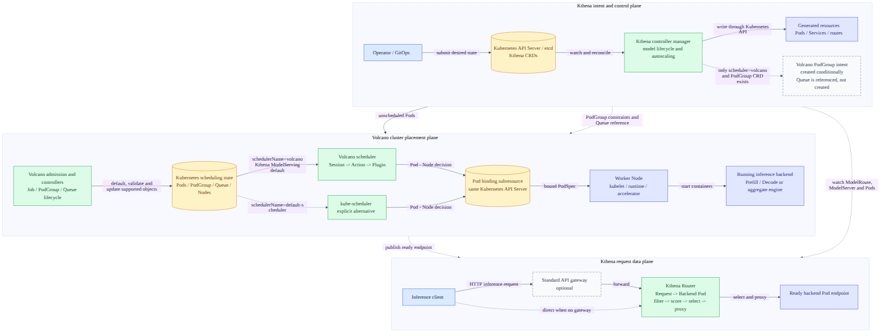

# Day 60：Volcano 与 Kthena 架构、项目成熟度及协作边界调研

> 日期：2026-08-11
>
> 范围：`volcano-sh/volcano`、`volcano-sh/kthena`，并与 AgentCube / AgentENV 做边界对照
>
> 核心问题：两个项目分别拥有哪一层？Kthena 是否依赖 Volcano？它们对 AgentCube 有什么可复用的架构启示？

## 一句话结论

**Volcano 是 Kubernetes 内的集群资源调度与批作业控制面，负责根据 Job、PodGroup、Queue、Gang 和拓扑约束把 Pod bind 到 Node；Kthena 是 Kubernetes-native 的 LLM serving 平台，负责模型生命周期、扩缩容和把 inference request 路由到已经运行的 backend Pod。**

在本文分析的职责层，二者不是直接替代关系，也不是同一层 scheduler：

- Volcano scheduler 解决 `Pod -> Node`；
- Kthena Router 的 request scheduler 解决 `Request -> Backend Pod`；
- Kthena 默认 `ModelServing` 路径使用名为 `volcano` 的 scheduler，并在条件满足时创建 Volcano `PodGroup`；
- 但 Kthena chart 不会安装 Volcano，用户也可以显式改用 `default-scheduler`，代价是失去 Volcano 提供的 gang、queue 和 network topology 语义。

从项目角度看，Volcano 的传统 Job / Queue / PodGroup / Gang 主干已经有长期历史、CNCF Incubating 治理和多版本 release 维护；Kthena 虽已发布 `v1.0.0` 且开发活跃，但核心 API 仍是 `v1alpha1`，Router 被项目明确称为持续迭代的 reference implementation，当前文档还存在已经删除的 `AutoscalingPolicyBinding` 残留。因此两者不能只按 tag 数字或 star 数量判断为同等成熟。

## 结论校准

| 结论 | 证据等级 | 本轮能证明什么 | 不能外推什么 |
| --- | --- | --- | --- |
| Volcano 是 Kubernetes-native 调度扩展 | **Observed** | 状态、watch、Binding 和执行链均经过 Kubernetes API / kubelet | 不能写成独立于 Kubernetes 的资源管理系统 |
| 默认 Volcano 流程是 `enqueue -> allocate -> backfill` | **Observed** | 固定 SHA 的默认 scheduler configuration 如此 | 不能说 `preempt` / `reclaim` 默认开启 |
| Volcano 聚焦调度测试通过 | **Verified** | 本地固定 SHA 的相关 Go package tests exit 0 | 不能代替集群 E2E、GPU 或大规模性能验证 |
| Kthena chart 可在不打包 Volcano 时独立 lint / render | **Observed + Verified** | chart composition 不包含 Volcano，lint/template 通过 | 不等于 cluster install、process startup 或默认 workload 已验证 |
| Kthena 可显式使用 kube-scheduler | **Observed** | 仓库存在 `schedulerName: default-scheduler` 示例 | 不保留 Volcano PodGroup / gang / queue / topology 能力 |
| Kthena Router 是 request-level scheduler | **Observed** | Router 对候选 backend 做 filter / score / select / proxy | 不能替代 Pod 到 Node 的 cluster scheduler |
| Kthena 已“生产成熟” | **Not verified** | README / release 使用 production-ready 定位 | 本轮没有独立生产采用、SLA、HA 或性能数据支持该判断 |
| 分层 fast plane 值得 AgentCube 研究 | **Inferred** | 来自 Volcano、Kthena、AgentENV 的职责对照 | 不是 AgentCube 已批准路线图，也不是性能结论 |

> 注释：本文的 **Observed** 表示固定源码、manifest 或官方文档直接可见；**Verified** 表示本轮执行命令得到结果；**Inferred** 是基于已观察结构的工程判断；**Not verified** 表示没有足够的独立运行或生产证据。

## 调研口径与证据边界

### 固定版本

本轮没有只读浮动的 `main` / `master` 页面，而是先冻结源码：

| 项目 | 固定引用 | 快照日期 | 同期最新 release | 说明 |
| --- | --- | --- | --- | --- |
| Volcano | `master@6575302cc650137929678ae010fa129a3553b630` | 2026-08-11 | `v1.15.1`，2026-07-30 | 固定 SHA 晚于 release，不能称为 `v1.15.1` 源码 |
| Kthena | `main@1b3319d0e2023157399c435d07c301cf7b9e8fbf` | 2026-08-11 | `v1.0.0`，2026-07-16 | 同样是 release 后的开发快照 |
| AgentCube | `main@4b38a442ba37db7ebf75903b051710c8b8936402` | Day59 对照基线 | `v0.1.0` | 只用于职责和依赖对照 |
| AgentENV | `main@0475f403b119c29d3b74aa32b5c10dff07c68493` | Day59 对照基线 | `v0.1.x` | 复用 Day59 已验证结论 |

所有源码链接尽量固定到 commit SHA。GitHub star、fork、issue、PR、release 和 check 状态属于 2026-08-11 的动态快照，不作为长期常量。

### 本轮验证

已执行：

```text
Volcano
  go test ./pkg/scheduler/framework \
    ./pkg/scheduler/actions/enqueue \
    ./pkg/scheduler/actions/allocate \
    ./pkg/scheduler/actions/backfill \
    ./pkg/scheduler/plugins/gang \
    ./pkg/controllers/job \
    ./pkg/controllers/podgroup \
    ./pkg/controllers/queue

  go test ./pkg/scheduler/actions/... \
    ./pkg/scheduler/plugins/gang \
    ./pkg/scheduler/plugins/drf \
    ./pkg/scheduler/plugins/binpack \
    ./pkg/controllers/job \
    ./pkg/controllers/queue

  helm lint installer/helm/chart/volcano
  helm template volcano installer/helm/chart/volcano \
    --namespace volcano-system --include-crds

Kthena
  go test ./pkg/model-serving-controller/... \
    ./pkg/model-booster-controller/... \
    ./pkg/autoscaler/... \
    ./pkg/kthena-router/... \
    ./pkg/controller

  helm lint charts/kthena
  helm template kthena charts/kthena \
    --namespace kthena-system --include-crds
```

Volcano 两组聚焦 Go tests、Kthena controller / autoscaler / Router 聚焦 tests 均通过；两个 chart 的 lint 与 template 均通过。

并行审计还尝试了 Kthena `go test ./...`。其中 4 个 E2E packages 因本机没有 active Kubernetes cluster、尝试连接 `localhost:8080` 而失败；排除 `test/e2e` 后，全部非 E2E Go packages 通过。这里把失败归为环境前置缺失，不归为 product failure，也不把非 E2E 通过升级成集群行为验证。

Python tests 未运行：当前环境没有 `pytest`，本轮按调研边界没有临时安装依赖。

没有运行：

- 真实 Kubernetes cluster E2E；
- GPU / NPU inference engine 部署；
- 多节点 gang、preemption、network topology placement；
- Kthena Router 的真实 streaming traffic、Redis 多副本和 PD disaggregation；
- 吞吐、TTFT、TPOT、调度延迟或故障恢复 benchmark。

因此本文能够审计架构合同和局部代码行为，但不把项目性能宣传转换为本地实测结论。

## 先看联合架构



可编辑源文件：[`day60-volcano-kthena-layered-architecture.mmd`](./day60-volcano-kthena-layered-architecture.mmd)。PNG 使用官方 `@mermaid-js/mermaid-cli@11.16.0` 本地渲染并完成视觉检查。

这张图刻意保留三条不同的因果链：

1. Kthena controller manager 把 model intent reconcile 成 CRD、Pod、Service 和 route state；
2. Volcano 根据 cluster resource / policy 把尚未调度的 Pod bind 到 Node；
3. Kthena Router 在 Pod 已经运行后，为每个 inference request 选择 backend。

> 注释：图中的虚线表示条件集成、替代路径或 watch，不表示请求同步调用。尤其是 Kthena 创建 PodGroup 的条件同时包含 `PodGroup` CRD 存在和 `schedulerName == "volcano"`；Queue 只被引用，不由 Kthena 创建。

## Volcano：Kubernetes 内的资源调度控制面

### 它拥有的边界

Volcano 的核心不是模型服务、sandbox runtime 或独立 cluster manager，而是 Kubernetes 内的 batch / AI workload scheduling extension。

默认安装出现三个常驻组件：

| 组件 | 输入 | 核心职责 | 输出 |
| --- | --- | --- | --- |
| `vc-webhook-manager` | Kubernetes AdmissionReview | 为 Job 等对象 default / validate / mutate | 接受或拒绝 API 请求，补 scheduler / queue 等默认值 |
| `vc-controller-manager` | Job、Queue、PodGroup 等 CRD 与 Pod event | 管理 workload lifecycle、创建下游对象、回写 status | PVC、PodGroup、Pod、Job / Queue / PG status |
| `vc-scheduler` | 未调度 Pod、PodGroup、Queue、Node 与资源状态 | 批次打开 Session，执行 Action，调用 Plugin | Pod Binding、调度 condition 与资源状态 |

标准安装结果和三组件可以在 [README](https://github.com/volcano-sh/volcano/blob/6575302cc650137929678ae010fa129a3553b630/README.md#L108-L150) 核对。Helm 默认三个组件各一副本，Agent Scheduler、sharding controller 和 colocation agent 都不是默认主路径，[values.yaml](https://github.com/volcano-sh/volcano/blob/6575302cc650137929678ae010fa129a3553b630/installer/helm/chart/volcano/values.yaml#L23-L60)。

`vcctl` 是操作 CLI，不应在部署拓扑里画成另一套控制面。Volcano 也没有替代这些 Kubernetes 基础职责：

- kube-apiserver / etcd 仍是持久化真相；
- Pod 仍是执行载体；
- scheduler 最终仍写 Kubernetes Pod Binding；
- kubelet、CNI、CSI 和 container runtime 仍负责节点侧执行；
- 可选 leader election 使用 Kubernetes Lease。

> 注释：更准确的说法是 Volcano 扩展或替换“被 `schedulerName` 选中的 Pod 的调度决策”，而不是替换 Kubernetes。

### CRD 与状态所有者

固定源码中的 core CRD bases 包含 Job、CronJob、Command、ColocationConfiguration、`Numatopology`、PodGroup、Queue、NodeShard、HyperNode；JobFlow chart 还带 JobFlow 和 JobTemplate。这里保留 CRD 的精确 Kind 拼写；自然语言概念仍称 NUMA topology。

其中最重要的三个调度对象是：

| 对象 | 不是 | 真正语义 | 主要 owner |
| --- | --- | --- | --- |
| Job | 普通 Deployment 的别名 | 带 task、retry、plugin 和 batch lifecycle 的 workload intent | 用户写 spec；Job controller 管 lifecycle / status |
| PodGroup | “同时启动”的分布式事务 | 一组 Pod 的 gang scheduling unit，含 `minMember`、task/subgroup 和资源约束 | Job/PG controller 创建或维护；scheduler 更新调度状态 |
| Queue | 消息 broker | Kubernetes CRD 形式的资源共享、准入和层级 policy boundary | operator 写 spec；Queue controller / scheduler 写 status |

PodGroup API 明确包含 `minMember`、`minTaskMember`、`queue`、`minResources`、`networkTopology` 和 `subGroupPolicy`，[API types](https://github.com/volcano-sh/volcano/blob/6575302cc650137929678ae010fa129a3553b630/staging/src/volcano.sh/apis/pkg/apis/scheduling/v1beta1/types.go#L155-L227)。Queue object / status 与 QueueSpec 分别在同一 API 文件的 [Queue types](https://github.com/volcano-sh/volcano/blob/6575302cc650137929678ae010fa129a3553b630/staging/src/volcano.sh/apis/pkg/apis/scheduling/v1beta1/types.go#L346-L423) 和 [QueueSpec](https://github.com/volcano-sh/volcano/blob/6575302cc650137929678ae010fa129a3553b630/staging/src/volcano.sh/apis/pkg/apis/scheduling/v1beta1/types.go#L460-L508) 中定义。

NodeShard、HyperNode 等新对象说明 Volcano 正在扩展多 scheduler 和网络拓扑能力，但它们不能反向代表所有默认安装都启用了这些路径。

### 一次 Volcano Job 怎么走

真实控制链比“提交 Job，然后 scheduler 调 Pod”更细：

```text
User submits Volcano Job
  -> kube-apiserver
  -> Volcano admission defaults / validates
  -> Job controller checks or creates required PVCs, then creates PodGroup
  -> scheduler enqueue checks Queue; evaluates resource admission when minResources exists
  -> logically pending PodGroup, whose phase may still be empty, changes to Inqueue
  -> Job controller creates task Pods
  -> scheduler cache Snapshot
  -> open Session
  -> execute Actions and Plugins
  -> Statement.Commit
  -> async per-Pod Binding calls
  -> kube-apiserver
  -> kubelet / runtime starts containers
  -> informer events update Job / PodGroup / Queue state
```

Job controller 初始化时会检查或创建 Job 所需的 PVC，再创建 / 更新 PodGroup；只有 Job 声明相应 volume / claim template 时才需要创建新 PVC，[job_controller_actions.go](https://github.com/volcano-sh/volcano/blob/6575302cc650137929678ae010fa129a3553b630/pkg/controllers/job/job_controller_actions.go#L290-L318)。PodGroup 在逻辑 pending 状态时不会继续创建 task Pods；调度器把空 phase 和字面 `Pending` 都视为 pending，[JobInfo.IsPending](https://github.com/volcano-sh/volcano/blob/6575302cc650137929678ae010fa129a3553b630/pkg/scheduler/api/job_info.go#L1288-L1293)。`enqueue` 先按 Queue 遍历待入队 Job；`minResources == nil` 时可直接入队，非空时才调用 `JobEnqueueable` 做资源准入，随后置为 Inqueue，[enqueue.go](https://github.com/volcano-sh/volcano/blob/6575302cc650137929678ae010fa129a3553b630/pkg/scheduler/actions/enqueue/enqueue.go#L79-L103)。

> 注释：PodGroup 入队发生在创建业务 Pod 之前；当 `minResources` 存在时，资源准入也发生在这里。这使相关策略不只是最终 Node score，而是 workload lifecycle gate。

### Session、Action 与 Plugin

Volcano scheduler 周期性从 informer-backed cache 创建 Snapshot、打开 Session、按配置顺序执行 Action，再关闭 Session。[scheduler.go](https://github.com/volcano-sh/volcano/blob/6575302cc650137929678ae010fa129a3553b630/pkg/scheduler/scheduler.go#L48-L153)

两种容易被都叫作“默认”的配置需要分开。

binary 在没有加载 scheduler config file 时使用内置 fallback：

```text
Actions
  enqueue -> allocate -> backfill

Tier 1 plugins
  priority, gang, conformance

Tier 2 plugins
  overcommit, drf, predicates, proportion, nodeorder
```

证据位于 [binary fallback config](https://github.com/volcano-sh/volcano/blob/6575302cc650137929678ae010fa129a3553b630/pkg/scheduler/util.go#L38-L80)。本文验证的标准 Helm deployment 会挂载 chart 自带 config；它保持相同 Actions，但 Tier 2 还包含 `binpack`，并对 gang / drf 显式设置 `enablePreemptable: false`，[Helm scheduler config](https://github.com/volcano-sh/volcano/blob/6575302cc650137929678ae010fa129a3553b630/installer/helm/chart/volcano/config/volcano-scheduler.conf#L1-L15) [ConfigMap template](https://github.com/volcano-sh/volcano/blob/6575302cc650137929678ae010fa129a3553b630/installer/helm/chart/volcano/templates/scheduler.yaml#L17-L23)。

源码同时注册 `reclaim`、`preempt`、`gangpreempt`、`gangreclaim`、`shuffle` 等 Action，[action registry](https://github.com/volcano-sh/volcano/blob/6575302cc650137929678ae010fa129a3553b630/pkg/scheduler/actions/factory.go#L23-L43)。但“代码可用”和“默认执行”是两个状态，配置标识符也区分大小写。

Action 和 Plugin 也不能混写：

- Action 编排一个调度阶段，例如 enqueue、allocate、backfill；
- Plugin 在 Session 生命周期内注册 Queue / Job / Task 排序、predicate、score、admission、preemption 等 extension functions；
- predicates / nodeorder 会复用 Kubernetes scheduler 的部分能力，但 Volcano 保留自己的 Session / Action / Plugin framework。

### Gang 不是跨 Pod 原子事务

Gang plugin 会检查当前规划是否满足 Job 的 `minAvailable`，以及 task / subgroup 约束；只有 Ready 时才提交本轮调度器内存操作。

但这不等于：

- 所有 replicas 在同一时刻启动；
- kube-apiserver 提供跨 Pod ACID transaction；
- 所有 Binding 要么全成功、要么全失败；
- 节点和镜像状态在规划后不会变化。

Statement 先修改 Session 中的 allocate / pipeline / evict 状态，`Discard` 可回滚本轮内存规划，`Commit` 后才把实际 binding 放入 cache 的工作队列，[statement.go](https://github.com/volcano-sh/volcano/blob/6575302cc650137929678ae010fa129a3553b630/pkg/scheduler/framework/statement.go#L255-L425)。真实 Binding 仍逐 Pod 调 Kubernetes API，[cache.go](https://github.com/volcano-sh/volcano/blob/6575302cc650137929678ae010fa129a3553b630/pkg/scheduler/cache/cache.go#L223-L253)。

> 注释：这里的“transaction”是 scheduler-cycle 内的规划与回滚抽象，不是持久化分布式事务。进程崩溃后以内存 Statement 为真是不成立的，scheduler 必须从 API 状态重建。

### DRF 与 Binpack 的准确边界

DRF 计算多资源 dominant share，并用 JobOrderFn 让 share 较小者优先。它解决公平排序，不自动等于 tenant hard quota、强隔离或容量保留；Queue entitlement / capability 和 proportion/capacity policy 才更接近这些边界。[DRF share](https://github.com/volcano-sh/volcano/blob/6575302cc650137929678ae010fa129a3553b630/pkg/scheduler/plugins/drf/drf.go#L186-L263) [JobOrderFn](https://github.com/volcano-sh/volcano/blob/6575302cc650137929678ae010fa129a3553b630/pkg/scheduler/plugins/drf/drf.go#L370-L388)

Binpack 注册 NodeOrder score，按 CPU、内存和配置扩展资源的使用比例加权，让新的 workload 更倾向填充已使用节点。它不会绕过 predicates，也不负责 Queue admission。[binpack.go](https://github.com/volcano-sh/volcano/blob/6575302cc650137929678ae010fa129a3553b630/pkg/scheduler/plugins/binpack/binpack.go#L202-L260)

这些区别对 review 很重要：

- 公平排序不等于配额；
- score 不等于 filter；
- filter 不等于 admission；
- session commit 不等于实际 Pod 已运行。

### HA 与故障恢复

Scheduler 和 controller binary 支持 Lease leader election，但 Helm 默认：

- 每个核心组件 `replicas: 1`；
- leader election 关闭；
- 默认只有一个 scheduler process；启用 Lease leader election 后才形成单 leader / standby 关系。

所以应写成“支持配置 control-plane HA”，不能写成“默认 HA”。启用 leader election 后增加 standby 副本，主要提升 leader 故障接管能力，不自动把同一个 scheduler partition 变成 active-active throughput scaling。

基于代码结构可以做出以下 **Inferred** 判断：scheduler 崩溃会丢失尚未持久化的 Session、Statement 和 assume state；已经写入 API 的 Job、PodGroup、Queue、Pod 和 Binding 可由 informer 重建。Bind 不是跨 Pod transaction，因此异常窗口中可以出现部分成功，再由后续 reconciliation 收敛。

### Agent Scheduler 不是默认 Volcano 的同义词

Volcano 另有面向 agentic workload 的 Agent Scheduler 和 NodeShard / multi-scheduler 路径。它使用 activeQ、backoffQ、unschedulable pool、多 worker 和 conflict-aware binder，目标是降低单 Pod scheduling latency、增加并行度。

但固定快照中：

- Helm `agent_scheduler_enable=false`；
- 设计文档仍有待完成项；
- v1.14.0 release 将相关能力描述为 Alpha；
- v1.15 仍包含稳定性修复和分片策略演进。

因此可以说“已经进入 release、仍在快速演进”，不能把设计目标写成已独立验证的生产 SLA。参见 [Agent Scheduler design](https://github.com/volcano-sh/volcano/blob/6575302cc650137929678ae010fa129a3553b630/docs/design/agent-scheduler.md#L5-L110) 与 [v1.14.0 release](https://github.com/volcano-sh/volcano/releases/tag/v1.14.0)。

## Kthena：LLM 生命周期控制面与请求数据面

### 两个可独立部署的组件

Kthena README 把系统拆成两个组件：

| 组件 | 平面 | 拥有的职责 |
| --- | --- | --- |
| `kthena-controller-manager` | control plane | 读取模型 CRD，管理部署、ServingGroup / Role、rollout、recovery、autoscaling 和下游 Kubernetes resources |
| `kthena-router` | request data plane | 根据 ModelRoute / ModelServer / Pod 状态，执行匹配、流控、filter / score / select 和 streaming proxy |

README 明确说二者可以独立部署和使用，同时指出 Router 是为补充 Gateway Inference Extension 当前不原生支持 P/D disaggregation 的 **reference implementation**，仍在持续迭代，可放在标准 API gateway 后面。[README architecture](https://github.com/volcano-sh/kthena/blob/1b3319d0e2023157399c435d07c301cf7b9e8fbf/README.md#L53-L65)

这里的“独立”指 Kthena 的 control-plane binary 和 Router binary 可以分别部署，不表示任一组件脱离 Kubernetes：

- controller 使用 CRD、client-go、informer 和 reconciliation；
- Router watch ModelRoute、ModelServer、ExternalModelProvider、Pod，以及可选 Gateway API / Gateway Inference Extension；
- model lifecycle 的 desired/object truth 与 route intent 仍在 Kubernetes API；controller 内部的 ServingGroup / Role 状态是由 ModelServing 与 Pod 等对象重建的进程内派生状态，不是独立 CRD，也不是 durable source of truth。[controller datastore](https://github.com/volcano-sh/kthena/blob/1b3319d0e2023157399c435d07c301cf7b9e8fbf/pkg/model-serving-controller/datastore/store.go#L57-L78)

### 当前真实 CRD 模型

固定源码中的主干 API 是：

```text
Workload
  ModelBooster
  ModelServing
  AutoscalingPolicy

Networking
  ModelRoute
  ModelServer
  ExternalModelProvider
```

高层 `ModelBooster` 当前只有一个 `Backend` 字段，[ModelBooster API](https://github.com/volcano-sh/kthena/blob/1b3319d0e2023157399c435d07c301cf7b9e8fbf/pkg/apis/workload/v1alpha1/model_booster_types.go#L26-L45)。controller 的实际 cascade 是：

```text
ModelBooster
  -> ModelServing
  -> ModelServer
  -> ModelRoute
```

它在当前 SHA **不会** 创建 `AutoscalingPolicyBinding`，也没有该 CRD；reconcile 只依次创建或更新 ModelServing、ModelServer 和 ModelRoute，[ModelBooster controller](https://github.com/volcano-sh/kthena/blob/1b3319d0e2023157399c435d07c301cf7b9e8fbf/pkg/model-booster-controller/controller/model_booster_controller.go#L189-L230)。后文会说明文档为何仍出现旧 Binding。

`ModelServing` 再把模型 workload 表达为：

```text
ModelServing
  -> N ServingGroups
      -> one or more Roles
          -> Entry Pod
          -> zero or more Worker Pods
```

这里的 `ServingGroup` 和 `Role` 是 `ModelServing.spec` 中的嵌套结构以及 controller 的内存模型，并不会各自创建同名 Kubernetes CR。它们可以表达 aggregate engine 或 Prefill / Decode 分离；`ServingGroup` 还可携带 gang policy 和 network topology，Role 具有 entry / worker templates。这使模型语义高于 Deployment，但持久化的实际子对象主要是 Entry / Worker Pods、headless Services、ControllerRevisions，以及条件满足时的 Volcano PodGroups。[headless Service](https://github.com/volcano-sh/kthena/blob/1b3319d0e2023157399c435d07c301cf7b9e8fbf/pkg/model-serving-controller/utils/utils.go#L238-L266) [ControllerRevision](https://github.com/volcano-sh/kthena/blob/1b3319d0e2023157399c435d07c301cf7b9e8fbf/pkg/model-serving-controller/utils/controller_revision.go#L42-L102)

> 注释：Kthena 的核心价值不是重新实现 kubelet，而是把 LLM deployment topology、rollout、routing 和 scaling intent 做成领域 CRD。

### ModelServing 与 Volcano 的准确依赖

Kthena 对 Volcano 的关系必须拆成四层。

#### 1. 构建与 API 层：直接依赖

Kthena `go.mod` 直接依赖 `volcano.sh/apis`；`NetworkTopology` API 也嵌入 Volcano 类型。这不是“两个项目同组织所以看起来相关”，而是可编译依赖和 API 类型耦合。[go.mod](https://github.com/volcano-sh/kthena/blob/1b3319d0e2023157399c435d07c301cf7b9e8fbf/go.mod#L36-L47) [ServingGroup API](https://github.com/volcano-sh/kthena/blob/1b3319d0e2023157399c435d07c301cf7b9e8fbf/pkg/apis/workload/v1alpha1/servinggroup_types.go#L17-L52)

#### 2. Helm packaging 层：不打包 Volcano

`charts/kthena` 只包含 Kthena workload / networking CRD、controller 和 Router manifests，不包含 Volcano chart。两套 chart 的 packaging 边界是分开的。

这只能证明 chart composition 没有硬捆绑。本轮 lint / template 没有向 cluster 提交对象，不能单独证明 install、process startup 或默认 workload 路径可运行。

#### 3. 默认运行路径：假定存在 `volcano` scheduler

`ModelServing.spec.schedulerName` 的 CRD default 是 `volcano`，[model_serving_types.go](https://github.com/volcano-sh/kthena/blob/1b3319d0e2023157399c435d07c301cf7b9e8fbf/pkg/apis/workload/v1alpha1/model_serving_types.go#L35-L49)。controller 生成 Entry / Worker Pod 时把该值写入 `PodSpec.SchedulerName`，[utils.go](https://github.com/volcano-sh/kthena/blob/1b3319d0e2023157399c435d07c301cf7b9e8fbf/pkg/model-serving-controller/utils/utils.go#L96-L120)。

因此在没有名为 `volcano` 的 scheduler 时，省略该字段创建出来的 Pod 不会自动回退到 kube-scheduler；它会等待匹配 scheduler 处理。

#### 4. 可替代与高级能力边界

仓库提供 `schedulerName: default-scheduler` 示例，说明基础 lifecycle 可显式选择原生 kube-scheduler。[host affinity example](https://github.com/volcano-sh/kthena/blob/1b3319d0e2023157399c435d07c301cf7b9e8fbf/examples/kube-scheduler-pod-affinity/modelserving-host-affinity.yaml#L1-L25)

PodGroup manager 则会动态探测 `podgroups.scheduling.volcano.sh`：

- CRD 不存在时跳过 PodGroup informer；
- 只有 CRD 存在且 `schedulerName == "volcano"` 才创建 PodGroup；
- 创建的 PodGroup 继承 minMember / minResources、可选 Queue、network topology，并在 API 支持时增加 SubGroupPolicy。

证据见 [PodGroup detection](https://github.com/volcano-sh/kthena/blob/1b3319d0e2023157399c435d07c301cf7b9e8fbf/pkg/model-serving-controller/podgroupmanager/manager.go#L85-L173) 与 [creation gate](https://github.com/volcano-sh/kthena/blob/1b3319d0e2023157399c435d07c301cf7b9e8fbf/pkg/model-serving-controller/podgroupmanager/manager.go#L224-L317)。

最准确的总表是：

| 层 | 没有安装 Volcano 时 | 显式改用 `default-scheduler` | 使用 Volcano |
| --- | --- | --- | --- |
| Helm lint / template | 通过 | 通过 | 通过 |
| Cluster install / process startup | **本轮未验证** | **本轮未验证** | **本轮未验证** |
| PodGroup manager 源码路径 | CRD 缺失时跳过 PodGroup informer | scheduler 非 `volcano` 时不创建 PodGroup | CRD 存在且 scheduler 匹配时创建 PodGroup |
| ModelServing Pod placement 预期 | **默认 schedulerName 为 `volcano`，无匹配 scheduler 会等待** | PodSpec 指向 kube-scheduler | PodSpec 指向 Volcano |
| PodGroup / gang / queue / topology contract | 不成立 | 不保留 | 源码支持；集群行为未验证 |
| Request routing 对 Volcano 的同步依赖 | 无 | 无 | 无；它仍依赖 Kubernetes discovery state |

> 注释：官方 quick start 把 Volcano 列为 prerequisite，而安装说明有时称它为 gang scheduling 的 optional dependency。把默认 `schedulerName` 与 feature-specific PodGroup gate 一起读，才能解释这两个表述为何同时出现。

### ModelBooster 当前没有创建 AutoscalingPolicy

当前 ModelBooster converter / controller 只管理 ModelServing、ModelServer、ModelRoute。文档中“定义 `autoscalingPolicy` 后自动创建 AutoscalingPolicy and Binding”的描述，不符合固定 SHA 的实际 cascade。

Autoscaler 本身仍存在，当前 `AutoscalingPolicy` API 直接包含：

- homogeneous target；
- heterogeneous target；
- disaggregated target；
- metric endpoint、trigger、behavior 等配置。

也就是说，autoscaling 能力没有因 Binding 删除而整体消失，而是 target binding 已合并进 policy 本身。

### Router 的真实请求链

Router 的主路径可概括为：

```text
HTTP request
  -> authentication middleware, only effective when JWKS is configured
  -> parse model / route match
  -> ModelRoute or HTTPRoute / InferencePool resolution
  -> configured rate limit
  -> direct load balancing
     OR fairness queue
     OR session-boost queue
  -> request scheduler filters candidates
  -> score and select backend
  -> proxy / stream response
```

Router watch 的状态包括：

- ModelRoute；
- ModelServer；
- ExternalModelProvider；
- backend Pods；
- 可选 Gateway API 和 Gateway Inference Extension objects。

它的 scheduler plugins 包括 least-request、least-latency、LoRA affinity、GPU usage、prefix cache、KV-cache-aware、random 等。P/D request scheduling 会先评估 Decode candidates，再选择同 group 的 Prefill backend。

但能力列表不等于 chart 默认：

| 能力 | 当前 chart 默认 |
| --- | --- |
| Router replicas | `1` |
| external TLS | disabled |
| Gateway API | disabled |
| fairness | disabled |
| session boost | disabled |
| access log | enabled |
| score plugins | least-request、gpu-usage、least-latency、prefix-cache，权重均 1 |
| filter | least-request |
| LoRA affinity | disabled |
| KV-cache-aware | 不在默认 plugin chain |

因此官方架构文档的“每个请求依次经过 auth、fairness、scheduling”更适合看作 capability pipeline，而不是 default-deployment trace。源码实际在 fairness 与 session boost 都关闭时走 direct load balancing，[router.go](https://github.com/volcano-sh/kthena/blob/1b3319d0e2023157399c435d07c301cf7b9e8fbf/pkg/kthena-router/router/router.go#L360-L410)。

> 注释：`KV-cache-aware` plugin 存在不等于它默认启用，也不等于本轮验证了 cache hit rate 或 TTFT 改善。

### Router 状态与多副本边界

Router 从 Kubernetes watch 重建 route、server 和 Pod discovery state，主要拓扑状态在本地 map / `sync.Map` 中。默认启用的 `prefix-cache` 会在 upstream proxy 成功后的 PostSchedule hook 中，把 prompt prefix hash 到所选 Pod 的关联写入每个 Router 进程自己的 LRU state；它不是从 Kubernetes 重建的共享状态。[proxy success hook](https://github.com/volcano-sh/kthena/blob/1b3319d0e2023157399c435d07c301cf7b9e8fbf/pkg/kthena-router/router/router.go#L797-L827) [prefix-cache](https://github.com/volcano-sh/kthena/blob/1b3319d0e2023157399c435d07c301cf7b9e8fbf/pkg/kthena-router/scheduler/plugins/prefix_cache.go#L155-L223)

Router 的 scheduler plugin 与 authentication 配置来自挂载文件，并在 `NewRouter` 启动时读取；固定源码没有对该配置文件建立 watch。因此 ConfigMap 内容变化本身不会证明现有进程已热更新。[router initialization](https://github.com/volcano-sh/kthena/blob/1b3319d0e2023157399c435d07c301cf7b9e8fbf/pkg/kthena-router/router/router.go#L126-L164) [config parser](https://github.com/volcano-sh/kthena/blob/1b3319d0e2023157399c435d07c301cf7b9e8fbf/pkg/kthena-router/scheduler/plugins/conf/conf.go#L63-L80)

配置 `REDIS_HOST` 且连接成功时，Redis 用来共享 per-Pod in-flight request counter；连接初始化失败会回退到本地 counter。[Router store setup](https://github.com/volcano-sh/kthena/blob/1b3319d0e2023157399c435d07c301cf7b9e8fbf/cmd/kthena-router/app/server.go#L76-L92)

但 Redis 没有把所有 Router state 都变成全局一致：

- fairness queues / token tracker 仍是进程内状态；
- session-boost queue 和近期 session state 仍有本地部分；
- prefix-cache 的已学习 hash -> Pod 关联仍是各进程本地状态；
- discovery 由各 replica 自己 watch Kubernetes；mounted scheduler / auth config 则在进程启动时读取；
- 默认只有一个 Router replica，因此没有默认 HA。

由此可以做出 **Inferred** 判断：多 Router replica 时，Redis 能缩小 least-request counter 的偏差，但不能单独提供完整的全局 fairness、session continuity 或 active-active failure semantics。这需要集群 E2E 和故障注入进一步验证。

### 默认安全边界

固定 chart 直接创建 `LoadBalancer` Service，在 port 80 暴露 Router；external TLS 默认关闭，默认 router config 也没有 authentication block / JWKS URI。是否真正获得公网地址取决于集群的 LoadBalancer 实现，但 chart 的默认 Service 边界是明文且不做 JWT authentication。[Router Service](https://github.com/volcano-sh/kthena/blob/1b3319d0e2023157399c435d07c301cf7b9e8fbf/charts/kthena/charts/networking/templates/kthena-router/component/service.yaml#L1-L17) [values](https://github.com/volcano-sh/kthena/blob/1b3319d0e2023157399c435d07c301cf7b9e8fbf/charts/kthena/values.yaml#L41-L66) [default config](https://github.com/volcano-sh/kthena/blob/1b3319d0e2023157399c435d07c301cf7b9e8fbf/charts/kthena/charts/networking/templates/kthena-router/component/configmap.yaml#L1-L39)

JWT auth 只有在配置 JWKS URI 时才启用；未配置不是“允许匿名后仍做 authorization”，而是 auth middleware 不执行真实 JWT 验证。

固定 SHA 下的 `Authorize` 函数还是空实现，本轮对非测试 Router source 的检索也没有发现调用点，[authorization.go](https://github.com/volcano-sh/kthena/blob/1b3319d0e2023157399c435d07c301cf7b9e8fbf/pkg/kthena-router/filters/auth/authorization.go#L17-L24)。所以当前能确认的是“可选 JWT authentication”，不能把 architecture doc 中的 Authentication & Authorization 合并描述当成已实现的细粒度 authorization。

Router ClusterRole 还能跨 cluster list / watch Secrets。它用 label selector 缩小正常 cache 内容，但源码注释明确说明 Kubernetes RBAC 不支持 label-aware authorization，该 selector 不是授权边界。[ClusterRole](https://github.com/volcano-sh/kthena/blob/1b3319d0e2023157399c435d07c301cf7b9e8fbf/charts/kthena/charts/networking/templates/kthena-router/rbac/cluster-role.yaml#L30-L44) [secret informer](https://github.com/volcano-sh/kthena/blob/1b3319d0e2023157399c435d07c301cf7b9e8fbf/pkg/kthena-router/controller/externalmodelprovider_secret_informer.go#L28-L44)

所以不能从项目拥有 TLS / JWT 配置项推导“默认每个 inference request 都经过认证加密”。在生产设计中还需要明确：

- 外部 gateway 是否终止 TLS；
- gateway 到 Router / Router 到 backend 是否有独立 transport security；
- tenant identity 如何绑定 ModelRoute、rate limit 和 fairness；
- debug / metrics endpoint 的 network policy；
- Redis credential、TLS 和故障策略。

### Controller HA 边界

Kthena controller binary 支持 leader election 参数，但 chart 默认 controller replica 为 1，且当前 values / deployment template 没有把增加 replicas 与启用 leader election 自动绑定。

这意味着：

- 默认单副本不是 HA；
- 手动把 replica 数改成 2 不能自动证明形成单 leader；
- 多副本 controller 行为需要同时检查 leader election flag、Lease RBAC 和 failover E2E。

这是一条 operator caveat，不应在没有复现并发 reconcile 的情况下直接升级成 race bug。

另一个独立的可用性边界是 admission webhook：workload 与 networking webhook 在 chart 中默认启用，匹配的 create / update 使用 `failurePolicy: Fail`、`timeoutSeconds: 30`；controller 和 Router 又都默认一副本，本轮也未在 chart 中发现 PodDisruptionBudget。[workload webhook](https://github.com/volcano-sh/kthena/blob/1b3319d0e2023157399c435d07c301cf7b9e8fbf/charts/kthena/charts/workload/templates/kthena-controller-manager/component/mutating-webhook.yaml#L13-L57) [networking webhook](https://github.com/volcano-sh/kthena/blob/1b3319d0e2023157399c435d07c301cf7b9e8fbf/charts/kthena/charts/networking/templates/kthena-router/component/validating-webhook.yaml#L13-L63)

这是 **Observed static risk**：webhook 不可达时，匹配 CR 的 create / update 可能被 API Server 阻塞或拒绝；本轮没有在真实集群中制造 outage，不能报告实际中断时长或恢复行为。

## Kthena 实现、配置与文档漂移

### Readiness probe 没有使用已有的 `/readyz`

Router 实现同时提供：

- `/healthz`：固定返回 200；
- `/readyz`：根据 controller cache 和首次 store metrics / model scrape 是否完成返回 ready / unavailable。

但当前 chart 的 liveness **和 readiness** 都请求 `/healthz`，[deployment template](https://github.com/volcano-sh/kthena/blob/1b3319d0e2023157399c435d07c301cf7b9e8fbf/charts/kthena/charts/networking/templates/kthena-router/component/deployment.yaml#L131-L148)。更严格的 handler 已存在于 [router.go](https://github.com/volcano-sh/kthena/blob/1b3319d0e2023157399c435d07c301cf7b9e8fbf/cmd/kthena-router/app/router.go#L227-L273)，却没有被 chart readiness 使用。

Router 在启动 HTTP listener 前会等待 controller caches 完成同步，因此不能把这项 finding 写成“route / backend inventory 尚未同步就接流量”。真实偏差更窄：listener 启动后、store 完成首次 metrics / model scrape 前，`/healthz` 已返回 200，而 `/readyz` 仍会报告 unavailable；chart 可能在这个窗口提前把 Pod 标为 Ready。[startup order](https://github.com/volcano-sh/kthena/blob/1b3319d0e2023157399c435d07c301cf7b9e8fbf/cmd/kthena-router/app/server.go#L76-L115) [store sync](https://github.com/volcano-sh/kthena/blob/1b3319d0e2023157399c435d07c301cf7b9e8fbf/pkg/kthena-router/datastore/store.go#L580-L613)

源码审计能确认 probe contract 偏差；本轮没有 cluster timing trace，尚未量化实际窗口或请求影响。

### Redis Secret key 在项目内不一致

官方 Redis 示例把密码放在 Secret data key `REDIS_PASSWORD`，[redis-standalone.yaml](https://github.com/volcano-sh/kthena/blob/1b3319d0e2023157399c435d07c301cf7b9e8fbf/examples/redis/redis-standalone.yaml#L18-L28)。ModelBooster 生成的 Runtime sidecar env 也读取 `REDIS_PASSWORD`，[model_serving.go](https://github.com/volcano-sh/kthena/blob/1b3319d0e2023157399c435d07c301cf7b9e8fbf/pkg/model-booster-controller/convert/model_serving.go#L584-L590)。

Router deployment template 却从同名 Secret 读取 key `password`，而且标为 optional，[Router deployment](https://github.com/volcano-sh/kthena/blob/1b3319d0e2023157399c435d07c301cf7b9e8fbf/charts/kthena/charts/networking/templates/kthena-router/component/deployment.yaml#L67-L84)。按官方示例直接部署带密码 Redis 时，Router 与 Runtime 不会读取同一个 key contract。

这是 **Observed manifest mismatch**，但本轮没有启动带密码 Redis 做 runtime reproduction，因此不继续推导具体错误响应或重连行为。

### ModelBooster 的 Redis 自动注入存在 namespace 边界

KV-cache-aware 文档先在 `kthena-system` 创建 `redis-config`、`redis-secret` 与 `redis-server`，并称 ModelBooster 会自动注入正确环境变量、无需额外配置；同页又说明其他 namespace 的 runtime sidecar 应使用 `redis-server.kthena-system.svc.cluster.local`。[KV cache guide](https://github.com/volcano-sh/kthena/blob/1b3319d0e2023157399c435d07c301cf7b9e8fbf/docs/kthena/docs/user-guide/kvcache-aware.md#L64-L117)

但 ModelBooster converter 生成的 Pod env 使用未带 namespace 的 `ConfigMapKeyRef redis-config` 和 `SecretKeyRef redis-secret`。Kubernetes 的这两类引用只能读取 Pod 所在 namespace 的对象；converter 也没有直接写入跨 namespace Redis DNS。[generated env](https://github.com/volcano-sh/kthena/blob/1b3319d0e2023157399c435d07c301cf7b9e8fbf/pkg/model-booster-controller/convert/model_serving.go#L549-L595)

因此“任意 namespace 使用 ModelBooster 都无需额外配置”与当前自动注入实现不一致。除非 ModelBooster workload 也位于 `kthena-system`，或用户在 workload namespace 提供这些配置对象，并把 `redis-config.REDIS_HOST` 设成 `redis-server.kthena-system.svc.cluster.local` 之类的跨 namespace FQDN，否则源码不能证明 runtime sidecar 会得到文档中的 Redis 地址；原样复制示例中的短名 `redis-server` 只会解析 workload namespace 内的 Service。这是 **Observed configuration gap**，尚未做集群复现。

### ModelServer 部分 API 字段还没有 Router consumer

`ModelServer` API 定义了：

- `WorkloadPort.Protocol`，允许 `http` / `https`；
- `TrafficPolicy.Timeout`；
- `TrafficPolicy.Retry`。

参见 [modelserver_types.go](https://github.com/volcano-sh/kthena/blob/1b3319d0e2023157399c435d07c301cf7b9e8fbf/pkg/apis/networking/v1alpha1/modelserver_types.go#L88-L142)。本轮对非测试 Router Go source 的 symbol scan 没找到 `TrafficPolicy` consumer；普通 ModelServer 路径只读取 `WorkloadPort.Port`，未读取 `Protocol`，[router.go](https://github.com/volcano-sh/kthena/blob/1b3319d0e2023157399c435d07c301cf7b9e8fbf/pkg/kthena-router/router/router.go#L470-L493)。P/D 的内置 HTTP connector 也显式把 Prefill / Decode URL scheme 设为 `http`，[HTTP connector](https://github.com/volcano-sh/kthena/blob/1b3319d0e2023157399c435d07c301cf7b9e8fbf/pkg/kthena-router/connectors/http.go#L35-L60)。

因此 current architecture doc 中“应用 retries、timeouts 和 connection settings”的表述不能直接当作固定 SHA 的实现事实。这可能是尚未接线的 API surface，而不是 schema 本身错误。

### 已删除的 AutoscalingPolicyBinding 仍出现在 current docs

这是本轮最明确的项目面 finding。

当前 architecture / intro / deployment docs 仍写：

```text
ModelBooster
  -> AutoScalingPolicy
  -> AutoScalingPolicyBinding
```

并称 Autoscaler 通过 Binding 连接 target。参见 [current architecture doc](https://github.com/volcano-sh/kthena/blob/1b3319d0e2023157399c435d07c301cf7b9e8fbf/docs/kthena/docs/architecture/architecture.mdx#L17-L47) 和 [current intro](https://github.com/volcano-sh/kthena/blob/1b3319d0e2023157399c435d07c301cf7b9e8fbf/docs/kthena/docs/intro.md#L1-L20)。

但 `v1.0.0` release notes 明确记录：

- 从 CRD、client 和 informer 删除 AutoscalingPolicyBinding；
- 把不同 target 合并进 AutoscalingPolicy；
- chart 不再安装 Binding CRD。

当前源码、generated client 和 chart 也没有该 resource，ModelBooster 当前更不会创建它。

因此这是 **Observed documentation drift**，不是对设计理念的不同解释。基于该漂移可以推断出三类使用风险，但本轮没有用户访谈或事故数据证明它们已经发生：

1. 新用户可能按架构图查找不存在的 CRD；
2. operator 可能对 ownership / deletion cascade 形成错误模型；
3. review 可能拿旧 binding contract 评估当前 autoscaler。

### Capability 文档也不能直接当 default trace

当前 architecture doc 把 auth、rate limit、fairness、scheduling、load balancing、proxy 写成每请求六阶段，并写 request scheduler 在 microseconds 完成。

源码和 chart 能证明这些模块存在，也能证明多个阶段是条件启用；本轮没有 microbenchmark 或 production trace。因此文章采用：

- capability existence：Observed；
- default enabled state：Observed；
- microseconds latency：project claim，Not verified；
- production reliability：Not verified。

## 两个项目如何协作

### 一个部署事件

以 P/D disaggregation 的 ModelServing 为例：

1. 用户向 Kubernetes API 提交 ModelServing / ModelServer / ModelRoute，或先提交 ModelBooster；
2. ModelBooster controller 在后一种路径创建 ModelServing、ModelServer、ModelRoute 三个同级 CR；
3. ModelServing controller 从 spec 中的 ServingGroup / Role 嵌套结构构造进程内状态，并 reconcile Entry / Worker Pods、headless Services 和 ControllerRevisions；ServingGroup / Role 本身不是生成的 Kubernetes 对象；
4. 当 `schedulerName=volcano` 且 PodGroup CRD 存在时，Kthena 为每个 ServingGroup 条件创建 PodGroup；它从 ModelServing 的 queue-name annotation 读取 Queue 名称并写入 `PodGroup.spec.queue`，不创建 Queue CR，[PodGroup queue mapping](https://github.com/volcano-sh/kthena/blob/1b3319d0e2023157399c435d07c301cf7b9e8fbf/pkg/model-serving-controller/podgroupmanager/manager.go#L251-L311)；
5. Volcano 读取 Pod、PodGroup、Queue、Node 和 topology state；
6. Volcano 在 Session 内做 admission、filter、score 和 gang readiness planning，再逐 Pod 写 Binding；若用户显式选择 `default-scheduler`，则由 kube-scheduler 执行 Pod placement，且不走上述 PodGroup 合同；
7. kubelet / runtime 启动 inference engine；
8. Router 用 ModelServer 的 label selector 找出同 namespace 且 Running / Ready 的 Pods，再直接使用 PodIP 与 `WorkloadPort.Port` 形成候选 backend；该主路径不依赖 Service endpoints 或 EndpointSlice。[ModelServer discovery](https://github.com/volcano-sh/kthena/blob/1b3319d0e2023157399c435d07c301cf7b9e8fbf/pkg/kthena-router/controller/modelserver_controller.go#L175-L220) [readiness filter](https://github.com/volcano-sh/kthena/blob/1b3319d0e2023157399c435d07c301cf7b9e8fbf/pkg/kthena-router/controller/modelserver_controller.go#L310-L320)

### 一个请求事件

1. Client 向 Kthena Router 或其前置 API gateway 发 inference request；
2. Router 匹配 ModelRoute / ModelServer，并按当前启用的 auth、rate limit、fairness / session policy 处理；
3. Router 在已经运行的候选 Pods 中 filter / score / select；
4. P/D 模式下选择兼容的 Decode / Prefill pair；
5. Router proxy 请求并 streaming response；
6. Volcano 不在每 token 或每 request 的同步热路径中。

> 注释：Volcano 决定 backend “在哪里运行”，Kthena Router 决定这一次请求“发给哪个已运行 backend”。前者通常是较慢的 cluster placement loop，后者是请求热路径。

### 技术依赖矩阵

| 关系 | Volcano -> Kthena | Kthena -> Volcano |
| --- | --- | --- |
| 源码 import | 无 | `volcano.sh/apis` 直接依赖 |
| 安装打包 | 不安装 Kthena | 不安装 Volcano |
| 核心使用范围 | 可服务 batch、AI、HPC 等多种 workload | 聚焦 LLM inference lifecycle / routing |
| 默认 scheduler contract | 不知道 Kthena domain | ModelServing 默认选择 `volcano` |
| CRD 协作 | 提供 PodGroup / Queue / topology API | 动态检测并创建 PodGroup |
| 请求路由 | 不负责 | Router 自己负责 |
| 可独立存在 | 可以 | Router 的请求路径不需要 Volcano；ModelServing 需显式选择其他 scheduler；cluster startup 本轮未验证 |

因此：

- Volcano 不需要 Kthena；
- Kthena 不是 Volcano scheduler 的替代品；
- Kthena ModelServing 的默认和高级 placement 路径直接消费 Volcano；Router 请求路径不消费；
- “都在 `volcano-sh` organization”只能证明组织邻近，技术依赖仍应以上述源码和 runtime contract 为证据；
- Kthena 是否是 CNCF Volcano 的正式 subproject，不能仅凭 GitHub organization 名称推导。

## 项目视角：活跃度、治理与成熟度

### 2026-08-11 动态快照

下表采集于 **2026-08-11 15:57 CST**。仓库元数据来自 GitHub REST 的 [Volcano](https://api.github.com/repos/volcano-sh/volcano) / [Kthena](https://api.github.com/repos/volcano-sh/kthena) repository endpoints；open PR 分别查询 `repo:volcano-sh/volcano is:pr is:open`、`repo:volcano-sh/kthena is:pr is:open`，merged PR 把最后条件换成 `is:merged`；open issues 用 `open_issues_count - open PRs` 拆分；contributors 使用各仓库 `/contributors?anon=true&per_page=100` 全量翻页，因而包含匿名贡献条目；latest release 使用 `/releases/latest`。固定 SHA checks 则另用 `/commits/{sha}/check-runs` 查询。口径写清后，后续数字变化不应被误判为本文计算错误。

| 指标 | Volcano | Kthena | 能说明什么 |
| --- | ---: | ---: | --- |
| 仓库创建 | 2019-03-14；可达初始 commit 为 2017-06-30 | 2025-05-08 | 公开历史长度，不等于质量 |
| stars | 5,842 | 417 | 关注度快照 |
| forks | 1,486 | 176 | 传播 / 参与信号 |
| subscribers | 86 | 9 | GitHub watch subscription 快照 |
| open issues | 484 | 129 | 当前问题面，不能简单判定质量差 |
| open PRs | 296 | 126 | 活动与 review backlog 混合信号 |
| merged PRs | 2,414 | 756 | 历史贡献量 |
| contributor API entries (`anon=true`) | 465 | 80 | GitHub API 返回条目，不等于去重人数或当前 active maintainers |
| 最新 release | `v1.15.1` | `v1.0.0` | 发布节奏，不等于 API maturity |

GitHub repository 的 `open_issues_count` 会混合 issue 与 PR，表中已通过 search 分开统计，避免把本次返回的 780 / 255 直接写成 open bugs。

> 注释：star、commit、PR 数能说明项目公开活跃和协作规模，不能证明性能、生产部署数量、维护 SLA、平均 review 延迟或 backward compatibility。

### Volcano 项目判断

支持“传统主干相对成熟”的证据：

- CNCF Incubating、Apache-2.0；
- 长期公开 commit history；
- Job / Queue / PodGroup / scheduler framework 有持续实现与测试；
- v1.15.1 发布后仍同时维护 v1.14.x patch line；
- CI 有 code verify、build 和广泛 E2E matrix；
- root OWNERS 和独立 community governance 提供公开角色边界。

限制与校准：

- 不能把 README 的 adoption / integration 列表当独立市场份额证据；
- master compatibility matrix 不是本轮对所有 Kubernetes version 的实测；
- Agent Scheduler、NodeShard / sharding 与传统 scheduler core 成熟度不同；
- 仓库旧 roadmap 停在早期版本，不能作为 2026 current roadmap；
- 本轮固定 SHA 的 GitHub checks 是 29 success / 1 failure，失败项为 HyperNode E2E，因此不能写“current master CI 全绿”。

综合判断：Volcano 是有长期生产导向和社区治理基础的 Kubernetes scheduling project，但要按 capability 分层，不把新的 Alpha scheduling path 自动继承为传统 Gang / Queue 主干的成熟度。

### Kthena 项目判断

支持“开发速度快、工程面完整度正在形成”的证据：

- 从 2025-05 到 2026-07 已形成 `v0.1.0 -> v1.0.0` release line；
- controller、Router、runtime、downloader、autoscaler、docs、chart 和 E2E workflow 同仓维护；
- Go / Python checks、controller / router / Gateway API 类 E2E workflow 已存在；
- v1.0.0 有明确 API cleanup 和 feature integration。

治理方面，根 `OWNERS` 当前列出 4 名 reviewers、3 名 approvers，其中 3 人同时出现在两组；`CONTRIBUTING.md` 说明子系统可有自己的 OWNERS，重大设计通过 `docs/proposal/` 文档讨论。[root OWNERS](https://github.com/volcano-sh/kthena/blob/1b3319d0e2023157399c435d07c301cf7b9e8fbf/OWNERS#L1-L12) [contributing](https://github.com/volcano-sh/kthena/blob/1b3319d0e2023157399c435d07c301cf7b9e8fbf/CONTRIBUTING.md#L128-L132)

这是可见的 code ownership 与 design process，但本轮没有找到类似 Volcano community repo 的独立治理章程；不能仅凭 GitHub organization 或 OWNERS 文件推断 Kthena 已拥有与 Volcano 相同的治理成熟度。

查询固定 SHA 的 GitHub check-runs 时返回 12 success / 6 skipped / 0 failure；但其中多数名称只是重复的 `retest`，不能据此声称完整 CI matrix 已对该 SHA 全量执行。本地聚焦 Go tests 和非 E2E Go packages 的通过是更明确的源码级证据。

限制与校准：

- 核心 CRD 仍是 `v1alpha1`；
- Router 被项目自己称为 reference implementation / active iteration；
- README 的 enterprise-grade / production-ready 是项目定位，不是独立验证；
- current docs 留有已经删除的 AutoscalingPolicyBinding；
- readiness probe、Redis Secret key 和部分 ModelServer API 存在已确认的实现 / 配置漂移；
- authorization 还是空实现，Router Secret watch 的 label selector 不是 RBAC boundary；
- chart 的 controller、Router、downloader、runtime image tag 默认都是 `latest`，template 直接使用该值；不显式覆盖为固定版本 tag 时，同一份 values 不能保证可重复部署，[values](https://github.com/volcano-sh/kthena/blob/1b3319d0e2023157399c435d07c301cf7b9e8fbf/charts/kthena/values.yaml#L4-L59)；
- roadmap 页面仍是占位，不能推导正式 future commitment；
- controller / Router chart 默认单副本，HA 需要单独配置与验证；
- E2E setup 虽固定了部分依赖版本，却在运行时安装 `cmctl@latest` 并直接 apply Volcano `master` manifest；workflow 存在不能证明未来能复现同一依赖组合，[setup.sh](https://github.com/volcano-sh/kthena/blob/1b3319d0e2023157399c435d07c301cf7b9e8fbf/test/e2e/setup.sh#L45-L52)；
- 本轮没有 GPU、多集群、升级兼容和长时间故障恢复证据。

综合判断：Kthena 已经不是只有 proposal 的空壳，control / request data plane 都有较大实现和测试面；但 `v1.0.0` tag 不应掩盖 API alpha、文档漂移和默认 HA 边界。适合视为活跃、功能快速扩展的早期平台，而不是无需验证即可承诺 production SLA 的成熟发行版。

## 与 AgentCube / AgentENV 的架构对照

### 四个项目分别拥有哪一层

| 项目 | 主要资源单位 | 自己拥有的核心 loop | Kubernetes 角色 | 与 Volcano 的关系 |
| --- | --- | --- | --- | --- |
| Volcano | Job / PodGroup / Queue / Pod | cluster admission、queueing、Pod placement | 必需的状态与执行 substrate | 自身 |
| Kthena | ModelServing / ModelRoute / ModelServer / request | model lifecycle、autoscaling、request routing | 必需；CRD 和 Pod truth | 直接 API 依赖，默认 / 高级 placement 使用 |
| AgentCube | AgentRuntime / CodeInterpreter / Sandbox / Claim | sandbox lifecycle、warm pool、session route、command/file API | 当前核心 contract | chart 可选部署 Agent Scheduler；仅显式选择其 `schedulerName` 的 Pods 由它调度 |
| AgentENV | sandbox / runtime node / snapshot | node-local Firecracker lifecycle、自建 placement / binding | runtime 可不依赖；fleet deployment / discovery adapter 可选 | 无直接依赖；Go scheduler artifact 仍编译 `client-go` |

AgentCube 固定 SHA 的 `go.mod` 没有 `volcano.sh/apis`。chart 可以部署 `vc-agent-scheduler`，但默认关闭，[AgentCube values](https://github.com/volcano-sh/agentcube/blob/4b38a442ba37db7ebf75903b051710c8b8936402/manifests/charts/base/values.yaml#L68-L76)；启用后 manifest 以 `--scheduler-name=agent-scheduler` 启动它，[scheduler deployment](https://github.com/volcano-sh/agentcube/blob/4b38a442ba37db7ebf75903b051710c8b8936402/manifests/charts/base/templates/volcano-agent-scheduler-development.yaml#L156-L164)。部署 scheduler 不会把所有 workload 自动切换过去：Agent Scheduler cache 只接收 `PodSpec.schedulerName` 匹配其名称的 Pods，[scheduler filter](https://github.com/volcano-sh/volcano/blob/6575302cc650137929678ae010fa129a3553b630/pkg/agentscheduler/cache/cache.go#L512-L522)。`AgentRuntime` template 会 deep-copy 完整 PodSpec，因此用户可以表达这一选择，[AgentRuntime builder](https://github.com/volcano-sh/agentcube/blob/4b38a442ba37db7ebf75903b051710c8b8936402/pkg/workloadmanager/workload_builder.go#L259-L284)；CodeInterpreter 构造的 PodSpec 没有自动写 `SchedulerName`，[CodeInterpreter builder](https://github.com/volcano-sh/agentcube/blob/4b38a442ba37db7ebf75903b051710c8b8936402/pkg/workloadmanager/workload_builder.go#L397-L427)。因此不能把 AgentCube 与 Kthena 描述为同等 Volcano coupling。

AgentENV 则把 per-sandbox runtime / lifecycle / placement 从 Kubernetes hot path 拿出来，但保留 Kubernetes deployment 和 node discovery adapter。static mode 运行时不访问 Kubernetes API，不过当前 Go scheduler artifact 仍无条件编译 `client-go` adapter；“运行时可选”不等于“binary dependency 已移除”。完整证据见 [Day59 调研](./day59-kvcache-ai-agentenv-kubernetes-boundary-study.md)。

### 三种 scheduler 不要混在一起

| 调度 loop | 输入 unit | 输出 decision | 典型时延要求 | 失败后真相 |
| --- | --- | --- | --- | --- |
| Kthena Router scheduler | inference request | backend Pod / P-D pair | request hot path | Router state + backend observation；部分 state 可用 Redis |
| Volcano scheduler | unscheduled Pod + Job/PG/Queue/Node state | Node binding | cluster control loop | Kubernetes API objects / Binding |
| AgentENV scheduler | sandbox create / route lookup | runtime node binding | sandbox create / route path | 默认内存、可选 Redis + node roster |

AgentCube 还多一个不应叫“同一种 scheduler”的 lifecycle layer：WorkloadManager / SandboxPool 决定 cold create、warm reuse、ownership 和 session binding；实际 Pod placement 仍可交给 kube-scheduler 或指定 scheduler。

> 注释：同样出现 filter、score、queue、binding 等词，不代表状态单位、故障域和一致性合同相同。架构 review 首先要问“调度什么、绑定到什么、真相存在哪里”。

## 对 AgentCube 的启示

### 1. 先定义四层，不先争论“要不要 Kubernetes”

结合 Day59 与本轮，更有用的模型是：

```text
Request routing plane
  request / session -> ready backend or sandbox endpoint

Lifecycle plane
  desired instance / warm pool -> create, claim, pause, resume, delete

Cluster placement plane
  Pod / coarse runtime worker -> Node

Node-local fast plane
  process / container / microVM -> runtime handle and hot state
```

Volcano 主要占 cluster placement；Kthena 跨 lifecycle 与 request routing；AgentENV 强在 node-local fast plane 并自建 sandbox placement；AgentCube 当前把 lifecycle truth 主要留在 Kubernetes CRD / controller。

### 2. Volcano 适合做 slow global policy，不替代 node-local runtime

若 AgentCube 面向大规模 agentic workload，Volcano 可提供：

- Queue / tenant resource sharing；
- gang 或 group-level admission；
- GPU / topology aware Pod placement；
- multi-scheduler / shard 的可选演进方向；
- Kubernetes-native policy / observability integration。

但它不提供：

- per-sandbox Firecracker pause / resume / fork；
- node-local snapshot / page-cache sharing；
- session 到 sandbox endpoint 的 request routing；
- warm object ownership；
- command / filesystem API。

所以把 Volcano 加入 AgentCube 不能自动解决 Day59 暴露的 per-sandbox API Server、etcd、informer 和 controller convergence 成本。

### 3. Kthena 提供了“placement 与 routing 分开”的直接案例

Kthena 没有让 Volcano 承担 request routing，也没有让 Router 决定 Node。这个边界值得 AgentCube 保留：

- cluster scheduler 只处理 coarse placement / global capacity；
- lifecycle manager 处理 sandbox desired state 和 warm reuse；
- Router 处理 session / request 到 ready endpoint；
- runtime node 处理高频 process / microVM state。

如果未来做 node-local fast plane，优先定义跨层合同：

1. Kubernetes 保存哪些低频 intent、policy 和 audit state；
2. node 保存哪些高频 runtime truth；
3. route binding、paused state 和 committed snapshot 各自耐久到什么级别；
4. node failure 时哪个 controller 判定失效并重建；
5. global Queue / quota 如何与 node-local reservation 对账；
6. request router 如何避免把流量发到 placement 已完成但 engine 尚未 Ready 的 endpoint。

### 4. 不直接复制 Kthena Router plugin 名单

Kthena 的 prefix-cache、KV-cache-aware、least-latency、GPU usage 对 LLM inference 有领域意义；AgentCube 的 sandbox routing 可能更关心：

- session affinity；
- sandbox readiness 与 lifecycle phase；
- warm / resumed state；
- runtime capability；
- node drain；
- tenant isolation；
- route binding durability。

可借鉴的是 filter / score / select 的扩展框架和清晰 state owner，不是把每个 LLM score plugin 原样移植。

### 5. 项目成熟度应按 capability 和 evidence 分层

本轮最值得沉淀的 review 规则是：

- release tag 不等于所有 API stable；
- component exists 不等于 chart 默认启用；
- chart 能 render 不等于 runtime 可用；
- README production-ready 不等于独立生产验证；
- CI workflow exists 不等于 exact head 全绿；
- CRD 缺失能 graceful skip，不等于默认 Pod scheduler 可 fallback；
- scheduler Session commit 不等于所有 Pod 已同时运行；
- Redis presence 不等于所有 replica state 已全局一致。

这套证据分层同样适用于后续 AgentCube PR review。

## 风险与未验证问题

### Volcano

- 当前固定 SHA 的 HyperNode E2E check 失败，未定位为 flaky、基础设施或 product defect；
- 没有本地集群验证 partial Bind、scheduler failover 和 leader election；
- 没有验证 Agent Scheduler / NodeShard 的 Alpha 性能目标；
- 没有独立核验 README 中所有 workload integration 和用户采用声明；
- 没有对 Kubernetes 1.24-1.36 compatibility matrix 逐版本执行测试。

### Kthena

- 聚焦 Go tests 和全部非 E2E Go packages 已通过，但没有 active cluster，4 个 E2E packages 连接 `localhost:8080` 失败；
- Python tests 因当前环境缺少 `pytest` 未运行；
- 没有真实 LLM engine、GPU / NPU、P/D disaggregation 和 KV cache transfer 验证；
- 没有多 Router + Redis 故障注入；
- 没有 controller 多副本 leader election E2E；
- 没有复现默认 webhook 不可用时对匹配 CR create / update 的实际影响；
- 没有验证 TLS / JWT / rate limit / fairness 的生产组合；
- 没有复现 Redis Secret key 与跨 namespace 自动注入两项配置漂移；
- 没有验证文档宣称的 microseconds request scheduling；
- 没有验证从 v0.x 到 v1.0 的 CRD upgrade / data migration。

### 联合部署

- 没有在同一 cluster 安装 Volcano + Kthena 后验证 PodGroup/SubGroupPolicy version compatibility；
- Kthena 当前 dependency pin 接近 Volcano v1.13.2 API，而文档中 SubGroupPolicy 要求更新版本，实际兼容矩阵需要 cluster test；
- 没有验证 Volcano Queue / topology policy 与 Kthena autoscaler 同时变化时的收敛行为；
- 没有测量 Kthena scale-up 到 Pod Ready 的总延迟由 controller、scheduler、image/model download 各占多少。

## 最终判断

### 对 Volcano 的判断

Volcano 是 Kubernetes control plane 内的成熟度分层项目：传统 batch scheduling 主干有长期实现、治理、release 和测试积累；新的 Agent Scheduler / sharding 路径值得跟踪，但仍应按 Alpha 能力评估。它最适合被理解为 global resource policy + Pod placement substrate，而不是独立 runtime 或 request router。

### 对 Kthena 的判断

Kthena 已形成真实的 LLM domain control plane 和 request data plane，不是一个只有 CRD schema 的 demo。它把 ServingGroup / Role、P/D、autoscaling、routing 与 cluster placement 串成了完整方向。

它没有“脱离 Kubernetes”。对 workload lifecycle / placement 而言，构建/API 层直接依赖 Volcano，ModelServing 默认选择 Volcano，高级 gang / queue / topology 合同也需要 Volcano；用户可以显式改用 kube-scheduler，但会失去这些调度语义。

对 Router 而言，边界不同：它依赖 Kubernetes 中的 ModelRoute、ModelServer 与 Ready Pod discovery，却不在请求热路径同步调用 Volcano。只要已有满足 selector 的 Ready backend Pods，Router 可以独立于 Volcano 完成 request routing；因此不能把“Router 能独立使用”外推为“整个 Kthena workload stack 不依赖 Volcano”。

项目处于高速演进阶段，`v1.0.0`、`v1alpha1`、reference Router、默认单副本以及 current docs drift 应同时进入成熟度判断。

### 对 AgentCube 的判断

最值得带回 AgentCube 的不是“改用 Volcano”或“照搬 Kthena”，而是清晰分离：

```text
request -> ready endpoint
sandbox intent -> lifecycle instance
Pod -> Node
node-local instance -> runtime handle
```

Volcano 可以成为慢速 global placement / policy plane，AgentCube 保持 lifecycle / warm reuse ownership，Router 处理 request / session，必要时再引入 node-local fast plane。是否值得这样演进，下一步应先用目标规模 benchmark 证明 Kubernetes per-sandbox control path 的实际成本，再定义 failure recovery 和 durability contract。

## 主要来源

### Volcano

- [Volcano repository，固定 SHA](https://github.com/volcano-sh/volcano/tree/6575302cc650137929678ae010fa129a3553b630)
- [Volcano architecture](https://volcano.sh/docs/home/architecture/)
- [Volcano scheduler overview](https://volcano.sh/docs/scheduler/overview/)
- [Volcano PodGroup concept](https://volcano.sh/docs/concepts/podgroup/)
- [Volcano Gang plugin](https://volcano.sh/docs/scheduler/plugins/gang/)
- [Volcano v1.15.1 release](https://github.com/volcano-sh/volcano/releases/tag/v1.15.1)
- [Volcano CNCF project page](https://www.cncf.io/projects/volcano/)
- [Volcano exact-head checks](https://github.com/volcano-sh/volcano/commit/6575302cc650137929678ae010fa129a3553b630/checks)

### Kthena

- [Kthena repository，固定 SHA](https://github.com/volcano-sh/kthena/tree/1b3319d0e2023157399c435d07c301cf7b9e8fbf)
- [Kthena README architecture](https://github.com/volcano-sh/kthena/blob/1b3319d0e2023157399c435d07c301cf7b9e8fbf/README.md#L53-L65)
- [Kthena current architecture doc](https://github.com/volcano-sh/kthena/blob/1b3319d0e2023157399c435d07c301cf7b9e8fbf/docs/kthena/docs/architecture/architecture.mdx)
- [Kthena quick start](https://github.com/volcano-sh/kthena/blob/1b3319d0e2023157399c435d07c301cf7b9e8fbf/docs/kthena/docs/getting-started/quick-start.md)
- [Kthena ModelServing API](https://github.com/volcano-sh/kthena/blob/1b3319d0e2023157399c435d07c301cf7b9e8fbf/pkg/apis/workload/v1alpha1/model_serving_types.go)
- [Kthena PodGroup manager](https://github.com/volcano-sh/kthena/blob/1b3319d0e2023157399c435d07c301cf7b9e8fbf/pkg/model-serving-controller/podgroupmanager/manager.go)
- [Kthena Router](https://github.com/volcano-sh/kthena/blob/1b3319d0e2023157399c435d07c301cf7b9e8fbf/pkg/kthena-router/router/router.go)
- [Kthena v1.0.0 release](https://github.com/volcano-sh/kthena/releases/tag/v1.0.0)

### 对照项目

- [AgentCube architecture，对照 SHA](https://github.com/volcano-sh/agentcube/blob/4b38a442ba37db7ebf75903b051710c8b8936402/docs/agentcube/docs/architecture/overview.md)
- [Day59：AgentENV 与 Kubernetes 边界](./day59-kvcache-ai-agentenv-kubernetes-boundary-study.md)
