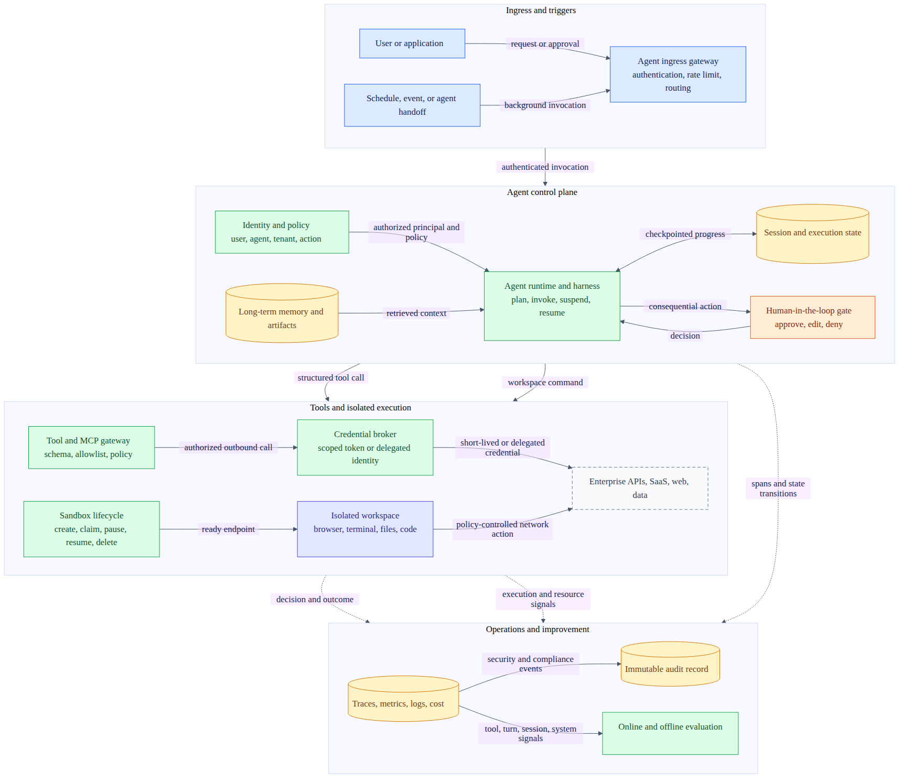
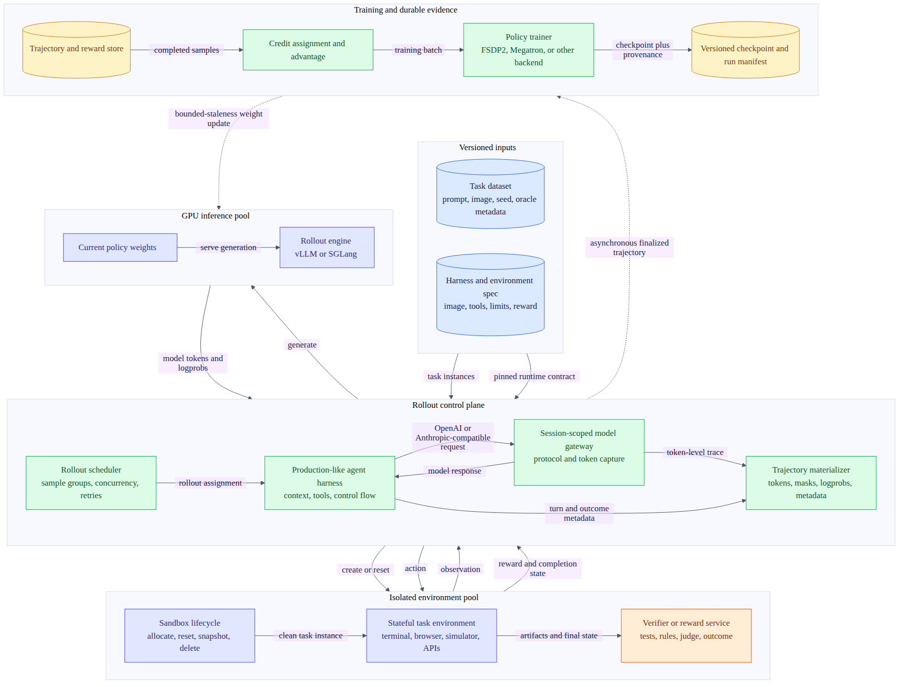

# Day 62：当前 Agent Infra 开源生态与企业方案调研

日期：2026-09-04

主题：Agentic RL 训推环境、企业级 Agent Runtime、Manus 与 Grok Bot 典型方案

## 调研目标

Day 61 主要把一篇 Agent Harness Infrastructure 产品文章改造成证据分级调研。今天进一步扩大范围，回答五个问题：

1. 当前 Agent Infra 领域已经形成哪些稳定层次，哪些项目看似相似但实际不在同一层？
2. Agentic RL 的训练、rollout、Sandbox、reward/verifier 和在线推理环境应该怎样组合？
3. AWS、Microsoft、Google 等企业级 Agent Runtime 当前分别把哪些能力做成托管服务？
4. Manus 与 Grok Bot 这类持久型 Agent 产品的公开架构有什么差异，哪些内部实现仍不可见？
5. AgentCube 在这张图里最适合占据什么位置，下一步可以怎样形成可验证、低重复的开源贡献？

## 结论先行

1. **Agent Infra 已经分成至少五层。** Agent harness 负责模型与工具循环；Agent Runtime 负责会话、执行、恢复和服务化；Sandbox 负责隔离的 browser/terminal/filesystem；Agentic RL 系统负责 rollout、trajectory、reward 和权重更新；企业平台再补身份、网络、策略、审计、评测和发布治理。不同层的项目不能按一张“谁功能最多”表直接排序。
2. **Agentic RL 的主要基础设施难点已经从单纯 GPU 训练扩展到生产 harness 与训练 rollout 的一致性。** 长时任务会产生多次模型调用、工具 observation、Sandbox 状态和外部副作用。训练系统必须知道哪些 token 参与 loss、reward 属于哪个分支、失败 episode 如何保留，以及模型权重更新后正在运行的 rollout 可容忍多大 staleness。
3. **当前形成了两种 Agentic RL 接入模式。** verl/OpenRLHF 等可以由训练框架拥有 agent loop；Agent Lightning、AReaL 2.0 和 Uni-Agent 则允许生产 harness 继续拥有 loop，通过 OpenAI/Anthropic-compatible gateway 和结构化 event 捕获 trajectory。后者更适合复用 Manus-like、coding-agent 或企业 Agent 的真实运行逻辑，但需要更严格的 token、session 和 reward 对齐。
4. **企业级 Agent Runtime 的共同最小集合已经超出“把 Agent 包成 HTTP API”。** 至少需要 agent/user identity、per-session isolation、durable execution、tool/credential gateway、default-deny egress、HITL、trace/audit、online evaluation、版本与回滚、quota/cost control。AWS AgentCore、Microsoft Foundry 和 Google Gemini Enterprise Agent Platform 的公开方案都覆盖了其中大部分，只是抽象和托管边界不同。
5. **Manus 与 Grok Bot 的关键差异在计算和隔离单位。** Manus 公开资料描述每个 task 分配独立 Sandbox，并另有持久 Cloud Computer；Grok Bot 文档描述每个 user 拥有一台持久 cloud computer，用户的多个 Bot 共享其中的文件、浏览器 session 和凭据。前者偏 task-isolated execution，后者偏 persistent teammate workspace。两者都不能仅靠产品 UI 推导其调度器、VMM、存储或模型路由内部实现。
6. **AgentCube 最适合继续定位为 rollout execution substrate 和企业 Runtime 的 Sandbox/lifecycle 层，而不是再实现一套 RL trainer 或完整 Agent harness。** 最直接的验证路径是为 Harbor、Uni-Agent 或 SWE-ReX 做 AgentCube provider/adapter PoC，证明同一 task image 能被创建、并发运行、评分、清理并产出可归属 trajectory。
7. **依赖基线出现了新的现实变化。** `kubernetes-sigs/agent-sandbox v1.0.1` 已在 2026-09-03 发布，而 AgentCube `upstream/main@7a85d4f` 仍依赖 `v0.4.6`，现有 #446 仍以 `v0.5.3` 为目标。v1.0.1 的 TypeScript SDK 和 OpenHands workspace integration 与本调研高度相关，但不能据此把 #446 临时改成跨越多个版本的升级；应先做独立 API、migration、generated clients 和 E2E closure。

## 调研方法与证据边界

### 时间与来源

本轮动态状态冻结于 **2026-09-04 16:49 CST**。资料优先级如下：

1. 开源仓库的 fixed head、release、README、架构文档和 API 文档。
2. 云厂商官方产品文档和官方工程博客。
3. Manus、SpaceXAI/Cursor 等产品团队的官方博客、帮助中心和安全文档。
4. 本地已经完成的 AgentCube 源码、集群和 benchmark 报告。

没有使用搜索摘要或社区猜测来填补闭源系统的内部实现。动态 Star、Fork 和营销采用数字只作为项目热度线索，不作为生产成熟度证据。

### 证据标签

| 标签 | 含义 | 本文措辞 |
| --- | --- | --- |
| Fixed-source | 固定 commit 的源码或仓库内文档直接支持 | “当前 fixed head 实现/声明” |
| Official-product | 厂商当前官方文档描述的服务能力 | “官方文档提供/说明” |
| Vendor-claim | 厂商或项目方给出性能、规模、采用或安全表述 | “项目方报告/宣称” |
| Local-verified | 之前本地报告保存了命令、日志或集群结果 | 明确链接报告与测试边界 |
| Inference | 由多个公开事实推导出的工程判断 | 使用“分析”“更适合”“需要验证” |
| Unknown | 公开资料没有给出，或本轮无法运行 | 不补全、不写成已实现 |

### 本轮实际做了什么

- 冻结 25 个代表性开源仓库的 default branch head、latest release 和 license metadata。
- 阅读 Agentic RL 项目的 rollout、gateway、environment、reward、async training 和 checkpoint 公开契约。
- 阅读 AWS AgentCore、Microsoft Foundry、Google Gemini Enterprise Agent Platform 的当前 Runtime、identity、network、sandbox、observability 文档。
- 阅读 Manus 的 context engineering、Sandbox、Cloud Computer、Wide Research 和 Browser Operator 公开资料。
- 阅读 Grok Bot 的发布、persistent Bot UX、企业安全、network、identity、audit 和 hosting 限制，并对照开源 Grok Build。
- 重新核对 AgentCube `upstream/main@7a85d4f`、Issue #267/#365 和 SnapStart Proposal #366 的当前状态。
- 生成两张 Mermaid 图，并通过 `@mermaid-js/mermaid-cli@11.16.0` 在白色背景渲染、逐图目视检查。

### 本轮没有验证什么

- 没有 GPU 集群，因此没有启动 verl、AReaL、slime、Prime-RL 或 RLinf 的真实训练。
- 没有可用的目标 KVM fleet，因此没有复现 E2B、AgentENV、Daytona 或云厂商的启动/恢复性能数字。
- 没有企业云账号，因此没有部署 AgentCore、Foundry Hosted Agent 或 Google Agent Runtime。
- 没有 Manus/Grok Bot 企业租户，因此没有独立验证其组织策略、审计导出或隔离实现。
- 没有把 README 中的 `production-ready`、性能数字或客户数量转换成本地 PASS。

> 注释：本文中的“训推环境”包含训练侧 rollout inference，不只指训练完成后的线上 serving。Agentic RL 每个训练 step 都需要模型推理并与环境交互，因此 rollout engine 本身就是训练系统的一部分。

## 一、Agent Infra 应该怎样分层

### 分层图



可编辑源文件：[day62-agent-runtime-enterprise-flow.mmd](day62-agent-runtime-enterprise-flow.mmd)

这张图回答一个问题：**一个企业 Agent 请求或事件如何经过身份、Runtime、工具和 Sandbox，最终形成可审计、可评测的动作。** 它是综合各项目公开能力形成的 reference model，不代表某一家厂商的内部拓扑。

### 五层职责

| 层次 | 主要对象 | 必须拥有的状态或操作 | 代表项目/产品 | 不应被误认为 |
| --- | --- | --- | --- | --- |
| Agent framework / harness | prompt、tool schema、agent loop、multi-agent graph | context assembly、model call、tool selection、planning | LangGraph、Google ADK、AgentScope、Grok Build、Hermes | 完整 Sandbox fleet 或企业治理平台 |
| Agent Runtime / durable execution | execution、session、actor、event log、checkpoint | invoke、interrupt、resume、retry、service endpoint、state persistence | Google AX、Dapr Agents、AgentScope Agent Service、Microsoft Durable Agents | GPU RL trainer 或 VMM |
| Sandbox / workspace | task image、filesystem、process、browser、network | create、exec、pause、resume、snapshot、delete、endpoint | agent-sandbox、OpenSandbox、E2B、Daytona、AgentENV、AgentCube | Agent 决策逻辑或 reward algorithm |
| Agentic RL / optimization | rollout、trajectory、reward、advantage、weights | sample、token/mask capture、verify、train、weight sync、checkpoint | verl、OpenRLHF、AReaL、slime、Agent Lightning、Prime-RL、SkyRL、RLinf | 线上企业身份与工具治理本身 |
| Enterprise platform / AgentOps | agent/user identity、registry、policy、audit、evaluation、cost | publish、authorize、observe、govern、rollback、compliance | AWS AgentCore、Microsoft Foundry、Gemini Enterprise Agent Platform | 单个 Agent SDK 或一组模型 API |

> 分析：同一个项目可能横跨多层。例如 AgentScope 2.0 同时有 framework、agent service 和 workspace adapter；AWS AgentCore 同时提供 Runtime、Harness、Memory、Gateway 和工具 Sandbox。分层的目的不是强行把项目放进唯一格子，而是检查每个能力的状态所有者和故障边界。

### 当前开源仓库快照

下表的 commit 与 release 是本轮读取时的快照。链接使用固定 SHA，避免后续 `main` 变化后把本文结论误读为新版本结论。

| 类别 | 项目 | Fixed head | Latest release | 本轮关注点 |
| --- | --- | --- | --- | --- |
| RL core | [verl](https://github.com/verl-project/verl/tree/3d36367e83d7) | `3d36367e83d7` | `v0.9.0` | 多 backend RL、multi-turn AgentLoop、Sandbox integration |
| Agentic RL bridge | [Uni-Agent](https://github.com/verl-project/uni-agent/tree/07b72ac86a97) | `07b72ac86a97` | 无 GitHub release | 生产 harness gateway、token trajectory、Sandbox/Task/Reward |
| RL core | [OpenRLHF](https://github.com/OpenRLHF/OpenRLHF/tree/3c3be6234e0c) | `3c3be6234e0c` | `v0.11.0` | Ray + vLLM、token-in/token-out、multi-turn environment |
| Async RL | [AReaL](https://github.com/areal-project/AReaL/tree/6feff6df3758) | `6feff6df3758` | `v2.1.0` | training/inference/agent/weight-update microservices |
| RL core | [slime](https://github.com/THUDM/slime/tree/4c193f1f3750) | `4c193f1f3750` | `v0.3.2` | Megatron + SGLang、Data Buffer、custom generation |
| Harnessed RL | [Agent Lightning](https://github.com/microsoft/agent-lightning/tree/218f1f7c0bac) | `218f1f7c0bac` | `v1.0.1` | API Gateway、Rollout Controller、verl trainer、existing harness |
| Async RL | [Prime-RL](https://github.com/PrimeIntellect-ai/prime-rl/tree/ef9dea178157) | `ef9dea178157` | `v0.9.0` | fully async training、vLLM、Slurm/Kubernetes |
| Environment | [Verifiers](https://github.com/PrimeIntellect-ai/verifiers/tree/828488fffe31) | `828488fffe31` | `v0.3.1` | environment、rubric、Hub contract |
| Agentic RL | [SkyRL](https://github.com/NovaSky-AI/SkyRL/tree/c516f3a56347) | `c516f3a56347` | `skyrl-v0.3.0` | train/agent/gym 三层，仓库重组中 |
| Embodied/agentic RL | [RLinf](https://github.com/RLinf/RLinf/tree/d18786ec4caa) | `d18786ec4caa` | `v0.3` | heterogeneous simulator/robot/GPU scheduling |
| Eval/environment | [Harbor](https://github.com/harbor-framework/harbor/tree/dcd0a7ac74b7) | `dcd0a7ac74b7` | `v0.22.0` | Agent、environment provider、verifier、RL rollout format |
| Sandbox adapter | [SWE-ReX](https://github.com/SWE-agent/SWE-ReX/tree/5c995c365dfb) | `5c995c365dfb` | `v1.4.0` | local/cloud shell runtime interface |
| Coding-agent runtime | [OpenHands Software Agent SDK](https://github.com/OpenHands/software-agent-sdk/tree/07307cb8edfc) | `07307cb8edfc` | `v1.44.1` | agent harness 与 local/cloud workspace contract |
| Distributed Runtime | [Google AX](https://github.com/google/ax/tree/b77731302075) | `b77731302075` | `v0.2.3` | event log、single writer、distributed isolated actors |
| Runtime substrate | [Agent Substrate](https://github.com/agent-substrate/substrate/tree/2c429a9906bd) | `2c429a9906bd` | `v0.0.0` | gVisor actor/worker suspend-resume，明确非 production-ready |
| Kubernetes Sandbox | [agent-sandbox](https://github.com/kubernetes-sigs/agent-sandbox/tree/52618d52a1f4) | `52618d52a1f4` | `v1.0.1` | Sandbox/Template/WarmPool/Claim、OpenHands workspace |
| Sandbox platform | [OpenSandbox](https://github.com/opensandbox-group/OpenSandbox/tree/17b00f872813) | `17b00f872813` | `server/v0.2.3` | Docker/Kubernetes providers、egress、Credential Vault |
| MicroVM Sandbox | [E2B infra](https://github.com/e2b-dev/infra/tree/8a3f69da6f82) | `8a3f69da6f82` | `2026.29` | Firecracker、snapshot、control/data plane |
| Sandbox platform | [Daytona](https://github.com/daytonaio/daytona/tree/ec4c21b2d597) | `ec4c21b2d597` | `v0.190.0` | SDK/API、snapshot、elastic code execution |
| RL environment runtime | [AgentENV](https://github.com/kvcache-ai/AgentENV/tree/891d64e77fd0) | `891d64e77fd0` | `v0.2.0` | Firecracker、snapshot/fork、node-local lifecycle |
| Agent platform | [AgentScope 2.0](https://github.com/agentscope-ai/agentscope/tree/ca908a38f35a) | `ca908a38f35a` | `v2.0.7.post1` | agent service、workspace adapters、memory、multi-tenancy |
| Durable agents | [Dapr Agents](https://github.com/dapr/dapr-agents/tree/a383dd47b114) | `a383dd47b114` | `v1.0.5` | workflow、actors、state、mTLS、pub/sub |
| Managed Runtime bridge | [AgentCore RL Toolkit](https://github.com/awslabs/agentcore-rl-toolkit/tree/9106c57dbc6c) | `9106c57dbc6c` | `v0.1.3` | 复用 AgentCore production agent 做 RL rollout |
| Open-source harness | [Grok Build](https://github.com/xai-org/grok-build/tree/72a61251fcff) | `72a61251fcff` | 无 GitHub release | coding harness、tools、TUI、skills/plugins/subagents |
| Persistent agent | [Hermes Agent](https://github.com/NousResearch/hermes-agent/tree/63279301bcbd) | `63279301bcbd` | `v2026.8.31` | memory、skills、routines、multi-channel、runtime adapters |

### 从快照能得出什么

- Agentic RL 已不再只有一个“PPO trainer”层，项目开始明确拆出 agent runner、gateway、environment、trajectory store 和 weight-update service。
- Environment contract 正在形成独立生态：Harbor、Verifiers、SWE-ReX、Uni-Agent SandboxBackend 分别抽象任务/评分、RL environment、shell runtime 和训练接入。
- Durable execution 与 Sandbox lifecycle 也在分离：AX/Dapr 管 execution/event log，agent-sandbox/E2B/OpenSandbox 管计算环境。
- 开源不等于可立即生产。AX 与 Agent Substrate 都公开标注仍在快速变化；Grok Build 虽使用 Apache-2.0，但官方仓库由内部 monorepo 周期同步且不接受外部贡献。

## 二、Agentic RL 训推环境

### 为什么普通 RLHF 拓扑不够

单轮 RLHF 可以近似成：给一个 prompt，生成一个 response，计算 reward，再更新模型。Agentic RL 多了以下状态：

- 一个 episode 包含多次模型调用，不是一个连续 assistant response。
- tool output、environment observation 和系统消息通常不应全部参与 policy loss。
- Sandbox 内文件、进程、browser session 和外部 API 状态会跨 turn 保留。
- GRPO/DAPO 等算法会从同一初始状态采样多个分支，因此 `reset()` 必须真的回到同一 task state。
- coding/search/browser task 的 episode 时长差异很大，慢分支会造成 GPU 等待和 rollout long tail。
- 生产 harness 可能压缩/改写 context、调用 subagent、并发发起模型请求，token trajectory 不再等于简单拼接文本。
- reward 可能来自测试、规则、judge model、人工审批或外部业务结果，必须绑定到正确 session/branch/model version。
- fully async training 会让 rollout 使用旧 policy，必须记录并限制 staleness，而不是只提高吞吐量。

> 注释：trajectory 是一次 episode 中模型输入、模型输出、工具 observation、动作、reward 和相关 metadata 的可训练记录。只有文本而没有 token IDs、mask、model version、environment version 和 reward provenance，通常不足以稳定复现训练行为。

### 训推闭环图



可编辑源文件：[day62-agentic-rl-training-flow.mmd](day62-agentic-rl-training-flow.mmd)

图中实线表示一次 rollout 内的直接调用，虚线表示异步 trajectory/weight feedback。它是推荐的责任边界，不表示所有项目都采用完全相同的组件名。

### 两种主流接入模式

#### 模式 A：trainer-owned loop

训练框架自己实现或加载 `AgentLoop`/`reset()`/`step()`：

```text
trainer -> rollout worker -> model engine -> tool/environment -> trajectory -> trainer
```

优点：

- token、mask、logprob 和 reward 在同一数据路径中，训练一致性更容易检查；
- trainer 能直接控制 batch、group sampling、timeout 和资源 colocate；
- 适合从零构建 research agent loop 或结构较简单的 math/tool environment。

代价：

- 生产 harness 的 context compression、tool policy、subagent 和 retry 逻辑可能被重新实现一遍；
- 训练效果可能只适用于简化 loop，上线换回真实 harness 后产生 train/serve skew；
- 环境依赖越复杂，trainer repository 越容易承担不属于训练内核的部署代码。

verl 的 [`AgentLoopBase`](https://github.com/verl-project/verl/blob/3d36367e83d7/docs/advance/agent_loop.rst) 和 OpenRLHF 的 multi-turn executor 属于这条路线。verl 明确把“工具如何定义和调用”列为 AgentLoop 的 non-goal，说明训练框架仍需要外部 environment/tool contract。

#### 模式 B：harness-owned loop

生产 Agent 继续运行自己的 loop，只把 model endpoint 指向训练 gateway，或通过结构化 event/trace 捕获模型调用：

```text
production harness -> session gateway/proxy -> rollout model
                  \-> real tools and sandbox
gateway/event capture -> token trajectory + reward -> trainer
```

优点：

- 训练和线上复用同一 harness、prompt、tool policy 和 error recovery；
- Claude Code、OpenHands、Hermes、custom enterprise agent 等黑盒/半黑盒 harness 可以通过薄 adapter 接入；
- harness 和 trainer 可以独立升级、部署在不同资源池。

代价：

- gateway 必须保留真实 tokenization、tool parser、logprob、chain/branch 和 model version；
- harness 可能并发调用模型或重写最后一条消息，trajectory materialization 更复杂；
- final outcome reward 如何分配给多次 LLM call，需要明确 credit assignment；
- proxy/network 故障不能与 agent task failure 混成同一 reward。

Agent Lightning v1.0 将这类模式称为 **harnessed agentic RL**。其公开说明指出，harness 拥有 environment interaction loop，trainer 只观察一组 LLM request/response；因此 retokenization、sample merging、advantage、loss normalization 和 scheduling 都会影响稳定性。[Agent Lightning v1.0](https://www.microsoft.com/en-us/research/publication/agent-lightning-v1-0-towards-harnessed-agentic-rl/)

Uni-Agent 的 Gateway 也采用这条路线：它不是 inference engine，而是把 OpenAI/Anthropic wire request 转发给 verl-managed vLLM/SGLang，同时保存 token IDs、mask、logprob、reward 和 session metadata。[Gateway and Trajectories](https://uni-agent.readthedocs.io/en/latest/concepts/gateway-and-trajectories.html)

### 代表训练项目比较

| 项目 | 核心边界 | Agent/environment 接入 | 训练/rollout backend | 适合场景 | 当前注意点 |
| --- | --- | --- | --- | --- | --- |
| verl | 通用 RL dataflow 和 GPU worker orchestration | trainer-owned AgentLoop；Uni-Agent 可补 harness gateway | FSDP/FSDP2/Megatron；vLLM/SGLang/HF | 算法与 backend 组合多、需要广泛生态 | backend/version matrix 大；AgentLoop API 仍在演进 |
| Uni-Agent | production harness 到 verl 的 agent layer | white-box Agent/Tool/Task/Sandbox 或 black-box endpoint adapter | 复用 verl rollout/trainer | coding agent、长时真实环境、train/serve parity | 项目较新；Gateway session 当前先驻内存，需关注失败恢复 |
| OpenRLHF | Ray + vLLM/DeepSpeed/Molt 的统一 RLHF pipeline | token-in/token-out single/multi-turn executor，`reset/step` environment | vLLM；DeepSpeed/Molt | 快速搭建单/多轮 RLHF、算法基线 | README 的 production-ready 是项目方定位；真实环境需自己实现 |
| AReaL 2.0 | fully async training/inference/agent/weight-update services | 替换 `base_url` 接入 black-box harness；也支持自定义 workflow | FSDP2/Megatron/Archon；SGLang/vLLM | 长尾明显、需要训练与 rollout 解耦 | 必须度量 policy staleness；async 吞吐不能替代收敛验证 |
| slime | Megatron + SGLang 的高性能窄路径 | custom data generation 接 multi-turn/tool/sandbox/verifier | Megatron + SGLang | 大模型/MoE、明确采用这套生产栈 | 有意不做最低公共抽象；其他 inference backend 不是目标 |
| Agent Lightning | trainer 与任意 harness 解耦的 rollout system | Gateway proxy 捕获 token/logprob event，Controller 启动 local process 或 Kubernetes Job | Customized Trainer 基于 verl | 已有 Agent 不改 loop、需要 Kubernetes rollout | event/token 连续性和 rollout-level reward attribution 是正确性核心 |
| Prime-RL + Verifiers | async trainer + environment/rubric ecosystem | Verifiers `load_environment`、turn/tool/MCP/state hooks | FSDP2 + vLLM，Slurm/Kubernetes | 环境复用、community task hub、大规模 async | environment supply-chain、rubric 版本和 Hub artifact 需固定 |
| SkyRL | train、agent、Gym environment 三套模块 | Gymnasium-style math/code/search/SQL 与 long-horizon agent layer | 项目自有 train/tx stack | 教学、研究环境、terminal agent recipe | 当前 README 明确处于 repository reorganization |
| RLinf | heterogeneous embodied/agentic RL infrastructure | simulator、robot、search/coding/Agent Lightning integration | FSDP/Megatron + SGLang/vLLM | VLA、sim-real、真实机器人与 agentic workload 共存 | 范围远大于语言 Agent；硬件/simulator 依赖更重 |

### 三个值得重点跟踪的新方案

#### 1. Uni-Agent：把生产 harness 变成训练数据生产者

Uni-Agent 当前最接近本次需求中的“Agentic RL 训推环境总装层”：

- Agent 可以是 white-box `Agent/Tool/Task/Sandbox`，也可以是只会调用 OpenAI/Anthropic endpoint 的 black-box harness。
- Gateway 给每个 rollout session 独立 `base_url`，从模型请求中捕获 token trajectory。
- Task 或 verifier 回传 reward，finalized trajectory 进入 `TransferQueue`。
- rollout worker 与 trainer 异步解耦，一个 session 失败不自动丢弃成功 sibling。
- Harbor integration 可以运行 OpenHands、Terminal-Bench/SWE-Bench task 和 Modal 等远端 environment。

这条路线对 AgentCube 的价值很直接：AgentCube 不需要理解 PPO/GRPO，只需实现 Uni-Agent/Harbor 所需的 Sandbox lifecycle 与 exec/files contract。

#### 2. Agent Lightning v1.0：把 production harness 通过 proxy 接入训练

Agent Lightning v1.0 是一次完全重写，当前 fixed head 的三个核心组件是 **API Gateway、Rollout Controller 和 Customized Trainer**：

- API Gateway 保存 rollout、model endpoint 和 append-only event，并提供 rollout-specific OpenAI-compatible proxy；
- proxy 为每次 model request 记录 prompt token IDs、response token IDs 和 chosen-token log probabilities；
- Rollout Controller 持续 reconcile Gateway 中的 queued rollout，并以 local subprocess 或 Kubernetes Job 启动真实 Agent；
- Gateway 是 rollout status 的 source of truth，Controller 在 watch/network interruption 后继续 reconcile；
- Customized Trainer 基于 verl 创建 rollout group、读取 model request/reward event、只在 token history 精确连续时合并相邻 model call，并执行 rollout-level advantage 和 loss normalization；
- async 模式在更新权重前暂停新 model request、drain in-flight request，再恢复 inference；旧 rollout 的 policy mismatch 需要 rollout correction。

来源：[Agent Lightning v1.0 Basics](https://github.com/microsoft/agent-lightning/blob/218f1f7c0bac0800de4d5a4e5e6f61cf7b5038b4/docs/05-basics.md)、[Asynchronous Training](https://github.com/microsoft/agent-lightning/blob/218f1f7c0bac0800de4d5a4e5e6f61cf7b5038b4/docs/35-asynchronous-training.md)

早期 Agent Lightning v0.x 使用 `Algorithm/Runner/LightningStore/Tracer` 和 span-based training abstraction；这些概念解释了项目演进来源，但不再是 v1.0 current head 的组件图。后续调研不能把两个版本合并成一套架构。

> 分析：无论叫 event 还是 trace，可训练记录都必须保留 token IDs、chat template、model version、sampling params 和 observation boundary。普通 observability span 通常不足以直接计算可靠 policy loss。

#### 3. AgentCore RL Toolkit：托管 Runtime 与训练系统开始打通

AWS Labs 的 AgentCore RL Toolkit 展示了另一条企业路线：生产 Agent 已部署在 AgentCore Runtime 中，训练时把 entrypoint 换成 rollout entrypoint，并让 Agent 使用 session-scoped model `base_url`。Toolkit 从 gateway 收 token，从 S3 收 reward/result，再交给训练库。[AgentCore RL Toolkit](https://github.com/awslabs/agentcore-rl-toolkit/tree/9106c57dbc6c)

这说明“线上 Runtime 与 RL rollout 共用 Agent container”已从概念变成公开实现方向。不过该项目当前 release 为 `v0.1.3`，本轮没有云账号做 E2E，不能把文档路径写成独立验证结果。

## 三、Environment 与 Sandbox：最容易混淆的边界

### Environment interface 不等于 isolation runtime

| 项目/接口 | 它主要抽象什么 | 是否自己提供强隔离 | 典型 backend |
| --- | --- | --- | --- |
| Harbor | dataset、agent、environment provider、verifier、trial/retry/artifact | 否，隔离取决于 provider | Docker、Daytona、Modal 等 |
| Verifiers | taskset、turn/tool/state、rubric/reward | 否，environment 可进程内或远端 | subprocess、Docker、Prime Sandbox |
| SWE-ReX | shell session、command、files、local/remote deployment | 否，接口背后可是不隔离的 local process | local、Docker、AWS、Modal、Daytona |
| Uni-Agent SandboxBackend | Agent tool 所需 exec/files/lifecycle contract | 否 | local、remote serverless 或自定义 provider |
| agent-sandbox | Kubernetes Sandbox/Template/WarmPool/Claim 生命周期 | 本身选择 Pod/RuntimeClass；隔离等级取决于 gVisor/Kata/runtime | Kubernetes |
| OpenSandbox | 统一 lifecycle/SDK、Docker/Kubernetes provider、egress/credential | 提供编排和策略，实际隔离取决于 Docker/K8s runtime | Docker、Kubernetes、agent-sandbox |
| E2B | Firecracker VM、template/snapshot、envd、edge routing | 是，公开 infra 使用 Firecracker microVM | 自建 GCP/AWS 路径或 E2B Cloud |
| Daytona | composable sandbox computer、SDK/API、snapshot | 项目方描述 dedicated kernel；部署细节依模式 | Daytona platform/self-host components |
| AgentENV | node-local Firecracker、snapshot/fork、OverlayBD/ublk | 是，要求 KVM | bare metal/VM node，可选 Kubernetes discovery |
| AgentCube | session/workload lifecycle、Router、PicoD、agent-sandbox adapter | 不固定 VMM，依赖底层 provider/RuntimeClass | Kubernetes + agent-sandbox |

Harbor 官方定位是运行 agent evaluation 和创建/使用 RL environments，并可以在多个 provider 上并发运行。[Harbor](https://github.com/harbor-framework/harbor/tree/dcd0a7ac74b7) SWE-ReX 则保证 Agent 面对统一 shell runtime API。[SWE-ReX](https://github.com/SWE-agent/SWE-ReX/tree/5c995c365dfb) 两者都不能仅凭“sandbox”命名证明 kernel isolation。

### 一个合格 RL environment 的最小接口

对 coding/browser/tool Agent，建议至少固定以下合同：

```text
prepare(task_spec, image_digest, seed) -> environment_id
reset(environment_id, snapshot_or_baseline) -> initial_observation
step(action, deadline, idempotency_key) -> observation + side_effect_metadata
score(environment_id, verifier_version) -> reward + evidence
collect(environment_id) -> logs + changed_files + trace + metrics
destroy(environment_id) -> cleanup_result
```

关键字段：

- `task_id`、dataset release、task source commit；
- image digest、setup script digest、sandbox runtime/version；
- initial state/snapshot ID 和随机 seed；
- Agent/harness/model/chat template/tool parser 版本；
- 每个 model call 的 token IDs、mask、logprob 和 policy version；
- action/observation 顺序、timeout、retry 和 exit reason；
- verifier source、reward breakdown、judge model/version；
- workspace diff、artifact、network/credential usage；
- destroy 是否完成、残留资源和费用。

> 注释：`reset()` 不是简单清空聊天记录。对于 GRPO 的同组采样，多个分支需要从相同文件、数据库、browser 状态和服务版本开始，否则 group-relative reward 比较混入了环境差异。

### Credential 与网络边界

Agentic RL 经常需要 GitHub、package registry、搜索或业务 API。把真实 token 直接写进 task image 或 Agent environment 会同时污染安全和 benchmark：

- 模型可通过 prompt injection 或 shell 读出 token；
- trajectory/log/artifact 可能永久保存 secret；
- 不同 run 使用不同权限，reward 不再可比；
- 环境清理失败会留下可继续使用的 credential。

OpenSandbox 当前 Credential Vault 的公开设计把真实 credential 保留在 egress sidecar，通过 host/method/path binding 注入 outbound HTTPS，Sandbox 只看到 fake/empty value；但其 vault 是 sidecar 进程内状态，Kubernetes pause/resume 后需要由可信控制面重新注入，且 transparent MITM 与 service-mesh sidecar 当前不兼容。[Credential Vault](https://github.com/opensandbox-group/OpenSandbox/blob/17b00f872813/docs/guides/credential-vault.md)

这类限制说明企业方案不能只写“支持 Secret”：还要验证 secret 是否进入 Agent context、filesystem、process env、snapshot、trace 和 upstream echoed response。

## 四、推荐的 Agentic RL 训推环境搭建方案

### 目标拓扑

针对 AgentCube 当前方向，推荐先采用以下组合做研究型 PoC：

| 层 | 推荐选择 | 选择理由 | 可替换项 |
| --- | --- | --- | --- |
| Task/eval format | Harbor | coding/terminal task、agent、provider、verifier 边界明确 | Verifiers、custom Task |
| Agent layer | Uni-Agent | 支持 white-box 和 production-like black-box harness | Agent Lightning、AReaL agent service |
| RL core | verl | Uni-Agent 原生集成，backend/algorithm 选择广 | AReaL、OpenRLHF、slime、Prime-RL |
| Rollout inference | SGLang 或 vLLM，固定一个 | 两者均被主流 RL infra 支持 | 不在首轮同时测两套 |
| Sandbox provider | AgentCube adapter -> agent-sandbox | 直接验证 #267 的 execution substrate 定位 | Docker、OpenSandbox、Daytona、E2B |
| Runtime isolation | 首轮按实际集群 RuntimeClass 固定 | 把 plain container、gVisor、Kata/microVM 分开 | 后续 Kuasar/SnapStart |
| Reward | task-local deterministic verifier 优先 | coding test 可重复，减少 judge 漂移 | rule + model judge + human |
| State | PostgreSQL/Redis + object storage | session/queue 与大 artifact 分离 | 项目自带 Store/TransferQueue |
| Telemetry | OpenTelemetry + trainer metrics | 贯通 Agent、Sandbox、reward、GPU | W&B/MLflow/Prometheus 作为后端 |

这不是唯一正确组合。它的价值是让 AgentCube 只新增一层 provider adapter，不同时 fork trainer、agent harness 和 benchmark format。

### 环境分区

#### 1. GPU training pool

- 运行 FSDP2/Megatron/其他 trainer、optimizer、reference/critic（按算法需要）。
- checkpoint 写入版本化 object storage，记录 optimizer、scheduler、tokenizer 和 run manifest。
- 不直接运行不可信 task container。
- 通过独立 weight-update channel 把 policy 发布给 rollout pool。

#### 2. GPU rollout pool

- 运行固定版本 vLLM 或 SGLang。
- 由 session gateway 做 request routing 和 token/logprob capture。
- 记录实际服务的 policy/checkpoint ID，避免 reward 与错误权重关联。
- synchronous 模式先建立正确性，随后再启用 fully async 和 bounded staleness。

#### 3. CPU Sandbox/environment pool

- 每个 episode 使用独立 Sandbox 或从可证明等价的 snapshot/reset baseline 派生。
- task image 只包含任务依赖，不包含 trainer credential。
- 对出站网络、DNS、filesystem、process、CPU/memory/PID、deadline 做限制。
- verifier 在 Agent 完成后运行，并与 Agent 权限分离；Agent 不应能修改测试或 reward 文件。
- `destroy` 需要返回可检查结果，不能只 fire-and-forget。

#### 4. Control and evidence plane

- rollout scheduler 负责任务组、并发、timeout、retry 和 backpressure。
- trajectory store 保存 token-level record；普通 stdout log 作为证据附件，不替代 trajectory。
- task manifest、image digest、harness version、reward version 与 model checkpoint 一起进入 run manifest。
- OTEL trace 关联 `run_id/task_id/session_id/sandbox_id/model_version`。

### 从开发到集群的四个阶段

| 阶段 | 环境 | 目标 | 通过条件 | 不做什么 |
| --- | --- | --- | --- | --- |
| L0 interface smoke | 单机、1 个 task、Docker/local model API | 证明 Agent、environment、verifier 数据结构闭环 | task 可重复 reset；reward/artifact 可归属；cleanup 完成 | 不宣称安全或规模 |
| L1 token correctness | 小模型、单节点 GPU、少量 Sandbox | 校验 token/mask/logprob/reward 对齐 | decode/re-encode 检查；tool tokens mask 正确；固定 seed 重放 | 不追求吞吐 |
| L2 disaggregated scale | 独立 trainer/rollout/Sandbox pools | 测 long-tail、backpressure、weight sync、失败隔离 | p50/p95/p99、成功率、GPU 利用、staleness、残留资源齐全 | 不只报平均值 |
| L3 train/serve parity | production harness + production-like Runtime | 证明训练 loop 与上线 loop 行为一致 | 同 task 在 eval/train/serve 使用同一 harness/environment contract | 不把模型提升归因给单一 infra 改动 |

### 官方安装入口，而不是拼接未经验证的总命令

不同训练框架对 CUDA、PyTorch、vLLM/SGLang 和 NCCL 的版本约束变化很快。报告不提供一个把多个项目混装到同一 Python 环境的“万能命令”，而保留当前官方入口：

- verl 当前安装文档要求 Python `>=3.10`、CUDA `>=12.8`，并明确区分 FSDP/Megatron 与 vLLM/SGLang/TGI 选择。[verl Installation](https://github.com/verl-project/verl/blob/3d36367e83d7/docs/start/install.rst)
- AReaL 提供 `uv sync --extra cuda` 的 SGLang 默认环境，并为 vLLM 使用独立 `pyproject.vllm.toml`/lockfile；这正说明两个 backend 不应在未锁版本时随意共装。[AReaL Quickstart](https://github.com/areal-project/AReaL/tree/6feff6df3758#-getting-started)
- OpenRLHF 推荐使用容器并按 extra 选择 vLLM，当前 README 的版本也应与 fixed head 一起记录。[OpenRLHF](https://github.com/OpenRLHF/OpenRLHF/tree/3c3be6234e0c)
- slime 推荐其已组合 Megatron/SGLang patch 的镜像，并把 CPU contract tests 与 label-gated GPU E2E 分开。[slime CI](https://github.com/THUDM/slime/blob/4c193f1f3750/docs/en/developer_guide/ci.md)
- Uni-Agent 要求 sandbox provider、Gateway、Ray worker 和 shared dataset/log path 在网络上互相可达；Harbor/OpenHands 路径不能默认访问宿主 localhost。[Harbor Integration](https://uni-agent.readthedocs.io/en/latest/quickstart/harbor-integration.html)

> 分析：最稳妥的搭建方式是每个 subsystem 使用自己的 pinned container/lockfile，通过 HTTP/gRPC/queue/object storage 连接，而不是把 trainer、inference、Agent harness 和 environment SDK 安装进一个巨型 Python environment。

### 训练正确性与系统性能必须分开验收

| 维度 | 指标/检查 | 常见错误结论 |
| --- | --- | --- |
| Task correctness | oracle 多次通过、reset 等价、verifier 防篡改 | “容器能启动，所以 environment 可训练” |
| Trajectory correctness | token IDs、mask、turn boundary、reward branch、policy version | “有 trace 文本，所以能做 policy gradient” |
| Algorithm | reward curve、held-out eval、seed variance、KL/entropy、advantage | “吞吐提高，所以模型一定更好” |
| Rollout system | episode/s、p50/p95/p99、timeout、retry、queue depth | “GPU 利用率高，所以没有 stale policy 问题” |
| Sandbox system | ready-to-first-action、reset、snapshot、cleanup、residue | “warm claim 等于 cold create 或 snapshot resume” |
| Cost | active GPU、Sandbox resident cost、token、storage、network | “只比较单次启动延迟就能判断 TCO” |
| Security | credential exposure、egress、tenant isolation、artifact redaction | “使用 Docker/Kubernetes 就已经安全” |

## 五、企业级 Agent Runtime 方案

### 企业 Runtime 不是普通 Web Hosting

普通应用服务器接收请求、执行业务代码、返回响应。Agent Runtime 还要面对：

- 一次执行可能持续数小时，并在等待模型、工具、人类审批或外部事件时长时间 idle；
- 模型会动态选择工具和参数，副作用不完全由静态代码路径决定；
- 同一 session 需要 filesystem、browser login、memory 和 workflow state，但不同 tenant 之间必须隔离；
- prompt injection 可能经网页、邮件、MCP tool result 或文件进入控制流；
- Agent 既可能代表用户行动，也可能作为 autonomous workload identity 行动；
- 失败恢复不能简单重放已经产生付款、发信、提交代码等副作用的步骤；
- operator 需要从一次结果追溯 model、prompt、tool、credential scope、approval 和 environment。

所以“企业级”至少由以下十项可验证能力组成。

| 能力 | 要回答的问题 | 最小证据 |
| --- | --- | --- |
| Ingress | 谁能调用哪个 agent/version？ | auth、rate limit、tenant route 测试 |
| Identity | action 代表用户还是 agent workload？ | per-agent principal、OBO/delegation、RBAC |
| Durable execution | crash/HITL/scale-to-zero 后从哪里恢复？ | event/checkpoint、幂等和故障注入 |
| Session isolation | filesystem/process/memory 是否跨 session 泄露？ | isolation test、recycle sanitation |
| Tool governance | 哪些 tool/MCP 可发现、调用和组合？ | registry、allowlist、schema/version policy |
| Credential | model/Sandbox 是否能读取长期 secret？ | brokered/short-lived token、redaction test |
| Network | Agent 可以访问哪些域、IP、private service？ | default-deny、VPC/private link、egress audit |
| Human control | 哪些动作必须 approve/edit/deny？ | policy + independent enforcement + timeout |
| Observability/audit | 谁在何时让哪个模型执行了什么动作？ | traces、immutable audit、session replay |
| Release/cost | 如何 canary、rollback、quota 和归因成本？ | immutable version、traffic policy、budget alerts |

### AWS：AgentCore 的模块化 Runtime

AWS 当前把 AgentCore 分成 Harness、Runtime、Memory、Gateway、Identity、Browser、Code Interpreter、Observability、Policy、Evaluations 等模块；这些服务可以组合或单独使用。[AgentCore Overview](https://docs.aws.amazon.com/bedrock-agentcore/latest/devguide/what-is-bedrock-agentcore.html)

最重要的边界是 Harness 与 Runtime 不同：

- **AgentCore Runtime**：用户提供自己的 Agent code/container 和 orchestration loop；平台负责 session isolation、scaling、auth gating 和 observability plumbing。
- **AgentCore Harness**：平台基于 Strands Agents 提供 loop；用户以配置声明 model、system prompt、tools、memory 和 limits。

[官方对比文档](https://docs.aws.amazon.com/bedrock-agentcore/latest/devguide/harness-vs-runtime.html)明确说明 Harness 是运行在 Runtime 之上的托管抽象。这种拆法避免把“是否托管 agent loop”和“是否托管 compute”混为一个选择。

Runtime 当前公开合同包括：

- default serverless 路径为 per-session microVM；相同 session ID 路由到同一 microVM；
- Runtime session 最长可运行 8 小时，Instances 路径最长可到 14 天；
- filesystem 可以跨 stop/resume 保存；
- 支持 HTTP/WebSocket、MCP、A2A、AG-UI 等接入；
- Identity 支持 inbound auth 和访问第三方服务的 outbound auth；
- AgentCore 各服务支持 VPC connectivity，官方 GA 博客还列出 PrivateLink；
- Browser 和 Code Interpreter 是独立的托管隔离工具，不等于 Agent Runtime container 本身。

来源：[Runtime](https://docs.aws.amazon.com/bedrock-agentcore/latest/devguide/agents-tools-runtime.html)、[Session isolation](https://docs.aws.amazon.com/bedrock-agentcore/latest/devguide/runtime-sessions.html)、[AgentCore FAQ](https://aws.amazon.com/bedrock/agentcore/faqs/)。

> 分析：AgentCore 的优势是能力模块完整且 trainer/harness 不绑定；代价是主要控制面和 session runtime 都是 AWS 托管服务。虽然 Instances 在客户 AWS account 中运行，是否满足特定 on-prem、region、image 和 inspection 要求仍需逐项核对，不能只写“支持 VPC”。

### Microsoft：Foundry Prompt Agent 与 Hosted Agent

Microsoft Foundry Agent Service 当前把 Agent 分成两种：

- **Prompt agent**：用户声明 instructions、model 和 tools，平台拥有 loop 与 compute。
- **Hosted agent**：用户提交 container image 或 source `.zip`，使用 Agent Framework、LangGraph、OpenAI Agents SDK、Anthropic Agent SDK、GitHub Copilot SDK 或自定义代码；平台提供 endpoint、autoscale、identity、state 和 observability。

Hosted Agent 的公开设计更具体地说明了企业运行单元：

- 每个 session 运行在 VM-isolated Sandbox；
- `$HOME` 和 `/files` filesystem 持久化，支持 scale-to-zero 后恢复；
- 每个 deployed agent 自动获得 dedicated Microsoft Entra ID 和 endpoint；
- interactive path 可使用 OAuth OBO 代表用户，background path 使用 agent identity；
- Hosted Agent 支持 BYO VNet；
- Application Insights 接收 OpenTelemetry traces；
- 支持 Responses、Invocations、WebSocket 和 A2A 等 protocol surface；
- 当前一个 endpoint 只指向一个 version，文档明确说明不支持 version traffic splitting。

来源：[Agent Service Overview](https://learn.microsoft.com/en-us/azure/ai-foundry/agents/overview)、[Hosted Agents](https://learn.microsoft.com/en-us/azure/foundry/agents/concepts/hosted-agents)。

> 分析：Foundry 把 agent identity 与 project managed identity 分开，这是值得 AgentCube 借鉴的边界。控制面拉镜像和 Runtime 调业务 API 不应默认共用一个 principal。当前不支持 traffic splitting 则意味着 canary 需要另建 endpoint 或在外层 gateway 完成。

### Google：Agent Runtime、Agent Gateway 与开源 AX/Substrate

Google 当前把原 Vertex AI Agent Engine 演进为 Gemini Enterprise Agent Platform。托管 Agent Runtime 的 API resource 仍保留 `ReasoningEngine` 名称以兼容旧接口。[Agent Runtime](https://docs.cloud.google.com/gemini-enterprise-agent-platform/build/runtime)

公开能力包括：

- managed runtime 负责 deploy、scale 和 operation；
- ADK 是 full integration，LangChain/LangGraph/AG2/LlamaIndex 有 SDK template，其他框架可走 custom container/runtime contract；
- 可从 agent object、source、Dockerfile、Artifact Registry image 或 Git repository 部署；
- 支持 BYOC、VPC Service Controls、IAM、Cloud Trace/Logging；
- 推荐的 Agent Identity 是每个 agent 的 principal，默认只获得 model/log 和自身 session/memory/sandbox 的有限权限；
- Agent Gateway 对已注册 endpoint/MCP/agent 做 outbound governance，当前文档明确描述默认拒绝、逐资源授予 `iap.resources.egressViaIAP`；
- Model Armor 可以在 Gateway 上检查 ingress/egress 文本，处理 prompt injection、jailbreak 和 sensitive data，但不同 protocol、streaming 和 document modality 有明确限制。

来源：[Runtime setup and identity](https://docs.cloud.google.com/gemini-enterprise-agent-platform/build/runtime/setup)、[Agent Gateway](https://docs.cloud.google.com/gemini-enterprise-agent-platform/govern/gateways/set-up-agent-gateway)、[Model Armor integration](https://docs.cloud.google.com/model-armor/model-armor-agent-gateway-integration)。

Google 同时开源了两个较低层项目：

- **AX / Agent Executor**：single-writer controller、event log、resumable execution、isolated remote actor；官方仓库明确标记仍在 active early development。
- **Agent Substrate**：把大量 idle actor 映射到预热 worker，并探索绕开 per-agent Kubernetes hot path；官方仓库明确标记不适合 production。

这构成“托管平台 + 开源 durable runtime + 开源 compute substrate”三层，而不是一个单体产品。[AX](https://github.com/google/ax/tree/b77731302075) [Agent Substrate](https://github.com/agent-substrate/substrate/tree/2c429a9906bd) [Google Cloud 架构博客](https://cloud.google.com/blog/products/ai-machine-learning/agent-executor-googles-distributed-agent-runtime)

### 三家托管 Runtime 对照

| 维度 | AWS AgentCore | Microsoft Foundry | Google Agent Platform |
| --- | --- | --- | --- |
| 托管 loop | Harness 可选；Runtime 可 BYO loop | Prompt Agent 托管；Hosted Agent BYO code | ADK/managed templates 或 custom runtime |
| 部署形态 | direct code/container；serverless microVM 或 Instances | source `.zip`/container；per-session VM sandbox | object/source/Dockerfile/image/Git；BYOC |
| Session compute | per-session microVM；Instances 长时路径 | per-session VM-isolated sandbox | managed Agent Runtime；底层细节未全部公开 |
| Identity | AgentCore Identity，inbound/outbound auth | per-agent Entra ID + OBO/project identity | per-agent Agent Identity 或 service account |
| Tool plane | Gateway、MCP/API/Lambda、Browser、Code Interpreter | Foundry tools、MCP、A2A、OpenAPI、Code Interpreter | Agent Gateway、MCP/A2A、managed tools |
| Memory/state | short/long Memory + persistent filesystem | session state + persistent filesystem + BYO resources | Sessions、Memory、Sandbox、artifact services |
| Private network | VPC across services、PrivateLink | BYO VNet、Azure private resources | VPC-SC、IAM、registered gateway destinations |
| Guardrail | Policy/Cedar、HITL、evaluation | content safety/XPIA、RBAC、HITL patterns | Model Armor、Gateway policy、Security Command Center |
| Telemetry | CloudWatch + OTEL | Application Insights + OTEL | Cloud Trace/Logging + OTEL |
| 本轮未验证 | 实际 microVM、resume、VPC/E2E | VM resume、OBO、VNet/E2E | Gateway/Model Armor/runtime E2E |

这个表比较的是当前官方能力表面，不是价格、性能或合规认证排名。三家功能的 GA/Preview、region 和 quota 会变化，正式选型必须以部署 region 的当前文档重新核对。

### 开源自建 Runtime 选择

| 项目 | 强项 | 需要外接 | 当前成熟度边界 |
| --- | --- | --- | --- |
| AgentScope 2.0 | framework + FastAPI agent service + multi-tenant/session + workspace adapter + memory/skills | production identity、network、audit backend 仍需按部署组合 | 原独立 `agentscope-runtime` 正迁入 2.0，不应新建在旧 repo 上 |
| Dapr Agents | workflow/actor/state/pubsub/mTLS/resiliency，适合 durable enterprise process | 强隔离 Sandbox、model/tool-specific policy | Dapr 基础成熟；Agent package 仍需按自身 release 验证 |
| Google AX | event log、single-writer、distributed actor、resumption | compute substrate、enterprise gateway/identity | 官方明确 early development，协议会破坏性变化 |
| AgentCube | Kubernetes AgentRuntime/CodeInterpreter、session Router、Sandbox lifecycle | durable harness、credential broker、完整 enterprise governance | upstream README 仍标 Proposal/Early Design；不能写成完整企业平台 |
| agent-sandbox | Kubernetes stateful singleton、WarmPool/Claim、RuntimeClass | Agent API/harness、tenant product plane、RL trajectory | `v1.0.1` 已发布，但具体 runtime isolation 仍取决于集群 |
| OpenSandbox | lifecycle SDK、Docker/K8s providers、egress、Credential Vault | agent loop、trainer、长期 enterprise identity | 多组件 release train；功能需区分 release 与 `main` |
| E2B infra | Firecracker、snapshot、envd、routing、self-host infra | enterprise harness、workflow/identity 组合 | 自建部署复杂，云 provider 支持不完全同等 |
| Daytona | SDK/API、workspace、snapshot、elastic execution | durable agent loop、企业 policy 细节按版本/产品核对 | repo/clients license 和 SaaS/self-host surface 需逐组件检查 |
| AgentENV | Firecracker、snapshot/fork、image/snapshot data path | TLS termination、enterprise identity/harness | 当前 quickstart 明确 API auth 不加密流量；需可信网络或 HTTPS proxy |

AgentScope 2.0 是当前开源“应用级 Runtime”中覆盖面较广的样本。当前 README 同时包含 ReAct、toolkit、context compaction、permission/HITL、workspace adapters、multi-tenant agent service、persistence、scheduling 和 background wakeup。[AgentScope 2.0](https://github.com/agentscope-ai/agentscope/tree/ca908a38f35a) 但旧 `agentscope-runtime` repo 已发布迁移/归档通知，选型时应以 2.0 为主，避免同时依赖两套相似 service abstraction。

### 推荐的企业 Reference Architecture

把云厂商和开源项目的共同点压缩后，一个可审查的企业方案应保持以下 ownership：

```text
API Gateway owns caller authentication, quotas and version routing
Agent Identity owns the principal used by autonomous work
Runtime owns execution/session/checkpoint lifecycle
Harness owns model/tool control flow
Tool Gateway owns discovery, schema and action policy
Credential Broker owns secret material and delegation
Sandbox Manager owns isolated browser/terminal/filesystem lifecycle
Workflow/Event Store owns durable progress and idempotency records
Telemetry plane owns traces and cost signals
Audit store owns immutable compliance evidence
Evaluation plane owns quality gates, not production action execution
```

需要避免的 ownership 重叠：

- Runtime store 和 harness memory 同时改写同一 conversation history；
- Tool Gateway 与 Sandbox egress 各自有 allowlist，但没有定义谁最终 fail closed；
- user token、agent identity 和 platform service account 共用一套 credential；
- control-plane audit 与 action recording 混在一张表，无法区分配置变更和真实副作用；
- session ID 既是用户可见资源名又是内部 compute identity，导致重建/迁移困难；
- retry engine 在不知道外部副作用是否成功时自动重放 tool call。

> 注释：durable execution 通常只能保证框架状态可恢复。要接近 exactly-once business effect，还需要下游 API 支持 idempotency key、事务或可查询的 operation ID；event log 本身不能撤回已经发出的邮件、付款或代码 merge。

## 六、Manus 典型方案

### 公开证据能确认的系统边界

Manus 没有公开完整后端源码。本节只使用 Manus 官方博客、帮助中心和产品文档，不能回答它具体使用哪种 scheduler、VMM、object store、模型路由或内部 RPC。

#### 1. Task-scoped Sandbox

Manus 2026-01-14 的 Sandbox 文章明确描述：

- 每个 task 分配一个 fully isolated cloud VM；不同 task 可并行执行；
- VM 内有 network、filesystem、browser 和软件工具；
- 用户与 Manus 在 Sandbox 内拥有高权限，包括 root 和修改系统文件；
- Sandbox idle 后 sleep，再次需要时 wake，sleep/wake 期间文件保持；
- 长时间 sleep 后会 recycle，Free/Pro 文档分别写 7/21 天；
- recycle 后自动恢复 artifact、上传附件和部分重要项目文件，中间代码和临时文件不保证恢复；
- task “分享”只暴露 conversation/artifact，“协作”允许协作者通过 Agent 访问 Sandbox；启用协作时 Connector 自动禁用。

来源：[Understanding Manus Sandbox](https://manus.im/blog/manus-sandbox)

这里可以得出两个工程结论：

1. Manus 的普通执行单位更接近 `task -> VM`，而不是所有 Agent 共用一个个人工作区。
2. sleep/wake 与 recycle/recreate 是两种状态：前者保持完整文件状态，后者只恢复被平台识别为重要的一部分。产品层的“继续任务”不等于 VM memory/process 的精确 resume。

> 注释：Manus 文章使用了 “Zero Trust” 表述，但公开文章没有列出 attestation、host/guest trust、network enforcement 或 key management 的技术合同。本文只保留其“Sandbox 高权限但隔离到 task”的产品主张，不把术语本身当成独立安全证明。

#### 2. Persistent Cloud Computer

Manus 在 2026-04-30 又公开了与临时 Sandbox 不同的 Cloud Computer：

- dedicated、persistent、always-on Ubuntu VM；
- files、installed tools 和 processes 跨 session 保留；
- 用于 24/7 bot、scheduled scraper、database 和长期服务；
- 普通 task 默认仍从 temporary Sandbox 开始，Manus 按任务需要建议或挂载 Cloud Computer；
- Cloud Computer 与 Manus Desktop/My Computer 不同，后者操作用户本地机器；
- 可通过 SSH 或 web terminal 访问。

来源：[Introducing Cloud Computer](https://manus.im/blog/manus-cloud-computer)、[Cloud Computer Help](https://help.manus.im/en/articles/15392111-what-is-the-cloud-computer)

这形成三种 execution destination：

| 目标 | 生命周期 | 数据边界 | 适用任务 |
| --- | --- | --- | --- |
| Temporary Sandbox | task-scoped，可 sleep/recycle | VM 内 task state，recreate 只恢复部分文件 | 分析、代码、文档、一次性网站构建 |
| Cloud Computer | persistent/always-on | 长期 filesystem、tools、processes | bot、database、scheduler、service |
| My Computer/Browser Operator | 依赖用户本地设备在线 | 用户本机文件、browser login 和 local IP | 已登录网站、本地 app/file 操作 |

Manus 当前 Team 页面另列出 SSO、granular sharing permission、usage/access dashboard、audit log 以及 SOC 2 Type II/ISO 27001 等企业能力；本轮没有 Team tenant 做配置和负路径验证。[Manus Team](https://manus.im/team)

#### 3. Context engineering 是 Runtime 设计的一部分

Manus 2025-07-18 的工程博客公开了六条 harness 经验：[Context Engineering for AI Agents](https://manus.im/blog/Context-Engineering-for-AI-Agents-Lessons-from-Building-Manus)

| 经验 | 公开机制 | Infra 含义 |
| --- | --- | --- |
| 围绕 KV cache 设计 | stable prompt prefix、append-only context、deterministic serialization、session affinity | Router/inference gateway 必须保留 prefix locality；动态 tool schema 会增加 cache miss |
| Mask, don't remove | tool 定义保持稳定，通过 state/response prefill 约束可选 action | tool registry 与本轮可调用集合应分开 |
| Filesystem as context | 大 observation 写文件，context 保存可恢复 locator | Sandbox filesystem/artifact lifecycle 直接影响 reasoning 可恢复性 |
| Recitation | 持续更新 `todo.md`，把目标放回 context 末尾 | plan state 既是 UI 状态，也是模型 attention input |
| Keep failures | 保留失败 action 和 observation | retry 不应擦掉对后续决策有用的错误证据 |
| Structured variation | 避免重复 action/observation pattern 造成模仿性漂移 | trajectory serialization 既要可复现，也要防止单一模板偏差；两目标需实验平衡 |

博客还给出 Manus task 平均约 50 次 tool call、input/output token ratio 约 100:1 等数字。它们是 Manus 团队的产品侧 observation，本轮没有 raw dataset，不应外推成所有 Agent 的常量。

#### 4. Wide Research 的横向扩展

Manus 把 Wide Research 描述为 system-level parallel processing 与 agent-to-agent collaboration protocol；每个 subagent 是 general-purpose Manus instance，而不是预定义 researcher/writer 角色。[Introducing Wide Research](https://manus.im/blog/introducing-wide-research)

公开资料能确认“general agent fan-out”方向，但没有给出：

- coordinator 的 scheduling/termination algorithm；
- 每个 subagent 是否独占 VM，或如何共享 template/snapshot；
- context/artifact 合并冲突规则；
- failure、partial result、duplicate work 和 budget policy；
- Wide Research 的真实并发上限和 tail latency。

因此它适合作为产品模式参考，不适合作为 AgentCube resource model 的直接规格。

## 七、Grok Bot 典型方案

### 先区分三个对象

| 对象 | 当前公开定位 | 源码状态 |
| --- | --- | --- |
| Grok model/API | SpaceXAI 模型与工具 API | 模型权重/服务未因本调研公开 |
| Grok Build | terminal coding agent harness、TUI、tools、skills/plugins/hooks/subagents | [Apache-2.0 仓库](https://github.com/xai-org/grok-build/tree/72a61251fcff)，从内部 monorepo 周期同步，不接受外部贡献 |
| Grok Bot | persistent、always-on AI teammate 产品 | 后端未公开；当前由 SpaceXAI/Cursor 文档描述 |

开源 Grok Build 可以证明 coding harness 的 context assembly、tool dispatch 和 extension surface，不等于 Grok Bot 的 cloud computer scheduler、memory、multi-Bot coordination 或 enterprise control plane 已开源。[Grok Build Open Source](https://x.ai/news/grok-build-open-source)

### Persistent Bot 与 shared user computer

Grok Bot 于 2026-08-11 以 early beta 发布，官方定位包括：

- named Bot 长期存在，不是 disposable chat；
- browser、filesystem、terminal 和 plugins；
- laptop 关闭后继续在 cloud computer 工作；
- 多个 Bot 可并行、互发消息、group chat、交接任务；
- 用户示范 workflow 后可保存为 routine；
- routine 可以由 schedule、event 或其他 Bot 触发；
- 需要判断或敏感操作时回到用户审批/接管。

来源：[Introducing Grok Bot](https://x.ai/news/introducing-grok-bot)、[Designing Grok Bot](https://x.ai/news/designing-grok-bot)

当前 Cursor 产品文档补充了一个容易被发布文案掩盖的重要边界：

- 一个 user 的所有 Bots 共享同一台 cloud computer；
- files、browser sessions、app logins 和 command-line credentials 在这些 Bots 之间共享；
- 每个 Bot 有独立 screen，可并行执行 computer-use，但 screen 不是 security boundary；
- 不同 user 的 computer 才是严格隔离边界。

来源：[Grok Bot Overview](https://cursor.com/docs/grok-bot)、[Work with Grok Bot](https://cursor.com/docs/grok-bot/work)

> 分析：Grok Bot 的权限单位实际上更接近 `user computer`，Bot 是共享 workspace 上的长期角色。企业若希望两个 Bot 使用不同 credential 或访问不同文件，仅给它们不同名称/屏幕不够，需要拆 user/computer、connector account 或外部 policy boundary。

### Enterprise 控制与当前限制

[Grok Bot Enterprise](https://x.ai/news/grok-bot-for-enterprise) 于 2026-09-03 发布。官方安全文档目前给出了比产品发布页更具体的边界：[Grok Bot Security](https://prod.cursor.com/docs/grok-bot/security)

已公开的控制：

- Cursor account SSO，Enterprise 支持 SCIM；
- Connector token 保存在 Cursor backend，Bot 调 tool 时不直接得到 OAuth token；
- Network Controls 可配置 destination domain/IP/port allowlist；
- per-action approval 与 independent Auto Review model；
- Audit Logs 记录 admin/security/auth/control-plane event；
- Action Recording 单独记录 Bot action，并可通过 OpenTelemetry Export 发往客户 collector；
- Team Setup 可在 cloud computer 安装客户 VPN/zero-trust client；
- organization admin 可以 terminate user computer。

当前必须正面记录的限制：

- Network Controls、Action Recording、computer management、SCIM、OTEL Export 等是 Enterprise-only；
- 没有 network policy 的 team 默认 allow-all，自助 Teams 看不到 destination allowlist；
- Auto Review 的个人 setting 仍可关闭，当前没有 organization-level lock；
- Action Recording 默认关闭，且与 Audit Logs 是两个 pipeline；
- 不支持 on-prem、客户 perimeter 内部署或 BYO image；
- cloud computer 当前在美国，private network 由客户自行维护 installed client；
- 没有客户可用的 EDR/完整 endpoint telemetry feed；
- 没有 customer-managed point-in-time restore；
- model selection 由 Cursor 管理，没有用户 model picker，team allowlist enforcement 也不是无条件保证。

这些不是对产品价值的否定，而是企业 review 必须进入 acceptance checklist 的真实边界。

## 八、Manus 与 Grok Bot 对照

| 维度 | Manus | Grok Bot | 工程含义 |
| --- | --- | --- | --- |
| 主交互单位 | task/session；另有 persistent Cloud Computer | named persistent Bot | 产品导航对象会反向决定 state schema |
| 默认 compute | 每 task 独立 cloud VM Sandbox | 每 user 一台 persistent computer，多个 Bot 共享 | task isolation 与 teammate continuity 的取舍不同 |
| 并行方式 | task 并行；Wide Research fan-out general subagents | 多 Bot/屏幕并行，Bot 可互发消息/group chat | 都需要 ownership、budget、merge 和 cancellation |
| 文件状态 | Sandbox sleep 保持；recycle 只恢复部分重要文件 | user computer filesystem 跨 Bot/task 持久 | 恢复等级和数据清理承诺不同 |
| Context/memory | filesystem locator、todo recitation、context compression | Bot conversation、memory、files、preferences、routine | memory 不应只等同于 vector database |
| Browser | cloud browser；可用 Browser Operator 操作本地已登录 browser | persistent cloud browser；user takeover | credential/session 隔离是核心风险 |
| 工具接入 | Connector、browser、terminal、files、skills | plugin、browser、terminal、skills/routines | API tool 与 computer-use 应分别审计 |
| 人类控制 | takeover/collaboration 产品流 | approval、Auto Review、takeover | 模型 review 不能代替 deterministic policy |
| Enterprise | Team SSO、sharing、audit/compliance 页面 | SSO/SCIM/network/audit/action recording/OTEL | Grok 当前文档公开的 control granularity 更细 |
| 开源边界 | OpenManus 等不是 Manus 官方后端 | Grok Build 开源但不是 Grok Bot backend | 不用复刻项目推断闭源产品内部实现 |

### 两个产品共同说明了什么

1. **Agent 的持久性已经从 conversation 变成 workspace、identity 和 trigger 的组合。** 仅保存 chat messages 不能恢复 browser login、files、running process、routine 和 pending approval。
2. **computer 是新的多租户边界。** 选择 per-task、per-session、per-user、per-agent 或 shared pool，会同时影响成本、cold start、credential 和 data deletion。
3. **multi-agent 产品首先是 coordination system。** 多开几个模型请求不等于有可靠协作；需要 task ownership、handoff、shared artifact、conflict、budget、failure 和 cancellation。
4. **human takeover 是正式状态转换。** Runtime 必须知道 Agent 是否停止、用户做了哪些改变、何时安全交还，而不是让 Agent 与用户同时操作同一 browser。
5. **persistent workspace 会放大 prompt injection 的持续时间。** 恶意文件、browser session、skill 或 routine 可能跨任务保留，因此扫描、provenance、permission 和清理都需要版本化。

## 九、对 AgentCube 的当前判断

### AgentCube 最适合拥有的层

结合 Issue [#267](https://github.com/volcano-sh/agentcube/issues/267) 的公开定位，AgentCube 可以成为：

```text
Agentic RL / evaluation system
    -> requests isolated stateful rollout environments
AgentCube
    -> owns session, lifecycle, route and Kubernetes integration
agent-sandbox / RuntimeClass / future node runtime
    -> owns Pod or sandbox execution
PicoD or compatible in-sandbox service
    -> owns command and filesystem data plane
```

AgentCube 不需要在第一阶段拥有：

- PPO/GRPO/advantage/optimizer；
- 通用 Agent planning loop；
- model serving engine；
- benchmark dataset/rubric registry；
- 某一个固定 VMM 的全部实现。

它需要提供的是训练系统可以稳定消费的 narrow waist：

- create/claim/connect/exec/files/timeout/delete；
- 明确的 cold/warm/snapshot/resume path；
- `task_id/session_id/sandbox_id/owner/model_run_id` correlation；
- 可检查的 Ready、Finished、Failed、Paused/Resuming 状态；
- deadline、cancel、idempotency 和 cleanup result；
- workspace/artifact preservation level；
- egress/credential/audit hooks；
- N-way rollout 下的 quota、backpressure 和 metrics。

### 当前版本现实

| 对象 | 2026-09-04 状态 | 对本调研的影响 |
| --- | --- | --- |
| AgentCube main | `7a85d4f`，`agent-sandbox v0.4.6`、v1alpha1 API | 当前实现不能直接宣称消费 v1beta1/v1.0.1 |
| AgentCube #446 | open，head `624c875`，目标 `v0.5.3` | 已有 active upgrade owner，不开竞争 PR |
| agent-sandbox | `v1.0.1` 于 2026-09-03 发布 | 新增 TypeScript SDK、OpenHands workspace、SDK cleanup 等高相关能力 |
| AgentCube #267 | open，无 assignee；2026-05 后无新结论 | rollout substrate 是公开方向，但不是 accepted implementation plan |
| AgentCube #365 | open，无 assignee；作为 #366 benchmark tracker | 可复用其 cold/warm/snapshot/fan-out 口径 |
| AgentCube #366 | open，author `@lyuyun`，SnapStart proposal | 近期 snapshot 方向已有作者，避免另起 competing design |

agent-sandbox v1.0.1 的 release note 描述 `AgentSandboxWorkspace` 可让 OpenHands SDK 绑定预热 Pod，并支持 direct Pod IP、sandbox-router 和 pool-level auth。[v1.0.1 release](https://github.com/kubernetes-sigs/agent-sandbox/releases/tag/v1.0.1) 这为 AgentCube 接入真实 coding-agent harness 提供了新的上游 adapter 参照。

但从 v0.4.6 到 v1.0.1 至少跨越 v1beta1 API、`OperatingMode`、`WarmPoolRef`、conversion/migration 和 SDK surface。正确动作是先建立 compatibility matrix，不是把 #446 的版本号直接替换。

### 推荐的第一个 PoC：AgentCube rollout provider

#### 目标

让一个现有 Agent evaluation/training runner 通过 AgentCube 创建并使用 Sandbox，完成：

```text
task prepare
  -> AgentCube create/claim
  -> wait Ready and resolve endpoint
  -> execute agent actions
  -> run verifier
  -> collect trajectory/artifact/metrics
  -> delete and prove cleanup
```

#### Provider 选择

优先顺序：

1. **Harbor environment provider**：先验证 evaluation 和 verifier，避免第一步就运行 RL trainer。
2. **Uni-Agent SandboxBackend/Runner adapter**：在 Harbor smoke 通过后捕获 token-level trajectory。
3. **Agent Lightning Controller/Job integration**：用于验证 production harness proxy、event 和 rollout reconciliation path。
4. **直接 verl AgentLoop**：适合对照，不作为唯一集成，因为容易复制 harness logic。

#### 最小 acceptance matrix

| 场景 | 输入 | 预期 | 证据 |
| --- | --- | --- | --- |
| single task | 固定 task image/seed | create -> first command -> score -> delete | API timeline、reward、no residue |
| group reset | 同一 task，`n=4` | 四个 initial state 等价 | image/snapshot digest、oracle hash |
| warm hit/miss | pool size 小于并发 | 路径被正确分类 | claim/Ready/first-action p50/p95/p99 |
| agent failure | harness exit/timeout | episode failure 与 infra failure 分离 | exit reason、partial trace、cleanup |
| verifier isolation | Agent 尝试修改 tests | reward 不受 Agent 篡改 | read-only/separate verifier evidence |
| cancel | rollout 中途取消 | process/session/Sandbox 都停止 | bounded cancellation latency |
| credential | 访问允许和禁止目标 | scoped success、default-deny failure | egress/audit、trace 无 secret |
| control restart | Workload Manager/Router restart | 明确恢复或失败，不形成 orphan | store reconciliation、resource inventory |
| burst | `1/5/10/50` sessions | 报告成功率和 tail，不只平均值 | queue depth、API/etcd、node spread |

### 企业能力缺口优先级

| 优先级 | 能力 | 原因 | 第一阶段输出 |
| --- | --- | --- | --- |
| P0 | Stable rollout/session contract | 所有 trainer/eval adapter 的共同依赖 | provider interface + conformance tests |
| P0 | Lifecycle/result observability | 训练必须区分 task failure 与 infra failure | correlated IDs、phase/latency/error metrics |
| P0 | Cleanup and quota | 大规模 rollout 最容易产生 orphan 和失控成本 | bounded delete、sweeper、residue report |
| P1 | Credential/egress broker | 真实 Agent 需要外部 API，但不能持有长期 secret | narrow binding、default deny、audit PoC |
| P1 | Durable session/resume | 长 task、HITL 和 idle cost 的共同需求 | preservation levels + failure matrix |
| P1 | Task/template provenance | train/eval 可复现需要固定 environment | digest、build record、snapshot lineage |
| P2 | Trainer-specific plugin | 在 narrow waist 稳定后再做 | Uni-Agent/Harbor upstream-quality adapter |
| P2 | Node-local fast path | 需要 benchmark 先证明 Kubernetes hot path 成本 | #431/#366 对齐的 design/benchmark |

### 不建议的路线

- 不先 fork verl/AReaL 实现 AgentCube 专用 PPO trainer。
- 不把 OpenManus 当成 Manus architecture 的源码证据。
- 不用 Grok Build repository 推导 Grok Bot backend 已开源。
- 不把 `Pod Ready` 当作 Agent first-action ready。
- 不把 warm claim、snapshot resume 和 cold create 合成一个 startup number。
- 不在 #366/#446 已有 active author 时开竞争实现 PR。
- 不在真实 environment contract 之前追求十万/百万级宣传指标。

## 十、博客与方案阅读索引

以下资料值得后续按问题阅读，而不是按厂商逐篇复述。

### Agentic RL 与训练

- [Agent Lightning v1.0: Towards Harnessed Agentic RL](https://www.microsoft.com/en-us/research/publication/agent-lightning-v1-0-towards-harnessed-agentic-rl/)：理解 production harness 为什么应该直接参与 post-training。
- [Agent Lightning v1.0 Basics](https://github.com/microsoft/agent-lightning/blob/218f1f7c0bac0800de4d5a4e5e6f61cf7b5038b4/docs/05-basics.md)：理解 API Gateway、Rollout Controller、Customized Trainer 和 event/token 数据边界。
- [Uni-Agent Gateway and Trajectories](https://uni-agent.readthedocs.io/en/latest/concepts/gateway-and-trajectories.html)：理解 multi-turn token/mask/reward materialization。
- [AReaL 2.0](https://github.com/areal-project/AReaL/tree/6feff6df3758)：理解 fully async microservice 与 black-box Agent `base_url` 接入。
- [slime architecture](https://github.com/THUDM/slime/tree/4c193f1f3750)：理解 Megatron/SGLang/Data Buffer 的窄路径取舍。
- [Prime-RL and Verifiers](https://github.com/PrimeIntellect-ai/prime-rl/tree/ef9dea178157)：理解 trainer 与 environment hub 的组合。

### Runtime 与 Sandbox

- [Introducing Agent Executor](https://cloud.google.com/blog/products/ai-machine-learning/agent-executor-googles-distributed-agent-runtime)：理解 durable distributed runtime 与 compute substrate 的分层。
- [Agent Sandbox on GKE and Agent Substrate](https://cloud.google.com/blog/products/containers-kubernetes/bringing-you-agent-sandbox-on-gke-and-agent-substrate)：理解 Kubernetes object path 与 high-density actor fast path 的边界。
- [E2B Infrastructure Architecture](https://github.com/e2b-dev/infra/blob/8a3f69da6f82/docs/ARCHITECTURE.md)：理解 snapshot-based Firecracker、API placement 与 node orchestrator ownership。
- [OpenSandbox Credential Vault](https://github.com/opensandbox-group/OpenSandbox/blob/17b00f872813/docs/guides/credential-vault.md)：理解 credential 不进入 Sandbox 的 egress injection 方案及其限制。
- [AgentScope 2.0](https://github.com/agentscope-ai/agentscope/tree/ca908a38f35a)：理解 framework、workspace 和 agent service 合并后的开源 product surface。

### 企业 Agent Runtime

- [AgentCore Harness vs Runtime](https://docs.aws.amazon.com/bedrock-agentcore/latest/devguide/harness-vs-runtime.html)：理解 managed loop 与 BYO loop 的差异。
- [Microsoft Foundry Agent Service](https://learn.microsoft.com/en-us/azure/ai-foundry/agents/overview)：理解 Prompt Agent 与 Hosted Agent，以及 Entra identity/VM session。
- [Google Agent Runtime](https://docs.cloud.google.com/gemini-enterprise-agent-platform/build/runtime)：理解 managed Runtime、framework support、BYOC 和 `ReasoningEngine` compatibility name。
- [AWS AgentOps four pillars](https://aws.amazon.com/blogs/machine-learning/agentops-operationalize-agentic-ai-at-scale-with-amazon-bedrock-agentcore/)：理解 governance/security、build/ops、evaluation、observability 的组织边界。

### Manus 与 Grok Bot

- [Manus Context Engineering](https://manus.im/blog/Context-Engineering-for-AI-Agents-Lessons-from-Building-Manus)：理解 cache、context、filesystem、failure evidence 和 attention。
- [Manus Sandbox](https://manus.im/blog/manus-sandbox)：理解 task VM 的 sleep/recycle/preservation 语义。
- [Manus Wide Research](https://manus.im/blog/introducing-wide-research)：理解 general-agent fan-out 的产品方向与公开信息缺口。
- [Grok Bot launch](https://x.ai/news/introducing-grok-bot)：理解 persistent teammate、routine 和 multi-Bot 产品模型。
- [Grok Bot security](https://prod.cursor.com/docs/grok-bot/security)：理解 user-computer isolation、network、approval、audit 和 hosting 限制。
- [Grok Build open source](https://x.ai/news/grok-build-open-source)：理解开源 coding harness 的真实边界。

## 十一、实习生视角的学习结论

### 1. “Agent Runtime”首先是 ownership 问题

过去容易把 Runtime 理解成“把 Python Agent 部署成服务”。本轮对照后，更准确的问题是：谁拥有 execution、session、workspace、identity、tool policy、credential 和 recovery truth。只有这些状态归属明确，framework、Kubernetes、VMM 和云服务的选择才有可比较基础。

### 2. RL environment 是生产系统的一部分

Agentic RL 不只是 GPU 上的 optimizer。coding/browser Agent 的能力来自 harness 与真实 environment 互动；如果训练时换成简化 tool loop，上线再换回另一个 harness，模型学到的 action distribution 和 failure recovery 很可能发生偏移。Uni-Agent、Agent Lightning 和 AReaL 的共同方向是让 production-like harness 直接进入 rollout。

### 3. Persistent computer 改变了多租户设计

Manus per-task Sandbox 与 Grok Bot per-user computer 表明，compute unit 是产品语义，不只是底层调度参数。共享 persistent workspace 提高 continuity，也让 credential、恶意文件、browser session 和错误 routine 跨任务保留。未来评审 AgentCube 的 persistent session 时，需要同时写 retention、sharing、recycle 和 deletion 语义。

### 4. 企业能力必须用负路径证明

SSO、VPC、Sandbox、audit 等名词只能说明有入口。真正的验收要看：被撤销用户是否立即失效、禁止域名是否 fail closed、secret 是否出现在 trace、Action Recording 未开启时是否仍有必要审计、Runtime 重启是否重复副作用、删除 session 后哪些 state 仍保留。

### 5. AgentCube 的贡献机会是 narrow waist

当前生态已经有足够多 trainer、harness 和 Sandbox backend。AgentCube 更有价值的工作不是再造一套完整栈，而是提供 Kubernetes-native、可观测、可恢复、可审计的 rollout/session contract，让 Uni-Agent、Harbor、OpenHands、Agent Lightning 等消费者无需了解底层 `Sandbox`/`SandboxClaim` 版本差异。

## 十二、未解决问题与下一步

### 仍需验证

- Uni-Agent 当前 Gateway session 驻内存时，worker/controller restart 后 unfinished trajectory 如何恢复或丢弃。
- Agent Lightning v1.0 `model_request`/reward event 到 training sample 的 multi-call、multi-agent branch attribution。
- AgentCore RL Toolkit 在真实 AgentCore Runtime、S3 result 和 trainer gateway 上的 E2E failure semantics。
- agent-sandbox v1.0.1 `AgentSandboxWorkspace` 与 AgentCube Router/PicoD 的协议重合或冲突。
- Harbor/Verifiers environment artifact 的签名、镜像供应链与恶意 verifier 防护。
- Grok Bot “hardware-isolated” 的具体技术单位与证明材料；当前只保留官方产品表述。
- Manus temporary Sandbox、Cloud Computer、Browser Operator 之间的 identity/credential handoff 细节。
- 三家托管 Runtime 在同一 workload、region、network policy 和 idle pattern 下的真实成本与恢复时延。

### 建议下一任务

1. 以 `agent-sandbox v1.0.1` 为输入，做 AgentCube `v0.4.6 -> v0.5.3 -> v1.0.1` API/behavior/migration 差异矩阵，不修改 #446。
2. 阅读 `AgentSandboxWorkspace` exact source 和 OpenHands workspace contract，判断 AgentCube 是否只需 Router/endpoint adapter。
3. 在 fork/local 建 Harbor provider skeleton，只跑一条无 LLM oracle task，闭环 create/exec/verify/delete。
4. 再接一个最小 Agent，记录 first-action、reward、cleanup 和 infra failure taxonomy。
5. PoC 有 fixed-head evidence 后，再起草与 #267/#365 对齐的上游 discussion；任何公开文本先由用户确认 exact target/body。

## 最终判断

2026 年 9 月的 Agent Infra 竞争已经不只是“谁能更快启动一个 Sandbox”。训练侧在争夺 production harness、long-horizon trajectory 和异步 GPU 利用；Runtime 侧在争夺 durable execution、identity、tool/credential governance 和 persistent workspace；产品侧则把 Agent 做成可长期委派、并行协作、由事件触发的 digital worker。

对 AgentCube 而言，最清晰的路线仍是保持 Kubernetes-native global policy 和 ecosystem integration，同时把 Sandbox/session 的高频 lifecycle 做成可被 RL/evaluation/harness 消费的稳定接口。短期证据应来自 Harbor/Uni-Agent/OpenHands 类真实消费者的 adapter 与 conformance test；长期性能优化再由 SnapStart、warm pool 和 node-local runtime benchmark 决定，而不是先以某个闭源产品的体验反推内部实现。
