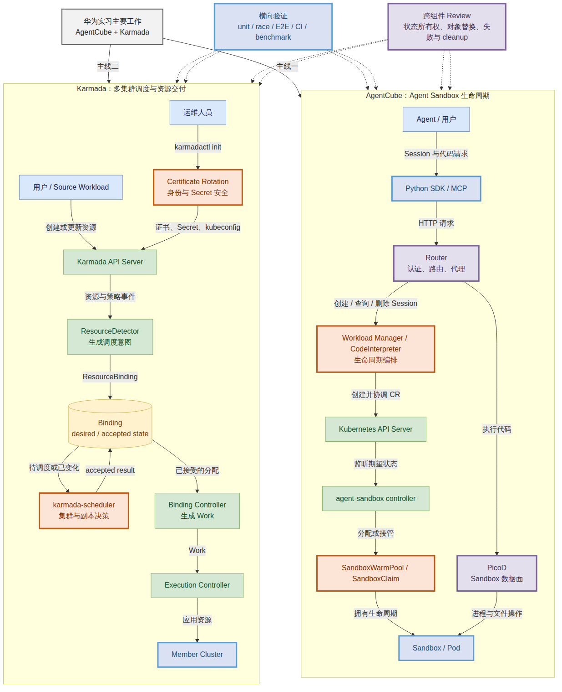

# 华为实习主要工作输出及总结：AgentCube 与 Karmada

| 字段 | 内容 |
| --- | --- |
| 实习生 | 待填写 |
| 部门 / 团队 | 华为开源相关团队（待补充正式名称） |
| 导师 | 待填写 |
| 主要项目 | [volcano-sh/agentcube](https://github.com/volcano-sh/agentcube)、[karmada-io/karmada](https://github.com/karmada-io/karmada) |
| 核心实习证据期 | 2026-06-11 至 2026-08-11 |
| Karmada 收尾记录 | 延长至 2026-08-27 |
| 社区状态校准日期 | 2026-08-31 |

> 统计口径：核心两个月的学习和时间分配以 AgentCube `intern` 分支的 Day 1-60、Week 1-9 和 Git 历史为依据；为完整呈现后续交付，Karmada 专项补充至 2026-08-27。2026-08-31 的查询只校正 PR 的已合入、仍开放和已关闭状态，不把记录期后的维护者动作算作本人新增产出。

## 一、实习总结

本次实习围绕两个云原生开源项目展开。AgentCube 方向主要处理 Agent 代码执行环境的创建、预热、路由和生命周期，工作落在 Workload Manager、CodeInterpreter、agent-sandbox 兼容、CI 与构建链路；Karmada 方向主要处理多集群资源从调度意图到成员集群交付的过程，工作落在证书轮换、Scheduler、Binding / Work、CI / E2E 和多组件调度。

两条主线共同训练的是同一套工程能力：先确定组件在系统中的位置和状态由谁负责，再用代码、测试和公开 Review 证明改动是否覆盖真实路径。最终在 AgentCube 与 Karmada 两个主仓创建 **26 个 PR**，其中 **18 个已合入、7 个仍开放、1 个已关闭未合入**；加上与项目交付直接相关的 Work API 和绘图工具链贡献，共创建 **29 个 PR**，其中 **21 个已合入**。另创建 **7 个可定位的 Issue**，并对他人 PR 完成 **至少 16 个公开实质 Review**。

实习前期关注“项目能否跑起来”，后期的判断标准变为：改动解决什么问题、状态由谁写入、失败后会留下什么结果、测试是否经过真实调用链、PR 是否只承担一个清楚职责。这是本次实习最主要的能力变化。

## 二、学习、工作与时间分配

### 2.1 分阶段安排

| 阶段 | 时间 | 学习与工作重点 | 主要输出 |
| --- | --- | --- | --- |
| 建立运行基线 | 第 1-2 周 | 跑通 AgentCube、Kubernetes、Redis、Router、Workload Manager、PicoD、Python SDK 和真实 Agent 调用；学习 Go、CRD、controller、Helm 和开源协作流程 | Getting Started 复现、sandbox latency / warm pool benchmark、AgentCube PR #385、版本兼容问题与测试计划 |
| 进入控制面开发 | 第 3 周 | 理解 Session 生命周期、Router 与 Workload Manager 分工、agent-sandbox CRD 和 warm pool；开始 Karmada 传播链路学习 | AgentCube PR #387、Session Runtime 图、Karmada PR #7666、证书轮换 Issue #7690 |
| 工程交付与 CI | 第 4-5 周 | 推进版本兼容、组件清理、release、multi-arch 构建、GitHub Actions 与 Karmada 证书轮换 | AgentCube #403/#414/#415/#416/#420/#422/#423/#429；Karmada #7697/#7728/#7732 |
| 深入测试与 Review | 第 6-7 周 | 从 diff 检查转向恢复状态机、失败路径和 cleanup；处理 AgentCube 兼容收敛与 Karmada E2E / Scheduler 问题 | AgentCube #387 合入及 #400/#431/#437/#442 Review；Karmada #7777/#7791/#7795 与多项 Scheduler Review |
| 版本升级与职责收敛 | 第 8-9 周 | 完成 MCP SDK v2、验证 agent-sandbox v0.5.3、检查对象 ownership 和 replacement；将 Karmada 调度状态拆成可验证职责 | AgentCube #448 合入、#385 更新、#446/#450 Review；Karmada Binding / Work 状态交付分析 |
| Karmada 专项收尾 | 延长记录 Week 10-12 | 围绕多组件调度拆分 trigger、calculation、accepted result 和 failure protection；完成 Work API 依赖更新 | Karmada #7827/#7830/#7833/#7835/#7841，Work API #74，专项最终总结与系统位置图 |

### 2.2 工作类型分配

以下比例按核心证据期内的日报主题、PR、测试和 Review 主任务折算，不是考勤系统的精确工时。一个任务可能同时包含代码和测试，因此只按主要目的归类。

| 工作类型 | 估算占比 | 主要内容 |
| --- | ---: | --- |
| 代码实现、版本兼容与交付 | 30% | AgentCube agent-sandbox / MCP 兼容、warm pool、release / build；Karmada 证书、调度与 Work 交付 |
| PR Review 与开源协作 | 25% | AgentCube / Karmada 代码和方案 Review、作者修改复核、Issue 讨论、提交状态跟踪 |
| 测试、E2E 与性能验证 | 20% | unit、race、E2E、cleanup、warm pool benchmark、multi-arch A/B、CI failure 定位 |
| 架构学习与系统分析 | 20% | AgentCube Session / Sandbox 控制面，Karmada Scheduler / Binding / Work 状态流 |
| 文档与图示整理 | 5% | 日报、周总结、测试记录、Mermaid / draw.io 和答辩材料 |

## 三、本人工作在两个系统中的位置

可编辑源文件为 [final-internship-system-position.mmd](final-internship-system-position.mmd)。图中两条链路是并行的实习工作主线，不表示 AgentCube 与 Karmada 已形成生产集成。橙色节点是主要实现范围，紫色节点是重点 Review 范围，蓝色节点表示测试、CI 和性能验证覆盖。

### 3.1 AgentCube 模块

| 模块 / 边界 | 在系统中的作用 | 本人工作 |
| --- | --- | --- |
| Workload Manager / CodeInterpreter | 接收 Session 请求并编排 Kubernetes 资源生命周期 | 适配 agent-sandbox v0.4.6；独立验证 v0.5.2 / v0.5.3；实现 warm pool 健康状态；Review child ownership 和删除安全 |
| SandboxWarmPool / SandboxClaim / Sandbox | 提供预热资源、Claim 绑定以及 Sandbox / Pod 生命周期 | 分析对象接管、owner reference、UID、版本迁移、pool refill 和 cleanup；补真实 E2E |
| Router / PicoD | Router 负责认证和请求转发，PicoD 在 Sandbox 内执行进程与文件操作 | 分析路由、身份和数据面边界；Review metrics 和终止清理；验证真实调用链 |
| Python SDK / MCP | 向 Agent 和用户提供 Session 与工具调用接口 | 完成 MCP Python SDK v2 迁移；运行 HTTP、stdio、Docker 和集群内 E2E |
| CI / release | 持续验证代码、镜像和 Helm chart，并管理版本与构建 | 完成 branch push validation、chart version、multi-arch builder、Dependabot、runner pinning 和 Go update workflow |

### 3.2 Karmada 模块

| 模块 / 边界 | 在系统中的作用 | 本人工作 |
| --- | --- | --- |
| `karmadactl init` / certificates | 初始化控制面证书、Secret 与 kubeconfig | 设计并实现 leaf certificate rotation，保护 CA、SAN、client identity、external-etcd credentials 和 Secret metadata |
| ResourceDetector / Binding | 将资源和策略变化转换为调度意图，并保存期望与已接受结果 | Review waiting store identity；设计 component result API、旧版本写入保护和 source-change trigger |
| `karmada-scheduler` | 选择集群、计算副本并提交调度结果 | Review health / affinity / debounce；实现 component result、scale calculation 和 failure protection |
| Binding Controller / Work | 将已接受的分配结果转换为 Work 并下发成员集群 | 设计 Work update guard，失败时保留旧结果与旧 Work，避免部分更新被当成成功 |
| E2E / CI | 验证安装、传播、调度、清理和回归 | 修复 Flink cleanup、Remedy event、`karmadactl top` fixture 和 EstimatorAssumption 测试隔离；分类共享 CI failure |

### 3.3 完成工作需要掌握的知识与技能

| 能力 | 需要掌握的知识 | 实际应用 |
| --- | --- | --- |
| Go 与控制器开发 | interface、context、error、goroutine、race、controller-runtime、client-go、reconcile、event predicate | AgentCube 生命周期与 deadline；Karmada RemedyActions、ResourceDetector、Binding 更新和调度 Review |
| Kubernetes API | CRD、owner reference、UID、resourceVersion、served / stored version、webhook、RBAC、finalizer、status | agent-sandbox 版本迁移、对象替换保护、component result API、旧版本写入保护 |
| 云原生交付 | Helm、Docker / buildx、multi-arch、GitHub Actions、DCO、codegen、release version | AgentCube release / CI / build，Karmada runner 与 E2E 修复 |
| 多集群调度 | Policy、Binding、Work、affinity、replica estimator、Descheduler | Karmada #7492、#7662、#7830、#7833、#7835、#7841 |
| 证书与身份 | CA、SAN、client certificate、Secret、kubeconfig、external etcd | Karmada `--cert-mode=rotate` 和无意外写入回归测试 |
| 测试与性能 | p50 / p95 / p99、并发、counterfactual、E2E、cleanup、CI 日志 | warm pool benchmark、buildx A/B、Karmada flake 因果验证、版本迁移 E2E |
| 架构与 Review | 控制面 / 数据面、状态所有权、失败恢复、职责拆分、exact-head | AgentCube Sandbox 生命周期与 Karmada desired / accepted / delivered 状态检查 |

## 四、主要工作输出

### 4.1 AgentCube：从运行基线到版本兼容

实习开始阶段先跑通 AgentCube 的完整请求链路，并把 Sandbox 基础设施耗时与上层 Agent 处理耗时分开。顺序 5 次测试的 `total` p50 约为 `177.14 ms`；并发 10、`warmPoolSize=2` 时 p50 约为 `7315.21 ms`，扩大到 `warmPoolSize=10` 后 p50 降至约 `436-565 ms`，说明性能问题主要来自预热池容量不足，而继续扩大到 20 没有明显收益。

在此基础上推进版本和生命周期工作：

- AgentCube PR [#387](https://github.com/volcano-sh/agentcube/pull/387) 将 CodeInterpreter warm pool 适配到 agent-sandbox v0.4.6，补充真实 deadline 和目标 E2E，于 2026-07-16 合入。
- AgentCube PR [#448](https://github.com/volcano-sh/agentcube/pull/448) 完成 MCP Python SDK v2 迁移，覆盖 Streamable HTTP、stdio、Docker rollout 和集群内 MCP E2E，于 2026-07-30 合入。
- AgentCube PR [#385](https://github.com/volcano-sh/agentcube/pull/385) 实现 `WarmPoolAvailable`，代码与验证已完成，当前仍等待 maintainer review，不能表述为已合入。
- 独立验证 agent-sandbox v0.5.2 / v0.5.3 适配，覆盖 v1beta1 API、UID adoption、删除 / GC、pool refill 和 conversion webhook，用于检查上游升级方案是否遗漏真实迁移路径。

### 4.2 AgentCube：CI、release 与构建效率

| PR | 交付结果 | 状态 / 效果 |
| --- | --- | --- |
| #403 | 删除没有进入默认 chart、release 和 E2E 的 `agentd` | 已合入，15 个文件净删除 683 行 |
| #414 | 为 9 类既有 workflow 增加 branch push validation | 已合入，fork 9/9 checks 通过 |
| #415 | 增加 proposal 索引、模板和贡献入口 | 已合入 |
| #416 | 分离 Docker tag、Helm chart version 与 app version | 已合入，真实 release run 生成并推送 `agentcube-0.0.0.tgz` |
| #420 | multi-arch image 使用 runner 原生 Go builder，目标镜像架构保持不变 | 已合入，job wall time 从 1610 秒降到 331 秒，约减少 79.4% |
| #422 | 为非标准路径 Dockerfile 增加 base image Dependabot 覆盖 | 已合入，并由 fork 自动生成的更新 PR 验证 |
| #423 | 将 11 个浮动 `ubuntu-latest` 固定到 `ubuntu-24.04` | 已合入，actionlint、YAML 和 9/9 checks 通过 |
| #429 | 每周检查 Go 版本并同步 `go.mod` 与 3 个 builder tag | 仍开放；2026-08-31 head `8bfb7bf0` 的普通 E2E 通过、CodeInterpreter E2E 失败，等待后续处理与维护者决定 |

### 4.3 Karmada：证书、CI 与 E2E

Karmada PR [#7697](https://github.com/karmada-io/karmada/pull/7697) 为 `karmadactl init` 增加 `--cert-mode=rotate`。实现限定了恢复时必须保持的内容：复用 CA、保留 SAN、保持 client identity、只保留 external-etcd credentials、更新 Secret 时保留 metadata，并确保最后一次写入失败后重跑可以继续收敛。三节点 host kind 实验覆盖 10 分钟 leaf certificate 过期、轮换到 8760h、按顺序重启控制面并恢复两个 Push member 和 APIService；17 项 checks 通过。该 PR 截止记录期仍 open。

已合入的 CI / E2E 代表工作：

| PR | 交付结果 | 解决的问题 |
| --- | --- | --- |
| #7728 | 将 18 个 GitHub Actions workflows 固定到 Ubuntu 24.04 | 避免 runner 镜像变化带来的不可控漂移 |
| #7732 | 等待 control-plane CRD、member CRD 和 `Cluster.Status.APIEnablements` 三层 cleanup | 防止前一项测试残留污染后一项测试 |
| #7777 | 让 `RemedyActions` 状态变化触发 reconcile | 通过 test-only fail、fix pass、reverse-patch fail 证明事件遗漏与结果之间的因果关系 |
| #7795 | 使用稳定 Pod fixture 修复 `karmadactl top` E2E 生命周期竞争 | 降低测试对象过早退出造成的不稳定 |

### 4.4 Karmada：多组件调度与状态交付

Karmada Issue #7492 的目标是让一个 workload 内的多个组件分别计算和保存副本结果。原方案同时包含 API、触发、计算和 Work 更新，后续拆为边界清楚的 PR：

| PR | 唯一职责 | 截止 2026-08-27 状态 |
| --- | --- | --- |
| #7830 | 比较 desired components 与 accepted snapshot，决定是否触发 scale rescheduling | open，等待 CI / review |
| #7833 | Scheduler 持久化每个集群的 accepted component result | 已合入 |
| #7835 | 计算 positive delta；scale-down 跳过 estimator；不支持的情况直接失败 | open，等待 CI / review |
| #7841 | 只有调度成功才提交新 accepted result；失败时保留旧 result 和旧 Work | open，等待 CI / review |

配套 PR #7827 将 EstimatorAssumption E2E 放到独立集群，避免前一测试的 taint 和 scale 残留影响后一测试。当前明确保留一个未覆盖边界：`TargetCluster.Components` 只保存 replicas，没有记录 CPU / memory 要求来自哪个 workload 版本，因此副本和资源要求同时变化时仍不能宣称已经完整支持。

### 4.5 Review 与工程判断

至少 16 个公开实质 Review 对象分布在两个项目：AgentCube #400、#431、#437、#442、#446、#450；Karmada #6863、#7623、#7662、#7692、#7764、#7779、#7800、#7810、#7846、#7860。

代表性结果包括：

- 在 AgentCube #400 中用 32 个自定义 HTTP method 复现无界 metrics label，作者随后加入受限分类和真实 middleware tests。
- 在 AgentCube #450 中发现“检查 ownership 后再按名称删除”存在同名对象替换窗口，推动加入 UID / resourceVersion precondition 和 replacement regression tests。
- 在 Karmada #7800 中指出 waiting store 仅按名称匹配可能让旧对象状态误配到同名新对象。
- 在 Karmada #7810 中区分 `AddAfter` 的固定延迟与真正 trailing-edge debounce，明确其他 producer 和 leader restart 对保证的影响。
- 在 Karmada #7662 中明确 controller 与 scheduler 不能同时写同一 Binding 状态，需要唯一数据来源、请求 / 确认过程和 Descheduler 优先级。

### 4.6 文档、版本、问题单与测试资产

| 输出类型 | AgentCube 记录 | Karmada 记录 | 说明 |
| --- | ---: | ---: | --- |
| 编号 Day 主题 | 60 | 59 | 两个分支各自独立编号，不合并为工时 |
| Day Markdown | 69 | 86 | 包含主报告、专项分析、Review 和验证记录 |
| 周总结 | 9 | 10 | AgentCube Week 1-9；Karmada Week 3-12，时间存在重叠 |
| 图示与演示资产 | 28 个图示资产 | 30 Mermaid、34 PNG、4 draw.io、5 SVG、2 HTML | 用于架构、状态流、Review 和技术汇报 |
| 原始测试 / Review 文件 | 143 | 按任务保存于各专项目录 | AgentCube 一侧约 2.8 MiB；Karmada 以 task-oriented 报告保存关键证据 |

涉及的主要版本包括 agent-sandbox v0.4.6 / v0.5.2 / v0.5.3、MCP Python SDK v2、Go 1.26.x、Kubernetes v1.32.5 测试环境和 Work API Kubernetes v1.36.4 依赖。所有版本结论均绑定对应 PR、分支或测试记录，不把后续版本的验证倒填到早期 PR。

## 五、量化输出与状态

### 5.1 本人创建的 PR

| 项目 | 创建 PR | 已合入 | 仍开放 | 已关闭未合入 |
| --- | ---: | ---: | ---: | ---: |
| AgentCube | 14 | 11 | 2（#385、#429） | 1（#390 验证 PR） |
| Karmada | 12 | 7 | 5（#7697、#7827、#7830、#7835、#7841） | 0 |
| **两个主仓小计** | **26** | **18** | **7** | **1** |
| kubernetes-sigs/work-api | 1 | 1 | 0 | 0 |
| Agents365-ai/drawio-skill | 2 | 2 | 0 | 0 |
| **全部相关输出** | **29** | **21** | **7** | **1** |

> open 表示本人已提交代码或验证，但维护者仍负责 Review 和合入决定。报告不把 open 写成完成，也不把本地测试通过写成社区接受。

### 5.2 Issue 与 Review

| 类型 | 数量 | 范围 |
| --- | ---: | --- |
| 本人创建的 Issue | 7 | AgentCube 2、Karmada 4、开发工具问题 1 |
| 公开实质 PR Review | 至少 16 | AgentCube 6、Karmada 10；按可定位的他人 PR 对象去重 |

### 5.3 代表性测试与版本证据

| 工作 | 版本 / head | 验证证据 | 证据边界 |
| --- | --- | --- | --- |
| AgentCube #387 | agent-sandbox v0.4.6 | official 12/12 checks、目标 CodeInterpreter E2E、deadline regression | 不包含后续 v0.5.x 行为 |
| AgentCube #448 | MCP Python SDK v2 | local HTTP / stdio / Docker / in-cluster MCP E2E，upstream 13/13 checks | 只覆盖 CodeInterpreter MCP migration |
| AgentCube #385 | v0.5.3-based branch | upstream 非 Tide 13/13、fork 9/9 workflows、CodeInterpreter E2E | 当前仍等待 maintainer labels / review |
| AgentCube #420 | multi-arch build | 两组 branch checks、产物架构核对、1610 s 降至 331 s | 未宣称 PicoD arm64 系统包安装已优化 |
| Karmada #7697 | `--cert-mode=rotate` | 17 项 checks、真实过期证书恢复、部分写入后重跑 | 不包含 CA / external-etcd rotation 和自动重启 |
| Karmada #7732 / #7777 | cleanup / event predicate | test-only、fix、reverse-patch 与 E2E | 不把共享 CI host I/O stall归因于产品代码 |
| Karmada #7830/#7835/#7841 | #7492 PR 栈 | unit / race、E2E compile、部分 upstream workflows | 尚未完成完整 Flink quota / no-fit live E2E |

## 六、最有成就感的工作

### 6.1 将 AgentCube 兼容改动推进到真实生命周期验证

AgentCube #387 最能体现能力变化。最初把版本兼容理解为修改依赖和 import，Review 后才发现还要处理 warm-pool adoption、claim deadline、owner reference、NetworkPolicy、manifest 版本、SDK 和 cleanup。最终目标 E2E 实际执行并通过，PR 进入上游主线。此后处理 v0.5.2 / v0.5.3 时，能够先列出编译、存储、生命周期、权限、清理和 E2E 六类风险，而不是只从编译错误开始。

### 6.2 用测量把多架构构建从 27 分钟降到约 5.5 分钟

AgentCube #420 先对构建阶段计时，确认主要时间花在 QEMU 下运行 arm64 Go compiler，再只调整 3 个 Dockerfile 的 builder platform，使编译在 runner 原生架构执行，最终镜像仍输出 amd64 / arm64。job wall time 从 1610 秒降到 331 秒，约减少 79.4%。该工作证明性能优化应从测量开始，并保持改动范围与已证明的问题一致。

### 6.3 将 Karmada 大功能拆成可独立 Review 的交付步骤

Karmada #7492 最初将 API、触发、计算和 Work 更新放在一起。后续拆成 trigger、accepted result、calculation 和 failure protection，其中 #7833 已合入，其他 PR 各自保留清楚的职责和未覆盖边界。拆分后可以分别回答“为什么触发、计算什么、什么时候提交结果、失败后保留什么”，也降低了多个 PR 并行修改同一状态时的 Review 成本。

### 6.4 将 CI 偶发失败转化为可证明的问题

Karmada #7732 和 #7777 分别定位到 cleanup barrier 与 event predicate。两项都保留失败时序和修改前后对照；对于多个 etcd 同时出现 `fdatasync` stall 的共享基础设施问题，则没有通过增加超时和重试掩盖。由此形成了“先找产生失败的组件，再看最终失败的测试”的排查方法。

## 七、完成不理想的工作与原因

### 7.1 AgentCube #385 和 #429 尚未合入

#385 的实现、版本迁移和 E2E 已完成，但仍依赖 agent-sandbox 升级、ownership 修复和维护者 Review；#429 的工作流实现已提交，但 Go baseline 多次变化，2026-08-31 的最新 head 仍有 CodeInterpreter E2E 失败。实习期内完成的是可审查代码与验证，合入状态仍由维护者和 CI 决定。

改进方向是更早画出 feature、runtime prerequisite 和 repository-wide follow-up 的依赖关系，并在每次上游 main 前进后重新验证当前 head，不用追加无关提交代替外部决策。

### 7.2 Karmada 证书轮换和多组件调度仍有未完成边界

#7697 已完成 17 项检查和真实证书恢复，但自动重启、HA 操作手册、CA / external-etcd rotation 以及 Helm / operator 支持不在第一版范围。#7492 PR 栈已完成职责重构和部分验证，但还没有完整运行 Flink quota / no-fit live E2E。

改进方向是保持第一版边界，不为追求“看起来完整”加入未经维护者确认的功能；在 PR 栈稳定后补真实多集群 E2E，并把“如何记录资源要求来自哪个 workload 版本”作为明确的后续设计问题。

### 7.3 调研和文档投入一度偏多

两个仓库保存了较完整的 Day 和周总结，但早期存在同一任务拆成多份调研、CI 和 rebase 记录的问题。文档能够保存证据，却不能代替代码交付、Review 结论和测试结果。

后续改为按任务维护一份主要记录，每个调研开始前先写明要支持的决定，证据足以回答后停止扩展。

## 八、困难、对策与解决方法

| 困难 | 具体表现 | 采取的对策 | 结果 |
| --- | --- | --- | --- |
| Kubernetes 环境差异 | standard kind 在 kubelet / cgroup / QoS 初始化失败 | 使用可工作的 k3s / k3d；记录主机条件；同类环境错误连续出现后停止重复调试 | 完成 AgentCube focused E2E，并保留 kind 环境限制 |
| KVM 权限不足 | 无法运行真实 Firecracker / MicroVM 路径 | 运行前检查 CPU virtualization、`/dev/kvm` 和用户权限；不伪造性能数据 | 把不能实测的内容降为源码或公开资料分析 |
| CI 绿色但目标未执行 | 兼容 PR 的 E2E 安装旧 runtime，目标 case 还可能被筛选条件跳过 | 检查安装日志、运行版本和 test filter；增加目标 job 与版本门禁 | v0.4.6 真实生命周期测试实际执行并通过 |
| 同名对象替换 | ownership 检查后按名称删除，可能删除后来创建的新对象 | 使用 UID / resourceVersion precondition，并增加 replacement regression | AgentCube #450 修复该窗口并补回归测试 |
| 多个组件写同一状态 | Karmada controller、scheduler 和 Policy 可能同时改 Binding | 先定义 desired、accepted、delivered state 和唯一写入者，再决定 API 与重试 | #7492 收敛为多个边界清楚的 PR |
| E2E 最终失败位置误导排查 | 最终失败的 spec 不一定是留下残留的测试 | 同时记录资源创建、清理、共享状态、后续测试和断言的时间线 | #7827 使用独立集群隔离前一测试残留 |
| 多任务和 PR 依赖 | 调研、代码、Review、周总结并行，多个专项 PR 又有提交顺序 | 用周目标、依赖图、唯一职责和停止条件；先合数据结构 / accepted result，再提交使用方和 failure guard | 减少重复实现，也让每个 PR 可以独立说明和验证 |
| Review 难以被作者理解 | 评论技术正确，但需要读完整本地报告才能理解 | 写清代码位置、触发条件、具体后果、证据和最小修改方向 | 作者可以直接复现问题并判断是否修改 |

## 九、完成任务过程中的收获

1. **先明确状态由谁负责。** 控制器和分布式系统的问题往往来自多个组件同时写状态、对象被替换、缓存过期或失败后部分提交。先确认唯一数据来源，再设计状态变化和重试。
2. **测试必须经过真实调用路径。** 手工构造对象可能绕过 webhook、API validation、controller 默认值和生命周期事件；CI job 名称也不能证明目标测试实际执行。
3. **一个 PR 只做一件边界清楚的事。** PR 需要说明数据由谁使用、必须满足什么规则、违反后会发生什么问题，不能把所有“感觉更安全”的保护逻辑都放进去。
4. **Agent 生成的防御性代码需要多方验证。** 实现新特性时先从现有接口、调用方、测试和维护者要求确认保护逻辑是否必要，不能在假想风险上不断增加绕行代码。
5. **Review 的输出是可执行决定。** 有价值的 Review 应让作者看懂触发条件、后果和最小修正方向，而不是堆技术名词或评论数量。
6. **本人完成与社区接受是两种状态。** 可以完成代码、测试和 Review，但 maintainer approval、合入和发布仍由社区负责，对外汇报时必须分开。

## 十、答辩陈述建议（10 分钟）

| 时间 | 内容 | 建议重点 |
| ---: | --- | --- |
| 1 分钟 | 项目与职责 | AgentCube 负责 Agent Sandbox 生命周期，Karmada 负责多集群资源调度与交付；说明本人位于两条链路的哪些模块 |
| 1 分钟 | 学习与工作安排 | 从运行基线、代码实现、CI / E2E 到状态所有权和跨组件 Review 的阶段变化 |
| 2 分钟 | AgentCube 代表工作 | #387 为什么不只是升级依赖；#420 如何用 A/B 测量将构建从 1610 秒降到 331 秒 |
| 2 分钟 | Karmada 代表工作 | #7697 如何保护证书身份；#7732/#7777 如何从偶发失败找到真正产生问题的环节 |
| 2 分钟 | 多组件调度 | desired、accepted、delivered 三层是什么；#7830/#7833/#7835/#7841 为什么需要拆开 |
| 1 分钟 | 输出数据 | 两个主仓 26 PR、18 合入、7 open、1 closed；7 Issue、至少 16 个实质 Review；文档和测试资产 |
| 1 分钟 | 不足与收获 | open PR、live E2E、环境权限和文档投入边界；说明后续如何改进 |

## 十一、证据索引

AgentCube 证据：

- [Week 1：AgentCube 调研、测评与协作](week1-summary.md)
- [Week 2：从写代码转向审代码与工程判断](week2-summary.md)
- [Week 3：Session Runtime Control Plane](week3-summary.md)
- [Week 4：可验证的工程闭环](week4-summary.md)
- [Week 5：构建、CI、版本适配与架构 Review](week5-summary.md)
- [Week 6：agent-sandbox 适配、Karmada 修复与 PR Review](week6-summary.md)
- [Week 7：版本升级 Review、运行时安全与 Karmada 调度修复](week7-summary.md)
- [Week 8：MCP SDK v2 合入、v0.5.3 独立验证与 Final-Head Review](week8-summary.md)
- [Week 9：Ownership 修复验收、升级实证与实习收尾](week9-summary.md)

Karmada 证据：

- [Karmada 实习专项：主要工作输出与总结](https://github.com/ranxi2001/karmada/blob/intern/internship-reports/final-karmada-internship-work-summary.md)
- [Week 3：进入 Karmada](https://github.com/ranxi2001/karmada/blob/intern/internship-reports/week3-summary.md)
- [Week 4：证书轮换](https://github.com/ranxi2001/karmada/blob/intern/internship-reports/week4-summary.md)
- [Week 5：CI / Flake](https://github.com/ranxi2001/karmada/blob/intern/internship-reports/week5-summary.md)
- [Week 6：证书、Review 与 Remedy](https://github.com/ranxi2001/karmada/blob/intern/internship-reports/week6-summary.md)
- [Week 7：Scheduler Review 与回归提交](https://github.com/ranxi2001/karmada/blob/intern/internship-reports/week7-summary.md)
- [Week 8：Waiting Store、Queue 与 Descheduler](https://github.com/ranxi2001/karmada/blob/intern/internship-reports/week8-summary.md)
- [Week 9：Descheduler 与 Binding Update Review](https://github.com/ranxi2001/karmada/blob/intern/internship-reports/week9-summary.md)
- [Week 10：#7492 API 与 E2E causality](https://github.com/ranxi2001/karmada/blob/intern/internship-reports/week10-summary.md)
- [Week 11：Accepted result 与 failure safety](https://github.com/ranxi2001/karmada/blob/intern/internship-reports/week11-summary.md)
- [Week 12：Phase IV 重构与收尾](https://github.com/ranxi2001/karmada/blob/intern/internship-reports/week12-summary.md)

> 最终结论：本次实习完成了从项目入门、代码实现、版本兼容和测试，到跨组件 Review、CI / E2E 定位和开源交付的完整训练。AgentCube 让我理解 Agent Sandbox 的生命周期和交付链路，Karmada 让我理解多集群调度中 desired、accepted、delivered 状态的分工。相比单个技术名词或提交数量，更重要的输出是能够说明改动解决什么问题、证据是否覆盖真实路径、失败后系统会留下什么状态，以及当前结果仍由谁负责。
